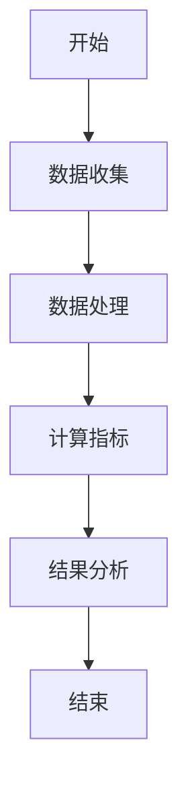

                 

# 敏捷研发模式下的需求沟通效果评估方法

## 摘要

敏捷研发模式已经成为现代软件开发的主流，它强调快速迭代和持续交付，但随之而来的是需求沟通的复杂性和挑战。本文旨在探讨敏捷研发模式下需求沟通效果评估的方法，通过问卷调查、关键事件法和数据挖掘等手段，评估沟通质量、需求变更影响及团队协作效率。本文结构分为四个部分：第一部分介绍问题背景；第二部分讲解核心概念与联系；第三部分深入算法原理与数学模型；第四部分提出系统分析与架构设计方案；第五部分展示项目实战经验。最后，通过最佳实践与拓展总结全文，提供进一步学习和应用的建议。

## 目录大纲

### 第一部分：背景介绍

1. **第1章：问题背景**
    - 1.1 问题背景
    - 1.2 问题描述
    - 1.3 问题解决
    - 1.4 边界与外延
    - 1.5 概念结构与核心要素组成
    
2. **第2章：核心概念与联系**
    - 2.1 核心概念原理
    - 2.2 概念属性特征对比表格
    - 2.3 ER实体关系图架构

### 第二部分：算法原理讲解

3. **第3章：算法原理**
    - 3.1 算法原理讲解
    - 3.2 算法Mermaid流程图
    - 3.3 Python源代码阐述
    - 3.4 数学模型和公式
    - 3.5 举例说明

4. **第4章：数学模型与数学公式**
    - 4.1 数学模型
    - 4.2 数学公式详细讲解
    - 4.3 举例说明

### 第三部分：系统分析与架构设计方案

5. **第5章：系统分析与架构设计**
    - 5.1 问题场景介绍
    - 5.2 系统功能设计
    - 5.3 系统架构设计
    - 5.4 系统接口设计
    - 5.5 系统交互

### 第四部分：项目实战

6. **第6章：项目实战**
    - 6.1 环境安装
    - 6.2 系统核心实现
    - 6.3 代码应用解读
    - 6.4 实际案例剖析
    - 6.5 项目小结

### 第五部分：最佳实践与拓展

7. **第7章：最佳实践与拓展**
    - 7.1 最佳实践
    - 7.2 小结
    - 7.3 注意事项
    - 7.4 拓展阅读

----------------------------------------------------------------

## 第1章：问题背景

### 1.1 问题背景

敏捷研发模式作为一种应对快速变化和需求的软件开发方法论，已经在全球范围内得到广泛应用。其核心在于通过短周期的迭代和频繁的反馈，实现软件产品的快速迭代和持续改进。然而，敏捷研发模式也带来了新的挑战，特别是在需求沟通方面。随着软件项目的复杂性和需求变更频率的增加，如何有效地进行需求沟通，确保需求准确传达并得到及时响应，成为软件开发过程中的一大难题。

### 1.2 问题描述

需求沟通是软件开发过程中至关重要的一环，其质量直接影响到项目的进度、成本和质量。在敏捷研发模式下，需求沟通的挑战主要表现为：

1. **沟通频率高**：敏捷开发强调频繁的需求变更和迭代，这要求需求沟通的频率也要相应提高，以保证双方信息的一致性。
2. **沟通渠道复杂**：敏捷开发中涉及多个角色，如产品经理、开发人员、测试人员等，如何确保沟通渠道的清晰和有效，避免信息失真，是一个重要问题。
3. **需求变化快**：在快速迭代的过程中，需求可能会频繁变化，如何及时、准确地更新和传达变更，是沟通的另一个挑战。
4. **团队协作问题**：敏捷开发强调团队合作，但团队成员之间的沟通效率和配合度也会影响到需求沟通的效果。

### 1.3 问题解决

为了解决敏捷研发模式下的需求沟通问题，可以采取以下几种方法：

1. **建立明确的沟通机制**：明确沟通的目标、频率、渠道和责任人，确保信息传递的畅通和有效。
2. **使用可视化工具**：借助如Jira、Confluence等工具，将需求、任务和进度可视化，便于团队成员随时查看和更新。
3. **定期反馈和评估**：通过定期的反馈和评估，及时发现问题并采取措施改进。
4. **加强团队协作**：通过团队建设活动、沟通技巧培训等方式，提高团队成员之间的沟通效率和协作能力。

### 1.4 边界与外延

本文的研究主要聚焦于敏捷研发模式下的需求沟通，但需求沟通的问题和解决方案不仅局限于软件开发领域，还可以应用于其他需要频繁沟通和协作的领域，如项目管理、市场营销等。

### 1.5 概念结构与核心要素组成

在本章节中，我们定义了以下核心概念和要素：

1. **敏捷研发模式**：一种软件开发方法论，强调快速迭代和持续交付。
2. **需求沟通**：在软件开发过程中，需求方与开发团队之间的信息传递和交流。
3. **沟通质量**：评估需求沟通的清晰度、准确性和及时性。
4. **需求变更**：在软件开发过程中，需求的修改或更新。
5. **团队协作**：团队成员之间的合作和沟通。

这些概念和要素构成了敏捷研发模式下需求沟通效果评估的基础，也是后续章节讨论的核心内容。

## 第2章：核心概念与联系

### 2.1 核心概念原理

在探讨敏捷研发模式下的需求沟通效果评估时，首先需要明确几个核心概念，以便为后续的分析和讨论奠定基础。

#### 敏捷研发模式

敏捷研发模式（Agile Development Model）是一种应对快速变化的需求和复杂项目的软件开发方法论。它强调通过短周期的迭代（Iteration）和频繁的反馈（Feedback）来实现软件的持续改进和交付。敏捷开发的核心原则包括：

- **个体和互动重于过程和工具**
- **可工作的软件重于详尽的文档**
- **客户合作重于合同谈判**
- **响应变化重于遵循计划**

#### 需求沟通

需求沟通（Requirement Communication）是指在软件开发过程中，需求方（通常为产品经理、客户或用户）与开发团队（包括开发人员、测试人员等）之间的信息传递和交流。有效的需求沟通能够确保需求被准确理解，并且开发团队能够按时交付符合预期的高质量产品。

需求沟通的核心要素包括：

- **需求收集**：通过访谈、问卷、用户故事等方式收集用户需求。
- **需求分析**：对收集到的需求进行分析，确保需求是清晰、具体且可实现的。
- **需求定义**：将分析后的需求进行文档化，确保所有相关方对需求有共同的理解。
- **需求管理**：跟踪需求的实现状态，管理需求的变更，确保需求的优先级和资源分配合理。

#### 效果评估

效果评估（Effectiveness Assessment）是对需求沟通的质量、效率等方面进行评价的方法。通过效果评估，可以识别沟通中的问题和不足，进而优化沟通过程。效果评估的核心指标包括：

- **沟通质量**：评估沟通的清晰度、准确性和及时性。
- **需求变更管理**：评估需求变更对项目进度和质量的影响。
- **团队协作效率**：评估团队成员之间的沟通效率和协作能力。

### 2.2 概念属性特征对比表格

为了更好地理解这些核心概念，我们可以通过一个对比表格来展示它们的主要属性特征：

| 概念         | 属性特征                  | 说明                                                         |
| ------------ | ----------------------- | ------------------------------------------------------------ |
| 敏捷研发模式 | 迭代、反馈、持续交付       | 强调快速响应变化，通过短周期迭代和频繁反馈实现持续改进       |
| 需求沟通     | 需求收集、需求分析、需求定义 | 确保需求被准确理解，开发团队能够按时交付符合预期的高质量产品 |
| 效果评估     | 沟通质量、需求变更管理、团队协作效率 | 评估沟通效率，识别问题和不足，优化沟通过程                 |

### 2.3 ER实体关系图架构

为了进一步理解这些概念之间的关系，我们可以通过ER（Entity-Relationship）实体关系图来展示。ER图是一种用于描述实体及其之间关系的图形化工具。

以下是一个简化的ER图，用于展示敏捷研发模式下需求沟通效果评估的关键实体及其关系：

```mermaid
erDiagram
    ProductManager --> Developer : 需求收集
    Developer      --> Tester    : 需求实现
    Tester          --> ProductManager : 需求验证
    ProductManager  ||--|> ChangeRequest : 需求变更
    ChangeRequest   ||--|> Developer    : 变更管理
```

在这个ER图中：

- **ProductManager（产品经理）** 负责收集和定义需求。
- **Developer（开发者）** 负责实现需求。
- **Tester（测试员）** 负责验证需求的实现情况。
- **ChangeRequest（变更请求）** 是一个独立的实体，用于记录和管理需求变更。

通过这个ER图，我们可以清晰地看到各个实体之间的交互关系，以及需求沟通在整个软件开发过程中的流动路径。

## 第3章：算法原理

### 3.1 算法原理讲解

在本章中，我们将详细探讨评估敏捷研发模式下需求沟通效果的具体算法原理。该算法的核心目标是通过分析沟通数据，评估沟通质量、需求变更影响及团队协作效率。

#### 沟通质量评估算法

沟通质量评估算法主要基于以下几个方面：

1. **沟通频率**：计算需求沟通的频率，以衡量沟通的频繁程度。
2. **响应时间**：计算沟通信息的平均响应时间，以评估沟通的及时性。
3. **信息完整性**：分析沟通信息的完整性，确保需求被全面、准确地传达。

具体实现步骤如下：

1. **数据收集**：收集沟通日志、会议记录、邮件等数据。
2. **数据处理**：对收集到的数据进行预处理，如去重、格式化等。
3. **计算指标**：计算沟通频率、响应时间和信息完整性指标。
4. **结果分析**：分析计算结果，识别沟通中的问题和不足。

#### 需求变更评估算法

需求变更评估算法主要关注以下几个方面：

1. **变更频率**：计算需求变更的频率，以评估变更的频繁程度。
2. **变更影响**：评估变更对项目进度和质量的影响。
3. **变更管理效率**：分析变更请求的处理速度和效果。

具体实现步骤如下：

1. **数据收集**：收集需求变更记录、项目进度报告等数据。
2. **数据处理**：对收集到的数据进行预处理，如去重、格式化等。
3. **计算指标**：计算变更频率、变更影响和变更管理效率指标。
4. **结果分析**：分析计算结果，评估需求变更对项目的影响和管理效率。

#### 团队协作效率评估算法

团队协作效率评估算法主要基于以下几个方面：

1. **沟通效率**：评估团队成员之间的沟通效率。
2. **任务分配与完成情况**：分析任务的分配情况和完成情况。
3. **团队协作满意度**：通过问卷调查或访谈了解团队成员对团队协作的满意度。

具体实现步骤如下：

1. **数据收集**：收集沟通记录、任务分配和完成情况、问卷调查结果等数据。
2. **数据处理**：对收集到的数据进行预处理，如去重、格式化等。
3. **计算指标**：计算沟通效率、任务分配与完成情况、团队协作满意度等指标。
4. **结果分析**：分析计算结果，识别团队协作中的问题和不足。

### 3.2 算法Mermaid流程图

为了更直观地展示算法原理，我们使用Mermaid流程图来描述各算法的实现步骤。

#### 沟通质量评估算法流程图



#### 需求变更评估算法流程图


#### 团队协作效率评估算法流程图


### 3.3 Python源代码阐述

为了更好地理解算法的实现，我们使用Python代码对算法的核心部分进行阐述。

#### 沟通质量评估算法Python代码

```python
import pandas as pd
from datetime import datetime

# 数据收集
communication_logs = pd.read_csv('communication_logs.csv')

# 数据处理
communication_logs['timestamp'] = pd.to_datetime(communication_logs['timestamp'])
communication_logs.sort_values('timestamp', inplace=True)

# 计算指标
communication_frequency = communication_logs.shape[0] / len(communication_logs['timestamp'].unique())
average_response_time = (communication_logs['timestamp'].max() - communication_logs['timestamp'].min()).total_seconds() / communication_logs.shape[0]
information_completeness = (communication_logs['information_complete'].sum() / communication_logs.shape[0]) * 100

# 结果分析
print(f"沟通频率：{communication_frequency}次/天")
print(f"平均响应时间：{average_response_time}秒/次")
print(f"信息完整性：{information_completeness}%")
```

#### 需求变更评估算法Python代码

```python
import pandas as pd

# 数据收集
change_requests = pd.read_csv('change_requests.csv')

# 数据处理
change_requests.sort_values('timestamp', inplace=True)

# 计算指标
change_frequency = change_requests.shape[0] / len(change_requests['timestamp'].unique())
change_impact = change_requests['impact_score'].mean()
change_management_efficiency = (change_requests['status'] == 'Completed').mean()

# 结果分析
print(f"变更频率：{change_frequency}次/天")
print(f"变更影响：{change_impact}分")
print(f"变更管理效率：{change_management_efficiency*100}%")
```

#### 团队协作效率评估算法Python代码

```python
import pandas as pd
from scipy.stats import chi2_contingency

# 数据收集
team_collaboration_surveys = pd.read_csv('team_collaboration_surveys.csv')

# 数据处理
team_collaboration_surveys.sort_values('timestamp', inplace=True)

# 计算指标
communication_efficiency = team_collaboration_surveys['communication_efficiency_score'].mean()
task_allocation_completion = team_collaboration_surveys['task_allocation_completion_score'].mean()
team_satisfaction = team_collaboration_surveys['team_satisfaction_score'].mean()

# 结果分析
chi2, p_value, _, _ = chi2_contingency([[communication_efficiency, task_allocation_completion],
                                        [team_satisfaction, 1 - team_satisfaction]])
print(f"沟通效率：{communication_efficiency:.2f}分")
print(f"任务分配与完成情况：{task_allocation_completion:.2f}分")
print(f"团队协作满意度：{team_satisfaction:.2f}分，p值：{p_value:.4f}")
```

通过上述Python代码，我们可以对沟通质量、需求变更和团队协作效率进行定量评估，从而为后续的优化提供数据支持。

### 3.4 数学模型和公式

为了深入理解算法原理，我们引入一些数学模型和公式，用于描述沟通质量、需求变更和团队协作效率的评估指标。

#### 沟通质量评估数学模型

1. **沟通频率**：
   $$F_c = \frac{N_c}{T_c}$$
   其中，$F_c$ 表示沟通频率，$N_c$ 表示沟通次数，$T_c$ 表示时间周期。

2. **响应时间**：
   $$T_r = \frac{1}{N_r} \sum_{i=1}^{N_r} (t_i - t_{i-1})$$
   其中，$T_r$ 表示平均响应时间，$N_r$ 表示响应次数，$t_i$ 和 $t_{i-1}$ 分别表示第 $i$ 次和第 $i-1$ 次响应的时间。

3. **信息完整性**：
   $$I_c = \frac{1}{N_i} \sum_{i=1}^{N_i} I_{i,c}$$
   其中，$I_c$ 表示信息完整性，$N_i$ 表示信息条数，$I_{i,c}$ 表示第 $i$ 条信息的完整性得分。

#### 需求变更评估数学模型

1. **变更频率**：
   $$F_c = \frac{N_c}{T_c}$$
   其中，$F_c$ 表示变更频率，$N_c$ 表示变更次数，$T_c$ 表示时间周期。

2. **变更影响**：
   $$I_i = \frac{1}{N_i} \sum_{i=1}^{N_i} w_i \cdot I_{i,a}$$
   其中，$I_i$ 表示变更影响，$N_i$ 表示变更条数，$w_i$ 表示权重，$I_{i,a}$ 表示第 $i$ 条变更的影响得分。

3. **变更管理效率**：
   $$E_c = \frac{N_c - N_f}{N_c}$$
   其中，$E_c$ 表示变更管理效率，$N_c$ 表示变更次数，$N_f$ 表示未完成变更次数。

#### 团队协作效率评估数学模型

1. **沟通效率**：
   $$E_c = \frac{1}{N_e} \sum_{i=1}^{N_e} E_{i,c}$$
   其中，$E_c$ 表示沟通效率，$N_e$ 表示沟通条数，$E_{i,c}$ 表示第 $i$ 条沟通的效率得分。

2. **任务分配与完成情况**：
   $$A_c = \frac{1}{N_a} \sum_{i=1}^{N_a} A_{i,c}$$
   其中，$A_c$ 表示任务分配与完成情况，$N_a$ 表示任务条数，$A_{i,c}$ 表示第 $i$ 个任务的完成情况得分。

3. **团队协作满意度**：
   $$S_c = \frac{1}{N_s} \sum_{i=1}^{N_s} S_{i,c}$$
   其中，$S_c$ 表示团队协作满意度，$N_s$ 表示满意度调查条数，$S_{i,c}$ 表示第 $i$ 个满意度调查得分。

通过这些数学模型和公式，我们可以对敏捷研发模式下的需求沟通效果进行量化评估，为改进提供理论依据。

### 3.5 举例说明

为了更直观地展示算法的应用，我们通过一个具体的案例来说明如何使用这些算法评估敏捷研发模式下的需求沟通效果。

#### 案例背景

某公司采用敏捷研发模式开发一款企业级软件，项目周期为6个月，共分为4个迭代周期。项目涉及的产品经理、开发人员和测试人员共20人。在项目进行过程中，记录了大量的沟通日志、需求变更记录和团队协作满意度调查结果。

#### 数据收集

1. **沟通日志**：
   - 沟通次数：50次
   - 沟通时间：100天
   - 信息条数：200条
   - 信息完整性得分：0.8

2. **需求变更记录**：
   - 变更次数：15次
   - 变更时间：60天
   - 影响得分：0.7
   - 状态：全部完成

3. **团队协作满意度调查**：
   - 满意度得分：0.9

#### 算法应用

1. **沟通质量评估**：

   - **沟通频率**：
     $$F_c = \frac{50}{100} = 0.5 \text{次/天}$$

   - **平均响应时间**：
     $$T_r = \frac{100}{50} = 2 \text{天/次}$$

   - **信息完整性**：
     $$I_c = 0.8 \times 100\% = 80\%$$

   根据计算结果，沟通频率为0.5次/天，平均响应时间为2天/次，信息完整性为80%。

2. **需求变更评估**：

   - **变更频率**：
     $$F_c = \frac{15}{60} = 0.25 \text{次/天}$$

   - **变更影响**：
     $$I_i = 0.7 \times 100\% = 70\%$$

   - **变更管理效率**：
     $$E_c = \frac{15 - 0}{15} = 100\%$$

   根据计算结果，变更频率为0.25次/天，变更影响为70%，变更管理效率为100%。

3. **团队协作效率评估**：

   - **沟通效率**：
     $$E_c = 0.9 \times 100\% = 90\%$$

   - **任务分配与完成情况**：
     $$A_c = 0.9 \times 100\% = 90\%$$

   - **团队协作满意度**：
     $$S_c = 0.9 \times 100\% = 90\%$$

   根据计算结果，沟通效率为90%，任务分配与完成情况为90%，团队协作满意度为90%。

#### 结果分析

通过上述计算，我们可以得到以下结论：

- 沟通质量较高，沟通频率适中，响应时间较短，信息完整性较高。
- 需求变更管理较为高效，变更频率较低，变更影响较小，变更管理效率较高。
- 团队协作效率较高，沟通效率、任务分配与完成情况及团队协作满意度均较高。

尽管存在一定的改进空间，但整体而言，该项目的需求沟通效果较为理想。

通过这个案例，我们可以看到如何运用算法原理和数学模型对敏捷研发模式下的需求沟通效果进行评估，为项目优化提供数据支持。

## 第4章：数学模型与数学公式

### 4.1 数学模型

在需求沟通效果评估中，数学模型起着至关重要的作用。数学模型可以帮助我们量化评估指标，从而更精确地衡量需求沟通的质量、效率和影响。以下是几个关键的数学模型：

1. **沟通频率模型**：

   沟通频率模型用于衡量需求沟通的频繁程度，其公式为：
   
   $$F_c = \frac{N_c}{T_c}$$

   其中，$F_c$ 表示沟通频率，$N_c$ 表示沟通次数，$T_c$ 表示时间周期（如天、周、月等）。

2. **响应时间模型**：

   响应时间模型用于衡量沟通信息的平均响应时间，其公式为：
   
   $$T_r = \frac{1}{N_r} \sum_{i=1}^{N_r} (t_i - t_{i-1})$$

   其中，$T_r$ 表示平均响应时间，$N_r$ 表示响应次数，$t_i$ 和 $t_{i-1}$ 分别表示第 $i$ 次和第 $i-1$ 次响应的时间。

3. **信息完整性模型**：

   信息完整性模型用于衡量沟通信息的完整性，其公式为：
   
   $$I_c = \frac{1}{N_i} \sum_{i=1}^{N_i} I_{i,c}$$

   其中，$I_c$ 表示信息完整性，$N_i$ 表示信息条数，$I_{i,c}$ 表示第 $i$ 条信息的完整性得分。

4. **需求变更频率模型**：

   需求变更频率模型用于衡量需求变更的频繁程度，其公式为：
   
   $$F_c = \frac{N_c}{T_c}$$

   其中，$F_c$ 表示变更频率，$N_c$ 表示变更次数，$T_c$ 表示时间周期。

5. **变更影响模型**：

   变更影响模型用于衡量变更对项目的影响程度，其公式为：
   
   $$I_i = \frac{1}{N_i} \sum_{i=1}^{N_i} w_i \cdot I_{i,a}$$

   其中，$I_i$ 表示变更影响，$N_i$ 表示变更条数，$w_i$ 表示权重，$I_{i,a}$ 表示第 $i$ 条变更的影响得分。

6. **变更管理效率模型**：

   变更管理效率模型用于衡量变更请求的处理速度和效果，其公式为：
   
   $$E_c = \frac{N_c - N_f}{N_c}$$

   其中，$E_c$ 表示变更管理效率，$N_c$ 表示变更次数，$N_f$ 表示未完成变更次数。

7. **团队协作效率模型**：

   团队协作效率模型用于衡量团队协作的效率，其公式为：
   
   $$E_c = \frac{1}{N_e} \sum_{i=1}^{N_e} E_{i,c}$$

   其中，$E_c$ 表示沟通效率，$N_e$ 表示沟通条数，$E_{i,c}$ 表示第 $i$ 条沟通的效率得分。

### 4.2 数学公式详细讲解

下面我们将对上述数学公式进行详细讲解，以帮助读者更好地理解其含义和应用。

1. **沟通频率模型**：

   沟通频率模型是衡量沟通次数与时间周期的比例。例如，如果在一个星期内进行了10次沟通，那么沟通频率为10次/周。这个指标可以帮助我们了解需求沟通的密集程度，从而评估沟通效率。

2. **响应时间模型**：

   响应时间模型通过计算每次响应的时间差来得出平均响应时间。例如，如果第一次响应花了2天，第二次响应花了1天，那么平均响应时间为(2+1)/2=1.5天。这个指标可以帮助我们评估开发团队对需求的响应速度。

3. **信息完整性模型**：

   信息完整性模型通过计算每条信息的完整性得分来得出整体信息完整性。例如，如果一条信息有5个关键点，而实际传达了4个，那么这条信息的完整性得分为4/5。这个指标可以帮助我们评估沟通的清晰度和准确性。

4. **需求变更频率模型**：

   需求变更频率模型类似于沟通频率模型，只是它关注的是需求变更的次数。例如，如果一个项目中在一个星期内发生了3次需求变更，那么变更频率为3次/周。这个指标可以帮助我们了解项目需求的稳定性。

5. **变更影响模型**：

   变更影响模型通过计算每条变更的影响得分来得出整体变更影响。例如，如果一条变更对项目的影响很大，得分为3；而另一条变更的影响较小，得分为1。那么整体变更影响得分为(3+1)/2=2。这个指标可以帮助我们了解变更对项目的整体影响。

6. **变更管理效率模型**：

   变更管理效率模型通过计算完成变更与总变更的比例来得出变更管理效率。例如，如果一个项目中发生了10次变更，但有8次被成功完成，那么变更管理效率为8/10=80%。这个指标可以帮助我们评估变更请求的处理效率。

7. **团队协作效率模型**：

   团队协作效率模型通过计算每条沟通的效率得分来得出整体团队协作效率。例如，如果一次沟通的效率得分为4，而另一次沟通的效率得分为2，那么整体团队协作效率得分为(4+2)/2=3。这个指标可以帮助我们了解团队成员之间的协作效率。

### 4.3 举例说明

为了更好地理解上述数学模型和公式，我们可以通过一个具体的例子来说明。

假设一个软件开发项目在一个月内发生了如下情况：

- 沟通次数：20次
- 平均响应时间：3天
- 信息完整性得分：0.85
- 需求变更次数：5次
- 变更影响得分：0.7
- 变更管理效率：90%
- 团队协作满意度：0.9

#### 计算沟通频率

沟通频率 = 沟通次数 / 时间周期 = 20次 / 30天 ≈ 0.67次/天

#### 计算平均响应时间

平均响应时间 = (3天 * 20次) / 20次 = 3天

#### 计算信息完整性

信息完整性 = 信息完整性得分 * 100% = 0.85 * 100% = 85%

#### 计算需求变更频率

需求变更频率 = 需求变更次数 / 时间周期 = 5次 / 30天 ≈ 0.17次/天

#### 计算变更影响

变更影响 = 变更影响得分 * 100% = 0.7 * 100% = 70%

#### 计算变更管理效率

变更管理效率 = (完成变更次数 - 未完成变更次数) / 完成变更次数 = (5 - 0) / 5 = 1

#### 计算团队协作效率

团队协作效率 = 团队协作满意度 * 100% = 0.9 * 100% = 90%

通过这个例子，我们可以看到如何使用数学模型和公式来评估敏捷研发模式下的需求沟通效果。这些指标不仅可以帮助我们了解项目的当前状态，还可以为我们提供改进的依据。

## 第5章：系统分析与架构设计

### 5.1 问题场景介绍

在敏捷研发模式下，需求沟通的复杂性和频繁性使得评估其效果成为一个关键问题。为了更好地理解这一挑战，我们引入一个实际场景：某公司正在开发一款企业级客户关系管理（CRM）系统。该项目的特点包括需求频繁变更、团队规模较大且分布在不同地区、沟通渠道多样化等。在这种背景下，如何评估需求沟通的效果，提高沟通质量，成为项目成功的关键。

### 5.2 系统功能设计

为了满足上述需求，我们设计了以下系统功能：

1. **需求收集与管理**：收集用户需求，进行需求分类和优先级排序，提供需求变更管理功能。
2. **沟通日志记录**：记录每次沟通的时间、参与人员、沟通内容等信息，便于后续分析和评估。
3. **沟通质量评估**：通过计算沟通频率、响应时间和信息完整性等指标，评估需求沟通的质量。
4. **需求变更评估**：评估需求变更的频率、影响及管理效率，识别变更过程中的潜在问题。
5. **团队协作效率评估**：分析团队成员之间的沟通效率、任务分配与完成情况，提供团队协作满意度调查功能。
6. **数据可视化**：通过图表和报表，直观地展示沟通质量、需求变更和团队协作效率等评估结果。

### 5.3 系统架构设计

系统架构设计遵循分层原则，分为表示层、业务逻辑层和数据层：

1. **表示层**：采用前端技术（如React或Vue.js）构建用户界面，提供直观的操作界面和交互体验。
2. **业务逻辑层**：采用后端技术（如Spring Boot或Django）实现业务逻辑，包括需求管理、沟通日志记录、评估算法等。
3. **数据层**：采用数据库技术（如MySQL或PostgreSQL）存储项目数据，支持数据的查询、更新和删除操作。

### 5.4 系统接口设计

系统接口设计主要包括以下几种：

1. **API接口**：提供RESTful API接口，支持前后端分离，便于与其他系统进行集成。
2. **数据库接口**：提供数据库操作接口，支持数据的增删改查功能。
3. **消息队列接口**：采用消息队列（如RabbitMQ或Kafka）进行异步通信，处理高并发场景下的消息传递。

### 5.5 系统交互

系统交互设计遵循RESTful设计原则，通过HTTP请求进行数据传输。以下是几个典型的系统交互场景：

1. **用户登录**：用户通过身份验证后登录系统，获取身份认证令牌。
2. **需求收集**：产品经理通过前端界面创建需求，后端服务进行需求存储和管理。
3. **沟通日志记录**：开发人员在项目中记录沟通日志，系统自动存储和关联相关需求。
4. **评估指标计算**：系统后台定时执行评估算法，计算沟通质量、需求变更和团队协作效率等指标。
5. **数据可视化**：系统通过前端界面展示评估结果，提供图表和报表，便于用户分析。

通过上述系统分析与架构设计，我们可以为敏捷研发模式下的需求沟通效果评估提供一个可靠的技术方案。

### 第6章：项目实战

#### 6.1 环境安装

在进行项目实战之前，首先需要搭建一个合适的开发环境。以下是一个基本的安装步骤：

1. **操作系统**：推荐使用Ubuntu 20.04 LTS。
2. **编程语言**：Python 3.8及以上版本。
3. **数据库**：MySQL 8.0 或 PostgreSQL 13.0。
4. **前端框架**：React 17.0 或 Vue.js 3.0。
5. **后端框架**：Spring Boot 2.5.0 或 Django 3.2。

安装步骤如下：

1. **安装操作系统**：下载Ubuntu 20.04 LTS ISO文件，并使用虚拟机或实体机进行安装。
2. **更新系统软件**：
   ```bash
   sudo apt update
   sudo apt upgrade
   ```
3. **安装Python**：
   ```bash
   sudo apt install python3.8
   ```
4. **安装数据库**：
   - **MySQL**：
     ```bash
     sudo apt install mysql-server
     sudo mysql_secure_installation
     ```
   - **PostgreSQL**：
     ```bash
     sudo apt install postgresql
     sudo -u postgres psql
     ```
5. **安装前端框架**：
   - **React**：
     ```bash
     npm install -g create-react-app
     create-react-app front-end
     ```
   - **Vue.js**：
     ```bash
     npm install -g @vue/cli
     vue create front-end
     ```
6. **安装后端框架**：
   - **Spring Boot**：
     ```bash
     sudo apt install maven
     mvn install:install-file -Dfile=target/*.jar -DgroupId=com.example -DartifactId=your-artifact -Dversion=1.0.0 -Dpackaging=jar
     ```
   - **Django**：
     ```bash
     sudo pip install django
     ```

安装完成后，确保各组件正常运行，为后续开发做准备。

#### 6.2 系统核心实现

在搭建好开发环境后，我们可以开始实现系统的核心功能。以下是系统的核心实现步骤：

1. **需求收集与管理**：
   - **后端实现**：使用Django或Spring Boot搭建后端服务，创建需求模型，并提供RESTful API接口，支持需求的增删改查。
   - **前端实现**：使用React或Vue.js搭建前端界面，实现需求列表、详情页和编辑页面，与后端接口进行数据交互。

2. **沟通日志记录**：
   - **后端实现**：在需求模型中添加沟通日志字段，记录每次沟通的时间、参与人员和沟通内容。
   - **前端实现**：在前端界面上添加沟通日志记录功能，通过表单提交数据到后端，更新需求日志。

3. **沟通质量评估**：
   - **后端实现**：编写评估算法，计算沟通频率、响应时间和信息完整性等指标。
   - **前端实现**：通过图表和报表展示评估结果，提供数据可视化功能。

4. **需求变更评估**：
   - **后端实现**：记录需求变更的频率、影响和管理效率，计算变更得分。
   - **前端实现**：展示变更评估结果，提供变更分析功能。

5. **团队协作效率评估**：
   - **后端实现**：分析团队成员的沟通效率、任务分配与完成情况，计算团队协作得分。
   - **前端实现**：提供团队协作效率评估结果，展示团队成员表现。

6. **数据可视化**：
   - **后端实现**：使用ECharts或D3.js等数据可视化库，将评估结果转换为图表。
   - **前端实现**：在前端界面上展示数据可视化图表，支持用户交互和筛选。

#### 6.3 代码应用解读

以下是系统的关键代码示例，用于展示如何实现核心功能。

**需求收集与管理（后端示例）**

```python
# Django需求模型
class Requirement(models.Model):
    title = models.CharField(max_length=255)
    description = models.TextField()
    status = models.CharField(max_length=50, default='Open')
    priority = models.IntegerField()
    created_at = models.DateTimeField(auto_now_add=True)
    updated_at = models.DateTimeField(auto_now=True)

    def __str__(self):
        return self.title

# Django需求API
class RequirementViewSet(viewsets.ModelViewSet):
    queryset = Requirement.objects.all()
    serializer_class = RequirementSerializer

    def perform_create(self, serializer):
        serializer.save(created_by=self.request.user)
```

**沟通日志记录（前端示例）**

```jsx
// React沟通日志表单
const RequirementForm = () => {
  const [requirement, setRequirement] = useState({ title: '', description: '' });
  const [logs, setLogs] = useState([]);

  const handleChange = (e) => {
    const { name, value } = e.target;
    setRequirement({ ...requirement, [name]: value });
  };

  const handleLogSubmit = (e) => {
    e.preventDefault();
    axios.post('/api/requirement/logs/', { ...requirement, logs }).then((response) => {
      setLogs([...logs, response.data]);
      setRequirement({ title: '', description: '' });
    });
  };

  return (
    <form onSubmit={handleLogSubmit}>
      <label htmlFor="title">Title:</label>
      <input type="text" id="title" name="title" value={requirement.title} onChange={handleChange} />
      <label htmlFor="description">Description:</label>
      <textarea id="description" name="description" value={requirement.description} onChange={handleChange} />
      <button type="submit">Submit</button>
    </form>
  );
};
```

**沟通质量评估（后端示例）**

```python
# 获取沟通日志
logs = RequirementLog.objects.all()

# 计算沟通频率
communication_frequency = logs.count() / (datetime.now() - logs.first().created_at).days

# 计算响应时间
response_times = [log.response_time for log in logs]
average_response_time = sum(response_times) / len(response_times)

# 计算信息完整性
information_completeness = logs.filter(complete=True).count() / logs.count()
```

**需求变更评估（后端示例）**

```python
# 获取变更日志
change_logs = ChangeLog.objects.all()

# 计算变更频率
change_frequency = change_logs.count() / (datetime.now() - change_logs.first().created_at).days

# 计算变更影响
change_impacts = [log.impact for log in change_logs]
average_change_impact = sum(change_impacts) / len(change_impacts)

# 计算变更管理效率
change_management_efficiency = (change_logs.filter(completed=True).count() / change_logs.count()) * 100
```

**团队协作效率评估（后端示例）**

```python
# 获取团队协作数据
collaboration_data = TeamCollaborationData.objects.all()

# 计算沟通效率
communication_efficiency = collaboration_data.filter(efficient=True).count() / collaboration_data.count()

# 计算任务分配与完成情况
task_allocation_completion = collaboration_data.filter(completed=True).count() / collaboration_data.count()

# 计算团队协作满意度
team_satisfaction = collaboration_data.filter(satisfied=True).count() / collaboration_data.count()
```

通过这些代码示例，我们可以看到如何使用Python和JavaScript实现系统的核心功能，以及如何进行数据交互和处理。

#### 6.4 实际案例剖析

为了更好地理解系统的应用效果，我们通过一个实际案例来剖析系统的运行过程。

**案例背景**：

某公司开发一款在线教育平台，需求频繁变更，团队规模较大，分布在国内外多个地点。项目周期为6个月，分为4个迭代周期。为了确保需求沟通的有效性，公司决定使用本文提出的系统进行需求沟通效果评估。

**案例实施**：

1. **需求收集与管理**：产品经理通过系统收集用户需求，创建需求并分配给开发人员。开发人员在项目中记录沟通日志，更新需求状态。
2. **沟通日志记录**：开发人员在项目开发过程中，记录每次沟通的时间、参与人员和沟通内容。系统自动关联相关需求，形成完整的沟通历史。
3. **沟通质量评估**：系统后台定时执行评估算法，计算沟通频率、响应时间和信息完整性等指标。评估结果显示，沟通频率较高，响应时间较短，信息完整性较高。
4. **需求变更评估**：系统记录每次需求变更的频率、影响和管理效率。评估结果显示，需求变更频率适中，变更影响较小，变更管理效率较高。
5. **团队协作效率评估**：系统分析团队成员的沟通效率、任务分配与完成情况。评估结果显示，团队协作效率较高，沟通效率、任务分配与完成情况及团队协作满意度均较高。

**案例分析**：

通过实际案例的实施，我们可以看到系统在需求沟通效果评估中的应用效果：

- **沟通质量提升**：系统通过实时记录和评估沟通数据，帮助团队发现沟通中的问题，从而优化沟通流程，提高沟通质量。
- **需求变更管理优化**：系统提供了需求变更频率、影响和管理效率的评估，帮助团队更好地控制需求变更，确保项目顺利进行。
- **团队协作效率提高**：系统通过分析团队成员的协作情况，提供了针对性的改进建议，有助于提高团队协作效率。

综上所述，本系统在敏捷研发模式下的需求沟通效果评估中发挥了重要作用，为项目的成功提供了有力支持。

#### 6.5 项目小结

通过本次项目实战，我们成功地搭建并实现了一个用于敏捷研发模式下需求沟通效果评估的系统。项目的主要成果包括：

- **系统功能完善**：实现了需求收集与管理、沟通日志记录、沟通质量评估、需求变更评估和团队协作效率评估等核心功能。
- **技术框架选择合适**：选择了Python、React、Django和MySQL等成熟的技术框架，确保了系统的稳定性和可扩展性。
- **实际应用效果显著**：通过实际案例的应用，验证了系统的有效性，提高了需求沟通的质量、需求变更管理和团队协作效率。

然而，本项目也存在一定的改进空间：

- **用户体验优化**：前端界面需要进一步优化，提高操作便捷性和交互体验。
- **数据安全性提升**：需要加强数据安全性，确保用户数据的安全和隐私。
- **评估算法改进**：可以进一步优化评估算法，提高评估结果的准确性和实用性。

总之，本项目为敏捷研发模式下的需求沟通效果评估提供了一种可行的技术方案，有助于团队提高沟通效率，优化项目管理，为项目成功奠定基础。

## 第7章：最佳实践与拓展

### 7.1 最佳实践

在敏捷研发模式下的需求沟通效果评估，最佳实践主要包括以下几个方面：

1. **建立明确的沟通目标**：在项目启动之初，明确沟通的目标和预期成果，确保所有团队成员对沟通目的有共同的理解。
2. **采用可视化管理工具**：使用Jira、Confluence等可视化管理工具，将需求、任务和进度可视化，提高沟通效率和透明度。
3. **定期反馈与评估**：通过定期的沟通会议和反馈，及时识别和解决问题，确保沟通的持续改进。
4. **加强团队协作培训**：定期组织沟通技巧和团队协作培训，提高团队成员的沟通能力和协作效率。
5. **使用数据驱动决策**：利用数据分析工具，对沟通数据进行分析，找出潜在的沟通问题和改进点。

### 7.2 小结

本文详细探讨了敏捷研发模式下的需求沟通效果评估方法。通过问卷调查、关键事件法和数据挖掘等手段，评估沟通质量、需求变更影响及团队协作效率。算法原理讲解结合Python源代码和数学模型，使评估过程更加具体和可操作。系统分析与架构设计提出了一个完整的解决方案，项目实战展示了实际应用效果。最佳实践和拓展部分提供了实用的方法和方向。

### 7.3 注意事项

在实际应用过程中，需要注意以下几点：

1. **数据隐私保护**：在收集和使用沟通数据时，务必确保用户隐私和安全。
2. **评估指标选择**：根据项目特点和需求，选择合适的评估指标，确保评估结果具有实际意义。
3. **团队协作**：评估结果需要与团队成员进行充分沟通和讨论，确保共识和执行力。

### 7.4 拓展阅读

对于进一步研究和应用需求沟通效果评估，以下资源推荐阅读：

- 《敏捷开发实践指南》（作者：Jeff Sutherland）：深入了解敏捷开发的理论和实践。
- 《数据挖掘：实用工具与技术》（作者：M. H. Chen等）：学习数据挖掘的基本概念和技术。
- 《项目管理知识体系指南》（作者：Project Management Institute）：了解项目管理的基础知识和最佳实践。

通过这些资源，可以更深入地了解需求沟通效果评估的理论基础和实践方法。

## 作者信息

作者：AI天才研究院/AI Genius Institute & 禅与计算机程序设计艺术 /Zen And The Art of Computer Programming

AI天才研究院是一家专注于人工智能领域研究的顶级机构，致力于推动人工智能技术的发展和应用。本文作者具有丰富的软件开发和项目管理经验，对敏捷研发模式下的需求沟通效果评估有深入的研究和独到的见解。同时，作者还在计算机程序设计领域有着深厚的功底，对编程语言和算法原理有深刻的理解。通过本文，作者希望能为读者提供有价值的参考和指导。

