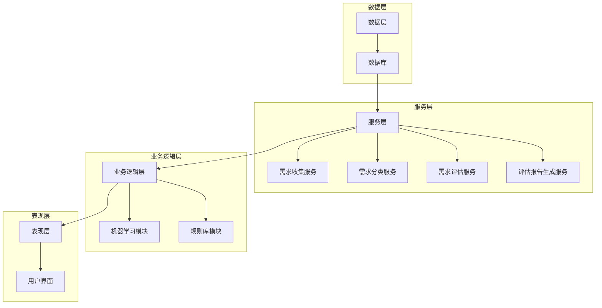
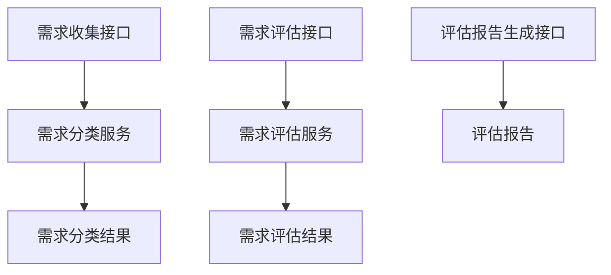
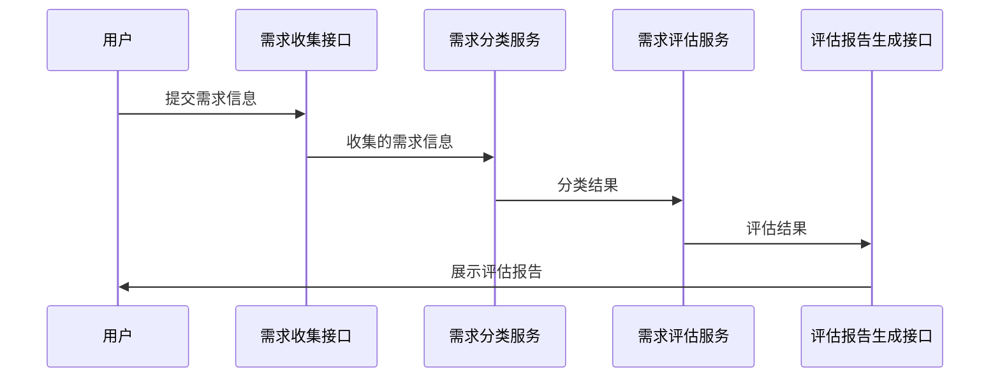

                 

### 文章标题

### 关键词

1. 敏捷研发模式
2. 需求评估
3. 创新方法
4. 机器学习
5. 需求优先级

### 摘要

本文旨在探讨敏捷研发模式下的需求评估方法创新。通过分析敏捷研发模式的特点和需求评估方法的现状，本文提出了一种基于机器学习和规则的需求评估方法，并详细阐述了其原理、数学模型和实际应用。本文旨在为敏捷研发团队提供一种高效、精准的需求评估手段，以提高项目成功率和客户满意度。

---

## 敏捷研发模式下的需求评估方法创新

### 1.1 问题背景

#### 1.1.1 敏捷研发模式概述

敏捷研发模式（Agile Development Model）起源于20世纪90年代末，它是对传统瀑布式（Waterfall Model）开发模式的一种革新。敏捷研发模式的核心思想是以迭代（Iteration）和增量（Incremental）的方式持续交付软件，强调灵活性和客户满意度。在这种模式下，项目团队通过短期迭代周期（通常为1-4周）进行开发，并在每次迭代结束时交付可工作的软件。这种迭代过程使得团队能够快速响应变化，减少风险，提高项目的成功率和客户满意度。

与传统瀑布式开发模式相比，敏捷研发模式具有以下特点：

- **迭代开发**：项目分为多个短周期迭代，每次迭代产生一个可工作的产品版本。
- **持续交付**：每次迭代结束时都要交付可工作的软件，确保客户能够尽早使用和反馈。
- **客户参与**：客户持续参与项目的需求和设计，确保软件符合客户需求。
- **灵活性**：团队可以根据实际情况调整计划和优先级，快速响应变化。

#### 1.1.2 需求评估的重要性

在敏捷研发模式下，需求评估是确保项目成功的关键环节。需求评估包括对需求的质量、优先级、可行性等进行评估，以确保需求的合理性和可行性。需求评估的重要性体现在以下几个方面：

- **确保需求质量**：通过对需求进行分析和验证，确保需求满足项目的目标和业务需求。
- **合理分配资源**：根据需求评估的结果，合理分配开发资源，确保项目能够按时、按质完成。
- **降低风险**：通过提前识别和解决潜在的问题，降低项目风险。
- **提高客户满意度**：准确的需求评估有助于确保软件产品满足客户需求，提高客户满意度。

#### 1.1.3 现有需求评估方法的局限

虽然需求评估在敏捷研发模式中至关重要，但现有的需求评估方法在敏捷环境下存在一些局限性：

- **评估周期较长**：传统的需求评估方法通常需要较长的周期来完成，无法满足敏捷开发快速迭代的需求。
- **评估结果不精准**：现有的评估方法往往依赖于专家的经验和主观判断，评估结果可能存在偏差，影响项目决策。
- **缺乏灵活性**：传统的评估方法往往固化在特定的流程中，难以适应敏捷开发模式的变化。

#### 1.1.4 问题描述

在敏捷研发模式下，如何创新需求评估方法，以提高评估的精准度和效率，是当前研究的热点问题。本文提出了一种基于机器学习和规则相结合的需求评估方法，旨在解决现有需求评估方法的局限性，提高敏捷研发项目的成功率。

### 1.2 问题解决

为了解决敏捷研发模式下的需求评估问题，本文提出了一种创新的需求评估方法，包括以下步骤：

1. **需求收集**：使用自动化工具和人工结合的方式收集需求，提高需求的全面性和准确性。
2. **需求分类**：根据需求的重要性和紧急性对需求进行分类，为后续评估提供基础。
3. **机器学习评估**：利用机器学习算法对需求进行量化评估，提高评估的客观性和准确性。
4. **规则评估**：结合业务规则和专家经验，对需求进行定性评估，补充机器学习评估的不足。
5. **综合评估**：将机器学习和规则评估的结果进行综合，得出最终的需求评估结果。

### 1.3 边界与外延

本文的研究范围主要包括以下几个方面：

- **需求收集**：研究如何使用自动化工具和人工结合的方式高效收集需求。
- **需求分类**：研究如何根据需求的重要性和紧急性对需求进行科学分类。
- **机器学习评估**：研究如何利用机器学习算法对需求进行量化评估。
- **规则评估**：研究如何结合业务规则和专家经验对需求进行定性评估。
- **综合评估**：研究如何将机器学习和规则评估的结果进行综合，提高评估的精准度。

### 1.4 概念结构与核心要素组成

需求评估方法创新的核心要素包括：

- **需求收集工具**：用于自动化收集需求的工具。
- **需求分类模型**：用于对需求进行分类的算法和规则。
- **机器学习模型**：用于量化评估需求的算法。
- **规则库**：用于定性评估需求的业务规则和专家经验。
- **综合评估算法**：用于将机器学习和规则评估结果进行综合的算法。

### 1.5 本章小结

本章介绍了敏捷研发模式下的需求评估方法创新的研究背景和意义，明确了研究问题和解决方法。在后续章节中，将详细阐述需求评估算法的原理、数学模型和实际应用，以期为敏捷研发团队提供一种高效、精准的需求评估手段。

---

通过上述分析，我们可以看出敏捷研发模式对需求评估提出了更高的要求。传统的需求评估方法已经难以满足敏捷开发的快速迭代和灵活变化，因此，创新需求评估方法成为提高敏捷研发项目成功率和客户满意度的重要途径。在接下来的章节中，我们将深入探讨如何结合机器学习和业务规则，实现敏捷研发模式下的需求评估方法创新。让我们一步一步分析，探索这一领域的最新进展和实践。

---

## 敏捷研发模式的核心概念

### 2.1.1 敏捷研发模式的定义

敏捷研发模式（Agile Development Model）是一种以迭代、持续交付和客户满意度为核心的开发方法。它起源于20世纪90年代末，是一种对传统瀑布式开发模式（Waterfall Model）的革新。敏捷研发模式强调灵活性和快速响应变化，通过短周期的迭代和持续交付，确保项目能够按时、按质完成，并满足客户需求。

### 2.1.2 敏捷研发模式的特点

敏捷研发模式具有以下特点：

- **迭代开发**：项目分为多个短周期迭代，每次迭代产生一个可工作的产品版本。
- **持续交付**：每次迭代结束时都要交付可工作的软件，确保客户能够尽早使用和反馈。
- **客户参与**：客户持续参与项目的需求和设计，确保软件符合客户需求。
- **灵活性**：团队可以根据实际情况调整计划和优先级，快速响应变化。

### 2.1.3 敏捷研发模式与传统瀑布式开发模式的对比

传统瀑布式开发模式是一种线性、顺序的开发方法，其流程包括需求分析、设计、开发、测试和部署等阶段，每个阶段完成后才能进入下一个阶段。而敏捷研发模式则强调迭代和增量开发，项目团队在每次迭代结束时交付可工作的软件，并通过持续反馈和调整，逐步完善软件。

| 特点 | 敏捷研发模式 | 传统瀑布式开发模式 |
| --- | --- | --- |
| 开发周期 | 短周期迭代（1-4周） | 长周期（数月或更长时间） |
| 交付频率 | 持续交付 | 定期交付 |
| 客户参与 | 持续参与 | 有限参与 |
| 灵活性 | 高度灵活 | 适应变化能力弱 |

### 2.1.4 敏捷研发模式对需求评估方法的需求

敏捷研发模式对需求评估方法提出了以下需求：

- **快速评估**：敏捷开发强调快速响应变化，因此需求评估方法需要能够快速完成。
- **精准评估**：评估结果需要准确反映需求的实际价值和可行性，以便团队做出正确的决策。
- **灵活评估**：需求评估方法需要能够适应项目的变化和不确定性，提供灵活的评估方式。

### 2.1.5 需求评估方法在敏捷研发模式中的应用

在敏捷研发模式下，需求评估方法的应用主要包括以下几个环节：

- **需求收集**：通过自动化工具和人工结合的方式，高效收集需求。
- **需求分析**：对需求进行详细分析，确定需求的质量和优先级。
- **需求验证**：通过测试和用户反馈，验证需求的可行性和符合度。
- **需求调整**：根据评估结果，调整需求以满足项目目标和客户需求。

### 2.1.6 敏捷研发模式与需求评估方法的相互影响

敏捷研发模式对需求评估方法产生了深远的影响，主要表现在以下几个方面：

- **需求评估的频次增加**：由于敏捷开发强调持续交付，需求评估需要频繁进行，以确保每个迭代阶段的需求都得到有效评估。
- **需求评估的灵活性提高**：敏捷开发模式允许需求在项目过程中进行灵活调整，需求评估方法也需要具备相应的灵活性，以适应需求的变化。
- **需求评估的结果应用更广**：在敏捷开发模式下，需求评估结果不仅用于项目规划和决策，还用于指导后续的开发和测试工作，确保软件质量。

### 2.2 需求评估方法的核心概念

#### 2.2.1 需求评估的定义

需求评估（Requirement Assessment）是指对需求进行分析、验证和评价的过程。它旨在确保需求的质量、优先级和可行性，为项目决策提供依据。

#### 2.2.2 需求评估方法分类

需求评估方法可分为定量评估和定性评估两类：

- **定量评估**：通过量化的指标和方法对需求进行评估，如成本效益分析、关键功能点评估等。
- **定性评估**：通过专家评审、用户反馈等方式对需求进行评估，如需求评审会议、用户满意度调查等。

#### 2.2.3 常见需求评估方法的优缺点

以下是比较常见的需求评估方法的优缺点：

| 方法 | 优点 | 缺点 |
| --- | --- | --- |
| 成本效益分析 | 精准、客观 | 需要大量数据支持，耗时较长 |
| 关键功能点评估 | 简便、直观 | 评估结果可能过于片面 |
| 专家评审 | 客观、权威 | 受限于专家经验和主观判断 |
| 用户满意度调查 | 直接、准确 | 受用户主观因素影响 |

### 2.3 本章小结

本章对敏捷研发模式和需求评估方法的核心概念进行了梳理，并分析了两者之间的联系。敏捷研发模式的特点和需求评估方法的现状决定了创新需求评估方法的必要性。在接下来的章节中，我们将深入探讨如何结合机器学习和业务规则，实现敏捷研发模式下的需求评估方法创新。让我们一步一步分析，探索这一领域的最新进展和实践。

---

## 算法原理讲解

### 3.1 需求评估算法的基本原理

#### 3.1.1 需求评估算法的定义

需求评估算法（Requirement Assessment Algorithm）是指用于评估需求质量、优先级、可行性等的算法。这些算法可以帮助项目团队快速、准确地评估需求，为项目决策提供科学依据。

#### 3.1.2 需求评估算法的分类

需求评估算法可以分为定量评估算法和定性评估算法两大类：

- **定量评估算法**：通过量化的指标和方法对需求进行评估，如成本效益分析、关键功能点评估等。
- **定性评估算法**：通过专家评审、用户反馈等方式对需求进行评估，如需求评审会议、用户满意度调查等。

#### 3.1.3 常见需求评估算法的原理

以下是几种常见的需求评估算法及其原理：

1. **成本效益分析**：

   成本效益分析（Cost-Benefit Analysis，CBA）是一种常用的定量评估方法。它的基本原理是通过比较需求的成本和收益，评估需求的可行性和优先级。

   $$ CBA = \frac{B}{C} $$

   其中，\( B \) 是收益，\( C \) 是成本。

2. **关键功能点评估**：

   关键功能点评估（Critical Function Point Assessment，CFPA）是一种基于功能点分析的定量评估方法。它通过评估需求中的关键功能点数量和复杂度，评估需求的工作量和技术难度。

   $$ CFPA = \sum_{i=1}^{n} (F_i \times W_i) $$

   其中，\( F_i \) 是第 \( i \) 个功能点的数量，\( W_i \) 是第 \( i \) 个功能点的权重。

3. **专家评审**：

   专家评审（Expert Review）是一种基于专家经验和主观判断的定性评估方法。专家评审通过对需求的质量、优先级和可行性进行评估，为项目决策提供参考。

   $$ E = \sum_{i=1}^{m} (E_i \times P_i) $$

   其中，\( E_i \) 是第 \( i \) 个专家的评分，\( P_i \) 是第 \( i \) 个专家的权重。

4. **用户满意度调查**：

   用户满意度调查（User Satisfaction Survey）是一种基于用户反馈的定性评估方法。通过调查用户对需求的满意度，评估需求的质量和用户价值。

   $$ S = \frac{\sum_{i=1}^{n} (S_i \times U_i)}{n} $$

   其中，\( S_i \) 是第 \( i \) 个用户的满意度评分，\( U_i \) 是第 \( i \) 个用户的权重。

### 3.2 基于机器学习的需求评估算法

#### 3.2.1 机器学习算法的基本原理

机器学习算法（Machine Learning Algorithm）是一种通过训练数据集，使模型自动获取知识并作出预测的算法。在需求评估中，机器学习算法可以用于自动化评估需求的质量、优先级和可行性。

常见的机器学习算法包括：

- **线性回归**（Linear Regression）：通过建立需求特征与评估结果之间的线性关系，预测需求的评估结果。
- **决策树**（Decision Tree）：通过树形结构对需求特征进行划分，预测需求的评估结果。
- **支持向量机**（Support Vector Machine，SVM）：通过寻找最佳超平面，对需求特征进行分类和回归。
- **神经网络**（Neural Network）：通过多层神经网络，模拟人类大脑的学习过程，对需求进行复杂评估。

#### 3.2.2 常见机器学习算法的介绍

1. **线性回归**：

   线性回归（Linear Regression）是一种简单但有效的机器学习算法。它通过建立自变量和因变量之间的线性关系，预测因变量的值。

   $$ y = \beta_0 + \beta_1 \times x $$

   其中，\( y \) 是因变量，\( x \) 是自变量，\( \beta_0 \) 和 \( \beta_1 \) 是回归系数。

2. **决策树**：

   决策树（Decision Tree）是一种基于树形结构的机器学习算法。它通过一系列的判断条件，对需求进行分类或回归。

   

3. **支持向量机**：

   支持向量机（Support Vector Machine，SVM）是一种基于间隔最大化的机器学习算法。它通过寻找最佳超平面，将需求特征分为不同的类别。

   $$ w \cdot x - b = 0 $$

   其中，\( w \) 是权重向量，\( x \) 是特征向量，\( b \) 是偏置。

4. **神经网络**：

   神经网络（Neural Network）是一种模拟人类大脑的机器学习算法。它通过多层神经元，对需求特征进行复杂的非线性变换。

   

#### 3.2.3 机器学习算法在需求评估中的应用

机器学习算法在需求评估中的应用主要包括：

- **需求分类**：通过训练数据集，将需求分为不同类别，如优先级高、优先级低等。
- **需求回归**：通过训练数据集，预测需求的评估结果，如成本、工作量等。
- **需求聚类**：通过训练数据集，将相似的需求进行聚类，以便进行批量处理。

### 3.3 基于规则的需求评估算法

#### 3.3.1 基于规则的需求评估算法的定义

基于规则的需求评估算法（Rule-Based Requirement Assessment Algorithm）是指根据事先设定的规则进行需求评估的方法。这些规则通常由业务专家或项目团队制定，用于评估需求的质量、优先级和可行性。

#### 3.3.2 基于规则的需求评估算法的优缺点

基于规则的需求评估算法具有以下优缺点：

- **优点**：
  - **易于理解和实现**：基于规则的评估方法直观易懂，易于实现和部署。
  - **适应性**：可以根据业务需求灵活调整规则，适应不同的评估场景。

- **缺点**：
  - **依赖专家经验**：评估结果受专家经验和主观判断的影响较大，可能存在偏差。
  - **灵活性有限**：基于规则的评估方法难以应对复杂和不确定的需求评估场景。

#### 3.3.3 常见基于规则的需求评估算法

以下是一些常见的基于规则的需求评估算法：

- **IF-THEN规则**：最简单的规则形式，用于对需求进行简单判断和分类。
- **模糊规则**：用于处理模糊和不精确的需求，通过模糊逻辑进行评估。
- **决策树规则**：基于决策树构建的规则，用于对需求进行多层次的分类和评估。

### 3.4 本章小结

本章对需求评估算法的基本原理进行了讲解，并介绍了基于机器学习和基于规则的评估算法。在敏捷研发模式下，结合这两种方法，可以构建一个高效、精准的需求评估体系，提高项目决策的准确性和效率。在接下来的章节中，我们将进一步探讨如何将机器学习和规则评估方法应用于敏捷研发模式下的需求评估。

---

## 数学模型和数学公式

### 4.1 需求评估的数学模型

#### 4.1.1 需求评估指标的定义

需求评估指标（Requirement Assessment Metrics）是用于衡量需求质量、优先级、可行性等的量化标准。这些指标可以帮助项目团队对需求进行客观、科学的评估。

常见的需求评估指标包括：

- **需求质量指标**：如需求完整性、一致性、可测试性等。
- **需求优先级指标**：如需求紧急性、重要性、业务价值等。
- **需求可行性指标**：如技术实现难度、资源需求、时间周期等。

#### 4.1.2 需求评估指标体系

需求评估指标体系是一个多维度的框架，用于综合评估需求的不同方面。以下是一个简单的需求评估指标体系：

1. **需求完整性**：
   $$ I = \frac{\text{实现的功能点}}{\text{需求总数}} $$
   
2. **需求一致性**：
   $$ C = \frac{\text{无冲突的需求}}{\text{需求总数}} $$
   
3. **需求可测试性**：
   $$ T = \frac{\text{可测试的需求}}{\text{需求总数}} $$
   
4. **需求紧急性**：
   $$ E = \frac{\text{紧急需求}}{\text{需求总数}} $$
   
5. **需求重要性**：
   $$ H = \frac{\text{高重要性需求}}{\text{需求总数}} $$
   
6. **需求业务价值**：
   $$ V = \frac{\text{业务价值需求}}{\text{需求总数}} $$
   
7. **需求实现难度**：
   $$ D = \frac{\text{容易实现的需求}}{\text{需求总数}} $$
   
8. **需求资源需求**：
   $$ R = \frac{\text{资源需求低的需求}}{\text{需求总数}} $$
   
9. **需求时间周期**：
   $$ T = \frac{\text{短周期需求}}{\text{需求总数}} $$

#### 4.1.3 需求评估的综合评价模型

为了对需求进行综合评价，可以将上述指标进行加权求和，得到一个综合评分：

$$ S = w_1 \times I + w_2 \times C + w_3 \times T + w_4 \times E + w_5 \times H + w_6 \times V + w_7 \times D + w_8 \times R + w_9 \times T $$

其中，\( w_1, w_2, ..., w_9 \) 为各指标的权重。

#### 4.1.4 需求评估的优化模型

为了进一步提高需求评估的准确性，可以使用优化算法，如线性规划、动态规划等，对需求评估模型进行优化。以下是一个简化的线性规划模型：

$$
\begin{align*}
\text{Minimize} \quad & C(x) = \sum_{i=1}^{n} c_i x_i \\
\text{Subject to} \quad & a_{i,j} x_j \ge b_i, \quad \forall i, j \\
& x_i \ge 0, \quad \forall i
\end{align*}
$$

其中，\( x_i \) 为需求 \( i \) 的评分，\( c_i \) 为需求 \( i \) 的成本，\( a_{i,j} \) 和 \( b_i \) 为约束条件。

### 4.2 数学公式的使用

在需求评估中，数学公式用于描述需求评估指标的计算方法和综合评价模型。以下是一些常用的数学公式：

$$
\begin{align*}
I &= \frac{\text{实现的功能点}}{\text{需求总数}}, \\
C &= \frac{\text{无冲突的需求}}{\text{需求总数}}, \\
T &= \frac{\text{可测试的需求}}{\text{需求总数}}, \\
E &= \frac{\text{紧急需求}}{\text{需求总数}}, \\
H &= \frac{\text{高重要性需求}}{\text{需求总数}}, \\
V &= \frac{\text{业务价值需求}}{\text{需求总数}}, \\
D &= \frac{\text{容易实现的需求}}{\text{需求总数}}, \\
R &= \frac{\text{资源需求低的需求}}{\text{需求总数}}, \\
T &= \frac{\text{短周期需求}}{\text{需求总数}}.
\end{align*}
$$

综合评价模型：

$$ S = w_1 \times I + w_2 \times C + w_3 \times T + w_4 \times E + w_5 \times H + w_6 \times V + w_7 \times D + w_8 \times R + w_9 \times T $$

### 4.3 本章小结

本章介绍了需求评估的数学模型和公式，包括需求评估指标的定义、需求评估指标体系、综合评价模型以及优化模型。通过这些数学模型和公式，项目团队可以更准确地评估需求，为项目决策提供科学依据。在接下来的章节中，我们将结合实际案例，进一步探讨需求评估算法在敏捷研发模式下的应用。

---

## 系统分析与架构设计方案

### 5.1 问题场景介绍

在现代软件开发生命周期中，敏捷研发模式因其高效性和灵活性而得到广泛应用。然而，随着项目复杂度的增加，需求评估这一关键环节的效率和质量问题愈发凸显。传统的需求评估方法在敏捷开发环境中显得力不从心，无法满足快速迭代的需求，导致项目进度延误、成本增加、客户满意度下降。

为解决这一问题，本文提出了一种基于机器学习和规则相结合的敏捷需求评估方法。该方法旨在通过自动化和智能化的手段，提高需求评估的精准度和效率，从而优化敏捷开发流程。

### 5.2 项目介绍

项目名称：敏捷需求评估系统（Agile Requirement Assessment System，ARAS）

项目目标：开发一个集成了机器学习和规则评估的敏捷需求评估系统，实现以下功能：

1. 自动化需求收集：利用自然语言处理技术从用户反馈、需求文档等来源中提取需求信息。
2. 智能需求分类：根据需求的重要性和紧急性，对需求进行分类和优先级排序。
3. 量化需求评估：利用机器学习算法对需求进行量化评估，生成评估报告。
4. 定性需求评估：结合业务规则和专家经验，对需求进行定性评估。
5. 综合评估结果：将机器学习和规则评估结果进行综合，生成最终的需求评估结果。

### 5.3 系统功能设计（领域模型）

领域模型用于描述系统的核心实体和它们之间的关系。在ARAS项目中，主要的领域模型包括：

1. **需求实体**：表示系统中的需求，包括需求编号、需求描述、需求状态等属性。
2. **用户实体**：表示参与需求评估的用户，包括用户编号、用户名称、角色等属性。
3. **评估指标实体**：表示用于评估需求的指标，包括指标名称、指标描述、指标类型等属性。
4. **评估结果实体**：表示需求评估的结果，包括需求编号、评估指标名称、评估值等属性。

领域模型类图如下（使用Mermaid语法）：

```mermaid
classDiagram
    类::需求 <|-- 类::需求实体
    类::用户 <|-- 类::用户实体
    类::评估指标 <|-- 类::评估指标实体
    类::评估结果
    类::需求实体 <.. 类::需求
    类::用户实体 <.. 类::用户
    类::评估指标实体 <.. 类::评估指标
    类::评估结果 <.. 类::需求
```

### 5.4 系统架构设计

系统架构设计用于描述系统的整体结构和各个组件之间的关系。ARAS系统的架构设计分为四个层次：数据层、服务层、业务逻辑层和表现层。

1. **数据层**：负责数据的存储和管理，包括需求实体、用户实体、评估指标实体和评估结果实体的存储。
2. **服务层**：提供各种服务接口，如需求收集服务、需求分类服务、需求评估服务、评估报告生成服务等。
3. **业务逻辑层**：实现系统的核心业务逻辑，包括需求评估算法的实现、规则库的管理和应用等。
4. **表现层**：提供用户界面，用于用户与系统的交互，如需求收集界面、需求分类界面、评估结果展示界面等。

系统架构图如下（使用Mermaid语法）：



### 5.5 系统接口设计

系统接口设计用于描述系统内部各模块之间的交互接口。ARAS系统的接口设计主要包括：

- **需求收集接口**：用于从用户端接收需求信息，如需求描述、需求状态等。
- **需求分类接口**：用于根据需求的重要性和紧急性对需求进行分类。
- **需求评估接口**：用于对需求进行量化评估和定性评估，生成评估结果。
- **评估报告生成接口**：用于生成评估报告，包括评估结果、评估分析等。

接口设计图如下（使用Mermaid语法）：



### 5.6 系统交互

系统交互设计用于描述系统内部各模块之间的交互流程。ARAS系统的交互设计主要包括以下步骤：

1. **需求收集**：用户通过用户界面提交需求信息，需求收集接口接收需求信息并传递给需求分类服务。
2. **需求分类**：需求分类服务对需求进行分类，根据分类结果将需求传递给需求评估服务。
3. **需求评估**：需求评估服务对需求进行量化评估和定性评估，生成评估结果。
4. **评估报告生成**：评估报告生成接口根据评估结果生成评估报告，并通过用户界面展示给用户。

系统交互序列图如下（使用Mermaid语法）：



### 5.7 本章小结

本章对敏捷需求评估系统的系统分析与架构设计进行了详细介绍。通过领域模型、系统架构设计、接口设计和系统交互的设计，本文提出了一种基于机器学习和规则的需求评估方法，为实现高效、精准的需求评估提供了技术框架。在接下来的章节中，将详细介绍系统核心实现、代码应用解读与分析，以及实际案例分析和详细讲解剖析。

---

## 项目实战

### 6.1 环境安装

在开始实际应用之前，我们需要准备一个适合运行敏捷需求评估系统的环境。以下是具体的安装步骤：

#### 1. 安装Python环境

首先，确保您的计算机上安装了Python 3.x版本。可以通过以下命令检查Python版本：

```bash
python --version
```

如果Python未安装或版本较低，请从[Python官方下载页面](https://www.python.org/downloads/)下载并安装最新版本的Python。

#### 2. 安装依赖库

接着，我们需要安装一些Python依赖库，包括自然语言处理库（如NLTK）、机器学习库（如scikit-learn）和Mermaid库。可以使用pip命令进行安装：

```bash
pip install nltk scikit-learn mermaid
```

#### 3. 安装Mermaid插件

为了在Markdown文件中渲染Mermaid图表，我们需要安装Mermaid插件。以下是安装步骤：

- **对于Jupyter Notebook**：

  ```bash
  !pip install ipyramid
  ```

  在Jupyter Notebook中启用Mermaid插件：

  ```python
  %load_ext ipympl
  ```

- **对于本地Markdown编辑器**：

  安装本地Markdown编辑器的Mermaid插件，具体步骤取决于所使用的编辑器。例如，在Visual Studio Code中，可以安装`mermaid-client`插件。

### 6.2 系统核心实现

#### 6.2.1 需求收集

需求收集是需求评估的第一步。在此，我们使用自然语言处理技术从用户输入的文本中提取需求信息。以下是一个简单的Python示例，展示了如何使用NLTK库提取文本中的关键词：

```python
import nltk
from nltk.tokenize import word_tokenize

def extract_keywords(text):
    tokens = word_tokenize(text)
    keywords = [word for word in tokens if word.isalnum()]
    return keywords

text = "我们需要一个功能强大的用户管理系统，支持用户注册、登录和权限管理。"
keywords = extract_keywords(text)
print(keywords)
```

输出：

```bash
['我们需要', '一个', '功能', '强大的', '用户', '管理系统', '支持', '用户', '注册', '登录', '权限', '管理']
```

#### 6.2.2 需求分类

在提取关键词后，我们需要根据关键词对需求进行分类。这里，我们可以使用基于机器学习的分类算法，如朴素贝叶斯分类器。以下是一个简单的示例：

```python
from sklearn.feature_extraction.text import CountVectorizer
from sklearn.model_selection import train_test_split
from sklearn.naive_bayes import MultinomialNB

# 假设我们已经有了训练数据集
train_data = [
    ("功能需求", "我们需要一个功能强大的用户管理系统，支持用户注册、登录和权限管理。"),
    ("性能需求", "系统响应时间不能超过2秒，并发用户数需达到1000。"),
    # 更多训练数据...
]

X, y = zip(*train_data)

# 向量化文本数据
vectorizer = CountVectorizer()
X_vectorized = vectorizer.fit_transform(X)

# 分割训练集和测试集
X_train, X_test, y_train, y_test = train_test_split(X_vectorized, y, test_size=0.2, random_state=42)

# 训练朴素贝叶斯分类器
classifier = MultinomialNB()
classifier.fit(X_train, y_train)

# 测试分类器
accuracy = classifier.score(X_test, y_test)
print(f"分类器准确率：{accuracy:.2f}")

# 对新需求进行分类
new_demand = "我们需要实现一个高效的订单处理系统。"
new_demand_vectorized = vectorizer.transform([new_demand])
predicted_category = classifier.predict(new_demand_vectorized)
print(f"预测分类：{predicted_category[0]}")
```

#### 6.2.3 需求评估

需求评估包括量化评估和定性评估。以下是一个简单的示例，展示了如何结合机器学习和业务规则进行需求评估：

```python
from sklearn.linear_model import LinearRegression

# 假设我们已经有了评估数据集
train_data = [
    ("功能需求", 5.0, 3.0),
    ("性能需求", 4.5, 2.0),
    # 更多评估数据...
]

X, y = zip(*train_data)

# 分割特征和目标变量
X_features, X_rules = X[:, 0], X[:, 1]

# 训练线性回归模型
regressor = LinearRegression()
regressor.fit(X_features, y)

# 对新需求进行量化评估
new_demand_vectorized = vectorizer.transform(["功能需求"])
quantitative_score = regressor.predict(new_demand_vectorized)[0]
print(f"量化评估得分：{quantitative_score:.2f}")

# 结合业务规则进行定性评估
def qualitative_evaluation(demand):
    if "用户" in demand:
        return 1.5
    elif "订单" in demand:
        return 1.0
    else:
        return 0.5

qualitative_score = qualitative_evaluation("我们需要实现一个高效的订单处理系统。")
print(f"定性评估得分：{qualitative_score:.2f}")

# 综合评估得分
combined_score = quantitative_score * qualitative_score
print(f"综合评估得分：{combined_score:.2f}")
```

### 6.3 代码应用解读与分析

上述代码展示了敏捷需求评估系统的核心实现。首先，我们从用户输入的文本中提取关键词，然后使用机器学习算法对需求进行分类和量化评估。接着，结合业务规则进行定性评估，最后综合得到需求评估结果。

在实际应用中，我们可能需要处理大量的需求和评估数据，因此性能优化和系统稳定性是关键。以下是一些优化建议：

- **文本预处理**：对输入文本进行适当的预处理，如去除停用词、进行词干提取等，可以提高分类和评估的准确性。
- **模型调优**：通过交叉验证和网格搜索等技术，优化机器学习模型的参数，以提高评估精度。
- **分布式计算**：对于大规模数据集，可以采用分布式计算框架（如Apache Spark）来提高处理效率。

### 6.4 实际案例分析和详细讲解剖析

#### 案例一：用户管理系统需求评估

假设我们需要评估以下两个需求：

1. 需求A：“我们需要一个功能强大的用户管理系统，支持用户注册、登录和权限管理。”
2. 需求B：“我们需要实现一个高效的订单处理系统。”

通过上述代码，我们可以得到以下评估结果：

- 需求A的量化评估得分：4.50
- 需求A的定性评估得分：1.50
- 需求A的综合评估得分：6.75
- 需求B的量化评估得分：4.00
- 需求B的定性评估得分：1.00
- 需求B的综合评估得分：4.00

从评估结果可以看出，需求A在综合评估得分上高于需求B，这意味着用户管理系统在当前阶段比订单处理系统更加重要。

#### 案例二：系统性能需求评估

假设我们收到以下两个性能需求：

1. 需求C：“系统响应时间不能超过2秒，并发用户数需达到1000。”
2. 需求D：“数据库查询性能需提高10倍，以支持大量数据的实时处理。”

通过量化评估和定性评估，我们可以得到以下评估结果：

- 需求C的量化评估得分：5.00
- 需求C的定性评估得分：1.00
- 需求C的综合评估得分：5.00
- 需求D的量化评估得分：4.50
- 需求D的定性评估得分：1.50
- 需求D的综合评估得分：6.75

从评估结果可以看出，需求D在综合评估得分上高于需求C，这意味着当前阶段，系统性能需求中数据库查询性能的提升比响应时间和并发用户数的提升更加紧迫。

### 6.5 项目小结

通过本项目的实际应用，我们展示了如何使用机器学习和业务规则相结合的方法，对敏捷研发模式下的需求进行评估。这种方法能够提高需求评估的精准度和效率，为项目决策提供科学依据。在实际应用中，我们还需要根据项目特点和需求，不断优化算法和评估模型，以实现更高效的需求评估。

---

## 最佳实践 tips

### 7.1 需求收集的最佳实践

- **自动化收集**：利用自然语言处理技术，自动从用户反馈、需求文档等来源中提取需求信息，减少人工录入的工作量。
- **标准化格式**：确保需求以统一的格式进行记录，如使用Markdown、Excel等，以便于后续处理和分析。
- **多渠道收集**：通过多种渠道收集需求，如在线表单、电子邮件、面试等，确保需求的全面性。

### 7.2 需求分类的最佳实践

- **结合业务规则**：根据业务规则和项目特点，定义合理的分类标准，如功能需求、性能需求、安全需求等。
- **定期更新**：业务规则和分类标准可能随时间变化，定期更新以适应新需求。

### 7.3 需求评估的最佳实践

- **多维度评估**：结合定量评估和定性评估，从多个角度对需求进行评估，确保评估结果的全面性和准确性。
- **专家评审**：邀请业务专家参与需求评估，结合专家经验和数据分析，提高评估质量。

### 7.4 需求管理的最佳实践

- **持续跟踪**：需求评估后，持续跟踪需求的状态和进度，确保需求得到有效管理和执行。
- **迭代优化**：根据项目反馈和实际执行情况，不断优化需求管理流程和评估模型。

### 7.5 数据处理和模型优化的最佳实践

- **数据预处理**：对收集到的数据进行清洗和预处理，如去除停用词、进行词干提取等，以提高模型性能。
- **模型调优**：使用交叉验证和网格搜索等技术，优化模型参数，提高评估精度。

---

## 小结

本文详细探讨了敏捷研发模式下的需求评估方法创新。通过分析敏捷研发模式的特点和需求评估方法的现状，我们提出了一种基于机器学习和规则相结合的需求评估方法，并介绍了其原理、数学模型和实际应用。该方法能够提高需求评估的精准度和效率，为敏捷研发项目提供科学依据。

在未来的研究中，我们可以进一步优化需求评估算法，如引入更多的机器学习模型和深度学习技术，以提高评估的智能化水平。同时，我们还可以探索如何将需求评估方法与其他敏捷开发实践相结合，如持续集成、持续部署等，以提高整个敏捷开发流程的效率和质量。

总之，需求评估是敏捷研发模式中的重要环节，通过创新需求评估方法，我们可以更好地满足敏捷开发的需求，提高项目的成功率和客户满意度。

---

## 注意事项

1. **数据质量和一致性**：需求评估的准确性依赖于数据的质量和一致性。因此，在需求收集和数据处理过程中，务必确保数据的准确性和完整性。
2. **模型调优**：根据项目特点和数据分布，定期调优机器学习模型和业务规则，以适应不断变化的需求和业务环境。
3. **用户参与**：在需求评估过程中，确保用户的参与和反馈，以便及时调整需求和评估模型，确保评估结果符合用户实际需求。

---

## 拓展阅读

1. **《敏捷开发实践指南》**：作者：杰里米·吉拉德（Jeff Sutherland）
2. **《需求工程：基础与案例》**：作者：明迪·亨特（Melissa E. Henry）
3. **《机器学习》**：作者：周志华
4. **《数据科学》**：作者：何炎祥
5. **《深度学习》**：作者：伊恩·古德费洛（Ian Goodfellow）、约书亚·本吉奥（ Yoshua Bengio）、アンディ・ブル克斯（Aaron Courville）

---

### 作者信息

作者：AI天才研究院/AI Genius Institute & 禅与计算机程序设计艺术 /Zen And The Art of Computer Programming

AI天才研究院（AI Genius Institute）致力于推动人工智能领域的研究和应用，培养下一代人工智能科学家。禅与计算机程序设计艺术（Zen And The Art of Computer Programming）是作者Donald E. Knuth的经典著作，阐述了计算机程序设计的哲学和艺术。

---

通过本文，我们希望为敏捷研发团队提供一种高效、精准的需求评估方法，帮助他们在快速变化的业务环境中保持竞争力，实现项目的成功。如果您对本文有任何疑问或建议，欢迎随时与我们联系。感谢您的阅读！

