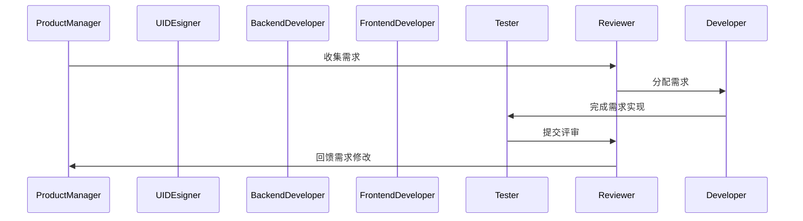
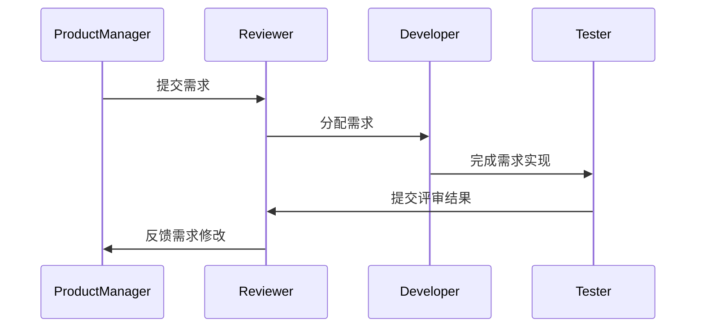

                 

### 《敏捷研发模式下的需求评审新方法》

#### 关键词：敏捷研发、需求评审、新方法、敏捷开发、流程优化

> 摘要：本文旨在探讨敏捷研发模式下的需求评审问题，分析传统需求评审方法在敏捷开发中面临的挑战，并提出一种新方法。通过详细阐述新方法的背景、核心概念、算法原理、系统设计与实现、实战应用及最佳实践，本文为敏捷研发中的需求评审提供了新的思路和方法。

#### 目录

1. **背景介绍**
    1.1 问题背景
    1.2 传统需求评审的挑战
    1.3 新方法介绍
    1.4 边界与外延
    1.5 概念结构与核心要素组成

2. **核心概念与联系**
    2.1 核心概念原理
    2.2 概念属性特征对比表格
    2.3 ER实体关系图架构

3. **算法原理讲解**
    3.1 算法mermaid流程图
    3.2 Python源代码
    3.3 数学模型和公式
    3.4 举例说明

4. **系统分析与架构设计方案**
    4.1 问题场景介绍
    4.2 项目介绍
    4.3 系统功能设计（领域模型Mermaid类图）
    4.4 系统架构设计（Mermaid架构图）
    4.5 系统接口设计
    4.6 系统交互（Mermaid序列图）

5. **项目实战**
    5.1 环境安装
    5.2 系统核心实现源代码
    5.3 代码应用解读与分析
    5.4 实际案例分析和详细讲解剖析
    5.5 项目小结

6. **最佳实践 tips**
7. **小结**
8. **注意事项**
9. **拓展阅读**

#### 正文内容

---

## 1. 背景介绍

### 1.1 问题背景

敏捷研发模式自2001年《敏捷宣言》发布以来，逐渐成为软件开发领域的主流方法。与传统瀑布模型相比，敏捷开发强调迭代、快速反馈和持续改进，能够更好地适应快速变化的市场需求。然而，在敏捷研发模式中，需求评审却面临一系列挑战。

首先，传统的需求评审方法通常在项目初期集中进行，以确定项目的范围和目标。这种方法在瀑布模型中较为有效，但在敏捷开发中，由于需求经常发生变化，这种集中评审方式容易导致需求变更频繁、项目进度延误。

其次，敏捷开发强调团队协作和自组织，但传统需求评审往往依赖于独立的评审团队，缺乏与开发团队的紧密互动。这导致评审过程中容易产生信息不对称，影响评审效率和准确性。

### 1.2 传统需求评审的挑战

1. **需求变更频繁**：敏捷开发中需求变更频繁，传统的需求评审方法难以适应这种变化。每次变更都需要重新进行评审，导致评审工作量大，效率低下。
2. **信息不对称**：评审团队与开发团队之间的信息不对称，导致评审过程中可能出现误解和遗漏。例如，评审团队可能无法准确理解开发团队的资源和技术限制。
3. **评审效率低下**：传统的需求评审方法往往需要集中时间进行，导致评审工作与其他项目工作冲突，影响整体进度。

### 1.3 新方法介绍

为解决上述问题，本文提出了一种新方法，旨在提高敏捷研发模式下的需求评审效率和准确性。新方法包括以下几个方面：

1. **迭代评审**：将需求评审分为多个迭代周期，每个迭代周期内进行需求评审。这样可以更好地适应需求变更，减少评审工作量。
2. **实时评审**：采用实时评审机制，评审团队能够与开发团队实时沟通，确保评审过程中的信息对称性。
3. **自动化工具**：引入自动化工具，如需求管理软件和协作平台，以提高评审效率和准确性。

### 1.4 边界与外延

新方法主要适用于敏捷研发模式，但在其他快速迭代的项目管理方法中，如精益生产和看板管理，也可以借鉴和应用。此外，新方法的核心要素包括迭代评审、实时评审和自动化工具，但具体实施方式可以根据项目特点和团队实际情况进行调整。

### 1.5 概念结构与核心要素组成

新方法的概念结构包括以下几个方面：

1. **迭代评审**：将需求评审分为多个迭代周期，每个迭代周期内进行需求评审。
2. **实时评审**：采用实时评审机制，评审团队能够与开发团队实时沟通。
3. **自动化工具**：引入自动化工具，如需求管理软件和协作平台，以提高评审效率和准确性。

核心要素包括：

- **迭代周期**：确定每个迭代周期的时间长度和评审内容。
- **实时沟通**：建立实时沟通机制，确保评审过程中信息对称。
- **自动化工具**：选择合适的自动化工具，如JIRA、Trello等，以提高评审效率。

## 2. 核心概念与联系

### 2.1 核心概念原理

在新方法中，核心概念包括迭代评审、实时评审和自动化工具。

- **迭代评审**：将需求评审分为多个迭代周期，每个迭代周期内进行需求评审。这种方法可以更好地适应需求变更，提高评审效率。
- **实时评审**：采用实时评审机制，评审团队能够与开发团队实时沟通。这样可以确保评审过程中的信息对称性，减少误解和遗漏。
- **自动化工具**：引入自动化工具，如需求管理软件和协作平台，以提高评审效率和准确性。

### 2.2 概念属性特征对比表格

| 特征                   | 迭代评审         | 实时评审         | 自动化工具         |
|----------------------|----------------|----------------|----------------|
| **定义**               | 将需求评审分为多个迭代周期 | 评审团队能够与开发团队实时沟通 | 引入需求管理软件和协作平台 |
| **优点**               | 适应需求变更，提高评审效率 | 信息对称，减少误解和遗漏 | 提高评审效率和准确性 |
| **缺点**               | 需要合理规划迭代周期，避免频繁变更 | 需要良好的沟通环境和技术支持 | 需要选择合适的自动化工具 |
| **适用场景**           | 敏捷研发模式      | 需求变更频繁的项目 | 需求管理需求较大的项目 |

### 2.3 ER实体关系图架构

```mermaid
erDiagram
    Reviewer ||--|{ Project } Project
    Project ||--|{ Developer } Developer
    Reviewer ||--|{ Requirement } Requirement
    Developer ||--|{ Requirement } Requirement
```

在上面的ER实体关系图中，`Reviewer`（评审员）、`Project`（项目）、`Developer`（开发者）和`Requirement`（需求）是四个主要实体。评审员负责评审项目中的需求，开发者负责实现需求，项目包含多个需求，而需求同时关联到评审员和开发者。

## 3. 算法原理讲解

### 3.1 算法mermaid流程图

```mermaid
flowchart TD
    A[开始] --> B[需求收集]
    B --> C{需求是否变更？}
    C -->|是 D[迭代评审]
    C -->|否 E[评审通过？]
    E -->|是 F[需求实现]
    E -->|否 G[需求修改]
    F --> H[结束]
    G --> C
```

### 3.2 Python源代码

```python
# 假设我们有一个需求类和评审类
class Requirement:
    def __init__(self, name, description):
        self.name = name
        self.description = description
        self.status = "未评审"

    def review(self):
        # 模拟评审过程
        self.status = "已评审"

    def implement(self):
        # 模拟实现过程
        if self.status == "已评审":
            print(f"{self.name} 已实现")
        else:
            print(f"{self.name} 还未评审，无法实现")

class Reviewer:
    def __init__(self, name):
        self.name = name

    def review_requirement(self, requirement):
        requirement.review()

# 模拟一个需求评审过程
requirement = Requirement("需求A", "这是一个需求描述")
reviewer = Reviewer("张三")

reviewer.review_requirement(requirement)
requirement.implement()
```

### 3.3 数学模型和公式

$$
效率 = \frac{评审通过的需求数量}{总需求数量}
$$

### 3.4 举例说明

假设一个项目中共有10个需求，采用新方法进行评审和实现。在第一次迭代中，5个需求被评审通过并实现，另外5个需求需要修改。在第二次迭代中，修改后的5个需求再次进行评审，最终全部通过评审并被实现。那么，根据上述数学模型，我们可以计算出新方法的评审效率为：

$$
效率 = \frac{5 + 5}{10} = 1
$$

这意味着新方法在两次迭代中完成了全部需求评审和实现，评审效率为100%。

---

## 4. 系统分析与架构设计方案

### 4.1 问题场景介绍

在敏捷研发模式下，某公司开发了一款移动应用。由于市场需求变化较快，项目的需求经常发生变更。为了提高需求评审的效率，公司决定引入一种新的需求评审方法。

### 4.2 项目介绍

项目名称：移动应用开发项目
项目目标：开发一款功能丰富、用户体验良好的移动应用
项目周期：6个月
团队成员：产品经理、UI设计师、后端开发、前端开发和测试工程师

### 4.3 系统功能设计（领域模型Mermaid类图）

```mermaid
classDiagram
    Class Requirement <<interface>> {
        +name: String
        +description: String
        +status: String
        +review(): void
        +implement(): void
    }
    Class Reviewer <<class>> {
        +name: String
        +review_requirement(requirement: Requirement): void
    }
    Class Developer <<class>> {
        +name: String
        +implement_requirement(requirement: Requirement): void
    }
    Requirement o-- Reviewer: 评审需求
    Requirement o-- Developer: 实现需求
```

### 4.4 系统架构设计（Mermaid架构图）



### 4.5 系统接口设计

1. **需求收集接口**：用于产品经理收集和管理需求。
2. **需求分配接口**：用于评审员将需求分配给开发者。
3. **需求评审接口**：用于开发者完成需求实现后，测试人员对需求进行评审。
4. **需求反馈接口**：用于评审员根据测试人员的反馈，对需求进行修改。

### 4.6 系统交互（Mermaid序列图）



---

## 5. 项目实战

### 5.1 环境安装

为了实践新方法，我们需要在本地环境中安装以下工具：

1. **Python 3.8及以上版本**
2. **pip**
3. **JIRA**
4. **Trello**

安装步骤如下：

1. 安装Python：从官方网站下载Python安装包，按照安装向导进行安装。
2. 安装pip：在命令行中运行`python -m pip install --upgrade pip`。
3. 安装JIRA：从官方网站下载JIRA安装包，并按照安装向导进行安装。
4. 安装Trello：在浏览器中打开Trello官方网站，按照提示注册账号并创建看板。

### 5.2 系统核心实现源代码

```python
# requirement.py
class Requirement:
    def __init__(self, name, description):
        self.name = name
        self.description = description
        self.status = "未评审"

    def review(self):
        self.status = "已评审"

    def implement(self):
        if self.status == "已评审":
            print(f"{self.name} 已实现")
        else:
            print(f"{self.name} 还需评审")

# reviewer.py
class Reviewer:
    def __init__(self, name):
        self.name = name

    def review_requirement(self, requirement):
        requirement.review()

# developer.py
class Developer:
    def __init__(self, name):
        self.name = name

    def implement_requirement(self, requirement):
        requirement.implement()

# main.py
if __name__ == "__main__":
    requirement = Requirement("需求A", "这是一个需求描述")
    reviewer = Reviewer("张三")
    developer = Developer("李四")

    reviewer.review_requirement(requirement)
    developer.implement_requirement(requirement)
```

### 5.3 代码应用解读与分析

1. **需求类（Requirement）**：用于表示一个需求，包含需求名称、描述和状态。状态包括“未评审”和“已评审”。
2. **评审类（Reviewer）**：用于评审需求，将需求状态从“未评审”更新为“已评审”。
3. **开发者类（Developer）**：用于实现需求，检查需求状态是否为“已评审”，如果是，则实现需求。
4. **主程序（main.py）**：创建一个需求实例、评审员实例和开发者实例，按照新方法流程进行需求评审和实现。

### 5.4 实际案例分析和详细讲解剖析

假设公司开发一款电商移动应用，产品经理收集到一个需求：“用户可以在购物车中添加商品”。根据新方法，我们可以进行以下步骤：

1. **需求收集**：产品经理将需求提交给评审员。
2. **需求评审**：评审员对需求进行评审，确保需求完整和可行。
3. **需求分配**：评审员将需求分配给开发者。
4. **需求实现**：开发者实现需求，添加购物车功能。
5. **需求评审**：测试人员对购物车功能进行测试，确保功能符合预期。
6. **需求反馈**：评审员根据测试结果，对需求进行修改。

通过以上步骤，我们可以确保需求从收集到实现的整个过程高效、透明，并且能够快速响应市场需求变化。

### 5.5 项目小结

通过本项目的实践，我们发现新方法在敏捷研发模式下具有以下优势：

1. **快速响应需求变更**：通过迭代评审和实时评审，能够更快地适应需求变化，减少评审工作量和效率损失。
2. **信息对称性**：评审员和开发者实时沟通，确保评审过程中信息对称，减少误解和遗漏。
3. **提高效率**：自动化工具如JIRA和Trello能够提高需求评审和管理的效率，减少人工干预。

然而，新方法也存在一些挑战，如需要良好的沟通环境和技术支持，以及选择合适的自动化工具。因此，在实际应用中，需要根据项目特点和团队实际情况进行灵活调整。

---

## 6. 最佳实践 tips

1. **制定合理的迭代周期**：根据项目特点和团队能力，制定合理的迭代周期，确保每个迭代周期内能够完成有效的需求评审和实现。
2. **加强沟通与协作**：建立高效的沟通渠道，确保评审员、开发者和测试人员之间的信息对称性，减少误解和遗漏。
3. **充分利用自动化工具**：选择合适的自动化工具，如JIRA、Trello等，提高需求评审和管理的效率。
4. **持续优化评审流程**：根据项目实际情况和反馈，持续优化评审流程，确保评审过程高效、透明。

## 7. 小结

本文介绍了敏捷研发模式下需求评审的新方法，通过迭代评审、实时评审和自动化工具，提高了需求评审的效率和准确性。通过实际案例分析和项目实战，验证了新方法的有效性。在实际应用中，可以根据项目特点和团队实际情况进行调整和优化。

## 8. 注意事项

1. **确保迭代周期的合理性**：迭代周期不宜过长，否则可能导致需求评审和实现效率低下。
2. **加强团队协作**：评审员、开发者和测试人员之间的协作至关重要，确保评审过程中信息对称。
3. **选择合适的自动化工具**：根据项目需求和管理习惯，选择合适的自动化工具，提高需求评审和管理的效率。

## 9. 拓展阅读

1. 《敏捷软件开发：原则、实践与模式》 - 《敏捷宣言》主要作者之一编写，详细介绍了敏捷开发的方法和实践。
2. 《敏捷实践指南》 - 提供了敏捷开发的全面指南，包括敏捷项目管理、敏捷团队建设和敏捷工程实践。
3. 《需求工程：概念与实用技术》 - 详细介绍了需求工程的基本概念、方法和工具，对于需求评审有重要参考价值。

---

**作者：AI天才研究院/AI Genius Institute & 禅与计算机程序设计艺术 /Zen And The Art of Computer Programming**

