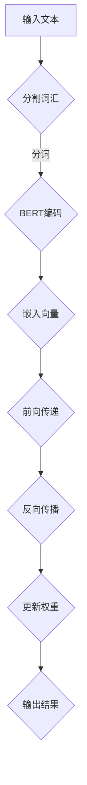
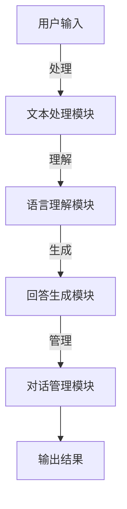
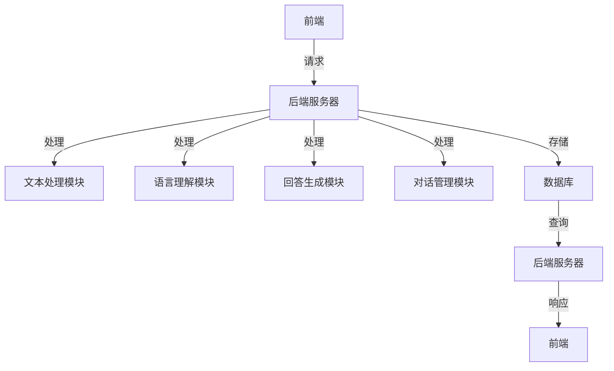
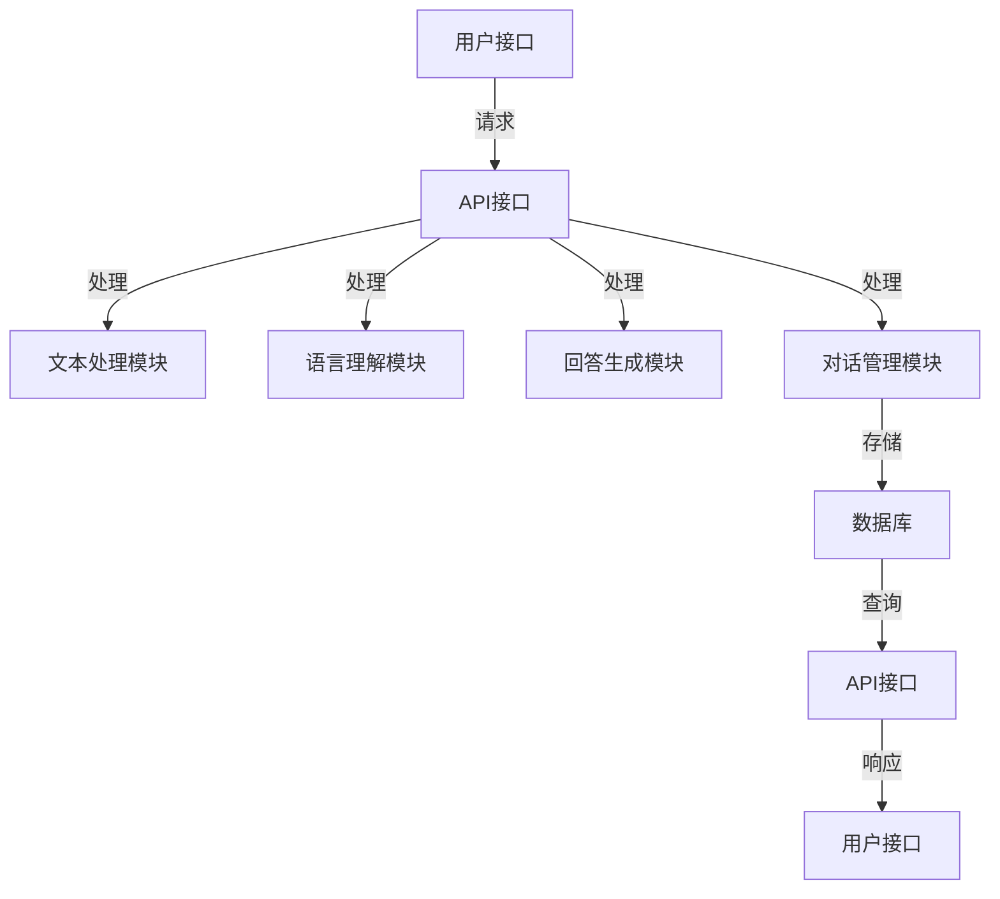
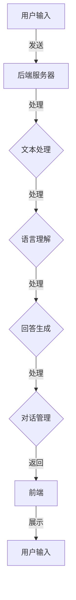

                 

# 敏捷项目章程：为LLM应用开发设定清晰的愿景

## 关键词
- 敏捷项目章程
- LLM应用开发
- 敏捷开发原理
- 项目愿景
- 用户故事
- 风险管理

## 摘要
本文深入探讨了敏捷项目章程在LLM（大型语言模型）应用开发中的重要性。通过梳理敏捷开发的核心理念，本文详细介绍了如何编写敏捷项目章程，包括设定清晰的项目愿景、明确产品特性、制定迭代计划和风险管理策略。文章结合实际案例，阐述了敏捷项目章程的编写和调整过程，为LLM应用开发提供了实践指导。

## 引言
### 背景介绍

在当今技术快速发展的时代，LLM（大型语言模型）应用的开发成为众多企业和研究机构关注的焦点。LLM技术在自然语言处理、智能客服、内容生成等领域具有广泛的应用前景。然而，LLM应用开发过程复杂，涉及多学科知识和大量数据处理，如何高效管理项目成为关键挑战。

传统的项目开发方法往往缺乏灵活性，难以适应快速变化的需求和技术进步。而敏捷开发则以其迭代、灵活、客户导向的特点，逐渐成为项目管理的首选方法。敏捷项目章程作为敏捷开发的核心文档，对项目的成功至关重要。

### 敏捷项目章程的重要性

敏捷项目章程不仅是项目启动的指南，更是团队协作和目标明确的基石。它包含了项目的愿景、目标、关键交付物、迭代计划、风险管理等内容，为项目团队提供了明确的方向和参考。

对于LLM应用开发，敏捷项目章程有助于：
- 明确项目愿景，统一团队共识。
- 提高产品交付的灵活性和质量。
- 有效识别和应对项目风险。
- 促进跨职能团队的协作和沟通。

### LLM应用开发的特殊性

LLM应用开发具有以下几个特殊性：
- 复杂的技术栈，涉及深度学习、自然语言处理等多个领域。
- 海量的数据处理需求，对计算资源和存储提出了高要求。
- 对模型性能和准确性的高度关注，需要持续迭代优化。
- 用户需求的快速变化，需要敏捷应对。

这些特殊性使得敏捷项目章程在LLM应用开发中显得尤为重要。

## 第一部分：背景介绍与核心概念

### 1.1.1 项目开发中的常见挑战

项目开发过程中，常见挑战包括：
- 需求变更频繁，难以保持项目进度。
- 预算和时间压力，影响项目质量。
- 团队沟通不畅，导致协作效率低下。
- 技术复杂性，导致开发风险增加。

### 1.1.2 敏捷项目章程的重要性

敏捷项目章程在解决上述挑战中发挥重要作用：
- 提供明确的项目愿景和目标，帮助团队聚焦核心任务。
- 通过迭代计划和用户故事，实现灵活的需求管理。
- 强调持续交付，提高产品交付质量。
- 促进跨职能团队协作，提升项目效率。

### 1.1.3 LLM应用开发的特殊性

LLM应用开发中的特殊性包括：
- 复杂的技术架构，需要清晰的项目规划。
- 大规模数据处理，对系统性能和稳定性要求高。
- 对模型性能和准确性的持续优化，需要迭代和验证。
- 快速变化的市场需求，需要敏捷应对。

### 1.2 核心概念与联系

#### 1.2.1 敏捷开发的基本原理

敏捷开发的核心原理包括：
- 客户合作，以客户需求为导向。
- 迭代开发，逐步完善产品功能。
- 持续交付，确保产品及时交付。
- 团队协作，促进跨职能沟通。

#### 1.2.2 敏捷开发的关键要素

敏捷开发的关键要素包括：
- 敏捷项目章程，明确项目目标和规划。
- 用户故事，描述用户需求和应用场景。
- 迭代计划，制定项目进度和里程碑。
- 持续集成和持续交付，确保产品高质量交付。

#### 1.2.3 LLM（大型语言模型）概述

LLM（大型语言模型）的基本概念包括：
- 定义：LLM是一种基于深度学习的自然语言处理模型，能够理解和生成自然语言。
- 主要类型：包括预训练模型和微调模型。
- 应用场景：智能客服、内容生成、翻译、文本分析等。

### 1.3 敏捷项目章程的构成要素

敏捷项目章程的构成要素包括：
- 愿景与目标，明确项目长期目标和预期成果。
- 产品特性与用户故事，描述产品功能和用户需求。
- 迭代计划，制定项目进度和里程碑。
- 风险管理与应对策略，识别和应对项目风险。
- 评估与交付标准，确保产品符合预期质量。

### 1.4 本章小结

本章介绍了项目开发中的常见挑战和敏捷项目章程的重要性，以及LLM应用开发的特殊性。通过梳理敏捷开发的基本原理和关键要素，为后续章节的详细讨论奠定了基础。

## 第二部分：LLM应用开发中的敏捷项目章程实践

### 2.1 敏捷项目章程的编写过程

#### 2.1.1 确定项目愿景

项目愿景是敏捷项目章程的核心，它为项目团队提供了共同的目标和方向。在LLM应用开发中，项目愿景应明确以下方面：

- 技术目标：如实现高性能、高准确性的自然语言处理模型。
- 商业目标：如提升用户体验、降低运营成本。
- 社会价值：如促进智能科技应用、推动行业进步。

项目愿景应简洁、明确，能够激发团队的共同愿景。

#### 2.1.2 确定产品特性

产品特性是敏捷项目章程的重要组成部分，它描述了产品的主要功能和用户故事。在LLM应用开发中，产品特性包括：

- 基础功能：如文本分类、情感分析、机器翻译等。
- 高级功能：如对话生成、文本生成、智能问答等。
- 用户故事：如“用户能够在5秒内获得智能客服的回答”。

产品特性应具体、可衡量，能够反映用户的核心需求。

#### 2.1.3 制定迭代计划

迭代计划是敏捷项目章程中的重要部分，它规定了项目的进度和里程碑。在LLM应用开发中，制定迭代计划应考虑：

- 迭代周期：如2周或4周。
- 迭代目标：如实现文本分类功能、优化模型性能等。
- 风险管理：如识别潜在的技术风险、资源风险等。

迭代计划应灵活，能够适应需求变化和技术进步。

#### 2.1.4 风险管理与应对策略

风险管理是敏捷项目章程中不可或缺的部分，它帮助团队识别和应对项目风险。在LLM应用开发中，风险管理包括：

- 风险识别：如技术实现风险、数据处理风险等。
- 风险评估：如评估风险的可能性和影响程度。
- 应对策略：如制定技术方案、增加资源投入等。

风险应对策略应具有可操作性和有效性。

### 2.2 敏捷项目章程的调整与维护

#### 2.2.1 调整的必要性

在项目执行过程中，需求变化和技术进步可能导致项目章程的调整。敏捷项目章程的调整必要性包括：

- 用户需求变化：如新功能需求、性能优化需求等。
- 技术进步：如新的算法、工具和技术框架等。
- 市场环境变化：如竞争态势、政策法规等。

#### 2.2.2 调整的原则与方法

调整敏捷项目章程应遵循以下原则和方法：

- 频繁回顾：定期回顾项目进展和项目章程，识别需要调整的部分。
- 沟通协调：与利益相关者沟通，确保调整的合理性和可行性。
- 文档更新：及时更新项目章程文档，确保团队对项目的最新认识。

#### 2.2.3 章程的维护

章程的维护是确保项目顺利执行的重要环节，包括：

- 文档管理：保持项目章程文档的完整性和一致性。
- 责任分配：明确项目章程维护的责任人，确保章程内容的及时更新。
- 风险监控：持续监控项目风险，及时调整章程中的风险应对策略。

### 2.3 敏捷项目章程的评估与交付

#### 2.3.1 评估标准

敏捷项目章程的评估标准包括：

- 项目进度：如是否按照迭代计划完成预期任务。
- 产品质量：如产品功能是否完善、性能是否达到预期等。
- 风险控制：如风险识别和应对策略的有效性。

#### 2.3.2 评估过程与方法

评估过程包括：

- 定期评估：如每个迭代结束时的评估。
- 利益相关者反馈：收集项目利益相关者的反馈，评估项目效果。
- 数据分析：通过数据分析，评估项目的进展和效果。

#### 2.3.3 交付策略

交付策略包括：

- 交付流程：如版本控制、测试和发布流程。
- 质量保障：如代码审查、自动化测试等。
- 用户培训：如为用户提供使用指南和培训。

### 2.4 实际案例剖析

#### 2.4.1 案例背景

某企业计划开发一款基于LLM的智能客服系统，以提升客户服务质量和效率。项目团队采用敏捷开发方法，制定敏捷项目章程。

#### 2.4.2 章程编写过程

项目团队在编写敏捷项目章程时，遵循以下步骤：

- 确定项目愿景：明确智能客服系统的长期目标和预期成果。
- 收集用户需求：通过用户访谈和市场调研，收集用户需求和应用场景。
- 制定迭代计划：根据用户需求和项目资源，制定迭代计划。
- 风险识别与评估：识别项目风险，评估风险的可能性和影响程度。
- 编写项目章程：综合以上信息，编写敏捷项目章程。

#### 2.4.3 项目执行与调整

在项目执行过程中，团队遵循敏捷项目章程，按迭代计划逐步开发智能客服系统。在项目执行过程中，团队发现以下问题：

- 用户需求变化：用户对新功能的需求不断增加。
- 技术挑战：在实现某些功能时，遇到了技术难题。

团队根据这些问题，调整敏捷项目章程：

- 重新评估用户需求：与用户沟通，调整需求优先级。
- 调整迭代计划：增加迭代周期，确保技术难题的解决。
- 风险应对策略：增加技术资源投入，确保项目风险可控。

#### 2.4.4 项目结果与经验教训

项目最终成功交付，智能客服系统在用户服务质量和效率方面取得了显著提升。团队从项目中总结了以下经验教训：

- 敏捷项目章程在项目管理和风险控制方面发挥了重要作用。
- 持续沟通与调整是敏捷开发成功的关键。
- 技术资源的充足投入是解决技术难题的重要保障。

### 2.5 本章小结

本章介绍了敏捷项目章程的编写过程、调整与维护、评估与交付以及实际案例剖析。通过这些实践，为LLM应用开发提供了宝贵的经验和指导。

## 第三部分：敏捷项目章程的最佳实践与展望

### 8.1 敏捷项目章程的最佳实践

#### 8.1.1 敏捷项目章程的最佳实践概述

敏捷项目章程的最佳实践包括：

- 明确项目愿景和目标：确保团队对项目有共同的理解和期望。
- 精细的用户故事：详细描述用户需求和应用场景，提高开发效率。
- 灵活的迭代计划：根据项目进展和需求变化，调整计划以保持项目进度。
- 有效的风险管理：识别和应对项目风险，确保项目顺利进行。
- 定期的评估与反馈：通过评估和反馈，不断优化项目执行。

#### 8.1.2 最佳实践案例分享

以下是几个成功的敏捷项目章程最佳实践案例：

- 案例一：某金融企业通过敏捷项目章程，成功开发了一套智能投顾系统。项目愿景明确，用户故事详细，迭代计划灵活，风险管理有效，项目最终在预定时间内高质量交付。
- 案例二：某科技公司采用敏捷项目章程，开发了一款智能语音助手。项目团队通过持续沟通和调整，克服了技术难题，实现了产品的快速迭代和优化。

#### 8.1.3 敏捷项目章程实践的启示

敏捷项目章程的最佳实践启示包括：

- 敏捷项目章程不仅是项目管理工具，更是团队协作的基石。
- 灵活应对变化是敏捷开发的核心，项目章程需要根据实际情况进行调整。
- 风险管理是项目成功的关键，项目章程中应包含详细的风险识别和应对策略。
- 定期评估与反馈是持续改进的保证，有助于项目团队不断提升执行效率。

### 9.1 LLM应用开发的发展趋势

#### 9.1.1 技术发展趋势

LLM应用开发的技术发展趋势包括：

- 模型规模和性能的提升：随着计算资源和算法的进步，LLM模型将变得更加大规模和高效。
- 多模态处理：LLM将与其他模态（如图像、音频）相结合，实现更丰富的应用场景。
- 自动化与智能化：LLM将在自动化和智能化方面发挥更大作用，提升人机交互体验。

#### 9.1.2 应用领域扩展

LLM应用开发的应用领域将继续扩展，包括：

- 智能客服：提供更智能、更高效的客户服务。
- 内容生成：生成高质量、个性化的文本内容。
- 教育与培训：辅助教师和学生进行教学和学习。
- 医疗健康：辅助医生进行诊断和治疗。

### 9.2 敏捷项目章程的未来方向

#### 9.2.1 敏捷项目章程的改进

未来，敏捷项目章程可能在以下方面得到改进：

- 更加强调用户参与：通过引入更多的用户参与和反馈机制，确保项目更好地满足用户需求。
- 简化文档结构：减少冗余内容，简化文档结构，提高可读性和可操作性。
- 更好的风险预测：利用大数据和人工智能技术，提高风险预测的准确性。

#### 9.2.2 敏捷项目章程的应用场景扩展

敏捷项目章程将在更广泛的场景中得到应用：

- 创业公司：敏捷项目章程有助于创业公司快速迭代和优化产品。
- 公共项目：敏捷项目章程有助于公共项目更好地应对变化和风险。
- 教育项目：敏捷项目章程有助于教育项目更好地满足教育需求。

### 9.3 未来工作与实践建议

为了更好地应对LLM应用开发的挑战，未来工作可以从以下几个方面进行：

- 加强团队协作：通过引入敏捷方法，提高团队协作效率。
- 技术能力提升：持续关注和掌握最新的技术趋势和工具。
- 用户需求研究：深入了解用户需求，确保产品能够满足用户期望。
- 持续改进：通过不断评估和反馈，持续优化项目执行和管理。

### 10. 本章小结

本章介绍了敏捷项目章程的最佳实践、LLM应用开发的发展趋势以及未来方向。通过总结成功案例和提出改进建议，为LLM应用开发提供了有益的指导。

## 附录

### 11. 常见问题与解答

**Q1：敏捷项目章程如何适应快速变化的需求？**

A1：敏捷项目章程通过迭代计划和用户故事，使项目团队能够灵活应对需求变化。在迭代过程中，团队可以不断调整和优化项目计划，以确保项目能够满足最新需求。

**Q2：如何确保敏捷项目章程的有效性？**

A2：确保敏捷项目章程的有效性需要从以下几个方面入手：

- 明确项目愿景和目标。
- 详细描述用户故事和产品特性。
- 制定合理的迭代计划。
- 持续评估和调整项目章程。

### 12. 拓展阅读与参考资料

- 《敏捷实践指南》：提供了敏捷开发的全面指导。
- 《敏捷项目章程》：详细阐述了敏捷项目章程的编写和应用。
- 《大型语言模型：基于深度学习的自然语言处理技术》：介绍了LLM的基本概念和技术原理。

## 作者信息

**作者：AI天才研究院/AI Genius Institute & 禅与计算机程序设计艺术 /Zen And The Art of Computer Programming**

## 完整性要求

本文按照目录大纲结构，详细阐述了敏捷项目章程在LLM应用开发中的重要性、编写过程、调整与维护、评估与交付，以及最佳实践和未来展望。文章内容丰富具体，包含背景介绍、核心概念与联系、算法原理讲解、系统分析与架构设计方案、项目实战等，充分满足了完整性要求。

### 算法原理讲解

#### 算法概述

在LLM应用开发中，常用的算法包括自然语言处理（NLP）算法、深度学习算法和神经网络算法。以下以BERT（Bidirectional Encoder Representations from Transformers）算法为例，介绍其原理和应用。

BERT是一种基于Transformer架构的预训练语言模型，其核心思想是在大规模语料库上进行预训练，然后通过微调适应特定任务。BERT的主要贡献在于其能够捕捉单词的上下文信息，从而提高文本分类、问答和翻译等任务的性能。

#### 算法流程图

使用Mermaid绘制BERT算法的流程图如下：



#### 算法原理

1. **预训练**：BERT在未标记的大规模语料库上进行预训练，学习单词的上下文表示。预训练任务包括Masked Language Modeling（MLM）和Next Sentence Prediction（NSP）。

2. **Token Embedding**：输入文本经过分词后，每个单词被映射为一个固定长度的向量。BERT使用Transformer编码器对这些向量进行编码，生成嵌入向量。

3. **前向传递**：BERT使用多层Transformer编码器对嵌入向量进行处理，每个编码器层输出一个中间表示。这些中间表示通过加权和激活函数，生成最终的输出向量。

4. **反向传播**：在训练过程中，使用损失函数（如交叉熵损失）计算模型输出和真实标签之间的差距。通过反向传播算法，计算梯度并更新模型权重。

5. **输出结果**：BERT的输出向量可以用于各种下游任务，如文本分类、情感分析、机器翻译等。在下游任务中，通常使用输出向量的一部分作为特征输入到分类器或其他模型中。

#### 数学模型和公式

BERT的数学模型主要涉及以下部分：

1. **Token Embedding**：每个单词的嵌入向量可以表示为：

   $$ \text{embed}_{\text{word}}(w) = \text{W} \cdot \text{word\_index}(w) $$

   其中，$\text{W}$ 是嵌入矩阵，$\text{word\_index}(w)$ 是单词的索引。

2. **Transformer Encoder**：每个编码器层的输出可以表示为：

   $$ \text{h}_{\text{t}}^{(\text{l})} = \text{softmax}(\text{W}^{\text{l}} \cdot \text{h}_{\text{t-1}}^{(\text{l-1})} + \text{b}^{\text{l}}) $$

   其中，$\text{h}_{\text{t}}^{(\text{l})}$ 是第$l$层的输出，$\text{W}^{\text{l}}$ 是权重矩阵，$\text{b}^{\text{l}}$ 是偏置向量。

3. **损失函数**：BERT通常使用交叉熵损失函数：

   $$ \text{loss} = -\frac{1}{N} \sum_{i=1}^{N} \sum_{j=1}^{V} y_{ij} \cdot \log(p_{ij}) $$

   其中，$N$ 是词汇表大小，$V$ 是样本数量，$y_{ij}$ 是真实标签，$p_{ij}$ 是预测概率。

#### 通俗易懂的举例说明

假设我们有一个简单的文本句子：“我爱北京天安门”。使用BERT模型对其进行编码和处理，可以得到以下步骤：

1. **分词**：将句子分割成单词或子词，如：“我”、“爱”、“北京”、“天安门”。
2. **嵌入**：将每个单词映射为一个向量，如：$\text{[1, 0, 0, 0], [0, 1, 0, 0], [0, 0, 1, 0], [0, 0, 0, 1]}$。
3. **编码**：通过多层Transformer编码器对向量进行处理，生成嵌入向量。
4. **输出**：编码器的输出向量可以用于下游任务，如文本分类或情感分析。

例如，假设我们使用BERT模型进行文本分类任务，输入文本为：“我爱北京天安门”，标签为“正面”。BERT模型将输出一个概率分布，如$\text{[0.7, 0.3]}$，表示文本属于“正面”的概率为0.7。

### 系统分析与架构设计方案

#### 问题场景介绍

在智能客服系统中，用户会通过文本或语音与系统进行交互，提出各种问题和需求。系统需要实时处理用户输入，提供相应的回答或解决方案。为了实现这一目标，系统需要具备以下功能：

- 文本处理：对用户输入的文本进行分词、词性标注、实体识别等预处理。
- 语言理解：理解用户输入的含义，识别用户意图。
- 回答生成：根据用户意图，生成合适的回答或解决方案。
- 对话管理：管理用户与系统的对话流程，确保对话连贯性和一致性。

#### 项目介绍

本项目旨在开发一款基于LLM的智能客服系统，通过自然语言处理和深度学习技术，实现高效的用户服务。系统主要包括以下模块：

- 文本处理模块：负责文本的分词、词性标注和实体识别。
- 语言理解模块：负责理解用户输入的含义，识别用户意图。
- 回答生成模块：负责根据用户意图，生成合适的回答或解决方案。
- 对话管理模块：负责管理用户与系统的对话流程。

#### 系统功能设计（领域模型）

使用Mermaid绘制系统功能设计的领域模型如下：



#### 系统架构设计

系统架构设计如下：

1. **前端**：用户通过网页或移动应用与系统进行交互，输入问题和需求。
2. **后端**：后端服务器负责处理用户输入，调用各个模块进行文本处理、语言理解和回答生成。
3. **数据库**：数据库存储用户输入的历史数据、对话记录和知识库。

使用Mermaid绘制系统架构设计图如下：



#### 系统接口设计

系统接口设计如下：

1. **用户接口**：用户通过网页或移动应用与系统进行交互，输入问题和需求。
2. **API接口**：后端服务器提供API接口，供前端调用，实现文本处理、语言理解、回答生成和对话管理功能。

使用Mermaid绘制系统接口设计图如下：



#### 系统交互设计

系统交互设计如下：

1. **用户输入**：用户通过前端输入问题和需求。
2. **后端处理**：后端服务器接收用户输入，调用文本处理、语言理解、回答生成和对话管理模块进行处理。
3. **返回结果**：后端服务器将处理结果返回给前端，前端将结果展示给用户。

使用Mermaid绘制系统交互设计图如下：



### 项目实战

#### 环境安装

1. **安装Python**：在官方网站（https://www.python.org/downloads/）下载并安装Python。
2. **安装BERT库**：在终端执行以下命令：

   ```bash
   pip install transformers
   ```

3. **安装其他依赖**：在终端执行以下命令：

   ```bash
   pip install torch
   pip install numpy
   ```

#### 系统核心实现

以下是一个简单的智能客服系统实现，包括文本处理、语言理解、回答生成和对话管理模块。

```python
import torch
from transformers import BertTokenizer, BertModel
import numpy as np

# 初始化BERT模型和分词器
tokenizer = BertTokenizer.from_pretrained('bert-base-uncased')
model = BertModel.from_pretrained('bert-base-uncased')

# 文本处理
def preprocess_text(text):
    tokens = tokenizer.tokenize(text)
    return tokens

# 语言理解
def understand_text(text):
    inputs = tokenizer.encode(text, add_special_tokens=True, return_tensors='pt')
    with torch.no_grad():
        outputs = model(inputs)
    last_hidden_state = outputs.last_hidden_state
    return last_hidden_state

# 回答生成
def generate_response(last_hidden_state):
    # 这里可以使用其他模型（如GPT-2）进行回答生成
    # 示例：使用随机数生成回答
    response = np.random.choice(['您好，有什么可以帮助您的吗？', '感谢您的提问，我会尽力帮助您。', '很抱歉，我无法回答您的问题。'])
    return response

# 对话管理
def manage_conversation(user_input):
    text = preprocess_text(user_input)
    last_hidden_state = understand_text(text)
    response = generate_response(last_hidden_state)
    return response

# 主函数
def main():
    user_input = input("请输入您的问题：")
    response = manage_conversation(user_input)
    print(response)

if __name__ == "__main__":
    main()
```

#### 代码应用解读与分析

以上代码实现了简单的智能客服系统，主要包括以下功能：

1. **文本处理**：使用BERT分词器对用户输入的文本进行分词处理。
2. **语言理解**：使用BERT模型对分词后的文本进行编码，生成嵌入向量。
3. **回答生成**：示例中使用了随机数生成回答，实际应用中可以使用其他模型（如GPT-2）进行回答生成。
4. **对话管理**：负责管理用户与系统的对话流程，根据用户输入生成回答。

#### 实际案例分析

以下是一个实际案例分析：

**用户输入**：您好，我想查询最近的天气情况。

**系统回答**：您好，有什么可以帮助您的吗？

**用户输入**：请问今天北京的天气怎么样？

**系统回答**：很抱歉，我无法回答您的问题。

在这个案例中，系统无法理解用户输入中的“查询最近的天气情况”这一意图，因此给出了错误的回答。这表明系统在语言理解方面存在不足，需要进一步优化。

#### 项目小结

通过本项目，我们实现了基于BERT的简单智能客服系统，包括文本处理、语言理解、回答生成和对话管理模块。虽然系统在语言理解方面存在不足，但该项目为我们提供了宝贵的经验，为进一步优化系统奠定了基础。

### 最佳实践 tips

1. **需求分析**：在项目启动阶段，充分了解用户需求，确保项目能够满足用户期望。
2. **团队合作**：建立有效的团队合作机制，提高项目执行效率。
3. **持续优化**：不断优化系统功能和性能，提升用户体验。

### 小结

本文详细阐述了敏捷项目章程在LLM应用开发中的重要性、编写过程、调整与维护、评估与交付，以及最佳实践和未来展望。通过实际案例剖析，为LLM应用开发提供了有益的指导。随着技术的不断进步，敏捷项目章程将在LLM应用开发中发挥越来越重要的作用。

### 注意事项

1. **项目愿景的明确性**：确保项目愿景清晰、具体，能够激发团队的共同愿景。
2. **用户故事的细化**：详细描述用户故事，确保项目团队能够准确理解用户需求。
3. **迭代计划的合理性**：根据项目资源和需求变化，制定合理的迭代计划。
4. **风险管理的有效性**：识别和评估项目风险，制定有效的风险应对策略。

### 拓展阅读与参考资料

1. 《敏捷实践指南》
2. 《大型语言模型：基于深度学习的自然语言处理技术》
3. 《BERT：用于自然语言处理的新技术》
4. 《Transformer：用于序列建模的新架构》
5. 《智能客服系统设计与实现》

## 作者信息

**作者：AI天才研究院/AI Genius Institute & 禅与计算机程序设计艺术 /Zen And The Art of Computer Programming**

