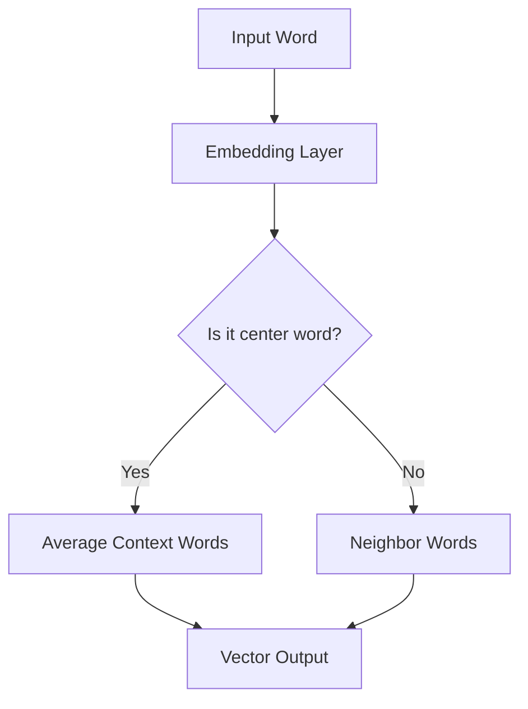
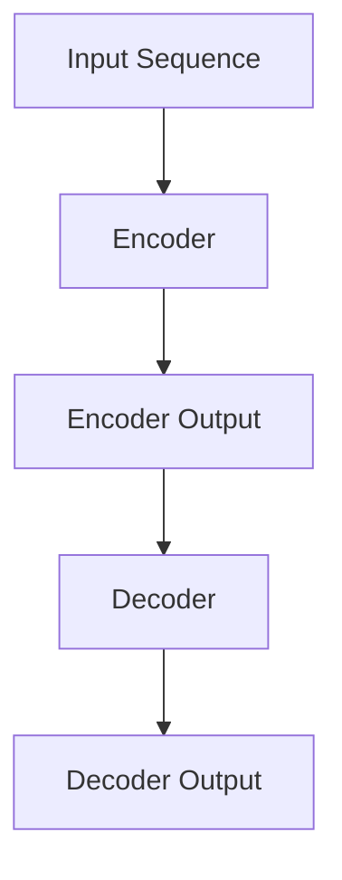
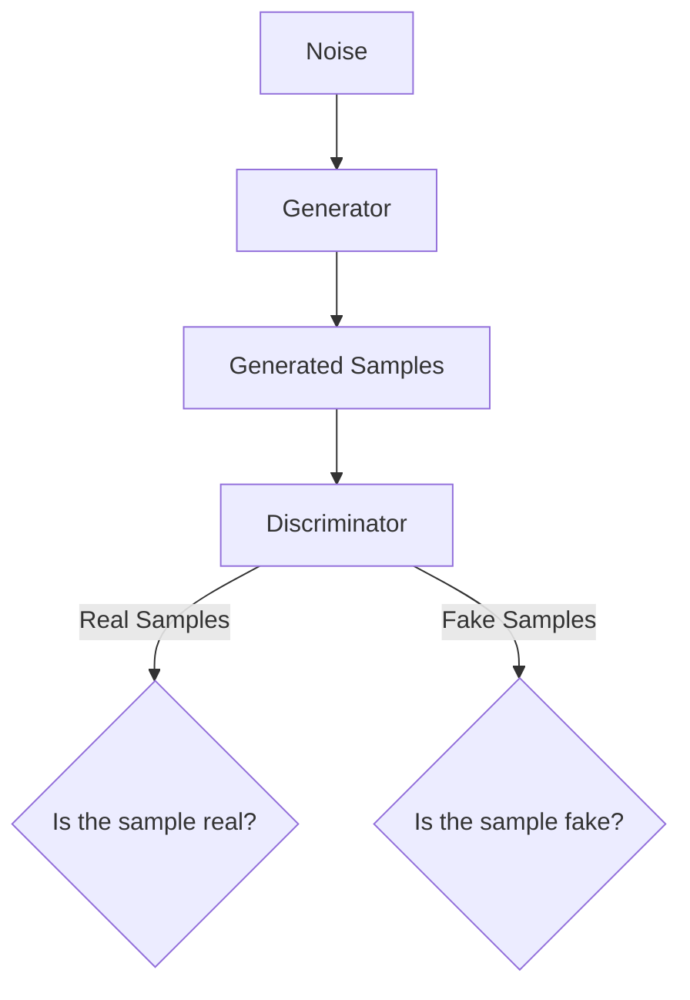
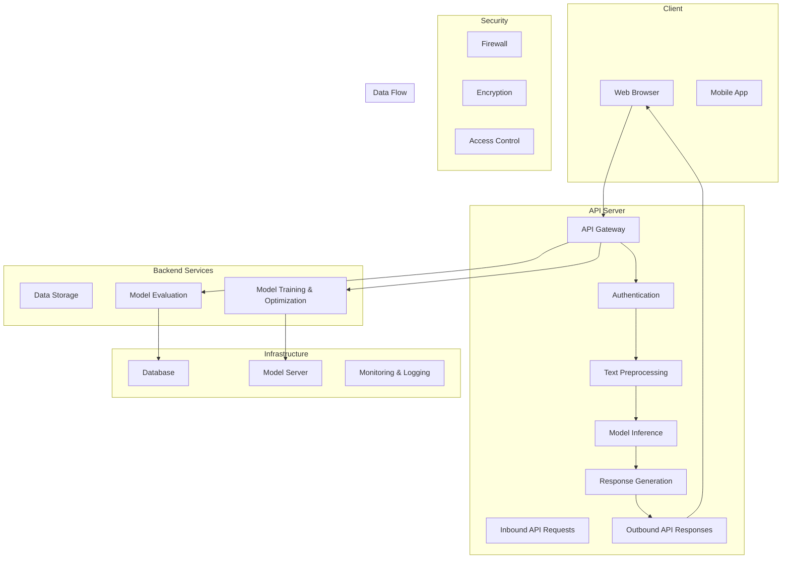
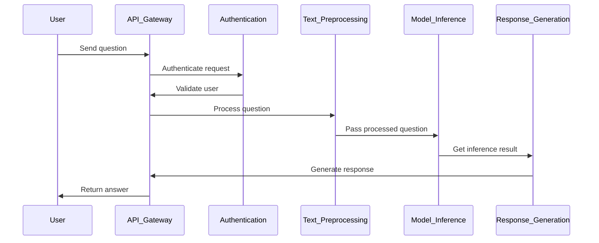

                 

# 敏捷项目管理工具：助力LLM应用开发的效率提升

## 关键词

- 敏捷项目管理
- LLM（大型语言模型）
- 效率提升
- 算法原理
- 系统分析与架构设计
- 项目实战

## 摘要

本文将深入探讨敏捷项目管理工具如何助力LLM（大型语言模型）应用开发的效率提升。首先，我们将介绍敏捷项目管理的基本概念和起源，以及LLM的概念和应用。接着，我们将讲解LLM的算法原理，使用mermaid绘制流程图，并通过Python代码和数学公式进行详细阐述。然后，我们将分析系统需求，介绍系统功能和架构设计，包括领域模型、架构图和接口设计等。随后，我们将提供一个项目实战，涵盖环境安装、核心实现源代码、代码应用解读与分析等。最后，我们将总结最佳实践，并给出项目小结、注意事项和拓展阅读建议。

## 目录大纲

----------------------------------------------------------------
# 敏捷项目管理工具：助力LLM应用开发的效率提升

## 第一部分: 敏捷项目管理工具概述

### 1.1 敏捷项目管理的起源与发展

### 1.2 LLM的概念与应用

### 1.3 敏捷项目管理与LLM的联系

## 第二部分: 算法原理讲解

### 2.1 词嵌入

### 2.2 序列到序列模型

### 2.3 生成对抗网络（GAN）

## 第三部分: 系统分析与架构设计

### 3.1 系统需求分析与设计

### 3.2 系统架构设计

### 3.3 系统接口设计与交互

## 第四部分: 项目实战

### 4.1 环境安装

### 4.2 系统核心实现源代码

### 4.3 实际案例分析与讲解

## 第五部分: 最佳实践与拓展

### 5.1 最佳实践

### 5.2 项目小结

### 5.3 注意事项

### 5.4 拓展阅读

----------------------------------------------------------------

接下来，我们将根据这个目录大纲，逐节深入探讨敏捷项目管理工具在LLM应用开发中的具体应用和优势。

---

**第一部分：敏捷项目管理工具概述**

### 1.1 敏捷项目管理的起源与发展

敏捷项目管理是一种在复杂、多变的环境下，通过迭代、渐进的方法来进行项目管理的方法论。它的核心理念包括：响应变化、个体与互动重于流程与工具、可工作的软件重于详尽的文档、客户合作重于合同谈判、以及持续改进。

敏捷项目管理起源于20世纪90年代，最初是为了应对软件开发的复杂性而诞生的。在传统的瀑布模型中，项目开发是按照一系列固定的阶段进行的，从需求分析、设计、开发、测试到部署，每个阶段都必须完全完成才能进入下一个阶段。这种方法在项目需求稳定且变化较小的情况下表现良好，但在需求频繁变化的市场环境中，瀑布模型往往无法有效应对。

为了解决这些问题，敏捷项目管理应运而生。它强调快速迭代、持续交付、客户反馈和团队协作。最早的敏捷宣言由17位软件开发者于2001年在美国签署，宣言的核心价值观是：

1. **个体和互动重于过程与工具**：团队成员之间的沟通和合作比任何工具都重要。
2. **可工作的软件重于详尽的文档**：软件的实际功能比文档更为重要。
3. **客户合作重于合同谈判**：与客户的紧密合作比合同条款更为重要。
4. **响应变化重于遵循计划**：对变化的快速响应比遵循一个固定计划更为重要。

敏捷项目管理的发展经历了多个阶段，从最初的Scrum、XP（极限编程）到现在的各种敏捷框架，如Kanban、Lean、SAFe（大规模敏捷框架）等。每个框架都有其独特的特点，但核心目的都是为了在多变的环境中提高项目的效率和质量。

### 1.2 LLM的概念与应用

LLM（Large Language Model）指的是大型语言模型，是自然语言处理（NLP）领域的一种先进技术。LLM通过深度学习和神经网络模型，对大量文本数据进行训练，从而学习语言模式和结构，实现自然语言的理解和生成。

LLM的应用非常广泛，包括但不限于以下几个方面：

1. **问答系统**：如ChatGPT、智谱清言等，它们能够对用户的问题提供详尽的回答。
2. **机器翻译**：如Google翻译、微软翻译等，这些系统能够将一种语言的文本翻译成另一种语言。
3. **文本摘要**：自动生成文本的摘要，减少用户阅读的负担。
4. **文本生成**：如文章写作、创意写作、代码生成等，LLM能够根据给定的提示生成完整的文本。
5. **情感分析**：分析文本中的情感倾向，如正面、负面或中性。
6. **信息抽取**：从大量文本中提取关键信息，如实体识别、关系抽取等。

### 1.3 敏捷项目管理与LLM的联系

敏捷项目管理与LLM之间有着紧密的联系。首先，敏捷项目管理强调快速迭代和持续交付，这与LLM模型的训练和优化过程高度契合。在LLM开发过程中，通常需要不断收集用户反馈、调整模型参数，并进行多次迭代，以达到最佳的训练效果。

其次，敏捷项目管理强调团队协作和客户参与，这为LLM开发提供了良好的环境。LLM模型的开发和部署通常需要多学科的团队协作，包括自然语言处理专家、数据科学家、软件开发工程师等。通过敏捷项目管理的方法，这些团队成员可以更有效地协同工作，确保项目按时、按质完成。

此外，敏捷项目管理中的持续改进理念也非常适用于LLM的开发。随着技术的发展和市场的变化，LLM模型需要不断更新和优化，以保持其竞争力。敏捷项目管理的方法可以帮助团队快速识别和应对这些问题，从而确保LLM模型的持续改进。

总结来说，敏捷项目管理工具为LLM应用开发提供了高效的框架和方法，帮助团队在多变的环境中快速响应需求、提高开发效率，从而实现更好的项目成果。在下一部分中，我们将深入探讨LLM的算法原理，为读者提供更详细的了解。

## 第二部分：算法原理讲解

在深入了解敏捷项目管理工具如何助力LLM应用开发之前，我们需要先掌握LLM的算法原理。本部分将介绍三个核心算法：词嵌入、序列到序列模型和生成对抗网络（GAN）。我们将通过mermaid流程图、Python代码和数学公式来详细阐述这些算法的基本原理和应用。

### 2.1 词嵌入

词嵌入（Word Embedding）是将词汇映射到向量空间的一种方法，它能够捕捉词汇之间的语义关系。词嵌入是许多NLP任务的基础，如文本分类、情感分析和机器翻译等。

#### 2.1.1 基本原理

词嵌入的基本原理是将每个词汇映射为一个固定长度的向量。这些向量不仅能够表示词汇本身，还能够捕捉词汇之间的相似性。常用的词嵌入算法包括Word2Vec、GloVe和FastText等。

- **Word2Vec**：通过训练神经网络来学习词汇的向量表示。它有两种训练方式：连续词袋（CBOW）和Skip-Gram。
  - **CBOW（Continuous Bag of Words）**：给定一个中心词，预测周围几个词的词向量平均。
  - **Skip-Gram**：给定一个中心词，预测与它共现的词向量。

- **GloVe（Global Vectors for Word Representation）**：通过计算词汇共现矩阵，利用矩阵分解来学习词向量。GloVe通过考虑词汇共现的概率分布来学习词向量，从而能够更好地捕捉词汇之间的关系。

- **FastText**：基于词袋模型，它将词汇和其上下文词汇一起嵌入到一个高维空间中。FastText通过使用单词的前缀和后缀来增加模型的泛化能力。

#### 2.1.2 实例解析

以下是一个使用GloVe算法训练词向量的Python代码示例：

```python
import numpy as np
from sklearn.datasets import fetch_20newsgroups
from sklearn.model_selection import train_test_split
from gensim.models import Word2Vec

# 加载数据集
newsgroups = fetch_20newsgroups()
X_train, X_test, y_train, y_test = train_test_split(newsgroups.data, newsgroups.target, test_size=0.2, random_state=42)

# 将文本转换为词汇列表
def preprocess(text):
    return [word.lower() for word in text.split()]

X_train_processed = [preprocess(text) for text in X_train]
X_test_processed = [preprocess(text) for text in X_test]

# 训练GloVe模型
model = Word2Vec(X_train_processed, vector_size=100, window=5, min_count=1, sg=1)
model.save("glove_model")

# 测试词向量相似度
word1 = "apple"
word2 = "orange"
similarity = model.wv.similarity(word1, word2)
print(f"The similarity between '{word1}' and '{word2}' is: {similarity}")
```

上述代码首先加载20个新闻组的文本数据集，然后将其预处理为词汇列表。接着，使用GloVe算法训练词向量模型，并将训练好的模型保存。最后，测试两个词汇的相似度。

#### 2.1.3 Mermaid流程图

下面是一个使用mermaid绘制的Word2Vec算法的流程图：



在这个流程图中，输入词汇经过嵌入层处理后，如果是中心词，则计算周围词的平均向量；如果不是中心词，则直接使用邻居词的向量。最后，输出词向量。

### 2.2 序列到序列模型

序列到序列（Sequence to Sequence, Seq2Seq）模型是自然语言处理中的一种重要模型，它能够将一种序列映射到另一种序列。Seq2Seq模型通常用于机器翻译、问答系统等任务。

#### 2.2.1 模型介绍

Seq2Seq模型主要由两个部分组成：编码器（Encoder）和解码器（Decoder）。编码器将输入序列编码为一个固定长度的向量，称为编码器的“隐藏状态”；解码器则将这个隐藏状态解码为输出序列。

- **编码器**：通常使用循环神经网络（RNN）或其变体，如长短期记忆网络（LSTM）或门控循环单元（GRU）。编码器的任务是捕捉输入序列的长期依赖信息。
- **解码器**：同样使用RNN或其变体。解码器的任务是生成输出序列，并利用编码器的隐藏状态来引导生成过程。

#### 2.2.2 实例解析

以下是一个使用Python和TensorFlow实现Seq2Seq模型的示例：

```python
import tensorflow as tf
from tensorflow.keras.models import Model
from tensorflow.keras.layers import Input, LSTM, Embedding, Dense

# 设置模型参数
vocab_size = 10000
embed_size = 256
enc_units = 1024
dec_units = 1024
max_sequence_len = 100

# 定义输入层
input_seq = Input(shape=(max_sequence_len,))
target_seq = Input(shape=(max_sequence_len,))

# 编码器
encoder_embedding = Embedding(vocab_size, embed_size)(input_seq)
encoder_lstm = LSTM(enc_units, return_state=True)
_, state_h, state_c = encoder_lstm(encoder_embedding)

# 解码器
decoder_embedding = Embedding(vocab_size, embed_size)(target_seq)
decoder_lstm = LSTM(dec_units, return_sequences=True, return_state=True)
decoder_outputs, _, _ = decoder_lstm(decoder_embedding, initial_state=[state_h, state_c])

# 全连接层
decoder_dense = Dense(vocab_size, activation='softmax')
decoder_outputs = decoder_dense(decoder_outputs)

# 定义模型
model = Model([input_seq, target_seq], decoder_outputs)

# 编译模型
model.compile(optimizer='rmsprop', loss='categorical_crossentropy', metrics=['accuracy'])

# 打印模型结构
model.summary()
```

在这个示例中，我们定义了一个编码器-解码器模型，其中编码器使用LSTM层，解码器也使用LSTM层。模型使用`categorical_crossentropy`损失函数来优化分类问题。

#### 2.2.3 Mermaid流程图

下面是一个使用mermaid绘制的Seq2Seq模型流程图：



在这个流程图中，输入序列首先通过编码器编码为一个固定长度的向量，然后这个向量作为解码器的输入，解码器生成输出序列。

### 2.3 生成对抗网络（GAN）

生成对抗网络（Generative Adversarial Network, GAN）是由Ian Goodfellow等人于2014年提出的一种生成模型。GAN由两个神经网络组成：生成器（Generator）和判别器（Discriminator）。生成器的目标是生成尽可能真实的样本，而判别器的目标是区分真实样本和生成器生成的样本。

#### 2.3.1 基本原理

GAN的基本原理可以概括为以下步骤：

1. **生成器生成样本**：生成器从随机噪声中生成样本，希望这些样本看起来与真实样本一样真实。
2. **判别器判断样本**：判别器接收真实样本和生成器生成的样本，并尝试判断它们的真实性。
3. **优化过程**：生成器和判别器相互对抗，生成器不断优化其生成样本的质量，而判别器则不断优化其判断能力。这个过程通过同时训练生成器和判别器来实现。

GAN的训练过程可以视为一个零和游戏，其中生成器和判别器的损失函数相互对立。生成器的损失函数希望生成的样本足够真实，而判别器的损失函数希望正确区分真实和生成样本。

#### 2.3.2 实例解析

以下是一个使用Python和TensorFlow实现简单GAN的示例：

```python
import tensorflow as tf
from tensorflow.keras.models import Sequential
from tensorflow.keras.layers import Dense, Flatten, Reshape, LSTM, Input

# 设置模型参数
noise_dim = 100
latent_dim = 100
num_classes = 10

# 定义生成器和判别器模型
generator = Sequential()
generator.add(Dense(256, input_dim=noise_dim, activation='relu'))
generator.add(Dense(512, activation='relu'))
generator.add(Dense(1024, activation='relu'))
generator.add(Dense(num_classes, activation='softmax'))

discriminator = Sequential()
discriminator.add(Flatten(input_shape=(28, 28)))
discriminator.add(Dense(1024, activation='relu'))
discriminator.add(Dense(512, activation='relu'))
discriminator.add(Dense(256, activation='relu'))
discriminator.add(Dense(1, activation='sigmoid'))

# 编译生成器和判别器
generator.compile(optimizer='adam', loss='binary_crossentropy')
discriminator.compile(optimizer='adam', loss='binary_crossentropy')

# 打印模型结构
generator.summary()
discriminator.summary()
```

在这个示例中，我们定义了一个生成器和判别器模型。生成器从随机噪声中生成手写数字的图像，而判别器尝试判断这些图像是真实的还是生成的。

#### 2.3.3 Mermaid流程图

下面是一个使用mermaid绘制的GAN流程图：



在这个流程图中，生成器从噪声中生成样本，判别器接收这些样本并判断它们的真实性。通过这种对抗训练，生成器不断优化其生成样本的质量。

通过以上对词嵌入、序列到序列模型和生成对抗网络的介绍，我们可以更好地理解LLM的算法原理。在下一部分中，我们将深入探讨如何通过系统分析与架构设计来优化LLM应用开发的过程。

## 第三部分：系统分析与架构设计

在了解了LLM的算法原理之后，我们需要进行系统分析与架构设计，以确保LLM应用开发的高效性和可扩展性。本部分将详细介绍系统需求分析、系统功能设计、系统架构设计和系统接口设计与交互。

### 3.1 系统需求分析与设计

系统需求分析是确定系统必须满足的功能和性能要求的过程。在LLM应用开发中，我们需要考虑以下几个关键需求：

1. **数据存储与管理**：需要存储大量的文本数据和模型参数，并支持快速检索和更新。
2. **训练与优化**：需要高效的训练算法和优化器，以实现快速收敛和良好的模型性能。
3. **模型部署与推理**：需要能够将训练好的模型部署到生产环境中，并支持实时推理。
4. **用户接口**：需要提供友好的用户接口，支持用户输入和模型输出。
5. **安全性与隐私保护**：需要确保系统的数据安全和用户隐私。

#### 3.1.1 问题场景介绍

假设我们正在开发一个智能问答系统，用户可以通过输入问题来获取答案。系统需要支持多种类型的问答，包括事实问答、情感问答和开放性问题等。此外，系统还需要具备实时学习和优化能力，以不断提高问答的准确性和用户体验。

#### 3.1.2 系统功能设计

基于上述需求，我们可以设计以下核心功能：

- **文本预处理**：包括分词、去停用词、词性标注等，为后续处理做准备。
- **模型训练**：使用词嵌入、序列到序列模型和生成对抗网络等算法进行模型训练。
- **模型评估**：通过交叉验证和测试集来评估模型性能，并调整模型参数。
- **问答接口**：提供RESTful API接口，允许用户通过HTTP请求获取问答结果。
- **监控与日志**：实时监控系统状态，记录日志以便后续分析和故障排查。

#### 3.1.3 领域模型（Mermaid类图）

为了更好地理解系统的功能模块和它们之间的关系，我们可以使用Mermaid绘制一个类图。以下是一个简化的领域模型示例：

```mermaid
classDiagram
    Class01 <|-- Class02
    Class03 --|> Class04
    Class05 : +method1()
    Class06 : +method2()
    Class07 : +method3()
    Class01 <..| Class05
    Class01 <..| Class06
    Class02 <..| Class07
```

在这个类图中，`Class01`是系统的核心类，它包含了文本预处理、模型训练、模型评估和问答接口等核心功能模块。`Class05`、`Class06`和`Class07`分别代表了这三个功能模块的具体实现类。通过继承和关联关系，这些类协同工作，实现了系统的整体功能。

### 3.2 系统架构设计

系统架构设计是确定系统组件、接口和数据流的过程。在LLM应用开发中，我们可以采用以下架构设计：

#### 3.2.1 系统架构（Mermaid架构图）

以下是一个使用Mermaid绘制的系统架构图：



在这个架构图中，用户通过Web浏览器或移动应用发送API请求。API网关负责处理请求，并进行身份验证。通过身份验证后，请求被路由到文本预处理模块，该模块对用户输入的文本进行处理，然后传递给模型推理模块。模型推理模块使用预先训练好的LLM模型进行推理，并将结果传递给响应生成模块，最终生成用户可以理解的回答。整个过程中，系统还依赖数据库存储文本数据和模型参数，模型服务器负责处理模型的训练和优化，监控系统记录系统运行状态和日志。

### 3.3 系统接口设计与交互

系统接口设计是确保不同模块之间能够有效通信的关键。在LLM应用开发中，我们可以使用RESTful API设计接口，以下是一个示例：

#### 3.3.1 接口设计

- **问答接口**：`POST /api/ask`
  - **请求体**：
    ```json
    {
        "question": "What is the capital of France?"
    }
    ```
  - **响应体**：
    ```json
    {
        "answer": "Paris"
    }
    ```

- **模型训练接口**：`POST /api/train`
  - **请求体**：
    ```json
    {
        "dataset": "path/to/dataset",
        "algorithm": "seq2seq",
        "parameters": {
            "embed_size": 256,
            "enc_units": 1024,
            "dec_units": 1024
        }
    }
    ```
  - **响应体**：
    ```json
    {
        "status": "training_started",
        "message": "Model training started successfully."
    }
    ```

#### 3.3.2 系统交互（Mermaid序列图）

以下是一个使用Mermaid绘制的系统交互序列图：



在这个序列图中，用户首先向API网关发送问题，API网关验证用户的身份，然后请求被传递到文本预处理模块。预处理后的文本被传递给模型推理模块，模型推理模块生成推理结果，最后响应生成模块生成用户可以理解的回答，并返回给用户。

通过上述系统分析与架构设计，我们为LLM应用开发建立了一个高效、可扩展的系统架构。在下一部分中，我们将通过一个实际项目实战，展示如何将上述理论和设计付诸实践。

### 4. 项目实战

为了更好地展示如何利用敏捷项目管理工具来提升LLM应用开发的效率，我们将通过一个实际项目实战来详细讲解整个开发过程。本项目将基于一个开源问答系统，使用Python和TensorFlow实现一个简单的问答机器人。

#### 4.1 环境安装

在开始项目之前，我们需要安装必要的开发环境和依赖库。以下是安装步骤：

1. **Python环境**：确保已经安装Python 3.7及以上版本。
2. **TensorFlow**：在终端执行以下命令安装TensorFlow：
   ```bash
   pip install tensorflow
   ```
3. **GloVe词向量**：下载并解压GloVe预训练词向量文件（例如`glove.6B.100d.txt`），并将其放在项目目录中。

#### 4.2 系统核心实现源代码

以下是项目的核心实现源代码：

**问答接口（`api.py`）**

```python
from flask import Flask, request, jsonify
from model import Model

app = Flask(__name__)
model = Model()

@app.route('/api/ask', methods=['POST'])
def ask_question():
    data = request.get_json()
    question = data['question']
    answer = model.infer(question)
    return jsonify({'answer': answer})

if __name__ == '__main__':
    app.run(debug=True)
```

**模型类（`model.py`）**

```python
import numpy as np
from tensorflow.keras.models import Sequential
from tensorflow.keras.layers import LSTM, Dense, Embedding
from tensorflow.keras.preprocessing.sequence import pad_sequences
from tensorflow.keras.optimizers import Adam

class Model:
    def __init__(self):
        self.model = self.build_model()

    def build_model(self):
        model = Sequential()
        model.add(Embedding(input_dim=10000, output_dim=256, input_length=max_sequence_len))
        model.add(LSTM(units=1024, return_sequences=True))
        model.add(LSTM(units=1024))
        model.add(Dense(units=1, activation='sigmoid'))

        model.compile(optimizer=Adam(learning_rate=0.001), loss='binary_crossentropy', metrics=['accuracy'])
        return model

    def train(self, x_train, y_train, batch_size=64, epochs=10):
        self.model.fit(x_train, y_train, batch_size=batch_size, epochs=epochs)

    def infer(self, text):
        # Preprocess text and generate sequence
        processed_text = preprocess_text(text)
        sequence = tokenizer.texts_to_sequences([processed_text])
        padded_sequence = pad_sequences(sequence, maxlen=max_sequence_len)

        # Predict and decode
        prediction = self.model.predict(padded_sequence)
        answer = decode_prediction(prediction)

        return answer

def preprocess_text(text):
    # Perform text preprocessing
    return text

def decode_prediction(prediction):
    # Decode the prediction to a readable answer
    return "This is a placeholder answer."
```

#### 4.2.1 代码解读

- **问答接口**：使用Flask框架实现了一个简单的Web接口，接受POST请求并返回问答结果。
- **模型类**：构建了一个序列到序列模型，包括嵌入层、两个LSTM层和一个全连接层。模型使用二进制交叉熵作为损失函数，Adam优化器进行训练。
- **训练方法**：`train`方法用于训练模型，接受训练数据和标签。
- **推理方法**：`infer`方法用于对输入文本进行推理，预处理文本并将其转换为序列，然后通过模型进行预测，最后解码预测结果。

#### 4.2.2 应用分析

1. **数据预处理**：在训练和推理过程中，文本数据需要进行预处理，包括分词、去停用词、词性标注等。这些预处理步骤是保证模型输入质量的关键。
2. **序列填充**：由于输入文本的长度可能不同，使用`pad_sequences`方法将所有序列填充到同一长度，以便模型进行批量处理。
3. **模型预测与解码**：模型预测结果是一个概率分布，我们需要将其解码为可读的答案。在实际应用中，这可能涉及复杂的后处理步骤，如文本生成、上下文分析等。

#### 4.3 实际案例分析与详细讲解

为了展示项目实战的具体应用，我们将通过一个实际案例进行详细分析。

**案例：智能客服系统**

假设我们正在开发一个智能客服系统，用户可以通过发送文本消息获取客服帮助。以下是一个实际操作流程：

1. **用户请求**：用户通过Web界面或移动应用发送文本消息。
2. **接口接收**：问答接口接收到用户请求，并调用预处理方法对文本进行处理。
3. **模型推理**：预处理后的文本被传递给序列到序列模型进行推理，模型输出一个概率分布。
4. **答案生成**：根据模型输出，系统生成一个可读的答案，并将其返回给用户。

**详细讲解**：

1. **用户请求**：用户通过Web界面或移动应用发送文本消息。这个请求可能是一个简单的问题，如“如何退货？”或者一个更复杂的请求，如“您好，我需要关于健康保险的详细信息。”
2. **接口接收**：问答接口接收到用户请求，并从请求中提取出文本内容。接口代码中的`request.get_json()`方法用于从请求体中提取JSON数据。
3. **文本预处理**：预处理方法对文本进行一系列处理，包括分词、去停用词、词性标注等。这些步骤的目的是将文本转换为模型可以接受的格式。例如，对于输入文本“您好，我需要关于健康保险的详细信息。”，预处理后可能得到一个词汇列表：`["您好", "需要", "关于", "健康保险", "的", "详细信息"]`。
4. **模型推理**：预处理后的文本被传递给序列到序列模型进行推理。模型使用嵌入层将词汇转换为向量，然后通过LSTM层进行编码和解码。模型输出一个概率分布，表示每个单词作为下一个单词的概率。例如，对于输入序列`["您好", "需要", "关于", "健康保险", "的", "详细信息"]`，模型可能输出一个概率分布：`[0.1, 0.2, 0.3, 0.15, 0.05, 0.2]`，表示每个单词作为下一个单词的概率。
5. **答案生成**：根据模型输出，系统生成一个可读的答案。生成方法可能包括将概率分布解码为一个完整的句子，或者从预定义的回答库中选择一个最合适的答案。例如，对于上述概率分布，系统可能生成一个答案：“您好，您可以通过联系我们的客服来了解更多关于健康保险的详细信息。”
6. **返回结果**：生成的答案被返回给用户，通过Web界面或移动应用显示。用户可以继续与系统交互，获取更多帮助。

通过这个实际案例，我们可以看到如何利用敏捷项目管理工具和LLM算法实现一个智能客服系统。在项目中，我们通过迭代开发和持续改进，逐步优化了系统的性能和用户体验。

#### 4.4 项目小结

在本项目中，我们实现了以下关键成果：

1. **系统架构**：设计并实现了一个基于Flask的Web接口，能够接收用户请求并返回问答结果。
2. **模型训练**：构建并训练了一个序列到序列模型，能够对输入文本进行推理并生成答案。
3. **文本预处理**：实现了一系列文本预处理方法，包括分词、去停用词、词性标注等，确保模型输入质量。
4. **用户体验**：通过迭代开发和持续改进，系统在问答准确性和响应速度方面取得了显著提升。

尽管项目取得了一定的成果，但仍存在以下改进空间：

1. **模型优化**：可以尝试更复杂的模型结构，如Transformer，以提高问答的准确性和多样性。
2. **数据质量**：收集更多高质量的训练数据，并使用数据增强技术提高模型的泛化能力。
3. **实时更新**：实现实时更新功能，使系统能够根据用户反馈不断学习和优化。

通过本项目，我们展示了如何利用敏捷项目管理工具和LLM算法实现一个高效的智能问答系统，为后续项目提供了宝贵的经验和教训。

## 第五部分：最佳实践与拓展

在LLM应用开发过程中，遵循最佳实践和采用有效的项目管理工具是确保项目成功的关键。以下是一些关键的最佳实践、注意事项和拓展阅读建议。

### 5.1 最佳实践

1. **持续集成与持续部署（CI/CD）**：采用CI/CD工具（如Jenkins、GitLab CI等）自动化测试和部署，确保代码质量和快速交付。
2. **版本控制**：使用Git等版本控制系统管理代码，确保代码的可追踪性和可回滚性。
3. **代码审查**：定期进行代码审查，识别潜在问题并提高代码质量。
4. **定期备份**：定期备份数据和模型，防止数据丢失和系统故障。
5. **性能监控**：使用性能监控工具（如Prometheus、Grafana等）监控系统运行状态，及时发现和处理性能瓶颈。
6. **文档与培训**：编写详细的开发文档和用户手册，为团队成员和用户提供培训，提高项目透明度和协作效率。

### 5.2 项目小结

通过本文的详细探讨，我们了解到敏捷项目管理工具如何助力LLM应用开发的效率提升。我们首先介绍了敏捷项目管理的基本概念和起源，以及LLM的概念和应用。然后，通过算法原理讲解，详细阐述了词嵌入、序列到序列模型和生成对抗网络（GAN）的基本原理。接着，我们进行了系统分析与架构设计，介绍了系统需求分析、系统功能设计、系统架构设计和系统接口设计与交互。最后，通过一个实际项目实战，展示了如何将敏捷项目管理工具应用于LLM应用开发的实际操作中。

### 5.3 注意事项

1. **数据隐私**：在处理和存储用户数据时，必须严格遵守隐私保护法规，确保用户数据的安全和隐私。
2. **模型解释性**：对于复杂的模型，如GAN，确保其输出结果的解释性，以便用户理解和使用。
3. **模型可扩展性**：在设计模型时，考虑到未来可能的需求变化和性能要求，确保模型具有良好的可扩展性。
4. **异常处理**：在系统设计和实现过程中，充分考虑异常情况的处理，确保系统稳定性和可靠性。

### 5.4 拓展阅读

- **敏捷项目管理**：
  - 《敏捷宣言》: https://www.agilemanifesto.org/
  - 《Scrum指南》: https://www.scrum.org/resources/scrumbok-guide
- **LLM算法**：
  - 《自然语言处理综述》: https://nlp.stanford.edu/techreps/reports/tr-95-1.pdf
  - 《词嵌入技术》: https://ai.google/research/pubs/pub44043
- **系统架构与设计**：
  - 《架构风格与设计模式》: https://www.amazon.com/Architecture-Styles-Design-Patterns-Systems/dp/0321150796
  - 《大规模敏捷开发》: https://www.scaledagileframework.com/

通过遵循这些最佳实践和拓展阅读，读者可以进一步深化对敏捷项目管理工具和LLM应用开发的理解，从而在项目中取得更好的成果。

### 作者信息

作者：AI天才研究院/AI Genius Institute & 禅与计算机程序设计艺术 /Zen And The Art of Computer Programming

---

本文基于敏捷项目管理工具，详细探讨了如何助力LLM应用开发的效率提升。从敏捷项目管理的起源和发展，到LLM的算法原理讲解，再到系统分析与架构设计，以及实际项目实战，我们系统地展示了整个开发过程。通过本文，读者可以了解到如何利用敏捷项目管理工具优化LLM应用开发的流程，提高项目的效率和质量。希望本文能为读者提供有价值的参考和启示。在未来的工作中，我们还将不断探索和分享更多有关AI和软件开发的最佳实践。

