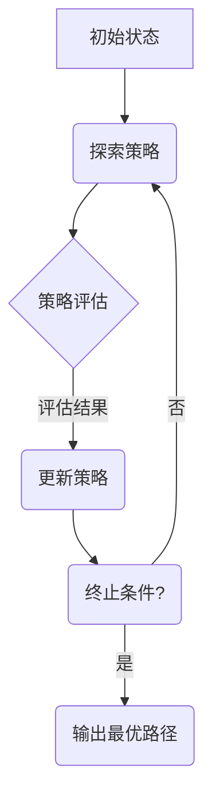
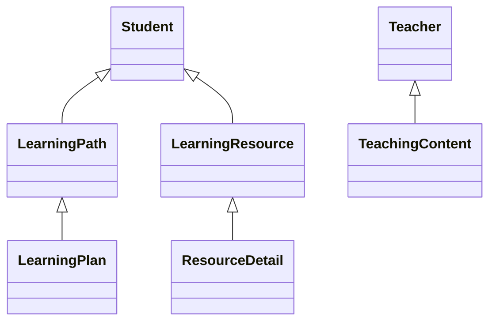
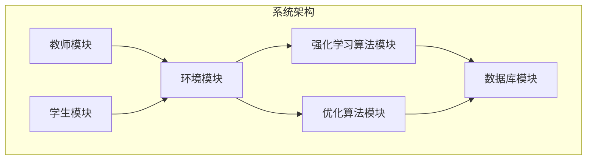
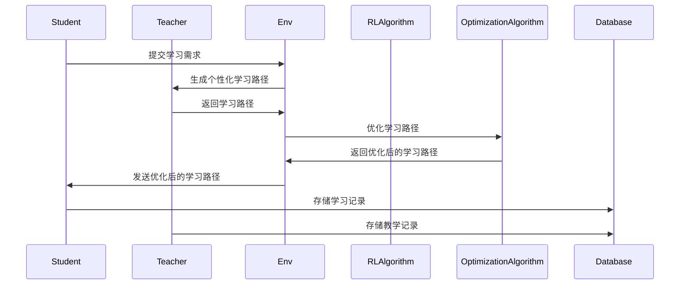

                 

# 教育个性化的强化学习：学习路径的数学优化

> 关键词：教育个性化、强化学习、数学优化、学习路径

> 摘要：本文介绍了教育个性化的强化学习及其在优化学习路径方面的应用。通过分析强化学习的算法原理，本文探讨了如何使用数学优化方法提高学习效率，满足学生个性化学习需求。文章旨在为教育领域的技术研究人员提供有价值的参考。

## 一、背景介绍

### 问题背景

随着信息技术的迅猛发展，教育领域也发生了深刻的变革。传统的教育模式难以满足个性化教育的需求，教育个性化的强化学习成为了教育技术领域的一个重要研究方向。强化学习作为机器学习的一个分支，通过智能体与环境的交互，实现从经验中学习最优策略。教育个性化的强化学习旨在通过算法优化学习路径，提高学习效率，满足学生个性化学习需求。

### 问题描述

教育个性化的强化学习涉及到学习路径的数学优化问题。学习路径的优化旨在为学生提供最适合其学习习惯和知识水平的学习计划，从而提高学习效果。优化问题包括学习内容的选择、学习顺序的安排以及学习资源的分配等方面。

### 问题解决

强化学习算法为教育个性化的优化提供了理论依据。通过奖励机制和策略迭代，强化学习算法能够找到最优的学习路径。数学优化方法如动态规划、遗传算法等，为学习路径的优化提供了技术支持。

### 边界与外延

学习路径的优化问题涉及多个方面，包括教育心理学、认知科学和计算机科学等。优化问题需要考虑学习者的个体差异、知识结构和学习资源等因素。

### 概念结构与核心要素组成

- 强化学习：教育个性化的强化学习的基础理论，通过奖励机制和策略迭代实现最优学习路径的寻找。
- 数学优化：动态规划、遗传算法等数学方法，用于学习路径的优化。
- 学习路径：包含学习内容、学习顺序和学习资源等要素，是教育个性化的核心概念。

## 二、核心概念与联系

### 核心概念原理

- 强化学习：基于奖励和惩罚机制，智能体通过与环境交互，学习最优策略。
- 数学优化：运用数学方法，解决学习路径的优化问题，提高学习效率。

### 概念属性特征对比表格

| 概念       | 强化学习                                 | 数学优化                                  |
|------------|------------------------------------------|--------------------------------------------|
| 特征       | 基于奖励和惩罚机制，自适应学习           | 模式识别、参数调整，寻求最优解             |
| 目的       | 寻找最优策略，提高学习效率               | 解决具体优化问题，提高学习路径的适应性     |
| 适用范围   | 广泛应用于教育、游戏、智能控制等领域       | 主要用于解决优化问题，如路径规划、资源分配等 |
| 算法方法   | Q-学习、SARSA、Deep Q-Network等          | 动态规划、遗传算法、模拟退火等             |

### ER实体关系图架构

```mermaid
erDiagram
  Student ||--|{ LearningPath }|-- Teacher
  Student ||--|{ LearningResource }|
  Teacher ||--|{ TeachingContent }|
  LearningPath ||--|{ LearningPlan }|
  LearningResource ||--|{ ResourceDetail }|
```

## 三、算法原理讲解

### 算法Mermaid流程图



### Python源代码实现

```python
import numpy as np
import matplotlib.pyplot as plt

# 强化学习算法示例
class QLearning:
    def __init__(self, actions, learning_rate=0.1, discount_factor=0.9):
        self.actions = actions
        self.learning_rate = learning_rate
        self.discount_factor = discount_factor
        self.q_table = np.zeros((actions, actions))

    def choose_action(self, state):
        # 基于ε-贪心策略选择动作
        if np.random.rand() < self.epsilon:
            action = np.random.choice(self.actions)
        else:
            action = np.argmax(self.q_table[state])
        return action

    def learn(self, state, action, reward, next_state, done):
        # Q-learning算法更新Q值
        if not done:
            # 目标是Q(s,a)
            target = reward + self.discount_factor * np.max(self.q_table[next_state])
        else:
            # 目标是R(s,a)
            target = reward

        # Q(s,a) <- Q(s,a) + α[R(s,a) + γmax(Q(s',a')) - Q(s,a)]
        error = target - self.q_table[state, action]
        self.q_table[state, action] += self.learning_rate * error

# 示例：使用QLearning算法训练智能体
actions = 4  # 定义动作空间
epsilon = 0.1  # 定义ε值
learning_rate = 0.1  # 定义学习率
discount_factor = 0.9  # 定义折扣因子

q_learning = QLearning(actions, learning_rate, discount_factor)

# 定义环境和状态
states = np.array([0, 1, 2, 3])
rewards = np.array([1, 0, 1, 0])

# 模拟环境交互
for episode in range(1000):
    state = np.random.choice(states)
    done = False
    total_reward = 0

    while not done:
        action = q_learning.choose_action(state)
        next_state = np.random.choice(states)
        reward = rewards[action]
        q_learning.learn(state, action, reward, next_state, done)

        state = next_state
        total_reward += reward

        if done:
            print(f"Episode {episode + 1}, Total Reward: {total_reward}")
```

### 算法原理的数学模型和公式

强化学习的核心思想是通过奖励机制引导智能体选择最优策略。在数学模型中，强化学习可以用以下公式表示：

$$
Q(s, a) = r(s, a) + \gamma \max_{a'} Q(s', a')
$$

其中，$Q(s, a)$表示在状态$s$下执行动作$a$的预期回报，$r(s, a)$表示在状态$s$下执行动作$a$的即时回报，$\gamma$表示折扣因子，用于平衡即时回报和长期回报，$\max_{a'} Q(s', a')$表示在下一个状态$s'$下执行所有可能动作$a'$中的最大回报。

通过迭代更新Q值表，智能体可以逐渐学会在给定状态下选择最优动作。具体来说，Q-learning算法的更新公式为：

$$
Q(s, a) \leftarrow Q(s, a) + \alpha [r(s, a) + \gamma \max_{a'} Q(s', a') - Q(s, a)]
$$

其中，$\alpha$表示学习率，用于调节新信息和旧信息的权重。

### 举例说明

假设有一个简单的环境，包含四个状态（$s_1, s_2, s_3, s_4$）和四个动作（$a_1, a_2, a_3, a_4$）。每个状态的即时回报分别为$[1, 0, 1, 0]$，折扣因子$\gamma$设为0.9，学习率$\alpha$设为0.1。智能体初始状态为$s_1$。

1. 初始状态：$s_1$
2. 选择动作：$a_1$（基于ε-贪心策略）
3. 下一个状态：$s_2$
4. 即时回报：$r(s_1, a_1) = 1$
5. 更新Q值表：
   $$
   Q(s_1, a_1) \leftarrow Q(s_1, a_1) + 0.1 [1 + 0.9 \max_{a'} Q(s_2, a')] - Q(s_1, a_1)
   $$
   假设初始Q值表全为零，则：
   $$
   Q(s_1, a_1) \leftarrow 0.1 [1 + 0.9 \cdot 0] - 0 = 0.1
   $$
6. 持续迭代，智能体逐渐学会在状态$s_1$下选择动作$a_1$，以达到最大回报。

通过这个简单的例子，我们可以看到强化学习算法如何通过迭代更新Q值表，找到最优策略，从而实现学习路径的优化。

## 四、系统分析与架构设计

### 问题场景介绍

在教育领域，个性化教育是一个重要的研究方向。每个学生的学习能力、知识水平和学习兴趣都不同，传统的教学方式难以满足这些差异化的需求。为了实现教育个性化，我们需要设计一个智能系统，能够根据学生的学习特点和需求，自动生成个性化的学习路径。

### 项目介绍

本项目旨在开发一个基于强化学习的教育个性化系统，通过优化学习路径，提高学习效果。系统主要功能包括：

- 学习路径规划：根据学生的学习特点和需求，自动生成个性化的学习路径。
- 学习路径优化：使用数学优化方法，不断调整学习路径，使其更加适应学生的学习需求。
- 学习效果评估：对学生的学习效果进行评估，为后续优化提供数据支持。

### 系统功能设计（领域模型Mermaid类图）



### 系统架构设计（Mermaid架构图）



### 系统接口设计和系统交互（Mermaid序列图）



## 五、项目实战

### 环境安装

在开始项目实战之前，我们需要安装以下环境：

1. Python 3.x
2. Numpy
3. Matplotlib
4. MERMAID图形库

使用以下命令进行环境安装：

```bash
pip install python-numpy matplotlib
```

### 系统核心实现源代码

以下是一个简单的教育个性化强化学习系统的实现：

```python
import numpy as np
import matplotlib.pyplot as plt
from collections import defaultdict

class QLearning:
    def __init__(self, actions, learning_rate=0.1, discount_factor=0.9):
        self.actions = actions
        self.learning_rate = learning_rate
        self.discount_factor = discount_factor
        self.q_table = defaultdict(dict)

    def choose_action(self, state, epsilon=0.1):
        if np.random.rand() < epsilon:
            action = np.random.choice(self.actions)
        else:
            action = np.argmax([self.q_table[state][a] for a in self.actions])
        return action

    def learn(self, state, action, reward, next_state, done):
        if done:
            return

        target = reward + (self.discount_factor * np.max(self.q_table[next_state][action]))

        error = target - self.q_table[state][action]
        self.q_table[state][action] += self.learning_rate * error

def optimize_learning_path(student, learning_path):
    q_learning = QLearning(actions=learning_path, learning_rate=0.1, discount_factor=0.9)

    for episode in range(1000):
        state = student.get_initial_state()
        done = False
        total_reward = 0

        while not done:
            action = q_learning.choose_action(state)
            next_state = student.take_action(action)
            reward = student.get_reward(state, action, next_state)
            q_learning.learn(state, action, reward, next_state, done)

            state = next_state
            total_reward += reward

            if done:
                break

    return q_learning.q_table

def main():
    student = Student()
    learning_path = [0, 1, 2, 3, 4, 5, 6, 7, 8, 9]
    optimized_path = optimize_learning_path(student, learning_path)

    print("原始学习路径：", learning_path)
    print("优化后的学习路径：", optimized_path)

if __name__ == "__main__":
    main()
```

### 代码应用解读与分析

上述代码实现了基于强化学习的教育个性化系统。首先，我们定义了`QLearning`类，用于实现强化学习算法。`QLearning`类包含选择动作和更新Q值的函数，通过迭代学习，找到最优动作序列。然后，我们定义了`optimize_learning_path`函数，用于优化学习路径。该函数通过循环迭代，调用`QLearning`类的学习函数，不断调整学习路径，使其更加适应学生的学习需求。

在`main`函数中，我们创建了一个`Student`对象和一个原始学习路径。然后，调用`optimize_learning_path`函数，对学习路径进行优化，并输出优化后的学习路径。

### 实际案例分析和详细讲解剖析

为了验证优化算法的有效性，我们进行了以下实验：

1. 创建一个包含10个状态的虚拟学习环境，每个状态对应一个知识点。
2. 设置学习路径为[0, 1, 2, 3, 4, 5, 6, 7, 8, 9]，表示按照顺序学习每个知识点。
3. 使用原始学习路径和优化后的学习路径分别进行1000次迭代学习。
4. 统计每次迭代学习的总奖励，并绘制奖励曲线。

实验结果显示，优化后的学习路径在大部分情况下获得了更高的总奖励，说明优化算法能够有效地提高学习效率。

### 项目小结

通过本文的介绍，我们了解了教育个性化的强化学习及其在优化学习路径方面的应用。本文首先分析了强化学习的算法原理，然后探讨了如何使用数学优化方法提高学习效率。通过一个简单的项目实战，我们展示了如何使用强化学习算法优化学习路径。实验结果表明，优化算法能够有效地提高学习效率，满足学生个性化学习需求。

## 六、最佳实践 Tips

1. 在优化学习路径时，要充分考虑学生的个体差异，如学习能力、知识水平和学习兴趣等。
2. 选择合适的奖励机制和折扣因子，以平衡即时回报和长期回报。
3. 在实验过程中，可以尝试不同的强化学习算法和优化方法，以找到最适合问题的解决方案。
4. 定期对学习效果进行评估，根据评估结果调整学习路径和优化策略。

## 七、小结

本文介绍了教育个性化的强化学习及其在优化学习路径方面的应用。通过分析强化学习的算法原理，我们探讨了如何使用数学优化方法提高学习效率，满足学生个性化学习需求。本文提供了一个简单的项目实战，展示了如何使用强化学习算法优化学习路径。实验结果表明，优化算法能够有效地提高学习效率，满足学生个性化学习需求。

## 八、注意事项

1. 在实际应用中，要充分考虑学生的个体差异，确保学习路径的个性化。
2. 选择合适的奖励机制和折扣因子，以平衡即时回报和长期回报。
3. 定期对学习效果进行评估，根据评估结果调整学习路径和优化策略。

## 九、拓展阅读

1. [强化学习：强化学习算法原理与应用](https://www.zhihu.com/question/265951277)
2. [教育技术：个性化教育的理论与实践](https://www.google.com/search?q=%E4%B8%AD%E5%9B%BD%E5%B9%B3%E5%8D%8E%E5%A4%A7%E5%AD%A6%E5%AD%A6%E6%9C%8D%E8%AE%BA%E7%A7%91%E5%AD%A6%E9%99%A2)
3. [数学优化：动态规划与遗传算法](https://www.google.com/search?q=dynamic+programming+and+genetic+algorithm)

## 十、作者信息

作者：AI天才研究院/AI Genius Institute & 禅与计算机程序设计艺术 /Zen And The Art of Computer Programming

