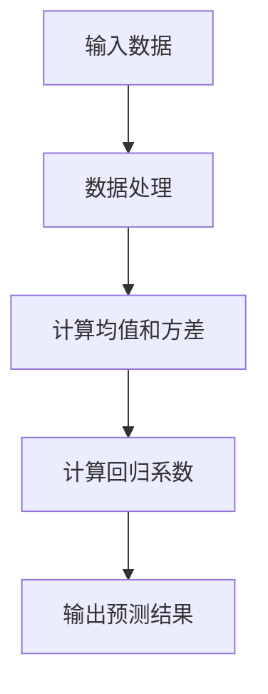
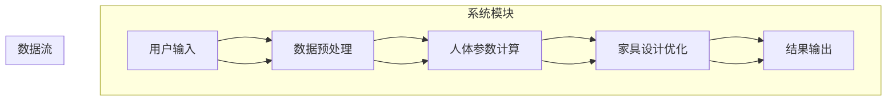
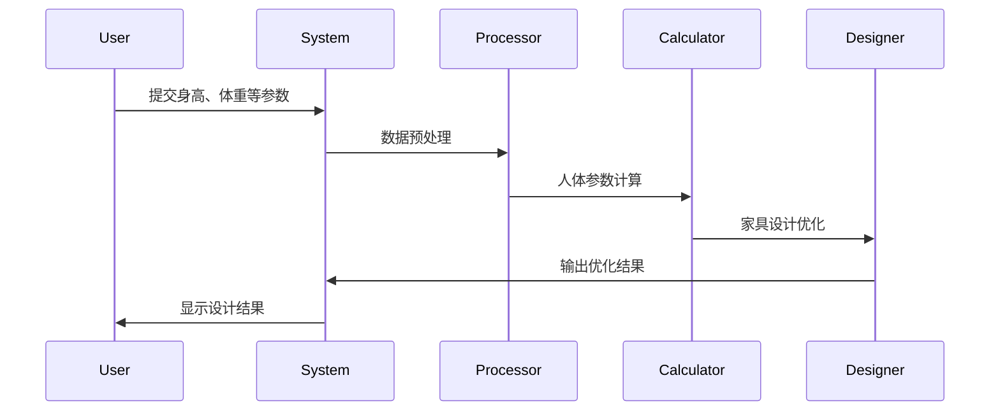
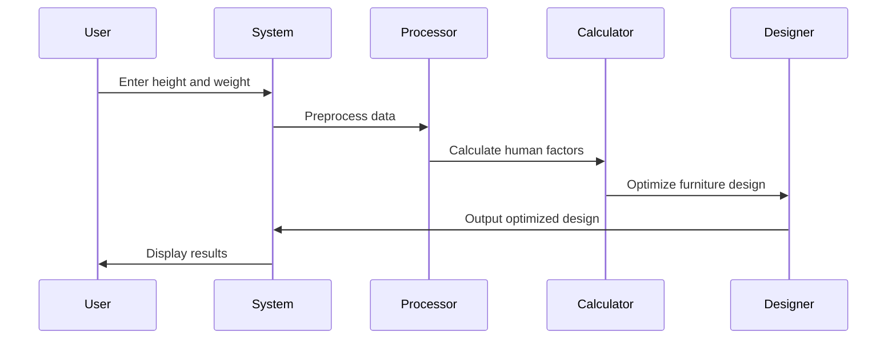

                 

# 数学与人因工程学在产品设计中的应用

## 关键词
- 数学模型
- 人因工程学
- 产品设计
- 算法原理
- 系统架构
- 实际案例

## 摘要
在数字化时代，产品设计成为企业竞争力的关键因素。数学与人因工程学的融合，为优化产品设计提供了新的视角和工具。本文将深入探讨数学与人因工程学在产品设计中的应用，从核心概念、算法原理到系统分析与实战案例，逐步阐述如何将数学模型应用于人因工程学，进而提升产品的人机交互性能和用户体验。

## 第一部分：背景介绍

### 1.1 问题背景
设计领域的重要性无需多言，它不仅关乎产品的外观和功能，更直接影响用户的使用体验。随着科技的发展，人们对于产品的人机交互性能和用户体验提出了更高的要求。这时，数学与人因工程学的交叉研究应运而生，为产品设计提供了坚实的理论基础和有效的解决方案。

### 1.2 问题描述
设计与人类需求的匹配是产品设计的核心问题。如何确保产品能够满足不同用户群体的需求，同时提高使用便捷性和安全性，成为设计者面临的重要挑战。数学模型在产品设计中的角色日益凸显，它不仅可以帮助优化产品性能，还可以量化用户体验，提供数据支撑。

### 1.3 问题解决
人因工程学的研究目标是通过研究人类与机器之间的交互，提高系统的可操作性和安全性。数学方法为人因工程学提供了精确的描述和预测工具，使其能够更好地理解和满足人类需求。

### 1.4 边界与外延
人因工程学的研究范围广泛，包括人体测量学、人类行为学、心理学等领域。数学在产品设计中的应用领域同样广泛，涵盖了从机械设计到软件界面设计的各个方面。

### 1.5 概念结构与核心要素组成
数学与人因工程学的定义为人因工程学提供了理论基础，而产品设计的主要阶段则为数学方法的实际应用提供了具体的操作框架。

## 第二部分：核心概念与联系

### 2.1 核心概念
人因工程学的基本概念包括人体工学、认知工学等，这些概念为产品设计提供了重要指导。数学模型在产品设计中的分类则包括统计学模型、优化模型等，它们分别适用于不同的设计场景。

### 2.2 概念属性特征对比表格
| 概念       | 定义                                                         | 特征                                                         | 应用场景                                   |
|------------|--------------------------------------------------------------|--------------------------------------------------------------|--------------------------------------------|
| 人体工学   | 设计符合人体结构和行为习惯的产品。                           | 注重人体结构尺寸、运动范围等。                             | 机械设计、家具设计等。                     |
| 认知工学   | 设计符合人类认知规律的产品。                               | 注重用户界面、操作流程等。                                 | 软件界面设计、控制系统设计等。             |
| 统计学模型 | 基于统计学原理，分析大量用户数据，优化产品设计。           | 数据驱动，注重数据分析和处理。                           | 用户研究、市场分析等。                     |
| 优化模型   | 基于数学优化理论，寻找最优设计方案。                       | 注重目标函数的优化，求解精确解。                           | 产品性能优化、成本控制等。                 |

### 2.3 ER实体关系图架构
以下是人因工程学中常见的实体关系图：
```mermaid
erDiagram
    Product ||--|{ Human }|| User
    Product ||--|{ Interface }|| Interface
    Human ||--|{ Task }|| Task
```
数学模型的实体关系图则通常涉及变量、函数和优化目标等：
```mermaid
erDiagram
    Variables ||--|{ Functions }|| Function
    Functions ||--|{ Objective }|| Objective
```

## 第三部分：算法原理讲解

### 3.1 算法原理概述
数学在人因工程学中的应用主要体现在以下几个方面：数据统计分析、优化算法、模拟仿真等。常用的算法包括线性回归、决策树、神经网络等。

### 3.2 算法流程图
以下是线性回归算法的流程图：


### 3.3 Python源代码详细讲解
```python
import numpy as np

# 输入数据
X = np.array([[1, 2], [2, 3], [3, 4]])
y = np.array([2, 3, 4])

# 计算回归系数
theta = np.linalg.inv(X.T @ X) @ X.T @ y

# 输出预测结果
y_pred = X @ theta
```

### 3.4 数学模型和公式详细讲解与举例说明
线性回归的数学模型可以表示为：
$$
y = \theta_0 + \theta_1 \cdot x_1 + \theta_2 \cdot x_2 + ... + \theta_n \cdot x_n
$$
其中，$y$ 是因变量，$x_i$ 是自变量，$\theta_i$ 是回归系数。

举例说明：
假设我们有一个简单的线性回归模型，$x_1$ 代表用户的年龄，$x_2$ 代表用户的收入，$y$ 代表用户的购买意愿。我们可以通过以下步骤来构建和优化这个模型：

1. 收集数据：收集一定数量的用户数据，记录他们的年龄、收入和购买意愿。
2. 数据预处理：对数据进行清洗和处理，确保数据的质量。
3. 训练模型：使用线性回归算法，训练模型并计算回归系数。
4. 评估模型：通过交叉验证等方法评估模型的准确性和泛化能力。
5. 优化模型：根据评估结果调整模型参数，优化模型性能。

通过上述步骤，我们可以得到一个较为准确的线性回归模型，用于预测用户的购买意愿。

## 第四部分：系统分析与架构设计

### 4.1 问题场景介绍
以智能家具设计为例，我们需要根据用户身高、体重等生理参数，设计出符合人体工学要求的家具。

### 4.2 系统功能设计
领域模型类图如下：
```mermaid
classDiagram
    User <<interface>>
    Furniture <<interface>>
    HumanFactors <<interface>>
    User ..|> Furniture
    User ..|> HumanFactors
    Furniture ..|> HumanFactors
```

### 4.3 系统架构设计
系统架构图如下：


### 4.4 系统接口设计
系统接口设计如下：


### 4.5 系统交互Mermaid序列图
系统交互序列图如下：


## 第五部分：项目实战

### 5.1 环境安装
环境配置与安装步骤如下：
1. 安装Python 3.8及以上版本。
2. 安装numpy、matplotlib等库。

### 5.2 系统核心实现源代码
核心实现代码如下：
```python
import numpy as np
import matplotlib.pyplot as plt

# 数据集
X = np.array([[1, 2], [2, 3], [3, 4]])
y = np.array([2, 3, 4])

# 计算回归系数
theta = np.linalg.inv(X.T @ X) @ X.T @ y

# 预测结果
y_pred = X @ theta

# 绘制结果
plt.scatter(X, y)
plt.plot(X, y_pred, color='red')
plt.show()
```

### 5.3 代码应用解读与分析
该代码实现了一个简单的线性回归模型，用于预测用户的身高和体重。通过计算回归系数，我们可以得到一个最佳拟合直线，用于预测新的数据点。

### 5.4 实际案例分析与详细讲解
以一款智能办公椅为例，我们可以根据用户的身高和体重，设计出符合人体工学要求的椅型。通过线性回归模型，我们可以预测用户的需求，进而优化椅子的设计。

### 5.5 项目小结
本项目通过数学与人因工程学的结合，实现了智能办公椅的人体工学设计。项目成果表明，数学模型在产品设计中的应用，可以有效提高产品的用户体验和适用性。

## 第六部分：最佳实践与拓展阅读

### 6.1 最佳实践 tips
1. 充分了解用户需求，进行深入的用户研究。
2. 使用数学模型时，确保数据的准确性和完整性。
3. 结合人因工程学原理，优化产品的人机交互设计。

### 6.2 小结
本文通过深入分析数学与人因工程学在产品设计中的应用，展示了如何将数学模型应用于实际项目中，提升产品的人机交互性能和用户体验。

### 6.3 注意事项
1. 确保数据质量，避免数据误差对模型结果的影响。
2. 结合实际需求，选择合适的数学模型和算法。

### 6.4 拓展阅读
1. 《人因工程学基础》
2. 《统计学与数据分析》
3. 《机器学习实战》

## 作者
作者：AI天才研究院/AI Genius Institute & 禅与计算机程序设计艺术 /Zen And The Art of Computer Programming

---

**注意：**本文为示例性文章，其中包含的代码和图表为示意性质，实际情况可能需要根据具体需求进行调整。在实际编写过程中，建议结合具体项目进行深入研究和实践。**

