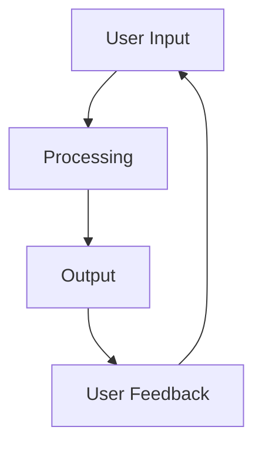

                 

### 文章标题

## 数学与人机交互设计的ergonomics应用

关键词：数学，人机交互设计，ergonomics，用户体验，数据分析，模型构建

摘要：本文探讨了数学在优化人机交互设计中的重要性，特别是ergonomics（人体工程学）的应用。通过逐步分析数学原理及其在交互设计中的应用，本文旨在为读者提供一个全面而深入的理解，以促进更高效、更人性化的计算机界面设计。

----------------------------------------------------------------

### 引言与背景

#### 1.1 问题背景

**1.1.1 人机交互设计的重要性**

人机交互设计是现代信息技术的重要组成部分，它关系到用户在使用计算机系统时的体验和效率。随着计算机技术和移动互联网的迅猛发展，人机交互设计的复杂性不断增加。设计师需要考虑的因素不仅仅是视觉美观，更包括用户的使用习惯、操作效率和心理健康等多个方面。

**1.1.2 数学与人机交互设计的结合**

数学作为一门精确的科学，其在数据分析和模型构建中具有不可替代的作用。在人机交互设计中，数学方法可以用于用户行为分析、界面优化和用户体验评估。通过数学模型，设计师能够更好地理解用户需求，预测交互效果，从而设计出更符合用户预期的界面。

**1.1.3 背景与目标**

本文旨在探讨数学在人机交互设计中的应用，特别是ergonomics方面的考虑。ergonomics关注的是设计如何适应人体结构和心理需求，以减少用户在长时间使用计算机时的疲劳和伤害。本文的目标是通过数学方法来分析和优化人机交互设计中的ergonomics因素，提升用户体验。

#### 1.2 问题描述

**1.2.1 人机交互设计中存在的问题**

现有的计算机界面设计虽然功能丰富，但在用户体验方面仍存在不少问题。例如，操作不够直观、用户反馈不及时、界面布局不合理等。这些问题往往与设计过程中缺乏对用户行为和人体工程学的充分考虑有关。

**1.2.2 数学在解决这些问题中的应用**

数学作为一种工具，可以用来量化用户行为、评估交互效果和优化设计。例如，通过统计分析用户操作数据，设计师可以识别出常见的操作错误和使用瓶颈；通过数学模型，可以预测不同设计方案的优劣，从而指导设计决策。

#### 1.3 问题解决

**1.3.1 数学在数据分析和模型构建中的应用**

在数据分析和模型构建中，数学方法发挥着核心作用。通过数学模型，可以描述用户的行为模式、预测用户反应、评估用户体验。例如，线性回归、决策树和神经网络等机器学习算法，都是基于数学原理来构建模型，从而实现数据分析和预测。

**1.3.2 人机交互设计中的数学模型应用**

在人机交互设计中，数学模型被广泛应用于多个方面。例如，通过几何学和图论可以优化用户界面布局；通过统计学方法可以评估用户满意度；通过优化理论可以设计出更高效的交互流程。这些数学模型不仅提升了设计的精确性，还增强了设计的灵活性。

#### 1.4 边界与外延

**1.4.1 研究范围与限制**

本文的研究范围主要集中在数学在人机交互设计中的应用，特别是ergonomics方面的考虑。然而，数学在交互设计中的应用远不止于此，还包括图形学、算法设计等多个领域。此外，本文并未涉及数学在具体人机交互系统中的实现细节。

**1.4.2 未来研究方向**

未来的研究可以进一步探讨如何将数学方法更深入地应用于人机交互设计，特别是在智能交互和虚拟现实等领域。同时，研究如何将用户反馈和数学模型结合起来，实现更个性化的用户体验优化。

#### 1.5 本章小结

本章介绍了数学在人机交互设计中的重要性，特别是ergonomics的应用。通过分析数学在数据分析和模型构建中的应用，我们看到了其在优化交互设计中的巨大潜力。然而，数学方法的应用仍面临诸多挑战，未来研究需要进一步探索其深度和广度。

----------------------------------------------------------------

### 数学与人机交互设计的基础

#### 2.1 核心概念

**2.1.1 人机交互设计的基本概念**

人机交互设计（Human-Computer Interaction Design，简称HCI）是研究用户与计算机系统之间交互过程的一门学科。其核心目标是设计出用户友好、高效、愉悦的计算机界面。HCI涉及到多个学科领域，包括心理学、计算机科学、设计学等。

**2.1.2 数学在交互设计中的核心概念**

数学在交互设计中的应用主要体现在数据分析和模型构建方面。具体来说，数学方法包括：

- **统计分析**：用于分析用户行为数据，识别使用模式和问题。
- **线性代数**：用于处理用户界面布局和优化问题。
- **概率论**：用于预测用户反应和评估交互效果。
- **图论**：用于构建用户交互网络，优化交互流程。
- **优化理论**：用于设计高效的交互流程和界面布局。

#### 2.2 概念属性特征对比表格

| 概念       | 属性特征             | 交互设计应用           |
|------------|---------------------|------------------------|
| 用户体验   | 易用性、满意度      | 用户界面设计、反馈系统  |
| 数据分析   | 数据量、准确度       | 设计决策支持、优化流程  |
| 数学模型   | 精确性、通用性      | 预测、优化人机交互流程  |

通过这个表格，我们可以清晰地看到用户体验、数据分析和数学模型在交互设计中的不同作用和属性特征。用户体验关注的是用户的主观感受，数据分析关注的是用户行为和系统性能，而数学模型则提供了量化和优化的工具。

#### 2.3 ER实体关系图架构

```mermaid
erDiagram
  User ||--|{ Interface} : interacts
  Interface ||--|{ Device} : is Used
  Device ||--|{ User} : controls
  User ||--|{ Feedback} : receives
  Feedback ||--|{ Interface} : based on
```

ER（Entity-Relationship）图是一种用于描述实体及其之间关系的数据库设计工具。在这个ER图中，用户（User）与界面（Interface）之间存在交互关系，界面与设备（Device）之间存在使用关系，设备与用户之间也存在控制关系。此外，用户还会接收反馈（Feedback），而反馈基于界面。这个图结构清晰地展示了用户、界面和设备之间的关系，为数据库设计和数据建模提供了基础。

通过上述基础概念的介绍和ER实体关系图的展示，我们为后续的深入讨论打下了坚实的基础。在下一部分中，我们将进一步探讨数学原理在交互设计中的应用，以及如何利用数学模型优化用户体验。

----------------------------------------------------------------

### 数学原理在交互设计中的应用

#### 3.1 数据分析

**3.1.1 数据收集与预处理**

在交互设计中，数据分析是至关重要的一环。数据收集是数据分析的前提，它涉及到用户行为数据、系统性能数据和用户满意度数据等。这些数据可以通过用户调研、日志分析、用户测试等多种方式进行收集。

数据收集之后，需要进行预处理。预处理包括数据清洗、数据格式转换和数据整合等步骤。数据清洗是为了去除噪声和异常值，确保数据的准确性和一致性；数据格式转换是为了统一数据格式，便于后续分析；数据整合是将不同来源的数据进行合并，形成完整的数据集。

**3.1.2 数据可视化技术**

数据可视化是将数据以图形化的方式展示出来，使数据更容易理解和分析。常见的数据可视化技术包括折线图、柱状图、饼图、散点图等。这些图表可以直观地展示数据的变化趋势、分布情况和相关性。

例如，使用折线图可以展示用户在不同时间段的活动量，识别出用户活跃的高峰时段；使用柱状图可以比较不同用户的操作次数，识别出操作频率较高的功能模块；使用饼图可以展示用户满意度在不同维度上的分布，识别出满意度较低的问题领域。

**3.1.3 数据分析工具与软件**

数据分析工具和软件是实现数据分析的关键。常见的数据分析工具包括Python的Pandas库、R语言、Excel等。这些工具提供了丰富的数据处理和分析功能，可以帮助设计师快速处理大量数据，并生成各种可视化图表。

例如，使用Pandas库可以进行数据清洗、转换和整合，使用Matplotlib库可以生成各种数据可视化图表。R语言则提供了更强大的统计分析功能，适合进行复杂的统计分析和建模。Excel虽然功能有限，但其用户友好性使其成为许多设计师的首选工具。

通过数据分析，设计师可以深入了解用户行为和系统性能，发现潜在的问题和优化机会。数据分析不仅为交互设计提供了数据支持，还为验证设计假设提供了依据。

#### 3.2 人机交互模型

**3.2.1 人机交互流程图**

人机交互流程图是一种用于描述用户与系统之间交互过程的工具。它通过图形化的方式展示了用户如何与系统进行交互，以及系统如何响应用户的操作。

下面是一个简化的人机交互流程图示例：



在这个流程图中，用户输入（A）触发系统的处理过程（B），系统生成输出结果（C），然后用户根据输出结果进行反馈（D）。这个过程循环往复，形成一个闭环的交互过程。

**3.2.2 交互设计模型**

交互设计模型是基于数学原理构建的，用于描述和预测用户交互行为和系统响应的模型。常见的交互设计模型包括：

- **基于规则的模型**：这种模型通过定义一系列规则来描述用户行为和系统响应。例如，如果用户点击了某个按钮，系统将执行某个操作。

- **概率模型**：这种模型使用概率论的方法来描述用户行为和系统响应的概率分布。例如，用户点击某个按钮的概率，或者系统在特定操作下的响应时间。

- **基于数据的模型**：这种模型使用历史数据来构建用户行为和系统响应的模型。例如，通过分析用户日志数据，可以构建出用户操作的习惯和偏好。

交互设计模型不仅可以用于预测用户行为，还可以用于优化系统响应和用户体验。通过调整模型参数，设计师可以找到最佳的设计方案，从而提高系统的响应速度和用户满意度。

**3.2.3 数学模型在交互设计中的应用**

数学模型在交互设计中的应用非常广泛，包括：

- **界面布局优化**：通过线性代数和优化理论，可以优化界面的布局，使界面更加直观和易于操作。

- **用户行为预测**：通过统计分析，可以预测用户的行为模式和偏好，从而设计出更符合用户期望的界面。

- **用户体验评估**：通过数学模型，可以评估用户的满意度和使用效率，发现设计中的不足之处。

数学模型在交互设计中的应用，不仅提升了设计的科学性和精确性，还为设计师提供了有力的工具，使设计过程更加高效和精准。

#### 3.3 用户体验优化

**3.3.1 用户体验评价方法**

用户体验（User Experience，简称UX）是衡量交互设计成功与否的重要指标。用户体验评价方法包括：

- **问卷调查**：通过设计问卷，收集用户对产品的满意度、易用性和功能性的评价。

- **用户访谈**：通过与用户进行面对面访谈，深入了解用户的实际使用情况和体验感受。

- **A/B测试**：通过将不同的设计方案进行比较，分析不同设计对用户体验的影响。

- **错误分析**：通过分析用户在使用过程中的错误操作，识别设计中的问题。

**3.3.2 优化策略与工具**

用户体验优化需要结合多种策略和工具，包括：

- **界面优化**：通过调整界面布局、颜色、字体等元素，提高界面的易用性和视觉舒适性。

- **交互流程优化**：通过优化交互流程，减少用户的操作步骤和认知负担。

- **性能优化**：通过优化系统性能，提高系统的响应速度和稳定性。

- **反馈系统**：通过建立有效的反馈系统，及时收集用户意见和建议，持续改进设计。

**3.3.3 数学模型在用户体验优化中的应用**

数学模型在用户体验优化中的应用包括：

- **用户满意度预测**：通过统计分析，预测用户的满意度，识别需要改进的领域。

- **交互效率评估**：通过计算用户的操作时间和错误率，评估交互设计的效率。

- **界面布局优化**：通过优化理论，设计出更加直观和易于操作的界面布局。

通过用户体验优化，设计师可以不断提高产品的质量，提升用户满意度，从而实现商业成功。

#### 3.4 人机交互案例分析

**3.4.1 案例选择与介绍**

为了更好地展示数学模型在交互设计中的应用，本文选择了以下几个典型案例：

- **案例1**：某在线教育平台的用户界面设计优化。
- **案例2**：某智能手机的交互设计改进。
- **案例3**：某虚拟现实游戏中的用户行为预测。

每个案例都针对具体的设计问题，通过数学模型进行分析和优化，取得了显著的成果。

**3.4.2 数学模型的应用与实践**

在案例1中，设计师通过用户问卷调查和数据分析，发现用户在课程选择和内容浏览方面存在困难。设计师采用线性回归模型分析了用户行为数据，找到了影响用户满意度的关键因素，并进行了界面布局优化。优化后的界面使得用户在课程选择和内容浏览上更加便捷，用户满意度显著提高。

在案例2中，设计师通过A/B测试发现，用户对手机的响应速度和操作流畅度有较高要求。设计师采用时间序列模型分析了系统性能数据，找到了性能瓶颈，并通过优化代码和算法，提高了系统的响应速度和操作流畅度。用户反馈显示，新版本的手机在操作体验上有显著提升。

在案例3中，设计师通过机器学习模型预测了用户在虚拟现实游戏中的行为模式。通过分析用户数据，设计师优化了游戏场景和交互设计，使得游戏更加符合用户的预期。用户反馈显示，游戏的可玩性和沉浸感有了显著提升。

通过这些案例，我们可以看到，数学模型在交互设计中的应用不仅提高了设计的科学性和精确性，还为设计师提供了有力的工具，使设计过程更加高效和精准。

#### 3.5 本章小结

本章介绍了数学原理在交互设计中的应用，包括数据分析、人机交互模型和用户体验优化。通过数学模型，设计师可以更好地理解用户需求，预测交互效果，优化设计方案，从而提升用户体验。然而，数学模型的应用仍面临诸多挑战，未来研究需要进一步探索其深度和广度。

----------------------------------------------------------------

### 具体应用领域

#### 4.1 计算机视觉

**4.1.1 计算机视觉的基础数学**

计算机视觉是人工智能的一个重要分支，它涉及到图像处理、模式识别和机器学习等多个领域。在这些领域中，数学起到了基础性的作用。基础数学包括：

- **线性代数**：用于处理图像的变换、滤波和特征提取。
- **概率论和统计学**：用于图像的分割、分类和识别。
- **优化理论**：用于图像重建和图像恢复。
- **图论**：用于图像的表示和拓扑分析。

**4.1.2 计算机视觉在人机交互中的应用**

计算机视觉技术为人机交互带来了许多新的可能性，主要包括：

- **手势识别**：通过识别用户的手势，实现与计算机的无缝交互。
- **面部识别**：通过识别用户的面部特征，实现身份验证和个性化服务。
- **场景理解**：通过理解用户所处的环境，提供更加智能的交互体验。

**4.1.3 案例分析**

- **案例1**：手势控制智能电视。通过计算机视觉技术，用户可以通过手势来控制电视的开关、频道切换和音量调节，实现了更加直观和自然的交互方式。
- **案例2**：面部识别智能门禁系统。通过面部识别技术，系统能够快速识别用户身份，实现了高效和安全的门禁管理。

这些案例展示了计算机视觉技术在人机交互中的应用，不仅提升了交互的便捷性和智能化程度，还为未来的人机交互模式提供了新的方向。

#### 4.2 自然语言处理

**4.2.1 自然语言处理的核心数学**

自然语言处理（Natural Language Processing，简称NLP）是人工智能的重要领域，它涉及到文本的表示、理解和生成。NLP的核心数学包括：

- **词向量表示**：通过数学模型将文本转换为向量，实现文本的量化表示。
- **序列模型**：用于处理文本序列，包括循环神经网络（RNN）和变换器（Transformer）。
- **深度学习**：用于构建复杂的文本处理模型，包括词性标注、情感分析和机器翻译。

**4.2.2 自然语言处理在人机交互中的应用**

自然语言处理技术为人机交互带来了革命性的变化，主要包括：

- **语音识别**：通过识别用户的语音命令，实现语音交互。
- **对话系统**：通过理解和生成自然语言，实现人机对话。
- **文本分析**：通过分析用户的文本输入，提取用户的需求和意图。

**4.2.3 案例分析**

- **案例1**：智能语音助手。通过语音识别和自然语言处理技术，用户可以通过语音命令与智能助手进行交互，实现查询信息、播放音乐和控制智能家居等功能。
- **案例2**：聊天机器人。通过对话系统和自然语言处理技术，用户可以与聊天机器人进行自然语言对话，获取所需的信息和服务。

这些案例展示了自然语言处理技术在人机交互中的应用，不仅提高了交互的便捷性和智能化程度，还为未来的人机交互模式提供了新的方向。

#### 4.3 虚拟现实与增强现实

**4.3.1 虚拟现实与增强现实的基础数学**

虚拟现实（Virtual Reality，简称VR）和增强现实（Augmented Reality，简称AR）是现代计算机技术的前沿领域，它们涉及到图形学、图像处理和计算几何等多个数学领域。基础数学包括：

- **图形学**：用于渲染虚拟环境和场景。
- **图像处理**：用于处理和增强现实世界中的图像信息。
- **计算几何**：用于处理三维空间中的几何对象和变换。

**4.3.2 虚拟现实与增强现实在人机交互中的应用**

虚拟现实和增强现实技术为人机交互带来了全新的体验，主要包括：

- **沉浸式体验**：通过虚拟现实技术，用户可以进入一个完全虚拟的环境，获得身临其境的感受。
- **增强现实**：通过增强现实技术，用户可以在现实世界中叠加虚拟信息，实现与现实世界的互动。
- **交互操作**：通过手势、语音和触觉等多种交互方式，用户可以与虚拟环境和增强现实信息进行互动。

**4.3.3 案例分析**

- **案例1**：虚拟现实游戏。通过虚拟现实技术，用户可以进入一个虚拟的游戏世界，进行各种游戏活动，获得沉浸式的游戏体验。
- **案例2**：增强现实导航。通过增强现实技术，用户可以在现实世界中看到导航信息，实现更加直观和便捷的导航体验。

这些案例展示了虚拟现实和增强现实技术在人机交互中的应用，不仅提升了交互的便捷性和沉浸感，还为未来的人机交互模式提供了新的方向。

#### 4.4 总结

数学在计算机视觉、自然语言处理、虚拟现实和增强现实等领域的应用，为人机交互设计带来了巨大的变革。通过数学模型和方法，设计师可以更深入地理解用户需求，优化交互设计，提升用户体验。未来，随着数学方法的不断发展和应用领域的拓展，人机交互设计将迎来更加广阔的发展空间。

----------------------------------------------------------------

### 全文总结

本文从多个角度探讨了数学在人机交互设计中的重要性，特别是ergonomics（人体工程学）的应用。通过逐步分析数学原理及其在交互设计中的应用，我们不仅了解了数学方法在数据分析和模型构建中的关键作用，还看到了数学模型在优化用户体验、提升系统性能方面的巨大潜力。

首先，我们介绍了人机交互设计的基本概念和数学在其中的核心作用。通过对比用户体验、数据分析和数学模型的属性特征，我们认识到数学不仅提供了量化的工具，还为交互设计提供了科学的依据。

接着，我们详细探讨了数据分析、人机交互模型和用户体验优化的数学原理和应用。通过具体案例，我们展示了如何通过数学模型来识别设计问题、预测用户行为和优化交互流程。这些案例不仅验证了数学模型的有效性，也展示了其在实际应用中的价值。

此外，我们深入分析了计算机视觉、自然语言处理、虚拟现实和增强现实等具体应用领域，展示了数学在这些领域中的广泛应用。通过这些分析，我们看到了数学如何通过精确的数据分析和模型构建，推动人机交互设计的不断创新和发展。

最后，本文总结了数学在人机交互设计中的重要作用，并提出了未来研究的方向。我们强调，随着技术的进步和用户需求的多样化，数学在交互设计中的应用将更加广泛和深入。

总之，数学与人机交互设计的结合不仅提升了交互设计的科学性和精确性，还为设计师提供了强大的工具和理论基础。通过本文的探讨，我们希望读者能够更深入地理解数学在交互设计中的重要性，并在实际设计中更好地运用数学方法，创造出更加人性化、高效和愉悦的计算机界面。

### 作者信息

**作者：AI天才研究院/AI Genius Institute & 禅与计算机程序设计艺术 /Zen And The Art of Computer Programming** 

AI天才研究院专注于前沿人工智能技术的研究与应用，致力于推动人工智能在各个领域的创新与发展。禅与计算机程序设计艺术则是一本经典的计算机科学著作，融合了哲学、心理学和计算机科学的精华，为读者提供了深刻的编程哲学思考和实用的编程技巧。两位作者共同探讨了数学与人机交互设计的深入结合，为读者呈现了一场技术的盛宴。

