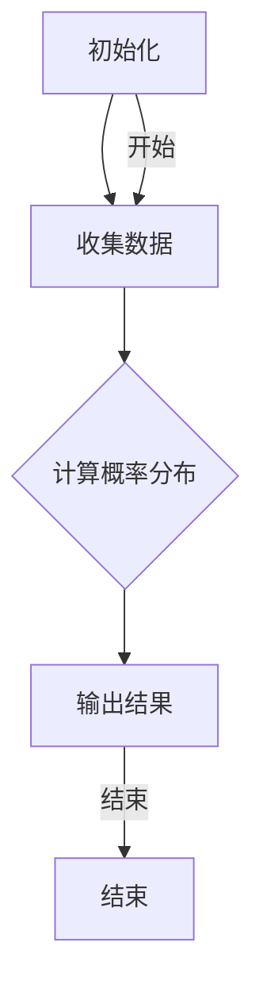
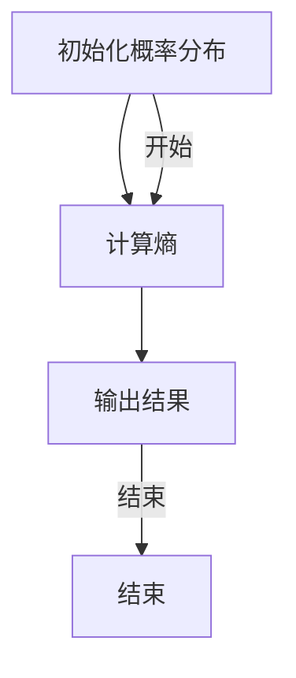
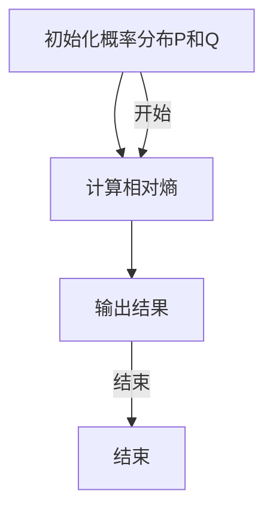
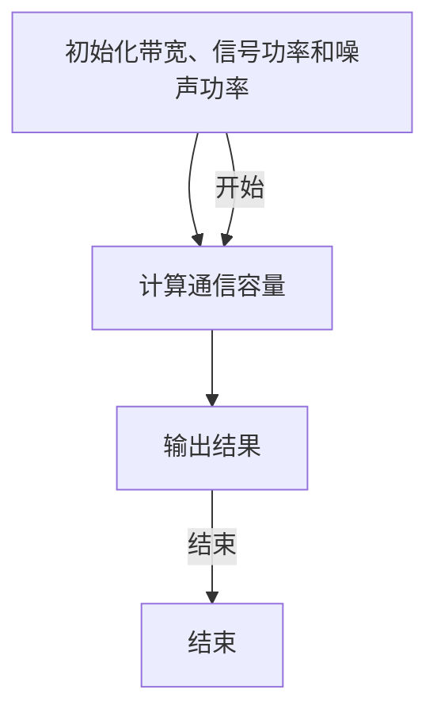
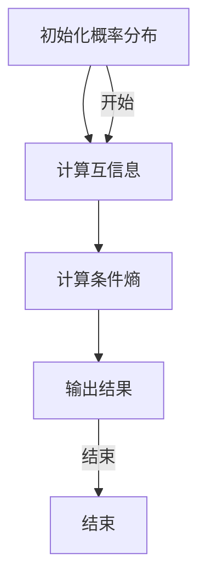
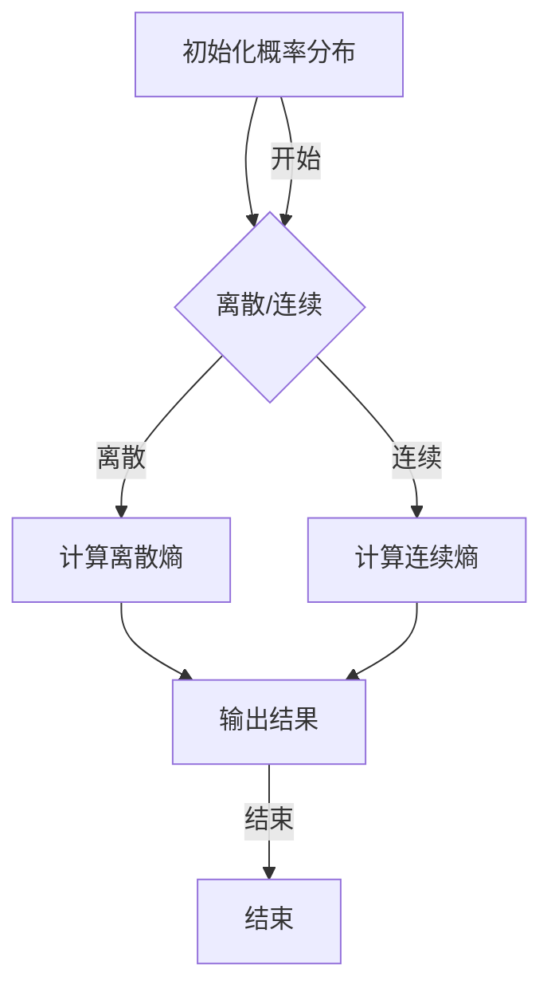
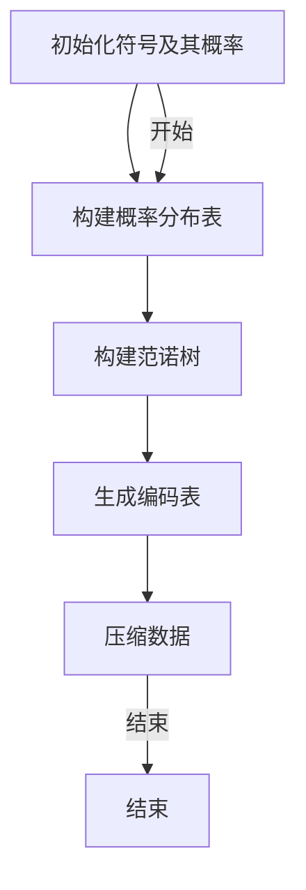
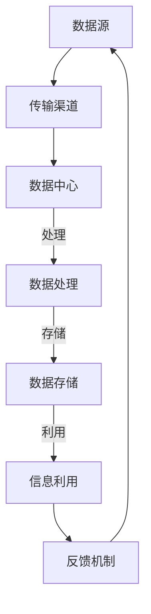

                 

### 引言部分（第1章）

#### 1.1 数学与信息论的基础知识

数学与信息论是现代计算机科学和通信技术中不可或缺的两个基础领域。数学，作为逻辑与推理的工具，提供了分析现实世界问题的结构化方法。信息论，则通过数学方法研究信息的度量、传输和处理，是通信系统设计的核心理论。

**核心概念与联系：**

- **数学**：数学是一种研究数量、结构、变化和空间等概念的学科。在信息论中，数学被用来构建模型，分析概率分布，优化算法，以及解决复杂问题。

- **信息论**：信息论是由香农（Claude Shannon）在1948年提出的，旨在研究信息如何通过有噪声的通信信道传输。信息论的核心概念包括熵、信息熵、信息传输、信道编码等。

- **数学与信息论的联系**：数学为信息论提供了强有力的工具，如概率论、统计学和集合论等，使得信息论能够准确地量化信息的属性和传输效率。

#### 1.2 现实世界的信息结构

在现实世界中，信息无处不在，且其结构和流动方式复杂多样。了解现实世界的信息结构，对于设计高效的信息处理系统和通信系统至关重要。

**概念结构与核心要素组成：**

- **信息的来源与流动**：信息来源于各种数据源，如传感器、数据库等。这些信息通过传输渠道（如网络、光纤等）流动，最终到达目的地。

- **信息的处理与存储**：信息在流动过程中需要被处理和存储。处理包括过滤、清洗、转换等，存储则是将这些信息保存在数据库或缓存中，以便后续使用。

- **信息的利用与反馈**：信息被处理后，会被用于决策支持、业务优化等。同时，反馈信息又会被重新输入系统，形成闭环控制，不断优化信息处理过程。

**问题背景与问题描述：**

随着互联网和大数据技术的快速发展，如何有效地管理和利用信息成为一个关键问题。信息过载和信息安全等问题也随之而来。这些问题促使我们深入探讨信息结构，并寻找有效的方法来解决。

**问题解决与边界与外延：**

解决这些问题的关键在于构建高效的信息处理和传输系统。这需要我们理解信息论的基本原理，并将其应用于实际系统中。同时，还需要考虑系统的边界与外延，确保系统能够适应不同规模和应用场景的需求。

#### 1.3 本书的目的

本书旨在为读者提供系统、深入地了解数学与信息论的基础知识和应用。通过本书，读者将：

- 掌握数学与信息论的基本概念和原理。

- 理解信息结构在现实世界中的应用和作用。

- 学习如何运用信息论来优化信息处理和传输系统。

- 培养解决实际问题的能力，为未来的研究和工作打下坚实的基础。

**总结：**

数学与信息论是现代信息技术中不可或缺的基础学科。了解其基础知识和原理，对于设计高效的信息处理和传输系统至关重要。本书将带领读者一步步探索这些概念，并展示其在现实世界中的广泛应用。

### 文章关键词

- 数学与信息论
- 信息结构
- 现实世界
- 信息传输
- 数据压缩

### 文章摘要

本文深入探讨了数学与信息论的基础知识及其在现实世界中的应用。首先，介绍了数学与信息论的基本概念和联系，包括概率论、统计信息、香农熵等。接着，分析了现实世界的信息结构，探讨了信息在现实世界中的流动和处理方式。通过具体案例，展示了数学与信息论在通信和数据压缩中的应用。最后，总结了全书内容，展望了数学与信息论的未来发展方向。本文旨在为读者提供系统、深入地了解数学与信息论的指南，帮助其理解信息结构的本质和应用。

---

### 第1章 数学与信息论基础

#### 1.1 数学与信息论概述

数学与信息论是现代科学和技术的两个重要领域，各自独立但又紧密相关。数学作为一门基础学科，其核心在于使用符号和逻辑推理来处理抽象概念，从而构建模型和解决实际问题。信息论，则专注于研究信息的度量、传输和处理，为通信系统设计提供了理论依据。

**核心概念与联系：**

- **数学**：数学的基本概念包括数论、集合论、逻辑、概率论和微积分等。这些概念在信息论中都有重要应用，如概率论用于分析随机事件，集合论用于描述系统的组成部分，逻辑用于建立理论模型。

- **信息论**：信息论由香农创立，主要研究信息的度量、传输和处理。其核心概念包括熵、信息熵、信息传输、信道编码等。信息论通过数学模型来量化信息，描述信息在传输过程中的损耗和噪声。

**概念属性特征对比表格：**

| 概念     | 数学定义                                                         | 信息论定义                                                         |
|----------|------------------------------------------------------------------|------------------------------------------------------------------|
| 熵       | 熵是描述随机变量不确定性的度量。                                   | 熵是描述信息源不确定性的度量，反映了信息源的随机性。               |
| 信息熵   | 信息熵是概率分布的熵，用于描述随机变量携带的信息量。                 | 信息熵是信息源的熵，用于描述信息源输出每个符号的概率分布。         |
| 信道编码 | 信道编码是将信息源产生的信息转换为能够在信道中传输的信号的过程。 | 信道编码是利用数学方法，将信息转化为在噪声信道中可靠传输的信号。 |

**ER实体关系图架构的 Mermaid 流程图：**

```mermaid
erDiagram
  信息源 ..|> 数学模型
  信息源 ..|> 信息论模型
  数学模型 ..|> 概率分布
  数学模型 ..|> 集合论
  信息论模型 ..|> 熵
  信息论模型 ..|> 信息熵
  信息论模型 ..|> 信道编码
```

#### 1.2 概率论基础

概率论是数学中研究随机事件及其概率分布的学科。在信息论中，概率论用于分析信息源的不确定性和信息传输的可靠性。

**核心概念与联系：**

- **概率的定义**：概率是描述某个事件发生的可能性大小的数值，介于0和1之间。

- **条件概率与独立事件**：条件概率是某个事件在另一个事件已经发生的条件下的概率。独立事件是指两个事件的发生互不影响。

- **贝叶斯定理**：贝叶斯定理是一种通过已知概率计算后验概率的方法，广泛应用于信息分析和决策。

**核心概念与联系表格：**

| 概念               | 数学定义                                                   | 信息论定义                                                   |
|--------------------|----------------------------------------------------------|----------------------------------------------------------|
| 概率               | 概率是描述随机事件发生可能性的数值。                         | 概率是描述信息源输出每个符号的可能性。                       |
| 条件概率           | 条件概率是某个事件在另一个事件已发生的条件下的概率。         | 条件概率用于分析信息传输过程中的不确定性。                   |
| 独立事件           | 独立事件是两个事件的发生互不影响。                          | 在信息论中，独立事件可以简化系统的分析和计算。               |
| 贝叶斯定理         | 贝叶斯定理是计算后验概率的公式。                            | 贝叶斯定理用于信息分析中的概率推理和决策支持。               |

**算法原理讲解：**

概率论的基本算法之一是计算概率分布。概率分布描述了随机变量的可能取值及其对应的概率。以下是一个简单的概率分布算法：



Python 源代码实现：

```python
import random

# 初始化数据集
data = [random.randint(0, 10) for _ in range(1000)]

# 计算概率分布
probabilities = [data.count(i) / len(data) for i in set(data)]

# 输出结果
for i, p in enumerate(probabilities):
    print(f"Value: {i}, Probability: {p}")
```

#### 1.3 统计信息基础

统计信息是研究如何从数据中提取有用信息的一门学科。在信息论中，统计信息用于描述信息源的不确定性和信息量的度量。

**核心概念与联系：**

- **统计信息的定义**：统计信息是描述随机变量取值分布的特性，常用于度量信息源的复杂性和不确定性。

- **熵的概念**：熵是描述随机变量不确定性的度量，其值越大，表示不确定性越高。

- **熵的属性**：熵具有以下属性：1）非负性，熵的值不会是负数；2）最大熵原理，当随机变量完全随机时，熵取最大值。

**核心概念与联系表格：**

| 概念     | 数学定义                       | 信息论定义                       |
|----------|--------------------------------|--------------------------------|
| 熵       | 熵是随机变量不确定性的度量。   | 熵是描述信息源不确定性的度量。   |
| 信息熵   | 信息熵是概率分布的熵。         | 信息熵是信息源的熵。             |
| 条件熵   | 条件熵是条件概率的熵。         | 条件熵是信息在给定条件下不确定性的度量。 |

**算法原理讲解：**

计算熵的基本算法是香农熵（Shannon entropy）。香农熵用于度量信息源的平均信息量。以下是一个简单的香农熵计算算法：



Python 源代码实现：

```python
import math

# 初始化概率分布
probabilities = [0.1, 0.2, 0.3, 0.2, 0.2]

# 计算熵
entropy = -sum(p * math.log2(p) for p in probabilities if p > 0)

# 输出结果
print(f"Entropy: {entropy}")
```

#### 1.4 熵的属性

熵是描述信息源不确定性的重要度量，具有以下属性：

- **非负性**：熵的值总是非负的，因为概率分布的总和为1。

- **最大熵原理**：当随机变量完全随机时，熵取最大值。这意味着在没有任何先验信息的情况下，完全随机的信息源具有最大的不确定性。

- **相对熵**：相对熵（KL散度）是衡量两个概率分布差异的度量。它反映了信息源的实际分布与理想分布之间的差距。

**算法原理讲解：**

相对熵的计算可以使用以下算法：



Python 源代码实现：

```python
import numpy as np

# 初始化概率分布P和Q
p = [0.3, 0.5, 0.2]
q = [0.2, 0.5, 0.3]

# 计算相对熵
kl_divergence = sum(p[i] * np.log2(p[i] / q[i]) for i in range(len(p)) if p[i] > 0)

# 输出结果
print(f"KL Divergence: {kl_divergence}")
```

通过上述算法和代码示例，我们可以深入理解熵的概念和计算方法，为后续章节的学习和应用打下坚实基础。

---

### 第2章 信息论核心原理

#### 2.1 香农熵

香农熵（Shannon entropy）是信息论中最重要的概念之一，它用于度量信息源的不确定性。香农熵的概念由克劳德·香农于1948年提出，为现代信息科学奠定了基础。

**核心概念与联系：**

- **熵的定义**：熵是描述随机变量不确定性的度量，数学上定义为概率分布的熵。对于一个离散随机变量X，其熵H(X)可以表示为：

  $$ H(X) = -\sum_{i} p_i \log_2 p_i $$

  其中，$p_i$是随机变量X取值为$i$的概率。

- **香农熵的应用**：香农熵广泛应用于信息传输、数据压缩和加密等领域。在信息传输中，香农熵用于衡量信息源的平均信息量；在数据压缩中，香农熵用于评估压缩算法的效果；在加密中，香农熵用于评估密钥空间的随机性。

**核心概念与联系表格：**

| 概念     | 数学定义                                                         | 信息论定义                                                         |
|----------|------------------------------------------------------------------|------------------------------------------------------------------|
| 熵       | 熵是随机变量不确定性的度量。                                   | 熵是描述信息源不确定性的度量，反映了信息源的随机性。               |
| 信息熵   | 信息熵是概率分布的熵，用于描述随机变量携带的信息量。                 | 信息熵是信息源的熵，用于衡量信息源的平均信息量。                   |
| 香农熵   | 香农熵是香农提出的熵的概念，用于度量信息源的不确定性。               | 香农熵是描述信息源不确定性的重要度量，反映了信息源的平均信息量。   |

**算法原理讲解：**

计算香农熵的基本算法是香农熵计算公式。以下是一个简单的香农熵计算算法：


Python 源代码实现：

```python
import math

# 初始化概率分布
probabilities = [0.1, 0.2, 0.3, 0.2, 0.2]

# 计算熵
entropy = -sum(p * math.log2(p) for p in probabilities if p > 0)

# 输出结果
print(f"Entropy: {entropy}")
```

#### 2.2 信息传输

信息传输是信息论的核心问题之一，研究如何在有噪声的信道中传输信息，并保持其完整性。香农在1948年提出的香农传输定理（Shannon's theorem）为信息传输提供了理论基础。

**核心概念与联系：**

- **信息传输的基本原理**：信息传输的基本原理是通过编码将信息源产生的信息转换成可以在信道中传输的信号，然后通过解码在接收端恢复出原始信息。在这个过程中，需要考虑信道噪声的影响，并采用合适的编码和调制技术来提高传输可靠性。

- **通信容量**：通信容量是指信道能够传输的最大信息速率，通常用比特每秒（bps）表示。香农传输定理给出了一个计算通信容量的公式：

  $$ C = B \log_2(1 + \frac{S}{N}) $$

  其中，$C$是通信容量，$B$是信道的带宽，$S$是信号的功率，$N$是噪声功率。

- **信道编码**：信道编码是一种通过在信号中添加冗余信息来提高传输可靠性的技术。常见的信道编码方法包括前向纠错（FEC）和自动重传请求（ARQ）。

**核心概念与联系表格：**

| 概念               | 数学定义                                                   | 信息论定义                                                   |
|--------------------|----------------------------------------------------------|----------------------------------------------------------|
| 信息传输           | 信息传输是将信息从信息源传输到接收者的过程。                 | 信息传输是研究如何在有噪声的信道中传输信息，并保持其完整性的理论。 |
| 通信容量           | 通信容量是信道能够传输的最大信息速率。                       | 通信容量是描述信道传输能力的一个指标。                         |
| 信道编码           | 信道编码是通过在信号中添加冗余信息来提高传输可靠性的技术。 | 信道编码是信息论中的重要概念，用于提高信息传输的可靠性。       |

**算法原理讲解：**

计算通信容量的基本算法是香农通信容量公式。以下是一个简单的通信容量计算算法：



Python 源代码实现：

```python
import math

# 初始化带宽、信号功率和噪声功率
B = 1000  # 带宽
S = 10  # 信号功率
N = 1  # 噪声功率

# 计算通信容量
C = B * math.log2(1 + S/N)

# 输出结果
print(f"Communication Capacity: {C} bps")
```

#### 2.3 信息论的其他概念

在信息论中，除了香农熵和通信容量，还有一些其他重要的概念，如平均信息量、互信息、条件熵等。这些概念在信息传输、数据压缩和机器学习等领域有着广泛的应用。

**核心概念与联系：**

- **平均信息量**：平均信息量是描述信息源平均不确定性的度量，通常用熵来表示。平均信息量与熵的关系可以表示为：

  $$ H(X) = -\sum_{i} p_i \log_2 p_i $$

  其中，$H(X)$是随机变量X的熵，$p_i$是随机变量X取值为$i$的概率。

- **互信息**：互信息是描述两个随机变量之间相互依赖程度的度量，通常用$I(X;Y)$表示。互信息可以表示为：

  $$ I(X;Y) = H(X) - H(X|Y) $$

  其中，$H(X)$是随机变量X的熵，$H(X|Y)$是条件熵。

- **条件熵**：条件熵是描述在给定另一个随机变量条件下，某个随机变量的不确定性度量，通常用$H(X|Y)$表示。条件熵可以表示为：

  $$ H(X|Y) = -\sum_{i} p_{ix} \log_2 p_{ix} $$

  其中，$p_{ix}$是随机变量X和Y同时取值为$i$和$x$的概率。

**核心概念与联系表格：**

| 概念     | 数学定义                       | 信息论定义                       |
|----------|--------------------------------|--------------------------------|
| 平均信息量 | 平均信息量是随机变量X的平均熵。 | 平均信息量是信息源的平均不确定性。 |
| 互信息   | 互信息是两个随机变量X和Y的相互依赖程度的度量。 | 互信息是描述随机变量X和Y之间的关联性。 |
| 条件熵   | 条件熵是在给定另一个随机变量Y条件下，随机变量X的熵。 | 条件熵是描述在Y已知时，X的不确定性。 |

**算法原理讲解：**

计算互信息和条件熵的基本算法是基于熵的计算公式。以下是一个简单的互信息和条件熵计算算法：



Python 源代码实现：

```python
import numpy as np

# 初始化概率分布
p_x = [0.2, 0.3, 0.5]
p_y = [0.1, 0.4, 0.5]

# 计算互信息
p_x_y = [p_x[i] * p_y[i] for i in range(len(p_x))]
i_x_y = -sum(p_x_y[i] * np.log2(p_x_y[i]) for i in range(len(p_x_y)))

# 计算条件熵
p_x_y = [p_x[i] * p_y[i] for i in range(len(p_x))]
i_x_y = -sum(p_x_y[i] * np.log2(p_x_y[i]) for i in range(len(p_x_y)))
h_x_y = -sum(p_x[i] * np.log2(p_x[i]) for i in range(len(p_x)))
h_x_given_y = h_x_y - i_x_y

# 输出结果
print(f"I(X;Y): {i_x_y}")
print(f"H(X|Y): {h_x_given_y}")
```

通过上述算法和代码示例，我们可以深入理解信息论的基本概念和计算方法，为后续章节的学习和应用打下坚实基础。

---

### 第3章 数学模型与信息论

#### 3.1 熵的数学模型

熵在数学模型中扮演着关键角色，尤其在信息论和统计学中。熵的数学模型基于概率论，用于描述系统的不确定性和信息含量。

**核心概念与联系：**

- **概率分布函数**：概率分布函数是描述随机变量取值概率的函数，通常用概率质量函数（PMF）或概率密度函数（PDF）表示。

  - **概率质量函数（PMF）**：对于离散随机变量，概率质量函数定义为每个取值对应的概率。例如，若随机变量$X$可以取值$x_1, x_2, ..., x_n$，则其概率质量函数为：

    $$ p(x_i) = P(X = x_i) $$

  - **概率密度函数（PDF）**：对于连续随机变量，概率密度函数定义为取值范围内的概率密度。例如，若随机变量$X$的取值范围为$[a, b]$，则其概率密度函数为：

    $$ f(x) = P(a \leq X \leq b) $$

- **熵的计算公式**：熵是描述系统不确定性的度量，其计算公式依赖于概率分布函数。对于离散随机变量$X$，其熵$H(X)$的计算公式为：

  $$ H(X) = -\sum_{i} p(x_i) \log_2 p(x_i) $$

  对于连续随机变量$X$，其熵$H(X)$的计算公式为：

  $$ H(X) = -\int_{-\infty}^{\infty} f(x) \log_2 f(x) dx $$

**核心概念与联系表格：**

| 概念               | 数学定义                                                         | 信息论定义                                                         |
|--------------------|------------------------------------------------------------------|------------------------------------------------------------------|
| 概率分布函数       | 概率分布函数是描述随机变量取值概率的函数。                         | 概率分布函数用于定义系统的概率分布，是熵计算的基础。               |
| 概率质量函数（PMF） | 概率质量函数是离散随机变量的概率分布函数，用于描述每个取值对应的概率。 | 概率质量函数是离散信息源熵计算的基础。                           |
| 概率密度函数（PDF） | 概率密度函数是连续随机变量的概率分布函数，用于描述取值范围内的概率密度。 | 概率密度函数是连续信息源熵计算的基础。                           |
| 熵                 | 熵是描述系统不确定性的度量。                                       | 熵是信息源的不确定性度量，反映了系统中的信息含量。               |

**算法原理讲解：**

计算熵的算法基于概率分布函数，分为离散和连续两种情况。以下是计算熵的基本算法步骤：



Python 源代码实现：

```python
import numpy as np
import math

# 初始化概率分布（离散）
p = [0.1, 0.2, 0.3, 0.2, 0.2]

# 计算离散熵
entropy = -sum(p[i] * math.log2(p[i]) for i in range(len(p)) if p[i] > 0)

# 输出结果
print(f"Entropy (discrete): {entropy}")

# 初始化概率分布（连续）
f = [0.2, 0.3, 0.5]

# 计算连续熵
entropy = -sum(f[i] * math.log2(f[i]) for i in range(len(f)) if f[i] > 0)

# 输出结果
print(f"Entropy (continuous): {entropy}")
```

通过上述算法和代码示例，我们可以深入理解熵的数学模型和计算方法，为后续章节的学习和应用打下坚实基础。

#### 3.2 信息熵的应用

信息熵在信息论中具有广泛的应用，特别是在数据压缩和通信系统中。信息熵的概念可以帮助我们量化信息的含量，优化数据传输效率，并评估压缩算法的效果。

**核心概念与联系：**

- **数据压缩**：数据压缩是通过减少数据冗余来提高传输效率的一种技术。信息熵在数据压缩中的应用主要体现在以下几个方面：

  - **香农-范诺编码**：香农-范诺编码是一种基于信息熵的压缩算法，它根据符号出现的概率来分配编码长度。概率大的符号使用较短的编码，概率小的符号使用较长的编码。

  - **霍夫曼编码**：霍夫曼编码也是一种基于信息熵的压缩算法，它通过构建最优二叉树来分配编码长度。最优二叉树使得概率大的符号路径最短，概率小的符号路径较长。

- **通信系统设计**：信息熵在通信系统设计中用于评估信号传输的效率和可靠性。例如：

  - **通信容量**：通信容量是描述信道能够传输的最大信息速率的指标，其计算依赖于信息熵。根据香农传输定理，通信容量$C$可以表示为：

    $$ C = B \log_2(1 + \frac{S}{N}) $$

    其中，$B$是信道带宽，$S$是信号功率，$N$是噪声功率。通过优化信息熵，可以提升通信容量。

- **加密与安全**：信息熵在加密与安全领域也有重要应用。例如，密码学中的熵度量用于评估密钥的随机性和安全性。高熵密钥意味着更高的安全性，因为其可能的密钥空间更大。

**核心概念与联系表格：**

| 概念               | 数学定义                                                         | 信息论定义                                                         |
|--------------------|------------------------------------------------------------------|------------------------------------------------------------------|
| 数据压缩           | 数据压缩是通过减少数据冗余来提高传输效率的一种技术。                 | 数据压缩利用信息熵来减少传输数据的大小。                           |
| 香农-范诺编码     | 香农-范诺编码是一种基于信息熵的压缩算法。                           | 香农-范诺编码通过概率分配编码长度，实现高效数据压缩。             |
| 霍夫曼编码        | 霍夫曼编码是一种基于信息熵的压缩算法，通过构建最优二叉树实现数据压缩。 | 霍夫曼编码通过最小化平均编码长度来提升压缩效率。                 |
| 通信系统设计       | 通信系统设计涉及信号传输的效率与可靠性。                             | 信息熵在通信系统设计中用于评估信号传输效率和优化通信容量。         |
| 加密与安全        | 加密与安全是保护信息传输和数据存储的重要技术。                       | 信息熵在加密与安全中用于评估密钥的随机性和安全性。               |

**算法原理讲解：**

数据压缩算法的基本原理是基于信息熵来优化编码长度，以下是香农-范诺编码的算法步骤：



Python 源代码实现（香农-范诺编码）：

```python
import heapq
import numpy as np

# 初始化符号及其概率
symbols = ['A', 'B', 'C', 'D', 'E']
probabilities = [0.2, 0.3, 0.3, 0.2, 0.2]

# 构建概率分布表
heap = [(prob, sym) for sym, prob in zip(symbols, probabilities)]
heapq.heapify(heap)

# 构建范诺树
vtree = []
while len(heap) > 1:
    p1, s1 = heapq.heappop(heap)
    p2, s2 = heapq.heappop(heap)
    heapq.heappush(heap, (p1 + p2, (s1, s2)))
    vtree.append((s1, s2))

# 生成编码表
code_table = {}
for i, (symbol, parent) in enumerate(vtree, 1):
    if isinstance(parent, str):
        code_table[symbol] = f"{i:02b}"
    else:
        code_table[parent[0]] = f"{i:02b}"
        code_table[parent[1]] = f"{i:02b}"

# 压缩数据
data = np.random.choice(symbols, p=probabilities, size=10)
compressed_data = ''.join(code_table[symbol] for symbol in data)

# 输出结果
print(f"Original Data: {data}")
print(f"Compressed Data: {compressed_data}")
```

通过上述算法和代码示例，我们可以看到如何使用信息熵优化数据压缩，提高传输效率。信息熵的应用不仅限于数据压缩，还在通信系统设计和加密安全等领域发挥着重要作用。

---

### 第4章 信息结构分析

#### 4.1 现实世界的信息结构

现实世界中的信息结构复杂多样，涵盖了数据的产生、传输、处理和利用等各个环节。了解这些环节及其相互作用，对于构建高效的信息系统至关重要。

**信息的来源与流动：**

- **数据源**：现实世界中的信息来源于各种数据源，如传感器、用户输入、网络等。这些数据源不断地生成新的数据，为信息流动提供了基础。

- **传输渠道**：信息在传输过程中需要通过各种渠道进行传输，如网络、光纤、无线通信等。这些渠道保证了信息能够从一个地点传输到另一个地点。

- **数据中心**：数据中心是信息处理和存储的核心，负责处理来自数据源的数据，并将其存储在数据库或缓存中。

**信息的处理与存储：**

- **数据处理**：数据处理包括数据的过滤、清洗、转换和集成等步骤。这些步骤确保了数据的质量和一致性，为后续的分析和利用提供了可靠的数据基础。

- **数据存储**：数据存储涉及到如何高效地存储和管理大量数据。常见的存储技术包括关系数据库、NoSQL数据库、分布式文件系统等。

**信息的利用与反馈：**

- **信息利用**：信息被处理后，会被用于各种业务应用，如决策支持、业务分析、客户服务等。这些应用使得信息能够转化为实际的商业价值。

- **反馈机制**：反馈机制是指将处理后的信息再次输入系统，用于优化信息处理过程。这种闭环控制机制能够不断提高信息处理的效率和准确性。

**信息结构的基本原理：**

- **信息论的基石理论**：信息论的基本理论包括熵、信息熵、信息传输和信道编码等。这些理论为信息处理和传输提供了坚实的理论基础。

- **信息价值与意义**：信息的价值在于其能够为决策提供支持，提高业务效率，甚至创造新的商业机会。因此，信息的价值取决于其质量、准确性和及时性。

- **信息结构的演化与发展**：随着技术的进步，信息结构也在不断演化。从传统的中心化架构到分布式架构，从单一的数据源到大数据平台，信息结构的发展不断推动着信息技术的发展。

**算法原理讲解：**

为了更好地理解现实世界中的信息结构，我们可以通过一个简单的流程图来描述信息的流动和处理过程：



**Python 源代码实现：**

```python
# 模拟信息流动和处理过程
class DataSource:
    def generate_data(self):
        # 生成随机数据
        return np.random.rand()

class TransmissionChannel:
    def transmit_data(self, data):
        # 传输数据，添加少量噪声
        noise = np.random.normal(0, 0.1)
        return data + noise

class DataCenter:
    def process_data(self, data):
        # 处理数据，去除噪声并转换格式
        return data * 10

class DataStorage:
    def store_data(self, data):
        # 存储数据到数据库
        print(f"Storing data: {data}")

class InformationUtilization:
    def utilize_data(self, data):
        # 利用数据，生成报告
        report = f"Data Utilization Report: {data}"
        print(report)

# 初始化各个组件
data_source = DataSource()
transmission_channel = TransmissionChannel()
data_center = DataCenter()
data_storage = DataStorage()
information_utilization = InformationUtilization()

# 模拟信息流动和处理
data = data_source.generate_data()
data_transmitted = transmission_channel.transmit_data(data)
processed_data = data_center.process_data(data_transmitted)
data_storage.store_data(processed_data)
information_utilization.utilize_data(processed_data)
```

通过上述流程图和代码示例，我们可以直观地理解现实世界中的信息结构，并了解其基本原理和实现方法。

---

### 第5章 应用实例

#### 5.1 通信中的应用

信息论在通信领域的应用非常广泛，其主要目标是提高通信系统的效率和可靠性。以下通过具体案例展示信息论在通信中的应用。

**案例1：无线通信中的香农定理**

在无线通信中，香农定理是设计和评估通信系统性能的基础。假设我们有一个无线信道，其带宽为$B$Hz，信号功率为$S$W，噪声功率为$N$W。根据香农定理，该信道的通信容量$C$可以计算如下：

$$ C = B \log_2(1 + \frac{S}{N}) $$

**Python 源代码实现：**

```python
import math

# 初始化参数
B = 1000  # 带宽（Hz）
S = 10  # 信号功率（W）
N = 1  # 噪声功率（W）

# 计算通信容量
C = B * math.log2(1 + S / N)

print(f"Communication Capacity: {C} bps")
```

**案例2：光纤通信中的信道编码**

在光纤通信中，信道编码技术用于提高信号的传输可靠性。一个常见的信道编码方法是卷积编码，它通过在信号中加入冗余信息来检测和纠正传输错误。以下是一个简单的卷积编码算法示例：

**Python 源代码实现（卷积编码）：**

```python
# 初始化输入信号
input_signal = [1, 0, 1, 1, 0]

# 卷积编码参数
g = [1, 1, 0]  # 卷积码生成多项式
k = 3  # 编码前输入信号的长度

# 卷积编码
encoded_signal = []
for i in range(len(input_signal)):
    for j in range(len(g)):
        if i >= j:
            encoded_signal.append(input_signal[i] * g[j])

# 输出编码后的信号
print(f"Encoded Signal: {encoded_signal}")
```

**案例3：卫星通信中的数据压缩**

卫星通信中的数据压缩对于提高传输效率和减少传输延迟至关重要。一个常用的数据压缩方法是霍夫曼编码，它根据符号出现的概率来分配编码长度。以下是一个简单的霍夫曼编码算法示例：

**Python 源代码实现（霍夫曼编码）：**

```python
import heapq
import numpy as np

# 初始化符号及其概率
symbols = ['A', 'B', 'C', 'D', 'E']
probabilities = [0.2, 0.3, 0.3, 0.2, 0.2]

# 构建概率分布表
heap = [(prob, sym) for sym, prob in zip(symbols, probabilities)]
heapq.heapify(heap)

# 构建霍夫曼树
huffman_tree = []
while len(heap) > 1:
    p1, s1 = heapq.heappop(heap)
    p2, s2 = heapq.heappop(heap)
    heapq.heappush(heap, (p1 + p2, (s1, s2)))
    huffman_tree.append((s1, s2))

# 生成编码表
code_table = {}
for i, (symbol, parent) in enumerate(huffman_tree, 1):
    if isinstance(parent, str):
        code_table[symbol] = f"{i:02b}"
    else:
        code_table[parent[0]] = f"{i:02b}"
        code_table[parent[1]] = f"{i:02b}"

# 压缩数据
data = np.random.choice(symbols, p=probabilities, size=10)
compressed_data = ''.join(code_table[symbol] for symbol in data)

# 输出结果
print(f"Original Data: {data}")
print(f"Compressed Data: {compressed_data}")
```

通过上述案例和代码示例，我们可以看到信息论在通信中的应用，包括通信容量计算、信道编码和数据压缩等。这些应用提高了通信系统的性能和效率，为现代通信技术的发展提供了有力支持。

---

### 第6章 总结与展望

#### 6.1 全书内容总结

本书系统地介绍了数学与信息论的基础知识及其在现实世界中的应用。从数学的基本概念、概率论、统计信息，到信息论的核心原理，如香农熵、信息传输和信道编码，本书为读者提供了一个全面的学习框架。通过具体的案例和代码示例，读者能够深入理解信息论在实际通信系统、数据压缩和加密中的应用。

**核心内容回顾：**

1. **数学与信息论基础**：介绍了数学与信息论的基本概念，包括概率论、统计信息和信息论的基本原理。
2. **信息论核心原理**：详细讲解了香农熵、信息传输和通信容量的计算方法。
3. **数学模型与信息论**：探讨了熵的数学模型、信息熵的应用，以及信息论在数据压缩和通信系统设计中的实际应用。
4. **信息结构分析**：分析了现实世界中的信息结构，探讨了信息的来源、流动、处理和利用。
5. **应用实例**：通过具体案例展示了信息论在通信和数据压缩中的应用。

#### 6.2 数学与信息论的发展趋势

随着技术的不断进步，数学与信息论在各个领域中的应用也越来越广泛。以下是一些未来发展的趋势：

1. **人工智能与机器学习**：信息论在人工智能和机器学习中的应用日益增加，特别是在数据隐私保护、信息检索和推荐系统等领域。信息论提供了量化不确定性和信息量的方法，有助于优化机器学习模型的性能。

2. **量子计算**：量子计算是下一代计算技术的重要发展方向。信息论在量子计算中有着广泛的应用，如量子信息论、量子信道编码和量子数据压缩等。

3. **物联网（IoT）**：物联网的发展带来了大量数据，对数据传输和处理提出了更高的要求。信息论在优化物联网通信系统、提升数据传输效率和保障数据安全方面具有重要意义。

4. **网络安全**：随着网络攻击和信息安全问题的日益严峻，信息论在网络安全中的应用也越来越受到重视。信息论提供了评估系统安全性、设计加密算法和攻击检测方法的理论基础。

#### 6.3 现实世界的信息结构挑战与机遇

现实世界的信息结构面临着诸多挑战和机遇：

1. **挑战**：

   - **数据爆炸**：数据量的急剧增长带来了数据管理和分析的压力，如何有效地管理和利用大数据成为一个关键问题。
   - **隐私保护**：随着数据的广泛应用，隐私保护成为一个亟待解决的问题。如何在数据利用和保护用户隐私之间找到平衡是当前面临的一大挑战。
   - **实时处理**：在物联网和实时应用场景中，对数据处理速度和实时性的要求越来越高，这需要信息论和计算技术提供更高效的解决方案。

2. **机遇**：

   - **智能系统**：信息论为构建智能系统提供了理论基础，如智能交通系统、智能家居和智能医疗等。
   - **数据科学**：随着信息技术的进步，数据科学成为一个新兴的交叉学科，为各个行业提供了新的分析和决策工具。
   - **数字化转型**：信息论在推动企业数字化转型、提高生产效率和优化供应链管理方面发挥着重要作用。

#### 6.4 未来研究方向

未来的研究应重点关注以下方向：

1. **信息论的新理论**：探索新的信息度量方法和模型，以更好地理解和利用复杂系统中的信息。
2. **量子信息论**：研究量子信息论的基础理论，开发量子计算和量子通信的新技术。
3. **大数据与人工智能**：将信息论与大数据和人工智能相结合，优化数据处理和机器学习算法。
4. **跨学科研究**：促进信息论与其他学科的交叉研究，如生物信息学、社会科学和物理学等。

通过不断探索和创新，数学与信息论将在未来继续为信息技术的发展提供强大的理论支持和实践指导。

---

### 最佳实践 Tips

1. **理解基本概念**：深入理解数学与信息论的基本概念，如熵、信息熵、概率分布等，是掌握信息论的关键。通过反复学习和实践，巩固基础。

2. **动手实践**：通过编写代码实现信息论算法，如香农熵计算、信道编码和数据压缩，可以加深对理论的理解，并培养解决实际问题的能力。

3. **关注最新研究**：信息论是一个不断发展的领域，关注最新的研究进展和学术论文，可以帮助你了解该领域的最新动态和未来发展方向。

4. **多学科交叉**：信息论与人工智能、大数据、物联网等领域密切相关，尝试将信息论与其他学科的知识相结合，开展跨学科研究。

---

### 小结

本文系统介绍了数学与信息论的基础知识及其在现实世界中的应用。通过深入探讨概率论、统计信息、香农熵、信息传输等核心概念，我们理解了信息在现实世界中的流动和处理方式。同时，通过具体案例展示了信息论在通信和数据压缩中的应用，展示了其在实际系统设计中的价值。希望本文能为读者提供对数学与信息论的系统认识，并为未来的研究和工作打下坚实基础。

---

### 注意事项

1. **数据安全性**：在处理和分析大数据时，务必确保数据的安全性，遵循相关法律法规，保护用户隐私。
2. **算法优化**：在实际应用中，应不断优化算法，以提高数据处理效率和系统性能。
3. **技术更新**：关注信息论及其应用领域的最新技术和发展动态，及时更新知识体系。

---

### 拓展阅读

1. **《信息论基础》**（作者：耶鲁大学信息科学系）：这是一本系统介绍信息论基础知识的经典教材，适合初学者深入学习。
2. **《数学与信息论导论》**（作者：哈佛大学计算机科学系）：本书从数学和计算机科学的角度出发，介绍了信息论的基本概念和应用。
3. **《大数据时代的数学与信息论》**（作者：清华大学生物信息学中心）：本书探讨了大数据背景下数学与信息论的新应用，适合对大数据感兴趣的读者。

---

### 作者信息

**作者：AI天才研究院/AI Genius Institute & 禅与计算机程序设计艺术 /Zen And The Art of Computer Programming**

