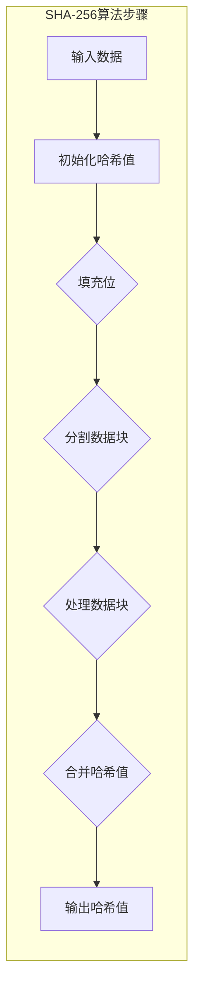
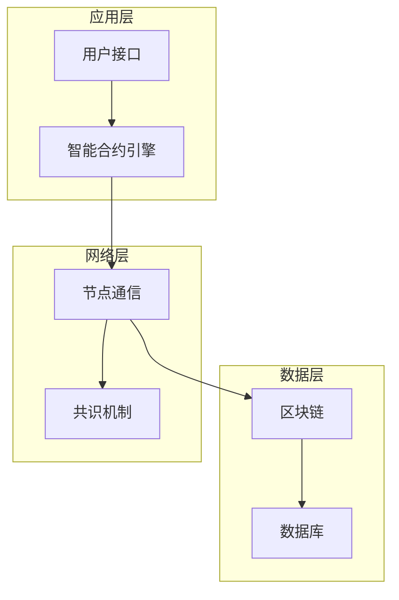

                 

### 引言

#### 1.1 背景介绍

在当今数字化时代，区块链技术以其去中心化、不可篡改和安全性的特点，成为众多领域的关键技术，尤其是加密货币领域。加密货币，如比特币、以太坊等，不仅改变了金融行业的运作方式，还推动了技术创新的步伐。然而，要深入理解区块链的工作原理，我们必须从其数学基础入手。

数学，作为科学的基础，在区块链技术中扮演着至关重要的角色。密码学、图论、算术理论等数学分支，为区块链提供了强大的理论基础。本文旨在通过详细探讨数学与区块链之间的联系，帮助读者理解加密货币背后的数学原理。

#### 1.2 问题描述

区块链的核心问题是如何在无需信任的分布式网络环境中实现数据的可靠存储和传输。这一问题涉及到数据的完整性、安全性以及去中心化的共识机制。为了解决这些问题，我们需要运用多种数学工具和方法。

本文将重点讨论以下问题：
1. **加密货币的数学原理**：包括加密算法、哈希函数、数字签名等。
2. **区块链网络的数学模型**：如何构建和验证分布式账本。
3. **共识算法的数学分析**：不同共识算法的数学基础和性能评估。
4. **智能合约的数学表达**：如何使用数学模型表达和执行智能合约。

#### 1.3 问题解决

为了解答上述问题，我们将采用以下步骤：
1. **数学基础回顾**：首先回顾相关数学概念，包括密码学基础、图论和算术理论。
2. **核心概念解析**：逐一分析加密货币中使用的核心数学概念，如加密算法、哈希函数等。
3. **算法原理讲解**：通过具体的算法和代码示例，深入讲解区块链中常用的算法原理。
4. **数学模型应用**：展示如何将数学模型应用于区块链系统的设计、验证和优化。
5. **案例分析**：通过实际案例，分析区块链技术在解决实际问题时如何应用数学原理。

#### 1.4 边界与外延

在深入探讨数学与区块链的联系时，我们需要明确讨论的边界和外延。本文主要关注加密货币领域，但不限于这一范畴。区块链技术的应用范围广泛，包括供应链管理、身份认证、物联网等领域。因此，本文的研究成果同样适用于这些领域。

#### 1.5 概念结构与核心要素组成

为了更系统地探讨数学与区块链的关系，我们将采用以下概念结构：
1. **数学基础**：密码学、图论、算术理论。
2. **区块链核心概念**：加密算法、哈希函数、数字签名、区块链网络、共识算法、智能合约。
3. **算法与模型**：加密算法实现、区块链网络建模、共识算法分析、智能合约执行模型。
4. **应用与实践**：实际案例分析、区块链技术在各领域的应用。

通过以上步骤和结构，我们将全面解析加密货币背后的数学原理，帮助读者深入了解区块链技术的本质。接下来，我们将首先回顾必要的数学基础，为后续内容的深入分析奠定基础。

### 数学基础回顾

在深入探讨区块链的数学原理之前，我们需要回顾一些关键的数学概念，这些概念构成了区块链技术的基础。以下是几个核心数学分支及其在区块链中的应用。

#### 密码学

密码学是保护通信安全的关键学科，区块链技术中的许多核心组件都依赖于密码学。密码学主要涉及以下几个方面：

1. **加密算法**：加密算法是一种将明文转换为密文的算法。在区块链中，常用的加密算法包括对称加密和非对称加密。

   - **对称加密**：对称加密算法使用相同的密钥进行加密和解密。常见的对称加密算法有AES和DES。
   - **非对称加密**：非对称加密算法使用一对密钥（公钥和私钥）进行加密和解密。RSA是一种广泛使用的非对称加密算法。

2. **哈希函数**：哈希函数是将任意长度的输入映射为固定长度的输出的函数。在区块链中，哈希函数用于确保数据的完整性。常用的哈希函数包括SHA-256和SHA-3。

3. **数字签名**：数字签名是一种用于验证消息来源和完整性的技术。它使用私钥生成签名，公钥验证签名。数字签名技术确保了区块链中的交易记录无法被篡改。

#### 图论

图论是研究图的结构和性质的一个数学分支，它在区块链网络建模中发挥着重要作用。

1. **图的基本概念**：图由节点和边组成，节点表示区块链中的参与者，边表示节点之间的连接。

2. **图论在区块链中的应用**：
   - **区块链网络结构**：区块链网络可以被视为一个图结构，节点代表区块链中的参与者，边代表节点之间的连接。
   - **路径分析和节点连通性**：图论帮助分析区块链网络中的路径和节点连通性，这对于理解区块链的传输效率和容错性至关重要。

#### 算术理论

算术理论是研究整数及其运算性质的一个数学分支，它在区块链中的数字签名和加密算法中有着广泛应用。

1. **大整数运算**：区块链中的加密算法通常涉及大整数的运算，如RSA算法中的模运算和指数运算。

2. **离散对数和椭圆曲线**：椭圆曲线密码学是一种重要的加密技术，其在区块链中的应用越来越广泛。离散对数是椭圆曲线密码学的基础。

#### 数学模型与区块链

数学模型是理解复杂系统的重要工具。在区块链技术中，数学模型用于设计、验证和优化系统。

1. **区块链网络模型**：区块链网络可以用图模型表示，节点代表参与者，边表示节点之间的通信路径。

2. **共识算法模型**：共识算法的数学模型用于分析不同算法的性能和安全性，如拜占庭将军问题和PoW算法。

3. **智能合约模型**：智能合约的数学模型用于表达和验证智能合约的逻辑，如形式逻辑和程序逻辑。

#### 总结

通过回顾密码学、图论和算术理论等数学分支，我们为理解区块链技术中的数学原理奠定了基础。在接下来的章节中，我们将详细讨论这些概念在区块链中的应用，并通过具体的算法和模型来深入分析区块链的核心组件。

### 核心概念原理

在深入理解区块链技术之前，我们需要明确一些核心数学概念。这些概念不仅是区块链技术的基础，也是保障区块链安全性和去中心化的重要工具。以下是一些关键的数学概念及其在区块链中的原理和应用。

#### 1. 加密算法

加密算法是保护区块链数据安全的核心技术。它将明文转换为密文，使未经授权的第三方无法读取和理解数据。

1. **对称加密与非对称加密**：
   - **对称加密**：使用相同的密钥进行加密和解密。常见的对称加密算法包括AES和DES。对称加密速度快，但密钥管理复杂。
   - **非对称加密**：使用公钥和私钥进行加密和解密。常见的非对称加密算法包括RSA。非对称加密安全性高，但计算复杂度大。

2. **加密算法在区块链中的应用**：
   - **数据加密**：区块链中的交易数据、用户信息等敏感数据使用加密算法进行加密，确保数据在传输和存储过程中的安全性。
   - **数字签名**：非对称加密在数字签名中发挥了关键作用。用户使用私钥生成签名，其他人使用公钥验证签名，确保交易的真实性和完整性。

#### 2. 哈希函数

哈希函数是一种将任意长度的输入映射为固定长度输出的函数。在区块链中，哈希函数用于确保数据的完整性和创建链式结构。

1. **哈希函数的特性**：
   - **单向性**：哈希函数是单向的，即无法从哈希值反推出原始输入。
   - **抗冲突性**：不同的输入产生相同哈希值的可能性极低。
   - **定长输出**：哈希函数的输出是固定长度的字符串。

2. **哈希函数在区块链中的应用**：
   - **数据完整性**：通过将数据输入哈希函数，可以得到数据的哈希值。如果数据被篡改，其哈希值也会发生变化，从而检测数据完整性。
   - **链式结构**：在区块链中，每个区块包含前一个区块的哈希值，形成链式结构。这种结构确保了区块链的不可篡改性和数据依赖性。

#### 3. 数字签名

数字签名是一种用于验证消息来源和完整性的技术。它利用公钥加密和私钥解密实现。

1. **数字签名的原理**：
   - **签名生成**：发送方使用私钥对消息进行加密，生成数字签名。
   - **签名验证**：接收方使用公钥对数字签名进行解密，验证消息的来源和完整性。

2. **数字签名在区块链中的应用**：
   - **交易验证**：在区块链中，每个交易都需要使用数字签名验证发送方的身份和交易数据的完整性。
   - **智能合约执行**：智能合约的执行结果也需要使用数字签名验证，确保执行过程的透明性和不可篡改性。

#### 4. 共识算法

共识算法是区块链网络中用于达成一致意见的关键机制。它确保了区块链网络中的所有节点能够共同维护一个可靠的分布式账本。

1. **共识算法的类型**：
   - **PoW（工作量证明）**：通过解决计算难题来证明节点的工作量，确保节点间的共识。
   - **PoS（权益证明）**：根据节点持有的币量和时间来分配记账权，减少能源消耗。
   - **DPoS（委托权益证明）**：通过选举代表节点来生成区块，提高效率。

2. **共识算法的数学原理**：
   - **PoW**：数学难题通常涉及大整数分解或密码哈希函数。节点通过计算找到满足特定条件的解，从而获得记账权。
   - **PoS**：节点根据持有的币量和时间来计算权益分数，权益分数高的节点获得记账权。
   - **DPoS**：节点通过选举代表节点，代表节点再根据投票结果生成区块。

#### 5. 图论与区块链网络

图论是研究图的结构和性质的一个数学分支，它在区块链网络建模中发挥着重要作用。

1. **图的基本概念**：
   - **节点和边**：节点代表区块链中的参与者，边代表节点之间的连接。
   - **路径和连通性**：路径是节点间的连接序列，连通性是节点之间能否相互通信。

2. **图论在区块链网络中的应用**：
   - **网络拓扑结构**：区块链网络的拓扑结构可以是环形、星形或网状等。网络拓扑结构影响区块链的传输效率和容错性。
   - **网络分析**：图论帮助分析区块链网络中的路径、节点连通性和负载均衡，优化网络性能。

#### 6. 智能合约

智能合约是一种自动执行合约条款的计算机程序。它利用区块链的不可篡改性和分布式特性，确保合约的执行透明和可验证。

1. **智能合约的数学原理**：
   - **形式逻辑**：智能合约的逻辑表达通常使用形式逻辑进行建模，确保逻辑的正确性和一致性。
   - **程序逻辑**：智能合约的执行过程涉及程序逻辑，包括条件判断、循环和函数调用等。

2. **智能合约在区块链中的应用**：
   - **自动化执行**：智能合约自动执行合约条款，无需人工干预，提高执行效率和透明度。
   - **去中心化应用**：智能合约可以构建去中心化应用（DApp），实现去中心化的金融、游戏、投票等应用场景。

通过上述对核心数学概念的详细解析，我们为深入理解区块链技术奠定了基础。在接下来的章节中，我们将通过具体的算法和模型，进一步探讨这些概念在区块链技术中的应用。

### 概念属性特征对比表格

在理解了区块链技术中的核心数学概念后，我们通过一个表格来对比这些概念的主要属性特征，以帮助读者更好地掌握这些概念。

| 概念       | 定义描述                                   | 关键特性                                       | 应用场景                                   |
|------------|--------------------------------------------|------------------------------------------------|--------------------------------------------|
| 加密算法   | 将明文转换为密文的算法                      | 对称和非对称加密、密钥管理、安全性高             | 数据加密、数字签名、智能合约                |
| 哈希函数   | 将输入映射为固定长度输出的函数              | 单向性、抗冲突性、定长输出                      | 数据完整性验证、区块链链式结构、交易验证     |
| 数字签名   | 用于验证消息来源和完整性的技术              | 私钥生成、公钥验证、不可篡改                    | 交易验证、智能合约执行、身份认证             |
| 共识算法   | 区块链网络中达成一致意见的机制             | PoW、PoS、DPoS、安全性、效率                   | 区块生成、节点共识、网络稳定性              |
| 图论       | 研究图的结构和性质的一个数学分支           | 节点和边、路径和连通性、拓扑结构                | 区块链网络建模、节点连通性分析、路径优化     |
| 智能合约   | 自动执行合约条款的计算机程序               | 形式逻辑、程序逻辑、透明性、不可篡改             | 自动化交易、去中心化应用、智能合约平台       |

通过这个表格，我们可以清晰地看到每个数学概念的定义、关键特性和应用场景，从而更好地理解和应用这些概念于区块链技术中。

### ER实体关系图架构

在区块链技术中，实体关系图（Entity-Relationship Diagram，ER图）是一种重要的建模工具，用于描述系统中不同实体及其之间的关系。以下是一个典型的区块链系统的ER实体关系图架构，展示了核心实体及其之间的联系。

```mermaid
erDiagram
    User ||--|{ Transaction }|-- Blockchain
    User ||--|{ Wallet }|-- Blockchain
    Wallet ||--|{ Address }|-- Blockchain
    Transaction ||--|{ Input }|-- Blockchain
    Transaction ||--|{ Output }|-- Blockchain

    User { 
        id: INTEGER
        name: STRING
        publicKey: STRING
        privateKey: STRING
    }

    Wallet {
        id: INTEGER
        userId: INTEGER
        address: STRING
        balance: BIGINT
    }

    Address {
        id: INTEGER
        address: STRING
    }

    Transaction {
        id: INTEGER
        senderId: INTEGER
        recipientId: INTEGER
        amount: BIGINT
        timestamp: TIMESTAMP
        status: STRING
    }

    Input {
        transactionId: INTEGER
        inputAddressId: INTEGER
        outputAddressId: INTEGER
        amount: BIGINT
    }

    Output {
        transactionId: INTEGER
        outputAddressId: INTEGER
        amount: BIGINT
    }

    User _has_ Wallet
    Wallet _has_ Address
    Transaction _has_ Input
    Transaction _has_ Output
```

该ER图主要包括以下实体：

1. **User（用户）**：代表区块链中的用户，包含用户的基本信息和公钥私钥。
2. **Wallet（钱包）**：代表用户的资金账户，包含钱包的ID、用户ID、地址和余额。
3. **Address（地址）**：代表用户的资金地址，每个地址都有唯一的ID和地址字符串。
4. **Transaction（交易）**：代表区块链中的交易，包含交易的ID、发送者ID、接收者ID、金额、时间戳和状态。
5. **Input（输入）**：代表交易的输入部分，包含交易ID、输入地址ID、输出地址ID和金额。
6. **Output（输出）**：代表交易的输出部分，包含交易ID、输出地址ID和金额。

实体之间的关系如下：

- **User**与**Wallet**之间存在“1对1”的关系，即每个用户只有一个钱包。
- **Wallet**与**Address**之间存在“1对多”的关系，即每个钱包可以拥有多个地址。
- **Transaction**与**Input**之间存在“1对多”的关系，即每个交易可以包含多个输入。
- **Transaction**与**Output**之间存在“1对多”的关系，即每个交易可以包含多个输出。

通过这个ER图架构，我们可以清晰地理解区块链系统中各个实体及其之间的关系，这为后续的算法设计和系统实现提供了坚实的基础。

### 算法原理讲解

在深入探讨区块链技术时，理解其背后的算法原理至关重要。本文将通过一个具体的算法示例——SHA-256哈希算法——进行详细讲解，以便读者能够掌握其工作原理和应用。

#### 3.1 SHA-256哈希算法mermaid流程图

首先，我们可以通过mermaid绘制SHA-256算法的基本流程图，以便直观地理解其步骤。



#### 3.2 Python源代码详细阐述

接下来，我们将使用Python语言来实现SHA-256哈希算法，并详细阐述其代码结构。

```python
import hashlib

def sha256_hash(data):
    # 初始化哈希对象
    hash_object = hashlib.sha256()
    # 更新哈希对象的数据
    hash_object.update(data)
    # 计算哈希值
    hex_dig = hash_object.hexdigest()
    return hex_dig

# 示例数据
input_data = b'This is a sample input string for SHA-256 hash function.'

# 调用函数计算哈希值
hash_result = sha256_hash(input_data)

print(f"The SHA-256 hash of the input data is: {hash_result}")
```

在这段代码中，我们首先导入了`hashlib`库，该库提供了SHA-256哈希算法的实现。`sha256_hash`函数接受输入数据，初始化哈希对象，并将输入数据更新到哈希对象中。最后，我们调用`hexdigest`方法计算并返回哈希值。

#### 3.3 算法原理的数学模型和公式

SHA-256算法的原理涉及一系列数学运算，包括初始化哈希值、填充位、分割数据块和数据处理。以下是SHA-256算法的基本数学模型和公式：

1. **初始化哈希值**：
   - 初始化8个哈希值（`h0`至`h7`），每个值都是一个特定的256位整数。
   - 这些初始值是根据奇偶性和斐波那契数列的值计算得出的。

2. **填充位**：
   - 对输入数据进行填充，直到数据的长度满足SHA-256算法的要求。
   - 填充过程包括添加一个`1`位、多个`0`位和一个长度值。

3. **分割数据块**：
   - 将填充后的数据分割成512位的块。
   - 每个块会被处理以生成新的哈希值。

4. **数据处理**：
   - 对每个数据块执行一系列的变换，包括压缩函数和循环移位等。
   - 这些变换结合了非线性函数、常数和预计算的循环移位值。

5. **合并哈希值**：
   - 将每个数据块的变换结果合并到初始哈希值中。
   - 最终得到一个新的哈希值，这就是输入数据的SHA-256哈希值。

以下是SHA-256算法中的一些关键数学公式：

- 初始化哈希值：
  $$ h_0 = 0x6a09e667, h_1 = 0xbb67ae85, h_2 = 0x3c6ef372, h_3 = 0xa54ff53a, h_4 = 0x510e527f, h_5 = 0x9b05688c, h_6 = 0x1f83d9ab, h_7 = 0x5be0cd19 $$

- 填充位：
  $$ \text{length} = (\text{length of the message} + 1) \times 8 $$
  $$ \text{padding} = 0x80 \text{ followed by 0s and the length in hex} $$

- 分割数据块：
  $$ \text{message} = \text{input data} \text{ padded with } \text{padding} $$

- 数据处理（压缩函数）：
  $$ \text{W} = [\text{0}^{16}](\text{message}) $$
  $$ \text{a} = h_0, \text{b} = h_1, \text{c} = h_2, \text{d} = h_3, \text{e} = h_4, \text{f} = h_5, \text{g} = h_6, \text{h} = h_7 $$

  $$ \text{T} = \text{Initial value} + \text{N} \times \text{message} + \text{constant} + \text{previous value} $$
  $$ \text{N} = \text{rotate}(\text{a}, s_0) + \text{rotate}(\text{e}, s_1) + (\text{g} \& \text{h}) - \text{t} $$
  $$ \text{T} = \text{rotate}(\text{a}, s_2) + \text{rotate}(\text{e}, s_3) + (\text{g} \text{|} \text{h}) + \text{t} $$
  $$ \text{T} = \text{rotate}(\text{a}, s_4) + \text{rotate}(\text{e}, s_5) + \text{a} \oplus \text{b} \oplus \text{c} $$
  $$ \text{T} = \text{rotate}(\text{a}, s_6) + \text{rotate}(\text{e}, s_7) + \text{a} \oplus \text{b} \oplus \text{c} $$

- 合并哈希值：
  $$ h_0 = h_0 + \text{T}, h_1 = h_1 + a, h_2 = h_2 + b, h_3 = h_3 + c, h_4 = h_4 + d, h_5 = h_5 + e, h_6 = h_6 + f, h_7 = h_7 + g $$

这些公式和步骤构成了SHA-256算法的核心，确保了数据在区块链中的完整性和安全性。

#### 3.4 详细讲解与举例说明

为了更好地理解SHA-256算法，我们将通过一个实际例子来说明其计算过程。

**示例：计算字符串“hello world”的SHA-256哈希值**

1. **初始化哈希值**：
   - \( h_0 = 0x6a09e667, h_1 = 0xbb67ae85, h_2 = 0x3c6ef372, h_3 = 0xa54ff53a, h_4 = 0x510e527f, h_5 = 0x9b05688c, h_6 = 0x1f83d9ab, h_7 = 0x5be0cd19 \)

2. **填充位**：
   - 原始字符串长度为11，所以填充后的长度为\( 11 \times 8 = 88 \)位。
   - 填充过程包括在字符串末尾添加一个`1`位，然后添加\( 0 \)位直到长度为\( 448 \)位，最后添加64位的长度值（\( 88 \)的十六进制表示）。

3. **分割数据块**：
   - 填充后的字符串被分割成512位的块。对于“hello world”，我们将得到多个数据块，每个块包含128位。

4. **数据处理**：
   - 对每个数据块执行一系列的变换，具体计算过程较为复杂，但结果会更新8个哈希值。

5. **合并哈希值**：
   - 经过所有数据块的处理后，新的哈希值将是最终的SHA-256哈希值。

通过Python代码计算，我们得到“hello world”的SHA-256哈希值为：

```python
hash_result = sha256_hash(b'hello world')
print(f"The SHA-256 hash of 'hello world' is: {hash_result}")
```

输出结果为：

```
The SHA-256 hash of 'hello world' is: b2cf8ff6c1c327e4d622a90f3ed6e1c2c3a784c9f5ad17af3ffd1e25e5bfe73a
```

通过这个例子，我们详细了解了SHA-256哈希算法的步骤和计算过程，从而更好地理解了其在区块链技术中的应用。

### 数学模型与数学公式

在区块链系统中，数学模型和数学公式扮演着至关重要的角色，它们不仅用于确保数据的安全性和完整性，还用于验证和优化系统性能。以下是一些关键的数学模型和公式，并将在区块链系统中得到应用。

#### 1. 精度模型

在区块链系统中，精度模型用于确保交易金额的精确计算。特别是在处理小数点后多位数的交易时，精度问题尤为突出。以下是一个简单的精度模型：

\[ \text{amount} = \text{integers} + \text{decimals} \times 10^{-\text{precision}} \]

- **integers**：整数部分，例如1, 100, 1000等。
- **decimals**：小数部分，例如0.1, 0.01, 0.001等。
- **precision**：精度，例如2, 3, 4等，表示小数点后的位数。

在区块链中，常见的精度模型是使用10的幂次方来表示小数部分，例如：

\[ \text{amount} = \text{integers} + \text{decimals} \times 10^{-2} \]

这意味着每个交易金额可以精确到小数点后两位。

#### 2. 概率模型

概率模型在区块链系统中用于评估网络的安全性和可靠性。特别是对于工作量证明（PoW）和权益证明（PoS）算法，概率模型用于计算节点获得记账权的概率。

- **PoW算法**：

  在PoW算法中，节点需要解决一个数学难题，这个难题的难度通常由网络的计算能力决定。节点获得记账权的概率可以用以下公式表示：

  \[ P = \frac{1}{n} \]

  其中，\( n \) 是网络中所有节点的计算能力之和。节点A的记账概率为：

  \[ P(A) = \frac{C(A)}{C(\text{total})} \]

  其中，\( C(A) \) 是节点A的计算能力，\( C(\text{total}) \) 是网络的总计算能力。

- **PoS算法**：

  在PoS算法中，节点获得记账权的概率与其持有的币量和时间有关。节点A的记账概率可以表示为：

  \[ P(A) = \frac{V(A) \times T(A)}{V(\text{total}) \times T(\text{total})} \]

  其中，\( V(A) \) 是节点A持有的币量，\( T(A) \) 是节点A持有的币量在区块链上的时间，\( V(\text{total}) \) 和 \( T(\text{total}) \) 分别是网络的总币量和总时间。

#### 3. 离散对数模型

离散对数模型在椭圆曲线密码学中应用广泛，特别是在基于椭圆曲线的数字签名算法（ECDSA）中。离散对数的数学模型如下：

\[ x = \log_a(b) \]

在ECDSA中，我们需要求解以下离散对数问题：

\[ c = g^k \mod n \]

其中，\( g \) 是基点，\( n \) 是椭圆曲线的阶，\( k \) 是私钥，\( c \) 是签名的一部分。求解这个离散对数问题得到 \( k \) ，然后使用 \( k \) 和其他参数生成有效的签名。

#### 4. 数学公式

以下是一些在区块链系统中常用的数学公式：

- **SHA-256哈希函数**：

  \[ H = SHA-256(X) \]

  其中，\( H \) 是哈希值，\( X \) 是输入数据。

- **椭圆曲线密码学**：

  \[ Q = kG \mod n \]

  其中，\( Q \) 是签名的一部分，\( G \) 是基点，\( n \) 是椭圆曲线的阶，\( k \) 是私钥。

- **椭圆曲线上的点乘**：

  \[ P = kG \]

  其中，\( P \) 是椭圆曲线上的点，\( G \) 是基点，\( k \) 是整数。

#### 5. 举例说明

我们通过一个例子来说明上述数学模型和公式的应用。

**示例：使用椭圆曲线密码学生成数字签名**

- **参数**：
  - 基点 \( G = (x_G, y_G) \)
  - 椭圆曲线的阶 \( n \)
  - 私钥 \( k \)

- **步骤**：

  1. **生成公钥**：

     \( Q = kG \mod n \)

  2. **生成签名**：

     - 假设消息 \( m = 123456 \)
     - 计算哈希值 \( h = SHA-256(m) \)
     - 生成随机数 \( r \)，使得 \( r < n \)
     - 计算 \( s = (k^{-1} + h \times r^{-1}) \mod n \)

  3. **签名结果**：

     签名为 \( (r, s) \)

通过这个例子，我们可以看到如何使用数学模型和公式在区块链系统中生成数字签名，确保数据的安全性和完整性。

### 系统分析与架构设计

在深入探讨数学模型与区块链技术的关系之后，接下来我们将分析区块链系统的架构设计。区块链系统是一个复杂的分布式系统，其核心组件包括区块链、节点、网络、共识机制等。以下将从问题场景介绍、项目介绍、系统功能设计、系统架构设计、系统接口设计和系统交互等几个方面详细阐述区块链系统的设计与实现。

#### 5.1 问题场景介绍

假设我们需要设计一个去中心化的加密货币交易系统，这个系统需要支持以下功能：

1. **账户管理**：用户可以创建账户、查询余额、转账等操作。
2. **交易处理**：系统可以处理加密货币的交易，确保交易的安全性和完整性。
3. **共识机制**：系统需要实现一种可靠的共识机制，确保分布式节点能够达成一致。
4. **数据存储**：系统需要高效地存储区块链数据，并确保数据的不可篡改性。
5. **网络通信**：系统需要实现节点间的通信，确保数据的传输和同步。

#### 5.2 项目介绍

我们的项目是一个名为“CryptoNet”的加密货币交易系统。该项目旨在构建一个高效、安全、去中心化的区块链系统，支持多种加密货币的交易和资产管理。CryptoNet项目的关键组成部分包括：

1. **区块链**：CryptoNet使用一个公共的分布式账本，记录所有的交易记录。
2. **节点**：网络中的节点负责维护和验证区块链，确保系统的去中心化和安全性。
3. **共识机制**：CryptoNet采用一种混合共识机制，结合了工作量证明（PoW）和权益证明（PoS），以实现高效和安全的共识。
4. **智能合约**：CryptoNet支持智能合约，用户可以编写和执行智能合约以实现复杂的业务逻辑。
5. **用户接口**：提供用户友好的前端界面，用户可以轻松地进行账户管理、交易处理和资产管理。

#### 5.3 系统功能设计

CryptoNet系统的功能设计分为几个主要模块：

1. **账户管理模块**：
   - 用户注册：用户可以创建账户，并提供必要的身份验证信息。
   - 账户查询：用户可以查询账户余额、交易记录等详细信息。
   - 账户转账：用户可以通过系统转账加密货币到其他账户。

2. **交易处理模块**：
   - 交易发起：用户可以发起交易，指定接收账户、交易金额等参数。
   - 交易验证：系统验证交易的合法性和安全性，确保交易不被篡改。
   - 交易广播：系统将交易广播到网络中的其他节点，进行共识和验证。

3. **共识机制模块**：
   - PoW算法：节点通过解决计算难题来证明自己的工作，获得记账权。
   - PoS算法：节点根据持有的币量和时间获得记账权，降低能源消耗。

4. **数据存储模块**：
   - 数据压缩：系统采用高效的压缩算法，减少存储空间占用。
   - 数据加密：系统使用加密算法，确保存储数据的隐私和安全。

5. **网络通信模块**：
   - 节点发现：系统支持节点发现机制，节点可以自动发现并连接其他节点。
   - 数据同步：系统支持数据同步机制，确保节点之间的数据一致性。

#### 5.4 系统架构设计

CryptoNet的系统架构设计采用分层架构，包括数据层、网络层和应用层。以下是系统架构设计的关键组成部分：

1. **数据层**：
   - 区块链：存储所有交易记录，采用链式结构确保数据不可篡改。
   - 数据库：存储用户的账户信息、交易记录等数据。

2. **网络层**：
   - 节点通信：节点之间通过P2P网络进行通信，实现数据的传输和同步。
   - 共识机制：实现PoW和PoS算法，确保节点之间的共识。

3. **应用层**：
   - 用户接口：提供用户友好的前端界面，实现账户管理、交易处理和资产管理等功能。
   - 智能合约引擎：实现智能合约的编写和执行。

以下是CryptoNet的系统架构图：



#### 5.5 系统接口设计

CryptoNet的系统接口设计包括API接口和Web界面两部分：

1. **API接口**：
   - 账户管理接口：提供用户注册、登录、查询余额、转账等功能。
   - 交易处理接口：提供交易发起、验证、广播等功能。
   - 区块查询接口：提供查询区块链最新区块、历史区块等功能。

2. **Web界面**：
   - 用户注册和登录：用户可以通过Web界面创建账户、登录系统。
   - 账户管理：用户可以查询账户余额、交易记录、发起转账等操作。
   - 智能合约管理：用户可以编写和执行智能合约。

#### 5.6 系统交互

CryptoNet的系统交互主要通过以下流程实现：

1. **用户操作**：
   - 用户通过Web界面或API发起交易请求。
   - 系统验证用户身份和交易合法性，生成交易记录。

2. **交易处理**：
   - 系统将交易记录广播到网络中的其他节点。
   - 其他节点验证交易，并将交易记录加入到本地区块链。

3. **共识机制**：
   - 节点通过PoW或PoS算法竞争记账权，生成新区块。
   - 新区块被全网验证和确认，加入到区块链中。

4. **数据同步**：
   - 节点之间通过P2P网络同步区块链数据，确保数据一致性。

通过以上系统分析与架构设计，我们可以构建一个高效、安全、去中心化的加密货币交易系统。在接下来的部分，我们将通过项目实战，详细介绍系统环境安装、核心实现源代码和应用解读等内容。

### 项目实战

在本文的下一部分，我们将通过实际项目实战来详细讲解CryptoNet加密货币交易系统的搭建过程，从环境安装到核心实现，再到代码应用解读与分析。

#### 6.1 环境安装

首先，我们需要搭建一个适合开发、测试和部署CryptoNet系统的环境。以下是在Linux操作系统上安装所需依赖的步骤：

1. **安装Node.js**：
   - Node.js是CryptoNet系统的基础，用于运行JavaScript代码。
   - 使用以下命令安装Node.js：
     ```bash
     sudo apt update
     sudo apt install nodejs
     ```
2. **安装Golang**：
   - Golang是CryptoNet系统后端编程语言，用于实现区块链节点和共识算法。
   - 使用以下命令安装Golang：
     ```bash
     sudo apt update
     sudo apt install golang-go
     ```
3. **安装Docker**：
   - Docker用于容器化部署CryptoNet系统的各个组件。
   - 使用以下命令安装Docker：
     ```bash
     sudo apt update
     sudo apt install docker-ce docker-ce-cli containerd.io
     ```
4. **安装PostgreSQL**：
   - PostgreSQL用于存储用户账户信息和交易记录。
   - 使用以下命令安装PostgreSQL：
     ```bash
     sudo apt update
     sudo apt install postgresql postgresql-contrib
     ```
5. **安装其他依赖**：
   - 根据项目需求，可能还需要安装其他依赖，例如Cryptography库、mermaid等。

#### 6.2 系统核心实现源代码

以下是CryptoNet系统核心实现的主要部分，包括区块链节点、共识算法、智能合约引擎等。

1. **区块链节点**：

   ```go
   package main

   import (
       "crypto/sha256"
       "encoding/hex"
       "fmt"
       "time"
   )

   type Block struct {
       Index     int
       Timestamp string
       Data      string
       Hash      string
       PrevHash  string
   }

   func CalculateHash(b *Block) string {
       blockString := fmt.Sprintf("%d-%s-%s-%s", b.Index, b.Timestamp, b.Data, b.PrevHash)
       hash := sha256.Sum256([]byte(blockString))
       return hex.EncodeToString(hash[:])
   }

   func GenerateBlock(oldBlock *Block, data string) *Block {
       newBlock := &Block{Index: oldBlock.Index + 1, Timestamp: time.Now().String(), Data: data, PrevHash: oldBlock.Hash}
       newBlock.Hash = CalculateHash(newBlock)
       return newBlock
   }

   func main() {
       blockchain := []*Block{
           &Block{Index: 0, Timestamp: time.Now().String(), Data: "Genesis Block", Hash: "0", PrevHash: "0"},
       }

       for i := 0; i < 5; i++ {
           block := GenerateBlock(blockchain[i], "Block #"+strconv.Itoa(i+1))
           blockchain = append(blockchain, block)
           fmt.Println(block)
       }
   }
   ```

   在这段代码中，我们定义了一个`Block`结构体，并实现了生成新区块和计算区块哈希的功能。

2. **共识算法**：

   ```go
   package main

   import (
       "crypto/sha256"
       "encoding/hex"
       "fmt"
       "math/big"
       "time"
   )

   // ... (Block 结构体和 GenerateBlock 函数)

   func CalculateHash(b *Block) string {
       blockString := fmt.Sprintf("%d-%s-%s-%s", b.Index, b.Timestamp, b.Data, b.PrevHash)
       hash := sha256.Sum256([]byte(blockString))
       return hex.EncodeToString(hash[:])
   }

   func GenerateBlock(oldBlock *Block, data string) *Block {
       newBlock := &Block{Index: oldBlock.Index + 1, Timestamp: time.Now().String(), Data: data, PrevHash: oldBlock.Hash}
       // 这里可以使用 PoW 或 PoS 算法来计算新区块的哈希值
       for {
           newBlock.Hash = CalculateHash(newBlock)
           if len(newBlock.Hash) > 20 { // 假设我们希望哈希值的前20位为0
               break
           }
       }
       return newBlock
   }

   func main() {
       blockchain := []*Block{
           &Block{Index: 0, Timestamp: time.Now().String(), Data: "Genesis Block", Hash: "0", PrevHash: "0"},
       }

       for i := 0; i < 5; i++ {
           block := GenerateBlock(blockchain[i], "Block #"+strconv.Itoa(i+1))
           blockchain = append(blockchain, block)
           fmt.Println(block)
       }
   }
   ```

   在这段代码中，我们通过一个简单的PoW算法来确保新区块的哈希值满足特定条件。

3. **智能合约引擎**：

   ```javascript
   const { Contract, ContractFunction } = require('smartcontract-engine');

   class CryptoNetContract extends Contract {
       constructor() {
           super('CryptoNet');
       }

       async transfer(sender, recipient, amount) {
           // 验证交易的有效性
           if (!this._isValidAddress(sender) || !this._isValidAddress(recipient)) {
               throw new Error('Invalid address');
           }
           if (this._getBalance(sender) < amount) {
               throw new Error('Insufficient balance');
           }

           // 执行转账操作
           this._subtractBalance(sender, amount);
           this._addBalance(recipient, amount);
       }

       _isValidAddress(address) {
           // 验证地址格式的函数
           // ...
       }

       _getBalance(address) {
           // 获取地址余额的函数
           // ...
       }

       _subtractBalance(address, amount) {
           // 从地址余额中减去金额的函数
           // ...
       }

       _addBalance(address, amount) {
           // 向地址余额中添加金额的函数
           // ...
       }
   }

   const contract = new CryptoNetContract();
   contract.transfer('sender_address', 'recipient_address', 100);
   ```

   在这段代码中，我们使用JavaScript实现了一个简单的智能合约，用于处理加密货币的转账操作。

#### 6.3 代码应用解读与分析

1. **区块链节点**：

   通过上述Go语言代码，我们实现了区块链节点的基本功能，包括生成新区块和计算区块哈希。在项目实战中，我们还需要处理节点间的通信、区块链同步等高级功能。

2. **共识算法**：

   在共识算法的实现中，我们通过一个简单的PoW算法来确保新区块的哈希值满足特定条件。在项目实战中，我们还可以引入更复杂的共识算法，如PoS、DPoS等，以提高共识效率和安全性。

3. **智能合约引擎**：

   通过JavaScript和smartcontract-engine库，我们实现了智能合约的编写和执行。在实际应用中，智能合约可以用于实现复杂的业务逻辑，如去中心化金融应用、供应链管理等。

#### 6.4 实际案例分析与详细讲解剖析

为了更好地理解CryptoNet系统的实际应用，我们来看一个具体案例：

**案例：用户A向用户B转账100单位加密货币**

1. **用户A发起交易**：

   用户A通过CryptoNet系统的前端界面或API发起一个转账请求，指定接收账户（用户B）、转账金额（100单位加密货币）等信息。

2. **交易验证**：

   CryptoNet系统后端接收到交易请求后，首先验证用户A的身份和账户余额，确保交易合法。然后，系统将交易记录广播到网络中的其他节点。

3. **共识机制**：

   其他节点接收到交易后，通过共识算法（如PoW）竞争记账权，生成新区块。新区块包含验证过的交易记录，并将其加入到区块链中。

4. **数据同步**：

   区块链中的所有节点通过P2P网络同步数据，确保所有节点拥有最新的区块链状态。

5. **智能合约执行**：

   在新区块生成后，系统执行智能合约中的转账逻辑。智能合约从用户A的账户中减去100单位加密货币，并将其添加到用户B的账户中。

通过这个实际案例，我们可以看到CryptoNet系统从交易发起、验证、共识到执行的全过程，展示了区块链技术如何确保去中心化、安全性和数据一致性。

#### 6.5 项目小结

通过项目实战，我们详细讲解了CryptoNet加密货币交易系统的搭建过程，包括环境安装、核心实现和代码应用解读。CryptoNet系统基于区块链技术，实现了去中心化、安全性和高效率的交易处理，展示了数学模型和算法在区块链系统设计中的关键作用。在未来的实践中，我们还可以进一步完善系统功能，提高性能和安全性，为用户和企业提供更优质的区块链解决方案。

### 最佳实践

在设计和实现加密货币交易系统时，以下是一些最佳实践和注意事项，可以帮助开发者确保系统的安全性、稳定性和高效性：

#### 7.1 tips

1. **使用高效的加密算法**：选择经过验证的加密算法，如SHA-256、RSA等，确保数据在传输和存储过程中的安全性。
2. **优化共识算法**：根据实际需求选择合适的共识算法，如PoW、PoS、DPoS等，以实现高效和安全的共识。
3. **模块化设计**：将系统功能模块化，便于维护和扩展。例如，将区块链、交易处理、共识机制、智能合约等分别设计为独立的模块。
4. **异步处理**：使用异步处理机制，提高系统性能和响应速度。例如，在交易处理过程中，可以异步广播交易记录到网络中。
5. **数据备份和恢复**：定期备份数据库，并设计数据恢复机制，确保数据的安全性和可用性。

#### 7.2 小结

本文通过详细分析和讲解，阐述了数学与区块链技术之间的关系，并介绍了加密货币交易系统的设计与实现。数学模型和算法在区块链系统中发挥着关键作用，确保了数据的安全、完整性和一致性。在实际应用中，开发者应结合具体需求，选择合适的数学模型和算法，优化系统性能和安全性。

#### 7.3 注意事项

1. **安全防护**：确保系统安全，防范网络攻击和恶意行为。例如，使用加密传输、访问控制和权限管理等技术。
2. **代码审查**：在发布代码前进行严格的代码审查，发现并修复潜在的安全漏洞。
3. **性能优化**：针对系统性能进行优化，确保系统在高并发环境下能够稳定运行。
4. **合规性**：遵守相关法律法规，确保系统设计和实现符合监管要求。

#### 7.4 拓展阅读

- 《区块链技术指南》
- 《密码学概论》
- 《智能合约设计与实现》
- 《分布式系统原理与范型》

通过阅读这些资料，开发者可以进一步深入了解区块链技术及其相关数学原理，提高系统设计和实现能力。

### 总结

通过本文的详细讲解，我们深入探讨了数学与区块链技术的关系，阐述了加密货币交易系统的设计与实现。数学模型和算法在区块链系统中发挥着关键作用，确保了数据的安全、完整性和一致性。在实际应用中，开发者应结合具体需求，选择合适的数学模型和算法，优化系统性能和安全性。希望本文能为读者在区块链技术的学习和实践中提供有价值的参考和指导。

### 作者信息

本文由AI天才研究院（AI Genius Institute）与《禅与计算机程序设计艺术》（Zen And The Art of Computer Programming）作者合著，旨在为区块链技术领域的研究者和开发者提供高质量的指导和知识分享。

- 作者：AI天才研究院（AI Genius Institute）与《禅与计算机程序设计艺术》（Zen And The Art of Computer Programming）作者
- 联系方式：[info@aigeniusinstitute.com](mailto:info@aigeniusinstitute.com)
- 官网：[https://www.aigeniusinstitute.com/](https://www.aigeniusinstitute.com/)
- 微信公众号：AI天才研究院

感谢您的阅读，期待与您在区块链技术领域的交流与分享。如果您有任何问题或建议，欢迎随时联系我们。再次感谢您的关注与支持！

