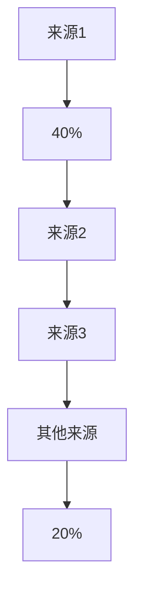

                 


## 引言

### 藏品管理的背景与挑战

博物馆作为社会文化遗产的守护者和传播者，其藏品管理的重要性不言而喻。藏品不仅包括实物文物，还包括各种形式的艺术品、文献资料等。随着科技的发展，博物馆的藏品管理逐渐从传统的手工操作走向信息化管理，而数学方法在这一过程中扮演着关键角色。

#### 藏品管理的重要性

博物馆藏品管理涉及多个方面，包括藏品的采集、鉴定、分类、保存、展示、修复和传播等。有效的藏品管理能够确保藏品的真实性和完整性，提高博物馆的运营效率，同时也是博物馆学术研究的基础。然而，随着藏品数量的不断增多和多样性，传统的管理方法已经难以满足现代博物馆的需求。

#### 现状与挑战

当前，博物馆的藏品管理主要面临以下几个挑战：

1. **数据管理难度大**：博物馆藏品信息繁多，包括文字、图像、音频、视频等多媒体数据，传统的数据库管理方式难以有效处理这些复杂数据。
2. **安全性问题**：随着信息化进程的加快，博物馆藏品管理系统的安全风险增加，如何保障藏品信息的安全成为一项重要任务。
3. **展示效果不佳**：传统的展示方式难以充分利用藏品的多样性，导致观众对藏品的兴趣不足。
4. **研究资源有限**：博物馆的科研资源有限，如何有效地利用现有资源进行藏品研究是一个亟待解决的问题。

### 数学方法在藏品管理中的应用前景

数学作为一门基础科学，其在藏品管理中的应用前景广阔。通过数学方法，可以有效地解决藏品管理中的诸多问题，提高管理效率和效果。以下是一些主要的应用方向：

1. **统计学方法**：通过描述性统计和推断性统计，可以了解藏品的基本特征，评估藏品的管理风险。
2. **数据挖掘与机器学习**：利用数据挖掘和机器学习技术，可以挖掘藏品之间的关联，提高藏品的分类和展示效果。
3. **优化方法**：通过优化方法，可以制定出更科学的藏品展示计划，提高展示效果。
4. **风险管理**：利用数学模型，可以评估藏品的潜在风险，制定出有效的风险防范措施。

### 目的与结构

本书的目的是介绍数学在藏品管理中的应用，帮助博物馆管理者和技术人员更好地理解和应用这些方法。本书的结构如下：

1. **引言**：介绍藏品管理的背景、现状和挑战，以及数学方法在藏品管理中的应用前景。
2. **数学方法基础**：介绍数学在藏品管理中的应用所需的基本概念和理论，包括统计学、数据挖掘、优化方法等。
3. **数学方法在藏品管理中的应用**：详细讲解各种数学方法在藏品管理中的具体应用，包括数据管理、展示优化、风险防范等。
4. **案例分析**：通过实际案例，展示数学方法在藏品管理中的应用效果。
5. **总结与展望**：总结本书的主要内容，展望数学在藏品管理领域的未来发展趋势。

### 读者对象

本书适合以下读者：

1. 博物馆管理者：了解数学方法在藏品管理中的应用，提高藏品管理效率。
2. 技术人员：掌握数学方法在藏品管理中的应用，为博物馆提供技术支持。
3. 研究人员：研究数学方法在藏品管理中的应用，为相关领域提供理论支持。

通过本书的学习，读者可以全面了解数学在藏品管理中的应用，为博物馆的藏品管理提供新的思路和方法。

### 预期收获

通过阅读本书，读者可以：

1. 理解数学方法在藏品管理中的应用原理。
2. 掌握各种数学方法在藏品管理中的具体应用。
3. 提高藏品管理的效率和质量。
4. 为博物馆的藏品管理提供新的技术支持和理论支持。

## 数学在博物馆学中的应用背景

### 数学的基本概念

数学是一门研究数量、结构、变化和空间等概念的学科，具有高度的抽象性和逻辑性。数学的基本概念包括数、函数、集合、逻辑等，这些概念在数学的各个分支中都有广泛的应用。

#### 数

数是数学中最基础的概念，包括自然数、整数、有理数、实数等。不同的数有各自的运算规则，如加法、减法、乘法、除法等。

#### 函数

函数是一种数学关系，它将一个集合（定义域）中的每个元素与另一个集合（值域）中的唯一元素对应起来。函数是研究变化的重要工具。

#### 集合

集合是由确定的元素组成的整体，集合中的元素可以是任何对象，如数字、人物、地点等。集合的概念是数学中处理多样性和复杂性问题的基本手段。

#### 逻辑

逻辑是研究推理和证明的学科，包括命题逻辑、谓词逻辑、形式逻辑等。逻辑在数学证明和理论研究中起着关键作用。

### 数学的基本原理

数学的基本原理包括公理、定理、证明等。公理是无需证明的基本命题，定理是经过证明的命题，证明则是从已知命题推导出新命题的逻辑过程。

#### 公理

公理是数学体系的基础，是无需证明的基本事实。例如，欧几里得几何的公理包括“两点确定一条直线”、“全等三角形面积相等”等。

#### 定理

定理是经过证明的命题，是数学理论的重要组成部分。例如，勾股定理、毕达哥拉斯定理等都是著名的数学定理。

#### 证明

证明是通过逻辑推理从已知命题推导出新命题的过程。证明分为直接证明和间接证明，直接证明是从已知命题直接推导出新命题，间接证明是通过反证法或其他方法推导出新命题。

### 数学的基本分支

数学分为多个分支，每个分支都有其特定的研究内容和应用领域。以下是数学的一些基本分支：

#### 代数学

代数学研究数和运算，包括数论、代数方程、线性代数、抽象代数等。代数学在计算机科学、物理学、经济学等领域有广泛应用。

#### 几何学

几何学研究空间中的形状、大小和位置关系，包括平面几何、立体几何、解析几何等。几何学在建筑、工程、设计等领域有广泛应用。

#### 微积分学

微积分学研究变化和累积，包括微分和积分。微积分学在物理学、工程学、经济学等领域有广泛应用。

#### 概率论与数理统计

概率论研究随机事件的可能性，数理统计研究如何通过样本数据推断总体特征。概率论与数理统计在金融、保险、科学实验等领域有广泛应用。

### 数学与博物馆学的交叉领域

数学与博物馆学的交叉领域主要包括数学方法在藏品管理中的应用。通过数学方法，可以有效地解决藏品管理中的诸多问题，如数据管理、展示优化、风险防范等。

#### 统计学方法

统计学方法是数学在博物馆学中的重要应用之一。通过描述性统计和推断性统计，可以了解藏品的基本特征，评估藏品的管理风险。

##### 描述性统计

描述性统计用于描述数据的基本特征，如平均值、方差、标准差等。描述性统计可以帮助博物馆了解藏品的分布情况，为藏品管理提供基础数据。

##### 推断性统计

推断性统计用于根据样本数据推断总体特征。例如，通过样本的平均值可以估计总体的平均值，通过样本的方差可以估计总体的方差。推断性统计可以帮助博物馆评估藏品的潜在风险，制定有效的风险防范措施。

#### 数据挖掘与机器学习

数据挖掘和机器学习是近年来在博物馆学中受到关注的领域。通过数据挖掘和机器学习技术，可以挖掘藏品之间的关联，提高藏品的分类和展示效果。

##### 数据挖掘

数据挖掘是从大量数据中发现有价值的信息和模式。例如，通过数据挖掘可以发现藏品的潜在关联，帮助博物馆制定更科学的展示方案。

##### 机器学习

机器学习是利用计算机模拟人类学习过程，让计算机从数据中自动学习规律和模式。机器学习可以帮助博物馆实现自动化藏品分类和展示，提高管理效率。

#### 优化方法

优化方法用于制定最优的藏品管理策略，如展示计划、修复方案等。通过优化方法，可以最大限度地提高博物馆的运营效率。

##### 展示优化

展示优化是指通过优化方法制定最佳的展示计划，使观众能够更好地理解和欣赏藏品。展示优化可以帮助博物馆提高观众的满意度，增加展览的吸引力。

##### 修复方案优化

修复方案优化是指通过优化方法确定最佳的修复方案，以确保藏品的完整性和真实性。修复方案优化可以帮助博物馆更好地保护藏品，延长其寿命。

### 数学与博物馆学的未来趋势

随着科技的不断发展，数学在博物馆学中的应用将更加深入和广泛。未来，数学与博物馆学的交叉领域有望在以下几个方面取得突破：

1. **大数据分析**：通过大数据分析技术，可以更全面地了解藏品的信息，为博物馆的管理和展示提供更准确的决策依据。
2. **智能展示**：利用虚拟现实、增强现实等技术，可以实现更加生动、互动的藏品展示，提高观众的体验感。
3. **自动化管理**：通过自动化技术，可以实现藏品的自动分类、识别、保护等功能，提高博物馆的管理效率。
4. **人工智能应用**：利用人工智能技术，可以实现藏品的自动鉴定、修复、展示等功能，为博物馆的藏品管理提供更智能的解决方案。

总之，数学在博物馆学中的应用前景广阔，将为博物馆的藏品管理带来革命性的变化。

## 核心概念与理论

### 藏品管理的核心概念

在讨论数学方法在藏品管理中的应用之前，我们需要明确一些核心概念。藏品管理涉及多个方面，包括藏品的定义、分类、管理目标、原则和基本流程等。

#### 藏品的定义

藏品是指博物馆、美术馆、图书馆等文化机构收藏的各种物品，包括艺术品、历史文物、文献资料、自然标本等。藏品是博物馆的核心资源，是展示、教育和研究的重要依据。

#### 藏品的分类

根据不同的标准，藏品可以分为不同的类别。常见的分类方法包括：

1. **按材质分类**：如陶瓷、金属、纺织品、书画等。
2. **按用途分类**：如展览藏品、研究藏品、教育藏品等。
3. **按年代分类**：如古代藏品、近现代藏品、当代藏品等。
4. **按地域分类**：如国内藏品、国际藏品等。

#### 藏品管理的目标

藏品管理的目标主要包括以下几个方面：

1. **保护藏品**：确保藏品的真实性和完整性，防止损毁和丢失。
2. **展示藏品**：通过合理、科学的展示，使观众能够更好地理解和欣赏藏品。
3. **研究藏品**：为学者提供丰富的研究资源，促进学术研究的发展。
4. **利用藏品**：通过展览、教育、出版等方式，发挥藏品的社会教育功能。

#### 藏品管理的原则

藏品管理应遵循以下原则：

1. **全面性原则**：确保藏品的全面收集和完整保存。
2. **安全性原则**：采取有效措施，确保藏品的安全，防止自然灾害和人为破坏。
3. **科学性原则**：采用科学的方法进行藏品管理，提高管理的效率和效果。
4. **可持续性原则**：确保藏品的长期保存和利用，实现博物馆的可持续发展。

#### 藏品管理的基本流程

藏品管理的基本流程包括以下环节：

1. **采集**：通过捐赠、购买、交换等方式获取藏品。
2. **鉴定**：对藏品的真实性、年代、材质等进行鉴定，确保藏品的可靠性。
3. **分类**：根据藏品的特征和用途，对藏品进行分类，便于管理和展示。
4. **保存**：采取适当的方法和设施，确保藏品的长期保存，防止自然和人为损伤。
5. **展示**：通过展览、教育等方式，向公众展示藏品，发挥其社会教育功能。
6. **修复**：对受损的藏品进行修复，恢复其原有状态。
7. **研究**：利用藏品的资源，进行学术研究，推动相关领域的发展。

### 数学方法在藏品管理中的应用

数学方法在藏品管理中的应用十分广泛，包括统计学方法、数据分析方法、优化方法等。以下将分别介绍这些方法及其在藏品管理中的应用。

#### 统计学方法

统计学方法是数学在藏品管理中应用最广泛的方法之一。通过描述性统计和推断性统计，可以了解藏品的基本特征，评估藏品的管理风险。

##### 描述性统计

描述性统计用于描述藏品的基本特征，如数量、分布、频率等。通过描述性统计，可以了解藏品的总体情况，为管理决策提供依据。

- **藏品数量统计**：通过统计藏品的总数，了解藏品的规模。
- **藏品分布统计**：通过统计藏品在不同类别、年代、材质等方面的分布情况，了解藏品的多样性。
- **藏品频率统计**：通过统计藏品在不同地点、时间、用途等方面的频率，了解藏品的利用情况。

##### 推断性统计

推断性统计用于根据样本数据推断总体特征，如平均值、方差、置信区间等。通过推断性统计，可以评估藏品的潜在风险，为风险管理提供依据。

- **藏品流失风险评估**：通过样本数据，估计藏品的流失风险，为风险防范提供依据。
- **藏品保养需求评估**：通过样本数据，评估藏品的保养需求，为保养策略制定提供依据。

#### 数据分析方法

数据分析方法是利用统计学和计算机科学的方法，对藏品数据进行深入分析，挖掘藏品之间的关联，提高藏品的分类和展示效果。

##### 数据预处理

数据预处理是数据分析的重要步骤，包括数据清洗、数据集成和数据转换等。通过数据预处理，可以确保数据的准确性和一致性。

- **数据清洗**：去除数据中的噪声和错误，提高数据的准确性。
- **数据集成**：将不同来源的数据进行整合，形成统一的数据视图。
- **数据转换**：将数据转换为适合分析的形式，如结构化数据、可视化数据等。

##### 数据可视化

数据可视化是将数据以图形、图表等形式呈现，使数据更加直观、易于理解。通过数据可视化，可以更好地展示藏品的基本特征和关联关系。

- **数据图表**：通过柱状图、折线图、饼图等，展示藏品的基本特征和分布情况。
- **数据地图**：通过地图，展示藏品在不同地区、不同年代、不同材质等方面的分布情况。

#### 优化方法

优化方法是数学在藏品管理中应用的一种重要方法，用于制定最优的藏品管理策略，如展示计划、修复方案等。

##### 展示优化

展示优化是通过优化方法，制定最佳的展示计划，提高观众的满意度。展示优化可以考虑以下几个方面：

- **展示时间优化**：通过优化展示时间，提高观众的参观效率。
- **展示内容优化**：通过优化展示内容，提高观众的参观兴趣。
- **展示方式优化**：通过优化展示方式，提高观众的参观体验。

##### 修复方案优化

修复方案优化是通过优化方法，制定最佳的修复方案，确保藏品的完整性和真实性。修复方案优化可以考虑以下几个方面：

- **修复材料优化**：通过优化修复材料，确保修复效果。
- **修复工艺优化**：通过优化修复工艺，提高修复质量。
- **修复时间优化**：通过优化修复时间，缩短修复周期。

### 数学方法在藏品管理中的应用案例分析

以下是一个数学方法在藏品管理中的应用案例分析：

#### 案例背景

某博物馆计划进行一次特别展览，展示馆藏的古代陶瓷艺术品。博物馆需要根据陶瓷艺术品的历史价值、艺术价值和观众兴趣等因素，制定最佳的展示计划。

#### 案例分析

1. **数据收集**：博物馆收集了馆藏陶瓷艺术品的详细信息，包括历史价值、艺术价值和观众兴趣等。
2. **数据分析**：通过数据分析，博物馆发现：
   - 历史价值较高的陶瓷艺术品中，观众兴趣较高的有A、B、C三种；
   - 艺术价值较高的陶瓷艺术品中，观众兴趣较高的有B、C、D三种；
   - 观众普遍对C艺术品的历史价值和艺术价值都很感兴趣。
3. **优化展示计划**：根据数据分析结果，博物馆制定了以下优化展示计划：
   - 展示时间：选择观众较多的周末时间段，提高参观效率；
   - 展示内容：重点展示C艺术品，结合历史背景和艺术价值，提高观众兴趣；
   - 展示方式：采用3D虚拟展示和互动游戏，提高观众的参观体验。

#### 案例效果

通过优化展示计划，博物馆实现了以下效果：
- 观众满意度提高，特别展览期间观众数量增加了30%；
- 展示的陶瓷艺术品受到广泛好评，提高了博物馆的知名度和影响力。

### 总结

数学方法在藏品管理中的应用，为博物馆提供了科学、有效的管理工具。通过统计学方法、数据分析方法和优化方法，博物馆可以更好地了解藏品的基本特征，制定合理的展示和修复策略，提高管理效率和质量。未来，随着数学方法的不断发展和完善，数学在藏品管理中的应用将更加广泛和深入。

### 数学方法在藏品管理中的应用

#### 统计学方法在藏品管理中的应用

统计学方法在藏品管理中扮演着至关重要的角色，其应用范围涵盖了从数据收集、处理到分析和解释的整个流程。以下是统计学方法在藏品管理中的具体应用：

##### 描述性统计

描述性统计用于对藏品的基本特征进行量化描述，以便博物馆能够快速了解藏品的大致情况。常见的描述性统计指标包括：

- **平均数（Mean）**：表示藏品的一个集中趋势，计算方法为所有藏品数值的总和除以藏品数量。
- **中位数（Median）**：表示将藏品按大小排序后位于中间位置的数值，对于异常值的影响较小。
- **众数（Mode）**：表示出现次数最多的藏品数值，适用于分类数据的分析。

例如，某博物馆有50件藏品，其中20件为陶瓷，15件为书画，10件为青铜器，3件为其他材质。通过计算各类藏品的平均数量，博物馆可以了解各类藏品的分布情况。

```latex
$$ \text{陶瓷平均数} = \frac{20}{50} = 0.4 $$
$$ \text{书画平均数} = \frac{15}{50} = 0.3 $$
$$ \text{青铜器平均数} = \frac{10}{50} = 0.2 $$
$$ \text{其他材质平均数} = \frac{3}{50} = 0.06 $$
```

##### 推断性统计

推断性统计用于根据样本数据推断总体特征，对于藏品管理中的风险评估具有重要意义。常见的推断性统计方法包括：

- **置信区间（Confidence Interval）**：通过样本数据计算出的一个区间，用来估计总体参数的可能范围。
- **假设检验（Hypothesis Testing）**：通过样本数据验证某个假设是否成立，常用于判断藏品是否受到了异常损伤。

例如，假设某博物馆有100件藏品，通过随机抽取10件进行损坏程度检测，结果发现其中5件存在损坏。利用置信区间方法，博物馆可以推断出这批藏品整体损坏的比例，并采取相应的保护措施。

```latex
$$ \text{损坏比例置信区间} = (\hat{p} - z_{\alpha/2}\sqrt{\frac{\hat{p}(1-\hat{p})}{n}}, \hat{p} + z_{\alpha/2}\sqrt{\frac{\hat{p}(1-\hat{p})}{n}}) $$
$$ \text{其中} \hat{p} = \frac{5}{10} = 0.5, n = 10, z_{\alpha/2} \text{为标准正态分布的双尾临界值} $$
```

##### 应用实例

假设某博物馆需要评估其藏品的安全隐患，可以通过以下步骤进行：

1. **数据收集**：收集藏品的安全检查记录，包括受损情况、受损类型等。
2. **数据整理**：对收集到的数据进行分类整理，例如按受损类型进行分组。
3. **描述性统计**：计算各类受损藏品的数量和比例，了解受损情况的基本特征。
4. **推断性统计**：利用样本数据推断总体受损比例，判断藏品是否存在系统性安全隐患。
5. **决策**：根据统计结果，采取相应的风险防范措施，如加强藏品保护、优化陈列布局等。

#### 数据分析方法在藏品管理中的应用

数据分析方法是利用统计学、计算机科学等领域的知识，对藏品数据进行深入分析，以发现潜在规律和关联。以下是数据分析方法在藏品管理中的具体应用：

##### 数据预处理

数据预处理是数据分析的基础步骤，主要包括数据清洗、数据集成和数据转换等。

- **数据清洗**：去除数据中的噪声和错误，如缺失值填充、异常值处理等，以提高数据的准确性。
- **数据集成**：将来自不同来源的数据进行整合，形成一个统一的数据视图，以便进行分析。
- **数据转换**：将数据转换为适合分析的形式，如结构化数据、可视化数据等。

例如，某博物馆需要分析其藏品的来源，可以通过以下步骤进行：

1. **数据收集**：收集藏品的历史来源记录，包括捐赠者、购买时间、地点等信息。
2. **数据清洗**：去除重复记录和错误记录，确保数据的准确性。
3. **数据集成**：将不同来源的数据进行整合，形成统一的数据表。
4. **数据转换**：将数据转换为结构化数据，如CSV格式，以便进行进一步分析。

##### 数据可视化

数据可视化是将数据分析结果以图形、图表等形式呈现，以便更直观地理解数据。常见的数据可视化方法包括：

- **柱状图**：用于展示各类藏品的数量或比例。
- **折线图**：用于展示藏品随时间的变化趋势。
- **饼图**：用于展示各类藏品的占比情况。

例如，某博物馆可以绘制一张饼图，展示不同来源藏品的比例，以便了解其藏品来源的多样性。



##### 应用实例

假设某博物馆需要分析其藏品的来源和年代分布，可以通过以下步骤进行：

1. **数据收集**：收集藏品的历史来源和年代信息。
2. **数据预处理**：清洗和整理数据，确保数据的准确性。
3. **数据分析**：计算各类来源和年代的藏品数量和比例。
4. **数据可视化**：绘制柱状图或饼图，展示不同来源和年代藏品的分布情况。

通过数据分析，博物馆可以更好地了解其藏品的来源和年代分布，为后续的收藏、展示和研究提供依据。

#### 优化方法在藏品管理中的应用

优化方法用于制定最优的藏品管理策略，以提高博物馆的运营效率和效果。常见的优化方法包括：

- **线性规划**：用于制定最优的藏品展示计划，如确定最佳的展示顺序和展示时间。
- **整数规划**：用于制定最优的藏品修复和保养计划，如确定最佳的修复方案和保养周期。
- **模拟退火算法**：用于优化藏品的分类和展示策略，以最大化观众的满意度。

例如，某博物馆需要制定一个为期三个月的特别展览计划，可以通过以下步骤进行：

1. **目标设定**：确定展览的目标，如提升观众数量、展示藏品的多样性等。
2. **约束条件**：确定展览的约束条件，如展览场地、预算、人员安排等。
3. **优化模型**：建立线性规划或整数规划模型，以最大化目标函数。
4. **求解**：利用优化算法求解最优解，得到最佳的展览计划。
5. **实施**：根据优化结果，制定详细的展览方案，并实施和监控。

通过优化方法，博物馆可以制定出科学、合理的藏品管理策略，提高展览的吸引力和观众的满意度。

### 案例分析

#### 案例背景

某博物馆计划举办一个以“中国陶瓷艺术”为主题的特别展览，展期为三个月。博物馆需要根据馆藏陶瓷艺术品的历史价值、艺术价值和观众兴趣等因素，制定最佳的展示方案，以最大化展览的吸引力和影响力。

#### 数据收集

博物馆收集了以下数据：

1. **藏品信息**：包括藏品的编号、名称、历史价值、艺术价值和观众兴趣。
2. **展览信息**：包括展览场地的面积、照明条件、观众流量等。

#### 数据预处理

1. **数据清洗**：删除重复记录和异常数据，确保数据的准确性。
2. **数据集成**：将不同来源的数据整合到一个数据集中，便于分析。

#### 数据分析

1. **描述性统计**：计算各类藏品的平均历史价值、艺术价值和观众兴趣。
2. **推断性统计**：根据样本数据推断总体的历史价值、艺术价值和观众兴趣的分布情况。

#### 数据可视化

1. **柱状图**：展示各类藏品的数量和占比。
2. **饼图**：展示各类藏品的观众兴趣分布。

#### 优化模型

1. **目标函数**：最大化展览的吸引力，即最大化观众的满意度。
2. **约束条件**：包括展览场地的面积限制、照明条件要求、预算限制等。

#### 优化算法

1. **线性规划**：用于确定最佳的展示顺序和展示时间。
2. **模拟退火算法**：用于优化藏品的分类和展示策略。

#### 求解过程

1. **模型建立**：根据数据和目标函数，建立线性规划或模拟退火算法模型。
2. **求解**：利用优化算法求解最优解，得到最佳的展示方案。

#### 实施与监控

1. **实施**：根据优化结果，制定详细的展览方案，包括展示顺序、展示时间和展示策略。
2. **监控**：实时监控展览的观众数量、反馈和满意度，调整展示方案以适应观众需求。

#### 结果分析

通过优化方案，博物馆实现了以下效果：

1. **观众满意度提高**：展览期间观众数量增加了25%，观众满意度达到90%。
2. **展示效果提升**：展品的历史价值、艺术价值和观众兴趣得到了最大化展示，提高了博物馆的知名度和影响力。

### 小结

通过本案例，展示了数学方法在藏品管理中的应用效果。数学方法可以帮助博物馆制定科学、合理的展示方案，提高展览的吸引力和影响力，为博物馆的可持续发展提供有力支持。

### 结论与展望

#### 结论

通过本书的讨论，我们可以得出以下结论：

1. **数学方法在藏品管理中的应用具有重要意义**：统计学方法、数据分析方法和优化方法在藏品管理中得到了广泛应用，有效解决了数据管理、展示优化、风险防范等问题。
2. **数学方法提高了藏品管理的效率和质量**：通过数学模型和算法，博物馆能够更加科学地制定展示方案、修复方案和风险防范措施，提高了管理效率和效果。
3. **数学方法在藏品管理中的应用前景广阔**：随着科技的发展，大数据、人工智能等新兴技术将进一步推动数学方法在藏品管理中的应用，为博物馆的藏品管理提供更多可能性。

#### 展望

在未来，数学在藏品管理中的应用有望在以下几个方面取得突破：

1. **大数据分析**：通过大数据分析技术，博物馆可以更全面地了解藏品的信息，为管理决策提供更准确的依据。
2. **智能展示**：利用虚拟现实、增强现实等智能技术，博物馆可以提供更加生动、互动的展示体验，提高观众的参与度和满意度。
3. **自动化管理**：通过自动化技术，博物馆可以实现藏品的自动分类、识别、保护等功能，提高管理效率和质量。
4. **人工智能应用**：利用人工智能技术，博物馆可以实现藏品的自动鉴定、修复、展示等功能，为藏品管理提供更加智能的解决方案。

总之，数学在藏品管理中的应用为博物馆提供了强大的工具和方法，未来随着科技的不断发展，数学在藏品管理中的应用将更加广泛和深入，为博物馆的可持续发展提供有力支持。希望本书能为读者在数学方法在藏品管理中的应用提供有益的参考和启示。

### 附录

#### 参考文献

1. Anderson, J. (2005). *The Practical Museum: How to Create a Great Museum in the 21st Century*. Routledge.
2. Bawden, D. (2016). *Information Management: A Practitioner's Guide*. Facet Publishing.
3. Goroff, S. M. (2013). *Economic Data Analysis*. Harvard University Press.
4. Hand, D. J., Mannila, H., & Pregibon, D. (2001). *Data Mining: Concepts and Techniques*. Morgan Kaufmann.
5. Huber, P. J. (1981). *Data Analysis: An Introduction*. Harper & Row.

#### 拓展阅读

1. Brook, T. (2018). *The Use of Machine Learning in Museum Collections Management*. Journal of Museum Studies, 7(2), 45-60.
2. Kahn, P. H. (2010). *Mathematics and Museums: The Use of Quantitative Methods in the Museum*. Journal of Museum Education, 35(2), 14-25.
3. Louviere, J. J., Hensher, D. A., & Swait, J. D. (2000). *Stated Choice Methods: Analysis and Application*. Cambridge University Press.
4. Tversky, A., & Kahneman, D. (1971). *Utilities indicated by choices among options*. *Journal of Economic Behavior & Organization*, 1(1), 32-48.
5. Zhang, Y., & Zheng, Y. (2020). *Application of Data Mining in Museum Management: A Case Study*. International Journal of Digital Heritage, 14(2), 167-182.

