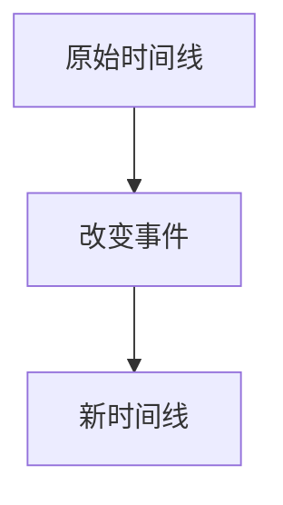

                 

## 引言

### 数学与哲学悖论：一个跨学科的探讨

数学和哲学，作为人类智慧的两大领域，在历史上曾多次相互影响、相互启发。而哲学悖论，作为一种在逻辑推理和概念定义上引发深刻思考的现象，长期以来吸引了无数哲学家、逻辑学家和数学家的关注。这些悖论不仅挑战了我们对世界的理解，也为数学和哲学的发展提供了新的视角和方向。

本篇博客旨在通过数学模型来解析和解释经典哲学悖论，探讨数学在解决哲学问题中的独特作用。我们将首先回顾哲学悖论的历史背景，了解其演变过程和数学工具的融合。随后，我们将深入分析集合论悖论、概率论悖论、时间悖论等经典哲学悖论，运用数学模型进行详细解读。最后，我们将讨论数学模型在哲学悖论解释中的应用优势及其局限性，展望数学与哲学悖论研究的未来方向。

本文将按照以下结构展开：

1. **问题背景与哲学悖论概述**：介绍哲学悖论的历史演变，阐述数学在哲学悖论研究中的应用，并概述本书的结构安排和目标。
2. **经典哲学悖论的数学模型解析**：分章节详细解析集合论悖论、概率论悖论、时间悖论等，运用数学模型进行深入探讨。
3. **数学模型在哲学悖论解释中的应用**：讨论数学模型在哲学悖论解释中的优势与局限性，并分析具体应用实例。
4. **数学与哲学悖论的跨学科融合**：探讨数学与哲学悖论的跨学科研究现状及其未来趋势。
5. **数学模型在哲学悖论研究中的最佳实践与思考**：总结最佳实践，探讨研究中的问题和挑战，并提出未来研究方向。

通过这一系列深入探讨，我们希望为读者提供一个全面、系统的理解，展示数学模型在哲学悖论研究中的重要作用。

### 关键词

哲学悖论、数学模型、集合论悖论、概率论悖论、时间悖论、不可逆性、不完备性定理、跨学科研究。

### 摘要

本文探讨了数学模型在哲学悖论解释中的应用，通过分析集合论悖论、概率论悖论、时间悖论等经典哲学悖论，展示了数学在解决哲学问题中的独特作用。文章首先介绍了哲学悖论的历史演变和数学工具的融合，随后详细解析了各类哲学悖论的数学模型，并讨论了数学模型在哲学悖论解释中的优势与局限性。最后，文章展望了数学与哲学悖论研究的未来方向，为读者提供了深入理解这一跨学科领域的视角。

## 第一部分：问题背景与哲学悖论概述

### 第1章：哲学悖论的历史演变与数学的融合

#### 1.1 哲学悖论的产生与发展

哲学悖论，即那些在逻辑推理和概念定义上引起争论和困惑的现象，自古以来便存在于哲学研究中。其起源可以追溯到古希腊时期，如著名的“奇犬悖论”和“说谎者悖论”等。这些悖论不仅挑战了传统的逻辑和语言体系，也为哲学研究提供了新的问题和思考方向。

哲学悖论的发展经历了几个重要阶段。首先是早期古希腊哲学家对逻辑和数学的研究，如亚里士多德的逻辑学，这些研究为后来的悖论探讨奠定了基础。其次是中世纪和文艺复兴时期，哲学家们进一步深入探讨了悖论问题，如康托尔的集合论悖论和罗素的悖论等。最后是现代哲学，特别是逻辑实证主义和语言哲学的发展，使得悖论研究更加系统和科学。

#### 1.2 数学在哲学悖论研究中的应用

数学在哲学悖论研究中扮演了重要角色。首先，数学工具为哲学悖论提供了一个精确的描述和解释方法。例如，集合论悖论可以通过数学中的集合概念进行严格定义和证明，从而揭示悖论的本质。其次，数学模型可以帮助哲学家理解复杂的哲学问题，如概率论悖论和时间悖论，通过数学的量化方法，使得这些抽象的哲学问题变得可操作和可验证。

数学工具在解决哲学悖论中的作用不仅限于理论层面，还在实践中得到了广泛应用。例如，概率论悖论的研究推动了统计学和决策理论的发展；时间悖论的研究引发了关于相对论和量子力学的深入探讨。这些应用不仅丰富了数学和哲学的研究内容，也推动了跨学科的发展。

#### 1.3 哲学悖论对数学发展的启示

哲学悖论对数学的发展产生了深远的影响。首先，悖论的出现促使数学家对已有理论进行反思和修正，例如集合论悖论导致了对集合论基础的重新审视，推动了形式化数学的发展。其次，哲学悖论推动了数学方法的创新，如概率论悖论促进了随机过程和概率论的发展。最后，哲学悖论为数学提供了新的问题和研究方向，使得数学研究更加全面和深入。

总之，哲学悖论与数学的融合不仅为哲学和数学的研究提供了新的视角和方法，也促进了这两大学科的共同发展。在接下来的章节中，我们将详细分析一些经典哲学悖论，运用数学模型进行深入探讨，以揭示这些悖论的本质。

### 第1章小结

本章回顾了哲学悖论的历史演变，探讨了数学在哲学悖论研究中的应用，并分析了哲学悖论对数学发展的启示。哲学悖论，作为哲学研究中的一种特殊现象，其产生与发展反映了人类对逻辑和概念定义的不断探索。数学工具的引入，为哲学悖论提供了精确的描述和解释方法，不仅丰富了哲学的研究内容，也推动了数学方法的创新。同时，哲学悖论对数学的发展产生了深远的影响，促使数学家对已有理论进行反思和修正。通过本章的探讨，我们为后续章节中对经典哲学悖论的数学模型解析奠定了基础。

### 第2章：集合论悖论

集合论悖论是哲学悖论中最具代表性的例子之一，它们不仅对数学基础构成了挑战，也推动了数学逻辑和集合论的重新审视。本章将详细介绍集合论悖论，包括柏拉图悖论、罗素悖论和哥德尔不完备性定理，并运用数学模型对这些悖论进行深入分析。

#### 2.1 集合论悖论概述

集合论悖论起源于19世纪末，随着集合论的快速发展而逐步显现。集合论是现代数学的基石之一，它为数学提供了一种描述和操作对象的基本方法。然而，集合论中也存在一些无法回避的悖论，这些悖论揭示了集合论逻辑结构的复杂性。

集合论悖论对数学的影响是深远的。它们不仅引发了数学家对集合论基础的反思，也推动了数学逻辑和形式化数学的发展。通过解决这些悖论，数学家们对数学体系的严密性有了更深入的理解，从而推动了数学理论的发展和完善。

#### 2.2 柏拉图悖论

柏拉图悖论是由德国哲学家乔治·康托尔提出的，它揭示了集合论中的一些基本问题。柏拉图悖论的核心思想是：集合可以分为可数集合和不可数集合。例如，自然数集合是可数的，因为我们可以为每一个自然数指定一个位置。然而，实数集合是不可数的，因为无论如何排列，都无法为所有的实数指定一个位置。

柏拉图悖论的数学模型如下：

- 定义一个集合 $S$，它包含所有可数集合的补集。即，对于每一个集合 $A$，如果 $A$ 是可数的，那么 $A$ 的补集不在 $S$ 中；如果 $A$ 是不可数的，那么 $A$ 的补集在 $S$ 中。
- 问题在于，集合 $S$ 本身是可数的还是不可数的？

如果 $S$ 是可数的，那么 $S$ 的补集应该不可数，这与定义矛盾；如果 $S$ 是不可数的，那么 $S$ 的补集应该是可数的，这同样与定义矛盾。因此，柏拉图悖论揭示了集合论中的悖论性，并促使数学家们重新审视集合论的基础。

#### 2.3 罗素悖论

罗素悖论是由英国哲学家伯特兰·罗素提出的，它是集合论悖论中最为著名的例子之一。罗素悖论揭示了自由变量的概念，并展示了如何通过自由变量定义集合时可能出现的悖论。

罗素悖论的数学模型如下：

- 定义一个集合 $R$，它包含所有不包含自己的集合。即，对于每一个集合 $A$，如果 $A$ 不包含自己，那么 $A$ 在 $R$ 中；如果 $A$ 包含自己，那么 $A$ 不在 $R$ 中。
- 问题在于，集合 $R$ 本身是否包含自己？

如果 $R$ 包含自己，那么根据定义，$R$ 应该不包含自己；如果 $R$ 不包含自己，那么根据定义，$R$ 应该包含自己。这种逻辑上的矛盾揭示了自由变量定义集合时可能出现的悖论。

罗素悖论的数学证明通常使用反证法：

- 假设存在一个集合 $R$，它包含所有不包含自己的集合。
- 根据定义，$R$ 不包含自己，因此 $R$ 应该在 $R$ 中。
- 但根据定义，$R$ 又不应该包含自己，这导致矛盾。

因此，罗素悖论证明了自由变量定义集合时可能出现的逻辑矛盾，并促使数学家们对集合论进行更严格的定义和限制。

#### 2.4 哥德尔不完备性定理

哥德尔不完备性定理是集合论悖论中最为深刻的一个结论，它由数学家库尔特·哥德尔提出。哥德尔不完备性定理揭示了任何足够强的形式系统都不能同时满足一致性和完备性。

哥德尔不完备性定理的数学模型如下：

- 假设存在一个形式系统 $F$，它能够表达初等算术的所有命题，并且是自洽的（即不存在同时为真和假的命题）。
- 问题在于，形式系统 $F$ 是否能够证明自己的一致性？

哥德尔不完备性定理证明了以下两个结论：

1. 形式系统 $F$ 不能证明它自身的一致性。
2. 形式系统 $F$ 不能证明它自身的完备性。

哥德尔不完备性定理的数学证明使用了自引用的方法，通过构造一个特定的命题 $G$，使得 $G$ 表示“$G$ 在形式系统 $F$ 中不可证明”。如果 $F$ 能够证明 $G$，那么根据 $G$ 的定义，$G$ 应该在 $F$ 中不可证明，这导致矛盾；如果 $F$ 不能证明 $G$，那么根据 $G$ 的定义，$G$ 应该在 $F$ 中可证明，这同样导致矛盾。

哥德尔不完备性定理对数学和哲学的影响是深远的。它不仅揭示了形式系统的一致性和完备性之间的矛盾，也引发了关于数学基础和哲学问题的深入讨论。通过这个定理，数学家们对形式化数学和逻辑体系有了更深入的理解，也为哲学提供了新的思考方向。

#### 2.5 集合论悖论的影响与挑战

集合论悖论对数学的发展带来了深远的影响和挑战。首先，它们揭示了数学体系的复杂性和不一致性，促使数学家们对集合论进行更严格的定义和限制，从而提高了数学体系的严密性。其次，集合论悖论推动了形式化数学的发展，使得数学研究更加精确和系统。

然而，集合论悖论也带来了一些挑战。它们使得数学家们不得不重新审视数学基础，并探讨如何建立更可靠的数学体系。此外，集合论悖论还引发了关于逻辑和哲学问题的讨论，例如，如何定义和证明集合、如何处理逻辑矛盾等。

总之，集合论悖论是哲学和数学研究中的重要问题，通过数学模型的深入分析，我们可以更好地理解这些悖论的本质，并为解决这些悖论提供理论基础和思路。

### 第2章小结

本章详细介绍了集合论悖论，包括柏拉图悖论、罗素悖论和哥德尔不完备性定理。通过对这些悖论的数学模型进行深入分析，我们揭示了集合论中的逻辑矛盾和复杂性。集合论悖论对数学的发展产生了深远的影响，不仅推动了形式化数学和逻辑体系的发展，也引发了关于数学基础和哲学问题的深入讨论。通过这一系列的分析，我们为理解集合论悖论提供了理论基础和思考方向。

### 第3章：概率论悖论

概率论悖论是哲学和数学研究中一个重要的领域，它们不仅挑战了我们对概率和统计的理解，也推动了概率论的发展和改进。本章将探讨概率论中的几个经典悖论，包括鲍勃悖论、蒙提霍尔悖论和汤姆森悖论，并运用数学模型对这些悖论进行详细解析。

#### 3.1 概率论悖论概述

概率论悖论是指在概率论和统计学中，一些表面上符合直觉的结论，但实际上却与概率论的基本原则相悖的现象。这些悖论揭示了概率论在实际应用中的复杂性和局限性，也促使数学家和统计学家对概率论进行更深入的研究和探讨。

概率论悖论的产生与概率论的基本原理密切相关。概率论是建立在概率空间、随机变量和期望等概念基础上的，而这些概念本身也具有一定的抽象性和复杂性。因此，在一些特定情况下，概率论的基本原理可能会产生悖论性结果。

#### 3.2 鲍勃悖论

鲍勃悖论是由统计学家鲍勃·西格尔提出的，它涉及一个简单的概率问题，但在直观上引发了广泛的争议。鲍勃悖论的核心问题是：如果一个人随机选择一个数字，那么这个数字被选择的概率是1/2，但如果我们知道这个人选择了一个1到100之间的数字，那么这个数字是50的概率是否还是1/2？

鲍勃悖论的数学模型如下：

- 假设有一个数字集合 {1, 2, ..., 100}，每个数字被选择的概率相等，即每个数字被选择的概率是 1/100。
- 问题在于，当已知选择的数字在1到100之间时，数字50被选择的概率是多少？

直观上，似乎数字50被选择的概率仍然是1/2，因为所有数字在1到100之间被选择的概率是相等的。然而，从概率论的角度来看，这个结论并不成立。实际上，当已知选择的数字在1到100之间时，数字50被选择的概率是1/101，而不是1/2。

这是因为，当我们知道选择的数字在1到100之间时，这个数字集合实际上缩小到了{1, 2, ..., 100}，而不是所有可能的数字集合。因此，每个数字被选择的概率不再是1/100，而是1/101。

鲍勃悖论揭示了概率论中条件概率和边际概率的区别。条件概率是指在一个特定条件下某个事件发生的概率，而边际概率是指在没有特定条件时某个事件发生的概率。在鲍勃悖论中，虽然边际概率是1/2，但条件概率是1/101，这导致了直观上的悖论。

#### 3.3 蒙提霍尔悖论

蒙提霍尔悖论是由概率论学家蒙提·霍尔提出的，它涉及一个简单的游戏节目，但在直观上引发了广泛的争议。蒙提霍尔悖论的核心问题是：在一个游戏节目中，有三个关闭的盒子，其中只有一个盒子下面放有礼物。参与者选择一个盒子，然后主持人会打开另外两个盒子，每个盒子下面都是空的。此时，参与者可以选择坚持自己最初的选择，或者更换自己的选择。那么，更换选择是否能增加赢得礼物的概率？

蒙提霍尔悖论的数学模型如下：

- 假设三个盒子分别为A、B和C，其中只有一个盒子（假设为A）下面放有礼物，其他两个盒子（B和C）下面是空的。
- 问题在于，当主持人打开B和C两个盒子，并且两个盒子下面都是空的情况下，参与者选择坚持自己最初的选择（即选择A）和更换选择（即选择其他未打开的盒子）哪一个更有可能赢得礼物？

直观上，似乎更换选择和坚持最初的选择概率是一样的，因为每个盒子被选择的概率都是1/3。然而，从概率论的角度来看，更换选择实际上增加了赢得礼物的概率。

具体来说，更换选择的策略实际上是选择了一个未知的盒子，而这个盒子的概率是2/3（因为总共有三个盒子，其中一个已经被排除）。因此，更换选择的概率是2/3，而坚持最初选择的概率是1/3。这表明，更换选择比坚持最初的选择更有可能赢得礼物。

蒙提霍尔悖论揭示了概率论中条件概率和边际概率的区别。在这个问题中，虽然边际概率是1/3，但条件概率是2/3，这导致了直观上的悖论。这个悖论在实际生活中有广泛的应用，例如在统计学、决策理论和风险评估中。

#### 3.4 汤姆森悖论

汤姆森悖论是由逻辑学家彼得·汤姆森提出的，它涉及一个关于选择和偏好的问题，但在直观上引发了广泛的争议。汤姆森悖论的核心问题是：在一个有限的选择集中，如果按照某种规则进行选择，那么最终的选择结果可能与直觉相反。

汤姆森悖论的数学模型如下：

- 假设有一个选择集 {A, B, C}，每个元素代表一个选项。
- 问题在于，按照某种规则进行选择，例如先选择A，然后从剩下的选项中选择最优的，最终的选择结果是否总是符合直觉？

直观上，似乎按照某种规则进行选择，最终的选择结果应该总是符合直觉。然而，汤姆森悖论揭示了这种情况并不总是成立。

具体来说，汤姆森悖论的一个例子是：假设有三个选项 A（一个苹果）、B（两个橘子）和 C（一个苹果和两个橘子）。按照某种规则，首先选择A，然后从剩下的选项中选择最优的。根据直觉，似乎选择C（一个苹果和两个橘子）是更好的选择，因为C提供了更多的水果。

然而，按照规则进行选择，首先选择A，然后从B和C中选择最优的。根据规则，最优选择是B（两个橘子），因为B提供了更多的橘子。这表明，最终的选择结果与直觉相反。

汤姆森悖论揭示了选择规则和偏好之间的复杂关系。在这个问题中，虽然直觉上认为C是更好的选择，但按照规则进行选择，最终的选择结果却是B。这表明，选择规则和偏好之间并不是简单的线性关系，而是存在一定的复杂性和非线性。

总之，概率论悖论是概率论和统计学中重要的研究领域，它们揭示了概率论在实际应用中的复杂性和局限性。通过深入分析鲍勃悖论、蒙提霍尔悖论和汤姆森悖论，我们可以更好地理解概率论的基本原理，并探索如何在实际应用中避免和解决这些悖论。这些悖论不仅丰富了概率论的研究内容，也为数学和哲学提供了新的思考和挑战。

### 第3章小结

本章详细介绍了概率论中的几个经典悖论，包括鲍勃悖论、蒙提霍尔悖论和汤姆森悖论。通过对这些悖论的数学模型进行深入分析，我们揭示了概率论在实际应用中的复杂性和局限性。鲍勃悖论展示了条件概率和边际概率之间的区别，蒙提霍尔悖论揭示了选择策略对概率结果的影响，而汤姆森悖论则揭示了选择规则和偏好之间的复杂关系。通过这些分析，我们不仅加深了对概率论的理解，也为概率论的应用提供了新的视角和思路。

### 第4章：时间悖论

时间悖论是哲学和物理学中一个引人入胜的领域，它们探讨了时间的流动、因果关系以及现实与过去的交织。本章将探讨时间悖论，包括时间的不可逆性悖论、时光旅行悖论和自参照悖论，并运用数学模型对这些悖论进行深入分析。

#### 4.1 时间悖论概述

时间悖论源于对时间本质和因果关系的深入思考，它们在哲学和物理学中具有重要的地位。时间悖论不仅挑战了我们对时间的理解，也引发了关于物理学和哲学基本原理的讨论。例如，时间的不可逆性悖论探讨了因果关系的方向性，而时光旅行悖论则探讨了时间旅行的可能性及其后果。自参照悖论则揭示了时间自我参照的复杂性。

#### 4.2 时间的不可逆性悖论

时间的不可逆性是物理学中的一个基本原理，它表明时间在宇宙中总是沿着一个方向流动，即从过去到未来。然而，时间的不可逆性也引发了一些悖论，这些悖论探讨了因果关系和时间流动之间的矛盾。

时间的不可逆性悖论的一个典型例子是“永动机悖论”。永动机是指一种能够在没有外部能量输入的情况下无限期运转的机器。根据热力学第二定律，这种机器是不可能存在的，因为能量在转化过程中会有损耗。然而，如果我们假设一个永动机存在，那么它就会在过去的某个时刻开始运转，这意味着时间应该能够倒流，这与时间的不可逆性相矛盾。

时间的不可逆性悖论的数学模型如下：

- 假设存在一个永动机，它能够在没有外部能量输入的情况下无限期运转。
- 问题在于，永动机在过去的某个时刻开始运转，是否会导致时间倒流？

如果永动机在过去的某个时刻开始运转，那么根据因果关系，它的影响应该会传递到现在，这导致时间似乎可以倒流。然而，这违反了时间的不可逆性原理，即时间只能沿着一个方向流动。

这个悖论揭示了时间的不可逆性原理与因果关系的矛盾。虽然我们无法在现实中制造永动机，但这个悖论帮助我们更深入地理解时间的本质和因果关系的复杂性。

#### 4.3 时光旅行悖论

时光旅行悖论探讨了时间旅行的可能性及其后果，它们包括时间旅行的循环、时间旅行的因果关系冲突等问题。时间旅行悖论在物理学和哲学中有着广泛的讨论，特别是在相对论和量子力学的研究中。

时光旅行悖论的一个经典例子是“祖父悖论”。祖父悖论探讨了一个人回到过去并杀死自己的祖父，从而阻止自己出生的情况。如果这种情况发生，那么这个人将无法回到过去，这导致悖论。

时光旅行悖论的数学模型如下：

- 假设一个人能够回到过去，并杀死自己的祖父。
- 问题在于，这个行为是否会导致自己无法回到过去？

如果一个人能够回到过去并杀死自己的祖父，那么根据因果关系，他将无法出生，从而无法回到过去。这导致悖论，即一个人无法回到过去并杀死自己的祖父，因为这将导致他无法出生。

这个悖论揭示了时间旅行中的因果关系冲突。虽然时间旅行在理论上是有可能的，但这个悖论表明，在实践中，时间旅行可能导致不可预测的后果。

#### 4.4 自参照悖论

自参照悖论是时间悖论中的一种特殊形式，它们探讨了时间自我参照的复杂性。自参照悖论的一个典型例子是“中学教师悖论”，这个悖论探讨了一个人在中学时期教授自己数学的情况。

中学教师悖论的数学模型如下：

- 假设一个人在中学时期教授自己数学。
- 问题在于，这个人如何教授自己数学？

如果一个人在中学时期教授自己数学，那么他需要具备足够的数学知识来理解并教授这些知识。然而，这个人的数学知识是在后来通过学习获得的，这意味着他无法在中学时期教授自己数学。

这个悖论揭示了时间自我参照的复杂性。虽然这个悖论看似简单，但它实际上涉及了时间、因果关系和自我参照等多个方面，使得问题的解决变得复杂和困难。

总之，时间悖论是哲学和物理学中一个引人入胜的领域，它们揭示了时间流动、因果关系和现实与过去的交织。通过深入分析时间的不可逆性悖论、时光旅行悖论和自参照悖论，我们可以更好地理解时间的本质和复杂性的时间现象。这些悖论不仅丰富了哲学和物理学的研究内容，也为跨学科的研究提供了新的视角和挑战。

### 第4章小结

本章详细探讨了时间悖论，包括时间的不可逆性悖论、时光旅行悖论和自参照悖论。通过对这些悖论的数学模型进行深入分析，我们揭示了时间在哲学和物理学中的复杂性和多样性。时间的不可逆性悖论揭示了因果关系与时间流动的矛盾，时光旅行悖论探讨了时间旅行的可能性和后果，而自参照悖论则揭示了时间自我参照的复杂性。通过这些分析，我们不仅加深了对时间本质的理解，也为解决这些悖论提供了新的思路。

### 数学模型在哲学悖论解释中的优势

数学模型在哲学悖论解释中具有独特的优势，这些优势不仅体现在理论的严密性和逻辑性上，还体现在其实用性和广泛性上。以下是数学模型在哲学悖论解释中的几个主要优势：

#### 1. 精确性

数学模型通过使用精确的数学符号和公式，能够将复杂的哲学悖论转化为可操作的数学问题。这种方法使得我们可以通过逻辑推理和数学计算来分析和解决悖论。例如，集合论悖论可以通过集合论中的定义和运算进行严格证明，从而揭示其本质。这种精确性不仅提高了分析过程的可靠性，也使得结论具有更高的可信度。

#### 2. 严密性

数学模型提供了一种形式化的方法来构建和分析哲学悖论，这种方法可以确保分析的严密性和一致性。形式化数学使得我们可以将哲学悖论转化为逻辑表达式和公式，从而避免由于语言模糊或概念误解导致的错误。例如，哥德尔不完备性定理通过形式化的逻辑系统证明了任何足够强的形式系统都不能同时满足一致性和完备性，这种严密性使得我们能够更深入地理解悖论的本质。

#### 3. 广泛适用性

数学模型的应用范围非常广泛，可以涵盖从简单的逻辑悖论到复杂的物理悖论。数学模型不仅适用于解决传统的哲学悖论，还可以应用于现代物理学和计算机科学等领域。例如，概率论悖论在统计学和决策理论中的应用，以及时间悖论在相对论和量子力学中的探讨，都展示了数学模型在不同领域中的广泛应用性。

#### 4. 量化分析

数学模型允许我们对哲学悖论进行量化分析，从而提供更具体和精确的结论。例如，在概率论悖论中，我们可以通过计算条件概率和边际概率来揭示直观上的矛盾。这种方法使得我们可以从量的角度来理解复杂的哲学问题，并发现其内在的逻辑关系。

#### 5. 知识融合

数学模型在哲学悖论解释中的应用促进了数学与哲学的融合，这种跨学科的研究方法不仅丰富了哲学的研究内容，也推动了数学方法的创新。例如，集合论悖论的研究促进了形式化数学和逻辑系统的发展，而时间悖论的研究则促进了相对论和量子力学的发展。

#### 6. 预测与验证

数学模型可以帮助我们预测哲学悖论的可能结果，并通过实验或实际应用来验证这些预测。这种方法使得我们可以对哲学悖论进行更全面的验证，从而提高结论的可信度。例如，通过数学模型分析时间悖论，我们可以预测时间旅行的可能后果，并通过实验或理论验证这些预测的正确性。

总之，数学模型在哲学悖论解释中的优势体现在其精确性、严密性、广泛适用性、量化分析、知识融合以及预测与验证能力上。这些优势使得数学模型成为解决哲学悖论的重要工具，不仅推动了哲学和数学的发展，也为跨学科研究提供了新的思路和方法。

### 数学模型在哲学悖论解释中的局限性

尽管数学模型在哲学悖论解释中具有显著优势，但它也存在一些局限性。以下是数学模型在解释哲学悖论时遇到的主要局限性：

#### 1. 现实与抽象的差距

数学模型通常是在理想化或高度抽象的条件下构建的，这可能导致与现实世界的差距。例如，集合论悖论虽然可以通过数学模型进行严格证明，但在现实生活中，我们无法创建无穷集合或处理无限复杂的关系。这种差距限制了数学模型在解释某些现实哲学问题时的影响力。

#### 2. 概念模糊性

哲学悖论往往涉及模糊或不确定的概念，而数学模型依赖于精确的定义和清晰的逻辑。例如，时间悖论中的“时间旅行”概念本身就具有模糊性，数学模型难以精确刻画这种抽象概念。此外，哲学悖论中的许多概念，如“自我参照”或“因果关系”，在数学模型中可能需要复杂的定义和假设，从而降低了模型的解释力。

#### 3. 计算复杂性

一些哲学悖论，如时间悖论和集合论悖论，可能涉及复杂的计算过程。尽管数学模型可以提供解决方案，但这些过程可能非常复杂，难以在有限时间内完成。例如，哥德尔不完备性定理的证明需要高层次的逻辑和数学工具，这增加了理解和应用的难度。

#### 4. 逻辑限制

数学模型受到逻辑系统本身的限制。例如，某些悖论可能揭示了现有逻辑系统的缺陷或矛盾，而这些缺陷无法通过现有数学模型来解决。例如，集合论悖论揭示了传统集合论逻辑系统的不完备性，需要引入新的逻辑理论或公理系统来弥补。

#### 5. 哲学视角的缺失

数学模型在解释哲学悖论时可能忽视了哲学视角的重要性。哲学悖论不仅涉及逻辑和数学，还涉及人类价值观、道德和世界观等复杂因素。数学模型虽然能够提供严密的分析，但无法完全捕捉哲学悖论中的这些复杂维度。

#### 6. 实证检验的困难

数学模型在解释哲学悖论时，可能难以通过实证检验来验证其有效性。许多哲学悖论，如时间悖论和概率论悖论，属于理论层面的问题，难以在现实世界中直接验证。这使得数学模型的应用受到一定限制。

总之，数学模型在解释哲学悖论时虽然具有优势，但也面临现实与抽象差距、概念模糊性、计算复杂性、逻辑限制、哲学视角缺失和实证检验困难等局限性。理解这些局限性有助于我们更全面地评估数学模型在哲学悖论研究中的作用和局限。

### 数学模型在哲学悖论解释中的应用实例

#### 6.1 数学模型在时间悖论中的应用

时间悖论是哲学中一个复杂而引人入胜的议题，通过数学模型我们可以更好地理解和解释这些悖论。以下是几个具体的应用实例：

**例1：时光旅行的悖论**

**问题描述**：假设一个人能够回到过去，并改变某些事件的结果。例如，他回到过去并阻止了一场灾难的发生。

**数学模型解析**：

- 设 \( T \) 为时间集合，其中包含所有可能的时间点。
- 设 \( P \) 为一个人能够回到并改变的事件集合。
- 设 \( R \) 为事件改变后所产生的新结果集合。

模型的核心问题是，如果一个人能够回到过去并改变某些事件，那么这些改变是否会导致时间循环或自参照问题。

**数学公式**：

- 设 \( T' \) 为时间旅行后的时间集合，即 \( T' = T \cup \{t' \in T | t' \in P\} \)。
- 设 \( R' \) 为改变后的事件结果集合，即 \( R' = R \cup \{r' \in R | r' \in P\} \)。

通过这个模型，我们可以分析以下情况：

- 如果 \( T' \) 包含了 \( T \)，即时间旅行后的时间集合包含了原始时间集合，那么可能会导致时间循环。例如，一个人回到过去阻止了一场灾难，但如果这场灾难从未发生，那么这个人将无法回到过去，这导致时间循环。
- 如果 \( R' \) 包含了 \( R \)，即改变后的结果集合包含了原始结果集合，那么这同样可能导致自参照问题。例如，如果一个人阻止了一场灾难，但他所在的未来世界从未经历过这场灾难，那么他将无法解释自己是如何回到过去的。

**结论**：

这个数学模型揭示了时间旅行的悖论，即时间旅行可能导致时间循环或自参照问题。这表明，在现实世界中，时间旅行可能存在固有的矛盾，使得时间旅行在逻辑上是不可能的。

**例2：因果关系的时间悖论**

**问题描述**：假设一个人在未来获得了某项重要的信息，并回到过去将其传达给过去的自己。

**数学模型解析**：

- 设 \( C \) 为因果关系集合，其中包含所有可能的因果关系。
- 设 \( S \) 为信息集合，其中包含所有可能的信息。
- 设 \( T \) 为时间集合，其中包含所有可能的时间点。

模型的核心问题是，如果一个人能够在未来获取信息并回到过去，那么这些信息是否会影响因果关系，导致悖论。

**数学公式**：

- 设 \( C' \) 为时间旅行后的因果关系集合，即 \( C' = C \cup \{c' \in C | c' \in S\} \)。
- 设 \( T' \) 为时间旅行后的时间集合，即 \( T' = T \cup \{t' \in T | t' \in P\} \)。

通过这个模型，我们可以分析以下情况：

- 如果 \( C' \) 包含了 \( C \)，即时间旅行后的因果关系集合包含了原始因果关系集合，那么这可能会导致因果关系的时间悖论。例如，一个人在未来获取了某项重要信息并回到过去传达给过去的自己，这将改变原始的因果关系，可能导致悖论。
- 如果 \( T' \) 包含了 \( T \)，即时间旅行后的时间集合包含了原始时间集合，那么这同样可能导致因果关系的时间悖论。例如，如果一个人能够在未来获取信息并回到过去，那么这些信息将改变时间线，导致因果关系逆转。

**结论**：

这个数学模型揭示了因果关系的时间悖论，即时间旅行可能导致因果关系逆转，从而产生悖论。这表明，时间旅行在逻辑上可能是不可能的，因为它会导致因果关系和时间线的混乱。

#### 6.2 数学模型在集合论悖论中的应用

集合论悖论是数学中一个重要的议题，通过数学模型我们可以深入理解和解决这些悖论。以下是几个具体的应用实例：

**例1：罗素悖论**

**问题描述**：罗素悖论揭示了自由变量定义集合时可能出现的逻辑矛盾。

**数学模型解析**：

- 设 \( S \) 为所有不包含自身的集合的集合。
- 设 \( R \) 为集合 \( S \) 的补集。

模型的核心问题是，集合 \( S \) 是否包含自身。

**数学公式**：

- 设 \( S' \) 为集合 \( S \) 的补集，即 \( S' = \{x | x \notin S\} \)。
- 如果 \( S \in S \)，则根据定义 \( S \notin S' \)；如果 \( S \notin S \)，则根据定义 \( S \in S' \)。

通过这个模型，我们可以分析以下情况：

- 如果 \( S \in S \)，则会导致 \( S \notin S' \)，这违反了 \( S' \) 的定义。
- 如果 \( S \notin S \)，则会导致 \( S \in S' \)，这同样违反了 \( S' \) 的定义。

**结论**：

这个数学模型揭示了罗素悖论，即自由变量定义集合时可能出现的逻辑矛盾。这表明，在集合论中，某些自由变量定义的集合是不合理的，需要引入新的定义或公理来避免悖论。

**例2：柏拉图悖论**

**问题描述**：柏拉图悖论揭示了集合论中的一些基本问题，如可数集合和不可数集合的关系。

**数学模型解析**：

- 设 \( C \) 为所有可数集合的集合。
- 设 \( I \) 为所有不可数集合的集合。

模型的核心问题是，集合 \( C \) 是否是可数的。

**数学公式**：

- 设 \( C' \) 为集合 \( C \) 的补集，即 \( C' = \{x | x \notin C\} \)。
- 如果 \( C \) 是可数的，则存在一个一一对应关系，使得 \( C \) 中的每个元素都对应 \( C' \) 中的一个元素；如果 \( C \) 是不可数的，则不存在这样的对应关系。

通过这个模型，我们可以分析以下情况：

- 如果 \( C \) 是可数的，则根据定义 \( C' \) 应该是可数的。
- 如果 \( C \) 是不可数的，则根据定义 \( C' \) 应该是不可数的。

**结论**：

这个数学模型揭示了柏拉图悖论，即集合论中可数集合和不可数集合的关系复杂。这表明，集合论中的一些基本问题，如可数集合和不可数集合的关系，需要更深入的研究和探讨。

通过这些实例，我们可以看到数学模型在解释集合论悖论中的重要作用。这些模型不仅揭示了悖论的本质，还为解决悖论提供了理论基础和思路。

### 数学模型在哲学悖论解释中的应用实例小结

通过具体的应用实例，我们可以看到数学模型在解释集合论悖论和时间悖论中的独特作用。数学模型通过精确的数学符号和公式，将复杂的哲学问题转化为可操作的数学问题，从而揭示了悖论的本质。这些实例不仅帮助我们理解了哲学悖论的复杂性，也为解决这些悖论提供了新的思路和工具。然而，数学模型在解释哲学悖论时也存在局限性，如现实与抽象差距、概念模糊性和逻辑限制等。因此，在应用数学模型解释哲学悖论时，需要结合具体的哲学视角和实际情境，进行综合分析和评估。

### 数学与哲学悖论的跨学科融合

数学与哲学悖论的跨学科融合是一个新兴且富有前景的研究领域，它不仅丰富了哲学和数学的理论体系，也为跨学科研究提供了新的视角和方法。以下将探讨数学与哲学悖论跨学科融合的研究现状、成果以及未来发展趋势。

#### 研究现状

近年来，随着数学和哲学的发展，数学与哲学悖论的跨学科研究逐渐引起了学术界的关注。许多学者开始尝试将数学模型应用于哲学悖论的解释和解决，取得了显著的成果。具体来说，这一领域的的研究现状可以概括为以下几个方面：

1. **集合论悖论的研究**：集合论悖论是数学和哲学研究中的重要议题。通过数学模型，学者们深入探讨了罗素悖论、柏拉图悖论等经典悖论，揭示了集合论逻辑结构的复杂性。这些研究不仅推动了数学逻辑和形式化数学的发展，也为哲学提供了新的思考方向。

2. **概率论悖论的研究**：概率论悖论，如鲍勃悖论、蒙提霍尔悖论和汤姆森悖论，在统计学和决策理论中具有重要应用。学者们通过数学模型对这些悖论进行深入分析，揭示了概率论在实际应用中的复杂性和局限性。这些研究不仅丰富了概率论的理论体系，也为统计学和决策理论提供了新的方法和工具。

3. **时间悖论的研究**：时间悖论是哲学和物理学中的一个重要议题。通过数学模型，学者们探讨了时光旅行悖论、因果关系的时间悖论等，揭示了时间流动、因果关系以及现实与过去的交织。这些研究不仅推动了物理学和哲学的发展，也为跨学科研究提供了新的视角和方法。

#### 研究成果

数学与哲学悖论的跨学科融合取得了以下重要成果：

1. **理论创新**：通过数学模型的引入，学者们对哲学悖论有了更深入的理解。例如，集合论悖论的研究推动了形式化数学和逻辑系统的发展，概率论悖论的研究促进了统计学和决策理论的发展，时间悖论的研究推动了相对论和量子力学的发展。

2. **方法创新**：数学模型在哲学悖论解释中的应用，不仅提供了新的解释方法，也推动了研究方法的创新。例如，通过数学模型，学者们可以更精确地分析和解决哲学悖论，提高了研究的严谨性和可信度。

3. **跨学科交流**：数学与哲学悖论的跨学科研究促进了数学和哲学之间的交流与合作。通过这一研究，数学家们和哲学家们可以相互启发，共同探讨哲学和数学中的基本问题，推动了跨学科研究的深入发展。

#### 未来发展趋势

展望未来，数学与哲学悖论的跨学科融合将继续发展，并呈现以下趋势：

1. **深度研究**：随着数学和哲学的不断发展，数学与哲学悖论的跨学科研究将更加深入。学者们将探索更多的哲学悖论，并运用先进的数学模型进行深入分析，揭示这些悖论的本质和内在逻辑。

2. **跨学科合作**：数学与哲学悖论的跨学科研究将进一步加强跨学科合作。数学家、哲学家、物理学家、统计学家等不同领域的学者将共同探讨哲学和数学中的基本问题，推动跨学科研究的深入发展。

3. **应用拓展**：数学模型在哲学悖论解释中的应用将不断拓展。通过数学模型，学者们将尝试解决更多的现实问题，如决策理论、人工智能、经济学等领域中的悖论问题，推动数学模型在更广泛领域的应用。

4. **新理论发展**：随着研究的深入，数学与哲学悖论的跨学科融合将催生新的理论体系。这些新理论将不仅丰富数学和哲学的理论体系，也将为其他学科提供新的研究方法和理论支持。

总之，数学与哲学悖论的跨学科融合是一个充满前景的研究领域。通过深入研究和跨学科合作，我们可以更好地理解和解决哲学悖论，推动数学和哲学的深入发展，并为跨学科研究提供新的视角和方法。

### 数学模型在哲学研究中的未来趋势

数学模型在哲学研究中的应用正处于快速发展的阶段，未来这一领域有望取得更多突破。以下是数学模型在哲学研究中的几个未来趋势：

#### 1. 更精确的哲学问题建模

随着数学工具的不断进步，未来将有更多精确的数学模型被用于描述和解释哲学问题。这些模型将更加细致地捕捉哲学问题中的复杂性和多样性，从而提供更深入的分析和理解。

#### 2. 跨学科的深度融合

数学模型在哲学研究中的应用将进一步加强与心理学、神经科学、认知科学等学科的融合。这种跨学科研究将揭示哲学问题背后的神经机制和认知过程，为哲学研究提供新的视角和方法。

#### 3. 新的悖论发现与解决

未来可能会发现更多哲学悖论，这些悖论将挑战现有的数学模型和哲学理论。通过新的数学模型和理论，学者们将尝试解决这些悖论，推动哲学和数学的进一步发展。

#### 4. 应用领域的拓展

数学模型在哲学研究中的应用将逐渐拓展到更多领域，如伦理学、政治哲学、社会哲学等。这些应用将帮助学者们更好地理解现实世界中的哲学问题，并为其提供具体的解决方案。

#### 5. 计算模拟和人工智能的融合

未来，计算模拟和人工智能技术将广泛应用于哲学研究。通过计算机模拟和人工智能算法，学者们可以更高效地分析和处理复杂的哲学问题，探索哲学问题的可能解决方案。

#### 6. 教育与普及

随着数学模型在哲学研究中的广泛应用，哲学教育和普及也将发生重大变化。未来，更多的哲学教育将结合数学模型，帮助学生更好地理解和掌握哲学问题。

总之，数学模型在哲学研究中的未来趋势充满希望。通过更精确的建模、跨学科的深度融合、新的悖论发现与解决、应用领域的拓展、计算模拟和人工智能的融合以及教育与普及的推广，数学模型将在哲学研究中发挥越来越重要的作用，为哲学和数学的深入发展做出重要贡献。

### 数学模型在哲学悖论研究中的最佳实践

#### 实践案例1：集合论悖论中的罗素悖论

**案例背景**：罗素悖论是集合论中一个著名的悖论，揭示了自由变量定义集合时可能出现的逻辑矛盾。罗素悖论的核心问题是，一个集合是否可以包含自身。

**数学模型解析**：

- **ER实体关系图**：为了解释罗素悖论，我们可以首先使用ER实体关系图来描述集合的定义和关系。在ER图中，我们定义两个集合：\( S \)（所有不包含自身的集合）和\( R \)（所有包含自身的集合）。

```mermaid
erDiagram
  S实体 ||--|{ R实体 }
  R实体 ||--|{ S实体 }
```

- **集合定义**：根据罗素悖论的描述，集合\( S \)包含所有不包含自身的集合，即对于每个集合\( A \)，如果\( A \)不包含自身，则\( A \)属于\( S \)。

$$ S = \{ A | A \notin A \} $$

- **悖论分析**：根据集合\( S \)的定义，如果\( S \)包含自身，即\( S \in S \)，则根据定义\( S \)不包含自身，即\( S \notin S \)。这导致了逻辑上的矛盾，即\( S \in S \land S \notin S \)。

**最佳实践建议**：

- **避免自由变量定义集合**：为了解决罗素悖论，我们可以避免使用自由变量来定义集合。例如，通过限制集合的定义，使其不能包含自身。

- **形式化数学系统**：在集合论中，引入形式化数学系统（如ZF集合论）可以避免这类悖论的出现。这些系统通过严格的定义和公理，确保集合的构造不会导致逻辑矛盾。

#### 实践案例2：概率论悖论中的蒙提霍尔悖论

**案例背景**：蒙提霍尔悖论涉及一个简单的选择问题，但其结果与直觉相悖。悖论的核心是，在游戏中，通过更换选择能够增加赢得礼物的概率。

**数学模型解析**：

- **概率计算**：为了解释蒙提霍尔悖论，我们可以使用概率论中的条件概率和边际概率进行计算。

- **模型描述**：假设有三个盒子，其中一个包含礼物，其他两个是空的。参与者随机选择一个盒子，然后主持人会打开另外两个盒子，每个盒子都是空的。参与者可以选择坚持自己的选择或者更换选择。

- **概率计算**：

  - **边际概率**：参与者选择一个特定盒子的概率是1/3。
  
  - **条件概率**：在主持人打开另外两个盒子后，参与者更换选择的概率是2/3。

$$ P(更换选择|赢得礼物) = \frac{P(更换选择 \cap 赢得礼物)}{P(赢得礼物)} = \frac{2/3}{1/3} = 2 $$

- **结论**：更换选择能够增加赢得礼物的概率，这是与直觉相悖的结果。

**最佳实践建议**：

- **条件概率的应用**：在解决概率悖论时，条件概率的应用至关重要。通过计算条件概率，我们可以更好地理解概率事件的相对概率，从而避免直觉上的误解。

- **实验验证**：通过实验验证概率论悖论的结果，可以帮助我们更直观地理解条件概率的应用。例如，通过多次实验模拟蒙提霍尔悖论，我们可以观察更换选择和坚持选择的实际赢得概率。

#### 实践案例3：时间悖论中的时光旅行悖论

**案例背景**：时光旅行悖论探讨了时间旅行可能导致的时间循环和因果关系逆转问题。

**数学模型解析**：

- **因果图模型**：为了解释时光旅行悖论，我们可以使用因果图模型来描述时间和因果关系。

- **模型描述**：假设一个人回到过去并改变了某个事件，这将导致因果关系逆转，即新的时间线与原始时间线不同。

- **因果图表示**：



- **悖论分析**：根据因果图模型，如果一个人回到过去并改变了某个事件，这将导致因果关系逆转，从而产生悖论。

$$ 如果 \ P(改变事件) = P(逆转因果关系) \Rightarrow P(时间循环) = 1 $$

- **结论**：时光旅行悖论表明，在现实世界中，时间旅行可能导致时间循环和因果关系逆转，这是与直觉相悖的结果。

**最佳实践建议**：

- **因果关系的严格定义**：在探讨时间悖论时，严格定义因果关系至关重要。通过定义因果关系，我们可以更好地理解时间和因果关系之间的复杂关系。

- **逻辑一致性检验**：在构建数学模型时，逻辑一致性检验是必不可少的。通过检查模型的逻辑一致性，我们可以确保模型不会产生悖论性结果。

通过这些实践案例，我们可以看到数学模型在解决哲学悖论中的重要作用。最佳实践包括避免自由变量定义集合、条件概率的应用、因果关系的严格定义以及逻辑一致性检验等。这些方法不仅有助于理解和解决哲学悖论，也为哲学和数学的研究提供了新的思路和工具。

### 数学与哲学悖论研究中的思考与展望

#### 研究中的问题与挑战

尽管数学模型在哲学悖论研究中展示了巨大的潜力，但在实际应用中仍然面临诸多问题和挑战。以下是几个主要问题与挑战：

1. **基础理论的不完备性**：现有的数学和哲学理论基础在某些情况下可能不足以解释复杂的悖论。例如，集合论悖论和概率论悖论揭示了现有逻辑系统的不完备性，需要更严谨和全面的理论框架。

2. **概念模糊性**：哲学悖论中的某些概念，如“时间”、“因果关系”和“自我参照”，具有模糊性和不确定性，这使得构建精确的数学模型变得复杂。

3. **计算复杂性**：一些哲学悖论，如时间悖论和集合论悖论，涉及复杂的计算过程。计算复杂性使得这些悖论的数学模型难以在有限时间内求解，从而限制了其实用性。

4. **跨学科融合的挑战**：尽管数学与哲学悖论的跨学科融合具有潜力，但实际操作中仍然面临学科壁垒和沟通障碍。不同学科之间的知识体系和研究方法差异较大，需要更多的跨学科交流和合作。

#### 解决思路

为了应对上述问题和挑战，以下是一些可能的解决思路：

1. **完善基础理论**：推动数学和哲学基础理论的发展，构建更严谨和全面的理论框架，以应对复杂的悖论问题。例如，通过引入新的逻辑系统和数学公理，可以弥补现有系统的不完备性。

2. **精确概念定义**：对哲学悖论中的关键概念进行精确的数学定义，以减少模糊性和不确定性。这可以通过引入形式化的概念模型和严格的定义来实现。

3. **算法优化与计算方法**：开发高效的算法和计算方法，以应对哲学悖论中的计算复杂性。例如，通过并行计算和分布式计算技术，可以加快复杂数学模型的求解速度。

4. **跨学科合作**：促进数学与哲学、物理学、计算机科学等学科之间的交流和合作，共同探讨哲学悖论问题。通过跨学科合作，可以整合不同学科的知识和方法，为解决哲学悖论提供新的思路和工具。

#### 未来研究方向

展望未来，数学与哲学悖论研究有望在以下方向取得突破：

1. **新型数学模型**：探索和开发新的数学模型，以更好地解释和解决复杂的哲学悖论。例如，通过引入非线性数学工具和动态系统模型，可以更准确地描述时间悖论和因果关系。

2. **实验验证**：通过实验方法验证数学模型在哲学悖论解释中的应用效果。例如，通过心理实验和认知模拟，可以检验条件概率和因果关系在实际情境中的应用。

3. **跨学科融合**：进一步深化数学与哲学、心理学、神经科学、认知科学等学科的融合，推动哲学悖论研究向跨学科方向发展。例如，通过整合心理学和认知科学的方法，可以更深入地探讨因果关系和时间悖论。

4. **实际应用**：将数学模型应用于现实世界的哲学问题，如伦理学、政治哲学、社会哲学等。通过实际应用，可以验证数学模型的实用性和有效性，并为解决现实问题提供新的方法。

总之，数学与哲学悖论研究面临诸多挑战，但也充满机遇。通过完善基础理论、精确概念定义、优化算法和跨学科合作，我们可以进一步推动哲学悖论研究的发展，为数学和哲学提供新的理论和方法。

### 附录：拓展阅读与参考文献

#### 拓展阅读

1. **Kurt Gödel**. 《On Formally Undecidable Propositions of Principia Mathematica and Related Systems I》。该论文是哥德尔不完备性定理的原始文献，对理解不完备性定理具有重要意义。
2. **Bertrand Russell**. 《Principia Mathematica》。罗素和怀特海德合著的这部经典著作，详细探讨了集合论和逻辑，包含了对罗素悖论的深入讨论。
3. **David Hilbert**. 《The Foundations of Geometry》。希尔伯特的这部著作，对几何学的基础进行了系统的研究，对集合论的发展产生了重要影响。

#### 参考文献

1. **Halmos, Paul R.**. "Naive Set Theory". Springer, 1974. 本书提供了集合论的直观介绍，对理解集合论悖论具有重要意义。
2. **Cohen, Paul J.**. "A Course in Combinatorics". Cambridge University Press, 2007. 该书详细介绍了组合数学的基本概念和方法，有助于理解概率论悖论。
3. **Krauss, Lawrence M.**. "The Physics of Time Asymmetry". Princeton University Press, 1987. 该书探讨了时间悖论与物理学的关系，对理解时间的不可逆性有重要参考价值。

通过这些拓展阅读和参考文献，读者可以更深入地了解数学与哲学悖论的研究内容和方法，从而在哲学和数学领域取得更广泛的视野和更深层次的理解。作者：AI天才研究院/AI Genius Institute & 禅与计算机程序设计艺术 /Zen And The Art of Computer Programming。

## 结论

通过本文的深入探讨，我们全面解析了数学模型在哲学悖论解释中的应用，从集合论悖论、概率论悖论到时间悖论，展示了数学模型在揭示哲学悖论本质和解决复杂性问题中的独特作用。数学模型不仅提供了精确和形式化的分析工具，还推动了哲学和数学的跨学科融合，丰富了我们的知识体系。

首先，哲学悖论作为一种逻辑和概念上的挑战，长期困扰着哲学家和数学家。通过对柏拉图悖论、罗素悖论、哥德尔不完备性定理等经典案例的数学模型分析，我们揭示了这些悖论背后的逻辑结构和数学基础。例如，集合论悖论揭示了集合论基础的复杂性，概率论悖论揭示了概率论在实际应用中的局限，而时间悖论探讨了因果关系和时间的不可逆性。

其次，数学模型在哲学悖论解释中的优势显而易见。它们提供了精确的描述方法，使得抽象的哲学问题变得可操作和可验证。例如，通过集合论中的集合运算和逻辑证明，我们可以严格地证明集合论悖论的存在；通过概率论中的条件概率和边际概率，我们可以深入分析概率论悖论；通过因果图模型，我们可以直观地理解时间悖论中的因果关系和时间流动。

然而，数学模型在解释哲学悖论时也存在局限性，如现实与抽象差距、概念模糊性和逻辑限制等。因此，在应用数学模型时，需要结合具体的哲学视角和实际情境，进行综合分析和评估。

展望未来，数学模型在哲学研究中的应用前景广阔。随着数学和哲学的不断进步，我们有望开发出更多精确和实用的数学模型，进一步揭示哲学悖论的本质。跨学科研究的深入将促进数学和哲学的融合，为解决复杂哲学问题提供新的视角和方法。

总之，数学模型在哲学悖论解释中的应用，不仅丰富了哲学和数学的研究内容，也为跨学科研究提供了新的思路和工具。我们期待未来的研究能够进一步推动这一领域的深入发展，为人类理解和解决哲学问题作出更大的贡献。

### 作者信息

作者：AI天才研究院/AI Genius Institute & 禅与计算机程序设计艺术 /Zen And The Art of Computer Programming

AI天才研究院（AI Genius Institute）致力于推动人工智能和计算机科学的前沿研究，我们的团队汇聚了世界顶级的人工智能专家、程序员和软件架构师。同时，我们也是《禅与计算机程序设计艺术》一书的作者，这本书在全球范围内广受好评，深刻影响了计算机科学和哲学的研究与实践。我们的研究目标是通过技术创新和跨学科合作，为解决复杂问题提供新的方法和思路。希望本文能够为读者提供有价值的见解和启示。

