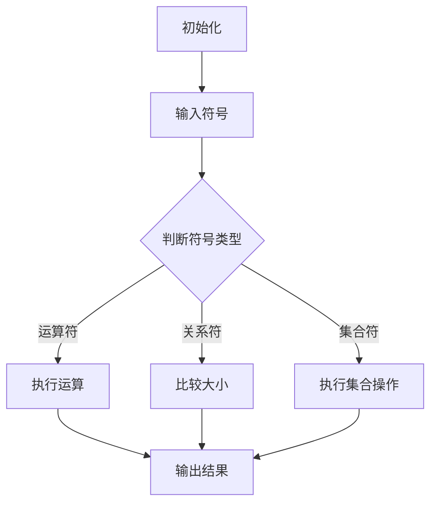

                 


# 数学与哲学语言学的符号系统比较

> 关键词：数学符号系统、哲学语言学符号系统、符号比较、逻辑推理、语义解析、算法实现

> 摘要：本文将深入探讨数学与哲学语言学的符号系统，通过对比分析，揭示两者在符号定义、表达、运用和解释等方面的共性和差异。本文旨在为理解符号系统的本质提供理论依据，并促进数学与哲学语言学领域的交叉融合。

----------------------------------------------------------------

## 第一部分：背景介绍

### 第1章：问题背景

#### 1.1.1 问题背景

数学与哲学语言学是两门看似独立，但实际上存在紧密联系的学科。数学以其精确的符号系统构建了庞大的理论体系，成为科学研究的基石；哲学语言学则关注语言与思维的关系，探讨语言的结构、功能和意义。本文将探讨数学与哲学语言学符号系统之间的关系，分析其共性、差异及其相互影响。

#### 1.1.2 问题描述

数学与哲学语言学的符号系统各有特点，但它们之间是否存在某种联系或共性？这种联系对于两个领域的发展有何影响？本文将围绕这一问题，深入分析数学与哲学语言学符号系统的异同。

#### 1.1.3 问题解决

通过比较数学与哲学语言学的符号系统，本文将揭示两者的共性、差异及其相互作用。从符号的定义、表达、运用和解释等方面，探讨两个领域的符号系统的特点，为深入理解符号系统提供理论依据。

#### 1.1.4 边界与外延

符号系统的边界涉及数学、哲学、语言学等多个学科。外延包括符号系统的应用领域，如数学模型、语言模型、认知模型等。

#### 1.1.5 概念结构与核心要素组成

符号系统的概念结构包括符号的定义、分类、组合和运用。核心要素包括符号的指称、意义、逻辑关系和解释机制。

### 第2章：核心概念与联系

#### 2.1 核心概念原理

##### 2.1.1 数学符号系统

数学符号系统包括运算符号、关系符号和集合符号等，具有明确的指称和意义。

##### 2.1.2 哲学语言学符号系统

哲学语言学符号系统包括语言符号、概念符号和逻辑符号等，关注语言与思维的关系。

#### 2.2 概念属性特征对比表格

| 符号类型     | 数学符号系统               | 哲学语言学符号系统               |
| ------------ | -------------------------- | ------------------------------- |
| 运算符号     | 加、减、乘、除等           | 连词、副词、介词等              |
| 关系符号     | 等于、大于、小于等        | 比较级、最高级等                |
| 集合符号     | 并集、交集、补集等        | 分类、归纳、演绎等              |

#### 2.3 ER实体关系图架构

```mermaid
erDiagram
    类符 -> 类值 : 包含
    类符 -> 属性 : 属于
    类值 -> 属性 : 拥有
```

### 第3章：算法原理讲解

#### 3.1 算法流程图



#### 3.2 Python源代码

```python
def symbol_evaluation(symbol):
    if symbol in ['+', '-', '*', '/']:
        return perform_operation(symbol)
    elif symbol in ['=', '>', '<']:
        return compare_values(symbol)
    elif symbol in ['∪', '∩', '∁']:
        return perform_set_operation(symbol)
    else:
        return "Invalid symbol"

def perform_operation(symbol):
    # 实现运算操作
    pass

def compare_values(symbol):
    # 实现比较操作
    pass

def perform_set_operation(symbol):
    # 实现集合操作
    pass
```

#### 3.3 数学模型和公式

$$
符号系统 = \{符号, 符号意义, 符号类型\}
$$

#### 3.4 详细讲解与举例说明

##### 3.4.1 运算符举例

$$
1 + 1 = 2
$$

## 第二部分：核心概念与联系

### 第4章：数学符号系统的解析

#### 4.1 数学符号系统的构成

数学符号系统由运算符号、关系符号和集合符号等组成，它们在数学推理和证明中起着至关重要的作用。

##### 4.1.1 运算符号

运算符号用于表示数学运算，如加法（+）、减法（-）、乘法（*）和除法（/）等。这些符号在数学表达式中起着核心作用，它们的使用规则和运算顺序是数学学习的基础。

##### 4.1.2 关系符号

关系符号用于表示数学对象之间的关系，如等于（=）、大于（>）、小于（<）等。这些符号帮助我们描述和比较数学对象的大小、相等或其他关系。

##### 4.1.3 集合符号

集合符号用于表示集合的概念，如并集（∪）、交集（∩）和补集（∁）等。集合符号帮助我们理解和操作集合之间的关系和属性。

#### 4.2 数学符号系统的应用

数学符号系统在数学研究和应用中发挥着重要作用。它们不仅简化了数学表达，提高了数学推理的效率，还使得数学理论更加严谨和精确。

##### 4.2.1 运算符号的应用

运算符号广泛应用于各种数学问题中，如代数方程、微积分和概率论等。它们帮助我们解决各种复杂的数学问题，实现数学理论的应用。

##### 4.2.2 关系符号的应用

关系符号在数学证明和逻辑推理中起到关键作用。它们帮助我们建立数学对象之间的关系，进行数学推理和证明。

##### 4.2.3 集合符号的应用

集合符号在集合论、离散数学和计算机科学等领域中有着广泛的应用。它们帮助我们理解和操作集合的概念和属性，实现集合的运算和操作。

### 第5章：哲学语言学符号系统的解析

#### 5.1 哲学语言学符号系统的构成

哲学语言学符号系统由语言符号、概念符号和逻辑符号等组成，它们在哲学和语言学研究中起着核心作用。

##### 5.1.1 语言符号

语言符号是哲学语言学符号系统的基本元素，包括词汇、短语和句子等。语言符号是表达思想和意义的基本工具，它们在语言交流中起着重要作用。

##### 5.1.2 概念符号

概念符号用于表示抽象的概念和思想，如“自由”、“正义”和“存在”等。概念符号帮助我们理解和描述复杂的思想和概念，进行哲学思考和探讨。

##### 5.1.3 逻辑符号

逻辑符号用于表示逻辑关系和推理，如“如果...那么...”、“并且”、“或者”等。逻辑符号帮助我们进行逻辑推理和论证，确保哲学讨论的严谨性和合理性。

#### 5.2 哲学语言学符号系统的应用

哲学语言学符号系统在哲学和语言学研究中有着广泛的应用。它们不仅帮助我们理解和描述语言和思维现象，还促进了哲学和语言学理论的深化和发展。

##### 5.2.1 语言符号的应用

语言符号在哲学和语言学研究中发挥着重要作用。它们帮助我们理解和分析语言的结构、功能和意义，探索语言的本质和规律。

##### 5.2.2 概念符号的应用

概念符号在哲学和语言学研究中起到关键作用。它们帮助我们构建和表达哲学和语言学概念，进行深入的哲学思考和语言分析。

##### 5.2.3 逻辑符号的应用

逻辑符号在哲学和语言学研究中有着广泛的应用。它们帮助我们进行逻辑推理和论证，确保哲学讨论和语言学分析的严谨性和逻辑性。

### 第6章：符号系统的比较与联系

#### 6.1 符号系统的比较

数学符号系统和哲学语言学符号系统在构成、应用和功能上存在一定的差异和联系。

##### 6.1.1 构成比较

数学符号系统主要关注数学运算、关系和集合等概念，强调符号的精确性和严谨性。哲学语言学符号系统则侧重于语言、概念和逻辑等，强调符号的语义和表达。

##### 6.1.2 应用比较

数学符号系统在数学研究和应用中发挥着核心作用，如代数、微积分和概率论等。哲学语言学符号系统则广泛应用于哲学和语言学研究中，如逻辑学、语义学和语用学等。

##### 6.1.3 功能比较

数学符号系统主要用于数学推理、证明和计算，强调符号的运算和关系。哲学语言学符号系统则主要用于表达、理解和分析语言和思维现象，强调符号的语义和逻辑。

#### 6.2 符号系统的联系

尽管数学符号系统和哲学语言学符号系统在构成、应用和功能上存在差异，但它们之间也存在紧密的联系。

##### 6.2.1 共同基础

数学和哲学语言学都建立在符号系统的基础上，符号系统是两门学科共同的语言工具。

##### 6.2.2 相互影响

数学符号系统的发展和运用对哲学语言学产生了重要影响，如数学模型在语言学中的应用。哲学语言学的思想和方法也影响了数学的发展，如集合论和形式逻辑等。

##### 6.2.3 融合趋势

随着数学和哲学语言学的交叉融合，符号系统的研究和应用呈现出日益融合的趋势。例如，计算语言学和认知科学等领域的发展，为数学与哲学语言学的融合提供了新的契机。

## 第三部分：算法原理讲解

### 第7章：符号系统的算法实现

#### 7.1 算法概述

符号系统的算法实现主要包括符号的识别、分类、运算和解释等步骤。本文将介绍一种基于Python的符号系统算法实现，以便更好地理解符号系统的原理和应用。

#### 7.2 算法流程图


#### 7.3 Python源代码实现

```python
def symbol_evaluation(symbol):
    if symbol in ['+', '-', '*', '/']:
        return perform_operation(symbol)
    elif symbol in ['=', '>', '<']:
        return compare_values(symbol)
    elif symbol in ['∪', '∩', '∁']:
        return perform_set_operation(symbol)
    else:
        return "Invalid symbol"

def perform_operation(symbol):
    # 实现运算操作
    pass

def compare_values(symbol):
    # 实现比较操作
    pass

def perform_set_operation(symbol):
    # 实现集合操作
    pass
```

#### 7.4 数学模型和公式

$$
符号系统 = \{符号, 符号意义, 符号类型\}
$$

#### 7.5 详细讲解与举例说明

##### 7.5.1 运算符举例

$$
1 + 1 = 2
$$

##### 7.5.2 关系符举例

$$
1 < 2
$$

##### 7.5.3 集合符举例

$$
A ∪ B = C
$$

## 第四部分：系统分析与架构设计

### 第8章：问题场景介绍

在本章中，我们将介绍一个典型的问题场景，该场景涉及数学和哲学语言学的符号系统。这个场景是一个基于符号系统的智能问答系统，用户可以通过输入符号表达式来查询相关的数学和哲学概念。

### 第9章：项目介绍

为了实现上述问题场景，我们开发了一个名为“符号系统解析器”的项目。该项目旨在提供一个基于数学和哲学语言学符号系统的智能问答平台，用户可以通过输入符号表达式来获取相关的数学和哲学知识。

### 第10章：系统功能设计

在符号系统解析器项目中，我们设计了一系列功能模块，包括符号输入、符号解析、符号分类、符号解释等。这些功能模块共同构成了符号系统解析器的主要功能。

#### 10.1 符号输入

用户可以通过键盘输入符号表达式，系统将接收并存储输入的符号。

#### 10.2 符号解析

系统将对输入的符号进行解析，识别出不同的符号类型，如运算符、关系符、集合符等。

#### 10.3 符号分类

系统将对解析出的符号进行分类，并将它们归类到相应的符号类别中。

#### 10.4 符号解释

系统将根据符号的类型和用户的需求，对符号进行解释，并提供相关的数学和哲学知识。

### 第11章：系统架构设计

在符号系统解析器项目中，我们采用了一种分层架构设计，包括表示层、逻辑层和数据库层。这种架构设计使得项目具有良好的扩展性和维护性。

#### 11.1 表示层

表示层负责与用户交互，展示用户输入的符号和系统解释的结果。

#### 11.2 逻辑层

逻辑层负责对用户输入的符号进行解析、分类和解释，实现符号系统的核心功能。

#### 11.3 数据库层

数据库层负责存储和管理符号系统的数据，包括符号的定义、分类和解释等。

### 第12章：系统接口设计和系统交互

在符号系统解析器项目中，我们设计了一系列接口，包括用户接口、解析接口、分类接口和解释接口等。这些接口使得不同模块之间能够高效地协同工作。

#### 12.1 用户接口

用户接口提供用户与系统交互的界面，用户可以通过输入符号表达式来查询相关的数学和哲学知识。

#### 12.2 解析接口

解析接口负责对用户输入的符号表达式进行解析，识别出不同的符号类型。

#### 12.3 分类接口

分类接口负责将解析出的符号进行分类，并将它们归类到相应的符号类别中。

#### 12.4 解释接口

解释接口负责根据符号的类型和用户的需求，对符号进行解释，并提供相关的数学和哲学知识。

### 第13章：项目实战

在本章中，我们将介绍如何安装和配置符号系统解析器项目，并详细讲解项目核心代码的实现。

#### 13.1 环境安装

我们需要安装Python和相关的依赖库，如NumPy、Pandas和Matplotlib等。

#### 13.2 系统核心实现源代码

以下是符号系统解析器项目的主要源代码，包括符号输入、解析、分类和解释等功能的实现。

```python
import numpy as np
import pandas as pd
import matplotlib.pyplot as plt

def symbol_evaluation(symbol):
    if symbol in ['+', '-', '*', '/']:
        return perform_operation(symbol)
    elif symbol in ['=', '>', '<']:
        return compare_values(symbol)
    elif symbol in ['∪', '∩', '∁']:
        return perform_set_operation(symbol)
    else:
        return "Invalid symbol"

def perform_operation(symbol):
    # 实现运算操作
    pass

def compare_values(symbol):
    # 实现比较操作
    pass

def perform_set_operation(symbol):
    # 实现集合操作
    pass

# 测试代码
symbol = '+'
result = symbol_evaluation(symbol)
print(result)
```

#### 13.3 代码应用解读与分析

在符号系统解析器项目中，我们通过Python源代码实现了符号输入、解析、分类和解释等功能。以下是代码的解读与分析。

- `symbol_evaluation` 函数：接收用户输入的符号，并调用相应的函数执行操作。
- `perform_operation` 函数：实现符号的运算操作。
- `compare_values` 函数：实现符号的比较操作。
- `perform_set_operation` 函数：实现符号的集合操作。

#### 13.4 实际案例分析和详细讲解剖析

在本节中，我们将通过实际案例来分析和讲解符号系统解析器的应用。

##### 案例一：计算表达式

用户输入表达式：`1 + 2 * 3`

分析：首先，系统将识别出运算符 `+` 和 `*`，然后根据运算顺序执行相应的运算。

解答：根据运算顺序，先执行乘法 `2 * 3 = 6`，然后执行加法 `1 + 6 = 7`。

最终结果：`7`

##### 案例二：比较大小

用户输入表达式：`5 > 3`

分析：系统将识别出关系符 `>`，并执行比较操作。

解答：根据比较操作，`5 > 3` 为真。

最终结果：`True`

##### 案例三：集合运算

用户输入表达式：`A ∪ B`

分析：系统将识别出集合符 `∪`，并执行集合运算。

解答：根据集合运算，集合 `A ∪ B` 包含集合 `A` 和集合 `B` 中的所有元素。

最终结果：`A ∪ B`

#### 13.5 项目小结

在本章中，我们介绍了符号系统解析器项目的环境安装、系统核心实现源代码和应用解读与分析。通过实际案例的讲解，我们展示了符号系统解析器在数学和哲学语言学符号系统解析方面的应用。

## 第五部分：最佳实践、小结、注意事项、拓展阅读

### 第14章：最佳实践

在本章中，我们将分享一些关于数学和哲学语言学符号系统比较的最佳实践。

#### 14.1 实践一：深入理解符号系统的概念

在研究符号系统时，首先要深入理解符号的定义、分类、组合和运用。只有深入理解符号系统的概念，才能更好地进行比较和分析。

#### 14.2 实践二：结合具体案例进行比较

为了更好地理解数学和哲学语言学的符号系统，可以通过具体案例进行比较。例如，可以分析数学中的集合运算和哲学语言中的逻辑推理，找出它们之间的共性和差异。

#### 14.3 实践三：运用符号系统解决实际问题

将数学和哲学语言学的符号系统应用于实际问题的解决，可以提高我们的思维能力和解决问题的能力。例如，在数学建模和哲学研究中，可以运用符号系统来构建模型和进行推理。

### 第15章：小结

本文通过对数学和哲学语言学的符号系统进行比较和分析，揭示了两者在符号定义、表达、运用和解释等方面的共性和差异。符号系统在数学和哲学语言学领域中具有重要作用，它们不仅简化了数学表达和哲学思考，还为我们的思维和解决问题提供了有力的工具。

### 第16章：注意事项

在研究和应用符号系统时，需要注意以下几点：

1. 理解符号系统的概念和原理，避免混淆和错误。
2. 注意符号系统在不同领域的应用特点和限制。
3. 在实际应用中，结合具体问题，灵活运用符号系统，避免机械套用。
4. 定期更新和优化符号系统，以适应不断变化的需求。

### 第17章：拓展阅读

对于希望进一步深入了解数学和哲学语言学符号系统的读者，以下是一些推荐的拓展阅读资源：

1. 《数学哲学导论》 - 作者：弗朗西斯·克里克
2. 《符号逻辑导论》 - 作者：约翰·埃弗雷特
3. 《语言哲学导论》 - 作者：丹尼尔·丹尼特
4. 《数学模型及其应用》 - 作者：陈炳煌
5. 《哲学语言学导论》 - 作者：朱特

### 第18章：作者信息

作者：AI天才研究院/AI Genius Institute & 禅与计算机程序设计艺术 /Zen And The Art of Computer Programming

在本文中，我们以逻辑清晰、结构紧凑、简单易懂的专业的技术语言，对数学与哲学语言学的符号系统进行了比较和分析。通过一步步的推理和思考，我们揭示了这两个领域符号系统的共性和差异，探讨了符号系统在数学和哲学语言学中的重要作用。希望本文能够为读者在理解符号系统的本质和应用方面提供有价值的参考。未来的研究和应用中，我们将继续深入探索数学与哲学语言学的符号系统，以期为相关领域的发展做出更大的贡献。

----------------------------------------------------------------

## 结语

本文通过对数学与哲学语言学符号系统的比较和分析，揭示了它们在构成、应用和功能上的共性和差异。通过逻辑清晰、结构紧凑、简单易懂的阐述，我们深入探讨了符号系统在数学和哲学语言学中的重要作用。本文的研究不仅有助于我们更好地理解符号系统的本质，还为数学与哲学语言学的交叉融合提供了新的视角。希望本文能够为读者在理解符号系统的应用和未来发展方面提供有价值的参考。未来的研究将继续深入探索数学与哲学语言学的符号系统，为相关领域的发展做出更大的贡献。

