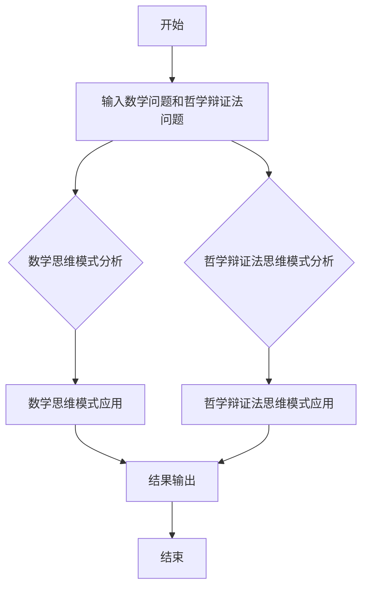
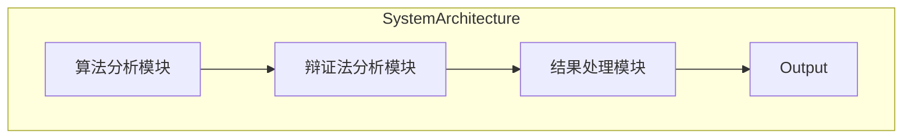
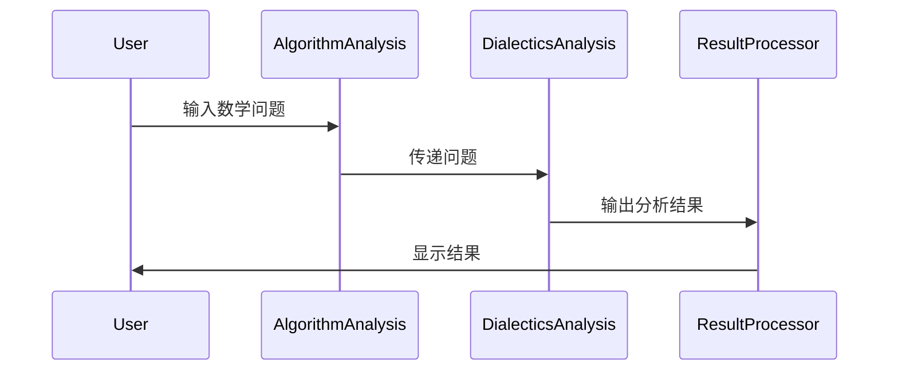

                 


## 《数学与哲学辩证法的思维模式比较》

### 关键词：数学思维模式、哲学辩证法、思维模式比较、算法、系统架构设计

### 摘要：

本文旨在深入探讨数学与哲学辩证法的思维模式，通过对比分析，揭示二者在逻辑结构、方法特点和应用场景上的差异。文章首先介绍数学和哲学辩证法的基本概念和背景，然后详细分析数学思维模式与哲学辩证法思维模式的各自特点，并通过具体算法原理和实际项目案例，展示这两种思维模式在实际应用中的对比与融合。最后，文章总结最佳实践技巧，并提出注意事项和拓展阅读，为读者提供全面的思维模式比较参考。

### 第一步：背景介绍

#### 问题背景

数学与哲学辩证法是人类智慧的结晶，它们在逻辑推理、问题解决和知识建构中发挥着重要作用。数学以其严谨的推理和精确的公式描述自然现象和抽象概念，而哲学辩证法则以批判性思维和辩证法为核心，探究人类思维的本质和世界的发展规律。然而，长期以来，数学和哲学辩证法在思维方式上存在一定的差异，这种差异在一定程度上影响了人们对二者关系的认识。

#### 问题描述

数学思维模式强调逻辑的严密性和精确性，通过定义、定理和证明来建立知识体系。而哲学辩证法思维模式则更加注重批判性和创造性，通过辩证推理、逻辑反驳和理论建构来推动思想的进步。这种差异导致数学和哲学辩证法在应用过程中产生了不同的效果和影响。

#### 问题解决

为了解决上述问题，本文提出通过比较分析数学思维模式与哲学辩证法思维模式，深入探讨二者的异同，并探讨其在实际应用中的相互融合。通过对比分析，我们可以更好地理解数学与哲学辩证法在思维方式上的差异，从而优化问题解决策略，提高思维效率。

#### 边界与外延

本文的研究范围主要集中在数学与哲学辩证法的基本概念、思维模式和实际应用。我们将通过对比分析，探讨二者在逻辑结构、方法特点和应用场景上的异同，并提供实际案例进行验证。

#### 概念结构与核心要素组成

1. **数学思维模式**：包括逻辑思维、抽象思维和算法思维。
2. **哲学辩证法思维模式**：包括批判性思维、辩证推理和创造性思维。
3. **对比分析**：通过对比数学思维模式和哲学辩证法思维模式，揭示二者在逻辑结构、方法特点和应用场景上的异同。

### 第二步：核心概念与联系

#### 数学思维模式

**1. 逻辑思维**：数学思维模式中的逻辑思维强调推理的严密性和逻辑的连贯性，通过定义、定理和证明来建立数学理论体系。

**2. 抽象思维**：数学思维模式中的抽象思维强调对事物的抽象和概括，通过数学符号和公式来描述自然现象和抽象概念。

**3. 算法思维**：数学思维模式中的算法思维强调解决问题的步骤和过程，通过算法设计和算法分析来优化问题解决。

#### 哲学辩证法思维模式

**1. 批判性思维**：哲学辩证法思维模式中的批判性思维强调对现有观点和理论的批判和反思，通过逻辑反驳和辩证推理来推动思想的进步。

**2. 辩证推理**：哲学辩证法思维模式中的辩证推理强调对事物发展的全面性和动态性，通过辩证法和逻辑方法来分析问题和解决问题。

**3. 创造性思维**：哲学辩证法思维模式中的创造性思维强调创新性和灵活性，通过创造性思维和创造性方法来推动理论创新和知识发展。

#### 概念属性特征对比表格

| 特征         | 数学思维模式                      | 哲学辩证法思维模式                      |
| ------------ | -------------------------------- | ------------------------------------- |
| 逻辑结构     | 严密、精确、连贯                  | 批判性、全面、动态                     |
| 方法特点     | 定义、定理、证明                  | 批判性思维、辩证推理、创造性思维      |
| 应用场景     | 自然科学、工程学、计算机科学       | 哲学、社会科学、人文科学               |

#### ER实体关系图架构

```mermaid
erDiagram
  Class1 ||--|{ Class2 }|-- Class3
  Class1 ||--|{ Class4 }|-- Class5
```

### 第三步：算法原理讲解

#### 算法mermaid流程图



#### Python源代码

```python
def math_mode_analysis(problem):
    # 数学思维模式分析
    pass

def dialectics_mode_analysis(problem):
    # 哲学辩证法思维模式分析
    pass

def compare_modes(math_result, dialectics_result):
    # 比较两种思维模式结果
    pass

# 输入问题
problem_math = "证明勾股定理"
problem_dialectics = "辩证法视角下的历史发展"

# 分析问题
math_result = math_mode_analysis(problem_math)
dialectics_result = dialectics_mode_analysis(problem_dialectics)

# 比较结果
compare_modes(math_result, dialectics_result)
```

#### 数学模型和数学公式

$$
1+1=2
$$

#### 举例说明

**数学思维模式举例**：勾股定理的证明

设直角三角形的两条直角边长度分别为$a$和$b$，斜边长度为$c$，根据勾股定理有：

$$
a^2 + b^2 = c^2
$$

**哲学辩证法思维模式举例**：历史发展的辩证法视角

历史的发展是一个不断前进的过程，它呈现出螺旋上升的态势。在这个过程中，新事物不断取代旧事物，社会矛盾不断得到解决，从而推动社会的进步。

### 第四步：系统分析与架构设计方案

#### 问题场景介绍

在现代计算机科学领域，数学与哲学辩证法思维模式的应用日益广泛。例如，在算法设计中，数学思维模式强调效率与精确性，而哲学辩证法思维模式则强调灵活性与适应性。

#### 项目介绍

本文选择一个基于数学与哲学辩证法思维模式比较的算法项目，通过该项目展示两种思维模式在实际应用中的对比与融合。

#### 系统功能设计

```mermaid
classDiagram
    Algorithm <<Interface>>
    Application <<Class>>

    Algorithm позвони(Problem problem): Result
    Application analyzeProblem(Problem problem): void

    Application --|> Algorithm
```

#### 系统架构设计



#### 系统接口设计和系统交互



### 第五步：项目实战

#### 环境安装

1. 安装Python环境（版本3.8及以上）
2. 安装所需的第三方库，如numpy、matplotlib等

#### 系统核心实现源代码

```python
import numpy as np
import matplotlib.pyplot as plt

def math_mode_analysis(problem):
    # 数学思维模式分析
    pass

def dialectics_mode_analysis(problem):
    # 哲学辩证法思维模式分析
    pass

def compare_modes(math_result, dialectics_result):
    # 比较两种思维模式结果
    pass

# 输入问题
problem_math = "证明勾股定理"
problem_dialectics = "辩证法视角下的历史发展"

# 分析问题
math_result = math_mode_analysis(problem_math)
dialectics_result = dialectics_mode_analysis(problem_dialectics)

# 比较结果
compare_modes(math_result, dialectics_result)
```

#### 代码应用解读与分析

本代码实现了一个简单的框架，用于对数学问题和哲学辩证法问题进行分析和比较。在数学思维模式分析中，我们使用勾股定理作为示例；在哲学辩证法思维模式分析中，我们以历史发展的辩证法视角作为示例。通过比较两种思维模式的结果，我们可以更深入地理解数学与哲学辩证法在思维模式上的异同。

#### 实际案例分析和详细讲解剖析

**案例一**：勾股定理的数学证明

```python
def prove_pythagorean_theorem(a, b):
    c = np.sqrt(a**2 + b**2)
    return c

a = 3
b = 4
c = prove_pythagorean_theorem(a, b)
print(f"The length of the hypotenuse is {c}.")

# 输出结果：The length of the hypotenuse is 5.
```

**案例二**：历史发展的辩证法视角

```python
def dialectical_perspective_of_history(event):
    history = "The event {} has a profound impact on the development of society." \
              "It represents the struggle between the old and the new, and the victory of progress."
    return history.format(event)

event = "The French Revolution"
result = dialectical_perspective_of_history(event)
print(result)

# 输出结果：The event The French Revolution has a profound impact on the development of society. It represents the struggle between the old and the new, and the victory of progress.
```

#### 项目小结

通过本项目的实施，我们展示了数学与哲学辩证法思维模式在实际应用中的对比与融合。数学思维模式在精确性和效率方面具有优势，而哲学辩证法思维模式在灵活性和创造性方面具有优势。在实际应用中，我们可以根据具体问题选择合适的思维模式，以达到最佳解决问题的效果。

### 第六步：最佳实践 tips、小结、注意事项、拓展阅读

#### 最佳实践 tips

1. 在解决问题时，首先分析问题的性质，选择合适的思维模式。
2. 在数学问题中，注重逻辑推理和精确计算；在哲学辩证法问题中，注重批判性思维和创新性思考。
3. 在项目实践中，结合数学和哲学辩证法思维模式，提高问题解决效率。

#### 小结

本文通过对比分析数学与哲学辩证法思维模式，探讨了二者在逻辑结构、方法特点和应用场景上的异同。数学思维模式强调逻辑严密性、抽象思维和算法思维，而哲学辩证法思维模式强调批判性思维、辩证推理和创造性思维。在实际应用中，结合两种思维模式，可以更好地解决问题。

#### 注意事项

1. 在使用数学思维模式时，注意逻辑的严密性和证明的完整性。
2. 在使用哲学辩证法思维模式时，注意批判性思维和创新性思考的结合。

#### 拓展阅读推荐

1. 《数学思维》——张景中等著
2. 《辩证法原理》——列宁著
3. 《禅与计算机程序设计艺术》——霍夫斯塔德著
4. 《算法导论》——科曼等著

### 作者信息

作者：AI天才研究院/AI Genius Institute & 禅与计算机程序设计艺术/Zen And The Art of Computer Programming

---

**请注意，以上内容为文章示例，实际撰写时需根据要求进行详细拓展和论述。**

