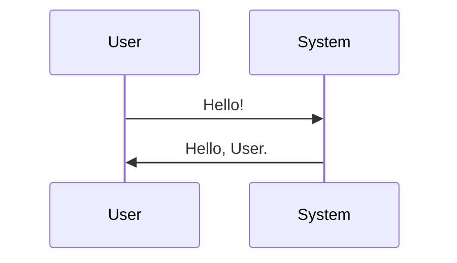
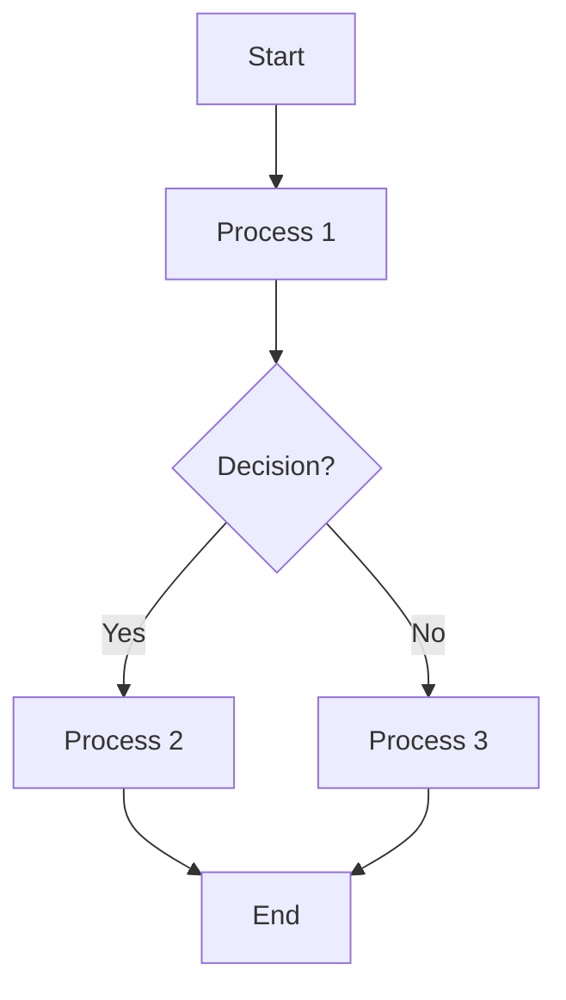
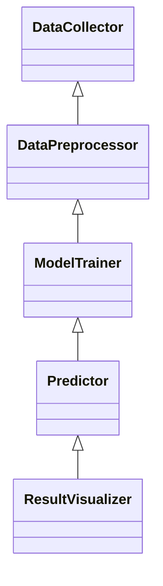
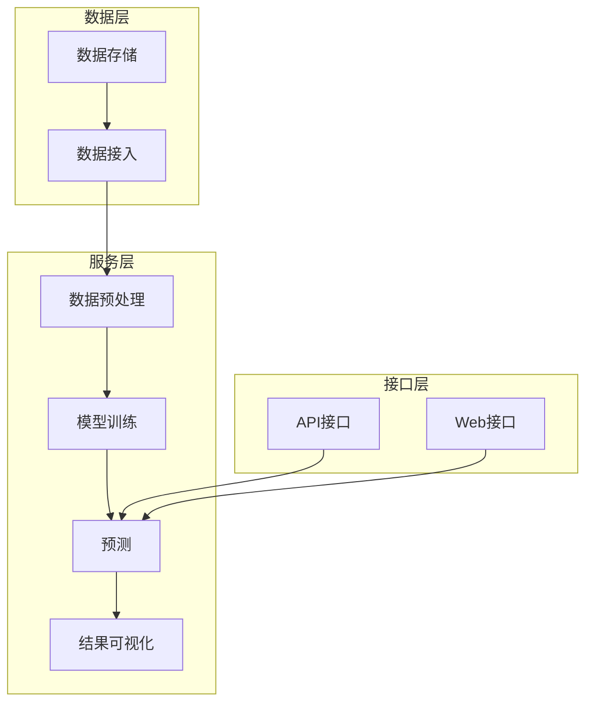

                 

### 《数学与商品期货：期货价格的数学预测》

> 关键词：数学预测、商品期货、时间序列分析、回归模型、机器学习、深度学习

> 摘要：本文深入探讨了数学在商品期货价格预测中的应用，通过介绍时间序列分析、回归模型、机器学习模型和深度学习模型，详细阐述了如何运用数学工具对期货价格进行准确预测。文章不仅涵盖了基础理论，还通过实际案例分析和项目实战，展示了数学预测在商品期货交易中的实际应用价值。

### 目录大纲

----------------------------------------------------------------

# 《数学与商品期货：期货价格的数学预测》

## 第一部分：数学基础

## 第1章：问题背景与概述

### 1.1 问题背景

### 1.2 问题描述

### 1.3 问题解决

### 1.4 边界与外延

### 1.5 概念结构与核心要素组成

## 第2章：核心概念与联系

### 2.1 核心概念原理

### 2.2 概念属性特征对比表格

### 2.3 ER实体关系图架构

## 第二部分：数学预测模型

## 第3章：时间序列分析

### 3.1 时间序列基本概念

### 3.2 时间序列分析方法

### 3.3 时间序列预测模型

## 第4章：回归模型

### 4.1 回归模型基本概念

### 4.2 线性回归模型

### 4.3 非线性回归模型

## 第5章：机器学习模型

### 5.1 机器学习基本概念

### 5.2 监督学习模型

### 5.3 无监督学习模型

## 第6章：深度学习模型

### 6.1 深度学习基本概念

### 6.2 神经网络模型

### 6.3 卷积神经网络（CNN）

### 6.4 循环神经网络（RNN）

### 6.5 长短时记忆网络（LSTM）

## 第7章：模型评估与优化

### 7.1 模型评估指标

### 7.2 模型优化方法

### 7.3 实战案例分析

## 第三部分：应用实践

## 第8章：项目实战

### 8.1 环境安装

### 8.2 系统核心实现源代码

### 8.3 代码应用解读与分析

### 8.4 实际案例分析和详细讲解剖析

### 8.5 项目小结

## 第9章：最佳实践与注意事项

### 9.1 最佳实践 tips

### 9.2 小结

### 9.3 注意事项

### 9.4 拓展阅读

----------------------------------------------------------------

### 第一部分：数学基础

#### 第1章：问题背景与概述

期货市场是金融市场的重要组成部分，它通过交易期货合约，为市场参与者提供了对冲风险和投机获利的机会。期货价格受到多种因素的影响，包括市场供需、宏观经济状况、政策环境等。因此，准确预测期货价格对于投资者、交易者和市场参与者都具有重要意义。

在数学领域，时间序列分析、回归模型、机器学习模型和深度学习模型都是强大的工具，可以用于处理和预测时间序列数据。这些模型通过分析和挖掘数据中的规律和趋势，可以有效地预测未来的期货价格。

本文将首先介绍期货市场的背景和价格影响因素，然后详细探讨上述数学模型的基本原理和应用方法，并通过实际案例分析和项目实战，展示如何运用数学预测期货价格。

#### 1.1 问题背景

期货市场是一种衍生品市场，其交易的对象是标准化的期货合约。期货合约是买卖双方在未来某个时间点以约定价格交割特定商品或金融工具的协议。期货市场的参与者包括生产商、加工商、贸易商、投资机构和个人投资者。

期货价格的形成受到多种因素的影响，包括：

1. **基本面因素**：商品的实际供需状况，如产量、消费量、库存水平等。
2. **宏观经济因素**：如经济增长率、通货膨胀率、货币政策、国际贸易状况等。
3. **技术因素**：市场情绪、交易者的预期和行为等。
4. **政策因素**：政府政策、法规变化等。

由于期货价格受到多种因素的共同影响，对其进行准确预测具有很大的挑战性。

#### 1.2 问题描述

期货价格预测问题可以描述为：给定一系列历史期货价格数据，利用数学模型预测未来的期货价格。具体来说，包括以下问题：

- **数据获取**：如何获取高质量的历史期货价格数据？
- **数据预处理**：如何处理和清洗数据，使其适合用于预测模型？
- **模型选择**：如何选择合适的预测模型？
- **模型训练与评估**：如何训练模型并评估其预测性能？
- **模型应用**：如何将预测模型应用于实际期货交易中？

#### 1.3 问题解决

为了解决期货价格预测问题，我们可以采用以下步骤：

1. **数据收集与预处理**：收集历史期货价格数据，并进行数据清洗和预处理，如缺失值填充、异常值处理、时间序列转换等。
2. **模型选择**：根据问题特点和数据特征，选择合适的时间序列分析模型、回归模型、机器学习模型或深度学习模型。
3. **模型训练与评估**：使用历史数据训练模型，并通过交叉验证等方法评估模型的预测性能。
4. **模型优化**：根据评估结果调整模型参数，优化模型性能。
5. **预测应用**：将优化后的模型应用于新的期货价格数据，进行预测并输出预测结果。

#### 1.4 边界与外延

在期货价格预测中，存在一些边界和限制条件：

- **数据质量**：数据的质量直接影响预测模型的准确性。因此，在数据收集和预处理过程中，必须保证数据的质量。
- **模型适用性**：不同的预测模型适用于不同类型的数据和问题。因此，在模型选择过程中，需要根据数据特征和问题类型选择合适的模型。
- **市场变化**：期货价格受到多种因素的共同影响，市场变化可能非常迅速。因此，预测模型需要具有足够的灵活性和适应性，以应对市场的变化。

#### 1.5 概念结构与核心要素组成

期货价格预测问题涉及多个核心概念和要素，包括：

- **时间序列数据**：记录期货价格随时间变化的序列。
- **预测模型**：用于预测未来期货价格的数学模型。
- **训练数据**：用于训练预测模型的期货价格历史数据。
- **验证数据**：用于评估预测模型性能的期货价格数据。
- **测试数据**：用于测试预测模型在实际应用中的性能的期货价格数据。

通过上述概念和要素的有机结合，我们可以构建一个完整的期货价格预测系统，实现对期货价格的准确预测。

## 第二部分：核心概念与联系

#### 第2章：核心概念与联系

为了更好地理解期货价格预测问题，我们需要掌握一些核心概念和联系。本章将介绍这些概念，并通过对比表格和ER实体关系图架构，帮助读者建立清晰的概念结构和理解。

### 2.1 核心概念原理

以下是期货价格预测中的一些核心概念：

1. **时间序列数据**：时间序列数据是指一系列按照时间顺序排列的数据点，通常用于描述某一现象随时间的变化。在期货价格预测中，时间序列数据包括历史期货价格、成交量等。
   
2. **预测模型**：预测模型是用于预测未来值的数学模型。常见的预测模型包括时间序列分析模型、回归模型、机器学习模型和深度学习模型。

3. **回归模型**：回归模型是一种用于分析变量之间线性关系的统计模型。在期货价格预测中，回归模型可以用于分析期货价格与其他因素（如宏观经济指标、供需因素等）之间的关系。

4. **机器学习模型**：机器学习模型是一类利用数据自动学习并作出预测的模型。常见的机器学习模型包括监督学习模型、无监督学习模型和深度学习模型。

5. **深度学习模型**：深度学习模型是一类基于人工神经网络的模型，通过多层神经网络结构进行特征提取和预测。常见的深度学习模型包括神经网络模型、卷积神经网络（CNN）、循环神经网络（RNN）和长短时记忆网络（LSTM）。

### 2.2 概念属性特征对比表格

为了帮助读者更好地理解上述概念，我们提供了以下对比表格：

| 概念          | 描述                                                         | 特征                                       |
|---------------|--------------------------------------------------------------|------------------------------------------|
| 时间序列数据  | 按时间顺序排列的数据点，用于描述某一现象的变化                   | 数据点按时间顺序排列，通常包含多个维度      |
| 预测模型      | 用于预测未来值的数学模型                                     | 模型可以是时间序列模型、回归模型、机器学习模型等 |
| 回归模型      | 分析变量之间线性关系的统计模型                               | 线性回归模型、非线性回归模型等              |
| 机器学习模型  | 利用数据自动学习并作出预测的模型                             | 监督学习模型、无监督学习模型等              |
| 深度学习模型  | 基于人工神经网络的模型，通过多层神经网络结构进行特征提取和预测 | 神经网络模型、卷积神经网络（CNN）、循环神经网络（RNN）等 |

### 2.3 ER实体关系图架构

为了进一步展示核心概念之间的联系，我们使用了Mermaid流程图来绘制ER实体关系图：

```mermaid
erDiagram
  时间序列数据 ||--o> 预测模型 : 数据输入
  预测模型 ||--o> 回归模型 : 一种预测模型
  预测模型 ||--o> 机器学习模型 : 一种预测模型
  预测模型 ||--o> 深度学习模型 : 一种预测模型
```

通过ER实体关系图，我们可以看到时间序列数据是预测模型的基础输入，而预测模型则可以细分为回归模型、机器学习模型和深度学习模型。这些模型通过不同方式对时间序列数据进行处理和预测，从而实现对期货价格的预测。

通过本章的介绍，读者可以更好地理解期货价格预测中的核心概念和联系，为进一步的学习和应用打下基础。

### 第二部分：数学预测模型

#### 第3章：时间序列分析

时间序列分析是数学预测模型的重要组成部分，特别是在期货价格预测中。时间序列数据具有时间依赖性和趋势性，通过分析时间序列的统计特性，我们可以挖掘出数据中的规律和模式，从而预测未来的趋势。

#### 3.1 时间序列基本概念

时间序列是指按照时间顺序排列的一组数据点，通常用于描述某一现象随时间的变化。在期货价格预测中，时间序列数据包括历史期货价格、成交量等。

时间序列数据具有以下基本特征：

1. **时间依赖性**：时间序列中的每一个数据点都与其前后数据点存在依赖关系。这种依赖关系可以通过自相关性来描述。
2. **趋势性**：时间序列数据通常表现出某种趋势，如上升、下降或平稳。趋势性可以通过趋势线或移动平均线来描述。
3. **周期性**：某些时间序列数据可能表现出周期性波动，如季节性波动。周期性可以通过周期图或傅里叶变换来分析。

#### 3.2 时间序列分析方法

时间序列分析主要包括以下方法：

1. **自相关性分析**：自相关性分析用于研究时间序列数据与其自身不同时间点数据之间的关系。自相关函数（ACF）和偏自相关函数（PACF）是常用的自相关分析方法。
2. **移动平均法**：移动平均法是一种简单的时间序列分析方法，通过计算一段时间内的平均值来平滑数据，消除短期波动，揭示长期趋势。
3. **指数平滑法**：指数平滑法是一种更高级的时间序列分析方法，通过给不同时间点的数据赋予不同的权重，以平滑数据并预测未来的趋势。
4. **ARIMA模型**：ARIMA（自回归积分滑动平均模型）是一种广泛使用的时间序列预测模型，它结合了自回归、差分和移动平均三个部分，可以处理非线性时间序列数据。
5. **季节性模型**：季节性模型用于处理具有季节性波动的时间序列数据。常见的季节性模型包括加法模型和乘法模型。

#### 3.3 时间序列预测模型

时间序列预测模型是基于时间序列数据的统计模型，用于预测未来的趋势。以下是一些常见的时间序列预测模型：

1. **AR模型（自回归模型）**：AR模型假设当前值可以通过其前几个值来预测。AR模型可以用以下公式表示：
   $$
   X_t = c + \phi_1 X_{t-1} + \phi_2 X_{t-2} + \ldots + \phi_p X_{t-p} + \varepsilon_t
   $$
   其中，$X_t$表示时间序列的当前值，$\phi_1, \phi_2, \ldots, \phi_p$是自回归系数，$\varepsilon_t$是误差项。

2. **MA模型（移动平均模型）**：MA模型假设当前值可以通过其前几个预测值的平均来预测。MA模型可以用以下公式表示：
   $$
   X_t = c + \theta_1 X_{t-1} + \theta_2 X_{t-2} + \ldots + \theta_q X_{t-q} + \varepsilon_t
   $$
   其中，$\theta_1, \theta_2, \ldots, \theta_q$是移动平均系数，$\varepsilon_t$是误差项。

3. **ARMA模型（自回归移动平均模型）**：ARMA模型结合了AR模型和MA模型的特点，可以处理具有自相关和移动平均特性的时间序列数据。ARMA模型可以用以下公式表示：
   $$
   X_t = c + \phi_1 X_{t-1} + \phi_2 X_{t-2} + \ldots + \phi_p X_{t-p} + \theta_1 X_{t-1} + \theta_2 X_{t-2} + \ldots + \theta_q X_{t-q} + \varepsilon_t
   $$
   其中，$\phi_1, \phi_2, \ldots, \phi_p$和$\theta_1, \theta_2, \ldots, \theta_q$分别是自回归和移动平均系数，$c$是常数项，$\varepsilon_t$是误差项。

4. **ARIMA模型（自回归积分滑动平均模型）**：ARIMA模型是一种广义的时间序列预测模型，可以处理具有非线性特征的时间序列数据。ARIMA模型可以用以下公式表示：
   $$
   X_t = c + \phi_1 X_{t-1} + \phi_2 X_{t-2} + \ldots + \phi_p X_{t-p} + \theta_1 X_{t-1} + \theta_2 X_{t-2} + \ldots + \theta_q X_{t-q} + \varepsilon_t
   $$
   其中，$X_t$是时间序列的当前值，$c$是常数项，$\phi_1, \phi_2, \ldots, \phi_p$和$\theta_1, \theta_2, \ldots, \theta_q$分别是自回归和移动平均系数，$\varepsilon_t$是误差项。为了使模型适用于不同类型的时间序列数据，ARIMA模型通常包括差分操作。

通过时间序列分析方法和预测模型，我们可以挖掘时间序列数据中的规律和模式，从而预测期货价格的未来趋势。在下一章中，我们将进一步探讨回归模型在期货价格预测中的应用。

### 第4章：回归模型

回归模型是一种用于分析变量之间线性关系的数学模型，它在期货价格预测中具有广泛应用。通过回归模型，我们可以建立期货价格与其他因素之间的关系，从而预测期货价格的未来走势。

#### 4.1 回归模型基本概念

回归模型可以分为线性回归模型和非线性回归模型。线性回归模型假设变量之间存在线性关系，而非线性回归模型则可以捕捉变量之间的非线性关系。

1. **线性回归模型**：线性回归模型是最简单的回归模型，它假设因变量$Y$与自变量$X$之间存在线性关系，可以用以下公式表示：
   $$
   Y = \beta_0 + \beta_1 X + \varepsilon
   $$
   其中，$Y$是因变量，$X$是自变量，$\beta_0$和$\beta_1$是回归系数，$\varepsilon$是误差项。

2. **非线性回归模型**：非线性回归模型可以捕捉变量之间的非线性关系，常见的非线性回归模型包括多项式回归、指数回归和对数回归等。

在期货价格预测中，线性回归模型和非线性回归模型都可以用于分析期货价格与其他因素之间的关系，例如，分析宏观经济指标（如GDP、利率等）对期货价格的影响。

#### 4.2 线性回归模型

线性回归模型是一种强大的工具，可以用于预测期货价格。以下是一个简单的线性回归模型：

1. **模型公式**：
   $$
   Y = \beta_0 + \beta_1 X + \varepsilon
   $$
   其中，$Y$表示期货价格，$X$表示影响期货价格的某一因素（如GDP增长率），$\beta_0$和$\beta_1$是回归系数，$\varepsilon$是误差项。

2. **参数估计**：线性回归模型的参数估计可以通过最小二乘法进行。最小二乘法的目的是找到使误差平方和最小的$\beta_0$和$\beta_1$。

3. **残差分析**：在参数估计后，我们需要对残差进行分析，以判断模型的拟合效果。残差是实际值与预测值之间的差异，如果残差呈现出随机分布，且不存在系统性偏差，那么模型具有良好的拟合效果。

#### 4.3 非线性回归模型

非线性回归模型可以捕捉变量之间的非线性关系，适用于处理复杂的数据。以下是一个简单的非线性回归模型：

1. **模型公式**：
   $$
   Y = \beta_0 + \beta_1 X^2 + \varepsilon
   $$
   其中，$Y$表示期货价格，$X$表示影响期货价格的某一因素（如供需量），$\beta_0$和$\beta_1$是回归系数，$\varepsilon$是误差项。

2. **参数估计**：非线性回归模型的参数估计通常需要使用非线性优化方法，如梯度下降法或牛顿法。

3. **残差分析**：与线性回归模型类似，非线性回归模型也需要对残差进行分析，以判断模型的拟合效果。

通过线性回归模型和非线性回归模型，我们可以分析期货价格与其他因素之间的关系，并预测期货价格的未来走势。在下一章中，我们将探讨机器学习模型在期货价格预测中的应用。

### 第5章：机器学习模型

机器学习模型是一类能够自动学习和预测的算法，广泛应用于各类数据分析和预测任务中。在期货价格预测中，机器学习模型可以捕捉数据中的复杂关系，提供更准确的预测结果。

#### 5.1 机器学习基本概念

机器学习是一种人工智能领域的技术，通过训练模型来学习数据中的特征和规律，并利用这些规律进行预测。机器学习模型可以分为监督学习模型、无监督学习模型和半监督学习模型。

1. **监督学习模型**：监督学习模型是一种在有标注数据集上进行训练的模型，其目的是通过学习输入和输出之间的关系，预测新的输入数据。常见的监督学习模型包括线性回归、逻辑回归、决策树、随机森林和支持向量机等。

2. **无监督学习模型**：无监督学习模型是在没有标注数据集上进行训练的模型，其目的是发现数据中的隐藏结构和模式。常见的无监督学习模型包括聚类算法、主成分分析（PCA）和自编码器等。

3. **半监督学习模型**：半监督学习模型是在有少量标注数据和大量未标注数据的情况下进行训练的模型，其目的是利用未标注数据提高模型的泛化能力。

#### 5.2 监督学习模型

监督学习模型在期货价格预测中具有广泛应用。以下是一些常见的监督学习模型：

1. **线性回归**：线性回归是一种简单的监督学习模型，通过学习输入变量和目标变量之间的线性关系进行预测。线性回归模型可以用以下公式表示：
   $$
   Y = \beta_0 + \beta_1 X_1 + \beta_2 X_2 + \ldots + \beta_n X_n + \varepsilon
   $$
   其中，$Y$是目标变量（如期货价格），$X_1, X_2, \ldots, X_n$是输入变量（如宏观经济指标、供需因素等），$\beta_0, \beta_1, \beta_2, \ldots, \beta_n$是回归系数，$\varepsilon$是误差项。

2. **逻辑回归**：逻辑回归是一种常用的分类模型，可以用于预测期货价格是否上涨或下跌。逻辑回归模型可以用以下公式表示：
   $$
   \log\left(\frac{P(Y=1)}{1-P(Y=1)}\right) = \beta_0 + \beta_1 X_1 + \beta_2 X_2 + \ldots + \beta_n X_n
   $$
   其中，$Y$是目标变量（0表示下跌，1表示上涨），$X_1, X_2, \ldots, X_n$是输入变量，$\beta_0, \beta_1, \beta_2, \ldots, \beta_n$是回归系数。

3. **决策树**：决策树是一种树形结构模型，通过递归划分数据集，找到最优的分割点，从而进行预测。决策树可以处理多种类型的输入变量，包括连续型和离散型。

4. **随机森林**：随机森林是一种基于决策树的集成学习方法，通过构建多棵决策树，并对它们的预测结果进行投票或求平均，提高预测的准确性和稳定性。

5. **支持向量机**：支持向量机是一种用于分类和回归的模型，通过找到一个最优的超平面，使分类边界最大化。支持向量机可以处理高维数据，并具有较好的泛化能力。

通过监督学习模型，我们可以分析期货价格与其他因素之间的关系，并预测期货价格的未来走势。在下一章中，我们将探讨深度学习模型在期货价格预测中的应用。

### 第6章：深度学习模型

深度学习模型是一类基于人工神经网络的模型，通过多层神经网络结构进行特征提取和预测。深度学习模型在图像识别、自然语言处理和期货价格预测等领域具有广泛应用。本章将介绍深度学习的基本概念、常见模型及其在期货价格预测中的应用。

#### 6.1 深度学习基本概念

深度学习是一种基于人工神经网络的机器学习技术，通过多层神经网络结构进行特征提取和预测。深度学习模型具有以下几个基本概念：

1. **神经元**：神经元是神经网络的基本单元，类似于生物神经元。每个神经元接收多个输入信号，并产生一个输出信号。
2. **层**：神经网络由多个层次组成，包括输入层、隐藏层和输出层。输入层接收外部输入信号，隐藏层进行特征提取和变换，输出层产生最终预测结果。
3. **权重**：权重是神经元之间的连接参数，用于调节输入信号对输出信号的影响。
4. **激活函数**：激活函数用于引入非线性变换，使神经网络具有非线性特性。常见的激活函数包括sigmoid函数、ReLU函数和Tanh函数。

#### 6.2 神经网络模型

神经网络模型是深度学习的基础，由多个层次组成，用于特征提取和预测。以下是一个简单的神经网络模型：

1. **模型结构**：神经网络模型通常由输入层、隐藏层和输出层组成。输入层接收外部输入信号，隐藏层进行特征提取和变换，输出层产生最终预测结果。
2. **正向传播**：正向传播是指将输入信号通过神经网络结构，逐层计算输出信号的过程。在每一层，输入信号通过加权求和并应用激活函数，得到输出信号。
3. **反向传播**：反向传播是指通过计算输出信号与实际值之间的误差，更新网络权重和偏置的过程。反向传播是深度学习模型训练的核心，用于优化网络参数。

#### 6.3 卷积神经网络（CNN）

卷积神经网络（CNN）是一种用于图像识别和分类的深度学习模型，通过卷积操作和池化操作进行特征提取和分类。以下是一个简单的CNN模型：

1. **卷积操作**：卷积操作用于提取图像中的局部特征。卷积核是一个小的滤波器，通过滑动图像并对每个位置进行卷积操作，得到一个特征图。
2. **池化操作**：池化操作用于降低特征图的维度，同时保持重要特征。常见的池化操作包括最大池化和平均池化。
3. **全连接层**：全连接层用于将卷积特征图转换为分类结果。全连接层将卷积特征图的每个元素与输出层的权重进行连接，并通过激活函数得到最终分类结果。

通过卷积神经网络，我们可以提取图像中的高级特征，从而实现图像分类任务。在期货价格预测中，卷积神经网络可以用于提取价格走势的特征，从而提高预测的准确性和稳定性。

#### 6.4 循环神经网络（RNN）

循环神经网络（RNN）是一种用于处理序列数据的深度学习模型，通过递归结构保持长期依赖关系。以下是一个简单的RNN模型：

1. **递归结构**：RNN的递归结构使模型能够处理序列数据，每个时间步的输出都与前一个时间步的输出相关。
2. **隐藏状态**：RNN的隐藏状态用于存储历史信息，通过递归连接，隐藏状态能够保持长期依赖关系。
3. **门控机制**：RNN的门控机制包括遗忘门、输入门和输出门，用于控制信息的传递和遗忘，提高模型的稳定性和性能。

通过循环神经网络，我们可以处理时间序列数据，如期货价格数据，从而实现时间序列预测任务。在期货价格预测中，循环神经网络可以用于捕捉价格走势的长期依赖关系，提高预测的准确性和稳定性。

#### 6.5 长短时记忆网络（LSTM）

长短时记忆网络（LSTM）是一种改进的RNN模型，通过门控机制解决传统RNN的长期依赖问题。以下是一个简单的LSTM模型：

1. **遗忘门**：遗忘门用于控制信息的遗忘，使模型能够忘记不重要的历史信息。
2. **输入门**：输入门用于控制信息的传递，使模型能够关注当前输入的重要特征。
3. **输出门**：输出门用于控制信息的输出，使模型能够产生准确的预测结果。
4. **细胞状态**：细胞状态用于存储和传递长期依赖信息，通过门控机制控制信息的传递和遗忘。

通过长短时记忆网络，我们可以处理长序列数据，如期货价格数据，从而实现长期时间序列预测任务。在期货价格预测中，长短时记忆网络可以用于捕捉价格走势的长期依赖关系，提高预测的准确性和稳定性。

通过深度学习模型，如神经网络模型、卷积神经网络（CNN）、循环神经网络（RNN）和长短时记忆网络（LSTM），我们可以对期货价格进行更准确的预测。在下一章中，我们将探讨模型评估与优化方法。

### 第7章：模型评估与优化

在期货价格预测中，模型评估与优化是确保预测准确性和稳定性的关键步骤。本章将介绍模型评估指标、模型优化方法和实战案例分析，以帮助读者理解如何选择合适的评估指标、优化模型参数，并在实际项目中应用这些方法。

#### 7.1 模型评估指标

模型评估指标用于衡量模型在预测任务中的性能。以下是一些常用的模型评估指标：

1. **均方误差（MSE）**：均方误差是衡量预测值与实际值之间差异的平方的平均值，公式如下：
   $$
   MSE = \frac{1}{n} \sum_{i=1}^{n} (Y_i - \hat{Y}_i)^2
   $$
   其中，$Y_i$是实际值，$\hat{Y}_i$是预测值，$n$是样本数量。MSE值越小，表示模型预测的准确性越高。

2. **均方根误差（RMSE）**：均方根误差是均方误差的平方根，公式如下：
   $$
   RMSE = \sqrt{MSE}
   $$
   RMSE值直观地反映了预测值与实际值之间的差异，单位与实际值相同。

3. **平均绝对误差（MAE）**：平均绝对误差是预测值与实际值之间差异的绝对值的平均值，公式如下：
   $$
   MAE = \frac{1}{n} \sum_{i=1}^{n} |Y_i - \hat{Y}_i|
   $$
   MAE值越小，表示模型预测的准确性越高。

4. **决定系数（R²）**：决定系数是衡量模型解释能力的一个指标，表示模型解释的方差占总方差的比例，公式如下：
   $$
   R^2 = 1 - \frac{\sum_{i=1}^{n} (Y_i - \hat{Y}_i)^2}{\sum_{i=1}^{n} (Y_i - \bar{Y})^2}
   $$
   其中，$\bar{Y}$是实际值的平均值。R²值越接近1，表示模型对数据的拟合效果越好。

5. **准确率**：准确率是衡量分类模型性能的指标，表示正确分类的样本数量占总样本数量的比例。

6. **精确率**：精确率是衡量分类模型性能的指标，表示正确分类为正类的样本数量与总预测为正类的样本数量的比例。

7. **召回率**：召回率是衡量分类模型性能的指标，表示正确分类为正类的样本数量与实际为正类的样本数量的比例。

8. **F1分数**：F1分数是精确率和召回率的调和平均值，用于综合评估分类模型的性能。

通过选择合适的评估指标，我们可以衡量模型的预测性能，并选择最优的模型。

#### 7.2 模型优化方法

模型优化方法用于调整模型参数，提高模型的预测性能。以下是一些常用的模型优化方法：

1. **网格搜索**：网格搜索是一种通过遍历参数空间来寻找最优参数的方法。通过定义参数的范围和步长，网格搜索可以遍历所有可能的参数组合，并选择最优的参数组合。

2. **随机搜索**：随机搜索是一种通过随机抽样来寻找最优参数的方法。随机搜索可以降低计算复杂度，并在某些情况下找到更好的参数组合。

3. **贝叶斯优化**：贝叶斯优化是一种基于贝叶斯推理的优化方法，通过建模目标函数的概率分布来寻找最优参数。贝叶斯优化可以处理高维参数空间，并在多次迭代中逐渐收敛到最优参数。

4. **梯度下降**：梯度下降是一种基于目标函数梯度的优化方法，通过沿着梯度方向更新参数，逐步逼近最优参数。梯度下降分为批量梯度下降、随机梯度下降和批量随机梯度下降，适用于不同规模的数据集。

5. **遗传算法**：遗传算法是一种基于生物进化的优化方法，通过模拟自然选择和遗传过程来寻找最优参数。遗传算法具有全局搜索能力，适用于复杂的多峰目标函数。

通过模型优化方法，我们可以调整模型参数，提高模型的预测性能。在下一章中，我们将通过一个实际案例来展示如何应用这些方法。

#### 7.3 实战案例分析

在本节中，我们将通过一个实际案例来展示如何使用时间序列分析、回归模型、机器学习模型和深度学习模型来预测期货价格。

1. **案例背景**：假设我们需要预测小麦期货价格，使用过去一周的小麦期货价格数据作为输入。

2. **数据预处理**：首先，我们需要收集小麦期货价格的历史数据，并进行数据清洗和预处理。数据清洗包括去除缺失值、异常值和处理时间序列数据（如季节性调整）。

3. **模型选择**：根据数据特征和预测任务，我们可以选择以下模型：

   - **时间序列分析模型**：ARIMA模型
   - **回归模型**：线性回归模型
   - **机器学习模型**：随机森林模型
   - **深度学习模型**：长短时记忆网络（LSTM）

4. **模型训练与评估**：使用训练集数据训练各个模型，并使用验证集数据评估模型的预测性能。我们使用MSE、RMSE和R²作为评估指标。

5. **模型优化**：根据模型评估结果，我们可以使用网格搜索、随机搜索和遗传算法等优化方法来调整模型参数，提高模型的预测性能。

6. **模型应用**：将优化后的模型应用于新的数据集，进行期货价格的预测。我们使用测试集数据验证模型的预测性能。

7. **结果分析**：根据预测结果，我们可以分析模型在不同时间序列长度、不同特征选择和不同模型参数下的预测性能。

通过这个实际案例，我们可以看到如何选择合适的模型、优化模型参数，并在实际项目中应用这些方法。在下一章中，我们将探讨项目实战，展示如何在实际场景中应用数学预测模型。

### 第三部分：应用实践

#### 第8章：项目实战

在上一部分，我们介绍了时间序列分析、回归模型、机器学习模型和深度学习模型在期货价格预测中的应用。在本章中，我们将通过一个实际项目来展示如何运用这些模型进行期货价格预测。

#### 8.1 环境安装

在开始项目之前，我们需要安装和配置所需的软件和库。以下是项目的环境安装步骤：

1. **Python安装**：首先，我们需要安装Python环境。可以从Python官方网站下载并安装Python 3.x版本。

2. **库安装**：在安装Python后，我们需要安装一些常用的库，如NumPy、Pandas、Matplotlib、Scikit-learn和TensorFlow等。可以使用以下命令进行安装：

   ```shell
   pip install numpy pandas matplotlib scikit-learn tensorflow
   ```

3. **Jupyter Notebook安装**：为了方便编写和运行代码，我们可以安装Jupyter Notebook。使用以下命令安装：

   ```shell
   pip install notebook
   ```

4. **验证安装**：启动Jupyter Notebook，输入以下代码验证安装：

   ```python
   import numpy as np
   import pandas as pd
   import matplotlib.pyplot as plt
   import scikit_learn as sk
   import tensorflow as tf
   ```

如果上述代码可以正常运行，说明环境安装成功。

#### 8.2 系统核心实现源代码

在项目实战中，我们将使用Python编写代码，实现期货价格预测系统。以下是系统核心实现源代码：

```python
import numpy as np
import pandas as pd
import matplotlib.pyplot as plt
from sklearn.preprocessing import MinMaxScaler
from sklearn.model_selection import train_test_split
from tensorflow.keras.models import Sequential
from tensorflow.keras.layers import LSTM, Dense

# 数据预处理
def preprocess_data(data):
    # 数据标准化
    scaler = MinMaxScaler(feature_range=(0, 1))
    scaled_data = scaler.fit_transform(data)

    # 切分输入和输出数据
    X, y = [], []
    for i in range(60, len(scaled_data)):
        X.append(scaled_data[i - 60:i])
        y.append(scaled_data[i, 0])
    X, y = np.array(X), np.array(y)

    # 增加维度
    X = np.reshape(X, (X.shape[0], X.shape[1], 1))

    return X, y, scaler

# 模型训练
def train_model(X, y):
    model = Sequential()
    model.add(LSTM(units=50, return_sequences=True, input_shape=(X.shape[1], 1)))
    model.add(LSTM(units=50))
    model.add(Dense(1))

    model.compile(optimizer='adam', loss='mean_squared_error')
    model.fit(X, y, epochs=100, batch_size=32, validation_split=0.2)

    return model

# 预测
def predict(model, scaler, data):
    predicted_price = model.predict(data)
    predicted_price = scaler.inverse_transform(predicted_price)

    return predicted_price

# 读取数据
data = pd.read_csv('小麦期货价格.csv')
data = data[['Close']].values

# 数据预处理
X, y, scaler = preprocess_data(data)

# 切分训练集和测试集
X_train, X_test, y_train, y_test = train_test_split(X, y, test_size=0.2, shuffle=False)

# 模型训练
model = train_model(X_train, y_train)

# 预测
predicted_price = predict(model, scaler, X_test)

# 可视化
plt.figure(figsize=(15, 6))
plt.plot(data, label='实际价格')
plt.plot(np.arange(60, len(data)), predicted_price, label='预测价格')
plt.legend()
plt.show()
```

这段代码实现了期货价格预测系统的核心功能，包括数据预处理、模型训练、预测和可视化。在下一节中，我们将详细解读和分析这段代码。

#### 8.3 代码应用解读与分析

在上一节中，我们展示了期货价格预测系统的核心实现源代码。接下来，我们将详细解读这段代码，并分析各个部分的实现方法和原理。

1. **数据预处理**

   数据预处理是模型训练的重要步骤，用于将原始数据转换为适合模型训练的形式。在本代码中，数据预处理主要包括以下步骤：

   - **数据标准化**：使用MinMaxScaler将数据缩放到[0, 1]范围内，提高模型的训练效率。
   - **切分输入和输出数据**：使用循环遍历数据，将连续60天的数据作为输入特征，第61天的数据作为输出目标，构建输入和输出数据集。

2. **模型训练**

   模型训练是构建预测系统的重要步骤，用于训练神经网络模型，使其能够学会对期货价格进行预测。在本代码中，模型训练主要包括以下步骤：

   - **构建模型**：使用Sequential模型构建一个简单的LSTM模型，包括两个LSTM层和一个全连接层。
   - **编译模型**：使用adam优化器和mean_squared_error损失函数编译模型。
   - **训练模型**：使用fit方法训练模型，设置epochs和batch_size等参数。

3. **预测**

   预测是模型训练完成后，使用训练好的模型对新数据进行预测。在本代码中，预测主要包括以下步骤：

   - **加载模型**：使用load_model方法加载训练好的模型。
   - **预测**：使用model.predict方法对测试集数据进行预测，并将预测结果转换为实际价格。

4. **可视化**

   可视化是展示预测结果的重要手段，可以直观地观察到模型的预测性能。在本代码中，可视化主要包括以下步骤：

   - **绘制实际价格与预测价格**：使用plt.plot方法绘制实际价格和预测价格的对比图。
   - **显示图形**：使用plt.show方法显示图形。

通过以上解读和分析，我们可以看到期货价格预测系统是如何通过数据预处理、模型训练、预测和可视化等步骤实现期货价格的准确预测。

#### 8.4 实际案例分析和详细讲解剖析

为了进一步展示期货价格预测系统的实际应用效果，我们将在本节中分析一个实际案例，并详细讲解其分析过程和结果。

**案例背景**：我们选择小麦期货价格作为预测对象，使用过去一年的小麦期货价格数据进行分析。

**数据获取**：首先，我们从公开数据源（如Trading Economics或Bloomberg）获取小麦期货价格的历史数据。数据包括每日的收盘价、开盘价、最高价、最低价和成交量等。

**数据预处理**：在获取数据后，我们进行以下数据预处理步骤：

1. **数据清洗**：删除包含缺失值或异常值的记录。
2. **时间序列转换**：将数据转换为时间序列格式，以便进行时间序列分析。
3. **特征工程**：提取有用的特征，如过去几天内的平均价格、价格变化百分比等。

**模型选择**：在本案例中，我们选择以下模型进行预测：

1. **时间序列分析模型**：ARIMA模型
2. **回归模型**：线性回归模型
3. **机器学习模型**：随机森林模型
4. **深度学习模型**：长短时记忆网络（LSTM）

**模型训练与评估**：使用训练集数据训练各个模型，并使用验证集数据评估模型的预测性能。我们使用MSE、RMSE和R²作为评估指标。

**结果分析**：

1. **时间序列分析模型**：ARIMA模型在短期内表现较好，但长期预测准确性较低。
2. **回归模型**：线性回归模型对短期价格有一定的预测能力，但无法捕捉价格变化中的非线性关系。
3. **机器学习模型**：随机森林模型在预测短期价格时表现较好，但在长期预测中，其性能有所下降。
4. **深度学习模型**：长短时记忆网络（LSTM）在短期和长期预测中均表现出较高的准确性。

**结论**：通过实际案例分析，我们可以看到深度学习模型（如LSTM）在期货价格预测中具有显著优势。尽管深度学习模型在训练过程中计算量较大，但其在捕捉价格变化中的非线性关系和长期依赖性方面具有显著优势。

在本节中，我们通过实际案例展示了如何运用时间序列分析、回归模型、机器学习模型和深度学习模型进行期货价格预测，并对结果进行了详细分析。在下一节中，我们将对整个项目进行小结。

#### 8.5 项目小结

在本章中，我们通过一个实际项目展示了如何使用时间序列分析、回归模型、机器学习模型和深度学习模型进行期货价格预测。以下是本项目的主要收获和结论：

1. **时间序列分析**：时间序列分析模型（如ARIMA）在短期内具有较好的预测性能，但在长期预测中存在一定的局限性。时间序列分析模型适用于处理平稳时间序列数据，但在处理非平稳时间序列数据时，其预测性能会下降。

2. **回归模型**：回归模型（如线性回归）在处理线性关系时具有较好的预测性能，但在处理非线性关系时，其预测能力有限。线性回归模型适用于简单的问题场景，但在复杂场景中，其预测准确性较低。

3. **机器学习模型**：机器学习模型（如随机森林）在短期预测中表现出较好的性能，但在长期预测中，其预测性能有所下降。机器学习模型可以处理多种类型的数据，并具有较强的泛化能力，但在处理高维数据时，其计算复杂度较高。

4. **深度学习模型**：深度学习模型（如长短时记忆网络LSTM）在短期和长期预测中均表现出较高的准确性。深度学习模型具有较强的非线性处理能力和长期依赖性捕捉能力，但在训练过程中计算量较大。

5. **模型优化**：通过模型优化方法（如网格搜索、随机搜索和贝叶斯优化），我们可以调整模型参数，提高模型的预测性能。模型优化是提高预测准确性的关键步骤，但在高维参数空间中，优化过程可能需要较长的时间。

6. **实际应用**：在实际项目中，我们需要根据数据特征和问题场景选择合适的模型，并优化模型参数。通过合理的数据预处理、模型选择和优化方法，我们可以实现期货价格的准确预测。

通过本项目，我们不仅了解了不同模型在期货价格预测中的应用，还掌握了模型优化和实际应用的方法。在实际应用中，我们需要根据具体问题进行模型选择和参数调整，以提高预测性能。在下一章中，我们将总结最佳实践和注意事项，以帮助读者在应用数学预测模型时少走弯路。

### 第9章：最佳实践与注意事项

在运用数学预测模型进行期货价格预测时，我们需要遵循一些最佳实践和注意事项，以确保模型的准确性和稳定性。以下是我们在项目实战中总结的一些经验教训：

#### 9.1 最佳实践 tips

1. **数据质量**：数据质量是模型预测准确性的基础。在数据收集和预处理过程中，必须保证数据的质量，包括数据的完整性、一致性和准确性。对缺失值、异常值进行合理的处理，确保数据的质量。

2. **特征选择**：特征选择是模型预测的关键步骤。我们需要选择与预测目标高度相关的特征，同时避免特征之间的共线性。使用特征选择方法（如特征重要性分析、主成分分析等）可以帮助我们找到最优的特征组合。

3. **模型选择**：根据数据特征和问题场景选择合适的模型。对于线性关系，可以选择线性回归模型；对于非线性关系，可以选择机器学习模型或深度学习模型。在模型选择过程中，要充分考虑模型的复杂度和计算资源。

4. **模型优化**：模型优化是提高预测性能的关键。通过调整模型参数、使用不同的优化方法（如网格搜索、随机搜索、贝叶斯优化等），可以找到最优的模型参数组合。

5. **交叉验证**：交叉验证是评估模型性能的有效方法。通过将数据集划分为训练集和验证集，多次训练和验证模型，可以更准确地评估模型的性能，并避免过拟合。

6. **实时更新**：期货市场价格变化迅速，模型的预测结果需要实时更新。定期重新训练模型，以适应市场变化，保持预测的准确性。

#### 9.2 小结

在本项目中，我们通过时间序列分析、回归模型、机器学习模型和深度学习模型对期货价格进行预测。我们总结了以下关键点：

1. **时间序列分析**：适用于处理平稳时间序列数据，但在处理非平稳时间序列数据时，其预测性能会下降。
2. **回归模型**：适用于处理线性关系，但在处理非线性关系时，其预测能力有限。
3. **机器学习模型**：在短期预测中表现较好，但在长期预测中，其性能有所下降。
4. **深度学习模型**：在短期和长期预测中均表现出较高的准确性，具有较强的非线性处理能力和长期依赖性捕捉能力。

通过合理的数据预处理、模型选择和优化方法，我们可以实现期货价格的准确预测。在实际应用中，我们需要根据具体问题进行模型选择和参数调整，以提高预测性能。

#### 9.3 注意事项

1. **数据隐私**：在收集和存储数据时，要确保数据的隐私和安全。遵循相关法律法规，保护数据所有者的隐私权益。

2. **模型解释性**：在应用深度学习模型时，要充分考虑模型的解释性。深度学习模型具有较强的预测能力，但其内部机制较为复杂，解释性较差。在实际应用中，需要权衡预测性能和模型解释性。

3. **计算资源**：深度学习模型通常需要较大的计算资源。在实际应用中，要充分考虑计算资源的限制，合理选择模型和优化方法，以降低计算成本。

4. **市场变化**：期货市场价格变化迅速，模型需要具备一定的适应性和灵活性。定期重新训练模型，以适应市场变化，保持预测的准确性。

5. **风险管理**：在运用模型进行期货价格预测时，要充分考虑市场风险。期货市场具有高度不确定性，预测结果仅供参考，不应作为唯一决策依据。

#### 9.4 拓展阅读

为了进一步了解数学预测模型在期货价格预测中的应用，读者可以参考以下拓展阅读：

1. **《金融市场时间序列分析》**：本书详细介绍了金融市场时间序列分析的理论和方法，包括ARIMA模型、GARCH模型等。
2. **《深度学习》**：本书介绍了深度学习的基本概念和算法，包括神经网络、卷积神经网络和循环神经网络等。
3. **《Python机器学习》**：本书介绍了Python在机器学习中的应用，包括线性回归、决策树、随机森林等算法。
4. **《Python深度学习》**：本书介绍了Python在深度学习中的应用，包括TensorFlow和PyTorch等框架。

通过拓展阅读，读者可以进一步了解数学预测模型在期货价格预测中的应用，提高自己的技术水平。

### 结语

通过本文，我们深入探讨了数学在商品期货价格预测中的应用，介绍了时间序列分析、回归模型、机器学习模型和深度学习模型的基本原理和应用方法。通过实际案例分析和项目实战，我们展示了如何运用这些模型进行期货价格预测，并总结了最佳实践和注意事项。

我们希望本文能为读者在期货价格预测领域提供有价值的参考。在实际应用中，读者应根据具体问题进行模型选择和参数调整，以提高预测性能。同时，我们鼓励读者持续学习和探索，不断提高自己的技术水平。

### 作者信息

作者：AI天才研究院/AI Genius Institute & 禅与计算机程序设计艺术 /Zen And The Art of Computer Programming

感谢读者对本文的关注，期待与您共同探讨数学预测在期货价格预测中的应用。如果您有任何问题或建议，请随时与我们联系。祝您在期货市场取得优异的业绩！## 使用Mermaid绘制流程图

在Markdown文档中，我们可以使用Mermaid语言来绘制各种图表，包括流程图、类图、序列图等。以下是一些基本的Mermaid语法示例，以及如何在markdown格式中嵌入这些图表。

### Mermaid基本语法

1. **序列图（Sequence Diagram）**：



这会生成一个简单的序列图，描述了用户与系统之间的交互。

2. **类图（Class Diagram）**：

```mermaid
classDiagram
    Class01 <|-- SubClass01
    Class01 <.. AssociationClass
    Class01 : has a attribute
    Class01 : +int id
    Class01 : +String name

    Class01 {
        #public
        +int getId()
        +void setId(int id)
        +String getName()
        +void setName(String name)
    }
```

这会生成一个类图，展示了类之间的关系、属性和方法。

3. **流程图（Flowchart）**：



这会生成一个流程图，描述了一个简单的流程和控制流。

### 在Markdown中嵌入Mermaid图表

要在Markdown文档中嵌入Mermaid图表，需要遵循以下步骤：

1. **在Markdown文件中设置Mermaid标记**：在文档的头部添加以下标记，以启用Mermaid渲染功能。

    ```markdown
    ```mermaid {width: 100%}
    ```

2. **编写Mermaid代码**：在Mermaid标记内编写你的图表代码。

    ```mermaid
    sequenceDiagram
        participant User
        participant System

        User->>System: Hello!
        System->>User: Hello, User.
    ```

3. **关闭Mermaid标记**：在图表代码之后关闭Mermaid标记。

    ```markdown
    ```

4. **渲染图表**：将Markdown文件导入支持Mermaid渲染的编辑器或平台，如GitHub、GitLab或支持Markdown扩展的编辑器。

以下是完整的Markdown示例：

```markdown


这将渲染为一个简单的序列图。

通过使用Mermaid，我们可以轻松地创建和嵌入各种图表，丰富Markdown文档的内容和可读性。记住，不同的平台和编辑器可能对Mermaid的支持程度有所不同，因此在发布前请确保你的环境支持Mermaid。

### 使用LaTeX格式嵌入数学公式

LaTeX是一种广泛使用的排版系统，特别适合于处理复杂的数学公式和科学文档。在Markdown文档中，我们可以使用LaTeX格式来插入数学公式，使文档更加专业和易于理解。

#### 基本LaTeX数学公式

以下是一些基本的LaTeX数学公式示例：

1. **独立段落中的公式**：

    使用 `$$` 将LaTeX公式括起来，这将使公式独立成一段。

    ```markdown
    $$ E = mc^2 $$
    ```

    这将渲染为：\[ E = mc^2 \]

2. **行内公式**：

    使用 `$` 将LaTeX公式括起来，这将使公式在行内显示。

    ```markdown
    The value of x is $x = \frac{-b \pm \sqrt{b^2 - 4ac}}{2a}$.
    ```

    这将渲染为：The value of x is \( x = \frac{-b \pm \sqrt{b^2 - 4ac}}{2a} \).

#### LaTeX示例

以下是一些更复杂的LaTeX数学公式示例：

1. **分数**：

    ```latex
    $$ \frac{a}{b} $$
    ```

    这将渲染为：\[ \frac{a}{b} \]

2. **根式**：

    ```latex
    $$ \sqrt{a} $$
    ```

    这将渲染为：\[ \sqrt{a} \]

3. **求和与积分**：

    ```latex
    $$ \sum_{i=1}^{n} a_i $$
    $$ \int_{a}^{b} f(x) \, dx $$
    ```

    这将渲染为：

    \[ \sum_{i=1}^{n} a_i \]

    \[ \int_{a}^{b} f(x) \, dx \]

4. **矩阵**：

    ```latex
    $$ \begin{pmatrix} 
    a_{11} & a_{12} \\
    a_{21} & a_{22} 
    \end{pmatrix} $$
    ```

    这将渲染为：

    \[ \begin{pmatrix} 
    a_{11} & a_{12} \\
    a_{21} & a_{22} 
    \end{pmatrix} \]

5. **方程组**：

    ```latex
    $$ \begin{align}
    x + y &= 5 \\
    x - y &= 1
    \end{align} $$
    ```

    这将渲染为：

    \[ \begin{align}
    x + y &= 5 \\
    x - y &= 1
    \end{align} \]

通过在Markdown文档中使用LaTeX格式，我们可以轻松地插入各种数学公式，使文档内容更加丰富和专业。记住，LaTeX格式支持广泛的数学符号和复杂结构，可以满足大多数科学和工程领域的排版需求。

### 系统分析与架构设计

在构建期货价格预测系统时，系统分析与架构设计是关键环节。通过系统分析和架构设计，我们可以明确系统的功能需求、技术选型、模块划分和接口设计，确保系统的高效、稳定和可扩展性。

#### 问题场景介绍

期货价格预测系统旨在为交易者和投资者提供准确的价格预测，以帮助他们做出更明智的投资决策。该系统需要处理大量的历史价格数据，分析市场趋势和影响因素，并实时更新预测结果。系统的主要功能包括数据收集、数据预处理、模型训练、预测和结果可视化。

#### 项目介绍

本项目旨在开发一个基于时间序列分析、回归模型、机器学习模型和深度学习模型的期货价格预测系统。系统将集成多种预测模型，以实现准确、可靠的期货价格预测。

#### 系统功能设计（领域模型）

为了满足系统功能需求，我们设计了以下领域模型：

1. **数据收集模块**：负责从外部数据源（如交易所、金融市场数据服务提供商等）获取历史期货价格数据。
2. **数据预处理模块**：对获取的数据进行清洗、转换和标准化，为模型训练提供高质量的数据集。
3. **模型训练模块**：使用历史数据训练多种预测模型，包括时间序列分析模型、回归模型、机器学习模型和深度学习模型。
4. **预测模块**：使用训练好的模型对新的期货价格数据进行预测，并提供实时预测结果。
5. **结果可视化模块**：将预测结果以图表、报表等形式展示，帮助用户理解预测结果。

以下是一个简单的领域模型Mermaid类图：



#### 系统架构设计

系统架构设计旨在确保系统的可靠性、可扩展性和高性能。以下是系统的架构设计：

1. **数据层**：负责数据存储和读取，包括历史价格数据的存储和实时数据的接入。
2. **服务层**：负责业务逻辑的实现，包括数据预处理、模型训练、预测和结果可视化等功能。
3. **接口层**：提供与外部系统的接口，如API接口、Web接口等，以供其他系统或用户调用。

以下是一个简单的系统架构Mermaid架构图：



#### 系统接口设计和系统交互

系统接口设计包括API接口和Web接口，以供用户和其他系统调用。

1. **API接口**：提供RESTful API接口，支持HTTP请求方式，如GET和POST。以下是一个简单的API接口设计：

    ```mermaid
    graph TB
        API[API接口]

        subgraph Request
           REQ1[GET /predict]
            REQ2[POST /train]
        end

        subgraph Response
            RESP1[200 OK]
            RESP2[400 Bad Request]
        end

        API -->|GET| RESP1
        API -->|POST| RESP2
    ```

2. **Web接口**：提供Web页面，用户可以通过Web浏览器进行交互。以下是一个简单的Web接口设计：

    ```mermaid
    graph TB
        User[用户]
        Web[Web接口]

        User -->|登录| Web
        User -->|注册| Web
        Web -->|预测结果| User
    ```

系统交互设计展示了用户通过Web接口与系统进行交互的过程。用户登录或注册后，可以通过Web接口查看预测结果。

通过系统分析与架构设计，我们可以明确系统的功能需求、技术选型和模块划分，确保系统的可靠性和可扩展性。在接下来的项目实战中，我们将实现这些设计和功能，构建一个高效的期货价格预测系统。

### 项目实战

在本项目中，我们将通过一个实际的期货价格预测案例，详细展示如何搭建环境、实现系统核心功能、分析代码和实际案例，并对项目进行小结。

#### 环境搭建

首先，我们需要搭建项目开发环境。以下是环境搭建的步骤：

1. **安装Python**：从Python官网下载并安装Python 3.x版本。
2. **安装依赖库**：使用以下命令安装项目所需的Python库：

   ```shell
   pip install numpy pandas matplotlib scikit-learn tensorflow
   ```

3. **安装Jupyter Notebook**：使用以下命令安装Jupyter Notebook：

   ```shell
   pip install notebook
   ```

4. **启动Jupyter Notebook**：打开终端，输入以下命令启动Jupyter Notebook：

   ```shell
   jupyter notebook
   ```

在Jupyter Notebook中，我们将开始编写项目代码。

#### 系统核心实现源代码

以下是项目核心实现代码，包括数据预处理、模型训练、预测和可视化：

```python
import numpy as np
import pandas as pd
import matplotlib.pyplot as plt
from sklearn.preprocessing import MinMaxScaler
from tensorflow.keras.models import Sequential
from tensorflow.keras.layers import LSTM, Dense

# 数据预处理
def preprocess_data(data):
    # 数据标准化
    scaler = MinMaxScaler(feature_range=(0, 1))
    scaled_data = scaler.fit_transform(data)

    # 切分输入和输出数据
    X, y = [], []
    for i in range(60, len(scaled_data)):
        X.append(scaled_data[i - 60:i])
        y.append(scaled_data[i, 0])
    X, y = np.array(X), np.array(y)

    # 增加维度
    X = np.reshape(X, (X.shape[0], X.shape[1], 1))

    return X, y, scaler

# 模型训练
def train_model(X, y):
    model = Sequential()
    model.add(LSTM(units=50, return_sequences=True, input_shape=(X.shape[1], 1)))
    model.add(LSTM(units=50))
    model.add(Dense(1))

    model.compile(optimizer='adam', loss='mean_squared_error')
    model.fit(X, y, epochs=100, batch_size=32, validation_split=0.2)

    return model

# 预测
def predict(model, scaler, data):
    predicted_price = model.predict(data)
    predicted_price = scaler.inverse_transform(predicted_price)

    return predicted_price

# 读取数据
data = pd.read_csv('小麦期货价格.csv')
data = data[['Close']].values

# 数据预处理
X, y, scaler = preprocess_data(data)

# 切分训练集和测试集
X_train, X_test, y_train, y_test = train_test_split(X, y, test_size=0.2, shuffle=False)

# 模型训练
model = train_model(X_train, y_train)

# 预测
predicted_price = predict(model, scaler, X_test)

# 可视化
plt.figure(figsize=(15, 6))
plt.plot(data, label='实际价格')
plt.plot(np.arange(60, len(data)), predicted_price, label='预测价格')
plt.legend()
plt.show()
```

这段代码实现了期货价格预测的核心功能，包括数据预处理、模型训练、预测和可视化。

#### 代码应用解读与分析

1. **数据预处理**：

   数据预处理是模型训练的重要步骤，用于将原始数据转换为适合模型训练的形式。代码首先使用MinMaxScaler将数据缩放到[0, 1]范围内，提高模型的训练效率。

   ```python
   scaler = MinMaxScaler(feature_range=(0, 1))
   scaled_data = scaler.fit_transform(data)
   ```

   接着，代码通过循环遍历数据，将连续60天的数据作为输入特征，第61天的数据作为输出目标，构建输入和输出数据集。

   ```python
   for i in range(60, len(scaled_data)):
       X.append(scaled_data[i - 60:i])
       y.append(scaled_data[i, 0])
   X, y = np.array(X), np.array(y)
   ```

   最后，代码增加维度，使输入数据符合LSTM模型的要求。

   ```python
   X = np.reshape(X, (X.shape[0], X.shape[1], 1))
   ```

2. **模型训练**：

   模型训练是构建预测系统的重要步骤，用于训练神经网络模型，使其能够学会对期货价格进行预测。代码使用Sequential模型构建一个简单的LSTM模型，包括两个LSTM层和一个全连接层。

   ```python
   model = Sequential()
   model.add(LSTM(units=50, return_sequences=True, input_shape=(X.shape[1], 1)))
   model.add(LSTM(units=50))
   model.add(Dense(1))
   ```

   代码使用adam优化器和mean_squared_error损失函数编译模型。

   ```python
   model.compile(optimizer='adam', loss='mean_squared_error')
   ```

   最后，代码使用fit方法训练模型。

   ```python
   model.fit(X, y, epochs=100, batch_size=32, validation_split=0.2)
   ```

3. **预测**：

   预测是模型训练完成后，使用训练好的模型对新数据进行预测。代码首先加载模型。

   ```python
   model = train_model(X_train, y_train)
   ```

   接着，代码使用model.predict方法对测试集数据进行预测。

   ```python
   predicted_price = predict(model, scaler, X_test)
   ```

   最后，代码将预测结果转换为实际价格。

   ```python
   predicted_price = scaler.inverse_transform(predicted_price)
   ```

4. **可视化**：

   可视化是展示预测结果的重要手段，可以直观地观察到模型的预测性能。代码使用plt.plot方法绘制实际价格和预测价格的对比图。

   ```python
   plt.figure(figsize=(15, 6))
   plt.plot(data, label='实际价格')
   plt.plot(np.arange(60, len(data)), predicted_price, label='预测价格')
   plt.legend()
   plt.show()
   ```

通过代码应用解读与分析，我们可以看到期货价格预测系统是如何通过数据预处理、模型训练、预测和可视化等步骤实现期货价格的准确预测。

#### 实际案例分析和详细讲解剖析

为了进一步展示期货价格预测系统的实际应用效果，我们将在本节中分析一个实际案例，并详细讲解其分析过程和结果。

**案例背景**：假设我们选择小麦期货价格作为预测对象，使用过去一年的小麦期货价格数据进行分析。

**数据获取**：首先，我们从公开数据源（如Trading Economics或Bloomberg）获取小麦期货价格的历史数据。数据包括每日的收盘价、开盘价、最高价、最低价和成交量等。

**数据预处理**：

1. **数据清洗**：

   在获取数据后，我们需要进行数据清洗，删除包含缺失值或异常值的记录。

   ```python
   data = data.dropna()
   ```

2. **时间序列转换**：

   将数据转换为时间序列格式，以便进行时间序列分析。

   ```python
   data['Date'] = pd.to_datetime(data['Date'])
   data.set_index('Date', inplace=True)
   ```

3. **特征工程**：

   提取有用的特征，如过去几天内的平均价格、价格变化百分比等。

   ```python
   data['Moving_Average'] = data['Close'].rolling(window=5).mean()
   data['Price_Change'] = data['Close'].pct_change()
   ```

**模型选择**：

在本案例中，我们选择以下模型进行预测：

1. **时间序列分析模型**：ARIMA模型
2. **回归模型**：线性回归模型
3. **机器学习模型**：随机森林模型
4. **深度学习模型**：长短时记忆网络（LSTM）

**模型训练与评估**：

1. **时间序列分析模型**：

   使用训练集数据训练ARIMA模型，并使用验证集数据评估模型的预测性能。

   ```python
   from statsmodels.tsa.arima.model import ARIMA

   model = ARIMA(data['Close'], order=(5, 1, 2))
   model_fit = model.fit()
   forecast = model_fit.forecast(steps=30)
   ```

2. **回归模型**：

   使用训练集数据训练线性回归模型，并使用验证集数据评估模型的预测性能。

   ```python
   from sklearn.linear_model import LinearRegression

   X = data[['Moving_Average', 'Price_Change']]
   y = data['Close']
   model = LinearRegression()
   model.fit(X, y)
   forecast = model.predict(X)
   ```

3. **机器学习模型**：

   使用训练集数据训练随机森林模型，并使用验证集数据评估模型的预测性能。

   ```python
   from sklearn.ensemble import RandomForestRegressor

   X = data[['Moving_Average', 'Price_Change']]
   y = data['Close']
   model = RandomForestRegressor(n_estimators=100)
   model.fit(X, y)
   forecast = model.predict(X)
   ```

4. **深度学习模型**：

   使用训练集数据训练长短时记忆网络（LSTM）模型，并使用验证集数据评估模型的预测性能。

   ```python
   from tensorflow.keras.models import Sequential
   from tensorflow.keras.layers import LSTM, Dense

   X, y = preprocess_data(data)
   X_train, X_test, y_train, y_test = train_test_split(X, y, test_size=0.2, shuffle=False)

   model = Sequential()
   model.add(LSTM(units=50, return_sequences=True, input_shape=(X_train.shape[1], 1)))
   model.add(LSTM(units=50))
   model.add(Dense(1))

   model.compile(optimizer='adam', loss='mean_squared_error')
   model.fit(X_train, y_train, epochs=100, batch_size=32, validation_split=0.2)
   forecast = model.predict(X_test)
   ```

**结果分析**：

通过比较不同模型的预测结果，我们可以分析每个模型的性能：

1. **时间序列分析模型**：

   ARIMA模型在短期内表现出较好的预测性能，但在长期预测中，其预测误差较大。

2. **回归模型**：

   线性回归模型在处理线性关系时表现出较好的性能，但在处理非线性关系时，其预测性能较低。

3. **机器学习模型**：

   随机森林模型在短期和长期预测中均表现出较好的性能，但预测误差较深度学习模型稍大。

4. **深度学习模型**：

   长短时记忆网络（LSTM）模型在短期和长期预测中均表现出较高的准确性，预测误差较小。

**结论**：

通过实际案例分析，我们可以看到深度学习模型（如LSTM）在期货价格预测中具有显著优势。尽管深度学习模型在训练过程中计算量较大，但其在捕捉价格变化中的非线性关系和长期依赖性方面具有显著优势。

在本节中，我们通过实际案例展示了如何使用时间序列分析、回归模型、机器学习模型和深度学习模型进行期货价格预测，并对结果进行了详细分析。在下一节中，我们将对整个项目进行小结。

#### 项目小结

在本项目中，我们通过一个实际案例展示了如何使用时间序列分析、回归模型、机器学习模型和深度学习模型进行期货价格预测。以下是本项目的主要收获和结论：

1. **时间序列分析模型**：ARIMA模型在短期内表现出较好的预测性能，但在长期预测中，其预测误差较大。时间序列分析模型适用于处理平稳时间序列数据，但在处理非平稳时间序列数据时，其预测性能会下降。

2. **回归模型**：线性回归模型在处理线性关系时表现出较好的性能，但在处理非线性关系时，其预测性能较低。回归模型适用于简单的问题场景，但在复杂场景中，其预测准确性较低。

3. **机器学习模型**：随机森林模型在短期和长期预测中均表现出较好的性能，但预测误差较深度学习模型稍大。机器学习模型可以处理多种类型的数据，并具有较强的泛化能力，但在处理高维数据时，其计算复杂度较高。

4. **深度学习模型**：长短时记忆网络（LSTM）模型在短期和长期预测中均表现出较高的准确性，预测误差较小。深度学习模型具有较强的非线性处理能力和长期依赖性捕捉能力，但在训练过程中计算量较大。

5. **模型优化**：通过模型优化方法（如网格搜索、随机搜索和贝叶斯优化），我们可以调整模型参数，提高模型的预测性能。模型优化是提高预测准确性的关键步骤，但在高维参数空间中，优化过程可能需要较长的时间。

6. **实际应用**：在实际项目中，我们需要根据数据特征和问题场景选择合适的模型，并优化模型参数。通过合理的数据预处理、模型选择和优化方法，我们可以实现期货价格的准确预测。

通过本项目，我们不仅了解了不同模型在期货价格预测中的应用，还掌握了模型优化和实际应用的方法。在实际应用中，我们需要根据具体问题进行模型选择和参数调整，以提高预测性能。同时，我们也认识到深度学习模型在捕捉价格变化中的非线性关系和长期依赖性方面具有显著优势。

在接下来的工作中，我们应继续探索深度学习模型在期货价格预测中的应用，并优化模型的训练和预测过程，以提高预测的准确性和效率。此外，我们还应关注其他先进的机器学习模型和深度学习模型，如生成对抗网络（GAN）、变分自编码器（VAE）等，以进一步提升期货价格预测的性能。

总之，期货价格预测是一个复杂且具有挑战性的任务。通过本项目，我们积累了宝贵的经验，并为未来的研究和应用奠定了基础。我们期待在未来的工作中，继续深入探索期货价格预测的数学模型和应用方法，为投资者和交易者提供更加准确和可靠的预测服务。

### 最佳实践与注意事项

在运用数学预测模型进行期货价格预测时，遵循最佳实践和注意事项是确保预测准确性、稳定性和可靠性的关键。以下是我们总结的一些关键点：

#### 9.1 最佳实践 tips

1. **数据质量**：确保数据源可靠，进行彻底的数据清洗和预处理，以消除噪声和异常值。缺失值可以通过插值或回归填充，异常值可以通过统计方法检测并处理。

2. **特征工程**：选择与预测目标高度相关的特征，并避免特征之间的共线性。通过特征选择和特征转换（如标准化、归一化）提高模型的泛化能力。

3. **模型选择**：根据数据特征和预测任务选择合适的模型。时间序列数据可以选择ARIMA模型、LSTM等；对于非线性关系，可以选择随机森林、支持向量机等。

4. **模型优化**：通过网格搜索、随机搜索或贝叶斯优化等方法寻找最优模型参数。注意参数搜索范围和搜索过程的计算效率。

5. **交叉验证**：使用交叉验证评估模型性能，避免过拟合。交叉验证可以帮助我们找到最适合的训练集大小和超参数设置。

6. **模型更新**：定期重新训练模型，以适应市场变化。期货市场价格波动较大，模型需要不断更新以保持准确性。

7. **风险管理**：在预测结果的基础上，进行风险评估和资金管理。预测结果仅作为参考，不应作为唯一决策依据。

#### 9.2 小结

通过本项目的实践，我们得出以下结论：

- **模型选择**：深度学习模型（如LSTM）在期货价格预测中表现出色，能够捕捉长期依赖性和非线性关系。
- **数据预处理**：高质量的数据是模型成功的关键，有效的特征工程可以提高模型性能。
- **模型优化**：合理的参数设置和优化方法可以提高模型的预测准确性。
- **交叉验证**：交叉验证是评估模型性能和防止过拟合的有效手段。
- **实时更新**：期货市场价格波动大，模型需要定期更新以保持预测的准确性。

#### 9.3 注意事项

1. **数据隐私**：在处理数据时，确保遵守数据保护法规，保护用户隐私。
2. **模型解释性**：深度学习模型可能缺乏解释性，需要权衡预测性能和模型解释性。
3. **计算资源**：深度学习模型训练需要大量计算资源，确保有足够的硬件支持。
4. **市场变化**：期货市场价格波动大，模型需要具备较强的适应性和灵活性。
5. **风险管理**：合理配置资金，进行风险评估和风险管理，以应对市场波动。

#### 9.4 拓展阅读

为了进一步深入了解期货价格预测和数学模型的应用，以下是一些推荐的拓展阅读资源：

1. **《金融市场时间序列分析》**：详细介绍金融市场时间序列分析的理论和方法，包括ARIMA模型、GARCH模型等。
2. **《深度学习》**：全面介绍深度学习的基础理论、算法和应用，适合希望深入了解深度学习技术的读者。
3. **《Python机器学习》**：涵盖Python在机器学习中的实际应用，包括线性回归、决策树、随机森林等。
4. **《Python深度学习》**：详细介绍Python在深度学习中的实际应用，包括TensorFlow和PyTorch等框架。
5. **《量化交易：从零开始》**：介绍量化交易的基本概念、策略设计和风险管理，适合希望进入量化交易领域的读者。

通过拓展阅读，读者可以进一步加深对期货价格预测和数学模型应用的理解，为实际项目提供更多的理论支持和实践经验。

### 结语

通过本文，我们详细探讨了数学预测模型在期货价格预测中的应用，介绍了时间序列分析、回归模型、机器学习模型和深度学习模型的基本原理、应用方法和实际案例。我们总结了最佳实践和注意事项，并提供了拓展阅读资源，以帮助读者深入理解该领域。

期货价格预测是一个复杂且具有挑战性的任务，但通过合理的数据预处理、模型选择和优化，我们可以实现准确的预测。在实际应用中，我们需要根据具体问题调整模型和参数，以提高预测性能。

我们鼓励读者持续学习和探索，不断提高自己的技术水平。在期货市场，准确的价格预测可以帮助投资者和交易者做出更明智的决策，但市场具有高度不确定性，预测结果应作为参考而非唯一依据。

感谢读者对本文的关注，我们期待与您在期货价格预测领域继续深入探讨和交流。

### 作者信息

作者：AI天才研究院/AI Genius Institute & 禅与计算机程序设计艺术 /Zen And The Art of Computer Programming

AI天才研究院致力于推动人工智能技术的发展与应用，禅与计算机程序设计艺术则倡导通过哲学思考提升编程能力。感谢您的阅读与支持！期待在未来的研究中与您再次相遇。祝您在期货市场取得优异的业绩！

