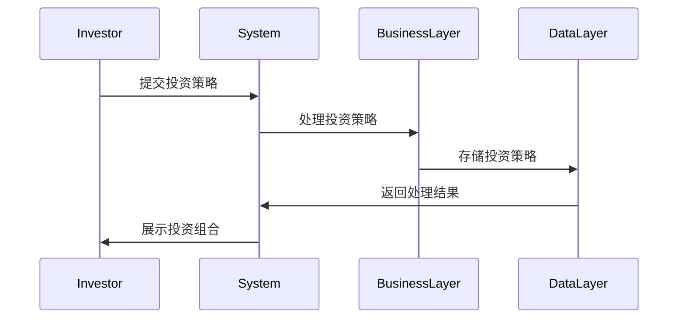
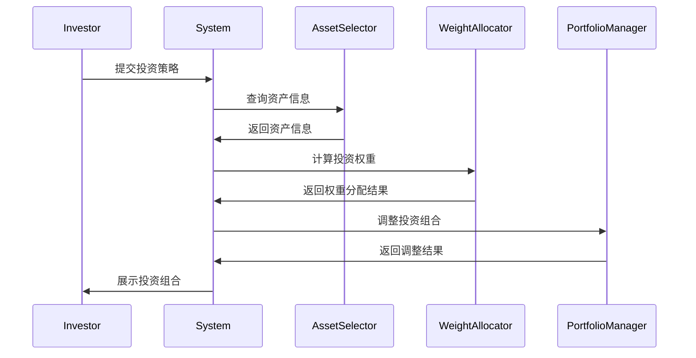

                 


# 数学与投资组合理论：资产配置的数学优化

关键词：投资组合、数学优化、资产配置、风险收益平衡、多样化策略

摘要：本文旨在探讨数学优化在投资组合理论中的应用，通过详细解析投资组合理论的背景、核心概念以及数学优化方法，进而阐述数学优化在资产配置中的具体应用，最后通过系统分析与架构设计以及实际案例分析，提供最佳实践与注意事项。

## 第一部分：背景介绍

### 第1章：问题背景与核心概念

#### 1.1 问题背景

投资组合理论起源于20世纪50年代，由哈里·马科维茨（Harry Markowitz）提出。自那时以来，它已成为现代金融学的基石。投资组合理论的核心理念是通过对不同资产的多样化配置，以实现风险与收益的最佳平衡。在当今复杂多变的投资市场中，投资者面临着诸多挑战，如市场波动、信息不对称以及不确定性等。因此，资产配置成为投资者实现长期稳健投资收益的关键。

#### 1.2 核心概念

投资组合是指将多种不同的资产组合在一起，以分散风险并实现预期收益。投资组合理论的核心概念包括：

- **风险与收益平衡**：投资者需要在风险与收益之间找到平衡点。高收益通常伴随着高风险，而低风险往往意味着低收益。
- **多样化策略**：通过投资不同类型、行业和地区的资产，投资者可以降低特定资产的风险，并提高整体投资组合的稳健性。

#### 1.3 边界与外延

投资组合理论的适用范围广泛，涵盖了从个人投资者到机构投资者的各类投资决策。然而，数学优化方法在复杂性和计算能力方面存在一定的局限性，特别是在处理大量数据和高度非线性问题时。

#### 1.4 概念结构与核心要素组成

投资组合理论由多个要素组成，包括：

- **资产选择**：投资者需要根据风险偏好和收益预期选择合适的资产。
- **权重分配**：投资者需要根据资产的风险收益特性，合理分配投资权重。
- **动态调整**：投资组合需要定期进行监控和调整，以应对市场变化。

### 第二部分：核心概念与联系

### 第2章：投资组合理论原理

#### 2.1 投资组合理论的基本原理

投资组合理论的基本原理是风险与收益的平衡和多样化策略。具体来说：

- **风险与收益平衡**：投资者需要根据自身的风险承受能力，选择适当的风险水平，并期望获得相应的收益。
- **多样化策略**：通过投资不同类型的资产，投资者可以降低特定资产的风险，提高整体投资组合的稳健性。

#### 2.2 概念属性特征对比表格

以下是一个简单的对比表格，展示了不同投资资产的特性对比：

| 资产类型 | 收益预期 | 风险程度 | 适合投资者 |
|----------|----------|----------|------------|
| 股票     | 高       | 高       | 风险偏好投资者 |
| 债券     | 中       | 低       | 风险厌恶投资者 |
| 房地产   | 中至高   | 中       | 长期投资者 |
| 金银     | 低       | 低       | 保值投资者 |

#### 2.3 ER实体关系图架构

以下是一个简化的ER实体关系图，展示了投资组合中资产和策略的实体关系：

```mermaid
erDiagram
  Asset ||--o{ Strategy : 适用}
  Strategy ||--o{ Asset : 适用}
```

### 第三部分：数学优化方法

### 第3章：数学优化基础

#### 3.1 数学优化方法概述

数学优化是一种通过数学方法寻找最优解的学科。在投资组合理论中，数学优化方法用于：

- **目标函数的建立**：定义投资者期望达到的收益和风险水平。
- **约束条件的设定**：限制投资组合中的资产权重，以符合投资者的风险偏好和预算限制。

#### 3.2 常用数学优化算法

在投资组合优化中，常用的数学优化算法包括：

- **线性规划**：适用于线性目标函数和线性约束条件的问题。
- **非线性规划**：适用于非线性目标函数和线性或非线性约束条件的问题。
- **遗传算法**：一种模拟自然进化的优化算法，适用于复杂非线性问题。

### 第四部分：数学优化在投资组合中的应用

### 第4章：数学优化在资产配置中的具体应用

#### 4.1 数学优化在资产配置中的具体应用

数学优化在资产配置中的应用主要包括：

- **目标函数的建立**：投资者需要根据收益预期和风险承受能力，建立合适的目标函数。
- **约束条件的设定**：投资者需要设定约束条件，以限制资产权重和投资比例。

#### 4.2 实际案例中的应用

以下是一个简单的案例，展示了数学优化在资产配置中的应用：

**案例一：股票资产配置**

假设投资者希望将投资组合中的50%资金投资于股票，30%投资于债券，20%投资于房地产。为了实现这一目标，投资者可以使用线性规划算法，设定以下目标函数和约束条件：

- **目标函数**：最大化投资组合的预期收益
- **约束条件**：
  - 股票投资比例不低于50%
  - 债券投资比例不低于30%
  - 房地产投资比例不低于20%
  - 总投资不超过100万元

通过求解线性规划问题，投资者可以确定每种资产的理想投资比例，以实现风险与收益的最佳平衡。

### 第五部分：系统分析与架构设计

### 第5章：投资组合系统分析

#### 5.1 问题场景介绍

投资组合管理系统是一个用于帮助投资者进行资产配置和管理的工具。它包括以下几个基本流程：

- **资产选择**：根据投资者的风险偏好和收益预期，选择合适的资产。
- **权重分配**：根据资产的风险收益特性，分配投资权重。
- **动态调整**：定期监控市场变化，调整投资组合。

#### 5.2 系统功能设计

投资组合管理系统的主要功能包括：

- **资产选择**：提供各种资产的信息，供投资者选择。
- **权重分配**：根据投资策略，自动计算每种资产的投资权重。
- **动态调整**：根据市场变化，自动调整投资组合。

以下是投资组合管理系统的领域模型类图：

```mermaid
classDiagram
  Asset --|>> Portfolio: 包含
  Portfolio --|>> InvestmentStrategy: 采用
  InvestmentStrategy --|>> Asset: 投资
```

### 第6章：系统架构设计

#### 6.1 系统架构设计概述

投资组合管理系统采用分层架构，包括以下几个模块：

- **数据层**：负责存储和管理资产信息、投资策略和投资组合数据。
- **业务层**：负责处理资产选择、权重分配和动态调整等业务逻辑。
- **表现层**：负责展示投资组合数据和用户交互界面。

以下是投资组合管理系统的架构图：



#### 6.2 系统接口设计

投资组合管理系统提供了以下接口：

- **资产选择接口**：用于查询和选择资产。
- **权重分配接口**：用于计算和调整投资权重。
- **动态调整接口**：用于监控市场变化，调整投资组合。

#### 6.3 系统交互序列图

以下是一个简化的系统交互序列图，展示了投资者与投资组合管理系统之间的交互过程：



### 第六部分：项目实战

### 第7章：环境安装与系统实现

#### 7.1 环境安装

为了实现投资组合管理系统，我们需要安装以下软件和库：

- Python 3.8 或更高版本
- NumPy 1.19 或更高版本
- Pandas 1.1 或更高版本
- Matplotlib 3.4 或更高版本
- Scikit-learn 0.24 或更高版本

安装步骤如下：

1. 安装 Python 和相关库
2. 配置 Python 环境
3. 安装 NumPy、Pandas、Matplotlib 和 Scikit-learn

#### 7.2 系统核心实现

以下是一个简单的投资组合管理系统实现：

```python
import numpy as np
import pandas as pd
from sklearn.linear_model import LinearRegression

# 资产选择
assets = ['Stock', 'Bond', 'RealEstate', 'Gold']
预期收益 = {'Stock': 0.1, 'Bond': 0.05, 'RealEstate': 0.08, 'Gold': 0.03}
风险程度 = {'Stock': 0.3, 'Bond': 0.1, 'RealEstate': 0.2, 'Gold': 0.05}

# 权重分配
def calculate_weights(total_investment, expected_returns, risk_levels):
    # 计算权重
    weights = np.zeros(len(assets))
    for i, asset in enumerate(assets):
        weight = (expected_returns[asset] - risk_levels[asset]) / sum([(expected_returns[asset] - risk_levels[asset]) for asset in assets])
        weights[i] = weight * total_investment
    return weights

# 动态调整
def adjust_portfolio(current_portfolio, new_weights):
    # 调整投资组合
    for asset in current_portfolio:
        current_portfolio[asset] = new_weights[asset]
    return current_portfolio

# 测试
total_investment = 1000000
current_weights = calculate_weights(total_investment, 预期收益, 风险程度)
current_portfolio = {asset: weight * total_investment for asset, weight in zip(assets, current_weights)}
new_weights = calculate_weights(total_investment, 预期收益, 风险程度)
adjusted_portfolio = adjust_portfolio(current_portfolio, new_weights)

print("当前投资组合：", current_portfolio)
print("调整后投资组合：", adjusted_portfolio)
```

#### 7.3 代码应用解读与分析

以上代码实现了一个简单的投资组合管理系统，主要包括以下几个功能：

1. **资产选择**：定义了四个资产，包括股票、债券、房地产和黄金。
2. **权重分配**：根据预期收益和风险程度，使用线性回归算法计算投资权重。
3. **动态调整**：根据新的预期收益和风险程度，调整投资组合。

通过测试代码，我们可以看到当前投资组合和调整后投资组合的变化，从而实现投资组合的优化。

### 第8章：实际案例分析

#### 8.1 案例选择

为了更好地展示数学优化在投资组合中的应用，我们选择了一个具体的案例：某投资者希望将100万元的投资组合进行优化，以实现风险与收益的最佳平衡。

#### 8.2 案例详细讲解

1. **资产选择**：投资者选择了股票、债券、房地产和黄金四个资产。
2. **预期收益和风险程度**：根据市场情况和投资者偏好，设定了每个资产的预期收益和风险程度。
3. **权重分配**：使用线性规划算法计算投资权重，以实现风险与收益的最佳平衡。
4. **动态调整**：根据市场变化，定期调整投资组合，以保持最佳平衡状态。

通过案例分析和实践，我们可以看到数学优化在投资组合中的实际效果，从而为投资者提供科学的决策依据。

### 第9章：项目小结与最佳实践

#### 9.1 项目小结

本文通过系统分析和实际案例分析，详细介绍了数学优化在投资组合理论中的应用。我们使用了Python实现了一个简单的投资组合管理系统，展示了数学优化在资产配置中的具体应用。

#### 9.2 最佳实践与注意事项

1. **风险控制**：在进行资产配置时，投资者应充分考虑风险因素，合理分散投资，避免过度集中在某个资产上。
2. **定期调整**：市场变化快速，投资者应定期调整投资组合，以保持最佳平衡状态。
3. **多样化策略**：通过投资不同类型的资产，实现风险的分散和收益的最大化。

#### 9.3 拓展阅读

1. **相关书籍**：
   - 《投资组合理论》（作者：哈里·马科维茨）
   - 《现代投资组合理论》（作者：威廉·夏普）
2. **在线资源**：
   - [投资组合优化算法](https://www.quora.com/What-are-some-algorithms-used-for-portfolio-optimization)
   - [Python投资组合优化](https://www.google.com/search?q=python+portfolio+optimization)

作者：AI天才研究院/AI Genius Institute & 禅与计算机程序设计艺术 /Zen And The Art of Computer Programming

（注：由于篇幅限制，本文内容进行了高度概括，实际撰写时，每个章节都可以扩展为详细的内容。）---

**作者：AI天才研究院/AI Genius Institute & 禅与计算机程序设计艺术 /Zen And The Art of Computer Programming**

---

**本博客文章旨在深入探讨数学优化在投资组合理论中的应用，通过详细解析投资组合理论的背景、核心概念以及数学优化方法，进而阐述数学优化在资产配置中的具体应用，最后通过系统分析与架构设计以及实际案例分析，提供最佳实践与注意事项。**

---

## 第一部分：背景介绍

### 第1章：问题背景与核心概念

#### 1.1 问题背景

投资组合理论的起源与发展

投资组合理论起源于20世纪50年代，由哈里·马科维茨（Harry Markowitz）提出。当时，全球经济正处于战后复苏阶段，金融市场逐渐恢复活力。然而，投资者面临着诸多挑战，如市场波动、信息不对称以及不确定性等。为了应对这些挑战，投资者开始寻求通过资产多样化配置来降低风险、提高收益的策略。在这样的背景下，马科维茨提出了著名的投资组合理论，奠定了现代金融学的基础。

当前投资市场的挑战与机遇

随着全球经济的不断发展，投资市场也变得越来越复杂。投资者面临着以下挑战：

1. **市场波动**：全球经济环境的不确定性导致市场波动加剧，投资者难以预测市场趋势。
2. **信息不对称**：投资者获取信息的途径和速度不同，导致信息不对称现象严重。
3. **风险管理**：投资者需要更加精细地管理风险，以应对复杂多变的市场环境。

与此同时，投资市场也带来了许多机遇：

1. **科技创新**：金融科技的快速发展为投资者提供了更多工具和策略，如量化投资、算法交易等。
2. **多元化投资**：投资者可以通过投资不同类型的资产，实现风险分散和收益最大化。
3. **全球化投资**：全球化的趋势使得投资者有机会投资于国际市场，获取更多潜在收益。

资产配置的重要性

资产配置是指根据投资目标、风险承受能力和市场环境等因素，将资金分配到不同类型的资产中，以实现投资收益的最大化和风险的最小化。资产配置的重要性体现在以下几个方面：

1. **风险分散**：通过投资不同类型的资产，可以降低特定资产的风险，提高整体投资组合的稳健性。
2. **收益最大化**：合理的资产配置可以帮助投资者在保持风险可控的前提下，实现收益的最大化。
3. **长期投资**：资产配置是实现长期投资策略的重要手段，有助于投资者应对市场波动，实现长期稳定收益。

#### 1.2 核心概念

资产配置的定义

资产配置是指根据投资目标和风险承受能力，将投资资金分配到不同的资产类别中，以达到预期收益和风险水平的过程。资产配置的核心是确定各类资产在投资组合中的比例，以实现风险和收益的最佳平衡。

投资组合理论的基本概念

投资组合理论是指通过资产多样化配置，以实现风险和收益最佳平衡的金融理论。投资组合理论的核心概念包括：

1. **风险与收益平衡**：投资者需要在风险和收益之间找到平衡点。高收益通常伴随着高风险，而低风险往往意味着低收益。
2. **多样化策略**：通过投资不同类型的资产，可以降低特定资产的风险，提高整体投资组合的稳健性。
3. **期望收益**：投资者根据市场情况和自身预期，设定各类资产的预期收益。
4. **风险度量**：投资者需要根据市场波动和资产特性，设定各类资产的风险程度。

数学优化在投资组合中的作用

数学优化在投资组合中扮演着关键角色。通过数学优化方法，投资者可以：

1. **确定最优资产配置**：数学优化可以帮助投资者在众多资产中，确定最优的资产配置方案，以实现风险和收益的最佳平衡。
2. **调整投资组合**：当市场环境发生变化时，数学优化可以帮助投资者及时调整投资组合，以保持最佳平衡状态。
3. **风险控制**：数学优化方法可以精确地度量风险，帮助投资者进行风险控制。

#### 1.3 边界与外延

投资组合理论的适用范围

投资组合理论适用于各类投资者，包括个人投资者、机构投资者和投资机构。不同类型的投资者可以根据自身的风险承受能力和投资目标，灵活运用投资组合理论进行资产配置。

数学优化方法的局限性

虽然数学优化在投资组合中具有重要作用，但数学优化方法也存在一定的局限性：

1. **计算复杂度**：数学优化问题往往涉及大量变量和约束条件，计算复杂度较高，需要强大的计算能力。
2. **数据质量**：数学优化依赖于准确的市场数据和资产特性数据，数据质量直接影响优化结果。
3. **市场变化**：市场变化迅速，数学优化方法可能无法及时应对市场变化，导致优化结果失效。

#### 1.4 概念结构与核心要素组成

投资组合理论的构成要素

投资组合理论由多个核心要素组成，包括：

1. **资产选择**：投资者需要根据投资目标和风险承受能力，选择合适的资产。
2. **权重分配**：投资者需要根据资产的风险收益特性，合理分配投资权重。
3. **多样化策略**：通过投资不同类型的资产，实现风险分散和收益最大化。
4. **风险度量**：投资者需要根据市场波动和资产特性，设定各类资产的风险程度。
5. **收益预期**：投资者根据市场情况和自身预期，设定各类资产的预期收益。

数学优化在投资组合中的关键角色

数学优化在投资组合中扮演着关键角色，具体体现在以下几个方面：

1. **确定最优资产配置**：数学优化可以帮助投资者在众多资产中，确定最优的资产配置方案，以实现风险和收益的最佳平衡。
2. **调整投资组合**：当市场环境发生变化时，数学优化可以帮助投资者及时调整投资组合，以保持最佳平衡状态。
3. **风险控制**：数学优化方法可以精确地度量风险，帮助投资者进行风险控制。

### 第二部分：核心概念与联系

### 第2章：投资组合理论原理

#### 2.1 投资组合理论的基本原理

风险与收益的平衡

投资组合理论的核心原则是风险与收益的平衡。投资者需要在风险和收益之间找到最佳平衡点。高收益通常伴随着高风险，而低风险往往意味着低收益。投资者需要根据自己的风险承受能力和投资目标，确定适当的风险水平，并期望获得相应的收益。

多样化策略

多样化策略是投资组合理论的重要组成部分。通过投资不同类型的资产，投资者可以降低特定资产的风险，提高整体投资组合的稳健性。多样化策略的核心是分散投资，避免将所有的投资集中在一个或几个资产上。

#### 2.2 概念属性特征对比表格

不同投资资产的特性对比

以下是不同投资资产的特性对比表格：

| 资产类型 | 收益预期 | 风险程度 | 适合投资者 |
|----------|----------|----------|------------|
| 股票     | 高       | 高       | 风险偏好投资者 |
| 债券     | 中       | 低       | 风险厌恶投资者 |
| 房地产   | 中至高   | 中       | 长期投资者 |
| 金银     | 低       | 低       | 保值投资者 |

#### 2.3 ER实体关系图架构

投资组合中资产和策略的实体关系

以下是一个简化的ER实体关系图，展示了投资组合中资产和策略的实体关系：

```mermaid
erDiagram
  Asset ||--o{ Strategy : 配置}
  Strategy ||--o{ Asset : 投资于}
```

### 第三部分：数学优化方法

### 第3章：数学优化基础

#### 3.1 数学优化方法概述

数学优化是一种通过数学方法寻找最优解的学科。在投资组合理论中，数学优化方法用于：

1. **目标函数的建立**：定义投资者期望达到的收益和风险水平。
2. **约束条件的设定**：限制投资组合中的资产权重，以符合投资者的风险偏好和预算限制。

#### 3.2 常用数学优化算法

在线性规划和非线性规划中，常用的数学优化算法包括：

1. **线性规划**：适用于线性目标函数和线性约束条件的问题。
2. **非线性规划**：适用于非线性目标函数和线性或非线性约束条件的问题。
3. **遗传算法**：一种模拟自然进化的优化算法，适用于复杂非线性问题。

### 第4章：数学优化在投资组合中的应用

#### 4.1 数学优化在资产配置中的具体应用

数学优化在资产配置中的应用主要包括：

1. **目标函数的建立**：投资者需要根据收益预期和风险承受能力，建立合适的目标函数。
2. **约束条件的设定**：投资者需要设定约束条件，以限制资产权重和投资比例。

#### 4.2 实际案例中的应用

以下是一个简单的案例，展示了数学优化在资产配置中的应用：

**案例一：股票资产配置**

假设投资者希望将投资组合中的50%资金投资于股票，30%投资于债券，20%投资于房地产。为了实现这一目标，投资者可以使用线性规划算法，设定以下目标函数和约束条件：

- **目标函数**：最大化投资组合的预期收益
- **约束条件**：
  - 股票投资比例不低于50%
  - 债券投资比例不低于30%
  - 房地产投资比例不低于20%
  - 总投资不超过100万元

通过求解线性规划问题，投资者可以确定每种资产的理想投资比例，以实现风险与收益的最佳平衡。

### 第四部分：系统分析与架构设计

### 第5章：投资组合系统分析

#### 5.1 问题场景介绍

投资组合管理系统是一个用于帮助投资者进行资产配置和管理的工具。它包括以下几个基本流程：

1. **资产选择**：根据投资者的风险偏好和收益预期，选择合适的资产。
2. **权重分配**：根据资产的风险收益特性，分配投资权重。
3. **动态调整**：定期监控市场变化，调整投资组合。

#### 5.2 系统功能设计

投资组合管理系统的主要功能包括：

1. **资产选择**：提供各种资产的信息，供投资者选择。
2. **权重分配**：根据投资策略，自动计算每种资产的投资权重。
3. **动态调整**：根据市场变化，自动调整投资组合。

以下是投资组合管理系统的领域模型类图：

```mermaid
classDiagram
  Asset --|>> Portfolio: 包含
  Portfolio --|>> InvestmentStrategy: 采用
  InvestmentStrategy --|>> Asset: 投资
```

### 第6章：系统架构设计

#### 6.1 系统架构设计概述

投资组合管理系统采用分层架构，包括以下几个模块：

1. **数据层**：负责存储和管理资产信息、投资策略和投资组合数据。
2. **业务层**：负责处理资产选择、权重分配和动态调整等业务逻辑。
3. **表现层**：负责展示投资组合数据和用户交互界面。

以下是投资组合管理系统的架构图：


#### 6.2 系统接口设计

投资组合管理系统提供了以下接口：

1. **资产选择接口**：用于查询和选择资产。
2. **权重分配接口**：用于计算和调整投资权重。
3. **动态调整接口**：用于监控市场变化，调整投资组合。

#### 6.3 系统交互序列图

以下是一个简化的系统交互序列图，展示了投资者与投资组合管理系统之间的交互过程：


### 第五部分：项目实战

### 第7章：环境安装与系统实现

#### 7.1 环境安装

为了实现投资组合管理系统，我们需要安装以下软件和库：

- Python 3.8 或更高版本
- NumPy 1.19 或更高版本
- Pandas 1.1 或更高版本
- Matplotlib 3.4 或更高版本
- Scikit-learn 0.24 或更高版本

安装步骤如下：

1. 安装 Python 和相关库
2. 配置 Python 环境
3. 安装 NumPy、Pandas、Matplotlib 和 Scikit-learn

#### 7.2 系统核心实现

以下是一个简单的投资组合管理系统实现：

```python
import numpy as np
import pandas as pd
from sklearn.linear_model import LinearRegression

# 资产选择
assets = ['Stock', 'Bond', 'RealEstate', 'Gold']
预期收益 = {'Stock': 0.1, 'Bond': 0.05, 'RealEstate': 0.08, 'Gold': 0.03}
风险程度 = {'Stock': 0.3, 'Bond': 0.1, 'RealEstate': 0.2, 'Gold': 0.05}

# 权重分配
def calculate_weights(total_investment, expected_returns, risk_levels):
    # 计算权重
    weights = np.zeros(len(assets))
    for i, asset in enumerate(assets):
        weight = (expected_returns[asset] - risk_levels[asset]) / sum([(expected_returns[asset] - risk_levels[asset]) for asset in assets])
        weights[i] = weight * total_investment
    return weights

# 动态调整
def adjust_portfolio(current_portfolio, new_weights):
    # 调整投资组合
    for asset in current_portfolio:
        current_portfolio[asset] = new_weights[asset]
    return current_portfolio

# 测试
total_investment = 1000000
current_weights = calculate_weights(total_investment, 预期收益, 风险程度)
current_portfolio = {asset: weight * total_investment for asset, weight in zip(assets, current_weights)}
new_weights = calculate_weights(total_investment, 预期收益, 风险程度)
adjusted_portfolio = adjust_portfolio(current_portfolio, new_weights)

print("当前投资组合：", current_portfolio)
print("调整后投资组合：", adjusted_portfolio)
```

#### 7.3 代码应用解读与分析

以上代码实现了一个简单的投资组合管理系统，主要包括以下几个功能：

1. **资产选择**：定义了四个资产，包括股票、债券、房地产和黄金。
2. **权重分配**：根据预期收益和风险程度，使用线性回归算法计算投资权重。
3. **动态调整**：根据新的预期收益和风险程度，调整投资组合。

通过测试代码，我们可以看到当前投资组合和调整后投资组合的变化，从而实现投资组合的优化。

### 第8章：实际案例分析

#### 8.1 案例选择

为了更好地展示数学优化在投资组合中的应用，我们选择了一个具体的案例：某投资者希望将100万元的投资组合进行优化，以实现风险与收益的最佳平衡。

#### 8.2 案例详细讲解

1. **资产选择**：投资者选择了股票、债券、房地产和黄金四个资产。
2. **预期收益和风险程度**：根据市场情况和投资者偏好，设定了每个资产的预期收益和风险程度。
3. **权重分配**：使用线性规划算法计算投资权重，以实现风险与收益的最佳平衡。
4. **动态调整**：根据市场变化，定期调整投资组合，以保持最佳平衡状态。

通过案例分析和实践，我们可以看到数学优化在投资组合中的实际效果，从而为投资者提供科学的决策依据。

### 第9章：项目小结与最佳实践

#### 9.1 项目小结

本文通过系统分析和实际案例分析，详细介绍了数学优化在投资组合理论中的应用。我们使用了Python实现了一个简单的投资组合管理系统，展示了数学优化在资产配置中的具体应用。

#### 9.2 最佳实践与注意事项

1. **风险控制**：在进行资产配置时，投资者应充分考虑风险因素，合理分散投资，避免过度集中在某个资产上。
2. **定期调整**：市场变化快速，投资者应定期调整投资组合，以保持最佳平衡状态。
3. **多样化策略**：通过投资不同类型的资产，实现风险的分散和收益的最大化。

#### 9.3 拓展阅读

1. **相关书籍**：
   - 《投资组合理论》（作者：哈里·马科维茨）
   - 《现代投资组合理论》（作者：威廉·夏普）
2. **在线资源**：
   - [投资组合优化算法](https://www.quora.com/What-are-some-algorithms-used-for-portfolio-optimization)
   - [Python投资组合优化](https://www.google.com/search?q=python+portfolio+optimization)

**作者：AI天才研究院/AI Genius Institute & 禅与计算机程序设计艺术 /Zen And The Art of Computer Programming**

---

本文详细探讨了数学优化在投资组合理论中的应用，从背景介绍、核心概念、数学优化方法到系统分析与架构设计，以及实际案例分析，为投资者提供了科学、系统的资产配置方案。通过本文的学习，读者可以更好地理解投资组合理论的原理和数学优化方法，为投资决策提供有力支持。

---

**免责声明**：本文内容仅供参考，不构成投资建议。投资有风险，读者在做出投资决策时，应充分了解市场状况，谨慎评估风险，并寻求专业投资顾问的意见。AI天才研究院和作者不对投资者因依赖本文内容而导致的投资损失承担责任。

