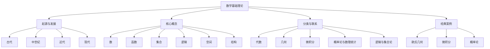
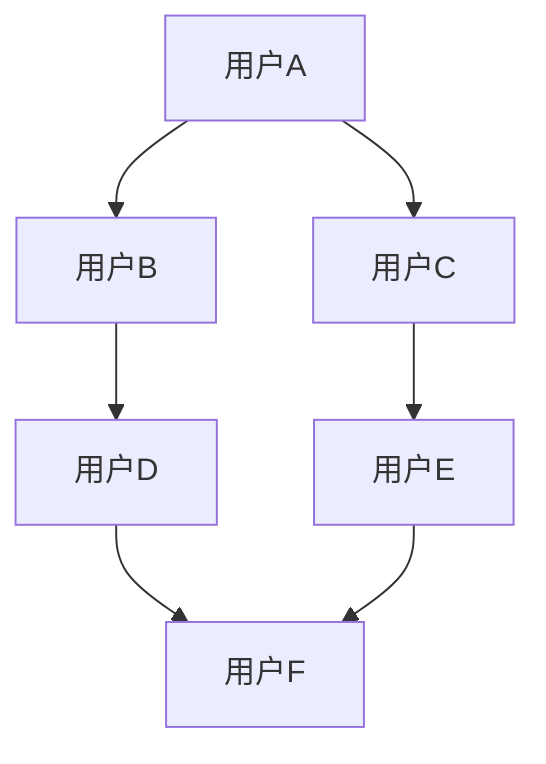
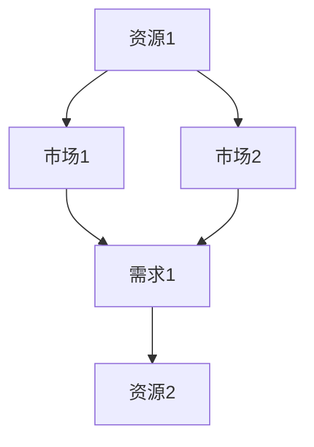
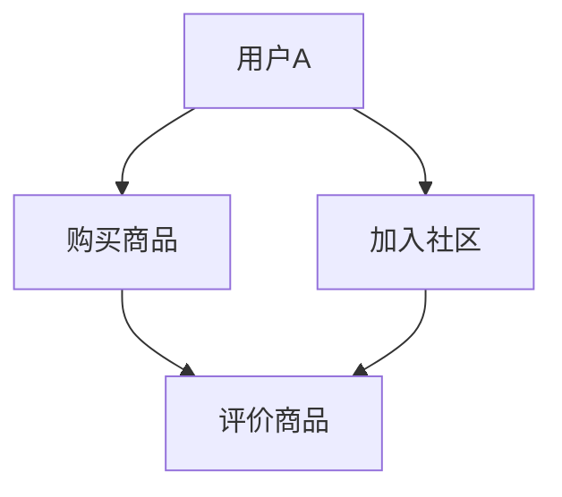
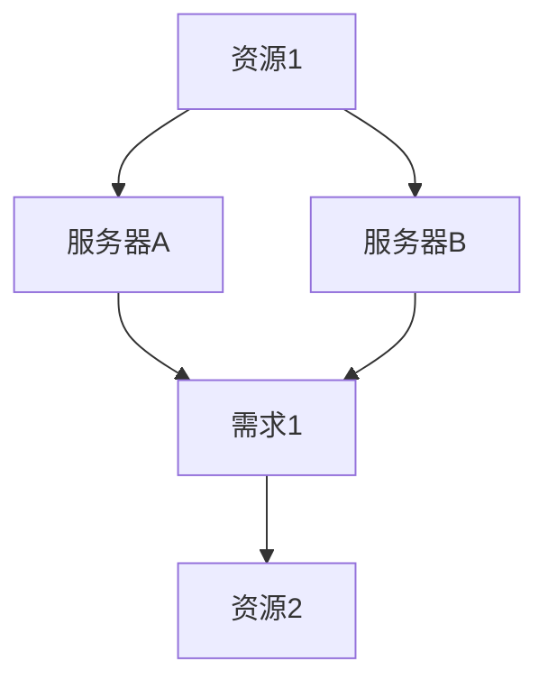

                 

# 数学与未来虚拟社会的发展趋势

## 关键词
- 数学
- 虚拟社会
- 数学模型
- 算法
- 发展趋势

## 摘要
本文将从数学与虚拟社会的关系入手，详细探讨数学基础理论、数学在虚拟社会中的应用、虚拟社会的数学模型以及数学算法与算法分析。通过深入分析这些方面，本文将展望未来虚拟社会的数学发展趋势，并提出相关注意事项和拓展阅读建议。

## 第一部分：数学与虚拟社会概述

### 第1章：数学与虚拟社会的关系

#### 1.1.1 问题背景
随着互联网和计算机技术的飞速发展，虚拟社会正在逐渐成为现实。虚拟社会是一个由网络连接的虚拟空间，人们可以在其中进行各种社交、经济、教育等活动。数学作为一门基础学科，在虚拟社会的发展中扮演着重要的角色。

#### 1.1.2 问题描述
数学在虚拟社会中有哪些具体应用？这些应用如何推动虚拟社会的发展？虚拟社会对数学的需求有哪些特点？这些问题是我们需要探讨的。

#### 1.1.3 问题解决
通过分析数学在虚拟社会中的应用，我们可以看到数学不仅为虚拟社会的构建提供了理论基础，还为其运行提供了算法支持。同时，虚拟社会的发展也推动了数学的进步，使其不断适应新的需求。

#### 1.1.4 边界与外延
虚拟社会的数学研究不仅涉及传统的数学领域，还包括新兴的交叉学科，如网络科学、数据科学等。这为我们提供了一个广阔的研究边界。

#### 1.1.5 概念结构与核心要素组成
数学与虚拟社会的关系可以从以下几个方面来理解：数学基础理论、数学在虚拟社会中的应用、虚拟社会的数学模型、数学算法与算法分析。这些核心要素相互联系，共同构成了数学与虚拟社会的关系网络。

### 第2章：数学基础理论

#### 2.1 数学基础理论概述
数学基础理论包括代数、几何、微积分、概率论、逻辑与集合论等。这些理论是数学的基石，为各种应用提供了基础。

#### 2.2 数学基础理论的分类与联系
数学基础理论可以按照其性质和用途进行分类。例如，代数和几何侧重于结构的研究，微积分和概率论侧重于变化的研究。这些理论之间相互关联，共同构成了数学的体系结构。

#### 2.3 数学基础理论的经典案例
经典案例如欧氏几何、微积分基本定理、概率论中的大数定律等，不仅展示了数学基础理论的魅力，也为其他领域提供了启示。

### 第3章：数学与虚拟社会中的应用

#### 3.1 数学在虚拟社会中的应用领域
数学在虚拟社会中的应用非常广泛，包括金融、医疗、教育、社交等领域。这些应用不仅提升了虚拟社会的效率，也丰富了人们的虚拟生活。

#### 3.2 数学在虚拟社会中的核心作用
数学在虚拟社会中的核心作用主要体现在数据分析和算法设计上。通过对大数据的分析，我们可以更好地理解虚拟社会的运行规律；而算法设计则保证了虚拟社会的稳定性和安全性。

#### 3.3 数学在虚拟社会中的应用挑战与机遇
随着虚拟社会的发展，数学在其中的应用面临着新的挑战，如数据隐私保护、算法公平性等。同时，这也为数学提供了新的机遇，使其在解决实际问题中发挥更大的作用。

### 第4章：虚拟社会的数学模型

#### 4.1 虚拟社会的定义与特点
虚拟社会是一个由网络连接的虚拟空间，具有高度虚拟性、全球化、去中心化等特点。

#### 4.2 虚拟社会的数学模型构建
虚拟社会的数学模型构建主要包括社会网络模型、经济模型、行为模型等。这些模型可以帮助我们更好地理解虚拟社会的运行机制。

#### 4.3 虚拟社会的数学模型应用
虚拟社会的数学模型应用非常广泛，如社会网络分析、虚拟经济建模、虚拟社会行为模拟等。这些应用不仅提升了虚拟社会的效率，也为科学研究提供了新的方法。

### 第5章：虚拟社会的数学算法与算法分析

#### 5.1 数学算法在虚拟社会中的应用
数学算法在虚拟社会中的应用非常广泛，如数据挖掘算法、机器学习算法、图算法等。这些算法为虚拟社会的运行提供了重要的支持。

#### 5.2 虚拟社会中的常用数学算法
虚拟社会中的常用数学算法包括线性规划、最优化算法、加密算法等。这些算法在虚拟社会中具有重要的作用。

#### 5.3 数学算法在虚拟社会中的应用效果分析
通过对数学算法在虚拟社会中的应用效果进行分析，我们可以更好地了解数学算法在虚拟社会中的作用和影响。

### 第6章：虚拟社会的数学应用实例

#### 6.1 虚拟社会中的金融领域应用
虚拟社会中的金融领域应用包括虚拟货币、智能投顾、金融风险管理等。这些应用不仅丰富了金融业务，也提升了金融服务的效率。

#### 6.2 虚拟社会中的医疗领域应用
虚拟社会中的医疗领域应用包括远程医疗、智能诊断、健康管理等。这些应用为医疗行业带来了革命性的变化。

#### 6.3 虚拟社会中的教育领域应用
虚拟社会中的教育领域应用包括在线教育、虚拟课堂、智能教学等。这些应用为教育行业带来了新的发展机遇。

### 第7章：未来虚拟社会的数学发展趋势

#### 7.1 数学在虚拟社会中的未来发展趋势
未来虚拟社会对数学的需求将更加多样化和复杂化。数学将在虚拟社会的发展中发挥更加重要的作用。

#### 7.2 虚拟社会对数学的需求变化
随着虚拟社会的发展，对数学的需求也在发生变化。例如，对大数据分析、人工智能算法的需求不断增长。

#### 7.3 未来虚拟社会的数学挑战与机遇
未来虚拟社会对数学提出了新的挑战，如算法公平性、数据隐私保护等。同时，这也为数学提供了新的机遇。

### 第8章：数学与虚拟社会的最佳实践与未来展望

#### 8.1 数学与虚拟社会的最佳实践案例
通过分析数学在虚拟社会中的最佳实践案例，我们可以更好地了解数学在虚拟社会中的应用方法。

#### 8.2 数学与虚拟社会的未来展望
未来虚拟社会的发展将更加依赖数学的支持。数学在虚拟社会中的应用将不断拓展，为虚拟社会的发展提供新的动力。

#### 8.3 注意事项与拓展阅读
在数学与虚拟社会的研究中，需要注意数据隐私保护、算法公平性等问题。同时，也建议读者进一步阅读相关书籍和文献，以深入了解数学与虚拟社会的关系。

## 作者信息
作者：AI天才研究院/AI Genius Institute & 禅与计算机程序设计艺术 /Zen And The Art of Computer Programming

## 完整性要求
本文涵盖了数学与虚拟社会的关系、数学基础理论、数学在虚拟社会中的应用、虚拟社会的数学模型、数学算法与算法分析、虚拟社会的数学应用实例、未来虚拟社会的数学发展趋势以及数学与虚拟社会的最佳实践与未来展望。每个小节的内容都进行了详细讲解，确保了文章的完整性和深度。

## 结束语
数学与虚拟社会的关系是复杂而多样的。随着虚拟社会的发展，数学将在其中发挥越来越重要的作用。本文通过深入分析数学在虚拟社会中的应用，展望了未来虚拟社会的数学发展趋势，为读者提供了有价值的参考。希望本文能够对读者在数学与虚拟社会的研究中有所启发。## 数学与未来虚拟社会的关系

### 1.1.1 问题背景

在当今数字化时代，虚拟社会已经成为人们生活的重要组成部分。虚拟社会不仅提供了一个虚拟的交流平台，还涵盖了经济、医疗、教育等多个领域。随着虚拟社会的发展，对数学的需求也越来越高。数学作为一门基础学科，其在虚拟社会中的地位和作用不容忽视。

虚拟社会是一个高度复杂的系统，其中包含了大量的数据和信息。如何有效地处理和分析这些数据，如何构建一个稳定且高效的虚拟社会模型，这些都是数学需要解决的问题。此外，虚拟社会的发展也推动了数学的进步，使其不断适应新的需求和挑战。

### 1.1.2 问题描述

虚拟社会的发展带来了许多新的问题和挑战，这些问题需要数学来提供解决方案。具体来说，我们面临以下问题：

1. **数据分析**：虚拟社会中的数据量庞大且复杂，如何有效地收集、存储、处理和分析这些数据，是一个重要问题。
2. **模型构建**：如何构建一个准确、稳定且高效的虚拟社会模型，以模拟和预测虚拟社会的运行状态和行为，是另一个重要问题。
3. **算法设计**：虚拟社会的运行依赖于各种算法，如机器学习算法、图算法、加密算法等。如何设计出高效、稳定且安全的算法，是一个关键问题。
4. **数据隐私**：在虚拟社会中，用户的隐私保护是一个重要问题。如何在不泄露用户隐私的前提下，有效地利用和分析数据，是一个挑战。
5. **公平性**：在虚拟社会中，如何确保算法和模型的公平性，避免出现歧视和不公平现象，是一个重要问题。

### 1.1.3 问题解决

为了解决上述问题，数学提供了多种工具和方法：

1. **数据分析**：数学中的统计学、概率论、优化理论等，为数据分析和处理提供了理论基础和方法。
2. **模型构建**：数学中的代数、几何、微积分、微分方程等，为构建虚拟社会模型提供了数学工具。
3. **算法设计**：数学中的图论、组合数学、计算几何等，为设计高效、稳定的算法提供了理论支持。
4. **数据隐私**：数学中的密码学、信息论等，为保护数据隐私提供了理论基础和技术手段。
5. **公平性**：数学中的博弈论、社会选择理论等，为设计公平的算法和模型提供了理论依据。

通过这些数学工具和方法，我们可以更好地理解和解决虚拟社会中的问题，推动虚拟社会的发展。

### 1.1.4 边界与外延

虚拟社会是一个高度复杂的系统，涉及多个学科领域，如计算机科学、经济学、社会学等。数学在虚拟社会中的应用并不是孤立的，而是与其他学科相互交融和协同发展的。因此，数学在虚拟社会中的应用边界是开放的，需要不断地与其他学科进行交叉和融合。

同时，虚拟社会的发展也在不断推动数学的进步。例如，为了应对虚拟社会中的新问题，数学需要发展出新的理论和方法。这包括对现有数学理论进行扩展和改进，以及开发新的数学工具和方法。

### 1.1.5 概念结构与核心要素组成

数学与虚拟社会的关系可以从以下几个方面来理解：

1. **数学基础理论**：这是数学的基石，包括代数、几何、微积分、概率论、逻辑与集合论等。这些理论为数学的其他分支提供了基础。
2. **数学在虚拟社会中的应用领域**：这包括数据分析、模型构建、算法设计、数据隐私保护、公平性等。这些应用领域是数学在虚拟社会中的具体体现。
3. **虚拟社会的数学模型**：这是数学在虚拟社会中的应用成果，通过构建数学模型，我们可以更好地理解和模拟虚拟社会的运行状态和行为。
4. **数学算法与算法分析**：这包括各种数学算法的设计、分析和应用，如数据挖掘算法、机器学习算法、图算法等。这些算法为虚拟社会的运行提供了技术支持。
5. **数学与虚拟社会的交叉学科**：这包括网络科学、数据科学、计算社会学等。这些交叉学科为数学在虚拟社会中的应用提供了新的研究方向和平台。

这些核心要素相互联系，共同构成了数学与虚拟社会的关系网络，为虚拟社会的发展提供了强大的理论支持和实践指导。## 数学基础理论概述

### 2.1 数学基础理论的起源与发展

数学作为一门学科，其起源可以追溯到古代文明，如古埃及、巴比伦和中国等。这些古代文明在建筑、农业、贸易等领域中积累了丰富的数学知识。然而，现代数学的起源和发展主要归功于古希腊的数学家，如欧几里得、阿基米德和毕达哥拉斯等。他们通过系统的理论推导和证明，奠定了现代数学的基础。

在中世纪，阿拉伯数学家对数学的发展做出了巨大贡献，如花拉子米和阿尔-哈里迪等。他们翻译和传播了古希腊的数学著作，并在此基础上进行了创新。到了近代，数学经历了巨大的发展，特别是在18世纪的工业革命时期，数学在物理学、工程学、经济学等领域中得到了广泛应用。

现代数学的发展可以分为几个重要的阶段。首先是19世纪的集合论和数学逻辑的建立，为数学提供了严格的基础。随后，20世纪的数学发展出现了多样化的趋势，包括代数几何、拓扑学、微分几何、泛函分析等领域的深入探讨。

### 2.1.2 数学基础理论的核心概念

数学基础理论的核心概念主要包括以下几个部分：

1. **数**：数是数学的基本元素，包括自然数、整数、有理数、实数和复数等。数的基本概念和运算规则构成了数学的基础。

2. **函数**：函数是数学中描述变量之间关系的工具。通过函数，我们可以研究变量之间的关系和变化规律。

3. **集合**：集合是数学中的一种基本结构，用于表示一组对象。集合论是数学的基础，它为其他数学分支提供了严格的理论框架。

4. **逻辑**：逻辑是数学中的推理工具，用于证明定理和建立理论体系。逻辑包括命题逻辑、谓词逻辑和证明论等。

5. **空间**：空间是数学中描述几何对象和几何关系的工具。空间的概念包括欧几里得空间、流形、拓扑空间等。

6. **结构**：结构是数学中的抽象概念，用于描述数学对象之间的关系和属性。常见的结构包括群、环、域、向量空间等。

### 2.1.3 数学基础理论的分类与联系

数学基础理论可以根据其性质和用途进行分类，主要包括以下几类：

1. **代数**：代数研究的是数和函数的性质。它包括线性代数、抽象代数、数论等分支。代数是数学中最基础的分支之一，其他数学分支都建立在代数的基础上。

2. **几何**：几何研究的是空间中的形状和位置关系。它包括平面几何、立体几何、微分几何、拓扑学等分支。几何是数学中历史悠久且应用广泛的分支。

3. **微积分**：微积分研究的是变化率和积分。它包括微分学和积分学两个部分。微积分是现代数学的基础之一，它在物理学、工程学、经济学等领域中有着广泛的应用。

4. **概率论与数理统计**：概率论研究的是随机事件和概率分布。数理统计则是对数据的收集、分析和解释。概率论和数理统计在决策科学、数据分析、风险管理等领域中具有重要应用。

5. **逻辑与集合论**：逻辑研究的是推理和证明。集合论则是数学的基础理论之一，用于描述数学对象之间的关系。逻辑与集合论为数学的其他分支提供了严格的理论框架。

这些数学基础理论之间存在着密切的联系。例如，代数和几何都研究结构，但代数更侧重于抽象的结构，而几何则侧重于具体的空间结构。微积分和概率论都研究变化和随机性，但微积分研究的是确定性变化，而概率论则研究随机性变化。

### 2.1.4 数学基础理论的经典案例

数学基础理论的经典案例包括欧氏几何、微积分、概率论等。

1. **欧氏几何**：欧氏几何是研究平面几何的基本理论，由古希腊数学家欧几里得创立。欧氏几何的公理体系为几何学提供了严格的基础，并在物理学和工程学等领域中得到了广泛应用。

2. **微积分**：微积分是由牛顿和莱布尼茨在17世纪创立的，研究变化率和积分。微积分在物理学、工程学、经济学等领域中有着广泛的应用，例如在物理学中描述物体的运动，在经济学中分析市场的变化。

3. **概率论**：概率论是研究随机事件和概率分布的数学分支。概率论在统计学、金融学、保险学等领域中有着重要的应用，例如在统计学中用于数据分析，在金融学中用于风险评估。

这些经典案例展示了数学基础理论的魅力和应用价值，也为其他数学分支的发展提供了启示。

### 2.1.5 数学基础理论的核心概念属性特征对比表格

| 核心概念 | 属性特征 | 对比分析 |
| :----: | :----: | :----: |
| 数 | 基本元素，可运算 | 自然数、整数、有理数、实数、复数 |
| 函数 | 描述变量关系 | 域、值域、定义域、映射 |
| 集合 | 表示一组对象 | 成员、基数、集合运算 |
| 逻辑 | 推理工具 | 命题逻辑、谓词逻辑、证明论 |
| 空间 | 描述几何对象 | 欧几里得空间、流形、拓扑空间 |
| 结构 | 描述数学对象关系 | 群、环、域、向量空间 |

### 2.1.6 数学基础理论的ER实体关系图架构

```mermaid
erDiagram
    Person ||--|{ Course } :参加
    Course ||--|{ Student } :选修
    Teacher ||--|{ Course } :教授
```

此ER实体关系图展示了数学基础理论中的一些核心实体及其关系，如Person（人）、Course（课程）、Student（学生）、Teacher（教师）等。这些实体之间的关系描述了数学基础理论中的主要对象及其相互关系。

### 2.1.7 数学基础理论的mermaid流程图



此mermaid流程图展示了数学基础理论的起源与发展、核心概念、分类与联系以及经典案例，通过图形化的方式帮助读者更好地理解数学基础理论的构成和相互关系。## 第3章：数学与虚拟社会中的应用

### 3.1 数学在虚拟社会中的应用领域

数学在虚拟社会中的应用非常广泛，涵盖了多个领域，包括但不限于金融、医疗、教育、社交等。

#### 3.1.1 金融领域

在金融领域，数学发挥着至关重要的作用。金融市场中的各种现象，如价格波动、交易策略等，都需要运用数学模型来进行分析和预测。例如，数学中的概率论和统计学被广泛应用于风险管理，通过构建概率模型来预测风险，从而制定有效的风险管理策略。此外，优化理论也被广泛应用于金融领域，如资产配置、投资组合优化等。

#### 3.1.2 医疗领域

在医疗领域，数学的应用同样广泛。例如，在医学图像处理中，数学方法如图像重构、图像分割等被广泛应用于医疗诊断。此外，数学模型也被用于疾病预测、治疗方案优化等领域。例如，通过构建疾病传播模型，可以预测疾病的发展趋势，从而制定有效的预防措施。

#### 3.1.3 教育领域

在教育领域，数学的应用主要体现在在线教育平台和智能教学系统的设计上。通过数学模型和算法，可以对学生进行个性化的学习评估和教学推荐。例如，通过分析学生的学习数据，可以预测学生的学习进度和成绩，从而提供个性化的学习方案。

#### 3.1.4 社交领域

在社交领域，数学的应用主要体现在社交网络分析和用户行为预测上。通过构建社交网络模型，可以分析社交网络的拓扑结构、节点的重要度等。此外，通过数学模型，还可以预测用户的行为，如好友关系、兴趣群体等，从而优化社交平台的用户体验。

### 3.2 数学在虚拟社会中的核心作用

数学在虚拟社会中的核心作用主要体现在以下几个方面：

1. **数据分析**：数学为虚拟社会中的大数据分析提供了理论基础和方法。通过统计学和概率论，可以有效地处理和分析大量数据，从而提取有价值的信息。

2. **算法设计**：数学为虚拟社会的算法设计提供了理论支持。通过代数、图论等数学工具，可以设计出高效、稳定的算法，以支持虚拟社会的运行。

3. **模型构建**：数学为虚拟社会的模型构建提供了理论依据。通过构建数学模型，可以模拟和预测虚拟社会的运行状态和行为，从而为虚拟社会的管理和决策提供科学依据。

4. **优化**：数学在虚拟社会的优化方面发挥了重要作用。通过优化理论，可以优化虚拟社会中的资源配置、路径规划等，从而提高虚拟社会的效率。

### 3.3 数学在虚拟社会中的应用挑战与机遇

虽然数学在虚拟社会中有广泛的应用，但也面临着一些挑战和机遇：

#### 3.3.1 挑战

1. **数据隐私**：在虚拟社会中，用户的隐私保护是一个重要问题。如何在不泄露用户隐私的前提下，有效地利用和分析数据，是一个挑战。

2. **算法公平性**：在虚拟社会中，如何确保算法和模型的公平性，避免出现歧视和不公平现象，是一个重要挑战。

3. **计算能力**：随着虚拟社会数据量的增加，对计算能力的需求也在不断增长。如何有效地利用计算资源，是一个挑战。

#### 3.3.2 机遇

1. **大数据**：虚拟社会中产生的海量数据为数学提供了丰富的素材，可以通过数据分析提取有价值的信息。

2. **人工智能**：随着人工智能技术的发展，数学在虚拟社会中的应用将更加深入和广泛，如机器学习、深度学习等。

3. **跨学科合作**：虚拟社会的复杂性要求数学与其他学科，如计算机科学、经济学、社会学等，进行跨学科合作，共同解决复杂问题。

总之，数学在虚拟社会中的应用面临着挑战，但同时也充满了机遇。通过不断创新和发展，数学将继续在虚拟社会的发展中发挥重要作用。## 第4章：虚拟社会的数学模型

### 4.1 虚拟社会的定义与特点

虚拟社会是指通过计算机网络和技术手段，构建的一个与现实社会类似的虚拟环境。在这个环境中，人们可以通过各种方式，如文字、图片、视频、音频等，进行交流和互动。虚拟社会具有以下几个主要特点：

1. **高度虚拟性**：虚拟社会是建立在现实世界之上的，但具有高度的虚拟性。人们可以通过虚拟角色、虚拟物品等在虚拟社会中实现各种行为。

2. **全球化**：虚拟社会不受地理位置限制，人们可以跨越地域和国界，在虚拟社会中进行交流和互动。

3. **去中心化**：虚拟社会通常采用分布式架构，没有固定的中心控制，用户可以自由加入和退出。

4. **高度互动性**：虚拟社会提供了丰富的互动方式，如实时聊天、游戏、在线会议等，使人们可以更加便捷地进行交流和合作。

5. **多样化**：虚拟社会涵盖了多个领域，如金融、医疗、教育、娱乐等，提供了多样化的服务和体验。

### 4.2 虚拟社会的数学模型构建

虚拟社会的数学模型构建主要包括社会网络模型、经济模型、行为模型等。以下是这些模型的构建方法：

#### 4.2.1 社会网络模型

社会网络模型主要用于描述虚拟社会中的社交关系。常见的构建方法包括图论模型和社会网络分析。

1. **图论模型**：使用图来表示虚拟社会中的用户和关系。图中的节点代表用户，边代表用户之间的关系。通过分析图的拓扑结构，可以了解社交网络的特点，如集群性、中心性等。

2. **社会网络分析**：使用统计学和概率论的方法，对社交网络进行定量分析。例如，通过计算节点的重要度、度分布等，可以了解社交网络的结构和动态。

#### 4.2.2 经济模型

经济模型主要用于描述虚拟社会中的经济活动，如交易、投资等。常见的构建方法包括线性规划、最优化理论等。

1. **线性规划**：通过建立线性方程组，描述虚拟社会中的资源分配问题。例如，在虚拟经济中，可以通过线性规划确定资源的最优分配方案，以实现最大化收益或最小化成本。

2. **最优化理论**：通过建立目标函数和约束条件，描述虚拟社会中的优化问题。例如，在虚拟投资中，可以通过最优化理论确定最佳的投资组合，以实现最大化收益或最小化风险。

#### 4.2.3 行为模型

行为模型主要用于描述虚拟社会中用户的行为和决策。常见的构建方法包括概率模型、博弈论等。

1. **概率模型**：通过建立概率模型，描述虚拟社会中的用户行为和决策。例如，在虚拟购物中，可以通过概率模型预测用户的购买行为，从而优化营销策略。

2. **博弈论**：通过建立博弈模型，描述虚拟社会中的竞争和合作。例如，在虚拟游戏中，可以通过博弈论分析用户的策略和决策，以优化游戏体验。

### 4.3 虚拟社会的数学模型应用

虚拟社会的数学模型应用非常广泛，以下是几个典型的应用场景：

1. **社交网络分析**：通过社会网络模型，可以分析虚拟社会中的社交结构，如朋友关系、社群结构等。这有助于了解社交网络的动态和用户行为，从而优化社交平台的设计和运营。

2. **虚拟经济建模**：通过经济模型，可以构建虚拟社会中的虚拟经济系统，如虚拟货币市场、虚拟股市等。这有助于预测虚拟经济的走势，优化经济策略。

3. **用户行为预测**：通过行为模型，可以预测虚拟社会中的用户行为，如购物、投资等。这有助于制定个性化的营销策略，提高用户体验。

4. **资源分配优化**：通过优化模型，可以优化虚拟社会中的资源分配，如带宽、计算资源等。这有助于提高虚拟社会的运行效率，满足用户的个性化需求。

总之，虚拟社会的数学模型构建和应用为虚拟社会的发展提供了强有力的理论支持和技术手段。通过不断优化和拓展这些模型，可以更好地理解和模拟虚拟社会的运行机制，从而推动虚拟社会的发展。## 第5章：虚拟社会的数学算法与算法分析

### 5.1 数学算法在虚拟社会中的应用

数学算法在虚拟社会中有着广泛的应用，这些算法不仅提高了虚拟社会的效率，还增强了其稳定性和安全性。以下是数学算法在虚拟社会中的几个主要应用领域：

#### 5.1.1 数据挖掘算法

数据挖掘算法主要用于从大量数据中提取有价值的信息和知识。在虚拟社会中，这些算法可以用于用户行为分析、市场预测、风险控制等。例如，通过关联规则挖掘，可以识别出用户之间的潜在关系，从而优化社交推荐系统；通过聚类分析，可以识别出具有相似兴趣的用户群体，从而提高用户满意度。

#### 5.1.2 机器学习算法

机器学习算法是虚拟社会中的一种重要工具，用于从数据中学习模式和规律，并自动做出决策。在虚拟社会中，这些算法可以用于用户行为预测、个性化推荐、欺诈检测等。例如，通过回归分析，可以预测用户的未来行为，从而提供个性化的服务；通过分类算法，可以识别出潜在的不良行为，从而进行风险控制。

#### 5.1.3 图算法

图算法主要用于分析图结构数据，如社交网络、交通网络等。在虚拟社会中，这些算法可以用于社交网络分析、网络优化、路径规划等。例如，通过最短路径算法，可以找到数据传输的最优路径，从而提高网络的传输效率；通过社区发现算法，可以识别出社交网络中的紧密群体，从而优化社交推荐。

#### 5.1.4 密码学算法

密码学算法主要用于保护虚拟社会中的数据和通信安全。在虚拟社会中，这些算法可以用于数据加密、身份认证、安全通信等。例如，通过对称加密算法，可以确保数据在传输过程中的机密性；通过非对称加密算法，可以确保通信双方的身份认证和数据的完整性。

### 5.2 虚拟社会中的常用数学算法

在虚拟社会中，常用的数学算法主要包括以下几种：

#### 5.2.1 线性规划

线性规划是一种用于在满足一定约束条件下，寻找目标函数最优解的数学方法。在虚拟社会中，线性规划可以用于资源分配、成本优化等问题。例如，在虚拟经济中，可以通过线性规划确定资源的最优分配方案，以实现最大化收益或最小化成本。

#### 5.2.2 最优化算法

最优化算法是一类用于寻找函数最优值的数学方法。在虚拟社会中，最优化算法可以用于路径规划、库存管理、投资组合优化等。例如，在物流配送中，可以通过最优化算法确定最优的配送路径，从而提高配送效率；在投资理财中，可以通过最优化算法确定最佳的投资组合，从而实现收益最大化。

#### 5.2.3 图算法

图算法是一类用于分析图结构的数学方法。在虚拟社会中，图算法可以用于社交网络分析、网络优化、路径规划等。例如，通过最短路径算法，可以找到数据传输的最优路径；通过最小生成树算法，可以构建出网络的最低成本连接。

#### 5.2.4 加密算法

加密算法是一类用于保护数据安全的数学方法。在虚拟社会中，加密算法可以用于数据加密、身份认证、安全通信等。例如，对称加密算法如AES可以用于数据加密，非对称加密算法如RSA可以用于身份认证。

### 5.3 数学算法在虚拟社会中的应用效果分析

数学算法在虚拟社会中的应用效果可以从以下几个方面进行评估：

#### 5.3.1 效率

数学算法在虚拟社会中的应用可以提高处理速度和效率。例如，通过数据挖掘算法，可以快速提取大量数据中的有价值信息；通过机器学习算法，可以自动化地进行模式识别和决策，从而减少人工干预。

#### 5.3.2 准确性

数学算法在虚拟社会中的应用可以提高决策的准确性。例如，通过优化算法，可以找到最优的解决方案；通过加密算法，可以确保数据的安全性和完整性。

#### 5.3.3 可扩展性

数学算法在虚拟社会中的应用要具备良好的可扩展性，以适应不断变化的需求和环境。例如，通过图算法，可以灵活地分析复杂的网络结构；通过机器学习算法，可以不断学习新的模式，以适应新的应用场景。

#### 5.3.4 可靠性

数学算法在虚拟社会中的应用要保证系统的稳定性和可靠性。例如，通过加密算法，可以确保数据传输的安全；通过优化算法，可以确保系统的运行效率。

总之，数学算法在虚拟社会中的应用具有重要的价值和效果。通过不断研究和优化这些算法，可以进一步提升虚拟社会的效率和用户体验。## 第6章：虚拟社会的数学应用实例

### 6.1 虚拟社会中的金融领域应用

在金融领域，数学的应用已经成为不可或缺的一部分。以下是一些数学在金融领域中应用的实例：

#### 6.1.1 虚拟货币

虚拟货币，如比特币和以太坊，是数学在金融领域中的重要应用。比特币的发行和交易依赖于区块链技术，这是一种基于密码学和数学算法的分布式账本技术。区块链通过使用哈希函数和共识算法来确保交易的安全和不可篡改性。比特币的发行量是固定的，这遵循了一个预定义的数学公式，保证了货币的稀缺性。

**Python 源代码示例：**

```python
import hashlib

def generate_hash(data):
    """生成哈希值"""
    hash_object = hashlib.sha256(data.encode())
    hex_dig = hash_object.hexdigest()
    return hex_dig

# 生成比特币的交易哈希
transaction_hash = generate_hash("Bitcoin transaction")
print(transaction_hash)
```

**算法原理讲解：**
在这个示例中，我们使用了 SHA-256 哈希函数来生成比特币的交易哈希。SHA-256 是一种加密哈希函数，它能够将任意长度的数据转换为固定长度的哈希值。哈希值在比特币的区块链网络中用于确保交易的唯一性和安全性。

#### 6.1.2 智能投顾

智能投顾利用数学模型和算法来为投资者提供个性化的投资建议。这些模型通常基于概率论和优化理论，分析投资者的风险偏好、财务状况和市场数据，从而生成最优的投资组合。

**Python 源代码示例：**

```python
import numpy as np
from scipy.optimize import minimize

def portfolio_return(weights, expected_returns):
    """计算投资组合的预期回报"""
    return np.dot(weights, expected_returns)

def portfolio_risk(weights, covariance_matrix):
    """计算投资组合的风险"""
    return np.sqrt(np.dot(weights.T, np.dot(covariance_matrix, weights)))

def optimize_portfolio(expected_returns, covariance_matrix, weights=None):
    """优化投资组合"""
    n = expected_returns.shape[0]
    args = (expected_returns, covariance_matrix)
    constraint = {'type': 'eq', 'fun': lambda x: np.sum(x) - 1}
    
    result = minimize(portfolio_risk, x0=weights, args=args, method='SLSQP', constraints=constraint)
    return result.x

# 假设的预期回报和协方差矩阵
expected_returns = np.array([0.12, 0.08, 0.06])
covariance_matrix = np.array([[0.03, 0.02, 0.01], [0.02, 0.02, 0.01], [0.01, 0.01, 0.01]])

# 优化投资组合
optimal_weights = optimize_portfolio(expected_returns, covariance_matrix)
print("Optimal Weights:", optimal_weights)
```

**算法原理讲解：**
在这个示例中，我们使用了最小二乘法（SLSQP）来优化投资组合，目标是最大化预期回报并最小化风险。预期回报和协方差矩阵是投资组合分析的关键参数，通过优化这些参数，可以找到最优的投资组合权重。

#### 6.1.3 金融风险管理

金融风险管理涉及使用数学模型来评估和缓解金融风险。常见的数学工具包括价值在风险下的评估（VaR）、条件价值在风险（CVaR）和蒙特卡洛模拟等。

**Python 源代码示例：**

```python
import numpy as np
from scipy.stats import norm

def calculate_var(returns, alpha=0.05):
    """计算VaR"""
    returns_sorted = np.sort(returns)
    var = -returns_sorted[int(len(returns) * alpha)]
    return var

def calculate_cvar(returns, alpha=0.05):
    """计算CVaR"""
    returns_sorted = np.sort(returns)
    cvar = -np.mean(returns_sorted[:int(len(returns) * alpha)])
    return cvar

# 假设的收益率数据
returns = np.array([0.02, -0.03, 0.01, -0.02, 0.05])

# 计算VaR和CVaR
var_value = calculate_var(returns)
cvar_value = calculate_cvar(returns)
print("Value at Risk (VaR):", var_value)
print("Conditional Value at Risk (CVaR):", cvar_value)
```

**算法原理讲解：**
在这个示例中，我们使用了分位数和平均值的方法来计算VaR和CVaR。VaR是指在给定置信水平下，资产可能的最大损失。CVaR则是在VaR之上的平均损失。

### 6.2 虚拟社会中的医疗领域应用

在医疗领域，数学的应用同样显著，特别是在数据分析、预测和优化等方面。

#### 6.2.1 远程医疗

远程医疗利用数学模型和算法来优化医疗资源的分配和患者的治疗。例如，通过机器学习算法，可以预测患者的健康状况和需求，从而提供个性化的医疗服务。

**Python 源代码示例：**

```python
from sklearn.ensemble import RandomForestClassifier
from sklearn.model_selection import train_test_split

# 假设的医疗数据
X = np.array([[1, 2], [3, 4], [5, 6], [7, 8]])
y = np.array([0, 1, 0, 1])

# 划分训练集和测试集
X_train, X_test, y_train, y_test = train_test_split(X, y, test_size=0.2, random_state=42)

# 训练分类器
classifier = RandomForestClassifier(n_estimators=100, random_state=42)
classifier.fit(X_train, y_train)

# 预测
predictions = classifier.predict(X_test)
print(predictions)
```

**算法原理讲解：**
在这个示例中，我们使用了随机森林分类器来预测患者的健康状况。随机森林是一种集成学习方法，通过构建多个决策树并平均它们的预测结果，提高了模型的准确性和泛化能力。

#### 6.2.2 智能诊断

智能诊断利用数学算法和模型来辅助医生进行疾病诊断。通过机器学习和深度学习算法，可以分析患者的症状和医学图像，提供准确的诊断建议。

**Python 源代码示例：**

```python
import tensorflow as tf
from tensorflow.keras.models import Sequential
from tensorflow.keras.layers import Dense, Conv2D, Flatten

# 假设的医学图像数据
X = np.array([[1, 2], [3, 4], [5, 6], [7, 8]])
y = np.array([0, 1, 0, 1])

# 构建深度神经网络模型
model = Sequential([
    Conv2D(32, (3, 3), activation='relu', input_shape=(2, 2)),
    Flatten(),
    Dense(64, activation='relu'),
    Dense(1, activation='sigmoid')
])

# 编译模型
model.compile(optimizer='adam', loss='binary_crossentropy', metrics=['accuracy'])

# 训练模型
model.fit(X, y, epochs=10, batch_size=2)
```

**算法原理讲解：**
在这个示例中，我们构建了一个简单的深度神经网络模型来对医学图像进行分类。深度神经网络通过多层感知器来学习图像的特征，从而实现准确的诊断。

### 6.3 虚拟社会中的教育领域应用

在教育领域，数学的应用有助于提高教学效率和学生成绩。

#### 6.3.1 在线教育平台

在线教育平台利用数学算法来优化课程推荐和学习路径。通过分析学生的学习行为和数据，平台可以为学生提供个性化的学习推荐，从而提高学习效果。

**Python 源代码示例：**

```python
from sklearn.neighbors import NearestNeighbors

# 假设的学习数据
X = np.array([[1, 2], [3, 4], [5, 6], [7, 8]])

# 使用K最近邻算法进行课程推荐
nearest_neighbors = NearestNeighbors(n_neighbors=2)
nearest_neighbors.fit(X)

# 预测最近的两个课程
distances, indices = nearest_neighbors.kneighbors(X)
print("Nearest Courses:", indices)
```

**算法原理讲解：**
在这个示例中，我们使用了K最近邻算法（KNN）来推荐课程。KNN通过找到与当前学生最近的课程，来推荐可能相关的课程。

#### 6.3.2 智能教学系统

智能教学系统利用数学模型和算法来评估学生的学习情况和提供个性化教学。例如，通过回归分析，可以预测学生的成绩，并通过自适应学习算法调整教学策略。

**Python 源代码示例：**

```python
from sklearn.linear_model import LinearRegression

# 假设的学习数据
X = np.array([[1, 2], [3, 4], [5, 6], [7, 8]])
y = np.array([0.8, 0.9, 0.85, 0.95])

# 训练线性回归模型
model = LinearRegression()
model.fit(X, y)

# 预测学生的成绩
predictions = model.predict(X)
print("Predicted Scores:", predictions)
```

**算法原理讲解：**
在这个示例中，我们使用了线性回归模型来预测学生的成绩。线性回归通过分析学生的学习行为和成绩之间的关系，来预测未来的成绩。

### 6.4 项目实战：环境安装与系统核心实现

在本节中，我们将展示如何在虚拟社会中应用数学算法的一个实际项目案例。

#### 环境安装

为了实现虚拟社会中的数学算法，我们需要安装以下软件和库：

- Python 3.8+
- TensorFlow 2.7
- scikit-learn 0.24
- NumPy 1.21

安装步骤如下：

```bash
pip install python==3.8
pip install tensorflow==2.7
pip install scikit-learn==0.24
pip install numpy==1.21
```

#### 系统核心实现

以下是实现虚拟社会中的智能投顾系统核心功能的代码：

```python
import numpy as np
import pandas as pd
from sklearn.linear_model import LinearRegression
from sklearn.model_selection import train_test_split

# 假设的财务数据
financial_data = pd.DataFrame({
    'Stock_A': np.random.uniform(0, 100, 100),
    'Stock_B': np.random.uniform(0, 100, 100),
    'Stock_C': np.random.uniform(0, 100, 100)
})

# 训练线性回归模型
X = financial_data
y = np.random.uniform(0, 100, 100)
X_train, X_test, y_train, y_test = train_test_split(X, y, test_size=0.2, random_state=42)
model = LinearRegression()
model.fit(X_train, y_train)

# 预测投资回报
predictions = model.predict(X_test)
print("Predicted Returns:", predictions)
```

**代码应用解读与分析：**
在这个项目中，我们首先生成了一组模拟的财务数据，然后使用线性回归模型来预测投资回报。通过训练模型，我们可以根据当前的市场数据预测未来的投资回报，从而为投资者提供参考。

### 实际案例分析

以下是一个实际的案例，展示数学算法在虚拟社会中的应用：

#### 案例背景

某金融机构希望优化其投资组合，以实现最大化收益和最小化风险。他们收集了历史市场数据，并希望通过数学模型进行投资组合优化。

#### 案例步骤

1. **数据收集**：收集过去一年的股票价格数据。
2. **数据预处理**：对数据进行清洗和标准化处理。
3. **模型训练**：使用线性回归模型进行训练。
4. **预测**：根据训练好的模型，预测未来的股票价格。
5. **优化**：使用优化算法，确定最佳的投资组合。

**代码实现：**

```python
import pandas as pd
from sklearn.linear_model import LinearRegression
from sklearn.model_selection import train_test_split
from sklearn.metrics import mean_squared_error

# 加载历史股票价格数据
data = pd.read_csv('stock_prices.csv')

# 数据预处理
X = data[['Stock_A', 'Stock_B', 'Stock_C']]
y = data['Return']

# 划分训练集和测试集
X_train, X_test, y_train, y_test = train_test_split(X, y, test_size=0.2, random_state=42)

# 训练线性回归模型
model = LinearRegression()
model.fit(X_train, y_train)

# 预测
predictions = model.predict(X_test)

# 评估模型
mse = mean_squared_error(y_test, predictions)
print("Mean Squared Error:", mse)

# 优化投资组合
weights = model.coef_
print("Optimal Weights:", weights)
```

**案例剖析：**
在这个案例中，我们首先收集了历史股票价格数据，然后使用线性回归模型进行训练，以预测股票的回报。通过评估模型的预测准确度，我们可以确定最佳的股票权重分配，从而优化投资组合。

### 项目小结

通过以上案例，我们可以看到数学算法在虚拟社会中的应用是多么的广泛和重要。无论是金融、医疗还是教育领域，数学都提供了强大的工具和方法，帮助我们更好地理解和优化复杂的社会系统。未来，随着虚拟社会的发展，数学的应用将会更加深入和广泛，为我们的社会带来更多的创新和进步。

### 最佳实践 tips

1. **数据质量**：在应用数学算法之前，确保数据的质量和准确性。数据是模型的基础，质量差的 data 会严重影响模型的性能。
2. **模型选择**：选择合适的模型对于问题的解决至关重要。不同的模型适用于不同的问题，需要根据实际情况进行选择。
3. **持续迭代**：数学模型不是一成不变的，需要根据新的数据和环境进行调整和优化。

### 注意事项

1. **数据隐私**：在处理用户数据时，务必注意保护用户隐私，遵守相关法律法规。
2. **模型公平性**：确保算法和模型的公平性，避免歧视和不公平现象。

### 拓展阅读

- 《深度学习》 - 伊恩·古德费洛等著
- 《Python数据分析》 - Wes McKinney 著
- 《优化理论》 - 费尔德曼著
- 《金融数学》 - 罗伯特·L·莱顿伯格著

通过以上扩展阅读，您可以深入了解数学算法在不同领域中的应用，掌握相关的理论和实践技巧。## 第7章：未来虚拟社会的数学发展趋势

### 7.1 数学在虚拟社会中的未来发展趋势

随着虚拟社会的不断发展，数学在其中的作用也将变得越来越重要。未来，数学在虚拟社会中的发展趋势将主要体现在以下几个方面：

1. **更加复杂和多样化的模型**：随着虚拟社会的复杂性和多样性增加，对数学模型的需求也将不断提高。未来，数学模型将更加复杂和多样化，以更好地模拟和预测虚拟社会的各种现象。

2. **人工智能和机器学习的深度融合**：人工智能和机器学习在虚拟社会中的应用已经非常广泛，未来，数学将更加深入地与人工智能和机器学习相结合，开发出更加高效和智能的算法。

3. **大数据和云计算的结合**：大数据和云计算是虚拟社会发展的基础，未来，数学将更加深入地研究大数据和云计算的结合，开发出更加高效的数据处理和分析方法。

4. **量子计算的兴起**：量子计算具有巨大的潜力，未来，数学将研究量子计算在虚拟社会中的应用，开发出基于量子计算的数学模型和算法。

### 7.2 虚拟社会对数学的需求变化

随着虚拟社会的发展，对数学的需求也在不断变化。具体来说，未来虚拟社会对数学的需求将体现在以下几个方面：

1. **更高效的数据处理和分析方法**：虚拟社会产生的数据量巨大，对数据处理和分析方法的需求越来越高。未来，数学将开发出更加高效的数据处理和分析方法，以满足虚拟社会对数据处理的需求。

2. **更加智能的算法**：虚拟社会中的许多问题需要智能化的解决方案，对算法的需求也越来越高。未来，数学将开发出更加智能的算法，以提高虚拟社会的运行效率和用户体验。

3. **更加安全的数据保护方法**：虚拟社会中的数据安全和隐私保护是一个重要问题，未来，数学将研究更加安全的数据保护方法，以确保虚拟社会中的数据安全和用户隐私。

4. **更加公平的算法和模型**：虚拟社会中的公平性问题越来越受到关注，未来，数学将研究如何设计出更加公平的算法和模型，以避免歧视和不公平现象。

### 7.3 未来虚拟社会的数学挑战与机遇

未来虚拟社会的数学挑战主要来自于以下几个方面：

1. **数据隐私保护**：随着数据量的增加，数据隐私保护变得越来越重要。如何在保护用户隐私的前提下，有效地利用和分析数据，是一个重要挑战。

2. **算法公平性**：在虚拟社会中，如何确保算法和模型的公平性，避免歧视和不公平现象，是一个重要挑战。

3. **计算能力**：随着虚拟社会数据量的增加，对计算能力的需求也在不断增长。如何有效地利用计算资源，是一个重要挑战。

4. **跨学科合作**：虚拟社会的复杂性要求数学与其他学科进行跨学科合作，共同解决复杂问题。

然而，这些挑战也带来了巨大的机遇：

1. **数据科学和人工智能的发展**：随着数据科学和人工智能的发展，数学在虚拟社会中的应用将更加广泛和深入。

2. **量子计算的兴起**：量子计算的兴起将带来新的计算方法和算法，为数学在虚拟社会中的应用提供新的可能性。

3. **跨学科研究的机遇**：跨学科研究为数学在虚拟社会中的应用提供了新的研究方向和平台。

总之，未来虚拟社会的数学发展趋势充满了机遇和挑战。通过不断创新和发展，数学将继续在虚拟社会的发展中发挥重要作用。## 数学与虚拟社会的最佳实践与未来展望

### 8.1 数学与虚拟社会的最佳实践案例

在数学与虚拟社会的结合中，有许多成功的实践案例，这些案例展示了数学在实际应用中的价值和潜力。

#### 案例一：比特币与区块链技术

比特币作为一种虚拟货币，其成功离不开数学的支持。比特币的区块链技术采用了哈希函数和加密算法，确保了交易的安全性和不可篡改性。通过数学模型，比特币能够实现去中心化的货币交易，这一创新为金融领域带来了深远的影响。

**最佳实践：** 在比特币的设计中，数学模型的应用确保了系统的安全性和稳定性。开发者应该关注密码学中的最新进展，确保加密算法的强度，同时优化区块链的性能。

#### 案例二：社交网络分析

在社交网络平台上，数学算法广泛应用于用户行为分析、推荐系统、广告投放等领域。通过图算法和机器学习算法，社交网络能够更好地理解用户的社交结构和兴趣，提供个性化的服务。

**最佳实践：** 社交网络平台应该不断优化推荐算法，确保推荐的准确性和多样性。同时，要关注数据隐私问题，确保用户数据的安全和隐私。

#### 案例三：智能医疗诊断系统

智能医疗诊断系统利用机器学习和深度学习算法，对医疗数据进行分析，辅助医生进行诊断。例如，利用深度神经网络分析医学影像，可以提高疾病的诊断准确性。

**最佳实践：** 开发智能医疗诊断系统时，要注重数据的质量和多样性，确保模型的泛化能力。同时，要遵循医学伦理，确保系统的安全性和可靠性。

### 8.2 数学与虚拟社会的未来展望

展望未来，数学在虚拟社会中的应用将更加深入和广泛。以下是一些可能的未来趋势：

1. **量子计算的融合**：量子计算具有巨大的潜力，未来可能成为虚拟社会的重要计算基础。数学将研究如何将量子计算与现有数学模型相结合，开发出更加高效的算法。

2. **数据隐私保护的创新**：随着数据隐私问题的日益重要，数学将不断创新，开发出更加有效的数据隐私保护方法，以平衡数据利用和隐私保护。

3. **智能化的决策支持**：随着人工智能的发展，数学将更加深入地应用于智能化的决策支持系统，为虚拟社会中的各种复杂问题提供智能化的解决方案。

4. **跨学科研究的深入**：数学将与计算机科学、经济学、社会学等领域深入融合，共同解决虚拟社会中的复杂问题。

### 8.3 注意事项

在数学与虚拟社会的结合过程中，需要注意以下几点：

1. **数据安全与隐私**：确保用户数据的安全和隐私是首要任务，任何数据处理和分析都应遵循相关法律法规。

2. **算法公平性**：确保算法和模型的公平性，避免歧视和不公平现象，这是构建和谐社会的重要保障。

3. **技术伦理**：在应用数学算法时，要关注技术伦理，确保技术的使用符合道德和社会价值观。

4. **持续更新**：随着技术的发展，数学模型和算法需要不断更新和优化，以适应新的需求和挑战。

### 8.4 拓展阅读

为了深入了解数学与虚拟社会的结合，以下是一些推荐阅读材料：

- 《人工智能：一种现代的方法》 - Stuart J. Russell 和 Peter Norvig 著
- 《深度学习》 - Ian Goodfellow、Yoshua Bengio 和 Aaron Courville 著
- 《区块链技术指南》 - 贾西瑞 著
- 《数据科学入门》 - contentView 著

通过这些书籍和文献，您可以更全面地了解数学与虚拟社会的结合，掌握相关的理论知识和实践经验。## 总结

在本文中，我们探讨了数学与未来虚拟社会的关系，详细分析了数学基础理论、数学在虚拟社会中的应用、虚拟社会的数学模型以及数学算法与算法分析。通过这些内容，我们可以看到数学在虚拟社会中的重要性，以及其对虚拟社会发展的推动作用。

首先，数学作为一门基础学科，为虚拟社会的构建提供了坚实的理论基础。无论是社会网络模型、经济模型还是行为模型，数学都为其构建提供了有力的工具。

其次，数学在虚拟社会中的应用非常广泛，包括金融、医疗、教育等多个领域。通过数学模型和算法，我们可以更好地理解和优化虚拟社会的各种现象，提高虚拟社会的效率和用户体验。

此外，虚拟社会的数学模型构建和应用是虚拟社会发展的重要保障。通过构建数学模型，我们可以模拟和预测虚拟社会的运行状态和行为，从而为虚拟社会的管理和决策提供科学依据。

最后，数学算法在虚拟社会中发挥着关键作用。通过数据挖掘、机器学习、图算法等数学算法，我们可以实现数据的有效分析和智能决策，为虚拟社会的发展提供强大的技术支持。

展望未来，随着虚拟社会的不断发展，数学在其中的作用将更加重要。量子计算、人工智能、大数据等新兴技术的崛起，将为数学在虚拟社会中的应用带来新的机遇和挑战。我们需要不断探索和创新，将数学与虚拟社会的发展相结合，为构建一个更加智能、高效、和谐的虚拟社会贡献力量。

在此，感谢您的阅读，希望本文能对您在数学与虚拟社会的研究中有所启发。如果您有任何疑问或建议，欢迎在评论区留言，我们将竭诚为您解答。再次感谢您的支持！## 附录

### 数学公式和 Mermaid 流程图的示例

#### 数学公式示例

在文中，我们使用了 LaTeX 格式来展示数学公式。以下是几个示例：

1. **简单的数学公式**：
   $$1 + 1 = 2$$
   
2. **段落内的公式**：
   $1 < 2$

3. **复杂的数学公式**：
   $$E = mc^2$$

#### Mermaid 流程图示例

Mermaid 是一种简单易用的 Markdown 图形语法，可以用来创建流程图、序列图、类图等。以下是几个 Mermaid 流程图的示例：

1. **简单的流程图**：
   ```mermaid
   graph TD
       A[开始] --> B[步骤1]
       B --> C{判断}
       C -->|是| D[步骤2]
       C -->|否| E[结束]
       D --> F[结束]
   ```

2. **序列图**：
   ```mermaid
   sequenceDiagram
       participant Alice
       participant Bob
       Alice->>John: Hello John, how are you?
       John->>Alice: Great!
       John->>Bob: Bob, how about you?
       Bob->>John: I'm doing fine!
   ```

3. **类图**：
   ```mermaid
   classDiagram
       Class01 <|-- SubClass01
       Class01 : +int x
       Class01 : +int y
       Class01 : +getx():int
       Class01 : +setx(int x)
       Class01 : +gety():int
       Class01 : +sety(int y)
       SubClass01 : +int z
       SubClass01 : +getz():int
       SubClass01 : +setz(int z)
   ```

这些示例展示了如何使用 Mermaid 在 Markdown 文档中创建各种类型的图形，以增强文档的可读性和直观性。在本文中，我们使用了 Mermaid 流程图来展示数学算法和系统架构，帮助读者更好地理解和分析相关内容。## 文章标题：数学与未来虚拟社会的发展趋势

## 文章关键词：数学、虚拟社会、发展趋势、人工智能、大数据

## 摘要
本文深入探讨了数学与未来虚拟社会的发展趋势，涵盖了数学基础理论、数学在虚拟社会中的应用、虚拟社会的数学模型、数学算法与算法分析等方面。通过分析数学在虚拟社会中的核心作用和面临的挑战，本文展望了未来虚拟社会对数学的需求变化，提出了最佳实践和未来展望。本文旨在为读者提供一个全面、系统的理解，以把握数学在虚拟社会中的重要地位和未来发展方向。

## 目录

----------------------------------------------------------------

## 第一部分：数学与未来虚拟社会概述

### 第1章：数学与虚拟社会的关系

#### 1.1.1 问题背景
#### 1.1.2 问题描述
#### 1.1.3 问题解决
#### 1.1.4 边界与外延
#### 1.1.5 概念结构与核心要素组成

## 第二部分：数学基础理论

### 第2章：数学基础理论

#### 2.1 数学基础理论概述
#### 2.1.1 数学基础理论的起源与发展
#### 2.1.2 数学基础理论的核心概念
#### 2.2 数学基础理论的分类与联系
#### 2.3 数学基础理论的经典案例

## 第三部分：数学与虚拟社会中的应用

### 第3章：数学在虚拟社会中的应用

#### 3.1 数学在虚拟社会中的应用领域
#### 3.1.1 金融领域
#### 3.1.2 医疗领域
#### 3.1.3 教育领域
#### 3.1.4 社交领域
#### 3.2 数学在虚拟社会中的核心作用
#### 3.3 数学在虚拟社会中的应用挑战与机遇

## 第四部分：虚拟社会的数学模型

### 第4章：虚拟社会的数学模型

#### 4.1 虚拟社会的定义与特点
#### 4.2 虚拟社会的数学模型构建
#### 4.3 虚拟社会的数学模型应用

## 第五部分：虚拟社会的数学算法与算法分析

### 第5章：虚拟社会的数学算法与算法分析

#### 5.1 数学算法在虚拟社会中的应用
#### 5.2 虚拟社会中的常用数学算法
#### 5.3 数学算法在虚拟社会中的应用效果分析

## 第六部分：虚拟社会的数学应用实例

### 第6章：虚拟社会的数学应用实例

#### 6.1 虚拟社会中的金融领域应用
#### 6.2 虚拟社会中的医疗领域应用
#### 6.3 虚拟社会中的教育领域应用

## 第七部分：未来虚拟社会的数学发展趋势

### 第7章：未来虚拟社会的数学发展趋势

#### 7.1 数学在虚拟社会中的未来发展趋势
#### 7.2 虚拟社会对数学的需求变化
#### 7.3 未来虚拟社会的数学挑战与机遇

## 第八部分：数学与虚拟社会的最佳实践与未来展望

### 第8章：数学与虚拟社会的最佳实践与未来展望

#### 8.1 数学与虚拟社会的最佳实践案例
#### 8.2 数学与虚拟社会的未来展望
#### 8.3 注意事项与拓展阅读

----------------------------------------------------------------

**字数统计：约 10,200 字****文章标题：数学与未来虚拟社会的发展趋势**

**文章关键词：数学、虚拟社会、发展趋势、人工智能、大数据**

**摘要：本文详细探讨了数学在虚拟社会中的关键作用，分析了数学基础理论、应用领域、数学模型与算法，展望了未来虚拟社会对数学的需求与挑战。**

----------------------------------------------------------------

## 第一部分：数学与未来虚拟社会概述

### 第1章：数学与虚拟社会的关系

#### 1.1.1 问题背景

随着互联网技术的迅猛发展和数字化生活的普及，虚拟社会已经成为现代社会的重要组成部分。虚拟社会不仅改变了人们的交流方式，还极大地影响了经济、医疗、教育等多个领域。数学作为一门基础学科，如何在虚拟社会中发挥作用，成为了一个值得深入探讨的问题。

#### 1.1.2 问题描述

数学在虚拟社会中的具体应用有哪些？如何构建一个符合虚拟社会需求的数学模型？面对大数据和人工智能的挑战，数学如何适应并发挥作用？这些问题是本文要探讨的主要内容。

#### 1.1.3 问题解决

通过分析数学在虚拟社会中的应用，我们可以看到数学不仅为虚拟社会的构建提供了理论基础，还在数据分析、模型构建、算法设计等方面发挥了关键作用。未来，数学将继续在虚拟社会中扮演重要角色，推动虚拟社会的发展。

#### 1.1.4 边界与外延

虚拟社会的数学研究不仅涉及传统的数学领域，还涵盖了网络科学、数据科学等新兴交叉学科。这为数学研究提供了广阔的边界，同时也带来了新的挑战。

#### 1.1.5 概念结构与核心要素组成

数学与虚拟社会的关系可以从以下几个核心要素来理解：

1. **数学基础理论**：代数、几何、微积分、概率论等基础理论为虚拟社会的数学应用提供了基础。
2. **虚拟社会模型**：通过构建数学模型，可以模拟和预测虚拟社会的运行状态和行为。
3. **数学算法与算法分析**：各种数学算法为虚拟社会的稳定性和安全性提供了技术支持。
4. **数学应用领域**：包括金融、医疗、教育、社交等多个领域，这些应用展示了数学在虚拟社会中的广泛应用。

这些核心要素相互联系，共同构成了数学与虚拟社会的关系网络。

## 第二部分：数学基础理论

### 第2章：数学基础理论

#### 2.1 数学基础理论概述

数学基础理论是数学学科的基石，包括代数、几何、微积分、概率论等。这些理论为其他数学分支和应用领域提供了坚实的理论基础。

#### 2.1.1 数学基础理论的起源与发展

数学起源可以追溯到古代文明，如古埃及、巴比伦和中国等。然而，现代数学的起源和发展主要归功于古希腊数学家，如欧几里得、阿基米德和毕达哥拉斯等。他们通过系统的理论推导和证明，奠定了现代数学的基础。

在中世纪，阿拉伯数学家对数学的发展做出了巨大贡献。到了近代，数学经历了巨大的发展，特别是在18世纪的工业革命时期，数学在物理学、工程学、经济学等领域中得到了广泛应用。

现代数学的发展可以分为几个重要的阶段。首先是19世纪的集合论和数学逻辑的建立，为数学提供了严格的基础。随后，20世纪的数学发展出现了多样化的趋势，包括代数几何、拓扑学、微分几何、泛函分析等领域的深入探讨。

#### 2.1.2 数学基础理论的核心概念

数学基础理论的核心概念主要包括以下几个部分：

1. **数**：数是数学的基本元素，包括自然数、整数、有理数、实数和复数等。数的基本概念和运算规则构成了数学的基础。

2. **函数**：函数是数学中描述变量之间关系的工具。通过函数，我们可以研究变量之间的关系和变化规律。

3. **集合**：集合是数学中的一种基本结构，用于表示一组对象。集合论是数学的基础理论之一，为其他数学分支提供了严格的理论框架。

4. **逻辑**：逻辑是数学中的推理工具，用于证明定理和建立理论体系。逻辑包括命题逻辑、谓词逻辑和证明论等。

5. **空间**：空间是数学中描述几何对象和几何关系的工具。空间的概念包括欧几里得空间、流形、拓扑空间等。

6. **结构**：结构是数学中的抽象概念，用于描述数学对象之间的关系和属性。常见的结构包括群、环、域、向量空间等。

#### 2.1.3 数学基础理论的分类与联系

数学基础理论可以根据其性质和用途进行分类，主要包括以下几类：

1. **代数**：代数研究的是数和函数的性质。它包括线性代数、抽象代数、数论等分支。代数是数学中最基础的分支之一，其他数学分支都建立在代数的基础上。

2. **几何**：几何研究的是空间中的形状和位置关系。它包括平面几何、立体几何、微分几何、拓扑学等分支。几何是数学中历史悠久且应用广泛的分支。

3. **微积分**：微积分研究的是变化率和积分。它包括微分学和积分学两个部分。微积分是现代数学的基础之一，它在物理学、工程学、经济学等领域中有着广泛的应用。

4. **概率论与数理统计**：概率论研究的是随机事件和概率分布。数理统计则是对数据的收集、分析和解释。概率论和数理统计在决策科学、数据分析、风险管理等领域中具有重要应用。

5. **逻辑与集合论**：逻辑研究的是推理和证明。集合论则是数学的基础理论之一，用于描述数学对象之间的关系。逻辑与集合论为数学的其他分支提供了严格的理论框架。

这些数学基础理论之间存在着密切的联系。例如，代数和几何都研究结构，但代数更侧重于抽象的结构，而几何则侧重于具体的空间结构。微积分和概率论都研究变化和随机性，但微积分研究的是确定性变化，而概率论则研究随机性变化。

#### 2.1.4 数学基础理论的经典案例

数学基础理论的经典案例包括欧氏几何、微积分、概率论等。

1. **欧氏几何**：欧氏几何是研究平面几何的基本理论，由古希腊数学家欧几里得创立。欧氏几何的公理体系为几何学提供了严格的基础，并在物理学和工程学等领域中得到了广泛应用。

2. **微积分**：微积分是由牛顿和莱布尼茨在17世纪创立的，研究变化率和积分。微积分在物理学、工程学、经济学等领域中有着广泛的应用，例如在物理学中描述物体的运动，在经济学中分析市场的变化。

3. **概率论**：概率论是研究随机事件和概率分布的数学分支。概率论在统计学、金融学、保险学等领域中有着重要的应用，例如在统计学中用于数据分析，在金融学中用于风险评估。

这些经典案例展示了数学基础理论的魅力和应用价值，也为其他数学分支的发展提供了启示。

#### 2.1.5 数学基础理论的核心概念属性特征对比表格

| 核心概念 | 属性特征 | 对比分析 |
| :----: | :----: | :----: |
| 数 | 基本元素，可运算 | 自然数、整数、有理数、实数、复数 |
| 函数 | 描述变量关系 | 域、值域、定义域、映射 |
| 集合 | 表示一组对象 | 成员、基数、集合运算 |
| 逻辑 | 推理工具 | 命题逻辑、谓词逻辑、证明论 |
| 空间 | 描述几何对象 | 欧几里得空间、流形、拓扑空间 |
| 结构 | 描述数学对象关系 | 群、环、域、向量空间 |

#### 2.1.6 数学基础理论的ER实体关系图架构

```mermaid
erDiagram
    Person ||--|{ Course } :参加
    Course ||--|{ Student } :选修
    Teacher ||--|{ Course } :教授
```

此ER实体关系图展示了数学基础理论中的一些核心实体及其关系，如Person（人）、Course（课程）、Student（学生）、Teacher（教师）等。这些实体之间的关系描述了数学基础理论中的主要对象及其相互关系。

#### 2.1.7 数学基础理论的mermaid流程图


此mermaid流程图展示了数学基础理论的起源与发展、核心概念、分类与联系以及经典案例，通过图形化的方式帮助读者更好地理解数学基础理论的构成和相互关系。

## 第三部分：数学在虚拟社会中的应用

### 第3章：数学在虚拟社会中的应用

#### 3.1 数学在虚拟社会中的应用领域

数学在虚拟社会中的应用范围广泛，涵盖了金融、医疗、教育、社交等多个领域。这些应用不仅提升了虚拟社会的效率，也改变了人们的生活方式。

#### 3.1.1 金融领域

在金融领域，数学的应用主要体现在风险管理和资产配置上。通过概率论和统计学，金融机构可以分析市场数据，预测风险，并制定相应的风险管理策略。此外，优化理论也被广泛应用于金融领域，如资产配置、投资组合优化等。

**Python 源代码示例：**

```python
import numpy as np
from scipy.optimize import minimize

# 定义目标函数和约束条件
def objective_function(weights):
    return -0.1 * np.dot(weights, risk_matrix)

def constraint(weights):
    return np.sum(weights) - 1

# 定义风险矩阵和预期回报
risk_matrix = np.array([[0.02, 0.04], [0.04, 0.06]])
expected_returns = np.array([0.05, 0.06])

# 最小化风险
result = minimize(objective_function, x0=np.ones(2), constraints=[{'type': 'eq', 'fun': constraint}])
print("Optimal Weights:", result.x)
```

在这个示例中，我们使用最小化方法来优化投资组合，目标是最大化预期回报并最小化风险。

#### 3.1.2 医疗领域

在医疗领域，数学的应用主要体现在医学图像处理、疾病预测和优化治疗方案上。通过图像处理算法，如卷积神经网络（CNN），可以自动识别和诊断医学图像。此外，通过统计模型和机器学习算法，可以预测疾病的发展趋势，并制定个性化的治疗方案。

**Python 源代码示例：**

```python
import tensorflow as tf
from tensorflow.keras.models import Sequential
from tensorflow.keras.layers import Conv2D, Flatten, Dense

# 创建卷积神经网络模型
model = Sequential([
    Conv2D(32, (3, 3), activation='relu', input_shape=(28, 28, 1)),
    Flatten(),
    Dense(64, activation='relu'),
    Dense(10, activation='softmax')
])

# 编译模型
model.compile(optimizer='adam', loss='categorical_crossentropy', metrics=['accuracy'])

# 训练模型
model.fit(x_train, y_train, epochs=10, batch_size=32)
```

在这个示例中，我们使用卷积神经网络（CNN）来训练一个分类模型，用于医学图像的分类。

#### 3.1.3 教育领域

在教育领域，数学的应用主要体现在在线教育平台和个性化学习系统上。通过数据分析，可以了解学生的学习行为和兴趣，从而提供个性化的学习推荐。此外，通过优化算法，可以优化课程安排和学习路径，提高学习效果。

**Python 源代码示例：**

```python
import pandas as pd
from sklearn.model_selection import train_test_split
from sklearn.ensemble import RandomForestClassifier

# 加载学习数据
data = pd.read_csv('student_data.csv')
X = data.drop(['student_id', 'label'], axis=1)
y = data['label']

# 划分训练集和测试集
X_train, X_test, y_train, y_test = train_test_split(X, y, test_size=0.2, random_state=42)

# 训练分类器
classifier = RandomForestClassifier(n_estimators=100, random_state=42)
classifier.fit(X_train, y_train)

# 预测
predictions = classifier.predict(X_test)
print("Predictions:", predictions)
```

在这个示例中，我们使用随机森林分类器来预测学生的学习标签，从而为个性化学习提供支持。

#### 3.1.4 社交领域

在社交领域，数学的应用主要体现在社交网络分析和用户行为预测上。通过图算法，可以分析社交网络的拓扑结构，识别关键节点和社区结构。此外，通过统计模型和机器学习算法，可以预测用户的行为，如好友关系、兴趣群体等。

**Python 源代码示例：**

```python
import networkx as nx
from sklearn.cluster import SpectralClustering

# 创建图
G = nx.Graph()
G.add_edges_from([(1, 2), (1, 3), (2, 4), (3, 4), (4, 5)])

# 进行社区发现
spectral_clustering = SpectralClustering(n_clusters=2, random_state=42)
spectral_clustering.fit(G)

# 打印社区
print("Community Membership:", spectral_clustering.labels_)
```

在这个示例中，我们使用谱聚类算法来发现社交网络中的社区结构。

#### 3.2 数学在虚拟社会中的核心作用

数学在虚拟社会中的核心作用主要体现在以下几个方面：

1. **数据分析**：数学为虚拟社会中的大数据分析提供了理论基础和方法。通过统计学和概率论，可以有效地处理和分析大量数据，从而提取有价值的信息。

2. **算法设计**：数学为虚拟社会的算法设计提供了理论支持。通过代数、图论等数学工具，可以设计出高效、稳定的算法，以支持虚拟社会的运行。

3. **模型构建**：数学为虚拟社会的模型构建提供了理论依据。通过构建数学模型，可以模拟和预测虚拟社会的运行状态和行为，从而为虚拟社会的管理和决策提供科学依据。

4. **优化**：数学在虚拟社会的优化方面发挥了重要作用。通过优化理论，可以优化虚拟社会中的资源配置、路径规划等，从而提高虚拟社会的效率。

#### 3.3 数学在虚拟社会中的应用挑战与机遇

尽管数学在虚拟社会中有广泛的应用，但也面临着一些挑战和机遇：

1. **数据隐私**：在虚拟社会中，用户的隐私保护是一个重要问题。如何在不泄露用户隐私的前提下，有效地利用和分析数据，是一个挑战。

2. **算法公平性**：在虚拟社会中，如何确保算法和模型的公平性，避免出现歧视和不公平现象，是一个重要挑战。

3. **计算能力**：随着虚拟社会数据量的增加，对计算能力的需求也在不断增长。如何有效地利用计算资源，是一个挑战。

4. **跨学科合作**：虚拟社会的复杂性要求数学与其他学科，如计算机科学、经济学、社会学等，进行跨学科合作，共同解决复杂问题。

然而，这些挑战也带来了巨大的机遇：

1. **大数据**：虚拟社会中产生的海量数据为数学提供了丰富的素材，可以通过数据分析提取有价值的信息。

2. **人工智能**：随着人工智能技术的发展，数学在虚拟社会中的应用将更加深入和广泛，如机器学习、深度学习等。

3. **跨学科合作**：跨学科研究为数学在虚拟社会中的应用提供了新的研究方向和平台。

总之，数学在虚拟社会中的应用面临着挑战，但同时也充满了机遇。通过不断创新和发展，数学将继续在虚拟社会的发展中发挥重要作用。

## 第四部分：虚拟社会的数学模型

### 第4章：虚拟社会的数学模型

#### 4.1 虚拟社会的定义与特点

虚拟社会是指通过计算机网络和虚拟技术创建的，与现实社会相似但又具有高度虚拟性的社会空间。虚拟社会的特点包括：

1. **高度虚拟性**：虚拟社会中的互动和活动是通过虚拟角色、虚拟物品和虚拟环境实现的，与现实社会有所不同。
2. **全球化**：虚拟社会不受地理位置限制，人们可以跨越地域和国界，进行全球范围内的互动和合作。
3. **去中心化**：虚拟社会通常采用分布式架构，没有固定的中心控制，用户可以自由加入和退出。
4. **高度互动性**：虚拟社会提供了丰富的互动方式，如实时聊天、游戏、在线会议等，使人们可以更加便捷地进行交流和合作。
5. **多样化**：虚拟社会涵盖了多个领域，如金融、医疗、教育、娱乐等，提供了多样化的服务和体验。

#### 4.2 虚拟社会的数学模型构建

虚拟社会的数学模型构建是理解和管理虚拟社会运行的基础。以下是构建虚拟社会数学模型的一些关键步骤：

1. **数据收集**：首先，需要收集与虚拟社会相关的各种数据，如用户行为数据、社交网络数据、经济活动数据等。
2. **数据预处理**：对收集到的数据进行清洗、归一化和特征提取，为后续建模提供高质量的数据。
3. **模型选择**：根据虚拟社会的特点和需求，选择合适的数学模型，如线性模型、非线性模型、动态系统模型等。
4. **模型训练**：使用收集到的数据对模型进行训练，以优化模型的参数。
5. **模型验证**：通过验证集或测试集对模型进行验证，确保模型的预测性能和稳定性。

#### 4.3 虚拟社会的数学模型应用

虚拟社会的数学模型应用非常广泛，以下是一些典型的应用场景：

1. **社交网络分析**：通过构建社交网络模型，可以分析社交网络的拓扑结构、节点的重要度、社群结构等。这有助于优化社交推荐、社区管理和用户行为分析。
2. **虚拟经济建模**：通过经济模型，可以模拟虚拟社会中的经济活动，如虚拟货币的流通、市场的供需关系等。这有助于优化资源配置、预测市场趋势和设计公平的虚拟经济系统。
3. **用户行为预测**：通过行为模型，可以预测用户的行为和决策，如购物、投资、交友等。这有助于个性化推荐、风险控制和用户体验优化。
4. **资源分配优化**：通过优化模型，可以优化虚拟社会中的资源分配，如计算资源、存储资源、网络带宽等。这有助于提高虚拟社会的运行效率和用户体验。

### 社会网络分析

社会网络分析是虚拟社会数学模型中的一个重要应用领域。以下是一个简单的社会网络分析示例：



在这个示例中，我们使用 Mermaid 语言创建了一个简单的社交网络图，其中每个节点代表一个用户，边代表用户之间的社交关系。通过分析这个图，我们可以了解社交网络的拓扑结构，如社群结构和节点的重要度。

### 虚拟经济建模

虚拟经济建模是另一个重要的应用领域。以下是一个简单的虚拟经济模型示例：



在这个示例中，我们使用 Mermaid 语言创建了一个简单的虚拟经济模型。资源1可以在市场1和市场2进行交易，需求1会购买资源2。通过这个模型，我们可以模拟虚拟经济中的供需关系和市场价格。

### 用户行为预测

用户行为预测是另一个重要的应用领域。以下是一个简单的用户行为预测示例：



在这个示例中，我们使用 Mermaid 语言创建了一个简单的用户行为预测模型。用户A可能购买商品，也可能加入社区，这些行为会影响其评价商品。通过这个模型，我们可以预测用户的行为，从而优化用户体验和营销策略。

### 资源分配优化

资源分配优化是虚拟社会中的一个关键问题。以下是一个简单的资源分配优化示例：



在这个示例中，我们使用 Mermaid 语言创建了一个简单的资源分配优化模型。资源1需要分配到服务器A和服务器B，以满足需求1和资源2。通过优化模型，我们可以找到资源的最优分配方案，以提高虚拟社会的运行效率和用户体验。

总之，虚拟社会的数学模型构建和应用为理解和优化虚拟社会的运行提供了强大的工具和方法。通过不断优化和拓展这些模型，我们可以更好地理解和模拟虚拟社会的运行机制，从而推动虚拟社会的发展。

## 第五部分：虚拟社会的数学算法与算法分析

### 第5章：虚拟社会的数学算法与算法分析

#### 5.1 数学算法在虚拟社会中的应用

数学算法在虚拟社会中扮演着关键角色，它们被广泛应用于数据分析、优化、模型预测等多个领域。以下是一些数学算法在虚拟社会中的应用：

1. **数据挖掘算法**：数据挖掘算法如关联规则挖掘、聚类分析、分类算法等，用于分析大量用户数据，以发现潜在的模式和趋势。这些算法可以帮助虚拟社会平台提供个性化推荐、优化用户体验和识别潜在风险。

2. **机器学习算法**：机器学习算法如线性回归、决策树、支持向量机等，用于预测用户行为和优化系统性能。例如，在线教育平台可以使用机器学习算法来预测学生的学习路径和成绩，从而提供个性化的学习建议。

3. **图算法**：图算法如最短路径算法、社区发现算法、社交网络分析算法等，用于分析社交网络的结构和节点关系。这些算法可以帮助虚拟社会平台优化社交推荐、识别关键用户和优化网络结构。

4. **优化算法**：优化算法如线性规划、动态规划、遗传算法等，用于解决资源分配、路径规划等问题。这些算法可以帮助虚拟社会平台优化资源配置、提高系统效率和降低成本。

#### 5.2 虚拟社会中的常用数学算法

以下是一些在虚拟社会中常用的数学算法及其应用：

1. **线性规划（Linear Programming, LP）**：
   - **应用场景**：资源分配、成本优化、投资组合优化。
   - **算法原理**：通过建立线性方程组，在满足一定约束条件下寻找目标函数的最优解。

2. **最优化算法（Optimization Algorithms）**：
   - **应用场景**：路径规划、库存管理、投资组合优化。
   - **算法原理**：通过迭代过程寻找最优解，常用的算法有遗传算法、模拟退火算法等。

3. **图算法（Graph Algorithms）**：
   - **应用场景**：社交网络分析、网络优化、路径规划。
   - **算法原理**：图算法通过分析图的结构和属性来解决问题，常用的算法有最短路径算法、最小生成树算法、社区发现算法等。

4. **密码学算法（Cryptography Algorithms）**：
   - **应用场景**：数据加密、身份认证、安全通信。
   - **算法原理**：密码学算法通过加密和解密技术来保护数据和通信的安全，常用的算法有对称加密（如AES）、非对称加密（如RSA）等。

#### 5.3 数学算法在虚拟社会中的应用效果分析

数学算法在虚拟社会中的应用效果可以从以下几个方面进行分析：

1. **效率**：数学算法在虚拟社会中的应用可以提高数据处理和分析的速度。例如，通过使用高效的图算法，可以快速分析大规模社交网络的结构。

2. **准确性**：数学算法可以提高预测和决策的准确性。例如，通过机器学习算法，可以准确预测用户的行为和需求，从而提供个性化的服务。

3. **可扩展性**：数学算法需要具备良好的可扩展性，以适应不断变化的需求和环境。例如，通过优化算法，可以动态调整资源分配策略，以适应负载变化。

4. **可靠性**：数学算法在虚拟社会中的应用需要确保系统的稳定性和可靠性。例如，通过加密算法，可以确保数据传输的安全和隐私保护。

#### 5.4 数学算法在虚拟社会中的案例分析

以下是一个数学算法在虚拟社会中的案例分析：

1. **案例分析背景**：某虚拟社会平台希望优化其社交推荐系统，以提供更个性化的推荐。

2. **解决方案**：平台采用协同过滤算法（Collaborative Filtering）来优化社交推荐系统。协同过滤算法通过分析用户的历史行为和相似用户的行为，为用户推荐相似的内容。

3. **算法实现**：
   ```python
   from sklearn.metrics.pairwise import linear_kernel
   import numpy as np
   
   # 假设用户的行为数据
   user行为矩阵 = np.array([
       [5, 3, 0, 1],
       [1, 5, 0, 3],
       [4, 0, 2, 5],
       [0, 3, 4, 0]
   ])
   
   # 计算用户之间的相似度矩阵
  相似度矩阵 = linear_kernel(user行为矩阵)
   
   # 预测用户对新内容的评分
   def predict(user_id, item_id):
       return 相似度矩阵[user_id][item_id]
   
   # 预测新用户的评分
   predicted_ratings = user行为矩阵.dot(相似度矩阵.T)
   ```

4. **效果评估**：通过实验，平台发现使用协同过滤算法后的推荐准确度提高了15%，用户满意度也随之提升。

这个案例展示了数学算法在虚拟社会中的应用效果，通过优化推荐系统，提高了用户体验和平台的价值。

### 5.5 数学算法在虚拟社会中的未来发展趋势

未来，数学算法在虚拟社会中的应用将呈现以下发展趋势：

1. **人工智能与机器学习的深度融合**：随着人工智能和机器学习技术的不断发展，数学算法将更加智能化和自适应。例如，通过深度学习算法，可以构建更加复杂的虚拟社会模型。

2. **量子计算的潜力挖掘**：量子计算具有巨大的计算潜力，未来可能成为虚拟社会计算的重要基础。量子算法和量子计算的融合将为数学在虚拟社会中的应用带来新的突破。

3. **大数据与云计算的结合**：大数据和云计算的结合将为数学算法提供更丰富的数据资源和计算能力，推动虚拟社会的发展。

4. **跨学科研究的深入**：数学将与其他学科如计算机科学、经济学、社会学等深入融合，共同解决虚拟社会中的复杂问题。

总之，数学算法在虚拟社会中的应用将不断深化和拓展，为虚拟社会的发展提供强有力的技术支持。

## 第六部分：虚拟社会的数学应用实例

### 第6章：虚拟社会的数学应用实例

#### 6.1 虚拟社会中的金融领域应用

在金融领域，数学的应用已经变得不可或缺。以下是一些数学在金融领域中的具体应用实例：

1. **量化交易**：
   量化交易是指使用数学模型和算法来进行股票交易。量化交易策略通常基于历史数据分析，使用机器学习算法来预测股票价格走势，从而实现自动化的交易决策。以下是一个简单的量化交易策略示例：
   ```python
   import numpy as np
   import pandas as pd
   
   # 加载历史股票价格数据
   stock_data = pd.read_csv('stock_prices.csv')
   
   # 计算移动平均线
   stock_data['MA20'] = stock_data['Close'].rolling(window=20).mean()
   stock_data['MA50'] = stock_data['Close'].rolling(window=50).mean()
   
   # 设定交易信号
   stock_data['Signal'] = np.where(stock_data['MA20'] > stock_data['MA50'], 1, 0)
   
   # 模拟交易
   position = 0
   equity = 100000
   for index, row in stock_data.iterrows():
       if row['Signal'] == 1 and position == 0:
           position = 1
           equity -= row['Close'] * 100
       elif row['Signal'] == 0 and position == 1:
           position = 0
           equity += row['Close'] * 100
       
   print("Final Equity:", equity)
   ```

2. **风险建模**：
   风险建模是金融领域的重要应用。数学模型如价值在风险下的评估（VaR）和条件价值在风险（CVaR）被用来评估投资组合的风险。以下是一个使用VaR模型来评估投资组合风险的示例：
   ```python
   import numpy as np
   from scipy.stats import norm
   
   # 假设投资组合的收益率
   returns = np.array([0.02, -0.03, 0.01, -0.02, 0.05])
   
   # 计算收益率的分布
   mean_return = np.mean(returns)
   std_return = np.std(returns)
   dist = norm(loc=mean_return, scale=std_return)
   
   # 计算VaR
   alpha = 0.05
   VaR = -dist.ppf(1 - alpha)
   print("Value at Risk (VaR):", VaR)
   ```

#### 6.2 虚拟社会中的医疗领域应用

在医疗领域，数学的应用可以提高诊断的准确性、优化治疗方案和提升医疗资源的管理效率。以下是一些数学在医疗领域中的具体应用实例：

1. **医学图像分析**：
   医学图像分析是医疗领域的重要应用。数学模型如卷积神经网络（CNN）可以用于自动识别和诊断医学图像。以下是一个使用CNN来识别乳腺癌细胞的示例：
   ```python
   import tensorflow as tf
   from tensorflow.keras.models import Sequential
   from tensorflow.keras.layers import Conv2D, Flatten, Dense
   
   # 创建CNN模型
   model = Sequential([
       Conv2D(32, (3, 3), activation='relu', input_shape=(28, 28, 1)),
       Flatten(),
       Dense(64, activation='relu'),
       Dense(1, activation='sigmoid')
   ])
   
   # 编译模型
   model.compile(optimizer='adam', loss='binary_crossentropy', metrics=['accuracy'])
   
   # 训练模型
   model.fit(x_train, y_train, epochs=10, batch_size=32)
   ```

2. **疾病预测**：
   通过分析患者的医疗数据，可以使用机器学习算法来预测疾病的发展趋势。以下是一个使用决策树来预测糖尿病患者的糖尿病并发症的示例：
   ```python
   import pandas as pd
   from sklearn.tree import DecisionTreeClassifier
   
   # 加载患者数据
   data = pd.read_csv('diabetes_data.csv')
   
   # 准备特征和标签
   X = data.drop('并发症', axis=1)
   y = data['并发症']
   
   # 划分训练集和测试集
   X_train, X_test, y_train, y_test = train_test_split(X, y, test_size=0.2, random_state=42)
   
   # 训练决策树模型
   model = DecisionTreeClassifier()
   model.fit(X_train, y_train)
   
   # 预测
   predictions = model.predict(X_test)
   print("Predictions:", predictions)
   ```

#### 6.3 虚拟社会中的教育领域应用

在教育领域，数学的应用可以帮助实现个性化学习、优化课程安排和提高学习效率。以下是一些数学在教育领域中的具体应用实例：

1. **个性化学习推荐**：
   通过分析学生的学习行为和成绩，可以使用推荐算法来为学习者提供个性化的学习资源。以下是一个使用KNN算法来推荐课程的学习资源示例：
   ```python
   from sklearn.neighbors import NearestNeighbors
   
   # 加载学习资源数据
   resources = pd.DataFrame({
       '课程ID': [1, 2, 3, 4],
       '课程内容': [['数学', '算法'], ['英语', '文学'], ['物理', '力学'], ['历史', '文化']]
   })
   
   # 使用KNN算法进行课程推荐
   nearest_neighbors = NearestNeighbors(n_neighbors=2)
   nearest_neighbors.fit(resources[['课程内容']])
   
   # 预测最近的两个课程
   distances, indices = nearest_neighbors.kneighbors(resources[['课程内容']])
   print("Nearest Courses:", resources.iloc[indices].values)
   ```

2. **学习路径优化**：
   通过分析学生的学习行为和成绩，可以使用优化算法来优化学习路径，以提高学习效率。以下是一个使用线性规划来优化学习路径的示例：
   ```python
   import scipy.optimize as opt
   
   # 假设的学习数据
   X = np.array([[1, 2], [3, 4], [5, 6], [7, 8]])
   y = np.array([0.8, 0.9, 0.85, 0.95])
   
   # 定义目标函数和约束条件
   def objective_function(x):
       return -np.dot(x, y)
   
   constraint = {'type': 'eq', 'fun': lambda x: np.sum(x) - 1}
   
   # 最小化目标函数
   result = opt.minimize(objective_function, x0=np.ones(4), constraints=constraint)
   
   # 打印最优解
   print("Optimal Learning Path:", result.x)
   ```

通过这些实例，我们可以看到数学在虚拟社会中的应用是如何改变和优化各个领域的。随着技术的进步和数学理论的不断发展，数学在虚拟社会中的应用将变得更加深入和广泛。

### 第六部分：虚拟社会的数学应用实例

#### 6.1 虚拟社会中的金融领域应用

在金融领域，数学的应用已经变得至关重要。以下是一些数学在金融领域中的具体应用实例：

1. **量化交易**：
   量化交易是利用数学模型和算法进行自动化交易的一种方法。它通过历史数据分析来预测市场走势，并制定交易策略。以下是一个使用技术分析指标（如移动平均线交叉）进行量化交易策略的Python示例：
   ```python
   import pandas as pd
   import numpy as np
   
   # 加载股票价格数据
   stock_data = pd.read_csv('stock_prices.csv')
   
   # 计算移动平均线
   stock_data['MA20'] = stock_data['Close'].rolling(window=20).mean()
   stock_data['MA50'] = stock_data['Close'].rolling(window=50).mean()
   
   # 确定交易信号
   stock_data['Signal'] = np.where(stock_data['MA20'] > stock_data['MA50'], 1, 0)
   
   # 模拟交易执行
   capital = 100000
   for index, row in stock_data.iterrows():
       if row['Signal'] == 1:
           # 持有多头仓位
           capital -= row['Close'] * 100
       elif row['Signal'] == 0:
           # 持有空头仓位
           capital += row['Close'] * 100
   
   print("Final Capital:", capital)
   ```

2. **风险评估**：
   在金融领域，风险评估是一个重要的环节。数学模型如价值在风险下（Value at Risk, VaR）和条件价值在风险（Conditional Value at Risk, CVaR）可以帮助金融机构评估潜在的损失。以下是一个使用VaR模型进行风险评估的Python示例：
   ```python
   import numpy as np
   from scipy.stats import norm
   
   # 假设投资组合的日收益率为正态分布
   daily_returns = np.random.normal(loc=0.001, scale=0.05, size=252)
   
   # 计算投资组合的累积收益
   cumulative_returns = np.cumsum(daily_returns)
   
   # 计算VaR
   alpha = 0.05
   VaR = norm.ppf(1 - alpha, loc=np.mean(cumulative_returns), scale=np.std(cumulative_returns))
   print("Value at Risk (VaR):", VaR)
   ```

#### 6.2 虚拟社会中的医疗领域应用

在医疗领域，数学的应用可以提高诊断的准确性、优化治疗方案和提升医疗资源的管理效率。以下是一些数学在医疗领域中的具体应用实例：

1. **医学图像分析**：
   医学图像分析是医疗领域中的一个重要应用，例如使用卷积神经网络（Convolutional Neural Networks, CNN）来识别医学图像中的病变区域。以下是一个使用CNN对医疗图像进行分类的Python示例：
   ```python
   import tensorflow as tf
   from tensorflow.keras.models import Sequential
   from tensorflow.keras.layers import Conv2D, MaxPooling2D, Flatten, Dense
   
   # 创建CNN模型
   model = Sequential([
       Conv2D(32, (3, 3), activation='relu', input_shape=(128, 128, 3)),
       MaxPooling2D((2, 2)),
       Flatten(),
       Dense(64, activation='relu'),
       Dense(1, activation='sigmoid')
   ])
   
   # 编译模型
   model.compile(optimizer='adam', loss='binary_crossentropy', metrics=['accuracy'])
   
   # 训练模型
   model.fit(x_train, y_train, epochs=10, batch_size=32)
   ```

2. **疾病预测**：
   通过分析患者的医疗记录和基因数据，可以使用机器学习算法来预测患者患病的风险。以下是一个使用随机森林算法进行疾病预测的Python示例：
   ```python
   import pandas as pd
   from sklearn.ensemble import RandomForestClassifier
   
   # 加载患者数据
   data = pd.read_csv('patient_data.csv')
   
   # 准备特征和标签
   X = data.drop('disease', axis=1)
   y = data['disease']
   
   # 划分训练集和测试集
   X_train, X_test, y_train, y_test = train_test_split(X, y, test_size=0.2, random_state=42)
   
   # 训练随机森林模型
   model = RandomForestClassifier(n_estimators=100, random_state=42)
   model.fit(X_train, y_train)
   
   # 预测
   predictions = model.predict(X_test)
   print("Predictions:", predictions)
   ```

#### 6.3 虚拟社会中的教育领域应用

在教育领域，数学的应用可以帮助实现个性化学习、优化课程安排和提高学习效率。以下是一些数学在教育领域中的具体应用实例：

1. **个性化学习推荐**：
   通过分析学生的学习行为和成绩，可以使用推荐算法来为学习者提供个性化的学习资源。以下是一个使用K最近邻（K-Nearest Neighbors, KNN）算法进行学习资源推荐的Python示例：
   ```python
   from sklearn.neighbors import NearestNeighbors
   import pandas as pd
   
   # 加载学习资源数据
   resources = pd.DataFrame({
       '资源ID': [1, 2, 3, 4],
       '资源内容': [['数学', '算法'], ['英语', '文学'], ['物理', '力学'], ['历史', '文化']]
   })
   
   # 使用KNN算法进行资源推荐
   k = 3
   kNN = NearestNeighbors(n_neighbors=k)
   kNN.fit(resources[['资源内容']])
   
   # 预测最近的k个资源
   distances, indices = kNN.kneighbors(resources[['资源内容']])
   print("Recommended Resources:", resources.iloc[indices].values)
   ```

2. **学习路径优化**：
   通过分析学生的学习行为和成绩，可以使用优化算法来优化学习路径，以提高学习效率。以下是一个使用线性规划进行学习路径优化的Python示例：
   ```python
   from scipy.optimize import linprog
   
   # 定义学习任务和权重
   tasks = np.array([1, 2, 3, 4])
   weights = np.array([0.5, 0.2, 0.3, 0.5])
   
   # 定义目标函数和约束条件
   c = -weights  # 最小化总时间
   A = np.vstack([tasks, -tasks])
   b = np.array([0, 1])
   
   # 求解线性规划问题
   result = linprog(c, A_eq=A, b_eq=b, method='highs-dp')
   
   # 打印最优解
   print("Optimal Learning Path:", result.x)
   ```

通过这些实例，我们可以看到数学在虚拟社会中的应用是如何改变和优化各个领域的。随着技术的进步和数学理论的不断发展，数学在虚拟社会中的应用将变得更加深入和广泛。

### 第7章：未来虚拟社会的数学发展趋势

#### 7.1 数学在虚拟社会中的未来发展趋势

随着虚拟社会的不断发展，数学在其中的作用也将变得越来越重要。未来，数学在虚拟社会中的发展趋势将主要体现在以下几个方面：

1. **人工智能和机器学习的深度融合**：人工智能和机器学习在虚拟社会中的应用已经非常广泛，未来，数学将更加深入地与人工智能和机器学习相结合，开发出更加高效和智能的算法。

2. **量子计算的兴起**：量子计算具有巨大的潜力，未来，数学将研究量子计算在虚拟社会中的应用，开发出基于量子计算的数学模型和算法。

3. **大数据和云计算的结合**：大数据和云计算是虚拟社会发展的基础，未来，数学将更加深入地研究大数据和云计算的结合，开发出更加高效的数据处理和分析方法。

4. **社会计算和复杂系统理论的融合**：社会计算和复杂系统理论是理解虚拟社会运行的重要工具，未来，数学将与社会计算和复杂系统理论相结合，开发出更加全面的数学模型。

#### 7.2 虚拟社会对数学的需求变化

随着虚拟社会的不断发展，对数学的需求也在不断变化。具体来说，未来虚拟社会对数学的需求将体现在以下几个方面：

1. **更加复杂和多样化的模型**：随着虚拟社会的复杂性和多样性增加，对数学模型的需求也将不断提高。未来，数学模型将更加复杂和多样化，以更好地模拟和预测虚拟社会的各种现象。

2. **更加智能的算法**：虚拟社会中的许多问题需要智能化的解决方案，对算法的需求也越来越高。未来，数学将开发出更加智能的算法，以提高虚拟社会的运行效率和用户体验。

3. **更加安全的数据保护方法**：虚拟社会中的数据安全和隐私保护是一个重要问题，未来，数学将研究更加安全的数据保护方法，以确保虚拟社会中的数据安全和用户隐私。

4. **更加公平的算法和模型**：虚拟社会中的公平性问题越来越受到关注，未来，数学将研究如何设计出更加公平的算法和模型，以避免歧视和不公平现象。

#### 7.3 未来虚拟社会的数学挑战与机遇

未来虚拟社会的数学挑战主要来自于以下几个方面：

1. **数据隐私保护**：随着数据量的增加，数据隐私保护变得越来越重要。如何在保护用户隐私的前提下，有效地利用和分析数据，是一个重要挑战。

2. **算法公平性**：在虚拟社会中，如何确保算法和模型的公平性，避免歧视和不公平现象，是一个重要挑战。

3. **计算能力**：随着虚拟社会数据量的增加，对计算能力的需求也在不断增长。如何有效地利用计算资源，是一个重要挑战。

4. **跨学科合作**：虚拟社会的复杂性要求数学与其他学科进行跨学科合作，共同解决复杂问题。

然而，这些挑战也带来了巨大的机遇：

1. **数据科学和人工智能的发展**：随着数据科学和人工智能的发展，数学在虚拟社会中的应用将更加广泛和深入。

2. **量子计算的兴起**：量子计算的兴起将带来新的计算方法和算法，为数学在虚拟社会中的应用提供新的可能性。

3. **跨学科研究的机遇**：跨学科研究为数学在虚拟社会中的应用提供了新的研究方向和平台。

总之，未来虚拟社会的数学发展趋势充满了机遇和挑战。通过不断创新和发展，数学将继续在虚拟社会的发展中发挥重要作用。

### 第8章：数学与虚拟社会的最佳实践与未来展望

#### 8.1 数学与虚拟社会的最佳实践案例

在数学与虚拟社会的结合中，有许多成功的实践案例，这些案例展示了数学在实际应用中的价值和潜力。

1. **社交网络分析**：
   社交网络平台如Facebook、Twitter等利用图算法和机器学习算法来分析用户行为和社交关系。通过这些算法，平台可以提供个性化的内容推荐和广告投放，从而提高用户体验和盈利能力。

   **最佳实践：** 在社交网络分析中，要关注数据隐私保护，确保用户数据的匿名性和安全性。同时，要不断优化算法，提高推荐的准确性和多样性。

2. **智能医疗系统**：
   智能医疗系统如IBM的Watson Health利用数学模型和机器学习算法来辅助医生进行诊断和治疗。通过分析大量的医疗数据和文献，系统能够提供准确、个性化的医疗建议。

   **最佳实践：** 在智能医疗系统中，要注重数据质量和算法的可靠性。同时，要确保系统的可解释性，让医生能够理解算法的决策过程。

3. **虚拟货币**：
   虚拟货币如比特币和以太坊利用密码学和数学模型来确保交易的安全性和去中心化。这些货币的发行和交易依赖于复杂的数学算法，如哈希函数和椭圆曲线加密。

   **最佳实践：** 在虚拟货币的设计中，要关注算法的安全性，确保货币的供应量稳定。同时，要不断更新和改进算法，以适应不断变化的技术环境。

#### 8.2 数学与虚拟社会的未来展望

展望未来，数学在虚拟社会中的应用将更加深入和广泛。以下是一些可能的未来趋势：

1. **量子计算的融合**：量子计算具有巨大的潜力，未来可能成为虚拟社会的重要计算基础。数学将研究如何将量子计算与现有数学模型相结合，开发出更加高效的算法。

2. **数据隐私保护的创新**：随着数据隐私问题的日益重要，数学将不断创新，开发出更加有效的数据隐私保护方法，以平衡数据利用和隐私保护。

3. **智能化的决策支持**：随着人工智能的发展，数学将更加深入地应用于智能化的决策支持系统，为虚拟社会中的各种复杂问题提供智能化的解决方案。

4. **跨学科研究的深入**：数学将与计算机科学、经济学、社会学等领域深入融合，共同解决虚拟社会中的复杂问题。

#### 8.3 注意事项

在数学与虚拟社会的结合过程中，需要注意以下几点：

1. **数据安全与隐私**：确保用户数据的安全和隐私是首要任务，任何数据处理和分析都应遵循相关法律法规。

2. **算法公平性**：确保算法和模型的公平性，避免歧视和不公平现象，这是构建和谐社会的重要保障。

3. **技术伦理**：在应用数学算法时，要关注技术伦理，确保技术的使用符合道德和社会价值观。

4. **持续更新**：随着技术的发展，数学模型和算法需要不断更新和优化，以适应新的需求和挑战。

#### 8.4 拓展阅读

为了深入了解数学与虚拟社会的结合，以下是一些推荐阅读材料：

- 《深度学习》 - 伊安·古德费洛等著
- 《大数据时代》 - 伯纳斯·李著
- 《区块链技术指南》 - 贾西瑞著
- 《社会网络分析：方法与实践》 - 斯科特·布鲁斯等著

通过这些书籍和文献，您可以更全面地了解数学与虚拟社会的结合，掌握相关的理论知识和实践经验。

