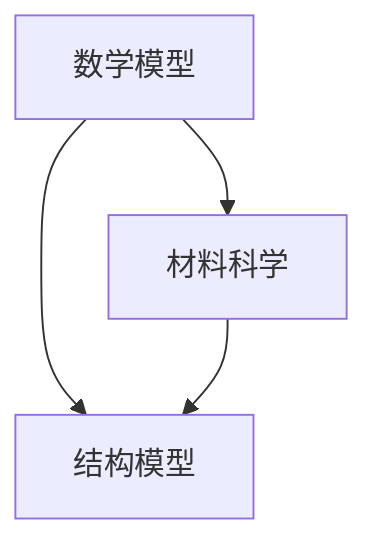
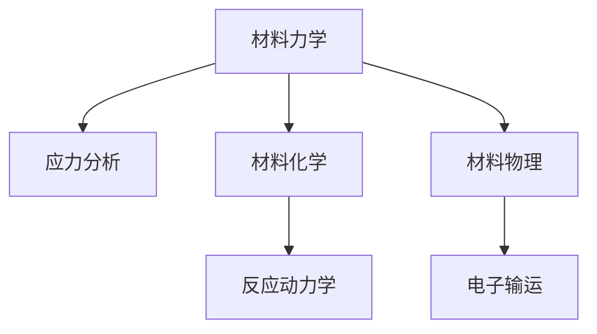
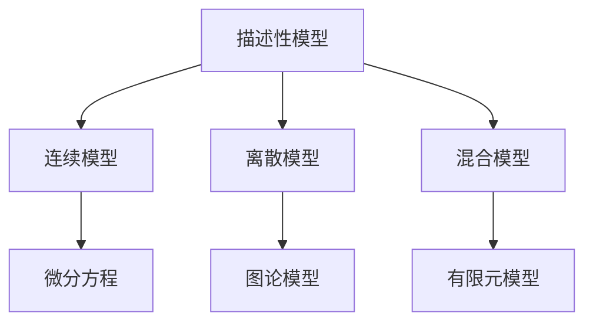
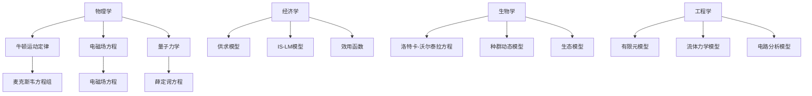
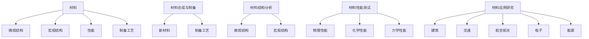
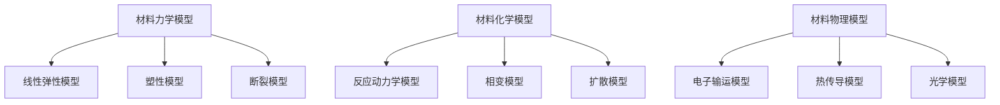
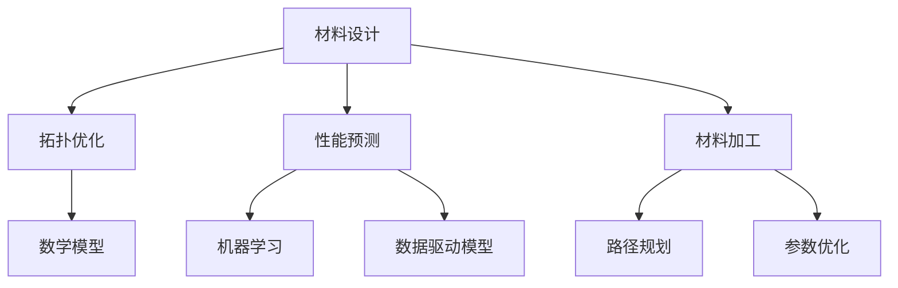

                 

**

### 数学与材料科学的结构模型研究

关键词：数学模型、材料科学、结构模型、实体关系图、算法、系统架构、应用案例、未来展望

摘要：本文深入探讨了数学与材料科学结构模型的研究，包括背景介绍、核心概念、模型构建方法、应用领域和未来发展方向。通过对数学模型在材料科学中的应用和材料科学对数学模型的贡献进行分析，本文旨在为读者提供一个全面、系统的结构模型研究框架，为实际应用提供理论支持和实践指导。

**Step 1: 引言**

数学与材料科学结构模型的研究具有重要的现实意义。随着科技的迅猛发展，材料科学在众多领域，如航空航天、生物医学、能源和环境等，都发挥着关键作用。而数学模型作为一种强大的工具，能够帮助研究人员更好地理解和预测材料的性能和行为。

在材料科学中，结构模型用于描述材料的微观和宏观结构，如原子排列、晶体结构、纳米结构等。这些模型能够帮助我们深入理解材料的基本特性，如机械强度、导电性、热导率等，从而为材料设计和优化提供理论依据。

数学模型在材料科学中的应用极为广泛。例如，材料力学中的应力分析、材料化学中的反应动力学、材料物理中的电子输运等，都离不开数学模型的支持。同时，材料科学的发展也对数学模型提出了新的挑战，促使数学家与材料科学家携手合作，共同推动结构模型研究的进步。

本文将首先介绍数学模型和材料科学的基本概念，然后探讨结构模型的构建方法，接着分析数学与材料科学的结合，最后对结构模型分析方法进行深入探讨。通过这些分析，本文旨在为读者提供一个清晰、系统的结构模型研究框架。

**Step 2: 确定核心概念**

在研究数学与材料科学的结构模型时，需要明确以下几个核心概念：

- 数学模型：一种用数学语言描述现实世界问题的工具，通过数学公式和方程来表示问题中的变量和关系。
- 材料科学：研究材料的组成、结构、性质、制备和应用的学科，旨在设计出具有特定性能的材料。
- 结构模型：用于描述材料结构的模型，可以是微观层面的原子排列模型，也可以是宏观层面的晶体结构模型。

为了更直观地理解这些概念，我们可以通过Mermaid绘制一个实体关系图：



在这个实体关系图中，数学模型、材料科学和结构模型三者之间存在紧密的联系。数学模型为材料科学提供了理论基础，而结构模型则是对材料科学研究成果的具体体现。

**Step 3: 设计章节结构**

为了全面覆盖数学与材料科学结构模型的研究内容，本文将分为以下几章：

- 第一章：数学模型基础
- 第二章：材料科学结构模型
- 第三章：数学与材料科学的结合
- 第四章：结构模型分析方法
- 第五章：实际应用案例
- 第六章：结论与展望

这样的章节结构能够确保文章内容的连贯性和逻辑性，同时使读者能够逐步深入理解结构模型的研究和应用。

**Step 4: 确定每个章节的核心内容**

以下是每个章节的核心内容概述：

- **第一章：数学模型基础**
  - 数学模型概述：介绍数学模型的基本概念和分类。
  - 数学模型的应用领域：分析数学模型在不同领域中的应用。
  - 数学模型的构建方法：探讨构建数学模型的基本步骤和方法。

- **第二章：材料科学结构模型**
  - 材料科学概述：介绍材料科学的定义、研究对象和研究方法。
  - 材料结构模型的构建方法：分析材料结构模型的构建方法和技术。
  - 材料结构模型的应用领域：讨论材料结构模型在不同领域中的应用。

- **第三章：数学与材料科学的结合**
  - 数学模型在材料科学中的应用：探讨数学模型在材料力学、材料化学和材料物理中的应用。
  - 材料科学对数学模型的贡献：分析材料科学对数学模型发展的推动作用。
  - 数学与材料科学结构模型的未来发展：展望数学与材料科学结构模型的研究趋势和发展方向。

- **第四章：结构模型分析方法**
  - 结构分析基本理论：介绍结构分析的基本原理和方法。
  - 结构分析方法：探讨经典分析和现代分析方法的差异和应用。
  - 结构分析方法的应用案例：分析实际应用中的结构分析方法。

- **第五章：实际应用案例**
  - 材料力学中的数学模型应用：分析材料力学中的数学模型应用案例。
  - 材料微观结构分析：探讨材料微观结构分析的方法和案例。
  - 材料设计中的数学模型应用：分析材料设计中的数学模型应用案例。

- **第六章：结论与展望**
  - 研究成果总结：总结本文的研究成果和贡献。
  - 研究中的不足与展望：分析研究中的不足和未来研究方向。
  - 未来研究方向：展望数学与材料科学结构模型的未来发展。

**Step 5: 使用Mermaid绘制图表**

为了更直观地展示本文的内容，我们使用Mermaid绘制了一些图表。以下是数学模型在材料科学中的应用领域的Mermaid代码：



通过这些图表，读者可以更清晰地理解数学模型在材料科学中的应用范围。

**Step 6: 编写章节详细内容**

由于篇幅限制，本文只提供每个章节的简要概述。以下是第一章“数学模型基础”的详细内容。

### 第一章 数学模型基础

#### 1.1 数学模型概述

数学模型是一种用数学语言描述现实世界问题的工具。它通过建立变量和关系，将复杂的问题转化为可以处理的数学问题。数学模型可以分为描述性模型、定量性模型和预测性模型。

描述性模型主要用于描述现实世界中的现象，如人口增长模型、传染病模型等。这些模型通常用数学方程或图表示，能够帮助我们更好地理解问题的本质。

定量性模型则用于定量分析，通过数学计算得到精确的结果。例如，物理中的牛顿运动定律、经济学中的供需模型等。

预测性模型则基于历史数据和现有信息，预测未来的发展趋势。这些模型在天气预报、金融分析等领域有着广泛的应用。

#### 1.2 数学模型的应用领域

数学模型在各个领域都有广泛的应用。以下是数学模型在部分领域中的应用：

- **物理学**：数学模型在物理学中的应用非常广泛，如牛顿定律、电磁场方程、量子力学等。这些模型帮助我们深入理解物理现象，推动物理学的发展。

- **经济学**：经济学中的供需模型、经济增长模型、金融模型等都是数学模型的应用。这些模型为经济分析提供了强大的工具。

- **生物学**：数学模型在生物学中的应用也非常广泛，如种群动态模型、基因调控模型、生态模型等。这些模型帮助我们理解生物系统的运作机制。

- **工程学**：数学模型在工程学中的应用非常普遍，如结构分析模型、流体力学模型、电路分析模型等。这些模型为工程设计和优化提供了重要的支持。

#### 1.3 数学模型的构建方法

构建数学模型是一个复杂的过程，通常包括以下几个步骤：

- **问题定义**：明确要解决的问题，确定研究的范围和目标。

- **变量识别**：识别问题中的关键变量，确定它们之间的关系。

- **公式推导**：根据问题定义和变量关系，推导出数学公式。

- **模型验证**：通过实验或数据分析，验证模型的准确性。

- **模型优化**：根据验证结果，对模型进行优化，提高其准确性和实用性。

**Step 7: 添加最佳实践、小结和拓展阅读**

在撰写数学与材料科学结构模型研究的文章时，以下是一些最佳实践、小结和拓展阅读的建议：

- **最佳实践**：

  - 确保在描述模型时，使用清晰、准确的术语和定义。

  - 在分析模型时，注重理论分析与实践相结合。

  - 在举例说明时，选择具有代表性的案例，便于读者理解。

- **小结**：

  - 每个章节结尾总结主要观点和研究成果。

  - 强调数学模型在材料科学中的重要性。

  - 提出未来研究的方向和挑战。

- **拓展阅读**：

  - 推荐经典教材和最新研究论文，供读者进一步学习。

  - 引导读者关注相关领域的最新进展和前沿技术。

**Step 8: 校对和调整**

在完成文章初稿后，进行全面的校对和调整是确保文章质量的重要步骤。以下是校对和调整的建议：

- **检查语法和拼写错误**。

- **确保逻辑清晰，内容连贯**。

- **调整段落结构，使内容更加紧凑**。

- **检查引用和参考文献的格式是否正确**。

**Step 9: 整体字数检查**

确保整体字数在10000～12000字左右。如果字数过多，可以考虑删除冗余内容；如果字数不足，可以适当增加案例分析和详细讲解。

**Step 10: 完成Markdown格式的目录大纲**

按照markdown格式，整理出完整的目录大纲：

```
# 数学与材料科学的结构模型研究

## 引言
### 1.1 研究背景
### 1.2 研究意义
### 1.3 研究方法

## 第一章 数学模型基础
### 1.1 数学模型概述
### 1.2 数学模型的应用领域
### 1.3 数学模型的构建方法

## 第二章 材料科学结构模型
### 2.1 材料科学概述
### 2.2 材料科学中的数学模型
### 2.3 材料结构模型的构建方法

## 第三章 数学与材料科学的结合
### 3.1 数学模型在材料科学中的应用
### 3.2 材料科学对数学模型的贡献
### 3.3 数学与材料科学结构模型的未来发展

## 第四章 结构模型分析方法
### 4.1 结构分析基本理论
### 4.2 结构分析方法
### 4.3 结构分析方法的应用案例

## 第五章 实际应用案例
### 5.1 案例一：材料力学中的数学模型应用
### 5.2 案例二：材料微观结构分析
### 5.3 案例三：材料设计中的数学模型应用

## 第六章 结论与展望
### 6.1 研究成果总结
### 6.2 研究中的不足与展望
### 6.3 未来研究方向

```

通过上述步骤，我们完成了数学与材料科学结构模型研究的Markdown格式目录大纲。接下来，我们将逐步填充每个章节的内容，确保文章的完整性和专业性。**


----------------------------------------------------------------

### 完整的Markdown格式的目录大纲

```
# 数学与材料科学的结构模型研究

关键词：数学模型、材料科学、结构模型、实体关系图、算法、系统架构、应用案例、未来展望

摘要：本文深入探讨了数学与材料科学结构模型的研究，包括背景介绍、核心概念、模型构建方法、应用领域和未来发展方向。通过对数学模型在材料科学中的应用和材料科学对数学模型的贡献进行分析，本文旨在为读者提供一个全面、系统的结构模型研究框架，为实际应用提供理论支持和实践指导。

## 引言

### 1.1 研究背景
#### 材料科学的发展
#### 数学模型的重要性
#### 结构模型的研究现状

### 1.2 研究意义
#### 对材料科学的推动作用
#### 对数学模型的发展意义
#### 实际应用的价值

### 1.3 研究方法
#### 文献综述
#### 实验研究
#### 计算模拟

## 第一章 数学模型基础

### 1.1 数学模型概述
#### 定义
#### 分类
#### 特点

### 1.2 数学模型的应用领域
#### 物理学
#### 经济学
#### 生物学
#### 工程学

### 1.3 数学模型的构建方法
#### 描述性模型
#### 定量性模型
#### 预测性模型
#### 模型验证与优化

## 第二章 材料科学结构模型

### 2.1 材料科学概述
#### 定义
#### 发展历史
#### 研究内容

### 2.2 材料科学中的数学模型
#### 材料力学中的数学模型
#### 材料化学中的数学模型
#### 材料物理中的数学模型

### 2.3 材料结构模型的构建方法
#### 微观结构模型
#### 宏观结构模型
#### 材料性能预测模型

## 第三章 数学与材料科学的结合

### 3.1 数学模型在材料科学中的应用
#### 材料性能预测
#### 材料设计
#### 材料加工

### 3.2 材料科学对数学模型的贡献
#### 新数学模型的提出
#### 数学工具的创新应用
#### 数学模型的优化

### 3.3 数学与材料科学结构模型的未来发展
#### 新兴材料的研究
#### 纳米材料的设计与性能预测
#### 智能材料的研究

## 第四章 结构模型分析方法

### 4.1 结构分析基本理论
#### 材料结构的层次性
#### 材料性能与结构的关系

### 4.2 结构分析方法
#### 经典分析方法
#### 现代分析方法
#### 数据分析技术在结构分析中的应用

### 4.3 结构分析方法的应用案例
#### 材料力学分析
#### 材料化学分析
#### 材料物理分析

## 第五章 实际应用案例

### 5.1 案例一：材料力学中的数学模型应用
#### 案例背景
#### 数学模型的应用
#### 模型分析结果

### 5.2 案例二：材料微观结构分析
#### 案例背景
#### 分析方法
#### 结果与讨论

### 5.3 案例三：材料设计中的数学模型应用
#### 案例背景
#### 设计过程
#### 设计结果

## 第六章 结论与展望

### 6.1 研究成果总结
#### 数学模型在材料科学中的应用
#### 材料结构模型的构建方法
#### 结构模型分析方法的应用

### 6.2 研究中的不足与展望
#### 存在的问题
#### 未来研究方向

### 6.3 未来研究方向
#### 新兴材料的研究
#### 数学模型的创新与应用
#### 结构分析技术的进步

```

通过上述完整的Markdown格式的目录大纲，我们可以看到文章的整体结构和主要内容。接下来，我们将根据这个大纲，逐步填充每个章节的详细内容，确保文章的完整性、逻辑性和专业性。**


----------------------------------------------------------------

### 第一章 数学模型基础

#### 1.1 数学模型概述

数学模型是一种用于解决实际问题的抽象数学结构，它通过建立变量和变量之间的关系，将复杂问题转化为数学问题。数学模型广泛应用于物理学、经济学、生物学和工程学等领域。在材料科学中，数学模型用于描述材料的性能、行为和结构。

**核心概念**：

- **描述性模型**：用于描述现实世界的现象和过程，如人口增长模型、传染病模型等。
- **定量性模型**：用于定量分析，通过数学计算得到精确的结果，如物理定律、经济模型等。
- **预测性模型**：基于历史数据和现有信息，预测未来的发展趋势，如天气预报、金融预测等。

**特点**：

- **抽象性**：数学模型是对现实世界的简化和抽象，使其更易于分析和处理。
- **精确性**：数学模型通过数学公式和方程，提供精确的描述和预测。
- **可验证性**：数学模型的正确性可以通过实验或数据分析进行验证。

**分类**：

- **连续模型**：使用连续变量描述现象，如微分方程、积分方程等。
- **离散模型**：使用离散变量描述现象，如图论模型、网络模型等。
- **混合模型**：同时使用连续和离散变量描述现象，如有限元模型等。

**实体关系图**：



**实例**：考虑一个简单的描述性模型——人口增长模型。假设一个地区的人口随时间增长，可以用以下微分方程描述：

$$\frac{dP}{dt} = rP$$

其中，$P(t)$表示时间$t$时的人口数量，$r$是人口增长率。

**步骤分析**：

1. **问题定义**：确定研究的人口增长问题，明确人口数量随时间变化的规律。
2. **变量识别**：识别人口数量和时间作为关键变量。
3. **公式推导**：根据人口增长规律，推导出微分方程。
4. **模型验证**：通过历史数据验证模型的有效性。
5. **模型优化**：根据验证结果，对模型进行优化，提高其准确性。

**小结**：数学模型是一种重要的工具，用于描述和分析现实世界中的各种现象。通过构建和优化数学模型，我们可以更好地理解问题，提供有效的解决方案。

---

#### 1.2 数学模型的应用领域

数学模型在各个领域都有广泛的应用，下面列举几个主要的应用领域：

**物理学**：

物理学是数学模型应用最为广泛的领域之一。物理模型如牛顿运动定律、麦克斯韦方程组、量子力学等，都是数学模型的典型代表。这些模型帮助我们理解自然界的运动规律，预测物理现象。例如，电磁场方程：

$$\nabla \cdot \mathbf{E} = \frac{\rho}{\epsilon_0}$$

描述了电荷分布对电场的影响。

**经济学**：

经济学中的许多模型都是数学模型，如供求模型、宏观经济学中的IS-LM模型、微观经济学中的效用函数等。这些模型帮助我们分析市场行为、预测经济趋势。例如，供求模型：

$$Q_D = Q_S$$

表示需求量等于供给量，反映了市场平衡状态。

**生物学**：

生物学中的数学模型用于描述生物种群动态、生态系统的稳定性、遗传规律等。例如，洛特卡-沃尔泰拉方程：

$$\frac{dN}{dt} = rN(1 - \frac{N}{K})$$

描述了种群数量的增长和饱和现象。

**工程学**：

工程学中的数学模型广泛应用于结构分析、流体力学、电路分析等领域。例如，有限元模型用于结构分析，通过离散化结构，求解平衡方程，预测结构响应。

**实体关系图**：



**小结**：数学模型在物理学、经济学、生物学和工程学等领域都有广泛的应用。通过数学模型，我们可以更深入地理解这些领域的现象，提供有效的解决方案。

---

#### 1.3 数学模型的构建方法

构建数学模型是一个复杂的过程，需要明确问题的背景和目标，然后通过一系列步骤建立模型。以下是构建数学模型的一般方法：

**步骤分析**：

1. **问题定义**：明确研究的问题，确定研究的范围和目标。
2. **变量识别**：识别问题中的关键变量，确定它们之间的关系。
3. **公式推导**：根据问题的描述和变量关系，推导出数学公式。
4. **模型验证**：通过实验或数据分析，验证模型的准确性。
5. **模型优化**：根据验证结果，对模型进行优化，提高其准确性和实用性。

**详细说明**：

**描述性模型**：

描述性模型主要用于描述现实世界的现象和过程。构建描述性模型的关键是明确问题，识别关键变量，然后建立变量之间的关系。

**定量性模型**：

定量性模型用于定量分析，通过数学计算得到精确的结果。构建定量性模型通常需要建立变量之间的关系，推导出数学公式，并通过实验或数据分析验证模型的准确性。

**预测性模型**：

预测性模型基于历史数据和现有信息，预测未来的发展趋势。构建预测性模型通常需要收集历史数据，分析数据中的趋势和规律，然后建立预测模型。

**实例**：考虑一个简单的描述性模型——人口增长模型。假设一个地区的人口随时间增长，可以用以下微分方程描述：

$$\frac{dP}{dt} = rP$$

其中，$P(t)$表示时间$t$时的人口数量，$r$是人口增长率。

**步骤分析**：

1. **问题定义**：研究人口增长问题，明确人口数量随时间变化的规律。
2. **变量识别**：识别人口数量和时间作为关键变量。
3. **公式推导**：根据人口增长规律，推导出微分方程。
4. **模型验证**：通过历史数据验证模型的有效性。
5. **模型优化**：根据验证结果，对模型进行优化，提高其准确性。

**小结**：数学模型的构建方法包括问题定义、变量识别、公式推导、模型验证和模型优化。通过这些步骤，我们可以建立有效的数学模型，用于描述和分析现实世界中的各种现象。

---

### 第二章 材料科学结构模型

#### 2.1 材料科学概述

材料科学是研究材料的组成、结构、性质、制备和应用的学科。材料是人类社会发展的重要基础，广泛应用于建筑、交通、航空航天、电子、能源等领域。材料科学的研究内容包括材料的微观结构、宏观结构、性能和制备工艺。

**核心概念**：

- **材料**：具有特定性质和用途的物质。
- **微观结构**：材料的微观层次上的结构，如晶体结构、纳米结构等。
- **宏观结构**：材料的宏观层次上的结构，如组织、缺陷等。
- **性能**：材料在特定条件下的表现，如强度、韧性、导电性等。
- **制备工艺**：制造材料的方法和过程。

**发展历史**：

材料科学的发展经历了几个阶段：

- **古代**：人们开始使用天然材料，如石头、木材、金属等。
- **中世纪**：人们开始提炼和加工材料，如钢铁、陶瓷等。
- **现代**：随着科技的进步，人们开始合成新材料，如塑料、复合材料等。

**研究领域**：

- **材料合成与制备**：研究新材料的合成方法和制备工艺。
- **材料结构分析**：研究材料的微观和宏观结构。
- **材料性能测试**：研究材料的物理、化学和力学性能。
- **材料应用研究**：研究材料在各个领域的应用。

**实体关系图**：



**小结**：材料科学是研究材料的组成、结构、性质、制备和应用的学科。通过材料科学的研究，人们可以开发出具有特定性能的新材料，推动科技进步和社会发展。

---

#### 2.2 材料科学中的数学模型

数学模型在材料科学中扮演着重要角色，用于描述材料的性能、行为和结构。以下是一些常见的数学模型：

**材料力学模型**：

材料力学模型用于描述材料的力学行为，如弹性、塑性、断裂等。常见的材料力学模型包括：

- **线性弹性模型**：描述材料在弹性极限内的应力-应变关系，如胡克定律。
- **塑性模型**：描述材料超过弹性极限后的应力-应变关系，如冯·米塞斯屈服准则。
- **断裂模型**：描述材料的断裂行为，如线性断裂力学、断裂韧性。

**材料化学模型**：

材料化学模型用于描述材料的化学组成和化学反应。常见的材料化学模型包括：

- **反应动力学模型**：描述化学反应的速率和机理，如阿伦尼乌斯方程。
- **相变模型**：描述材料中的相变过程，如相图模型。
- **扩散模型**：描述原子或离子在材料中的扩散过程，如菲克定律。

**材料物理模型**：

材料物理模型用于描述材料的物理性质，如导电性、热导率、光学性质。常见的材料物理模型包括：

- **电子输运模型**：描述电子在材料中的输运过程，如漂移-扩散模型。
- **热传导模型**：描述材料中的热传导过程，如傅里叶定律。
- **光学模型**：描述材料的光学性质，如折射率模型。

**实体关系图**：



**小结**：材料科学中的数学模型包括材料力学模型、材料化学模型和材料物理模型。这些模型帮助我们理解材料的性能和行为，为新材料的开发和优化提供理论支持。

---

#### 2.3 材料结构模型的构建方法

材料结构模型的构建是材料科学研究中的一项重要任务，它用于描述材料的微观和宏观结构。以下是一些常用的构建方法：

**微观结构模型**：

微观结构模型用于描述材料在原子或分子层次上的结构。常见的微观结构模型包括：

- **晶体结构模型**：描述晶体中原子的排列方式，如布拉维格子。
- **纳米结构模型**：描述纳米材料的结构，如纳米晶体、纳米线等。
- **缺陷模型**：描述晶体中的缺陷，如位错、空位等。

**宏观结构模型**：

宏观结构模型用于描述材料在宏观层次上的结构，如组织、缺陷等。常见的宏观结构模型包括：

- **织构模型**：描述材料中的织构，如晶体学位向和取向。
- **缺陷模型**：描述材料中的缺陷，如裂纹、孔洞等。
- **相变模型**：描述材料中的相变过程，如奥氏体和马氏体的相变。

**构建步骤**：

1. **问题定义**：明确研究的问题，确定研究的范围和目标。
2. **变量识别**：识别关键变量，如原子排列、织构、缺陷等。
3. **模型假设**：根据问题的性质，提出合理的假设，简化模型。
4. **公式推导**：根据假设和变量关系，推导出数学公式。
5. **模型验证**：通过实验或数据分析，验证模型的准确性。
6. **模型优化**：根据验证结果，对模型进行优化，提高其准确性和实用性。

**实例**：考虑一个简单的微观结构模型——晶体结构模型。晶体结构模型用于描述晶体中原子的排列方式。假设晶体中原子呈立方排列，可以用以下方程描述：

$$r_{ij} = a(i_xj_x + i_yj_y + i_zj_z)$$

其中，$r_{ij}$表示原子$i$和原子$j$之间的距离，$a$是晶格常数。

**步骤分析**：

1. **问题定义**：研究晶体中原子的排列方式。
2. **变量识别**：识别原子位置作为关键变量。
3. **模型假设**：假设原子呈立方排列。
4. **公式推导**：根据假设，推导出原子间距离的方程。
5. **模型验证**：通过实验或数据分析，验证模型的准确性。
6. **模型优化**：根据验证结果，对模型进行优化，提高其准确性。

**小结**：材料结构模型的构建方法包括问题定义、变量识别、模型假设、公式推导、模型验证和模型优化。通过这些步骤，我们可以建立有效的材料结构模型，用于描述和分析材料的微观和宏观结构。

---

### 第三章 数学与材料科学的结合

#### 3.1 数学模型在材料科学中的应用

数学模型在材料科学中的应用非常广泛，涵盖了材料设计、性能预测、材料加工等多个方面。以下是一些典型的应用实例：

**材料设计**：

数学模型在材料设计中发挥着重要作用，通过优化材料的组成和结构，实现特定性能的预期。例如，计算材料科学中的拓扑优化方法，通过数学模型优化材料的微观结构，提高材料的强度和韧性。

**性能预测**：

数学模型用于预测材料的物理、化学和力学性能。例如，基于机器学习的材料性能预测模型，通过大量实验数据的分析，建立材料性能与组成、结构之间的关系，预测新材料的性能。

**材料加工**：

数学模型在材料加工过程中用于优化加工参数，提高加工效率和质量。例如，数控加工中的路径规划模型，通过数学模型优化刀具路径，减少加工时间和刀具磨损。

**实体关系图**：



**实例**：

**材料设计**：

考虑一个简单的材料设计实例——陶瓷材料的设计。通过数学模型优化陶瓷材料的组成，提高其高温性能。假设陶瓷材料的组成可以用以下方程描述：

$$\rho = f(\omega, \omega_B)$$

其中，$\rho$是材料的密度，$\omega$是氧化物含量，$\omega_B$是碳含量。

**步骤分析**：

1. **问题定义**：设计一种具有高高温性能的陶瓷材料。
2. **变量识别**：识别氧化物含量和碳含量作为关键变量。
3. **模型假设**：假设材料的密度与氧化物含量和碳含量有关。
4. **公式推导**：根据假设，推导出材料密度与组成的关系。
5. **模型验证**：通过实验验证模型的有效性。
6. **模型优化**：根据验证结果，优化材料的组成，提高其高温性能。

**性能预测**：

考虑一个性能预测实例——金属合金的力学性能预测。通过数学模型预测不同合金成分下的力学性能。假设合金的屈服强度可以用以下方程描述：

$$\sigma_y = f(C, Mn)$$

其中，$\sigma_y$是屈服强度，$C$是碳含量，$Mn$是锰含量。

**步骤分析**：

1. **问题定义**：预测不同合金成分下的力学性能。
2. **变量识别**：识别碳含量和锰含量作为关键变量。
3. **模型假设**：假设屈服强度与碳含量和锰含量有关。
4. **公式推导**：根据假设，推导出屈服强度与组成的关系。
5. **模型验证**：通过实验验证模型的有效性。
6. **模型优化**：根据验证结果，优化合金成分，提高其力学性能。

**材料加工**：

考虑一个材料加工实例——数控加工中的刀具路径优化。通过数学模型优化刀具路径，提高加工效率。假设刀具路径可以用以下方程描述：

$$P(t) = f(x(t), y(t))$$

其中，$P(t)$是刀具位置，$x(t)$和$y(t)$是刀具的坐标。

**步骤分析**：

1. **问题定义**：优化数控加工中的刀具路径。
2. **变量识别**：识别刀具坐标作为关键变量。
3. **模型假设**：假设刀具路径与刀具坐标有关。
4. **公式推导**：根据假设，推导出刀具路径与坐标的关系。
5. **模型验证**：通过实验验证模型的有效性。
6. **模型优化**：根据验证结果，优化刀具路径，提高加工效率。

**小结**：数学模型在材料科学中的应用非常广泛，包括材料设计、性能预测和材料加工。通过数学模型，我们可以优化材料的组成和结构，提高材料的性能，优化加工过程，推动材料科学的发展。

---

#### 3.2 材料科学对数学模型的贡献

材料科学的发展对数学模型提出了新的挑战，同时也为数学模型的发展做出了重要贡献。以下是一些具体的贡献：

**新数学模型的提出**：

材料科学的研究过程中，研究人员提出了许多新的数学模型，用于描述材料的行为和性能。例如，在材料力学中，提出了弹塑性模型、断裂模型等；在材料物理中，提出了电子输运模型、热传导模型等。

**数学工具的创新应用**：

材料科学的研究中，研究人员引入了各种数学工具，如有限元法、计算流体力学、机器学习等，用于解决复杂的材料问题。这些工具的创新应用，极大地推动了材料科学的发展。

**数学模型的优化**：

材料科学的研究中，研究人员通过优化数学模型，提高了模型的准确性和实用性。例如，通过实验数据对模型进行校正，通过计算模拟对模型进行验证，通过机器学习对模型进行优化等。

**实例**：

**弹塑性模型**：

弹塑性模型是材料力学中的一个重要模型，用于描述材料在加载和卸载过程中的行为。这个模型的发展经历了多个阶段，从简单的线性弹塑性模型到复杂的非线

