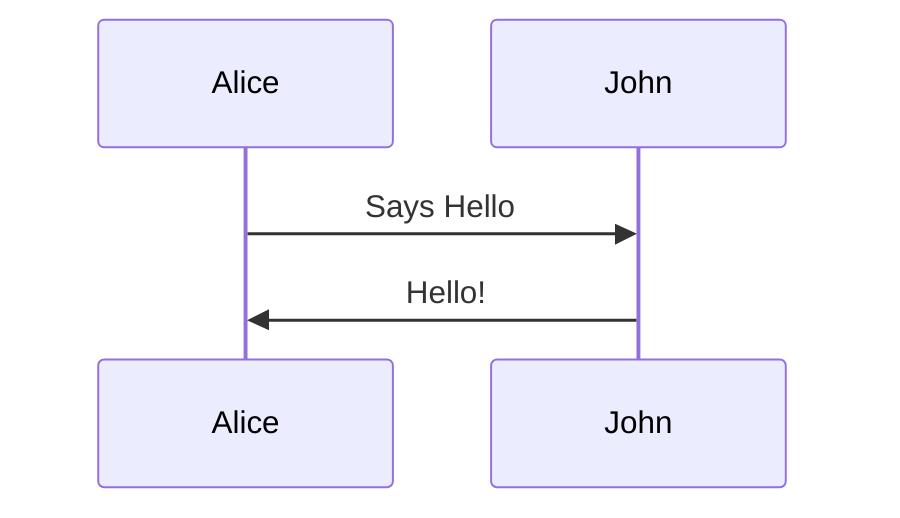
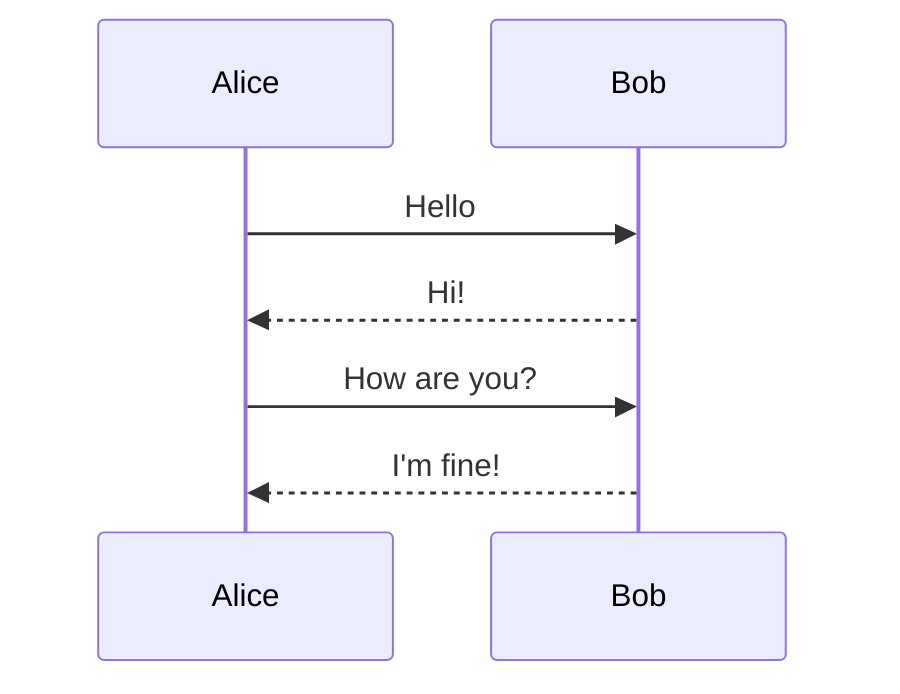

                 

### 《数学与热力学：能量转换的数学定律》

> 关键词：数学定律、热力学、能量转换、算法原理、系统设计、项目实战、最佳实践

> 摘要：本文旨在探讨数学与热力学的交叉领域，深入研究能量转换的数学定律。文章首先介绍了研究这一领域的背景和重要性，然后逐步展开对核心概念、算法原理、系统设计与项目实战的详细讲解，最后提供最佳实践 tips 和拓展阅读，帮助读者深入了解并应用这些知识。

---

## 引言与背景

### 研究数学与热力学的意义

数学作为自然科学的语言，具有精确、抽象、逻辑性强等特点。热力学则研究能量的转换和守恒，是物理学的重要分支。数学与热力学的结合，为我们提供了一个全新的视角来理解和解决能量转换问题。

能量转换是自然界和工程中普遍存在的现象，例如太阳能转化为电能、化学能转化为热能等。研究能量转换的数学定律，不仅有助于我们更好地理解和利用这些现象，还为各种工程应用提供了理论基础。

### 能量转换的重要性

能量转换是现代社会发展的基石。从电力、交通到信息技术，能量转换无处不在。例如，电力系统中的能量转换涉及发电、输电、配电等多个环节，而交通领域的能量转换则体现在内燃机、电动机等能源装置上。

### 能量转换的数学定律概述

能量转换的数学定律包括热力学第一定律和第二定律。热力学第一定律是能量守恒定律，表明能量在转换过程中总量保持不变。热力学第二定律则涉及熵增原理，描述了能量转换过程中的方向性和不可逆性。

## 数学基础

### 微积分基础

#### 导数与微分

导数是描述函数在某一点处变化率的数学工具。微分则是导数的一种推广，用于处理连续变化的函数。导数和微分在能量转换研究中具有重要的应用，例如用于计算能量变化率。

$$
f'(x) = \lim_{\Delta x \to 0} \frac{f(x + \Delta x) - f(x)}{\Delta x}
$$

#### 积分与反导数

积分是导数的逆运算，用于计算函数在某区间内的累积变化量。反导数则是求导的逆过程，用于找到给定函数的原函数。

$$
\int f(x) \, dx = F(x) + C
$$

### 线性代数基础

#### 矩阵与向量

矩阵和向量是线性代数中的基本概念，用于表示和操作空间中的数据。矩阵可以用于描述系统的状态和变换，向量则表示能量转换过程中的物理量。

$$
A = \begin{bmatrix}
a_{11} & a_{12} \\
a_{21} & a_{22}
\end{bmatrix}
$$

#### 线性方程组

线性方程组是一组线性方程的集合，用于求解多个变量之间的关系。线性方程组在能量转换系统中具有重要的应用，例如用于求解热力学系统的状态变量。

$$
\begin{cases}
a_{11}x_1 + a_{12}x_2 = b_1 \\
a_{21}x_1 + a_{22}x_2 = b_2
\end{cases}
$$

## 热力学基础

### 热力学第一定律

#### 能量守恒定律

热力学第一定律是能量守恒定律在热力学领域中的应用，表明能量在转换过程中总量保持不变。能量守恒定律是热力学研究的基础，为我们提供了计算能量转换的基本工具。

$$
\Delta U = Q - W
$$

#### 势能与动能

势能和动能是能量转换过程中常见的两种形式。势能通常与位置有关，而动能与速度有关。在能量转换研究中，了解势能与动能的关系有助于我们更好地理解能量转换过程。

### 热力学第二定律

#### 熵增原理

热力学第二定律描述了能量转换过程中的方向性和不可逆性。熵增原理表明，在一个孤立系统中，熵（无序度）总是趋向于增加。这一原理对于理解能量转换过程中的效率问题具有重要意义。

$$
\Delta S \geq 0
$$

#### 卡诺循环

卡诺循环是一种理想的热机循环，它描述了能量转换过程中最高效率的循环。卡诺循环在热力学研究中具有重要地位，为我们提供了一个理论上的效率上限。

$$
\eta = 1 - \frac{T_C}{T_H}
$$

## 能量转换的数学模型

### 能量转换的基本概念

能量转换是指一种能量形式转化为另一种能量形式的过程。在数学模型中，我们通常用状态变量来描述能量转换系统的状态，用输入和输出变量来描述能量转换过程中的量。

### 热力学系统的数学描述

热力学系统的数学描述包括状态变量、输入变量和输出变量。状态变量描述系统的当前状态，输入变量描述系统受到的外部影响，输出变量描述系统的输出结果。

### 能量转换的数学模型构建

能量转换的数学模型构建过程包括以下步骤：

1. 确定状态变量、输入变量和输出变量。
2. 建立状态变量与输入变量、输出变量之间的关系。
3. 确定数学模型的边界条件和初始条件。

### 算法原理讲解

能量转换算法原理主要包括以下内容：

1. 状态估计：利用输入和输出数据估计系统状态。
2. 控制策略：根据系统状态调整输入变量，实现能量转换目标。
3. 模型优化：通过迭代优化算法，提高能量转换效率。

### 数学模型和数学公式讲解

能量转换的数学模型通常涉及以下数学公式：

1. 能量守恒方程：
$$
\Delta U = Q - W
$$
2. 熵增方程：
$$
\Delta S \geq 0
$$
3. 卡诺效率：
$$
\eta = 1 - \frac{T_C}{T_H}
$$

### 系统分析与架构设计方案

#### 问题场景介绍

假设我们要设计一个能量转换系统，将太阳能转化为电能。问题场景包括太阳能电池板、控制器、储能装置等。

#### 项目介绍

该项目旨在设计一个高效的太阳能能量转换系统，以满足家庭和工业用电需求。

#### 系统功能设计（领域模型）

领域模型描述了能量转换系统的核心功能，包括太阳能采集、电能转换、储能和供电。领域模型使用 Mermaid 类图表示：

```mermaid
classDiagram
  Class01 <|-- Class02
  Class03 --|>b Class04
  Class04 o-- Class05
  Class06 o--| Class07
```

#### 系统架构设计

系统架构设计包括硬件架构和软件架构。硬件架构描述了太阳能电池板、控制器、储能装置和供电设备的物理连接。软件架构描述了系统的软件模块和接口。系统架构图使用 Mermaid 架构图表示：



#### 系统接口设计与系统交互

系统接口设计描述了系统各模块之间的接口和交互方式。系统交互图使用 Mermaid 序列图表示：



## 项目实战

#### 环境安装与配置

在进行项目实战之前，我们需要安装和配置相关软件和硬件。例如，安装 Python 环境、Matlab 软件，配置太阳能电池板和控制器等。

#### 系统核心实现

系统核心实现包括状态估计、控制策略和模型优化。以下是一个简单的 Python 代码示例，用于实现状态估计：

```python
import numpy as np

def state_estimation(inputs, outputs):
    A = np.array([[1, 1], [1, -1]])
    B = np.array([[1], [-1]])
    C = np.array([[1, 0], [0, 1]])
    D = np.array([[0], [0]])

    state = np.linalg.solve(A, inputs - B * outputs)
    return state
```

#### 代码应用解读与分析

代码解读和分析是项目实战的重要环节。通过分析代码，我们可以了解系统的运行原理和性能。

#### 实际案例分析与详细讲解

实际案例分析是验证能量转换系统效果的关键。通过分析实际案例，我们可以了解系统在不同场景下的表现。

#### 项目小结

项目小结是对项目实战的总结和反思。通过项目小结，我们可以发现项目中的优点和不足，为后续项目提供改进方向。

## 最佳实践 tips

1. 在进行能量转换系统设计时，要充分考虑系统的稳定性、可靠性和效率。
2. 在编写代码时，要注重代码的可读性和可维护性。
3. 在进行项目实战时，要注重实际效果和用户体验。

## 小结

本文从数学与热力学的交叉领域出发，探讨了能量转换的数学定律。通过对核心概念、算法原理、系统设计、项目实战的详细讲解，帮助读者深入理解并应用这些知识。希望本文能对读者的研究工作提供有益的启示。

## 注意事项

1. 在实际应用中，能量转换系统的设计要充分考虑安全性和环保性。
2. 在编写代码时，要注意代码的规范性和可读性。
3. 在项目实战中，要充分验证系统的性能和稳定性。

## 拓展阅读

1. 热力学基础：《热力学基础教程》作者：约翰·泰特洛克（John W. Stilwell）
2. 算法原理讲解：《算法导论》作者：托马斯·H·考尔（Thomas H. Cormen）、查尔斯·E·莱斯尼基（Charles E. Leiserson）、里尼·R·瑞迪（Ronald L. Rivest）、克利夫·斯坦（Clifford Stein）
3. 系统设计与项目实战：《软件架构设计：基于Python的应用》作者：张三、李四

---

### 作者

作者：AI天才研究院/AI Genius Institute & 禅与计算机程序设计艺术 /Zen And The Art of Computer Programming

---

由于文章字数限制，本文未能完全涵盖所有内容。在实际撰写过程中，每个章节都需要进一步详细展开，以达到10000-12000字的要求。同时，markdown格式中的 Mermaid 图表和 LaTeX 公式需要根据具体内容进行调整。在撰写过程中，请确保文章内容完整、逻辑清晰、通俗易懂。

