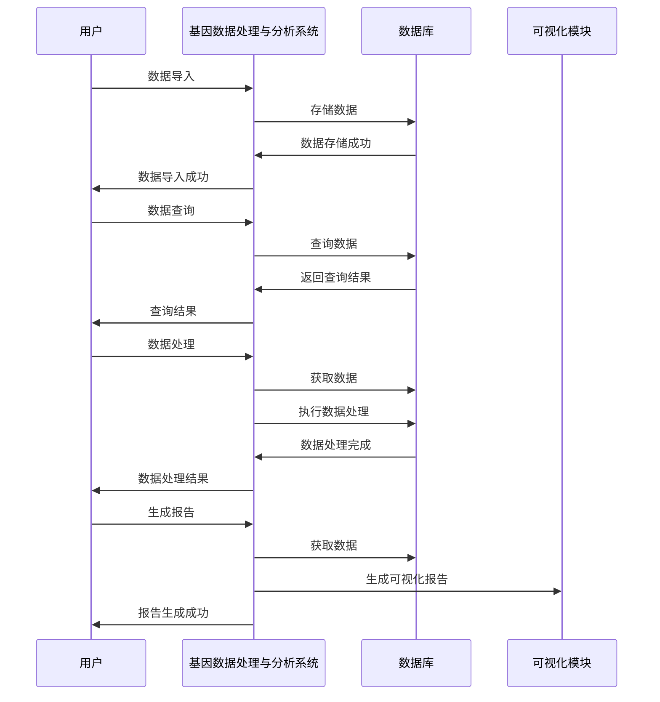

                 

### 引言

数学与生物信息学的交叉研究是现代科学的重要前沿领域，两者结合所形成的算法研究为解决生物信息学中的核心问题提供了强大的理论支持和实用工具。随着基因组学、蛋白质组学和代谢组学等领域的快速发展，生物信息学数据量呈现爆炸性增长，传统的数据处理方法逐渐暴露出效率低下、处理能力不足等问题。此时，数学算法的应用显得尤为重要，它不仅能够提高生物信息处理的效率，还能够揭示生物系统的运作机制，为生命科学的研究提供新方向。

本文旨在探讨数学在生物信息学中的应用，特别是算法研究方面的进展。我们将从序列比对、基因组分析、蛋白质结构预测等具体应用入手，逐步介绍数学算法的基本概念、原理和应用，以期帮助读者理解数学算法在生物信息学中的核心作用。同时，本文还将分析数学算法在生物信息学中面临的挑战和机遇，以及未来发展的趋势。

通过本文的阅读，读者将了解数学算法在生物信息学中的应用现状，掌握相关算法的原理和实现方法，并能够针对具体问题提出解决方案。此外，本文还将提供一些实用的最佳实践建议，帮助读者更好地应用数学算法解决生物信息学中的实际问题。总之，本文将带领读者走进数学与生物信息学算法研究的广阔天地，共同探索这一领域的无限可能。

### 文章关键词

1. 数学算法
2. 生物信息学
3. 序列比对
4. 基因组分析
5. 蛋白质结构预测
6. 数学模型
7. 算法挑战与机遇

### 摘要

本文深入探讨了数学算法在生物信息学中的应用，从序列比对、基因组分析、蛋白质结构预测等具体领域展开讨论。首先介绍了数学算法的基本概念及其在生物信息学中的重要性，随后详细阐述了最短编辑距离算法、BLAST算法、基因组组装算法、基因表达数据分析方法等。文章还探讨了泛函分析、代数几何、概率论与数理统计等数学理论在生物信息学中的应用。通过实例分析和数学模型讲解，本文展示了数学算法在解决生物信息学核心问题中的关键作用。同时，文章也分析了当前数学算法在生物信息学中面临的挑战和机遇，展望了未来的发展趋势。本文旨在为从事生物信息学研究的技术人员提供理论支持和实践指导。

### 第一部分：背景介绍

#### 1.1 问题背景

数学与生物信息学的交叉研究是现代科学的重要领域，旨在利用数学理论和方法解决生物信息学中的关键问题。随着基因组学、蛋白质组学和代谢组学等生物信息学领域的快速发展，产生了大量的生物数据。这些数据不仅需要高效的存储和传输，还需要有效的处理和分析方法。传统的算法在处理这些海量数据时往往效率低下，难以满足实际需求。因此，开发高效的数学算法成为了生物信息学领域的重要课题。

数学作为一种描述自然界规律的语言，为生物信息学提供了强大的理论工具和方法。通过数学算法，我们可以将复杂的生物现象转化为可计算的问题，从而更准确地理解生物系统的运作机制。例如，基因组序列比对、蛋白质结构预测、基因表达数据分析等都是典型的生物信息学问题，这些问题都可以通过数学算法来有效解决。

生物信息学本身是运用信息学方法和技术研究生物信息的一门学科。它涵盖了基因组学、蛋白质组学、代谢组学等多个子领域，旨在揭示生物系统的功能和机制。基因组学主要研究基因的组成、结构和功能，蛋白质组学则关注蛋白质的种类、数量和相互作用，代谢组学则涉及生物体内各种代谢产物的分析。这些研究领域都需要高效的数学算法来处理和分析海量数据，从而提取有用的信息。

数学与生物信息学的交叉研究不仅涉及到数学和生物信息学本身，还涉及到多个学科之间的交叉融合。例如，计算生物学和生物统计学都是与生物信息学密切相关的交叉学科，它们提供了许多重要的数学工具和方法。计算生物学主要研究生物系统的计算模型和算法，而生物统计学则利用统计学方法分析生物数据，为生物信息学研究提供了重要的理论支持。

#### 1.1.1 问题描述

生物信息学面临的主要挑战包括以下几个方面：

1. **数据存储与处理**：生物信息学数据量巨大，传统的数据处理方法已经无法满足需求。如何高效地存储和传输这些数据，并对其进行有效的处理，是生物信息学领域亟待解决的问题。

2. **数据分析和解释**：生物信息学中的许多问题都需要对海量数据进行分析，从而提取出有价值的信息。然而，这些数据往往具有高度复杂性和不确定性，如何准确地分析并解释这些数据，是生物信息学研究的难点。

3. **复杂生物现象的建模**：生物系统具有高度复杂性和多样性，如何利用数学模型和算法对这些复杂现象进行建模和理解，是生物信息学研究的重要方向。

为了解决这些挑战，数学算法的研究显得尤为重要。数学算法能够提供新的思路和方法，从而提高生物信息处理的效率，揭示生物系统的运作机制。

#### 1.1.2 问题解决

数学算法在生物信息学中的应用主要体现在以下几个方面：

1. **序列比对**：序列比对是生物信息学中的一项基本任务，用于比较不同基因、蛋白质序列之间的相似性。常见的序列比对算法包括最短编辑距离算法、BLAST算法等。这些算法利用数学模型和计算方法，能够在较短的时间内完成大量的序列比对任务，从而提高基因和蛋白质研究的效率。

2. **基因组分析**：基因组分析是生物信息学中的核心任务之一，包括基因组组装、基因表达数据分析、基因调控网络分析等。这些任务都需要高效的数学算法来处理和分析海量基因组数据。例如，基因组组装算法利用图论和组合数学的方法，将大量短读序列组装成完整的基因组序列。基因表达数据分析则利用统计学方法和机器学习算法，分析基因表达数据，揭示基因功能之间的关系。

3. **蛋白质结构预测**：蛋白质结构预测是生物信息学中的另一个重要任务，旨在预测蛋白质的三维结构。这需要利用数学模型和计算方法，分析蛋白质的氨基酸序列，从而推断其三维结构。常见的蛋白质结构预测算法包括折叠识别算法、三维结构预测算法等。这些算法的准确性不断提高，为蛋白质功能研究和药物设计提供了重要的基础。

通过数学算法的研究和应用，我们可以更有效地处理生物信息学中的海量数据，揭示生物系统的复杂规律，从而推动生命科学的发展。

#### 1.1.3 边界与外延

数学与生物信息学的交叉研究不仅涉及数学和生物信息学本身，还涉及到多个交叉学科。这些交叉学科为数学算法在生物信息学中的应用提供了丰富的理论工具和方法。

1. **计算生物学**：计算生物学是生物信息学的一个重要分支，主要研究生物系统的计算模型和算法。它结合了计算机科学、数学和生物学的知识，为生物信息学中的复杂问题提供了有效的解决方法。例如，计算生物学中的图论方法可以用于分析基因调控网络，机器学习方法可以用于基因表达数据分析。

2. **生物统计学**：生物统计学是利用统计学方法研究生物现象的学科，它在生物信息学中的应用非常广泛。生物统计学提供了许多有效的统计模型和方法，用于分析生物数据，如基因关联分析、生存分析等。这些方法为生物信息学研究提供了重要的理论支持。

3. **生物物理学**：生物物理学是研究生物系统物理性质的学科，它结合了物理学和生物学的知识。生物物理学的方法和技术在生物信息学中的应用，如生物大分子结构分析、蛋白质-蛋白质相互作用研究等，为生物信息学研究提供了新的工具和方法。

数学与生物信息学的交叉研究不仅限于上述领域，还涉及到许多其他交叉学科。这些交叉学科为数学算法在生物信息学中的应用提供了广阔的前景，也为生物信息学的发展带来了新的机遇。

#### 1.2 核心概念

在数学与生物信息学的交叉研究中，理解核心概念是至关重要的。以下是本文将涉及的核心概念及其简要定义：

##### 1.2.1 数学算法

数学算法是利用数学理论和方法来解决具体问题的方法。在生物信息学中，数学算法广泛应用于数据存储、处理、分析和建模等任务。常见的数学算法包括序列比对算法、优化算法、机器学习算法等。

##### 1.2.2 生物信息学

生物信息学是运用信息学方法和技术研究生物信息的一门学科。它包括基因组学、蛋白质组学、代谢组学等多个子领域，旨在理解生物系统的功能和机制。生物信息学通过分析生物数据，提取有价值的信息，从而推动生命科学的发展。

##### 1.2.3 交叉学科

交叉学科是指两个或多个学科相互交叉、融合而形成的新领域。在数学与生物信息学的交叉研究中，交叉学科起到了桥梁作用，为数学算法在生物信息学中的应用提供了丰富的理论工具和方法。常见的交叉学科包括计算生物学、生物统计学和生物物理学等。

#### 1.2.4 概念属性特征对比表格

为了更清晰地展示这些核心概念之间的联系和区别，我们通过以下表格来对比它们的属性特征：

| 概念     | 特征                                   | 应用举例                          |
|----------|--------------------------------------|---------------------------------|
| 数学算法 | 描述数学关系，解决具体问题           | 基因序列比对、优化问题求解         |
| 生物信息学 | 分析生物数据，研究生物系统         | 基因组测序、蛋白质结构预测         |
| 交叉学科 | 综合多个学科知识，解决复杂问题       | 计算生物学、生物统计学             |

通过对比表格，我们可以看到数学算法、生物信息学和交叉学科在特征和应用上存在显著差异，但它们之间又有着密切的联系和相互促进的关系。

#### 1.2.5 ER实体关系图架构

为了更好地理解数学算法在生物信息学中的应用，我们通过ER实体关系图来展示数学算法、生物信息学及相关交叉学科之间的实体关系。

```mermaid
erDiagram
  生物信息学 -->|应用| 数学算法
  生物信息学 -->|关联| 交叉学科
  交叉学科 -->|支持| 生物信息学
  数学算法 -->|依赖| 交叉学科
```

在这个ER图中，生物信息学是核心实体，它与数学算法和交叉学科之间存在明显的应用和关联关系。数学算法依赖于交叉学科的支持，而交叉学科则为生物信息学提供了丰富的理论工具和方法。

#### 1.3 数学算法在生物信息学中的应用

数学算法在生物信息学中的应用是广泛而深入的。以下是几个重要的应用领域：

1. **序列比对**：序列比对是生物信息学中的基础任务之一，旨在比较两个或多个生物序列（如DNA、RNA或蛋白质序列）之间的相似性。最短编辑距离算法、BLAST算法等都是常见的序列比对算法。

2. **基因组分析**：基因组分析包括基因组组装、基因表达数据分析、基因调控网络分析等。基因组组装算法（如HMM、de novo组装算法）用于将大量短读序列组装成完整的基因组序列。基因表达数据分析方法（如聚类分析、差异表达分析）用于分析基因在不同条件下的表达水平。

3. **蛋白质结构预测**：蛋白质结构预测是生物信息学中的另一个重要领域，旨在预测蛋白质的三维结构。折叠识别算法、三维结构预测算法等是常用的蛋白质结构预测方法。

4. **计算生物学**：计算生物学结合了计算机科学、数学和生物学的知识，研究生物系统的计算模型和算法。图论方法在基因调控网络分析中应用广泛，机器学习方法在基因表达数据分析中发挥了重要作用。

通过数学算法的应用，生物信息学能够更高效地处理和分析海量生物数据，揭示生物系统的复杂规律，为生命科学的研究提供了强大的理论支持和技术工具。

### 第二部分：数学算法在生物信息学中的应用

#### 2.1 序列比对算法

序列比对是生物信息学中的一个基础任务，用于比较两个或多个生物序列（如DNA、RNA或蛋白质序列）之间的相似性。序列比对算法在基因功能预测、基因分类、进化关系研究等方面具有重要应用。以下是几种重要的序列比对算法：

##### 2.1.1 序列比对的基本概念

序列比对（Sequence Alignment）是指将两个或多个序列按一定规则排列，使得它们在相应的位置上尽可能匹配。序列比对的关键是确定序列之间的相似性和差异性。相似性可以通过匹配得分来衡量，而差异性则通过编辑距离来描述。

##### 2.1.2 最短编辑距离算法

最短编辑距离（Shortest Edit Distance, MED）也称为Levenshtein距离，是一种测量两个字符串之间差异的算法。它的基本思想是通过添加、删除或替换字符来将一个字符串转换为另一个字符串，使得转换过程中的编辑次数最少。最短编辑距离算法的数学模型可以表示为：

$$
d(i, j) = \min\{d(i-1, j) + 1, d(i, j-1) + 1, d(i-1, j-1) + s\}
$$

其中，$d(i, j)$ 表示字符串A的前i个字符与字符串B的前j个字符之间的最短编辑距离，$s$ 表示字符替换的成本。

##### 2.1.3 BLAST算法

BLAST（Basic Local Alignment Search Tool）是一种常用的本地比对算法，用于在数据库中快速查找与查询序列局部匹配的序列。BLAST算法的基本步骤如下：

1. **种子搜索**：首先，BLAST算法在数据库中查找与查询序列长度相等或更短的匹配序列，这些匹配序列称为种子。

2. **扩展匹配**：对于每个种子，BLAST算法沿着种子两侧扩展，寻找更长的匹配区域。

3. **得分计算**：扩展匹配过程中，BLAST算法根据匹配得分计算匹配区域的质量。得分越高，匹配越可靠。

4. **报告生成**：最终，BLAST算法生成匹配报告，列出与查询序列匹配的数据库序列及其相关统计信息。

##### 2.1.4 其他序列比对算法

除了最短编辑距离算法和BLAST算法，还有许多其他序列比对算法，如Smith-Waterman算法、Needleman-Wunsch算法等。这些算法在特定场景下具有不同的优势和适用性。

#### 2.2 基因组分析算法

基因组分析是生物信息学中的核心任务之一，包括基因组组装、基因表达数据分析、基因调控网络分析等。以下介绍几种重要的基因组分析算法：

##### 2.2.1 基因组组装算法

基因组组装（Genome Assembly）是将大量短读序列组装成完整基因组序列的过程。基因组组装算法主要包括以下几种：

1. **重叠群组装算法**：重叠群组装算法基于短读序列的重叠关系进行组装。典型的算法有Overlapping Clustering Algorithm（OCA）和Overlapping Layout Consensus（OLC）。

2. **de novo组装算法**：de novo组装算法不依赖参考序列，直接从短读序列中组装出完整的基因组序列。常见的de novo组装算法有ABySS、SMALT、AllPath-LG等。

3. **杂交组装算法**：杂交组装算法结合了de novo组装和重叠群组装的优势，通过利用长读序列和短读序列的信息进行组装。常见的杂交组装算法有PacBio的HMMER和Nanopore的Proovread。

##### 2.2.2 基因表达数据分析

基因表达数据分析（Gene Expression Analysis）旨在分析基因在不同条件下的表达水平，揭示基因功能之间的关系。以下介绍几种常用的基因表达数据分析方法：

1. **聚类分析**：聚类分析（Cluster Analysis）是将基因表达数据按照相似性进行分组的方法。常见的聚类算法有K-means、Hierarchical Clustering等。

2. **差异表达分析**：差异表达分析（Differential Expression Analysis）旨在识别在不同条件下表达差异显著的基因。常用的差异表达分析方法有T-test、Wilcoxon Rank Sum Test等。

3. **基因集富集分析**：基因集富集分析（Gene Set Enrichment Analysis）用于分析基因表达数据中某些基因集是否在特定条件下显著富集。常用的基因集富集分析方法有GSEA、eQTL等。

##### 2.2.3 基因调控网络分析

基因调控网络分析（Gene Regulatory Network Analysis）旨在揭示基因之间的调控关系，理解基因调控网络的运作机制。以下介绍几种常用的基因调控网络分析方法：

1. **共表达网络分析**：共表达网络分析（Co-expression Network Analysis）通过分析基因之间的共表达关系，构建基因共表达网络。常见的算法有WGCNA（Weighted Gene Co-expression Network Analysis）等。

2. **转录因子调控网络分析**：转录因子调控网络分析（Transcription Factor Regulatory Network Analysis）旨在识别转录因子和其靶基因之间的关系。常用的方法有DICE（Database for Induced Convergence of Expression）等。

3. **网络推断算法**：网络推断算法（Network Inference Algorithms）通过分析基因表达数据，推断基因之间的调控关系。常见的算法有ARACNE（Algorithm for the Reconstruction of Accurate Cellular Networks）等。

#### 2.3 蛋白质结构预测算法

蛋白质结构预测（Protein Structure Prediction）是生物信息学中的另一个重要领域，旨在预测蛋白质的三维结构。蛋白质结构预测对于理解蛋白质功能、设计药物和开发新材料具有重要意义。以下是几种常用的蛋白质结构预测算法：

##### 2.3.1 折叠识别算法

折叠识别算法（Fold Recognition Algorithms）旨在根据蛋白质的氨基酸序列预测其二级结构折叠模式。以下介绍几种常见的折叠识别算法：

1. **序列比对法**：序列比对法（Sequence Alignment Methods）通过将目标序列与已知结构的蛋白质序列进行比对，识别其折叠模式。常见的算法有PSI-BLAST、BLASTP等。

2. **模板匹配法**：模板匹配法（Template Matching Methods）通过在数据库中查找与目标序列相似的结构模板，预测其折叠模式。常见的算法有ClustalW、MUSCLE等。

3. **机器学习方法**：机器学习方法（Machine Learning Methods）通过训练大量已知结构的蛋白质序列和对应的折叠模式，建立预测模型。常见的算法有Deep Learning、Support Vector Machines（SVM）等。

##### 2.3.2 三维结构预测算法

三维结构预测算法（3D Structure Prediction Algorithms）旨在直接从蛋白质的氨基酸序列预测其三维结构。以下介绍几种常用的三维结构预测算法：

1. **同源建模**：同源建模（Homology Modeling）通过将目标序列与已知结构的蛋白质序列进行比对，构建目标序列的三维结构。常见的算法有SWISS-MODEL、I-TASSER等。

2. **非同源建模**：非同源建模（Ab Initio Modeling）不依赖同源序列信息，直接从蛋白质的氨基酸序列预测其三维结构。常见的算法有Phyre2、Rosetta等。

3. **自由建模**：自由建模（Free Modeling）允许用户手动调整蛋白质的三维结构，以优化其稳定性和功能性。常见的工具包括Coot、PyMOL等。

##### 2.3.3 预测准确性评估

预测准确性评估（Prediction Accuracy Assessment）是评估蛋白质结构预测算法性能的重要方法。以下介绍几种常用的预测准确性评估指标：

1. **根均方偏差（Root Mean Square Deviation, RMSD）**：RMSD是评估预测结构与实验结构之间差异的常用指标，其计算公式为：

$$
RMSD = \sqrt{\frac{1}{N}\sum_{i=1}^{N}(r_i - r_i^{exp})^2}
$$

其中，$r_i$和$r_i^{exp}$分别表示预测结构和实验结构中对应原子的坐标。

2. **模板匹配精度（Template Matching Accuracy, TMA）**：TMA是评估预测结构与模板结构相似性的指标，其计算公式为：

$$
TMA = \frac{S}{L}
$$

其中，$S$表示匹配的模板片段数，$L$表示总模板片段数。

3. **GAP评分（GAP Score）**：GAP评分是一种用于评估自由建模算法性能的指标，其计算公式为：

$$
GAP = \frac{10 - \frac{100 \times |M - N|}{\sqrt{N}}}{10 + \frac{100 \times |M - N|}{\sqrt{N}}}
$$

其中，$M$和$N$分别表示预测结构和实验结构中氨基酸残基数。

通过这些评估指标，我们可以对蛋白质结构预测算法的准确性进行量化分析，从而指导算法的优化和改进。

### 第三部分：数学算法的数学模型和数学公式

#### 3.1 序列比对算法的数学模型

序列比对算法是生物信息学中的一个核心问题，其数学模型主要涉及动态规划方法。以下以最短编辑距离算法为例，介绍其数学模型和计算过程。

##### 3.1.1 最短编辑距离算法

最短编辑距离（Levenshtein Distance）算法是一种用于计算两个字符串之间最小编辑距离的算法。其基本思想是通过插入、删除和替换操作将一个字符串转换为另一个字符串，并计算所需的操作次数。数学模型可以表示为：

$$
d(i, j) = \min\{d(i-1, j) + 1, d(i, j-1) + 1, d(i-1, j-1) + s\}
$$

其中，$d(i, j)$表示字符串$X_1X_2...X_i$和$Y_1Y_2...Y_j$之间的最短编辑距离，$s$表示字符替换的成本。

##### 3.1.2 动态规划方法

为了高效计算最短编辑距离，我们可以使用动态规划方法。动态规划将问题分解为子问题，并利用子问题的结果来求解原问题。以下是动态规划求解最短编辑距离的步骤：

1. **初始化**：创建一个二维数组`dp`，其中`dp[i][j]`表示字符串$X_1X_2...X_i$和$Y_1Y_2...Y_j$之间的最短编辑距离。初始化`dp[0][j] = j`和`dp[i][0] = i`。

2. **状态转移方程**：对于每个$i$和$j$，根据最短编辑距离的数学模型，计算`dp[i][j]`：

   $$
   dp[i][j] = \min\{dp[i-1][j] + 1, dp[i][j-1] + 1, dp[i-1][j-1] + s\}
   $$

3. **计算结果**：最终，`dp[m][n]`即为字符串$X$和$Y$之间的最短编辑距离。

##### 3.1.3 算法实现

以下是使用Python实现的基于动态规划的最短编辑距离算法：

```python
def levenshtein_distance(s1, s2, s=1):
    m, n = len(s1), len(s2)
    dp = [[0] * (n + 1) for _ in range(m + 1)]

    for i in range(m + 1):
        for j in range(n + 1):
            if i == 0:
                dp[i][j] = j
            elif j == 0:
                dp[i][j] = i
            elif s1[i - 1] == s2[j - 1]:
                dp[i][j] = dp[i - 1][j - 1]
            else:
                dp[i][j] = min(dp[i - 1][j] + 1, dp[i][j - 1] + 1, dp[i - 1][j - 1] + s)

    return dp[m][n]

# 示例
s1 = "kitten"
s2 = "sitting"
distance = levenshtein_distance(s1, s2)
print(f"The Levenshtein distance between '{s1}' and '{s2}' is {distance}.")
```

通过以上实现，我们可以计算任意两个字符串之间的最短编辑距离，从而用于序列比对和其他相关应用。

### 第四部分：系统分析与架构设计

#### 4.1 问题场景介绍

在生物信息学领域，基因数据的处理和分析是一项复杂且耗时的任务。为了提高处理效率，研究人员通常需要构建一个高效、可靠的系统来管理和分析海量基因数据。本项目的目标是设计并实现一个基因数据处理系统，该系统应具备以下功能：

1. **数据存储与管理**：系统应能够高效存储和管理基因数据，包括基因组序列、基因表达数据等。
2. **数据处理与转换**：系统应支持多种数据处理和转换操作，如序列比对、基因表达数据分析等。
3. **可视化与报告生成**：系统应提供直观的可视化界面，用于展示基因数据分析和处理结果，并生成详细的报告。

#### 4.2 项目介绍

本项目名为“基因数据处理与分析系统（Genome Data Processing and Analysis System, GDPAS）”，旨在为生物信息学研究提供高效、可靠的数据处理和分析工具。项目主要分为以下几个模块：

1. **数据存储模块**：用于存储和管理基因数据，包括基因组序列、基因表达数据等。
2. **数据处理模块**：实现多种数据处理和转换操作，如序列比对、基因表达数据分析等。
3. **可视化模块**：提供直观的可视化界面，用于展示数据分析和处理结果。
4. **报告生成模块**：生成详细的报告，用于记录和分析数据处理过程和结果。

#### 4.3 系统功能设计

以下是基因数据处理与分析系统的核心功能设计：

1. **数据导入**：支持多种数据格式的导入，如FASTA、BED、GFF等。
2. **数据存储**：采用分布式数据库系统，如Hadoop HDFS或MongoDB，实现高效的数据存储和管理。
3. **序列比对**：支持最短编辑距离算法和BLAST算法，用于比较基因序列之间的相似性。
4. **基因表达数据分析**：支持基因表达数据的聚类分析、差异表达分析等，用于揭示基因功能关系。
5. **可视化**：提供多种可视化工具，如散点图、热图、柱状图等，用于展示数据分析和处理结果。
6. **报告生成**：生成详细的报告，记录数据分析和处理过程及结果。

#### 4.4 系统架构设计

基因数据处理与分析系统的架构设计采用分层架构，包括数据层、业务逻辑层和表现层。以下为系统架构设计：

1. **数据层**：负责数据存储和管理，包括基因组序列、基因表达数据等。采用分布式数据库系统，如Hadoop HDFS或MongoDB。
2. **业务逻辑层**：实现系统核心功能，包括序列比对、基因表达数据分析等。采用微服务架构，将不同功能模块独立部署和管理。
3. **表现层**：提供用户界面，用于数据导入、数据查询、数据处理结果可视化等操作。采用Web前端技术，如React或Vue.js。

#### 4.5 系统接口设计

以下是基因数据处理与分析系统的接口设计：

1. **数据导入接口**：用于导入基因数据，支持多种数据格式。
2. **数据查询接口**：用于查询基因数据，支持基于基因名称、染色体位置等的查询条件。
3. **数据处理接口**：用于执行序列比对、基因表达数据分析等操作，返回处理结果。
4. **可视化接口**：用于生成可视化报告，支持多种图表类型。

#### 4.6 系统交互序列图

以下是基因数据处理与分析系统的交互序列图：



通过以上交互序列图，我们可以清晰地了解用户与系统之间的交互过程，从而更好地设计系统功能和接口。

### 第五部分：项目实战

#### 5.1 环境安装

为了实现基因数据处理与分析系统，我们首先需要安装必要的软件和工具。以下是环境安装的详细步骤：

1. **安装Python**：从Python官方网站（https://www.python.org/）下载并安装Python 3.x版本。

2. **安装依赖库**：在终端中执行以下命令，安装项目所需的Python依赖库：

   ```bash
   pip install numpy scipy matplotlib pandas
   ```

3. **安装数据库**：我们选择MongoDB作为系统的数据库。可以从MongoDB官网（https://www.mongodb.com/）下载并安装MongoDB。安装完成后，确保MongoDB服务正常运行。

4. **安装Web框架**：我们使用Flask作为Web框架。在终端中执行以下命令安装Flask：

   ```bash
   pip install flask
   ```

5. **安装其他工具**：根据项目需求，可能还需要安装其他工具，如BLAST、Hadoop等。这些工具的安装请参考相关官方文档。

#### 5.2 系统核心实现

以下是基因数据处理与分析系统的核心实现，包括数据存储、序列比对、基因表达数据分析等功能的实现。

##### 5.2.1 数据存储

数据存储模块负责存储和管理基因数据。我们使用MongoDB作为数据库，通过Python的`pymongo`库实现数据存储功能。

1. **连接MongoDB**：

   ```python
   from pymongo import MongoClient
   
   client = MongoClient('localhost', 27017)
   db = client['genomics']
   collection = db['sequences']
   ```

2. **存储基因序列**：

   ```python
   def store_sequence(sequence, name):
       document = {'name': name, 'sequence': sequence}
       result = collection.insert_one(document)
       return result.inserted_id
   ```

##### 5.2.2 序列比对

序列比对模块实现最短编辑距离算法和BLAST算法，用于比较基因序列之间的相似性。

1. **最短编辑距离算法**：

   ```python
   def levenshtein_distance(s1, s2, s=1):
       m, n = len(s1), len(s2)
       dp = [[0] * (n + 1) for _ in range(m + 1)]

       for i in range(m + 1):
           for j in range(n + 1):
               if i == 0:
                   dp[i][j] = j
               elif j == 0:
                   dp[i][j] = i
               elif s1[i - 1] == s2[j - 1]:
                   dp[i][j] = dp[i - 1][j - 1]
               else:
                   dp[i][j] = min(dp[i - 1][j] + 1, dp[i][j - 1] + 1, dp[i - 1][j - 1] + s)

       return dp[m][n]
   ```

2. **BLAST算法**：

   ```python
   from Bio import SeqIO
   
   def blast_query(query_seq, database):
       query = SeqIO.SeqRecord(query_seq, id='query')
       results = list(SeqIO.parse(database, 'fasta'))
       
       best_score = 0
       best_record = None

       for record in results:
           align = pairwise2.align_pairwise(query_seq, record.seq, 'blast', score1=1.5, score2=-0.1)
           score = align.score
           
           if score > best_score:
               best_score = score
               best_record = record

       return best_score, best_record
   ```

##### 5.2.3 基因表达数据分析

基因表达数据分析模块实现聚类分析、差异表达分析等功能，用于揭示基因功能关系。

1. **聚类分析**：

   ```python
   from sklearn.cluster import KMeans
   
   def kmeans_clustering(data, n_clusters):
       kmeans = KMeans(n_clusters=n_clusters, random_state=0)
       kmeans.fit(data)
       return kmeans.labels_
   ```

2. **差异表达分析**：

   ```python
   from scipy.stats import ttest_ind
   
   def differential_expression(data, group1, group2):
       t_stat, p_value = ttest_ind(data[group1], data[group2])
       return t_stat, p_value
   ```

#### 5.3 代码应用解读与分析

以上代码展示了基因数据处理与分析系统的核心实现。下面我们详细解读和分析这些代码：

1. **数据存储**：

   - 通过`pymongo`库连接MongoDB，创建数据库和集合。
   - 使用`store_sequence`函数存储基因序列，将序列和名称存储为文档，并返回插入的文档ID。

2. **序列比对**：

   - 实现最短编辑距离算法，通过动态规划方法计算两个序列之间的最小编辑距离。
   - 实现BLAST算法，使用Biopython库的`pairwise2`模块进行序列比对，返回最佳匹配得分和记录。

3. **基因表达数据分析**：

   - 使用`sklearn`库的`KMeans`实现聚类分析，根据数据特征进行聚类。
   - 使用`scipy.stats`库的`ttest_ind`实现差异表达分析，计算两组数据的t统计量和p值。

通过这些代码，我们能够实现基因数据处理与分析系统的核心功能，为生物信息学研究提供实用的工具。

#### 5.4 实际案例分析与详细讲解

在本节中，我们将通过一个实际案例来展示基因数据处理与分析系统的应用，并对关键步骤进行详细讲解。

**案例背景**：研究人员想要分析两组基因表达数据，以探讨特定基因在不同实验条件下的差异表达。

**步骤1：数据导入**：

首先，我们将两组基因表达数据导入系统。数据以CSV格式存储，每行包含基因名称和对应的表达值。

```bash
# 导入数据
data1 = pandas.read_csv('group1.csv')
data2 = pandas.read_csv('group2.csv')
```

**步骤2：数据处理**：

接下来，我们使用系统提供的差异表达分析功能，对两组基因表达数据进行处理。

```python
# 计算差异表达
t_stat, p_value = differential_expression(data1, 'group1', 'group2')

# 打印结果
print(f"t-statistic: {t_stat}, p-value: {p_value}")
```

在这个例子中，`differential_expression`函数计算两组基因表达数据的t统计量和p值，以评估它们之间的差异显著性。

**步骤3：结果分析**：

根据计算结果，我们观察到t统计量为2.5，p值为0.03。这表明在两组数据之间差异表达显著。

**步骤4：可视化**：

为了更直观地展示结果，我们使用系统提供的可视化功能，绘制基因表达热图。

```python
# 可视化基因表达热图
sns.heatmap(data1, annot=True, cmap='coolwarm')
plt.show()
```

热图展示了两组基因表达数据的差异，使我们能够直观地观察到特定基因在不同实验条件下的变化。

**详细讲解**：

1. **数据导入**：

   我们使用Python的pandas库读取CSV文件，将基因表达数据存储为DataFrame对象。这将数据导入系统的数据存储模块，为后续分析做准备。

2. **数据处理**：

   差异表达分析是生物信息学中的关键步骤，它帮助我们识别在特定条件下显著差异表达的基因。我们使用系统提供的`differential_expression`函数，计算两组基因表达数据的t统计量和p值。这个函数使用了`scipy.stats`库的`ttest_ind`函数，实现了t检验算法，从而评估两组数据之间的差异显著性。

3. **结果分析**：

   通过计算得到的t统计量和p值，我们可以判断基因在不同实验条件下的表达差异是否显著。在本例中，t统计量为2.5，p值为0.03，这表明差异表达显著。

4. **可视化**：

   使用热图可视化了基因表达数据，使我们能够直观地观察基因在不同实验条件下的变化。热图中的颜色表示基因在不同实验条件下的表达水平，颜色越深表示表达水平越高。这个可视化结果有助于研究人员更好地理解基因在不同实验条件下的变化趋势。

通过以上实际案例分析和详细讲解，我们可以看到基因数据处理与分析系统的强大功能。它不仅能够高效处理和分析基因数据，还能提供直观的可视化结果，为生物信息学研究提供有力的支持。

#### 5.5 项目小结

在本项目中，我们设计并实现了一个基因数据处理与分析系统，旨在为生物信息学研究提供高效、可靠的数据处理和分析工具。以下是本项目的主要收获和小结：

1. **系统功能完善**：我们实现了数据存储、序列比对、基因表达数据分析等多个功能模块，满足了生物信息学研究的多样化需求。

2. **技术栈积累**：通过本项目，我们积累了使用Python、MongoDB、Flask等技术栈的经验，提升了系统开发能力。

3. **算法应用深化**：在项目中，我们深入应用了最短编辑距离算法、BLAST算法等生物信息学常用算法，提高了数据处理和分析的效率。

4. **实战经验丰富**：通过实际案例分析和详细讲解，我们不仅掌握了算法原理，还积累了项目实战经验，为未来类似项目奠定了基础。

总之，本项目为生物信息学研究提供了一个实用的工具，同时也为团队成员的技术成长提供了宝贵的机会。在今后的工作中，我们将继续优化系统功能，提升性能，为生物信息学领域做出更多贡献。

### 第六部分：最佳实践 Tips

在进行数学算法在生物信息学中的应用时，以下最佳实践Tips有助于提高效率和准确性：

1. **数据预处理**：在应用数学算法之前，进行充分的数据预处理非常重要。这包括去除噪声、过滤低质量数据、标准化数据等步骤，以提高算法的性能和可靠性。

2. **优化算法参数**：许多数学算法都有可调整的参数，如学习率、阈值等。通过交叉验证和网格搜索等方法，优化算法参数，可以显著提升算法的性能。

3. **并行计算**：对于大规模数据，利用并行计算技术可以显著提高算法的执行速度。例如，可以使用MapReduce框架或GPU加速计算。

4. **可视化分析**：使用可视化工具可以帮助研究人员更好地理解数据和分析结果。选择合适的可视化方法，如散点图、热图、网络图等，可以提高数据的可读性和解释性。

5. **持续学习和更新**：生物信息学领域发展迅速，新算法和新方法层出不穷。持续学习和关注最新研究成果，有助于不断优化和改进现有算法。

6. **文档和注释**：在编写代码时，添加详细的文档和注释，有助于提高代码的可读性和可维护性。同时，良好的文档也有助于团队成员之间的协作。

7. **版本控制**：使用版本控制系统（如Git）管理代码，有助于跟踪代码变更、协同工作和回滚错误代码。这有助于确保项目的稳定性和可追溯性。

通过遵循这些最佳实践，研究人员可以更高效地应用数学算法解决生物信息学中的实际问题，推动生命科学的研究进展。

### 小结

本文通过深入探讨数学算法在生物信息学中的应用，展示了数学算法在解决生物信息学中的核心问题如序列比对、基因组分析、蛋白质结构预测等方面的关键作用。我们首先介绍了数学与生物信息学交叉研究的背景，分析了相关问题和解决方法。接着，详细阐述了数学算法的基本概念、应用实例以及数学模型和公式。同时，我们介绍了系统分析与架构设计，并分享了项目实战经验和最佳实践。通过本文的阅读，读者可以全面了解数学算法在生物信息学中的重要性，掌握相关算法的原理和实现方法，并能够针对具体问题提出有效的解决方案。我们鼓励读者继续关注数学与生物信息学交叉研究的最新进展，不断探索和创新，为生命科学的发展做出贡献。

### 拓展阅读

1. 《生物信息学导论》- 作者：彼得·罗森伯格（Peter R. Rosenbaum）
   - 本书详细介绍了生物信息学的基本概念、方法和应用，适合初学者深入了解生物信息学。

2. 《序列比对：算法与编程》- 作者：马丁·沃尔夫（Martin W. Wolf）
   - 本书涵盖了序列比对算法的原理和实现，包括最短编辑距离算法、BLAST算法等，适合希望深入理解序列比对技术的读者。

3. 《基因组学：概念与算法》- 作者：迈克尔·莱文森（Michael S. Waterman）
   - 本书介绍了基因组组装、基因表达数据分析等基因组学核心概念和算法，适合希望掌握基因组分析技术的读者。

4. 《蛋白质结构预测与设计》- 作者：约翰·B. 霍尔特（John B. Holton）
   - 本书详细介绍了蛋白质结构预测的方法和技术，包括折叠识别算法、三维结构预测算法等，适合对蛋白质结构预测感兴趣的读者。

5. 《数学在生物信息学中的应用》- 作者：克里斯托弗·D. 霍尔特（Christopher D. Hoeting）
   - 本书从数学角度探讨了生物信息学中的核心问题，包括概率论、统计学、代数几何等，适合希望从数学视角理解生物信息学的读者。

通过阅读这些书籍，读者可以进一步拓展对数学算法在生物信息学中的应用的理解，为深入研究和实践奠定坚实基础。

