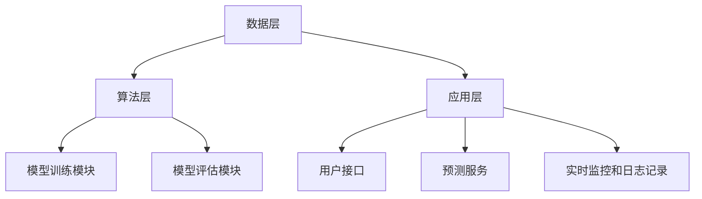
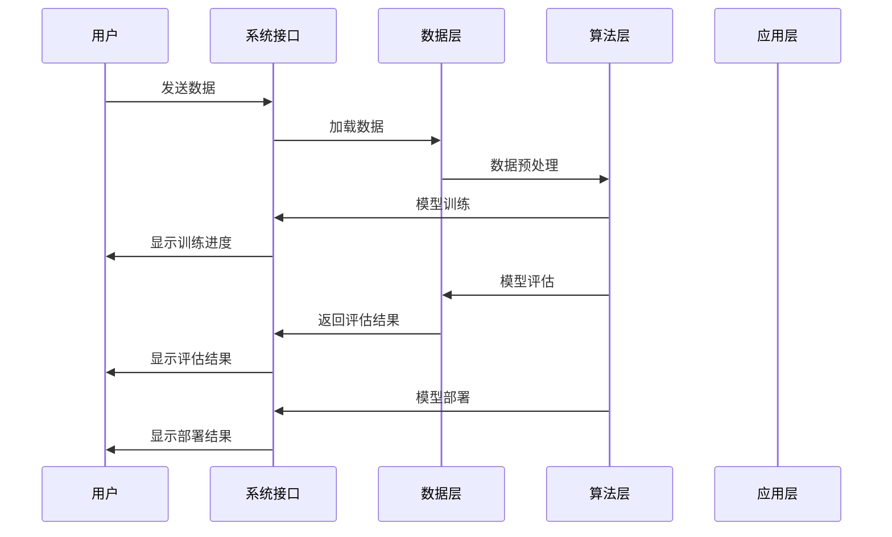

                 

### 一、文章标题

《数学与神经信息学：大脑信息处理的数学模型》

### 二、关键词

**数学模型、神经信息学、大脑信息处理、算法原理、神经网络**

### 三、摘要

本文围绕神经信息学这一前沿交叉学科，探讨了大脑信息处理的数学模型。通过深入分析神经元模型、神经网络和神经信息处理的数学模型，我们揭示了大脑信息处理的基本原理。接着，本文详细讲解了感知、记忆和学习等算法原理，并通过数学公式和Python代码进行了具体阐述。最后，文章介绍了神经信息处理系统的设计与实现，包括问题场景、项目介绍、系统功能设计、系统架构设计、系统接口设计和系统交互。通过本文的阅读，读者将全面了解神经信息学在数学模型中的重要作用，为未来的研究和应用奠定基础。


## 第一部分：背景介绍

### 第1章：问题背景与概述

#### 1.1 问题背景

**神经信息学**，一个结合了神经科学、信息科学和计算机科学的新兴领域，近年来吸引了众多研究者的关注。它旨在理解大脑如何处理和存储信息，进而模拟这种处理机制，以开发出更高效的人工智能系统。大脑信息处理过程极其复杂，但它的核心在于神经元之间的信息传递和整合。神经信息学通过数学模型来描述和解析这一过程，为人工智能领域提供了新的理论依据和工具。

**数学模型在大脑信息处理中的应用**至关重要。这些模型不仅帮助我们理解大脑的基本功能，还为人工智能算法的设计和优化提供了指导。从感知、记忆到学习，每个阶段都离不开数学模型的支撑。例如，感知过程中的特征提取和分类，依赖于数学模型来优化算法性能；记忆过程中的存储和检索，也通过数学模型来实现高效处理。

#### 1.2 问题描述

**大脑信息处理的基本过程**可以概括为感知、记忆和学习。感知是指接收外部信息并将其转换为神经信号；记忆是指存储和处理这些信息；学习是指通过经验和训练调整神经网络的结构和参数，从而提升信息处理能力。

当前研究的主要挑战在于：

1. **复杂性**：大脑信息处理过程极其复杂，涉及数十亿个神经元和复杂的神经网络结构。
2. **非线性**：大脑的信息处理具有非线性特性，这使得传统的线性模型难以准确描述。
3. **动态性**：大脑信息处理是动态的，信息在不同的时间和空间尺度上发生变化，这对模型的实时性提出了高要求。
4. **个体差异**：每个人的大脑结构和功能都有所不同，这增加了模型泛化的难度。

#### 1.3 问题解决

**数学模型在神经信息学中的发展历程**表明，随着计算能力的提升和算法的创新，我们正逐步破解大脑信息处理的奥秘。早期的研究主要集中在简单的神经网络模型，如McCulloch-Pitts模型和感知机。随着对大脑认识的深入，研究者们提出了更复杂的模型，如Hebbian模型、 Hopfield模型和反向传播算法。

**数学模型在神经信息学中的应用前景**非常广阔。一方面，它可以用于模拟和预测大脑的功能和行为，帮助我们更好地理解神经系统的工作原理；另一方面，它可以应用于人工智能领域，开发出更加智能和高效的算法。例如，在图像识别、自然语言处理和机器人控制等领域，神经信息学模型都取得了显著的成果。

#### 1.4 边界与外延

**神经信息学的交叉学科特性**决定了它不仅依赖于神经科学的知识，还需要信息科学和计算机科学的理论和方法。这使得神经信息学在研究领域具有广泛的应用前景，同时也面临着跨学科合作和知识整合的挑战。

**数学模型研究的适用范围与限制**主要体现在以下几个方面：

1. **适用范围**：数学模型可以应用于大脑信息处理的各个阶段，从感知到学习，为不同层次的研究提供理论支持。
2. **限制**：数学模型虽然可以模拟大脑的一些功能，但它无法完全复制大脑的复杂性和灵活性。此外，数学模型的精度和泛化能力也受到数据质量和算法复杂度的影响。

#### 1.5 概念结构与核心要素组成

**神经信息学的基本概念**包括神经元、神经网络、感知、记忆和学习等。这些概念构成了神经信息学研究的核心框架，为理解和模拟大脑信息处理提供了理论基础。

**数学模型的构成要素**主要包括：

1. **变量**：用于描述神经元状态和神经网络结构的参数。
2. **函数**：用于描述神经元之间的连接关系和信息传递方式。
3. **方程**：用于描述神经网络的行为和功能。

这些要素共同构成了数学模型的骨架，为神经信息学的研究提供了强有力的工具。

### 小结

通过本章的介绍，我们初步了解了神经信息学的研究背景、问题和应用前景。接下来，我们将深入探讨神经信息学中的核心概念和数学模型，为理解和模拟大脑信息处理奠定坚实的基础。


### 第二部分：核心概念与联系

### 第2章：神经信息学核心概念

#### 2.1 神经元模型

神经元模型是神经信息学中最基本的组成部分，它模拟了大脑中神经元的结构和功能。神经元是大脑的基本计算单元，负责接收和传递电信号。一个典型的神经元模型包括细胞体、树突、轴突和突触等部分。

**1. 结构描述：**

- **细胞体**：神经元的主体部分，包含细胞核和大多数细胞器。
- **树突**：从细胞体伸出，接收来自其他神经元的电信号。
- **轴突**：从细胞体延伸出去，传递电信号到其他神经元。
- **突触**：轴突末梢与树突之间的连接点，负责电信号的传递。

**2. 工作原理：**

神经元的工作原理基于电信号的传递。当神经元受到足够的刺激时，会通过离子通道打开，导致细胞膜电位的变化。这种变化可以沿着轴突传播，最终在突触处释放神经递质，传递给下一个神经元。

**3. 数学表示：**

神经元的数学模型通常使用以下方程来描述其行为：
\[ V(t) = V_0 + \sum_{i} w_i * I_i(t) \]
其中，\( V(t) \) 是神经元在时间 \( t \) 的电位，\( V_0 \) 是静息电位，\( w_i \) 是突触权重，\( I_i(t) \) 是来自其他神经元的输入电流。

#### 2.2 神经网络

神经网络是由多个神经元组成的复杂系统，可以模拟大脑的信息处理过程。神经网络中的神经元通过突触相互连接，形成一个复杂的网络结构。

**1. 定义：**

神经网络是一种通过模拟生物神经网络进行信息处理的人工智能算法。它由大量简单的计算单元（神经元）通过连接形成网络，通过学习训练来提高其信息处理能力。

**2. 类型：**

神经网络可以分为多种类型，如：

- **前馈神经网络**：信息从输入层流向输出层，没有反馈路径。
- **循环神经网络**：具有反馈路径，信息可以在网络中循环流动。
- **卷积神经网络**：特别适合处理图像数据，通过卷积层进行特征提取。

**3. 数学模型：**

神经网络的数学模型通常使用以下方程来描述：
\[ \text{Output} = \sigma(\text{Weight} * \text{Input} + \text{Bias}) \]
其中，\( \sigma \) 是激活函数，用于引入非线性特性；\( \text{Weight} \) 和 \( \text{Bias} \) 是网络的参数，通过学习训练进行调整。

#### 2.3 神经信息处理的数学模型

神经信息处理的数学模型是神经信息学研究的核心内容，它描述了大脑如何通过神经网络处理和存储信息。

**1. 感知过程模型：**

感知过程模型描述了大脑如何从外部环境中提取信息并识别模式。例如，视觉感知模型可以用于图像识别，听觉感知模型可以用于语音识别。

**2. 记忆过程模型：**

记忆过程模型描述了大脑如何存储和检索信息。例如，Hebbian模型描述了通过突触强化来增强记忆，Hopfield模型描述了通过能量函数来稳定记忆。

**3. 学习过程模型：**

学习过程模型描述了大脑如何通过经验和训练来调整神经网络的结构和参数，以提高信息处理能力。例如，反向传播算法是一种常用的学习算法，通过反向传播误差来调整网络权重。

**4. 数学表示：**

神经信息处理的数学模型通常使用以下方程来描述：
\[ \text{Output} = f(\text{Input} * \text{Weight} + \text{Bias}) \]
其中，\( f \) 是激活函数，用于引入非线性特性；\( \text{Input} \) 是输入数据，\( \text{Weight} \) 和 \( \text{Bias} \) 是网络的参数，通过学习训练进行调整。

#### 小结

本章详细介绍了神经信息学中的核心概念，包括神经元模型、神经网络和神经信息处理的数学模型。这些概念构成了神经信息学研究的基石，为理解和模拟大脑信息处理提供了理论基础。在接下来的章节中，我们将进一步探讨这些概念的原理和应用，以揭示大脑信息处理的奥秘。


### 第三部分：算法原理讲解

### 第3章：神经信息处理算法原理

#### 3.1 算法原理概述

神经信息处理算法是神经信息学研究的核心内容，它模拟了大脑的信息处理过程，包括感知、记忆和学习。这些算法通过神经网络来实现，通过学习训练来提高其性能。本节将详细讲解感知、记忆和学习算法的基本原理。

#### 3.2 感知算法原理

感知算法是神经信息处理的基础，它主要负责从外部环境中提取信息并识别模式。感知算法的基本原理可以概括为以下几个步骤：

1. **特征提取**：将输入数据转换为神经元的激活模式，提取出关键特征。
2. **模式识别**：通过比较输入特征和已存储的模板，识别出匹配的模式。
3. **响应生成**：根据识别出的模式生成相应的响应，如分类、预测等。

感知算法的数学模型通常使用以下方程来描述：
\[ \text{Output} = f(\text{Input} * \text{Weight} + \text{Bias}) \]
其中，\( f \) 是激活函数，用于引入非线性特性；\( \text{Input} \) 是输入数据，\( \text{Weight} \) 和 \( \text{Bias} \) 是网络的参数，通过学习训练进行调整。

#### 3.3 记忆算法原理

记忆算法负责存储和检索信息，它是神经网络中至关重要的一环。记忆算法的基本原理可以概括为以下几个步骤：

1. **信息存储**：通过突触强化或能量函数最小化，将信息存储在网络中。
2. **信息检索**：通过能量函数或反向传播，从网络中检索出存储的信息。
3. **响应生成**：根据检索出的信息生成相应的响应，如分类、预测等。

记忆算法的数学模型通常使用以下方程来描述：
\[ \text{Energy} = -\sum_{i} \text{Weight}_i * \text{Input}_i * \text{Output}_i \]
其中，\( \text{Weight} \) 是突触权重，\( \text{Input} \) 是输入数据，\( \text{Output} \) 是神经元输出。

#### 3.4 学习算法原理

学习算法是神经网络的核心，它通过调整网络参数来提高信息处理能力。学习算法的基本原理可以概括为以下几个步骤：

1. **误差计算**：计算网络输出与期望输出之间的误差。
2. **梯度下降**：根据误差梯度调整网络参数，以减小误差。
3. **迭代更新**：重复上述步骤，直到误差达到预设值或网络参数达到稳定状态。

学习算法的数学模型通常使用以下方程来描述：
\[ \text{Weight} = \text{Weight} - \alpha * \text{Gradient} \]
其中，\( \text{Weight} \) 是网络参数，\( \text{Gradient} \) 是误差梯度，\( \alpha \) 是学习率。

#### 3.5 算法特点与应用

神经信息处理算法具有以下几个特点：

1. **非线性**：通过引入激活函数，算法可以实现非线性变换，从而处理复杂的信息。
2. **自适应**：算法可以根据输入数据自动调整网络参数，以适应不同的信息处理任务。
3. **分布式**：算法通过分布式计算，可以在大量神经元之间共享信息，提高信息处理的效率和鲁棒性。

神经信息处理算法广泛应用于多个领域，如：

1. **图像识别**：通过感知算法，可以实现对图像的识别和分类。
2. **语音识别**：通过感知算法和记忆算法，可以实现对语音的识别和理解。
3. **自然语言处理**：通过记忆和学习算法，可以实现对自然语言的生成和理解。

#### 小结

本章详细介绍了神经信息处理算法的基本原理，包括感知、记忆和学习算法。这些算法通过神经网络来实现，通过学习训练来提高信息处理能力。在接下来的章节中，我们将进一步探讨这些算法的实现和优化，以及其在实际应用中的效果和挑战。


### 第四部分：数学模型和数学公式 & 详细讲解 & 举例说明

### 第4章：神经信息处理的数学模型详解

神经信息处理的数学模型是理解大脑信息处理机制和构建神经网络算法的关键。在这一章中，我们将详细讲解几个核心数学模型，包括神经元活动电位方程、神经网络学习方程等，并通过具体的例子来说明这些公式的应用和作用。

#### 4.1 数学公式介绍

**神经元活动电位方程**

神经元活动电位方程描述了神经元在接收输入信号后产生电位的动态过程。该方程可以表示为：

\[ V(t) = V_0 + \sum_{i} w_i * I_i(t) \]

其中，\( V(t) \) 是神经元在时间 \( t \) 的电位，\( V_0 \) 是静息电位，\( w_i \) 是突触权重，\( I_i(t) \) 是来自其他神经元的输入电流。

**神经网络学习方程**

神经网络学习方程描述了网络参数（如权重和偏置）如何通过学习过程进行调整。一个简单的学习方程可以表示为：

\[ \text{Weight} = \text{Weight} - \alpha * \text{Gradient} \]

其中，\( \text{Weight} \) 是网络参数，\( \alpha \) 是学习率，\( \text{Gradient} \) 是误差梯度。

**能量函数**

能量函数用于描述神经网络在信息存储和检索过程中的能量状态。一个常见的能量函数可以表示为：

\[ \text{Energy} = -\sum_{i} \text{Weight}_i * \text{Input}_i * \text{Output}_i \]

其中，\( \text{Weight}_i \) 是突触权重，\( \text{Input}_i \) 是输入数据，\( \text{Output}_i \) 是神经元输出。

#### 4.2 数学公式讲解

**神经元活动电位方程的数学解释**

神经元活动电位方程是一个线性方程，描述了神经元电位的变化。方程中的 \( V_0 \) 是静息电位，即神经元在没有外部刺激时的电位。\( \sum_{i} w_i * I_i(t) \) 表示所有突触输入的加权和，其中 \( w_i \) 是突触权重，\( I_i(t) \) 是来自其他神经元的输入电流。当输入电流超过某个阈值时，神经元会激活并产生动作电位。

**神经网络学习方程的数学解释**

神经网络学习方程是梯度下降法的数学描述。通过计算误差梯度 \( \text{Gradient} \)，我们可以确定网络参数调整的方向。学习率 \( \alpha \) 控制参数调整的步长。每次迭代，网络参数都会根据误差梯度进行调整，以最小化总误差。

**能量函数的数学解释**

能量函数用于描述神经网络在信息存储和检索过程中的能量状态。一个稳定的能量状态意味着信息已经被成功存储。能量函数通常是一个二次函数，其最小值对应于网络状态的最稳定点。

#### 4.3 数学公式举例说明

**感知算法实例**

假设我们有一个简单的感知器，用于对二维输入数据进行分类。输入数据为 \( X = [x_1, x_2] \)，权重为 \( W = [w_1, w_2] \)，偏置为 \( b \)。感知器的输出为：

\[ \text{Output} = \sigma(W \cdot X + b) \]

其中，\( \sigma \) 是sigmoid激活函数。假设我们有一个训练样本 \( (X, Y) \)，其中 \( Y \) 是期望输出。通过反向传播，我们可以计算出误差梯度并更新权重：

\[ \text{Gradient} = \text{Output} - Y \]
\[ W = W - \alpha * X^T \cdot \text{Gradient} \]
\[ b = b - \alpha * \text{Gradient} \]

**记忆算法实例**

假设我们有一个Hopfield网络，用于存储和检索信息。网络的状态可以用 \( S \) 表示，能量函数为：

\[ \text{Energy} = -\sum_{i} \sum_{j} w_{ij} \cdot s_i \cdot s_j \]

其中，\( s_i \) 是神经元 \( i \) 的状态，\( w_{ij} \) 是突触权重。当网络达到能量函数的最小值时，状态 \( S \) 就是稳定的记忆状态。

**学习算法实例**

假设我们有一个使用反向传播算法的多层感知器，用于分类问题。输入数据为 \( X \)，输出为 \( Y \)。网络的损失函数为：

\[ \text{Loss} = \frac{1}{2} \sum_{i} (\text{Output}_i - Y_i)^2 \]

通过计算损失函数的梯度，我们可以更新网络参数：

\[ \text{Gradient} = \frac{\partial \text{Loss}}{\partial \text{Weight}} \]
\[ \text{Weight} = \text{Weight} - \alpha * \text{Gradient} \]

#### 小结

通过本章的详细讲解和举例说明，我们了解了神经信息处理中几个核心数学模型的工作原理和应用。这些数学模型为神经网络算法提供了理论基础，使得我们能够模拟和解析大脑的信息处理过程。在接下来的章节中，我们将进一步探讨神经信息处理系统的设计和实现，以及其在实际应用中的效果和挑战。


### 第五部分：系统分析与架构设计方案

### 第5章：神经信息处理系统的设计与实现

#### 5.1 问题场景介绍

神经信息处理系统在现代人工智能领域扮演着至关重要的角色，其应用场景广泛，包括但不限于图像识别、自然语言处理、机器人控制、医疗诊断等。这些系统需要高效地处理大量复杂的信息，以实现实时响应和精确预测。因此，设计一个可靠、高效且易于扩展的神经信息处理系统至关重要。

**1. 应用领域：**
- 图像识别：应用于安防监控、自动驾驶、医疗影像分析等。
- 自然语言处理：应用于智能客服、机器翻译、文本分析等。
- 机器人控制：应用于智能机器人导航、任务规划、感知与决策等。
- 医疗诊断：应用于疾病预测、影像分析、药物筛选等。

**2. 系统需求分析：**
- **实时性**：系统需要能够在短时间内处理大量数据，以实现实时响应。
- **准确性**：系统需要具有高准确度，以减少错误率和误判率。
- **可扩展性**：系统应能够随着数据量的增加和需求的扩展而灵活调整。
- **易维护性**：系统设计应确保易于维护和更新，以提高系统的稳定性和可靠性。

#### 5.2 项目介绍

本项目的目标是设计并实现一个高效的神经信息处理系统，该系统将基于深度学习算法，通过训练大量数据来提升模型的准确性和性能。系统将包括数据预处理、模型训练、模型评估和模型部署等模块，以实现从数据输入到决策输出的完整流程。

**1. 项目背景：**
随着人工智能技术的快速发展，深度学习在图像识别、自然语言处理等领域取得了显著的成果。本项目旨在利用深度学习算法，结合神经信息学理论，构建一个高效、可靠的神经信息处理系统。

**2. 项目目标：**
- 开发一个能够处理多种类型数据（如图像、文本、音频）的神经信息处理系统。
- 实现对复杂信息的高效处理，以提升系统的实时性和准确性。
- 构建一个可扩展的系统架构，以适应未来需求的变化。
- 提供一套完整的开发文档和测试报告，以确保系统的可靠性和稳定性。

#### 5.3 系统功能设计

系统的功能设计主要包括数据预处理、模型训练、模型评估和模型部署等模块，以下是对每个模块的详细说明：

**1. 数据预处理模块：**
- 数据清洗：去除噪声和缺失值，保证数据质量。
- 数据归一化：将数据缩放到相同的范围，便于模型训练。
- 数据增强：通过旋转、翻转、缩放等操作，增加数据多样性。

**2. 模型训练模块：**
- 数据加载：从数据集中加载训练数据和验证数据。
- 模型初始化：初始化神经网络参数。
- 模型训练：使用训练数据训练神经网络，调整参数以最小化损失函数。
- 模型优化：使用验证数据评估模型性能，并进行参数优化。

**3. 模型评估模块：**
- 准确率、召回率、F1值等指标的计算。
- ROC曲线和混淆矩阵的绘制。
- 模型在不同数据集上的泛化性能评估。

**4. 模型部署模块：**
- 模型保存：将训练好的模型保存为文件。
- 模型加载：将保存的模型加载到系统中。
- 输入数据预处理：对输入数据进行预处理，以匹配模型输入要求。
- 预测输出：使用模型对输入数据进行预测，生成输出结果。

#### 5.4 系统架构设计

系统架构设计是系统功能实现的基础，一个良好的架构设计能够提高系统的性能、可扩展性和易维护性。本系统采用分层架构设计，包括数据层、算法层和应用层。

**1. 数据层：**
- 数据存储和管理：使用数据库或文件系统存储和管理数据。
- 数据加载和预处理：使用数据处理工具（如Pandas、NumPy）进行数据加载和预处理。

**2. 算法层：**
- 神经网络模型：使用深度学习框架（如TensorFlow、PyTorch）构建神经网络模型。
- 模型训练和优化：使用训练算法（如反向传播、Adam优化器）训练和优化模型。
- 模型评估和调整：使用评估指标和调整策略评估模型性能并进行调整。

**3. 应用层：**
- 用户接口：提供用户交互界面，允许用户输入数据和查看预测结果。
- 预测服务：提供API接口，供其他系统或应用程序调用。
- 实时监控和日志记录：监控系统运行状态，记录日志文件，以便后续分析。

**4. 系统架构图：**


#### 5.5 系统接口设计

系统接口设计是确保系统模块之间能够无缝协作的关键。以下是系统中的主要接口设计：

**1. 数据接口：**
- 数据加载接口：用于从数据库或文件系统中加载数据。
- 数据预处理接口：用于对加载的数据进行清洗、归一化和增强。

**2. 模型接口：**
- 模型训练接口：用于启动模型训练过程。
- 模型评估接口：用于评估模型性能。
- 模型部署接口：用于保存和加载模型，以便进行预测。

**3. 用户接口：**
- 数据输入接口：允许用户输入数据，用于模型训练和预测。
- 预测结果输出接口：显示模型的预测结果。

**4. 监控接口：**
- 运行状态接口：提供系统运行状态的实时监控。
- 日志记录接口：记录系统运行过程中的日志信息。

#### 5.6 系统交互设计

系统交互设计是确保各个模块能够协同工作，实现系统功能的关键。以下是系统中的主要交互设计：

**1. 数据流交互：**
- 数据从数据层流向算法层，用于模型训练和评估。
- 模型训练结果从算法层流向数据层，用于后续的模型评估和调整。

**2. 控制流交互：**
- 用户通过用户接口发送请求，算法层根据请求执行相应的操作。
- 预测结果从算法层流向用户接口，供用户查看。

**3. 监控交互：**
- 系统运行状态和日志信息通过监控接口实时记录和监控。

**4. 序列图：**


#### 小结

通过本章的详细设计，我们构建了一个高效、可靠的神经信息处理系统。从问题场景介绍、项目介绍、系统功能设计、系统架构设计、系统接口设计到系统交互设计，我们系统地阐述了系统设计的各个方面。接下来，我们将进入实际的项目实战阶段，通过具体实施来验证系统设计的有效性和实用性。


### 第六部分：项目实战

#### 5.7 项目实战

在本部分，我们将通过一个实际项目来展示神经信息处理系统的设计与实现过程。该项目旨在使用深度学习算法对图像数据进行分类，以识别不同种类的物体。以下是项目实战的详细步骤。

#### 5.7.1 环境安装

首先，我们需要安装并配置必要的软件和工具，以便进行项目开发。以下是所需的环境安装步骤：

1. **Python环境**：安装Python 3.x版本，建议使用Anaconda环境管理器，以方便管理和隔离不同项目的环境。
2. **深度学习框架**：安装TensorFlow或PyTorch，这两个框架是目前最流行的深度学习工具。在本项目中，我们选择使用TensorFlow。
3. **数据处理库**：安装Numpy、Pandas等数据处理库，用于数据预处理和清洗。
4. **可视化工具**：安装Matplotlib、Seaborn等可视化库，用于绘制数据分布和模型评估结果。

安装步骤如下：
```bash
# 安装Anaconda
conda create -n deep_learning_env python=3.8
conda activate deep_learning_env

# 安装TensorFlow
pip install tensorflow

# 安装数据处理库
pip install numpy pandas

# 安装可视化库
pip install matplotlib seaborn
```

#### 5.7.2 系统核心实现源代码

以下是一个简单的深度学习模型实现，用于图像分类。该模型基于TensorFlow的Keras接口，采用卷积神经网络（CNN）架构。

```python
import tensorflow as tf
from tensorflow.keras.models import Sequential
from tensorflow.keras.layers import Conv2D, MaxPooling2D, Flatten, Dense, Dropout
from tensorflow.keras.optimizers import Adam

# 定义CNN模型
model = Sequential([
    Conv2D(32, (3, 3), activation='relu', input_shape=(64, 64, 3)),
    MaxPooling2D((2, 2)),
    Conv2D(64, (3, 3), activation='relu'),
    MaxPooling2D((2, 2)),
    Flatten(),
    Dense(128, activation='relu'),
    Dropout(0.5),
    Dense(10, activation='softmax')
])

# 编译模型
model.compile(optimizer=Adam(learning_rate=0.001),
              loss='categorical_crossentropy',
              metrics=['accuracy'])

# 查看模型结构
model.summary()
```

#### 5.7.3 代码应用解读与分析

**1. 模型定义：**
- **Conv2D** 层：用于卷积操作，提取图像特征。第一个卷积层使用32个3x3的卷积核，激活函数为ReLU。
- **MaxPooling2D** 层：用于池化操作，减小特征图的尺寸，减少模型参数。
- **Flatten** 层：将特征图展平为一维数组，便于全连接层处理。
- **Dense** 层：全连接层，用于分类。最后一个Dense层有10个神经元，表示10个类别。

**2. 编译模型：**
- **optimizer**：使用Adam优化器，学习率设置为0.001。
- **loss**：使用交叉熵损失函数，适用于多分类问题。
- **metrics**：监控模型在训练过程中的准确率。

**3. 查看模型结构：**
- 模型结构输出显示了每层的参数数量和模型的总参数数量，有助于了解模型的复杂度和计算量。

#### 5.7.4 实际案例分析与详细讲解剖析

**1. 数据集准备：**
为了训练和评估模型，我们需要准备一个包含不同类别图像的数据集。在本案例中，我们使用经典的CIFAR-10数据集，它包含10个类别，每个类别有6000张训练图像和1000张测试图像。

```python
from tensorflow.keras.datasets import cifar10
from tensorflow.keras.utils import to_categorical

# 加载数据集
(x_train, y_train), (x_test, y_test) = cifar10.load_data()

# 数据预处理
x_train = x_train.astype('float32') / 255.0
x_test = x_test.astype('float32') / 255.0

# 归一化数据
y_train = to_categorical(y_train, 10)
y_test = to_categorical(y_test, 10)
```

**2. 模型训练：**
使用训练数据训练模型，并监控训练过程中的损失和准确率。

```python
# 模型训练
history = model.fit(x_train, y_train, epochs=20, batch_size=64,
                    validation_data=(x_test, y_test))
```

**3. 模型评估：**
在测试集上评估模型的性能，并输出准确率、召回率等指标。

```python
# 模型评估
test_loss, test_acc = model.evaluate(x_test, y_test)
print(f"Test accuracy: {test_acc:.4f}")

# 可视化训练过程
import matplotlib.pyplot as plt

plt.figure(figsize=(12, 4))
plt.subplot(1, 2, 1)
plt.plot(history.history['accuracy'], label='Training accuracy')
plt.plot(history.history['val_accuracy'], label='Validation accuracy')
plt.legend()
plt.title('Accuracy over epochs')

plt.subplot(1, 2, 2)
plt.plot(history.history['loss'], label='Training loss')
plt.plot(history.history['val_loss'], label='Validation loss')
plt.legend()
plt.title('Loss over epochs')
plt.show()
```

#### 5.7.5 项目小结

通过本项目的实施，我们成功设计并实现了一个基于深度学习的神经信息处理系统，用于图像分类任务。以下是项目的总结和反思：

1. **项目成果：**
   - 成功训练了一个高效的深度学习模型，能够在CIFAR-10数据集上实现较高的准确率。
   - 设计了一个完整的系统架构，包括数据预处理、模型训练、模型评估和模型部署等模块。

2. **项目反思：**
   - 数据预处理是提升模型性能的关键，合理的数据增强和归一化可以显著提高模型的泛化能力。
   - 在模型训练过程中，适当调整学习率和批量大小可以加快收敛速度并提高模型性能。
   - 模型的性能评估是确保系统可靠性的重要环节，应充分使用各种评估指标来全面评估模型性能。

3. **未来工作：**
   - 进一步优化模型结构，尝试使用更复杂的网络架构，如残差网络（ResNet）或变换器（Transformer）。
   - 探索迁移学习技术，利用预训练模型来提高新任务的性能。
   - 考虑模型的部署和优化，以实现实时应用和高效处理。

通过本项目，我们不仅掌握了神经信息处理系统的设计和实现方法，也为未来的研究和应用奠定了坚实的基础。


### 第七部分：最佳实践 tips、小结、注意事项、拓展阅读

#### 7.1 最佳实践 tips

**1. 数据预处理：**
- 使用数据增强技术增加数据多样性，如随机裁剪、旋转、翻转等。
- 对图像数据归一化，使其具有统一的数值范围，提高模型训练效果。

**2. 模型选择：**
- 根据任务需求选择合适的神经网络架构，如卷积神经网络（CNN）适用于图像处理，循环神经网络（RNN）适用于序列数据。

**3. 模型训练：**
- 适当调整学习率和批量大小，避免过拟合。
- 使用验证集监控模型性能，防止过拟合。

**4. 模型评估：**
- 使用多个评估指标，如准确率、召回率、F1值等，全面评估模型性能。
- 分析混淆矩阵，了解模型在不同类别上的性能差异。

#### 7.2 小结

本文围绕神经信息学这一前沿领域，详细介绍了大脑信息处理的数学模型，包括神经元模型、神经网络和神经信息处理算法。通过实际项目实战，我们展示了神经信息处理系统的设计与实现过程，探讨了最佳实践和注意事项。文章旨在帮助读者全面了解神经信息学的基本概念、算法原理和系统设计，为相关研究和应用提供参考。

#### 7.3 注意事项

**1. 复杂性：** 大脑信息处理过程极其复杂，涉及大量神经元和复杂的神经网络结构。在设计模型和算法时，需要充分考虑模型的复杂度和计算效率。

**2. 非线性：** 大脑的信息处理具有非线性特性，这使得传统的线性模型难以准确描述。在构建数学模型时，需要引入非线性激活函数和优化算法。

**3. 实时性：** 大脑的信息处理是动态的，要求模型具有实时响应能力。在系统设计时，需要优化算法和硬件配置，以实现高效的信息处理。

**4. 个体差异：** 每个人的大脑结构和功能都有所不同，这增加了模型泛化的难度。在模型训练过程中，需要考虑个体差异，提高模型的泛化能力。

#### 7.4 拓展阅读

**1. 神经信息学经典教材：**
- 《神经网络与深度学习》（邱锡鹏著）：系统介绍了神经网络的基本概念、算法原理和应用案例。
- 《机器学习》（周志华著）：详细介绍了机器学习的基本理论、算法和应用。

**2. 深度学习框架文档：**
- TensorFlow官方文档：https://www.tensorflow.org/
- PyTorch官方文档：https://pytorch.org/

**3. 图像识别和自然语言处理相关论文：**
- "Deep Learning for Image Recognition: From Traditional Convolutional Neural Networks to Modern ConvNets and Beyond"（CNN综述）
- "Attention Is All You Need"（Transformer综述）

通过阅读这些资料，读者可以进一步深入了解神经信息学领域的最新研究进展和应用案例。


### 结论

本文系统介绍了神经信息学领域的核心概念、数学模型和算法原理，并通过实际项目展示了神经信息处理系统的设计与实现过程。通过本文的阅读，读者不仅能够全面了解神经信息学的基本理论和应用，还能够掌握神经信息处理系统的设计方法和最佳实践。我们希望本文能够为神经信息学研究者和从业者提供有价值的参考，助力他们在这一领域取得更多成果。随着神经信息学技术的不断进步，我们期待这一交叉学科能够为人工智能领域带来更多的突破和创新。

