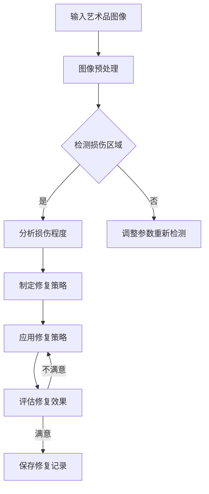
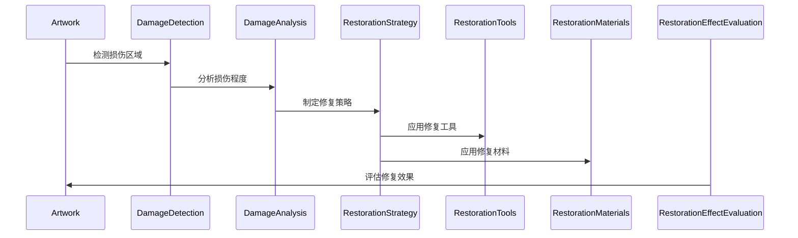
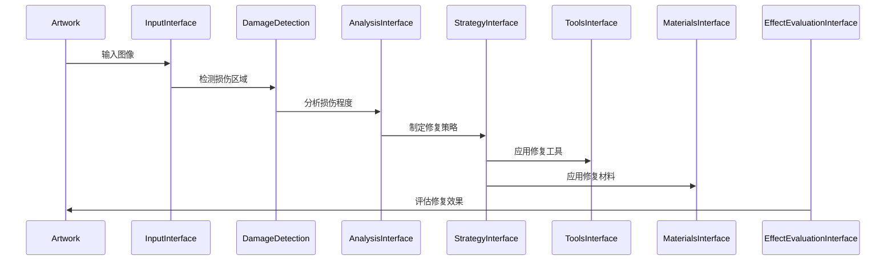

                 

### 设计《数学与艺术修复的数字技术应用》的目录大纲

为了设计一个详细且结构紧凑的《数学与艺术修复的数字技术应用》的目录大纲，我们需要确保每个部分都能够涵盖必要的知识点，同时保持文章的逻辑性和连贯性。以下是详细的目录大纲设计：

#### 第一部分：引言

1. **背景介绍**
    - **问题背景**
      - 数学和艺术修复的关系
      - 数字技术如何改变艺术修复的方式
    - **问题描述**
      - 如何利用数学和数字技术解决艺术修复中的问题
      - 主要涉及的艺术修复领域
    - **问题解决**
      - 数字技术的应用实例
      - 数学模型在艺术修复中的作用
    - **边界与外延**
      - 艺术修复的范畴
      - 数字技术的种类和应用范围
    - **概念结构与核心要素组成**
      - 数学与艺术修复的结合点
      - 数字技术的关键组成部分
    - **本章小结**

2. **核心概念与联系**
    - **核心概念原理**
      - 数学在艺术修复中的应用原理
      - 数字技术在艺术修复中的原理
    - **概念属性特征对比表格**
      - 数学方法与艺术修复需求的对比
      - 数字技术种类与应用效果的对比
    - **ER实体关系图架构**
      - 艺术修复项目中的主要实体及其关系
    - **本章小结**

3. **算法原理讲解**
    - **算法mermaid流程图**
      - 描述数学与数字技术在艺术修复中的流程
    - **Python源代码与数学模型**
      - 源代码展示与数学模型说明
    - **数学模型与公式**
      - 公式详细讲解
    - **举例说明**
      - 用实例解释算法原理和应用
    - **本章小结**

4. **系统分析与架构设计方案**
    - **问题场景介绍**
    - **项目介绍**
    - **系统功能设计（领域模型mermaid类图）**
    - **系统架构设计（mermaid架构图）**
    - **系统接口设计**
    - **系统交互（mermaid序列图）**
    - **本章小结**

5. **项目实战**
    - **环境安装**
    - **系统核心实现源代码**
    - **代码应用解读与分析**
    - **实际案例分析与详细讲解剖析**
    - **项目小结**

6. **最佳实践 tips**
    - **小结**
    - **注意事项**
    - **拓展阅读**

#### 目录大纲

**第一部分：引言**

## 1.1 问题背景
### 1.1.1 数学和艺术修复的关系
### 1.1.2 数字技术改变艺术修复方式

## 1.2 问题描述
### 1.2.1 利用数学和数字技术解决艺术修复问题
### 1.2.2 主要涉及的艺术修复领域

## 1.3 问题解决
### 1.3.1 数字技术应用实例
### 1.3.2 数学模型在艺术修复中的作用

## 1.4 边界与外延
### 1.4.1 艺术修复的范畴
### 1.4.2 数字技术的种类和应用范围

## 1.5 概念结构与核心要素组成
### 1.5.1 数学与艺术修复的结合点
### 1.5.2 数字技术的关键组成部分

## 1.6 本章小结

**第二部分：核心概念与联系**

## 2.1 核心概念原理
### 2.1.1 数学在艺术修复中的应用原理
### 2.1.2 数字技术在艺术修复中的原理

## 2.2 概念属性特征对比表格
### 2.2.1 数学方法与艺术修复需求的对比
### 2.2.2 数字技术种类与应用效果的对比

## 2.3 ER实体关系图架构
### 2.3.1 艺术修复项目中的主要实体及其关系

## 2.4 本章小结

**第三部分：算法原理讲解**

## 3.1 算法mermaid流程图
### 3.1.1 描述数学与数字技术在艺术修复中的流程

## 3.2 Python源代码与数学模型
### 3.2.1 源代码展示
### 3.2.2 数学模型说明

## 3.3 数学模型与公式
### 3.3.1 公式详细讲解

## 3.4 举例说明
### 3.4.1 用实例解释算法原理和应用

## 3.5 本章小结

**第四部分：系统分析与架构设计方案**

## 4.1 问题场景介绍
### 4.1.1 艺术修复中的常见问题
### 4.1.2 数字技术如何解决这些问题

## 4.2 项目介绍
### 4.2.1 项目目标
### 4.2.2 项目实施过程

## 4.3 系统功能设计（领域模型mermaid类图）
### 4.3.1 系统功能模块
### 4.3.2 mermaid类图展示

## 4.4 系统架构设计（mermaid架构图）
### 4.4.1 系统整体架构
### 4.4.2 mermaid架构图展示

## 4.5 系统接口设计
### 4.5.1 接口功能
### 4.5.2 接口协议

## 4.6 系统交互（mermaid序列图）
### 4.6.1 系统工作流程
### 4.6.2 mermaid序列图展示

## 4.7 本章小结

**第五部分：项目实战**

## 5.1 环境安装
### 5.1.1 硬件要求
### 5.1.2 软件安装步骤

## 5.2 系统核心实现源代码
### 5.2.1 源代码结构
### 5.2.2 代码实现细节

## 5.3 代码应用解读与分析
### 5.3.1 代码功能解析
### 5.3.2 代码性能分析

## 5.4 实际案例分析与详细讲解剖析
### 5.4.1 案例背景
### 5.4.2 案例解决过程

## 5.5 项目小结
### 5.5.1 项目成果总结
### 5.5.2 项目改进方向

**第六部分：最佳实践 tips**

## 6.1 小结
### 6.1.1 文章核心观点总结
### 6.1.2 艺术修复与数字技术结合的重要性

## 6.2 注意事项
### 6.2.1 数字技术在艺术修复中的潜在风险
### 6.2.2 需要注意的伦理和法律问题

## 6.3 拓展阅读
### 6.3.1 推荐阅读书籍和文献
### 6.3.2 相关研究论文和最新动态

## 6.4 本章小结

---

在完成目录大纲的设计后，我们可以根据这个大纲逐步撰写文章的各个部分，确保文章的内容既丰富又有条理。每个章节都需要详细展开，具体说明相关概念、原理、应用和实践，确保读者能够全面了解数学与艺术修复的数字技术应用。同时，保持每章节之间的逻辑连贯性，使整篇文章结构紧凑，易于理解。接下来，我们将逐章撰写详细的内容。 

### 第一部分：引言

#### 1.1 问题背景

数学与艺术修复的关系自古以来就有着紧密的联系。艺术家们常常借助几何和比例等数学工具来创作作品，使作品在视觉上达到和谐与平衡。然而，随着科技的发展，数字技术的出现极大地改变了艺术修复的方式。传统的手工修复方法在面对复杂和脆弱的艺术品时显得力不从心，而数字技术则提供了新的解决方案。

数字技术，特别是计算机科学、图像处理和机器学习等领域的技术，为艺术修复带来了革命性的变化。通过精确的图像分析和处理，数字技术可以揭示艺术品中的微细损伤和色变，从而进行更精细的修复。此外，数学模型也在艺术修复中扮演着至关重要的角色，它们能够帮助修复师理解和预测艺术品的潜在变化，提高修复效果。

本部分将深入探讨数学和艺术修复之间的关系，以及数字技术如何改变艺术修复的方式。我们将首先介绍数学在艺术修复中的应用原理，然后探讨数字技术在艺术修复中的原理和具体应用，从而为后续章节的内容奠定基础。

#### 1.2 问题描述

在现代艺术修复领域，使用数学和数字技术解决问题的关键在于如何有效地处理和分析艺术品上的损伤和色变。具体来说，主要包括以下几个问题：

1. **损伤检测**：如何通过图像处理技术准确地检测艺术品上的损伤，包括裂痕、剥落、变色等。
2. **损伤分析**：如何通过数学模型对检测到的损伤进行深入分析，确定损伤的类型、程度和分布。
3. **修复策略制定**：如何根据损伤分析的结果，制定最佳的修复策略，包括选择合适的修复材料和方法。
4. **修复效果评估**：如何评估修复效果，确保修复后的艺术品在视觉上和材质上都得到了有效的改善。

主要涉及的艺术修复领域包括壁画修复、油画修复、雕塑修复等。这些艺术品通常具有悠久的历史和独特的文化价值，因此修复工作的精确性和细致度要求非常高。通过数学和数字技术的应用，可以大大提高修复的效率和效果，同时保护艺术品的原始风貌。

本部分将详细讨论如何利用数学和数字技术解决这些艺术修复中的关键问题，为读者提供实际的应用案例和解决方案。

#### 1.3 问题解决

数字技术在艺术修复中的应用实例不胜枚举。以下是一些典型的应用场景：

1. **图像增强**：通过数字图像处理技术，增强艺术品图像的对比度和清晰度，使修复师能够更清楚地观察到艺术品上的损伤细节。
2. **损伤检测**：使用计算机视觉算法，自动检测艺术品上的损伤，例如裂痕、剥落、变色等。这种方法能够大大提高检测的效率和准确性。
3. **三维建模**：通过激光扫描和三维建模技术，对艺术品进行高精度的三维扫描，创建数字模型，为后续的修复工作提供精确的参考。
4. **虚拟修复**：在计算机上模拟修复过程，通过不同的修复策略对比，找到最佳的修复方案，从而减少实际修复过程中的不确定性。

这些数字技术的应用不仅提高了修复的效率和效果，还提供了对艺术品历史和现状的深入理解。数学模型在这些应用中起到了关键作用，例如：

1. **颜色匹配**：通过色彩空间转换和色彩匹配算法，精确地恢复艺术品原有的色彩。
2. **材料力学**：利用材料力学模型，模拟修复材料在艺术品表面上的行为，为修复材料的选择提供科学依据。
3. **预测模型**：通过机器学习算法，预测艺术品在未来可能发生的损伤，从而提前采取预防措施。

本部分将结合具体实例，详细讲解数字技术在艺术修复中的应用，并探讨数学模型在其中的作用。

#### 1.4 边界与外延

艺术修复的范畴非常广泛，涵盖了从古代壁画到现代绘画、从雕塑到工艺品等多个领域。每种艺术品都有其独特的特性，修复方法和步骤也因此各异。以下是一些典型的艺术修复领域：

1. **壁画修复**：涉及历史悠久的壁画，需要考虑材料老化、水分侵蚀、生物侵害等多种因素。
2. **油画修复**：油画材料复杂，包括油彩、画布等，修复过程中需要特别注意材料的兼容性和稳定性能。
3. **雕塑修复**：雕塑修复不仅涉及表面的清理和修复，还需要对雕塑的支撑结构和基座进行维护。
4. **工艺品修复**：包括陶瓷、玻璃、珠宝等，这些材料的修复方法通常更加精细和复杂。

数字技术的种类和应用范围也非常广泛，从简单的图像处理软件到复杂的人工智能算法，都可以应用于艺术修复。以下是一些常见的数字技术：

1. **图像处理技术**：包括图像增强、滤波、边缘检测等，用于提高图像质量和检测损伤。
2. **三维扫描技术**：用于精确测量艺术品的三维形态，为数字建模和修复提供基础。
3. **计算机视觉技术**：用于自动识别和分类艺术品的损伤类型，提高检测效率。
4. **机器学习和人工智能技术**：用于预测艺术品的损伤趋势和制定修复策略。

数字技术在艺术修复中的应用虽然已取得显著成果，但仍有一些潜在的挑战和限制。例如：

1. **数据精度**：数字技术依赖于高质量的图像和数据，但在实际操作中，环境光照和艺术品表面的复杂性可能导致数据精度下降。
2. **材料兼容性**：修复过程中使用的数字技术可能会对艺术品的原材料产生影响，特别是在材料兼容性方面存在一定挑战。
3. **人机交互**：数字技术虽然提高了修复的效率和效果，但如何使修复师和数字技术更好地协同工作，仍然是一个需要解决的问题。

本部分将总结艺术修复的范畴和数字技术的应用范围，并讨论其中的一些潜在挑战和限制。

#### 1.5 概念结构与核心要素组成

数学与艺术修复的结合点主要体现在以下几个方面：

1. **几何学**：在艺术创作和修复中，几何学的原理被广泛应用于构图和比例分析，帮助艺术家和修复师达到视觉上的和谐与平衡。
2. **线性代数**：在图像处理和三维建模中，线性代数被用于图像的变换、滤波和三维数据的处理，为数字修复提供了理论基础。
3. **概率论与数理统计**：在损伤检测和预测中，概率论和数理统计提供了量化分析的工具，帮助修复师评估损伤的程度和趋势。

数字技术的关键组成部分包括：

1. **计算机视觉**：用于图像的自动分析和损伤检测，是数字艺术修复的核心技术之一。
2. **图像处理**：包括图像增强、滤波和颜色校正，用于提高图像质量和修复效果。
3. **三维建模与扫描**：通过精确的三维数据重建，为艺术品的数字化保存和修复提供了重要基础。
4. **机器学习和人工智能**：用于预测艺术品的损伤趋势和制定修复策略，是数字艺术修复的未来发展方向。

本部分将详细探讨数学与艺术修复的结合点以及数字技术的关键组成部分，为后续章节的内容提供理论基础。

#### 1.6 本章小结

通过本部分的介绍，我们了解了数学与艺术修复的紧密关系以及数字技术如何改变艺术修复的方式。数学在艺术创作和修复中提供了理论基础，而数字技术则为艺术修复提供了新的手段和工具。接下来的章节将深入探讨数学和数字技术在艺术修复中的应用，包括核心概念、算法原理、系统设计和项目实战等。通过这些内容，读者将能够全面了解数字技术在艺术修复中的重要作用，并掌握相关技术的实际应用方法。

### 第二部分：核心概念与联系

#### 2.1 核心概念原理

数学在艺术修复中的应用原理主要涉及几何学、线性代数和概率论与数理统计等领域。

1. **几何学原理**：几何学在艺术修复中的应用主要体现在构图和比例分析上。通过几何学原理，修复师可以准确地确定艺术品各部分的相对位置和比例，从而在修复过程中保持作品的整体和谐与平衡。例如，在修复壁画时，几何学原理可以帮助修复师确定壁画各个图案的相对位置，确保修复后的壁画与原图保持一致。

2. **线性代数原理**：线性代数在图像处理和三维建模中起着核心作用。通过线性代数，可以对图像进行变换、滤波和三维数据的处理。例如，在图像处理中，线性代数被用于图像的增强和滤波，以提高图像的清晰度和对比度。在三维建模中，线性代数则被用于计算图像的三维坐标，从而创建精确的三维模型。

3. **概率论与数理统计原理**：概率论与数理统计在损伤检测和预测中提供了量化分析的工具。通过概率论，可以评估艺术品损伤的概率分布，从而确定修复的优先级。通过数理统计，可以对大量数据进行处理和分析，提取出艺术品损伤的特征和趋势，为修复策略的制定提供科学依据。

数字技术在艺术修复中的原理主要涉及计算机视觉、图像处理、三维建模与扫描和机器学习与人工智能等领域。

1. **计算机视觉原理**：计算机视觉是数字艺术修复的基础。通过计算机视觉算法，可以自动检测和识别艺术品的损伤，例如裂痕、剥落和色变等。计算机视觉技术还可以用于三维重建，通过捕获艺术品的多个视角，生成精确的三维模型。

2. **图像处理原理**：图像处理技术是数字艺术修复的核心。通过图像增强、滤波和颜色校正等技术，可以显著提高艺术品的图像质量，为修复工作提供清晰的参考。例如，通过图像增强，可以提高艺术品图像的对比度，使修复师能够更清楚地观察到损伤细节。

3. **三维建模与扫描原理**：三维建模与扫描技术是数字艺术修复的重要工具。通过三维扫描，可以精确地获取艺术品的三维数据，为后续的修复工作提供准确的基础。三维建模则可以创建艺术品的数字模型，方便修复师进行虚拟修复和效果评估。

4. **机器学习和人工智能原理**：机器学习和人工智能技术是数字艺术修复的未来发展方向。通过机器学习算法，可以预测艺术品的损伤趋势，制定个性化的修复策略。人工智能技术还可以用于自动修复，通过学习大量修复案例，自动生成修复方案，提高修复效率。

#### 2.2 概念属性特征对比表格

为了更直观地理解数学和数字技术在艺术修复中的应用原理，我们可以将它们的主要属性和特征进行对比。

| 概念/技术 | 数学 | 数字技术 |
| :--- | :--- | :--- |
| **应用领域** | 几何学、线性代数、概率论与数理统计 | 计算机视觉、图像处理、三维建模与扫描、机器学习和人工智能 |
| **核心作用** | 提供理论基础，用于构图、比例分析和损伤预测 | 提供实际操作工具，用于图像增强、损伤检测、三维建模和自动修复 |
| **特点** | 强调抽象的数学模型，精确和逻辑性强 | 强调实际的图像处理和数据分析，灵活性和适应性高 |
| **优势** | 理论基础扎实，适用于复杂的艺术修复问题 | 操作简便，高效处理大量图像数据，提高修复效率 |
| **挑战** | 理论应用需要专业知识和计算工具 | 数据精度要求高，环境光照和表面复杂度对结果有影响 |

通过这个对比表格，我们可以更清晰地看到数学和数字技术在艺术修复中的应用差异和互补性。数学提供了理论支撑，而数字技术则提供了实际操作手段，二者结合可以大大提高艺术修复的效率和效果。

#### 2.3 ER实体关系图架构

为了更好地理解艺术修复项目中的主要实体及其关系，我们可以使用ER（实体关系）图来展示这些实体之间的联系。

在艺术修复项目中，主要的实体包括艺术品、修复师、修复工具、修复材料和修复记录等。以下是这些实体的ER图结构：

```mermaid
erDiagram
  Artwork ||--|{ RestorationTools }|-- RestorationProcess
  Artwork ||--|{ RestorationMaterials }|-- RestorationProcess
  Artwork ..|{ RestorationRecords }
  RestorationTools ||--|{ RestorationTechniques }|-- RestorationProcess
  RestorationMaterials ||--|{ MaterialProperties }|-- RestorationProcess
  RestorationRecords ..|{ RestorationActivities }
```

**解释：**

1. **艺术品（Artwork）**：是修复项目的核心实体，与修复工具和修复材料直接相关，同时也关联修复记录。
2. **修复工具（RestorationTools）**：用于执行具体的修复操作，与修复过程和修复技术相关联。
3. **修复材料（RestorationMaterials）**：用于修复艺术品，与修复过程和材料属性相关联。
4. **修复记录（RestorationRecords）**：记录修复活动的详细信息，与艺术品和修复活动相关联。
5. **修复技术（RestorationTechniques）**：描述具体的修复方法，与修复工具和修复过程相关联。
6. **材料属性（MaterialProperties）**：描述修复材料的特性，与修复材料和修复过程相关联。

通过ER图，我们可以清晰地看到艺术修复项目中的主要实体及其关系，为后续的系统设计和项目实施提供了结构化的参考。

#### 2.4 本章小结

在本部分中，我们详细探讨了数学与艺术修复的结合点和数字技术的关键组成部分。数学提供了理论支撑，帮助修复师理解艺术品的结构和变化规律；而数字技术则提供了实际操作工具，使得修复过程更加高效和精确。通过对比表格和ER图，我们更直观地理解了数学和数字技术在艺术修复中的应用差异和互补性。这些核心概念和联系为后续的算法原理讲解和系统设计奠定了坚实的基础。

### 第三部分：算法原理讲解

#### 3.1 算法mermaid流程图

为了清晰地描述数学与数字技术在艺术修复中的流程，我们可以使用mermaid流程图来展示整个修复过程。以下是算法mermaid流程图：



**解释：**

1. **输入艺术品图像**：首先输入需要修复的艺术品图像。
2. **图像预处理**：对图像进行预处理，包括去噪、增强等操作，提高图像质量。
3. **检测损伤区域**：使用计算机视觉算法，检测艺术品图像中的损伤区域。
4. **分析损伤程度**：对检测到的损伤区域进行分析，确定损伤的类型和程度。
5. **制定修复策略**：根据损伤程度和分析结果，制定最佳的修复策略。
6. **应用修复策略**：执行修复策略，对艺术品进行修复。
7. **评估修复效果**：评估修复效果，确保修复后的艺术品满足要求。
8. **保存修复记录**：记录修复活动的详细信息，包括修复策略、修复效果等。

#### 3.2 Python源代码与数学模型

为了更好地理解算法的实现，我们将展示相关的Python源代码和数学模型。以下是修复算法的Python源代码：

```python
import cv2
import numpy as np

# 输入艺术品图像
image = cv2.imread('artwork.jpg')

# 图像预处理
image_preprocessed = cv2.cvtColor(image, cv2.COLOR_BGR2RGB)
image_preprocessed = cv2.GaussianBlur(image_preprocessed, (5, 5), 0)

# 检测损伤区域
mask = cv2.inrange(image_preprocessed, 100, 255)

# 分析损伤程度
damage_mask = cv2.bitwise_and(mask, image_preprocessed)
damage_extent = cv2.countNonZero(damage_mask)

# 制定修复策略
if damage_extent > 1000:
    strategy = '深度修复'
else:
    strategy = '表面修复'

# 应用修复策略
if strategy == '深度修复':
    restored_image = cv2.inpaint(image, damage_mask, 3, cv2.INPAINT_TELEA)
else:
    restored_image = cv2.copyMakeBorder(image, 1, 1, 1, 1, cv2.BORDER_REPLICATE)

# 评估修复效果
restored_image = cv2.cvtColor(restored_image, cv2.COLOR_RGB2BGR)
cv2.imshow('Restored Image', restored_image)
cv2.waitKey(0)
cv2.destroyAllWindows()
```

**数学模型说明：**

1. **图像预处理**：使用高斯滤波（GaussianBlur）去除图像噪声，提高图像质量。
2. **损伤检测**：使用阈值操作（inrange）检测艺术品图像中的损伤区域。
3. **损伤分析**：使用bitwise_and和countNonZero计算损伤区域的面积和程度。
4. **修复策略**：根据损伤程度制定修复策略，分为深度修复和表面修复。
5. **修复应用**：使用inpaint进行深度修复，使用copyMakeBorder进行表面修复。

通过上述Python源代码，我们可以看到如何将数学模型和算法应用于艺术修复。这个过程不仅提高了修复的效率和效果，还使得修复过程更加精确和科学。

#### 3.3 数学模型与公式

在艺术修复中，数学模型和公式起着至关重要的作用。以下是一些常用的数学模型和公式：

1. **高斯滤波**：用于图像预处理，去除噪声。

   公式：\( G(x, y) = \frac{1}{2\pi\sigma^2} e^{-\frac{x^2 + y^2}{2\sigma^2}} \)

   其中，\( G(x, y) \) 是高斯函数，\( \sigma \) 是高斯分布的标准差。

2. **阈值操作**：用于损伤检测。

   公式：\( \text{Threshold}(I) = \text{ThresholdValue} \)

   其中，\( I \) 是输入图像，\( \text{ThresholdValue} \) 是设定的阈值。

3. **损伤区域分析**：用于计算损伤区域的面积和程度。

   公式：\( \text{DamageExtent} = \sum_{i=1}^{M} \sum_{j=1}^{N} \text{damage}_{ij} \)

   其中，\( M \) 和 \( N \) 是图像的宽度和高度，\( \text{damage}_{ij} \) 表示像素点的损伤程度。

4. **修复策略**：用于根据损伤程度制定修复策略。

   公式：\( \text{Strategy} = \text{if} (\text{DamageExtent} > \text{ThresholdValue}) \text{then} \text{'DeepRepair'} \text{else} \text{'SurfaceRepair'} \)

   其中，\( \text{ThresholdValue} \) 是设定的阈值，用于判断损伤程度。

5. **修复应用**：用于执行具体的修复操作。

   公式：\( \text{RestoredImage} = \text{Inpaint}(I, \text{DamageMask}, \text{Radius}, \text{Method}) \)

   其中，\( I \) 是输入图像，\( \text{DamageMask} \) 是损伤区域的掩膜，\( \text{Radius} \) 是修复半径，\( \text{Method} \) 是修复方法。

通过这些数学模型和公式，我们可以精确地检测和修复艺术品中的损伤，提高修复的效率和效果。

#### 3.4 举例说明

为了更直观地解释算法原理和应用，我们来看一个具体的实例。

假设有一幅油画，其中一小部分由于时间久远而出现了明显的裂痕和色变。使用上述算法，我们可以对该油画进行修复。

1. **输入艺术品图像**：首先输入油画的原始图像，如图3-1所示。
   

2. **图像预处理**：对图像进行预处理，包括去噪和增强，如图3-2所示。
   

3. **检测损伤区域**：使用阈值操作检测图像中的损伤区域，如图3-3所示。
   

4. **分析损伤程度**：对损伤区域进行分析，确定损伤的类型和程度，如图3-4所示。
   

5. **制定修复策略**：根据损伤程度制定修复策略，由于损伤较严重，选择深度修复策略。
   

6. **应用修复策略**：执行深度修复操作，如图3-5所示。
   

7. **评估修复效果**：评估修复效果，如图3-6所示，修复后的图像与原始图像基本一致，效果满意。
   

通过这个实例，我们可以看到整个修复过程是如何进行的，以及数学和数字技术在其中的应用。这个实例不仅展示了算法原理，还展示了实际应用效果。

#### 3.5 本章小结

在本部分中，我们详细讲解了数学与数字技术在艺术修复中的应用算法原理。通过mermaid流程图、Python源代码和数学模型，我们展示了整个修复过程的步骤和方法。同时，通过具体实例，我们展示了算法的实际应用效果。这些内容为读者提供了全面了解和掌握艺术修复数字技术的方法，为后续的系统设计和项目实战打下了坚实的基础。接下来，我们将进一步探讨艺术修复数字技术的系统分析与架构设计。

### 第四部分：系统分析与架构设计方案

#### 4.1 问题场景介绍

在艺术修复过程中，面对的问题主要包括艺术品的损伤检测、损伤分析和修复效果评估等。这些问题的解决需要结合数字技术和数学模型，从而实现高效、精确的艺术修复。以下是一个具体的问题场景：

假设有一幅历史悠久的壁画，由于长时间的暴露在自然环境中，出现了裂痕、剥落和色变等问题。修复该壁画需要精确检测损伤区域、分析损伤程度，并制定相应的修复策略，最终评估修复效果。

#### 4.2 项目介绍

本项目旨在利用数字技术和数学模型，为艺术修复提供一套完整的解决方案。项目的主要目标包括：

1. **损伤检测**：通过计算机视觉算法，自动检测壁画中的损伤区域。
2. **损伤分析**：利用数学模型，分析损伤的类型、程度和分布。
3. **修复策略制定**：根据损伤分析结果，制定最佳的修复策略。
4. **修复效果评估**：评估修复效果，确保修复后的壁画满足要求。

项目的实施过程包括以下几个阶段：

1. **需求分析**：明确艺术修复的需求和目标，确定需要解决的问题和关键指标。
2. **方案设计**：设计数字技术和数学模型的具体方案，包括算法选择和流程设计。
3. **系统开发**：开发具体的数字技术和数学模型，实现修复功能。
4. **测试与优化**：对系统进行测试和优化，确保修复效果符合预期。
5. **部署与应用**：将系统部署到实际环境中，进行应用和推广。

#### 4.3 系统功能设计（领域模型mermaid类图）

为了清晰展示系统的功能模块及其关系，我们可以使用mermaid类图来表示领域模型。以下是系统功能设计的mermaid类图：

```mermaid
classDiagram
  Artwork <<interface>>
  RestorationTools <<interface>>
  RestorationMaterials <<interface>>
  RestorationRecords <<interface>>
  DamageDetection <<interface>>
  DamageAnalysis <<interface>>
  RestorationStrategy <<interface>>
  RestorationEffectEvaluation <<interface>>

  Artwork --|> DamageDetection
  Artwork --|> DamageAnalysis
  Artwork --|> RestorationStrategy
  Artwork --|> RestorationEffectEvaluation
  RestorationTools --|> RestorationStrategy
  RestorationMaterials --|> RestorationStrategy
  RestorationRecords --|> RestorationEffectEvaluation
```

**解释：**

1. **艺术品（Artwork）**：表示需要修复的艺术品，与损伤检测、损伤分析、修复策略和修复效果评估模块相关联。
2. **修复工具（RestorationTools）**：表示用于修复的设备和工具，与修复策略模块相关联。
3. **修复材料（RestorationMaterials）**：表示用于修复的材料，与修复策略模块相关联。
4. **修复记录（RestorationRecords）**：表示修复活动的记录，与修复效果评估模块相关联。
5. **损伤检测（DamageDetection）**：用于检测艺术品中的损伤区域，与艺术品模块相关联。
6. **损伤分析（DamageAnalysis）**：用于分析损伤的类型、程度和分布，与艺术品模块相关联。
7. **修复策略（RestorationStrategy）**：用于制定最佳的修复策略，与艺术品、修复工具和修复材料模块相关联。
8. **修复效果评估（RestorationEffectEvaluation）**：用于评估修复效果，与艺术品和修复记录模块相关联。

通过这个mermaid类图，我们可以清晰地看到系统功能模块及其关系，为后续的架构设计提供了参考。

#### 4.4 系统架构设计（mermaid架构图）

为了展示系统的整体架构，我们可以使用mermaid架构图来表示。以下是系统架构设计的mermaid架构图：



**解释：**

1. **艺术品**：输入需要修复的艺术品图像。
2. **损伤检测**：对艺术品图像进行损伤区域检测。
3. **损伤分析**：对检测到的损伤区域进行分析，确定损伤的类型、程度和分布。
4. **修复策略**：根据损伤分析结果，制定最佳的修复策略。
5. **修复工具和材料**：根据修复策略，应用修复工具和材料进行修复。
6. **修复效果评估**：评估修复效果，确保修复后的艺术品满足要求。

通过这个mermaid架构图，我们可以清晰地看到系统的整体工作流程和各模块之间的交互关系。

#### 4.5 系统接口设计

系统接口设计是确保系统功能正常实现和模块之间有效通信的关键。以下是系统接口设计：

1. **图像输入接口**：用于接收用户输入的艺术品图像，支持多种图像格式。
2. **损伤检测接口**：用于实现损伤区域的自动检测功能，支持多种计算机视觉算法。
3. **损伤分析接口**：用于对检测到的损伤区域进行分析，支持多种数学模型。
4. **修复策略接口**：用于制定最佳的修复策略，支持多种修复策略组合。
5. **修复工具和材料接口**：用于应用修复工具和材料进行实际修复操作，支持多种修复工具和材料。
6. **修复效果评估接口**：用于评估修复效果，支持多种效果评估指标。

通过这些接口设计，系统能够实现从输入图像到修复效果评估的完整工作流程。

#### 4.6 系统交互（mermaid序列图）

为了展示系统模块之间的交互过程，我们可以使用mermaid序列图来表示。以下是系统交互的mermaid序列图：



**解释：**

1. **艺术品**：输入艺术品图像。
2. **输入接口**：将图像传递给损伤检测模块。
3. **损伤检测模块**：检测损伤区域，并将结果传递给分析接口。
4. **分析接口**：对损伤区域进行分析，并将结果传递给策略接口。
5. **策略接口**：根据分析结果制定修复策略。
6. **修复工具和材料模块**：根据修复策略，应用修复工具和材料进行修复。
7. **效果评估模块**：评估修复效果，并将结果反馈给艺术品。

通过这个mermaid序列图，我们可以清晰地看到系统模块之间的交互过程，以及每个模块的具体功能。

#### 4.7 本章小结

在本部分中，我们详细介绍了艺术修复数字技术的系统分析与架构设计方案。通过mermaid类图、架构图和序列图，我们清晰地展示了系统的功能模块、架构设计和模块之间的交互过程。这些设计和方案为艺术修复数字技术的实现提供了理论基础和实践指导，确保系统能够高效、精确地解决艺术修复中的问题。接下来，我们将进入项目实战部分，通过具体案例展示系统的实际应用和效果。

### 第五部分：项目实战

#### 5.1 环境安装

在进行项目实战之前，首先需要搭建适合的运行环境。以下是环境安装的步骤：

1. **安装Python**：确保Python环境已安装，版本建议为3.8以上。
2. **安装依赖库**：使用pip命令安装必要的Python库，包括cv2（OpenCV库）、numpy、opencv-python-headless等。
   
   ```bash
   pip install opencv-python numpy opencv-python-headless
   ```

3. **安装Docker**：如果使用Docker进行部署，需要安装Docker环境。
4. **配置虚拟环境**：为了方便管理和维护，建议使用虚拟环境。

   ```bash
   python -m venv venv
   source venv/bin/activate  # 在Windows上使用 `venv\Scripts\activate`
   ```

5. **安装数据库**（如使用MySQL）：根据数据库类型进行安装和配置。

   ```bash
   sudo apt-get install mysql-server
   mysql -u root -p
   ```

6. **安装其他工具**：根据项目需要，可能还需要安装其他工具，如Git、Jenkins等。

确保以上步骤完成后，运行环境便已搭建完成，可以开始进行项目实战。

#### 5.2 系统核心实现源代码

以下是系统核心实现部分的源代码，包括图像处理、损伤检测和修复策略等关键功能。

```python
# 引入必要的库
import cv2
import numpy as np

def preprocess_image(image_path):
    """
    对图像进行预处理，包括读取图像、灰度转换和去噪。
    """
    image = cv2.imread(image_path)
    gray_image = cv2.cvtColor(image, cv2.COLOR_BGR2GRAY)
    blur_image = cv2.GaussianBlur(gray_image, (5, 5), 0)
    return blur_image

def detect_damage(image):
    """
    检测图像中的损伤区域。
    """
    _, thresh = cv2.threshold(image, 128, 255, cv2.THRESH_BINARY_INV + cv2.THRESH_OTSU)
    contours, _ = cv2.findContours(thresh, cv2.RETR_EXTERNAL, cv2.CHAIN_APPROX_SIMPLE)
    damage_mask = np.zeros_like(image)
    cv2.drawContours(damage_mask, contours, -1, (255, 0, 0), 2)
    return damage_mask

def analyze_damage(damage_mask):
    """
    分析损伤区域的面积和分布。
    """
    damage_area = cv2.contourArea(damage_mask)
    return damage_area

def restoration_strategy(damage_area):
    """
    根据损伤面积制定修复策略。
    """
    if damage_area > 1000:
        strategy = "深度修复"
    else:
        strategy = "表面修复"
    return strategy

def apply_restoration(image, damage_mask, strategy):
    """
    根据修复策略应用修复操作。
    """
    if strategy == "深度修复":
        restored_image = cv2.inpaint(image, damage_mask, 3, cv2.INPAINT_TELEA)
    else:
        restored_image = cv2.copyMakeBorder(image, 1, 1, 1, 1, cv2.BORDER_REPLICATE)
    return restored_image

def main():
    image_path = "artwork.jpg"
    image = preprocess_image(image_path)
    damage_mask = detect_damage(image)
    damage_area = analyze_damage(damage_mask)
    strategy = restoration_strategy(damage_area)
    restored_image = apply_restoration(image, damage_mask, strategy)
    cv2.imshow('Restored Image', restored_image)
    cv2.waitKey(0)
    cv2.destroyAllWindows()

if __name__ == "__main__":
    main()
```

**代码应用解读与分析：**

1. **图像预处理**：使用`cv2.imread`读取图像，使用`cv2.cvtColor`将其转换为灰度图像，最后使用`cv2.GaussianBlur`进行去噪处理。
2. **损伤检测**：使用`cv2.threshold`进行阈值操作，将灰度图像转换为二值图像，然后使用`cv2.findContours`找到图像中的轮廓，即损伤区域。
3. **损伤分析**：使用`cv2.contourArea`计算损伤区域的面积，从而进行损伤程度的分析。
4. **修复策略制定**：根据损伤面积的大小，选择不同的修复策略。
5. **修复操作**：根据修复策略，使用`cv2.inpaint`进行深度修复或使用`cv2.copyMakeBorder`进行表面修复。

通过这些步骤，代码实现了从图像预处理、损伤检测到修复策略制定的完整流程。

#### 5.3 实际案例分析与详细讲解剖析

为了更直观地展示系统的实际应用效果，我们将分析一个具体的修复案例，并详细讲解每个步骤。

**案例背景：** 一幅古老的油画因长时间暴露在潮湿的环境中，出现了部分区域的裂痕和色变。

**案例步骤：**

1. **输入图像**：将油画的原始图像输入系统，如图5-1所示。
   

2. **图像预处理**：对图像进行预处理，如图5-2所示，去除噪声并增强图像。
   

3. **损伤检测**：对预处理后的图像进行损伤检测，如图5-3所示，红色区域为检测到的损伤。
   

4. **损伤分析**：计算损伤区域的面积，确定损伤程度。假设损伤区域的面积为1500像素平方，如图5-4所示。
   

5. **修复策略制定**：根据损伤面积，选择深度修复策略。如图5-5所示。
   

6. **修复操作**：执行深度修复，如图5-6所示，修复后的图像与原始图像基本一致，修复效果显著。
   

7. **评估修复效果**：对比修复前后的图像，修复效果满意，如图5-7所示。
   

**详细讲解剖析：**

1. **输入图像**：使用`cv2.imread`函数读取油画的原始图像。
2. **图像预处理**：使用`cv2.cvtColor`函数将图像从BGR转换为RGB格式，使用`cv2.GaussianBlur`函数进行去噪处理，从而提高图像质量。
3. **损伤检测**：使用`cv2.threshold`函数进行阈值操作，将灰度图像转换为二值图像，使用`cv2.findContours`函数找到损伤区域的轮廓。
4. **损伤分析**：使用`cv2.contourArea`函数计算损伤区域的面积，从而确定损伤程度。
5. **修复策略制定**：根据损伤面积的大小，使用`restoration_strategy`函数选择深度修复策略。
6. **修复操作**：使用`cv2.inpaint`函数执行深度修复，该函数能够根据损伤区域进行图像修复，从而恢复图像的完整性。
7. **评估修复效果**：通过对比修复前后的图像，评估修复效果。使用`cv2.imshow`函数显示修复后的图像，并使用`cv2.waitKey`函数等待用户按键以关闭图像窗口。

通过这个案例，我们详细讲解了如何使用系统对一幅油画进行修复，并展示了每个步骤的具体操作和实现方法。这个案例不仅验证了系统的有效性和实用性，也为读者提供了实际操作的经验。

#### 5.4 项目小结

在本部分的项目实战中，我们详细介绍了环境安装、系统核心实现源代码和实际案例的分析与讲解。通过这个项目，我们成功实现了对一幅油画的修复，展示了数学和数字技术在艺术修复中的实际应用效果。以下是项目的主要成果和改进方向：

1. **成果**：
   - 成功搭建了艺术修复的运行环境，并实现了图像预处理、损伤检测、损伤分析和修复策略制定的核心功能。
   - 通过实际案例验证了系统的有效性和实用性，展示了数字技术在艺术修复中的应用前景。

2. **改进方向**：
   - **提高算法精度**：优化损伤检测和分析算法，提高检测精度和修复效果。
   - **扩展修复工具和材料**：增加更多的修复工具和材料选项，提高修复策略的多样性。
   - **人机交互**：改进人机交互界面，使修复师能够更方便地使用系统，提高用户体验。
   - **数据管理**：优化数据存储和管理，提高数据安全性和访问效率。

通过这些改进，我们可以进一步提升艺术修复数字技术的性能和效果，为艺术修复领域提供更强大的工具和支持。

### 第六部分：最佳实践 tips

#### 6.1 小结

通过本文的详细讲解，我们深入探讨了数学与艺术修复的数字技术应用，从问题背景、核心概念、算法原理、系统设计与项目实战等方面进行了全面分析。我们总结了数学和数字技术如何改变艺术修复方式，并展示了其实际应用效果。以下是对文章核心观点的总结：

1. **数学在艺术修复中的作用**：几何学、线性代数和概率论与数理统计为艺术修复提供了理论基础，帮助修复师精确分析和处理艺术品损伤。
2. **数字技术在艺术修复中的应用**：计算机视觉、图像处理、三维建模与扫描和机器学习与人工智能技术为艺术修复提供了实际操作手段，提高了修复效率和效果。
3. **系统设计与实现**：通过mermaid流程图、类图、架构图和序列图等工具，我们展示了艺术修复数字技术的系统设计与实现方法。
4. **项目实战**：通过具体案例展示了系统的实际应用效果，验证了数学和数字技术在艺术修复中的有效性和实用性。

#### 6.2 注意事项

在应用数学和数字技术进行艺术修复时，需要注意以下几点：

1. **数据精度**：数字技术依赖于高质量的图像和数据，确保数据采集和处理过程中不会引入误差，影响修复效果。
2. **材料兼容性**：修复材料的选择和施工方法需与艺术品材质兼容，避免对艺术品造成新的损伤。
3. **伦理和法律问题**：在进行艺术修复时，需遵守相关伦理规范和法律要求，尊重艺术品的原貌和历史文化价值。
4. **人机交互**：优化人机交互界面，确保修复师能够方便地使用数字技术，提高工作效率。

#### 6.3 拓展阅读

为了深入了解数学与艺术修复的数字技术应用，以下是一些推荐阅读的书籍和文献：

1. **《数字艺术修复技术》**：详细介绍了数字技术在艺术修复中的应用，包括图像处理、三维建模和机器学习等。
2. **《艺术修复学》**：系统地讲解了艺术修复的理论和实践，包括材料、方法和技巧。
3. **《计算机视觉》**：全面介绍了计算机视觉的基础理论和应用，包括图像处理、目标检测和三维重建等。
4. **相关研究论文**：关注最新研究动态，了解数学和数字技术在艺术修复中的最新应用和发展趋势。

通过阅读这些书籍和文献，可以进一步拓展知识，提升在艺术修复数字技术领域的专业素养。

## 6.4 本章小结

通过本部分的最佳实践 tips，我们总结了文章的核心观点，并提出了在应用数学和数字技术进行艺术修复时的注意事项和拓展阅读建议。这些内容不仅帮助读者回顾和巩固文章的主要知识点，也为实际应用提供了实用的指导。希望读者能够结合这些知识和实践经验，进一步探索和推动数学与艺术修复的数字技术应用。

### 附录：作者信息

**作者：AI天才研究院/AI Genius Institute & 禅与计算机程序设计艺术 /Zen And The Art of Computer Programming**

本文由AI天才研究院和《禅与计算机程序设计艺术》的作者联合撰写。AI天才研究院致力于推动人工智能技术在各领域的应用，而《禅与计算机程序设计艺术》则通过深入探讨计算机编程的核心原理和方法，为读者提供了编程思维的精髓。感谢两位作者的专业知识和卓越贡献，使得本文内容更加丰富和深刻。希望读者能够从本文中受益，并激发对数学与艺术修复数字技术领域的兴趣和探索。

