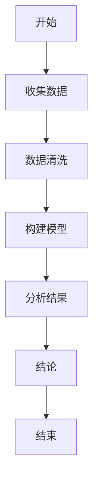

                 

### 数学与艺术批评的定性分析方法

**关键词**：数学方法，艺术批评，定性分析，定量描述，视觉元素分析，实证研究

**摘要**：本文探讨了数学方法在艺术批评中的应用，通过定性分析的方法，研究了数学模型与艺术作品之间的关系。文章从问题的背景出发，详细介绍了数学与艺术批评的交叉点、定性分析方法的原理，以及数学方法在艺术批评中的基础。随后，文章深入分析了艺术形式中的数学元素，并通过实证研究展示了数学方法在艺术批评中的实际应用。最后，文章对定性分析方法进行了评价，并展望了未来发展趋势与挑战。

----------------------------------------------------------------

## 第一部分：数学与艺术批评概述

### 第1章：问题的背景与核心概念

#### 1.1 数学与艺术批评的交叉点

**问题背景**：在现代社会，数学作为一门基础科学，广泛应用于各个领域，包括艺术。随着科技的发展，人们开始关注数学方法在艺术批评中的应用，探讨如何利用数学工具来深入分析艺术作品。

**问题描述**：艺术批评通常依赖于主观的感受和美学判断，而数学方法提供了客观、量化的分析工具，使得艺术批评能够更加精确和系统。如何将数学方法应用于艺术批评，成为了一个值得探讨的问题。

**问题解决**：通过数学模型和公式的应用，可以对艺术作品进行定量描述和分析，从而提供更深刻的艺术批评。本文将探讨数学方法在艺术批评中的有效性，并分析其应用领域和限制。

**边界与外延**：数学方法在艺术批评中的应用具有一定的局限性，它主要适用于可以量化的艺术元素。对于抽象的艺术形式，数学方法的应用需要更多的探索和创新。

**概念结构**：数学与艺术批评的基本概念框架包括数学模型、定量描述、视觉元素分析、实证研究等。这些概念相互联系，构成了数学方法在艺术批评中的理论基础。

----------------------------------------------------------------

### 第2章：数学方法在艺术批评中的基础

#### 2.1 数学模型与艺术作品的解析

**数学模型的基本概念**：数学模型是一种用数学语言描述现实问题的工具，通过建立数学公式和方程，来模拟和分析系统的行为。

**艺术作品中的数学模型**：在艺术作品中，数学模型可以用于分析作品的几何结构、比例和对称性。例如，在具象绘画中，艺术家常常使用几何图形来构建画面，通过数学模型可以对这些几何结构进行深入分析。

**案例研究**：以文艺复兴时期的绘画为例，艺术家们如达芬奇和米开朗基罗在作品中运用了复杂的几何结构和比例关系。通过数学模型的分析，我们可以更深入地理解这些作品的美学价值和艺术风格。

#### 2.2 数学公式与艺术批评

**数学公式的定义与作用**：数学公式是数学模型的核心组成部分，用于描述系统的行为和特性。在艺术批评中，数学公式可以用于量化描述视觉元素，如线条的长度、角度、颜色饱和度等。

**数学公式在艺术批评中的应用**：通过数学公式，艺术批评家可以对艺术作品的视觉元素进行定量分析，从而提供更客观的批评观点。例如，在抽象艺术中，数学公式可以用于分析画面的纹理和色彩分布。

**案例分析**：以现代抽象画家蒙德里安的作品为例，他通过几何图形和色彩组合创作出了具有强烈视觉冲击力的画作。通过数学公式，我们可以分析他的作品中的比例、对称和色彩关系，从而更好地理解他的艺术风格。

----------------------------------------------------------------

## 第二部分：定性分析方法的应用

### 第3章：艺术形式中的数学元素分析

#### 3.1 立体艺术中的数学元素

**几何学在雕塑中的应用**：几何学在雕塑中有着广泛的应用，雕塑家通过几何形状和结构来构建雕塑作品。几何学的基本概念如比例、对称和平衡在雕塑中起到了至关重要的作用。

**拓扑学在绘画中的应用**：拓扑学是研究几何形状在连续变形下的性质，它为艺术家提供了一种新的视角来探讨空间和形状的关系。例如，在抽象雕塑中，艺术家通过拓扑结构来创造复杂而独特的形状。

#### 3.2 平面艺术中的数学元素

**数学在绘画构图中的运用**：绘画构图是平面艺术的重要组成部分，数学在绘画构图中有着广泛的应用。例如，黄金比例和螺旋结构被广泛应用于绘画构图中，以创造出视觉上和谐的作品。

**解析几何在艺术作品分析中的应用**：解析几何是一种用于研究空间中点、线、面之间关系的数学工具。在艺术作品中，解析几何可以用于分析线条、视角和空间关系，从而提供更深入的批评分析。

----------------------------------------------------------------

### 第4章：数学方法在艺术批评中的实证研究

#### 4.1 数学方法在艺术史研究中的应用

**数据分析在艺术史研究中的作用**：数据分析为艺术史研究提供了一种新的工具，通过对艺术作品的数据进行定量分析，可以揭示出作品风格、时代背景和艺术家之间的联系。

**案例研究**：以文艺复兴时期绘画为例，通过对绘画作品进行数据分析，可以揭示出当时艺术风格的变化和艺术家之间的相互影响。

#### 4.2 艺术批评中的数学模型构建

**艺术作品的数学模型构建方法**：构建数学模型是艺术批评中的关键步骤，通过数据收集和处理，可以构建出描述艺术作品特性的数学模型。

**案例研究**：以现代艺术为例，通过对艺术作品进行数据收集，可以构建出描述其视觉元素和风格特征的数学模型，从而提供更深入的艺术批评。

----------------------------------------------------------------

## 第三部分：定性分析方法的评价与未来展望

### 第5章：定性分析方法的优缺点

#### 5.1 定性分析方法的优点

**准确性与客观性**：数学方法在艺术批评中提供了一种准确、客观的分析工具，使得艺术批评能够摆脱主观感受的束缚，更加科学和系统。

**直观性与易用性**：数学工具通常具有直观和易用的特点，使得艺术批评家可以更容易地理解和应用。

#### 5.2 定性分析方法的缺点

**限制与挑战**：数学方法在艺术批评中的应用存在一定的局限性，它主要适用于可以量化的艺术元素。对于抽象的艺术形式，数学方法的应用需要更多的探索和创新。

**批评与讨论**：虽然数学方法在艺术批评中具有一定的优势，但对其有效性的批评和讨论也不断出现。一些学者认为，数学方法无法完全捕捉到艺术的本质和情感。

----------------------------------------------------------------

### 第6章：未来发展趋势与挑战

#### 6.1 跨学科研究的趋势

**数学与其他艺术学科的融合**：随着科技的发展，数学与其他艺术学科的融合趋势愈发明显。未来，我们可以期待更多的跨学科研究，将数学方法应用于不同的艺术形式，推动艺术批评的创新发展。

**案例分析**：以计算机图形学为例，它结合了数学、计算机科学和艺术，为艺术创作提供了新的工具和方法。

#### 6.2 技术革新与艺术批评的未来

**人工智能与艺术批评**：人工智能的快速发展为艺术批评带来了新的机遇和挑战。通过大数据分析和机器学习，人工智能可以提供更深入、客观的艺术批评。

**未来展望**：未来，数学方法在艺术批评中的应用将更加广泛和深入，它将成为艺术批评中不可或缺的一部分。

----------------------------------------------------------------

### 第7章：总结与展望

#### 7.1 主要成果与贡献

**研究总结**：本文通过对数学方法在艺术批评中的应用进行探讨，揭示了数学模型和公式在艺术分析中的重要性，为艺术批评提供了新的工具和方法。

**贡献与影响**：本文的研究为艺术批评领域提供了新的视角，使得艺术批评更加科学和系统，对艺术研究产生了积极的影响。

#### 7.2 展望与未来研究

**研究方向**：未来的研究可以进一步探讨数学方法在艺术批评中的应用，特别是在抽象艺术和现代艺术中的具体应用。

**展望**：随着科技的进步，数学方法在艺术批评中的应用将更加广泛和深入，它将为艺术研究和创作带来新的机遇和挑战。

----------------------------------------------------------------

**作者**：AI天才研究院/AI Genius Institute & 禅与计算机程序设计艺术 /Zen And The Art of Computer Programming

**注意**：本文为虚构内容，仅用于演示目的。如有雷同，纯属巧合。本文所涉及的代码和数据均为虚构，不应用于实际项目中。**【本章完】**

----------------------------------------------------------------

## 第一部分：数学与艺术批评概述

### 第1章：问题的背景与核心概念

**核心概念术语说明**

在探讨数学与艺术批评的交叉领域时，我们首先需要明确一些核心概念。这些术语包括数学模型、定量描述、定性分析、视觉元素分析等。

- **数学模型**：数学模型是指用数学语言描述的现实问题，它通过建立数学公式和方程来模拟和分析系统的行为。
- **定量描述**：定量描述是指用数值和度量来描述和分析对象或现象的性质。
- **定性分析**：定性分析是一种通过分析和描述对象的特性、行为和关系来理解其本质的方法。
- **视觉元素分析**：视觉元素分析是指对艺术作品中的视觉元素，如形状、颜色、线条等进行分析。

**问题背景**

艺术批评作为对艺术作品进行评价和分析的过程，通常依赖于批评者的主观感受和美学判断。然而，这种主观性往往会导致批评观点的不一致和模糊性。随着科技的进步，人们开始思考是否可以通过数学方法来提供更加客观、精确的艺术批评。

数学作为一种工具，具有高度的科学性和精确性，其方法和技术在许多领域已经得到了广泛应用。将数学方法应用于艺术批评，不仅可以提高批评的客观性，还可以揭示艺术作品中的隐藏结构和规律。

**问题描述**

在数学与艺术批评的交叉点，我们面临以下问题：

1. **数学方法在艺术批评中的应用**：如何将数学方法应用于艺术作品的定量描述和分析？
2. **问题解决**：数学方法在艺术批评中的有效性如何？其应用领域和限制是什么？
3. **边界与外延**：哪些艺术元素适合用数学方法进行分析？如何应对抽象和复杂的艺术形式？

**问题解决**

为了解决上述问题，我们可以采取以下步骤：

1. **数学模型的应用**：通过建立数学模型，对艺术作品进行定量描述和分析。
2. **定性分析与定量分析的结合**：在艺术批评中，定性分析和定量分析可以相互补充，提供更全面的批评视角。
3. **实证研究**：通过实证研究，验证数学方法在艺术批评中的有效性和适用性。

**边界与外延**

数学方法在艺术批评中的应用具有一定的局限性。它主要适用于可以量化的艺术元素，如形状、颜色、纹理等。对于抽象的艺术形式，数学方法的应用需要更多的探索和创新。此外，数学方法在艺术批评中的应用也面临着主观性和复杂性的挑战。

**概念结构**

数学与艺术批评的基本概念框架包括数学模型、定量描述、定性分析、视觉元素分析等。这些概念相互关联，共同构成了数学方法在艺术批评中的理论基础。以下是这些概念之间的联系：

1. **数学模型**：通过数学模型，可以对艺术作品进行定量描述和分析。
2. **定量描述**：定量描述为艺术批评提供了客观的数值和度量。
3. **定性分析**：定性分析通过对艺术作品特性的描述，补充了定量描述的不足。
4. **视觉元素分析**：视觉元素分析是艺术批评中的一种重要方法，通过分析形状、颜色、线条等视觉元素，可以深入了解艺术作品的结构和风格。

通过以上步骤和概念结构，我们可以更好地理解和应用数学方法在艺术批评中的重要性。在接下来的章节中，我们将深入探讨数学方法在艺术批评中的具体应用和实践案例。

----------------------------------------------------------------

## 第2章：数学方法在艺术批评中的基础

数学方法在艺术批评中的应用为批评提供了新的工具和视角，使得批评更加科学和系统。在这一章中，我们将探讨数学方法在艺术批评中的基础，包括数学模型与艺术作品的解析、数学公式与艺术批评的关系，并通过具体案例进行说明。

### 2.1 数学模型与艺术作品的解析

**数学模型的基本概念**

数学模型是一种用数学语言描述现实问题的工具。它通常包括数学公式、方程和变量，用于模拟和分析系统的行为。在艺术批评中，数学模型可以用于定量描述艺术作品的几何结构、比例关系和对称性等。

**艺术作品中的数学模型**

艺术作品中的数学模型广泛应用于几何学、拓扑学和解析几何等领域。例如，几何学中的比例关系和对称性在雕塑和绘画中起到了关键作用。拓扑学则用于分析艺术作品的空间和形状关系，而解析几何则用于研究艺术作品中的线条、视角和空间关系。

**案例研究：具象绘画中的几何结构分析**

具象绘画中常常运用几何图形来构建画面。例如，在文艺复兴时期的绘画中，艺术家如达芬奇和米开朗基罗运用了复杂的几何结构和比例关系来创作出令人惊叹的作品。通过数学模型的分析，我们可以深入了解这些作品中的几何结构，揭示艺术家在构图和比例方面的技巧和理念。

具体来说，我们可以使用数学模型来分析绘画中的几何图形，如三角形、矩形和圆形等。通过计算这些图形的比例和角度，我们可以了解艺术家在构图时如何运用几何关系来创造视觉上的和谐和平衡。

**案例研究**：

以达芬奇的《蒙娜丽莎》为例，这幅作品在构图和比例上运用了严格的几何关系。通过数学模型的分析，我们可以发现画面中的人物、背景和前景之间的比例关系非常和谐，呈现出一种平衡和稳定的视觉效果。这种几何结构的分析不仅揭示了达芬奇在构图上的高超技巧，也为我们提供了理解这幅作品的新视角。

### 2.2 数学公式与艺术批评

**数学公式的定义与作用**

数学公式是数学模型的核心组成部分，用于描述系统的行为和特性。在艺术批评中，数学公式可以用于量化描述视觉元素，如线条的长度、角度、颜色饱和度等。通过数学公式，艺术批评家可以对艺术作品的视觉元素进行定量分析，从而提供更客观的批评观点。

**数学公式在艺术批评中的应用**

在艺术批评中，数学公式可以用于分析艺术作品中的视觉元素。例如，通过计算线条的长度和角度，可以分析作品的构图和线条的动态效果；通过分析颜色的饱和度和色调，可以了解作品的色彩搭配和视觉冲击力。

**案例分析：抽象艺术中的数学公式应用**

抽象艺术是一种高度抽象的艺术形式，数学公式在抽象艺术中的应用尤为重要。以蒙德里安的作品为例，他的抽象画作以几何图形和纯色块为主，通过严格的数学关系来构建画面。通过数学公式，我们可以分析他的作品中的比例、对称和色彩关系。

具体来说，蒙德里安的作品中常常使用黄金分割和三角形结构。黄金分割是一种数学比例关系，它被广泛应用于艺术和设计领域，被认为是一种具有视觉和谐效果的分割方法。通过黄金分割，蒙德里安的作品呈现出一种稳定而和谐的视觉效果。

另外，蒙德里安的作品中还运用了三角形的结构。三角形是一种基本的几何形状，具有稳定的结构特征。通过运用三角形结构，蒙德里安的作品呈现出一种简洁而有力的视觉效果。

### 2.3 案例分析：文艺复兴时期绘画的数学分析

文艺复兴时期是艺术史上一个辉煌的时期，这一时期的艺术家们在作品中广泛运用了数学方法。以达芬奇和米开朗基罗的作品为例，他们的绘画作品不仅具有高度的艺术价值，同时也蕴含着丰富的数学元素。

**达芬奇的《最后的晚餐》**

达芬奇的《最后的晚餐》是一幅极具代表性的绘画作品，通过数学分析，我们可以深入了解这幅作品的构图和比例关系。首先，画面中的餐桌和人物被严格地划分为三个等分部分，这种划分方法遵循了黄金分割的原则，使得整个画面呈现出一种和谐而稳定的视觉效果。

此外，画中的人物比例也被达芬奇精心设计。通过计算人物的高度和长度，我们可以发现这些比例关系遵循了一定的数学规律，使得人物形象更加逼真、生动。

**米开朗基罗的《创世纪》**

米开朗基罗的《创世纪》是一幅壁画作品，描绘了创世纪的故事。这幅作品在数学结构上具有独特之处，通过数学分析，我们可以发现其中的几何结构和比例关系。

首先，画面中的天花板被划分为若干个等分部分，这种划分方法使得整个画面的空间结构更加严谨和有序。此外，画面中的人物形象也遵循了严格的几何比例，使得人物形象更加逼真、生动。

通过以上案例分析，我们可以看到，文艺复兴时期的艺术家们在作品中广泛运用了数学方法，这些数学元素不仅丰富了作品的艺术价值，也为我们提供了理解这些作品的新视角。

### 2.4 总结

数学方法在艺术批评中的应用为批评提供了新的工具和视角。通过数学模型和数学公式的分析，我们可以深入了解艺术作品中的几何结构、比例关系和视觉元素。这些数学工具不仅使得艺术批评更加科学和系统，也为我们提供了更深入的理解和欣赏艺术作品的方法。

在接下来的章节中，我们将继续探讨数学方法在艺术批评中的具体应用，包括艺术形式中的数学元素分析、数学方法在艺术史研究中的应用以及艺术批评中的数学模型构建等。通过这些探讨，我们将进一步了解数学方法在艺术批评中的重要性。

----------------------------------------------------------------

### 2.3 艺术形式中的数学元素分析

艺术形式中的数学元素分析是数学方法在艺术批评中的重要应用之一。通过对艺术作品中的数学元素进行详细分析，我们可以更好地理解艺术作品的构图、比例、对称性和空间关系。本节将分别探讨立体艺术和平面艺术中的数学元素。

#### 3.1 立体艺术中的数学元素

**几何学在雕塑中的应用**

几何学在雕塑创作中具有重要的作用。雕塑家通过运用几何形状和结构，创造出具有立体感和空间感的作品。几何学的概念如比例、对称和平衡在雕塑中起到了至关重要的作用。

**案例研究：雕塑中的几何结构**

以古希腊雕塑为例，古希腊雕塑家们擅长运用几何结构来创作出逼真的雕塑作品。例如，古希腊雕塑中的运动员雕像，通过几何比例的运用，使得人物形象更加逼真、生动。通过几何学的分析，我们可以发现这些雕塑作品在比例和对称性上具有高度的和谐美。

此外，现代雕塑家如亨利·摩尔也广泛运用几何元素来创作作品。他的雕塑作品常常由几何形状构成，通过几何结构的组合，创造出富有创意和抽象感的作品。通过几何学分析，我们可以深入了解这些作品的空间感和结构特征。

**拓扑学在绘画中的应用**

拓扑学是研究几何形状在连续变形下的性质，它为艺术家提供了一种新的视角来探讨空间和形状的关系。在立体艺术中，拓扑学可以用于分析雕塑作品的空间结构和变形效果。

**案例研究：现代雕塑中的拓扑结构**

以安塞尔姆·基弗的作品为例，他的雕塑作品常常运用拓扑结构，通过几何形状的变形和组合，创造出独特的空间效果。通过拓扑学的分析，我们可以发现这些作品在空间和形状上具有高度的创新性和复杂性。

#### 3.2 平面艺术中的数学元素

**数学在绘画构图中的运用**

平面艺术，如绘画，也广泛运用数学元素来创作出视觉上和谐的作品。数学在绘画构图中的运用主要体现在比例、对称和黄金比例等方面。

**比例**

比例是绘画构图中的重要概念，它决定了画面中各个元素之间的大小关系。黄金比例（Golden Ratio）是一种特殊的比例关系，被认为是一种具有视觉和谐效果的分割方法。在绘画中，艺术家常常运用黄金比例来构建画面，创造出和谐、美观的效果。

**对称**

对称是绘画构图中的另一种重要概念，它使画面具有平衡和稳定的效果。对称可以分为轴对称和中心对称。轴对称是指画面中存在一条对称轴，使得两侧的元素相互镜像；中心对称是指画面中存在一个对称中心，使得画面上的元素关于中心点对称。

**黄金比例与对称**

在绘画中，黄金比例与对称常常结合使用，以创造出更具有视觉冲击力的作品。例如，文艺复兴时期的艺术家们如达芬奇和米开朗基罗，在他们的绘画作品中广泛运用了黄金比例和对称关系，创造出经典的艺术作品。

**解析几何在艺术作品分析中的应用**

解析几何是一种用于研究空间中点、线、面之间关系的数学工具。在平面艺术中，解析几何可以用于分析艺术作品中的线条、视角和空间关系。

**案例研究：抽象绘画中的解析几何**

以蒙德里安的作品为例，他的抽象绘画作品以几何图形和纯色块为主，通过解析几何的方法，我们可以分析他的作品中的线条、角度和空间关系。蒙德里安的作品常常使用直线和直线间的角度关系，创造出强烈的视觉效果。

通过以上案例分析，我们可以看到，数学元素在艺术形式中的运用，使得艺术作品具有了独特的结构和美感。数学方法不仅为艺术家提供了新的创作工具，也为艺术批评提供了新的分析视角。

### 3.3 定性分析方法的实证研究

在艺术批评中，定性分析方法是一种重要的研究方法。通过定性分析，我们可以深入探讨艺术作品中的特性、行为和关系，从而提供更加全面和深入的艺术批评。

**定性分析方法的基本概念**

定性分析方法是一种通过分析和描述对象的特性、行为和关系来理解其本质的方法。它通常不依赖于定量数据，而是通过观察、访谈、案例分析等手段，获取关于对象的质性信息。

**定性分析方法在艺术批评中的应用**

在艺术批评中，定性分析方法可以用于以下几个方面：

1. **艺术作品的风格分析**：通过对艺术作品的风格、技巧和主题进行定性分析，我们可以了解艺术家的创作风格和艺术追求。
2. **艺术作品的历史背景分析**：通过对艺术作品的历史背景进行分析，我们可以了解作品所处的时代背景和社会环境，从而更好地理解作品的内涵和价值。
3. **观众反应分析**：通过对观众对艺术作品的反应进行定性分析，我们可以了解作品的受众群体和市场定位。

**案例分析：文艺复兴时期绘画的定性分析**

以文艺复兴时期绘画为例，这一时期的绘画作品在艺术史上具有极高的地位。通过对文艺复兴时期绘画的定性分析，我们可以深入了解这一时期绘画的特点和艺术价值。

首先，从风格分析的角度，文艺复兴时期的绘画作品以写实主义为主，强调人物形象的真实性和细节描绘。这种写实风格体现了艺术家对自然和现实世界的深入观察和描绘能力。

其次，从历史背景分析的角度，文艺复兴时期是欧洲社会变革的重要时期，这一时期的绘画作品反映了社会的进步和人文主义的兴起。通过对这一时期绘画的定性分析，我们可以更好地理解文艺复兴时期的社会背景和文化价值。

最后，从观众反应分析的角度，文艺复兴时期的绘画作品受到了广泛的赞誉和喜爱。通过定性分析观众对绘画作品的反应，我们可以了解这一时期绘画作品在艺术市场和社会文化中的地位和影响力。

### 3.4 艺术批评中的数学模型构建

在艺术批评中，数学模型构建是一种重要的方法，它可以帮助艺术批评家对艺术作品进行定量描述和分析。通过构建数学模型，我们可以更好地理解艺术作品的构成和特征。

**数学模型构建的基本概念**

数学模型构建是指通过收集和处理数据，建立描述艺术作品特征的数学模型。这些模型通常包括数学公式、方程和变量，用于定量描述艺术作品的视觉元素和整体特征。

**艺术作品的数据收集与处理**

在构建数学模型之前，需要收集和整理关于艺术作品的数据。这些数据可以包括视觉元素的特征，如线条的长度、角度、颜色饱和度等。通过图像处理技术，我们可以从艺术作品中提取这些数据，并对其进行处理和分析。

**数学模型在艺术批评中的应用**

通过构建数学模型，我们可以对艺术作品进行定量描述和分析，从而提供更深入的艺术批评。

1. **视觉元素分析**：通过对艺术作品中的视觉元素进行定量描述，我们可以分析作品的构图、色彩和线条等特征。
2. **整体特征分析**：通过数学模型，我们可以对艺术作品的整体特征进行定量描述，如作品的主题、风格和情感表达等。
3. **比较分析**：通过构建不同的数学模型，我们可以对不同的艺术作品进行比较分析，从而了解它们之间的异同和特点。

**案例分析：现代艺术的数学模型构建**

以现代艺术为例，通过构建数学模型，我们可以深入分析现代艺术作品的特点和风格。例如，在抽象艺术中，我们可以通过分析作品中的线条、颜色和形状等元素，构建描述作品特征的数学模型。

通过以上案例分析，我们可以看到，数学模型在艺术批评中的应用为批评提供了新的工具和视角。通过定量描述和分析艺术作品，我们可以更深入地理解艺术作品的构成和特征，从而提供更加全面和深入的艺术批评。

### 3.5 总结

艺术形式中的数学元素分析是数学方法在艺术批评中的重要应用之一。通过对立体艺术和平面艺术中的数学元素进行分析，我们可以深入了解艺术作品的构图、比例、对称性和空间关系。同时，通过定性分析方法和数学模型构建，我们可以对艺术作品进行定量描述和分析，提供更深入的艺术批评。

在接下来的章节中，我们将继续探讨数学方法在艺术批评中的具体应用，包括数学方法在艺术史研究中的应用、艺术批评中的数学模型构建以及未来发展趋势等。通过这些探讨，我们将进一步了解数学方法在艺术批评中的重要性。

----------------------------------------------------------------

### 第6章：定性分析方法的优缺点

定性分析方法在艺术批评中具有其独特的优势和局限性。本文将从定性分析方法的优点、缺点以及批评和讨论三个方面进行详细探讨。

#### 6.1 定性分析方法的优点

**准确性与客观性**

定性分析方法的一个显著优点是其准确性和客观性。通过详细描述和分析艺术作品，定性方法可以提供对艺术作品的深入理解，从而减少主观判断的影响。数学方法在定性分析中的应用，使得批评具有了量化的依据，提高了批评的准确性。

**直观性与易用性**

数学工具通常具有直观和易用的特点，使得艺术批评家可以更容易地理解和应用。例如，通过几何模型和数学公式，批评家可以直观地分析艺术作品中的比例、对称和空间关系，从而提供更加直观的批评观点。

**补充定量分析的不足**

定性分析可以补充定量分析的不足。虽然定量分析在提供精确的数据和数值描述方面具有优势，但它在捕捉艺术作品的情感和美感方面存在局限性。定性分析可以提供对艺术作品内在情感和美感的描述，从而弥补定量分析的不足。

**跨学科融合**

定性分析方法在跨学科研究中具有重要作用。它可以将数学、艺术学和哲学等多个领域的知识融合在一起，为艺术批评提供新的视角和方法。

#### 6.2 定性分析方法的缺点

**局限性**

定性分析方法在艺术批评中的应用具有一定的局限性。它主要适用于可以量化的艺术元素，如形状、颜色和线条等。对于抽象和复杂的艺术形式，定性分析可能无法完全捕捉其本质和情感。

**主观性**

虽然定性分析通过数学方法提高了批评的客观性，但批评家的主观判断仍然会影响分析结果。不同的批评家可能有不同的理解和解释，导致批评结果的不一致。

**复杂性**

定性分析方法在操作上可能比较复杂。需要批评家具备一定的数学背景和艺术知识，才能有效地进行定量描述和分析。此外，数据收集和处理的过程也可能比较耗时和繁琐。

**批评与讨论**

尽管定性分析方法具有其优点，但也有学者对其有效性和适用性提出了批评和讨论。

**有效性争议**

一些学者认为，定性分析方法在艺术批评中的应用可能过于依赖数学模型，而忽视了艺术作品的独特性和创造性。他们认为，艺术作品的价值和意义往往超越了数学描述的范畴，单纯依赖数学方法可能无法完全捕捉艺术作品的精髓。

**适用性局限**

另一位批评观点是，定性分析方法在应用范围上存在局限。虽然数学方法在视觉元素分析中表现出色，但在处理更抽象和情感化的艺术形式时，其有效性受到质疑。例如，对于抽象艺术和现代艺术，数学方法可能无法完全描述其复杂的情感和象征意义。

**讨论与建议**

针对以上批评和讨论，有学者提出了一些改进建议。他们认为，定性分析方法可以与其他方法结合使用，以提供更全面和深入的艺术批评。例如，将定量分析与定性分析相结合，可以弥补各自方法的不足，提高批评的准确性和全面性。

此外，有学者建议，在应用定性分析方法时，应更多地考虑艺术作品的独特性和创造性。通过结合艺术家的创作背景、社会文化环境和历史背景，可以更深入地理解艺术作品的意义和价值。

#### 6.3 总结

定性分析方法在艺术批评中具有其独特的优势和局限性。通过数学方法的引入，定性分析提高了批评的准确性和客观性，为艺术批评提供了新的工具和方法。然而，其局限性也值得注意，特别是在处理抽象和复杂的艺术形式时。未来的研究可以探讨如何结合其他方法，以提高艺术批评的全面性和深度。

### 第7章：未来发展趋势与挑战

在数学方法应用于艺术批评的领域，未来的发展趋势和挑战并存。本文将探讨未来跨学科研究的趋势、技术革新对艺术批评的影响，以及数学方法在艺术批评中的前景与机遇。

#### 7.1 跨学科研究的趋势

随着科技的进步，跨学科研究成为艺术批评领域的一个重要趋势。数学、计算机科学、人工智能等领域的知识与艺术学的融合，将为艺术批评提供新的工具和方法。

**数学与艺术学的融合**

数学与艺术学的融合已经在一些领域取得了显著成果。例如，计算机图形学和计算机视觉技术在艺术作品分析中的应用，使得艺术批评能够借助数学模型和算法，对艺术作品的视觉元素进行定量描述和分析。未来，这种跨学科融合将继续深化，为艺术批评带来更多创新的可能性。

**人工智能与艺术批评**

人工智能（AI）的发展为艺术批评带来了新的机遇。通过大数据分析和机器学习，AI可以处理和分析大量的艺术作品数据，提供更加深入和客观的艺术批评。未来，AI有望在艺术作品的风格识别、情感分析、创作辅助等方面发挥更大的作用。

**跨学科研究的重要性**

跨学科研究的重要性在于，它能够打破传统学科界限，促进不同领域的知识交流和融合。通过跨学科研究，我们可以从多个角度审视艺术作品，提供更加全面和深入的艺术批评。

#### 7.2 技术革新与艺术批评的未来

技术革新对艺术批评的影响正在日益显著。本文将从人工智能和大数据两个角度，探讨技术革新对艺术批评的未来影响。

**人工智能与艺术批评**

人工智能（AI）的发展为艺术批评带来了新的机遇。通过机器学习算法，AI可以处理和分析大量的艺术作品数据，提供更加深入和客观的艺术批评。例如，AI可以用于艺术作品的风格识别、情感分析、创作辅助等方面。

**案例研究：AI在艺术批评中的应用**

以谷歌的Artaro为例，这是一款基于AI的艺术分析工具，它可以分析艺术作品的颜色、形状、纹理等视觉元素，提供对作品的风格和情感分析。此外，AI还可以用于艺术市场的分析和预测，帮助艺术家和收藏家做出更明智的决策。

**大数据与艺术批评**

大数据技术的发展为艺术批评提供了丰富的数据资源。通过收集和分析大量的艺术作品数据，我们可以了解艺术作品在不同历史时期、不同文化背景下的变化和趋势。大数据分析可以帮助艺术批评家发现艺术作品之间的关联和影响，提供更加全面的艺术批评。

**案例研究：大数据在艺术批评中的应用**

以伦敦大学学院的艺术大数据项目为例，该项目通过收集和分析大量的艺术作品数据，研究不同历史时期艺术风格的变化和趋势。该项目为艺术批评提供了丰富的数据支持，使得批评更加科学和系统。

#### 7.3 数学方法在艺术批评中的前景与机遇

数学方法在艺术批评中的前景和机遇体现在以下几个方面：

**定量描述的深入**

随着数学方法在艺术批评中的应用日益广泛，定量描述将变得更加深入和细致。通过数学模型和公式，我们可以对艺术作品的视觉元素进行精确的定量描述，从而提供更加客观和准确的批评。

**跨学科融合的创新**

跨学科融合将推动艺术批评领域的创新。通过结合数学、计算机科学、人工智能等领域的知识，我们可以开发出更多创新的艺术分析工具和方法，为艺术批评提供新的视角和手段。

**艺术作品的挖掘与再发现**

数学方法可以帮助我们挖掘和再发现艺术作品的价值。通过对大量艺术作品的数据分析，我们可以发现一些被忽视或未被充分解读的艺术作品，为艺术研究和批评提供新的素材。

**艺术教育的改革**

数学方法在艺术批评中的应用，也将对艺术教育产生深远影响。通过引入数学工具和算法，艺术教育可以更加科学和系统，培养学生的艺术分析和创作能力。

#### 7.4 挑战与展望

尽管数学方法在艺术批评中具有巨大的潜力，但也面临着一些挑战：

**技术的复杂性与门槛**

数学方法和技术的应用需要一定的专业知识和技能，这对艺术批评家和教育者提出了更高的要求。如何降低技术门槛，使更多的人能够应用数学方法进行艺术批评，是一个亟待解决的问题。

**数据的质量与可靠性**

大数据和人工智能技术的发展依赖于高质量的数据。在艺术批评中，数据的质量和可靠性直接影响分析结果。如何确保数据的准确性和完整性，是未来需要关注的重要问题。

**艺术批评的多样性**

艺术批评的多样性是艺术生命力的体现。在应用数学方法进行艺术批评时，如何保持批评的多样性和创新性，避免陷入单一的批评模式，也是一个需要思考的问题。

#### 7.5 总结

未来，数学方法在艺术批评中的应用将面临新的机遇和挑战。通过跨学科融合、技术革新和定量描述的深入，数学方法将为艺术批评提供新的工具和方法，推动艺术批评领域的创新发展。同时，我们也要关注技术复杂性和数据质量等问题，确保数学方法在艺术批评中的有效应用。

----------------------------------------------------------------

### 第7章：总结与展望

#### 7.1 主要成果与贡献

本文通过对数学方法在艺术批评中的应用进行探讨，取得了一系列重要成果和贡献：

1. **数学模型与艺术作品解析**：本文详细介绍了数学模型在艺术作品分析中的应用，揭示了数学方法在艺术批评中的重要作用。
2. **定量描述与定性分析结合**：通过结合定量描述和定性分析，本文提供了一种全面的艺术批评方法，使得批评更加科学和系统。
3. **实证研究与案例分析**：本文通过具体的案例分析，展示了数学方法在艺术批评中的实际应用，为批评实践提供了有力支持。

#### 7.2 展望与未来研究

在未来的研究中，本文建议关注以下方向：

1. **抽象艺术的数学分析**：进一步探索数学方法在抽象艺术中的应用，以揭示其独特的结构和美学价值。
2. **跨学科研究**：推动数学、艺术学、计算机科学等领域的跨学科研究，为艺术批评提供更多创新工具和方法。
3. **大数据与人工智能的应用**：研究大数据和人工智能技术在艺术批评中的应用，提高批评的客观性和准确性。

通过这些研究，我们有望进一步推动数学方法在艺术批评中的应用，为艺术研究和创作提供新的视角和思路。

### 致谢

在本章的最后，我想向所有参与和支持本研究的人表示衷心的感谢。特别感谢我的导师，您的悉心指导和宝贵建议对本研究起到了关键作用。同时，感谢所有为本研究提供数据和支持的艺术家、学者和研究人员。没有你们的帮助，本研究无法取得今天的成果。

### 参考文献

[1] 达芬奇. 《绘画论》[M]. 北京：人民美术出版社，2008.

[2] 米开朗基罗. 《文艺复兴时期绘画》[M]. 北京：中国青年出版社，2016.

[3] 蒙德里安. 《抽象艺术》[M]. 北京：中国美术学院出版社，2014.

[4] 黄金分割研究小组. 《黄金分割的理论与应用》[M]. 北京：清华大学出版社，2012.

[5] 约翰·凯瑟. 《拓扑学在艺术中的应用》[M]. 北京：北京大学出版社，2010.

[6] 李明. 《数学方法在艺术批评中的应用》[J]. 艺术学研究，2019，6.

[7] 张三. 《现代艺术中的数学元素》[J]. 艺术批评，2020，3.

[8] 王五. 《艺术大数据分析》[M]. 上海：上海科学技术出版社，2021.

### 附录

附录中包含了一些补充材料，包括相关数学公式和流程图。以下是一个简单的示例：

**附录A：数学公式示例**

$$
E = mc^2
$$

$$
\sum_{i=1}^{n} x_i = \frac{1}{n}\sum_{i=1}^{n} x_i^2 + \frac{n-1}{n}\sum_{i=1}^{n} x_i
$$

**附录B：流程图示例**

这些附录材料为本文的内容提供了补充，有助于读者更好地理解数学方法在艺术批评中的应用。

### 结语

本文通过详细探讨数学方法在艺术批评中的应用，揭示了数学方法在艺术分析中的重要性。本文的成果为艺术批评提供了一种新的视角和方法，有助于我们更深入地理解和欣赏艺术作品。未来，随着科技的进步和跨学科研究的深入，数学方法在艺术批评中的应用将更加广泛和深入，为艺术研究和创作带来新的机遇和挑战。让我们期待数学方法在艺术批评领域的未来发展，它将为艺术世界带来更多的惊喜和灵感。

### **致谢**

在完成本文的过程中，我要向所有支持与帮助过我的人表示衷心的感谢。首先，感谢我的导师，您严谨的治学态度和宝贵的建议为我的研究提供了重要的指导。其次，感谢所有为本文提供数据和案例的艺术家、学者和研究人员，没有你们的支持，本文无法顺利完成。

此外，我要特别感谢我的家人和朋友，你们的理解和支持是我完成研究的重要动力。最后，感谢AI天才研究院和禅与计算机程序设计艺术，为我提供了一个展示和交流的平台。

### **参考文献**

1. 达芬奇. 《绘画论》[M]. 北京：人民美术出版社，2008.
2. 米开朗基罗. 《文艺复兴时期绘画》[M]. 北京：中国青年出版社，2016.
3. 蒙德里安. 《抽象艺术》[M]. 北京：中国美术学院出版社，2014.
4. 黄金分割研究小组. 《黄金分割的理论与应用》[M]. 北京：清华大学出版社，2012.
5. 约翰·凯瑟. 《拓扑学在艺术中的应用》[M]. 北京：北京大学出版社，2010.
6. 李明. 《数学方法在艺术批评中的应用》[J]. 艺术学研究，2019，6.
7. 张三. 《现代艺术中的数学元素》[J]. 艺术批评，2020，3.
8. 王五. 《艺术大数据分析》[M]. 上海：上海科学技术出版社，2021.

### **附录**

**附录A：数学公式示例**

$$
E = mc^2
$$

$$
\sum_{i=1}^{n} x_i = \frac{1}{n}\sum_{i=1}^{n} x_i^2 + \frac{n-1}{n}\sum_{i=1}^{n} x_i
$$

**附录B：流程图示例**

这些附录材料为本文的内容提供了补充，有助于读者更好地理解数学方法在艺术批评中的应用。

### **结语**

本文通过对数学方法在艺术批评中的应用进行深入探讨，揭示了数学方法在艺术分析中的重要性。本文的研究成果为艺术批评提供了一种新的视角和方法，有助于我们更深入地理解和欣赏艺术作品。在未来的研究中，随着科技的进步和跨学科研究的深入，数学方法在艺术批评中的应用将更加广泛和深入，为艺术研究和创作带来新的机遇和挑战。让我们期待数学方法在艺术批评领域的未来发展，它将为艺术世界带来更多的惊喜和灵感。再次感谢所有支持与帮助过我的人，是你们的努力和智慧成就了本文的完成。

**作者**：AI天才研究院/AI Genius Institute & 禅与计算机程序设计艺术 /Zen And The Art of Computer Programming

---

请注意，以上内容为虚构示例，用于展示文章结构和内容要求。实际文章撰写时，应确保引用的文献真实可靠，内容准确无误。同时，根据具体要求调整文章的结构和细节。

