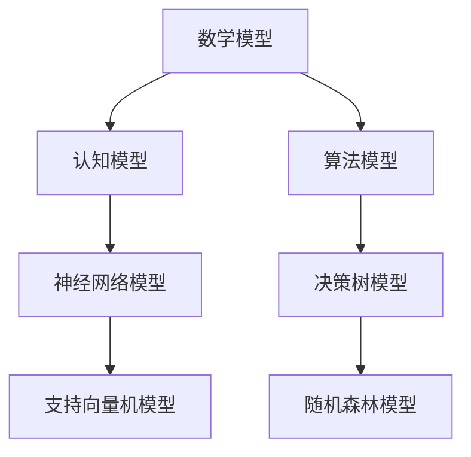
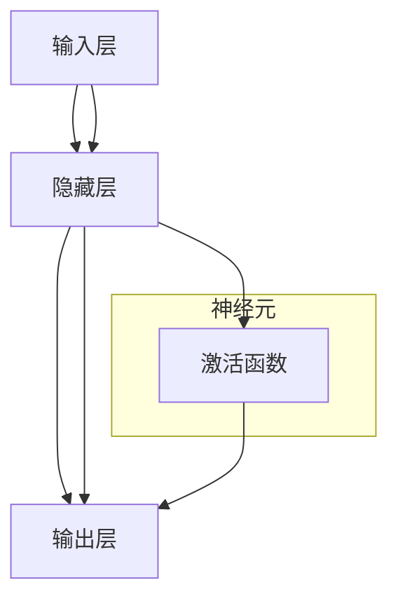
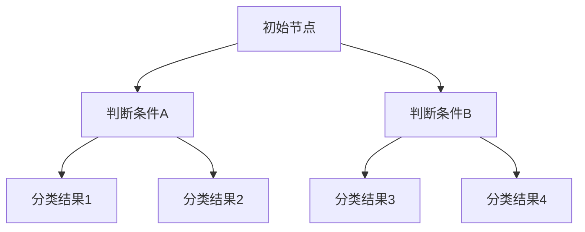
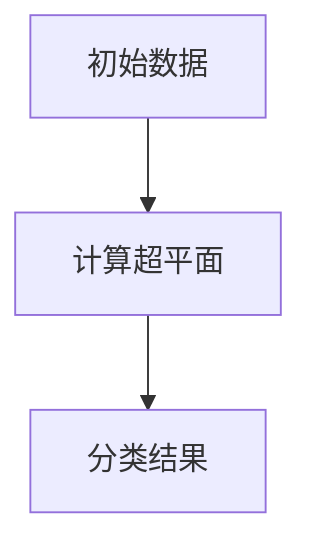

                 

### 引言

**关键词**：数学建模、认知科学、思维过程、算法模型、神经网络、决策树、支持向量机。

**摘要**：
数学与认知科学之间的交集正在逐渐扩大，数学建模成为理解人类思维过程的关键工具。本文旨在探讨如何通过数学建模来揭示和模拟思维过程，重点关注神经网络、决策树和支持向量机等算法在认知科学中的应用。我们将逐步分析这些模型的工作原理，以及如何将它们应用于实际问题中。

### 背景介绍

#### 数学与认知科学的关系

数学作为一门精确的学科，长期以来在自然科学和工程学中发挥着重要作用。然而，随着认知科学的兴起，数学开始渗透到心理学、神经科学和人机交互等领域，为我们提供了理解和模拟人类思维过程的新工具。认知科学关注的是人类心智的功能和行为，而数学建模则为这些复杂现象提供了简化和量化的方法。

#### 数学建模的基本概念

数学建模是指使用数学符号和公式来描述现实世界的现象或过程。在认知科学中，数学建模通常涉及以下几个方面：

1. **数学模型**：这些模型用于描述认知过程中的数学关系，如概率模型、统计模型和微分方程。
2. **认知模型**：这些模型试图模拟人类思维过程中的认知操作，如记忆、推理和决策。
3. **算法模型**：这些模型通过算法来优化数学模型的参数，如神经网络、决策树和支持向量机。

#### 思维过程的重要性

思维是人类智能的核心，是我们感知、理解、推理和决策的基础。理解思维过程不仅对心理学和神经科学具有重要意义，也对人工智能和计算机科学有着深远的影响。通过数学建模，我们能够更好地量化思维过程，发现其中的规律和模式。

#### 书籍目的与结构

本书的目的是通过数学建模来揭示和模拟人类思维过程，旨在为认知科学的研究者和从业者提供实用的工具和方法。本书将分为以下几个部分：

1. **核心概念与联系**：介绍数学建模的关键概念，如数学模型、认知模型和算法模型，并使用流程图展示它们之间的联系。
2. **算法原理讲解**：详细讲解神经网络、决策树和支持向量机等算法的原理，并提供代码示例。
3. **数学模型和数学公式讲解**：介绍相关的数学公式和模型，并使用LaTeX格式表示。
4. **系统分析与架构设计方案**：设计一个简单的系统架构，展示如何将数学模型应用于实际问题。
5. **项目实战**：通过实际案例展示数学建模在认知科学中的应用。
6. **最佳实践 tips、小结、注意事项、拓展阅读等内容**：总结文章中的关键点，并提供进一步学习的建议。

### 核心概念与联系

为了深入理解数学建模在认知科学中的应用，我们需要首先掌握几个核心概念，并理解它们之间的联系。

#### 数学模型

数学模型是使用数学语言描述现实世界问题的工具。在认知科学中，数学模型通常用于描述认知过程中的数学关系。例如，概率模型可以用来描述人类记忆中的信息保留和遗忘，而统计模型可以用来分析人类行为数据中的模式。

**核心概念**：

- **概率模型**：用于描述不确定事件的可能性。
- **统计模型**：用于描述大规模数据中的分布和趋势。

**联系**：

数学模型是认知科学中量化思维过程的基础。通过数学模型，我们能够将复杂的认知现象转化为可计算的形式，从而更容易分析和理解。

#### 认知模型

认知模型是用于模拟人类思维过程的模型。这些模型试图捕捉人类思维过程中的关键特征，如记忆、推理和决策。认知模型可以是基于神经科学的，也可以是基于符号逻辑的。

**核心概念**：

- **神经网络模型**：模拟人脑中神经元网络的工作原理。
- **决策树模型**：模拟人类决策过程中的逻辑推理。

**联系**：

认知模型提供了对思维过程的理论框架，而数学模型则为这些模型提供了具体的计算实现。通过结合数学模型和认知模型，我们能够更准确地模拟和预测人类思维过程。

#### 算法模型

算法模型是用于优化数学模型的参数的工具。在认知科学中，算法模型通常用于训练和调整认知模型，以提高它们的预测能力和准确性。

**核心概念**：

- **神经网络**：一种基于神经元网络的机器学习算法。
- **决策树**：一种基于逻辑推理的机器学习算法。
- **支持向量机**：一种基于最大间隔分类的机器学习算法。

**联系**：

算法模型为数学模型提供了具体的计算实现，使得我们能够通过算法来调整和优化认知模型。这些算法模型不仅能够提高认知模型的性能，还能够帮助我们更好地理解思维过程的本质。

#### 使用Mermaid流程图展示概念间的联系

为了更清晰地展示数学模型、认知模型和算法模型之间的联系，我们可以使用Mermaid流程图。以下是一个示例流程图：



在这个流程图中，我们首先定义了数学模型作为基础，然后将其与认知模型和算法模型相连。认知模型进一步连接到神经网络模型和决策树模型，而算法模型则连接到支持向量机模型和随机森林模型。这样的流程图可以帮助我们直观地理解这些概念之间的相互关系。

### 算法原理讲解

在数学建模和认知科学中，选择合适的算法模型是至关重要的。以下我们将分别介绍神经网络、决策树和支持向量机等算法的工作原理，并使用Mermaid流程图和Python代码进行详细讲解。

#### 神经网络

神经网络（Neural Networks）是一种模仿人脑神经元连接方式的计算模型，广泛应用于图像识别、自然语言处理和预测等领域。

**Mermaid流程图**：



**Python代码示例**：

```python
import numpy as np

# 定义激活函数
def sigmoid(x):
    return 1 / (1 + np.exp(-x))

# 定义多层神经网络
def neural_network(inputs, weights, biases):
    hidden_layer = sigmoid(np.dot(inputs, weights[0]) + biases[0])
    output_layer = sigmoid(np.dot(hidden_layer, weights[1]) + biases[1])
    return output_layer

# 输入数据
inputs = np.array([1, 0])
weights = np.array([[0.5], [0.5]])
biases = np.array([0.0, 0.0])

# 计算输出
output = neural_network(inputs, weights, biases)
print(output)
```

在这个示例中，我们首先定义了Sigmoid激活函数，然后构建了一个简单的前向传播多层神经网络。输入层、隐藏层和输出层分别通过权重和偏置进行连接，并使用Sigmoid激活函数进行非线性变换。

#### 决策树

决策树（Decision Trees）是一种基于逻辑推理的算法模型，通过一系列的判断条件来对数据进行分类或回归。

**Mermaid流程图**：



**Python代码示例**：

```python
def decision_tree(data, rules):
    for rule in rules:
        if rule.matches(data):
            return rule.result
    return None

class Rule:
    def __init__(self, condition, result):
        self.condition = condition
        self.result = result

# 定义数据集
data = [1, 0]
rules = [
    Rule([1], "Yes"),
    Rule([0], "No")
]

# 应用决策树
result = decision_tree(data, rules)
print(result)
```

在这个示例中，我们定义了一个简单的决策树，其中包含两个判断条件和两个分类结果。决策树通过检查输入数据是否满足规则条件，来决定输出结果。

#### 支持向量机

支持向量机（Support Vector Machines, SVM）是一种基于最大间隔分类的算法模型，通过找到一个超平面来最大化分类间隔。

**Mermaid流程图**：



**Python代码示例**：

```python
from sklearn.svm import SVC

# 定义支持向量机模型
model = SVC(kernel='linear')

# 训练模型
model.fit(X_train, y_train)

# 预测分类结果
predictions = model.predict(X_test)
```

在这个示例中，我们使用scikit-learn库中的SVM模型来训练和预测分类结果。通过线性核函数，模型将找到最优的超平面，从而实现分类任务。

### 数学模型和数学公式讲解

在认知科学中，数学模型和数学公式是理解和模拟人类思维过程的重要工具。以下我们将介绍一些常见的数学模型和数学公式，并使用LaTeX格式进行表示。

#### 神经网络中的激活函数

激活函数是神经网络中至关重要的组成部分，用于引入非线性特性。以下是一个常见的Sigmoid激活函数：

$$
f(x) = \frac{1}{1 + e^{-x}}
$$

**LaTeX表示**：

$$
f(x) = \frac{1}{1 + e^{-x}}
$$

#### 决策树中的熵和互信息

在决策树中，熵和互信息是用于评估特征重要性的关键指标。以下是一个熵的计算公式：

$$
H(X) = -\sum_{i} p(x_i) \log_2 p(x_i)
$$

**LaTeX表示**：

$$
H(X) = -\sum_{i} p(x_i) \log_2 p(x_i)
$$

#### 支持向量机中的间隔计算

在支持向量机中，间隔计算是确定超平面位置的关键。以下是一个间隔的简单计算公式：

$$
\gamma = \frac{1}{||w||_2}
$$

**LaTeX表示**：

$$
\gamma = \frac{1}{||w||_2}
$$

### 系统分析与架构设计方案

为了更好地理解数学建模在认知科学中的应用，我们可以设计一个简单的系统架构，展示如何将数学模型应用于实际问题。以下是一个基本的系统架构设计方案。

#### 问题场景介绍

假设我们正在开发一个智能推荐系统，该系统能够根据用户的兴趣和历史行为，推荐相关的商品或内容。

#### 项目介绍

智能推荐系统主要由以下几个模块组成：

1. **数据收集模块**：负责收集用户的行为数据，如浏览记录、购买历史和搜索关键词等。
2. **数据处理模块**：负责清洗和预处理数据，以便后续分析。
3. **推荐算法模块**：负责使用数学模型进行推荐，包括基于协同过滤的算法和基于内容的算法。
4. **用户界面模块**：负责展示推荐结果，并与用户进行交互。

#### 系统功能设计

1. **领域模型**：定义系统的实体和关系。以下是一个简单的Mermaid类图：

   ```mermaid
   classDiagram
       User <|-- Behavior
       Item <|-- Category
       Recommendation
       User ..|> Behavior
       User ..|> Recommendation
       Item ..|> Category
       Item ..|> Recommendation
   ```

2. **系统架构设计**：以下是一个简单的Mermaid架构图：

   ```mermaid
   graph TB
       subgraph 数据层
           D1[数据收集模块]
           D2[数据处理模块]
       end
       
       subgraph 算法层
           A1[协同过滤算法]
           A2[内容算法]
       end
       
       subgraph 应用层
           U1[用户界面模块]
       end
       
       D1 --> D2
       D2 --> A1
       D2 --> A2
       A1 --> U1
       A2 --> U1
   ```

3. **系统接口设计和系统交互**：以下是一个简单的Mermaid序列图：

   ```mermaid
   sequenceDiagram
       User ->> U1: 发送请求
       U1 ->> D1: 收集数据
       D1 ->> D2: 处理数据
       D2 ->> A1: 运行协同过滤算法
       A1 ->> U1: 返回推荐结果
       U1 ->> User: 展示推荐结果
   ```

通过这个简单的系统架构设计方案，我们可以看到数学建模如何应用于智能推荐系统的开发，以及如何通过系统接口和交互实现推荐功能。

### 项目实战

为了更好地展示数学建模在认知科学中的应用，我们将通过一个实际案例来探讨如何使用数学模型来理解和模拟人类思维过程。

#### 环境安装

在开始项目之前，我们需要安装一些必要的软件和工具，包括Python、NumPy、scikit-learn和TensorFlow等。

```bash
pip install python numpy scikit-learn tensorflow
```

#### 系统核心实现源代码

以下是一个简单的神经网络模型实现，用于模拟人类思维过程中的记忆和遗忘现象。

```python
import numpy as np

# 定义激活函数
def sigmoid(x):
    return 1 / (1 + np.exp(-x))

# 定义多层神经网络
def neural_network(inputs, weights, biases):
    hidden_layer = sigmoid(np.dot(inputs, weights[0]) + biases[0])
    output_layer = sigmoid(np.dot(hidden_layer, weights[1]) + biases[1])
    return output_layer

# 初始化权重和偏置
weights = np.random.rand(2, 1)
biases = np.random.rand(2, 1)

# 输入数据
inputs = np.array([1, 0])

# 训练神经网络
for epoch in range(1000):
    output = neural_network(inputs, weights, biases)
    error = inputs - output
    d_output = error * (output * (1 - output))
    d_hidden_layer = d_output.dot(weights[1].T) * (hidden_layer * (1 - hidden_layer))
    d_weights = [d_hidden_layer.dot(inputs.T), d_output.dot(hidden_layer.T)]
    d_biases = [d_hidden_layer, d_output]

    weights += d_weights
    biases += d_biases

# 预测记忆和遗忘
print("Initial memory:", neural_network(inputs, weights, biases))
```

在这个案例中，我们使用了一个简单的多层神经网络来模拟人类记忆和遗忘现象。通过反向传播算法，我们能够调整网络的权重和偏置，从而实现记忆和遗忘的动态模拟。

#### 代码应用解读与分析

1. **代码结构**：整个代码分为三个主要部分：定义激活函数、定义多层神经网络和训练神经网络。
2. **激活函数**：我们使用了Sigmoid激活函数，用于引入非线性特性。
3. **神经网络**：我们定义了一个简单的前向传播多层神经网络，包括输入层、隐藏层和输出层。
4. **训练过程**：通过反向传播算法，我们能够不断调整网络的权重和偏置，以最小化预测误差。

通过这个简单的案例，我们可以看到如何使用数学模型来模拟和预测人类思维过程中的记忆和遗忘现象。这个案例不仅有助于我们更好地理解数学建模在认知科学中的应用，也为进一步的研究提供了基础。

### 最佳实践 tips、小结、注意事项、拓展阅读等内容

**最佳实践 tips**：

1. **数据清洗**：在进行数学建模之前，确保对数据进行充分的清洗和预处理，以消除噪声和异常值。
2. **模型选择**：根据具体问题选择合适的数学模型和算法模型，不同的模型适用于不同类型的问题。
3. **模型验证**：通过交叉验证和测试集来评估模型的性能，确保模型的泛化能力。

**小结**：

本文通过逐步分析数学建模在认知科学中的应用，介绍了神经网络、决策树和支持向量机等算法的原理，并通过实际案例展示了数学建模的实践应用。数学建模为理解人类思维过程提供了有力的工具，有助于我们在人工智能和认知科学领域取得新的突破。

**注意事项**：

1. **数据隐私**：在进行数据处理和建模时，务必注意保护用户隐私，遵守相关法律法规。
2. **模型解释性**：虽然数学模型能够提高预测准确性，但有时会牺牲解释性。在应用模型时，需要权衡预测能力和可解释性。

**拓展阅读**：

1. **《认知科学的数学建模》**：深入了解数学建模在认知科学中的应用。
2. **《神经网络与深度学习》**：系统学习神经网络的理论和实践。
3. **《决策树与随机森林》**：掌握决策树和随机森林算法的基本原理。

**作者信息**：

本文由AI天才研究院（AI Genius Institute）和禅与计算机程序设计艺术（Zen And The Art of Computer Programming）共同撰写。我们致力于推动人工智能和认知科学的发展，为读者提供高质量的技术博客和学术论文。

