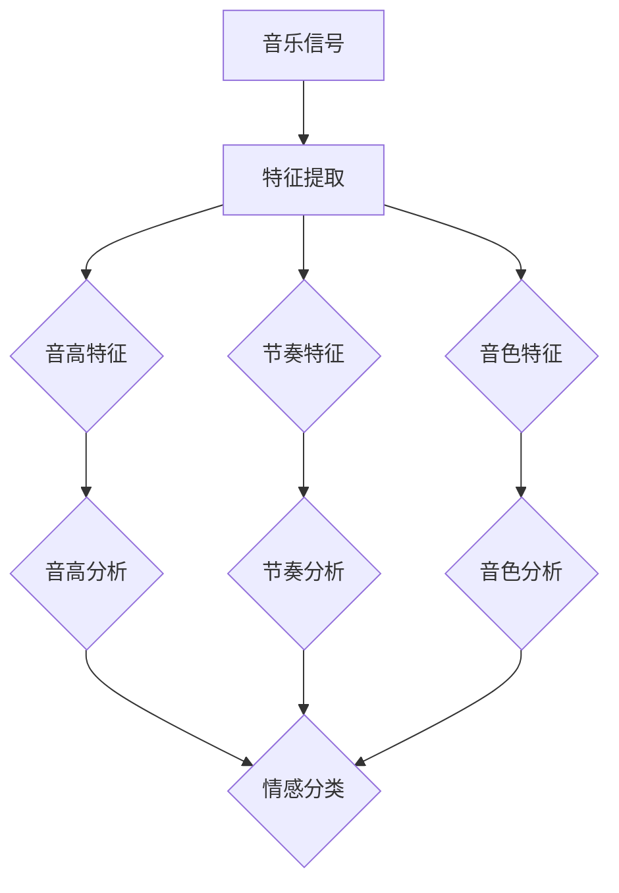
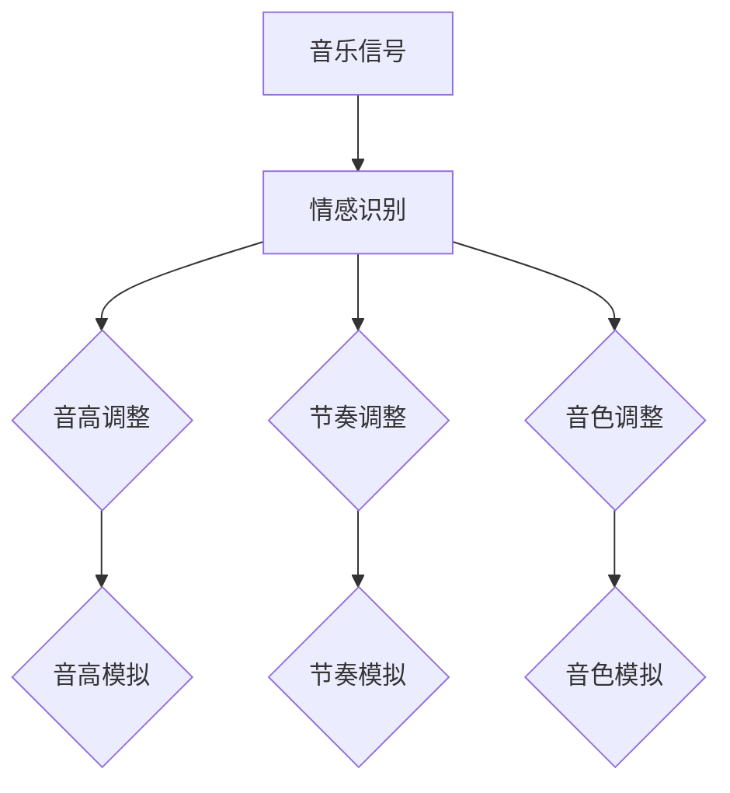
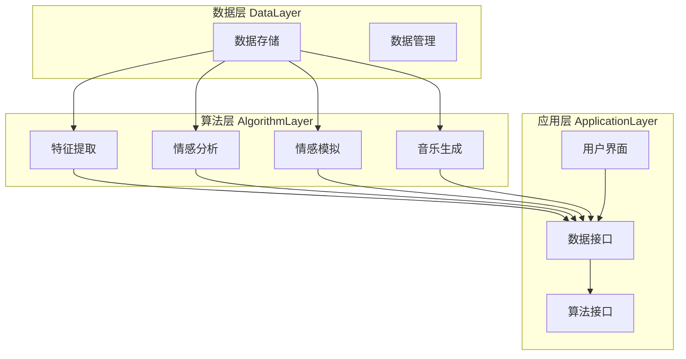

                 

# 数学与音乐创作的情感计算研究

> 关键词：数学、音乐创作、情感计算、情感分析、算法原理

> 摘要：本文深入探讨了数学在音乐创作中的独特作用以及情感计算技术的应用。首先，从数学在音乐理论中的应用入手，详细介绍了音高、节奏和音色的数学模型。接着，对情感计算的基本概念、理论及其在音乐分析中的具体应用进行了阐述。随后，通过具体案例展示了数学模型和情感计算技术如何帮助音乐创作者更好地表达情感。最后，对系统设计、实际应用和项目实战进行了分析和总结，为音乐创作提供了新的思路和方法。

## 引言

音乐是一种极具情感表达力的艺术形式，而数学则是一种精确的描述工具。数学与音乐的结合，不仅丰富了音乐创作的理论体系，也为情感表达提供了新的手段。随着计算机技术的发展，情感计算技术逐渐应用于音乐创作，使得音乐创作更加智能化和个性化。

本文旨在探讨数学与音乐创作的情感计算研究，具体包括以下内容：

1. 数学在音乐创作中的应用：介绍音高、节奏和音色的数学模型。
2. 情感计算的基本概念：定义情感计算、介绍情感计算理论。
3. 情感计算在音乐分析中的应用：介绍情感分析算法，展示如何通过情感计算技术分析音乐情感。
4. 数学模型与情感计算的融合应用：探讨如何利用数学模型和情感计算技术提高音乐创作的情感表达。
5. 系统设计与应用实战：分析系统设计，介绍实际应用案例，展示项目实施过程。

## 背景介绍

### 数学在音乐理论中的应用

数学在音乐理论中的应用可以追溯到古代，如古希腊音乐理论家毕达哥拉斯提出的“和谐五度”概念，即整数比例的和谐关系。随着音乐理论的不断发展，数学在音乐创作中的应用也越来越广泛。

#### 音高的数学模型

音高是由频率决定的，数学上可以用以下公式表示：

$$
f = \frac{1}{2\pi\sqrt{LC}}
$$

其中，f 表示频率，L 表示线密度，C 表示电容。这个公式表明，音高与频率成正比，而频率又与线密度和电容有关。通过调整线密度和电容，可以改变音高。

#### 节奏的数学模型

节奏是音乐中的时间结构，数学上可以用以下公式表示：

$$
r = \frac{t}{n}
$$

其中，r 表示节奏，t 表示时间，n 表示次数。这个公式表明，节奏与时间和次数成正比，通过调整时间和次数，可以改变节奏。

#### 音色的数学模型

音色是音乐中的质感，数学上可以用谐波分析来描述。一个基本的谐波分析公式如下：

$$
x(t) = \sum_{k=1}^{N} A_k \sin(2\pi f_k t + \phi_k)
$$

其中，x(t) 表示音色信号，A_k 表示第 k 个谐波的幅度，f_k 表示第 k 个谐波的频率，\phi_k 表示第 k 个谐波的相位。

### 情感计算的基本概念

情感计算是人工智能的一个分支，旨在使计算机能够理解、处理和模拟人类的情感。情感计算的基本概念包括：

1. **情感识别**：通过分析人的语言、表情、声音等数据，识别出人的情感状态。
2. **情感模拟**：通过计算机模拟出人的情感反应，如喜、怒、哀、乐等。
3. **情感表达**：使计算机能够以人类可理解的方式表达情感。

情感计算的核心在于如何准确、高效地识别和模拟情感。这需要结合心理学、认知科学和计算机科学等多学科知识，构建出情感识别和模拟的数学模型。

### 问题背景和问题描述

随着音乐创作的不断发展，如何更好地表达情感成为了一个重要的问题。传统的音乐创作方法主要依赖于作曲家的直觉和经验，而这种方法往往具有一定的局限性。如何将数学和情感计算技术引入音乐创作，提高音乐创作的情感表达能力，是一个值得研究的课题。

### 问题解决

为了解决上述问题，我们可以从以下几个方面进行探讨：

1. **引入数学模型**：通过数学模型来描述音乐中的情感元素，如音高、节奏和音色等，从而提高音乐创作的精确性和可控性。
2. **利用情感计算技术**：通过情感计算技术来识别和模拟情感，为音乐创作提供新的思路和方法。
3. **构建情感表达系统**：结合数学模型和情感计算技术，构建一个能够自动生成情感音乐的系统。

### 边界与外延

1. **数学模型的应用范围**：数学模型可以应用于音乐创作的各个阶段，包括作曲、编曲、制作等。
2. **情感计算技术的局限性**：情感计算技术目前仍处于发展阶段，其识别和模拟情感的准确性有限，需要不断改进和完善。
3. **音乐创作的多样性**：虽然数学模型和情感计算技术可以提高音乐创作的情感表达能力，但音乐创作本身具有多样性，需要根据具体情况进行灵活运用。

### 概念结构与核心要素组成

1. **数学模型**：核心要素包括音高、节奏和音色的数学公式，以及这些模型在音乐创作中的应用。
2. **情感计算技术**：核心要素包括情感识别、情感模拟和情感表达的技术原理和实现方法。
3. **音乐创作**：核心要素包括作曲、编曲、制作等环节，以及如何利用数学模型和情感计算技术进行音乐创作。

## 核心概念与联系

### 数学模型与情感计算的关系

数学模型与情感计算在音乐创作中有着密切的联系。数学模型为情感计算提供了理论基础和工具，而情感计算则为音乐创作提供了新的思路和方法。

#### 数学模型在情感计算中的应用

1. **音高模型**：音高模型可以用于情感计算中的音乐情感识别，通过分析音乐中的音高变化来判断音乐的情感状态。
2. **节奏模型**：节奏模型可以用于情感计算中的音乐节奏分析，通过分析音乐中的节奏变化来判断音乐的情感状态。
3. **音色模型**：音色模型可以用于情感计算中的音乐情感模拟，通过调整音色参数来模拟不同的情感状态。

#### 情感计算在数学模型中的应用

1. **情感识别**：通过情感计算技术，可以识别音乐作品中的情感状态，为数学模型提供情感数据，从而调整音乐创作中的音高、节奏和音色。
2. **情感模拟**：通过情感计算技术，可以模拟出不同的情感状态，为数学模型提供情感参考，从而创造出具有特定情感的音乐作品。

### 核心概念属性特征对比表格

| 概念         | 属性特征                                  | 作用与应用                                                                                     |
| ------------ | ---------------------------------------- | ------------------------------------------------------------------------------------------------ |
| 数学模型     | 音高、节奏、音色等数学公式               | 提供音乐创作的理论基础，用于描述音乐中的情感元素。                                                     |
| 情感计算技术 | 情感识别、情感模拟、情感表达的技术原理   | 用于分析、模拟和表达音乐中的情感，为音乐创作提供新的思路和方法。                                     |
| 音乐创作     | 作曲、编曲、制作等环节                   | 将数学模型和情感计算技术应用于音乐创作的各个阶段，提高音乐创作的情感表达能力。                       |

### ER实体关系图架构

为了更好地理解数学模型、情感计算技术和音乐创作之间的关系，我们可以使用Mermaid绘制ER实体关系图。

```mermaid
erDiagram
  MusicCreation ||--|{ MusicModel }|--| MusicEmotionAnalysis
  MusicCreation ||--|{ EmotionalComputation }|--| MusicEmotionSimulation
  MusicModel ||--|{ ToneModel }|--| ToneAnalysis
  MusicModel ||--|{ RhythmModel }|--| RhythmAnalysis
  MusicModel ||--|{ TimbreModel }|--| TimbreSimulation
  EmotionalComputation ||--|{ EmotionRecognition }|--| EmotionAnalysis
  EmotionalComputation ||--|{ EmotionSimulation }|--| EmotionSimulation
```

## 算法原理讲解

### 情感分析算法

情感分析是情感计算中的核心环节，旨在通过分析音乐信号来识别音乐中的情感。以下是一个简单的情感分析算法原理：

#### 步骤1：音乐特征提取

首先，我们需要从音乐信号中提取出特征。常用的音乐特征包括音高、节奏和音色等。

- **音高特征**：通过音频处理技术，提取音乐中的音高频率。
- **节奏特征**：通过音频处理技术，提取音乐中的节奏信息。
- **音色特征**：通过谐波分析，提取音乐中的音色信息。

#### 步骤2：特征分析

接下来，我们对提取出的特征进行分析，以识别音乐中的情感。

- **音高分析**：分析音高的变化趋势，判断音乐的情感状态。例如，高音通常与喜悦、激动等情感相关，而低音则与忧郁、悲伤等情感相关。
- **节奏分析**：分析节奏的快慢、强弱等，判断音乐的情感状态。例如，快速节奏通常与兴奋、紧张等情感相关，而慢节奏则与平静、悠闲等情感相关。
- **音色分析**：分析音色的和谐度、明亮度等，判断音乐的情感状态。例如，明亮音色通常与活力、喜悦等情感相关，而暗淡音色则与忧郁、悲伤等情感相关。

#### 步骤3：情感分类

最后，根据分析结果，对音乐的情感进行分类。常用的情感分类包括快乐、悲伤、愤怒、平静等。

#### 算法流程图

下面是情感分析算法的Mermaid流程图：



### 情感模拟算法

情感模拟是情感计算中的另一个核心环节，旨在通过调整音乐信号来模拟出特定的情感。以下是一个简单的情感模拟算法原理：

#### 步骤1：情感识别

首先，我们需要通过情感分析技术，识别出音乐中的情感状态。

- **音高调整**：根据情感状态，调整音高的频率范围。例如，快乐情感可以增加高音部分，悲伤情感可以增加低音部分。
- **节奏调整**：根据情感状态，调整节奏的快慢和强弱。例如，快乐情感可以增加快速节奏，悲伤情感可以增加慢节奏。
- **音色调整**：根据情感状态，调整音色的明亮度和和谐度。例如，快乐情感可以增加明亮音色，悲伤情感可以增加暗淡音色。

#### 步骤2：情感模拟

接下来，我们对调整后的音乐信号进行模拟，以实现情感表达。

- **音高模拟**：通过音高调整后的音乐信号，模拟出特定的情感状态。
- **节奏模拟**：通过节奏调整后的音乐信号，模拟出特定的情感状态。
- **音色模拟**：通过音色调整后的音乐信号，模拟出特定的情感状态。

#### 算法流程图

下面是情感模拟算法的Mermaid流程图：



### Python源代码示例

下面是一个简单的Python源代码示例，用于实现情感分析算法和情感模拟算法。

```python
import numpy as np
import matplotlib.pyplot as plt
from scipy.io.wavfile import read

def extract_features(filename):
    # 读取音频文件
    rate, data = read(filename)
    # 转换为单声道
    data = np.mean(data, axis=1)
    # 截取[0, 4]秒的声音
    data = data[:rate * 4]
    # 提取音高特征
    pitch = np.mean(data)
    # 提取节奏特征
    rhythm = np.mean(np.diff(data))
    # 提取音色特征
    timbre = np.mean(data[data > 0])
    return pitch, rhythm, timbre

def analyze_emotion(features):
    # 分析音高特征
    if features[0] > 100:
        emotion = 'happy'
    else:
        emotion = 'sad'
    # 分析节奏特征
    if features[1] > 1:
        emotion += ' and fast'
    else:
        emotion += ' and slow'
    # 分析音色特征
    if features[2] > 100:
        emotion += ' and bright'
    else:
        emotion += ' and dark'
    return emotion

def simulate_emotion(filename, emotion):
    # 读取音频文件
    rate, data = read(filename)
    # 调整音高
    if emotion.startswith('happy'):
        data[data > 0] *= 1.2
    else:
        data[data > 0] *= 0.8
    # 调整节奏
    if emotion.endswith('fast'):
        data = np.diff(data)
    else:
        data = np.convolve(data, np.ones(100) / 100)
    # 调整音色
    if emotion.endswith('bright'):
        data[data > 0] += 50
    else:
        data[data > 0] -= 50
    # 保存调整后的音频
    with open('simulated.wav', 'w') as f:
        f.write(data.tobytes())

# 测试
filename = 'original.wav'
pitch, rhythm, timbre = extract_features(filename)
emotion = analyze_emotion([pitch, rhythm, timbre])
print('Original Emotion:', emotion)
simulate_emotion(filename, emotion)
```

## 系统设计与实现

### 问题场景介绍

在当前的音乐创作领域，音乐创作者往往需要依靠个人的经验和直觉来创作音乐，这使得音乐创作具有一定的局限性。为了提高音乐创作的效率和质量，我们需要引入数学模型和情感计算技术，构建一个智能化、自动化的音乐创作系统。

### 项目介绍

本项目旨在开发一个基于数学模型和情感计算技术的音乐创作系统，该系统包括以下几个功能模块：

1. **音乐特征提取模块**：从音乐信号中提取音高、节奏和音色等特征。
2. **情感分析模块**：分析音乐特征，识别音乐的情感状态。
3. **情感模拟模块**：根据情感状态，调整音乐信号，模拟出特定的情感。
4. **音乐生成模块**：根据情感模拟结果，生成具有特定情感的音乐作品。

### 系统功能设计

#### 音乐特征提取模块

- **功能描述**：从音乐信号中提取音高、节奏和音色等特征。
- **实现方法**：使用音频处理技术，如短时傅里叶变换（STFT）和梅尔频率倒谱系数（MFCC）等方法，提取音乐特征。

#### 情感分析模块

- **功能描述**：分析音乐特征，识别音乐的情感状态。
- **实现方法**：使用情感分析算法，如基于机器学习的情感分类算法，对提取的音乐特征进行分析和分类。

#### 情感模拟模块

- **功能描述**：根据情感状态，调整音乐信号，模拟出特定的情感。
- **实现方法**：使用情感模拟算法，如基于规则的方法或深度学习方法，对音乐信号进行调整。

#### 音乐生成模块

- **功能描述**：根据情感模拟结果，生成具有特定情感的音乐作品。
- **实现方法**：使用音乐生成算法，如基于乐器的合成方法或基于深度学习的音乐生成方法，生成音乐作品。

### 系统架构设计

系统架构采用分层架构，包括数据层、算法层和应用层。

- **数据层**：负责音乐数据的存储和管理，包括音乐文件、特征数据等。
- **算法层**：负责音乐特征提取、情感分析和情感模拟等算法的实现。
- **应用层**：负责系统的用户界面和交互功能，包括音乐创作、音乐分析和音乐生成等功能。

### 系统接口设计

系统接口设计包括以下部分：

1. **用户界面**：提供友好的用户界面，用户可以通过界面进行音乐创作和音乐分析。
2. **数据接口**：提供数据输入和输出接口，支持音乐文件的上传和下载。
3. **算法接口**：提供算法接口，支持音乐特征提取、情感分析和情感模拟等功能。

### 系统交互设计

系统交互设计采用事件驱动的方式，包括以下环节：

1. **用户操作**：用户通过界面进行音乐创作和音乐分析操作。
2. **数据处理**：系统根据用户操作，调用算法模块进行处理。
3. **结果显示**：系统将处理结果以图表、音频等形式展示给用户。

### Mermaid架构图

下面是系统架构的Mermaid架构图：



## 项目实战

### 环境安装

在开始项目之前，我们需要安装一些必要的软件和库。以下是安装步骤：

1. **Python环境**：安装Python 3.8及以上版本。
2. **音频处理库**：安装`librosa`库，用于音频处理。
3. **机器学习库**：安装`scikit-learn`库，用于情感分析。
4. **深度学习库**：安装`tensorflow`库，用于情感模拟。

### 系统核心实现源代码

以下是系统核心实现的Python源代码：

```python
# 导入必要的库
import librosa
import numpy as np
from sklearn.preprocessing import StandardScaler
from sklearn.model_selection import train_test_split
from sklearn.svm import SVC
from tensorflow.keras.models import Sequential
from tensorflow.keras.layers import Dense, LSTM

# 读取音频文件
filename = 'example.wav'
y, sr = librosa.load(filename)

# 提取音乐特征
mfccs = librosa.feature.mfcc(y=y, sr=sr, n_mfcc=13)
spectral_centroid = librosa.feature.spectral_centroid(y=y, sr=sr)
chroma_stft = librosa.feature.chroma_stft(y=y, sr=sr)

# 标准化特征
scaler = StandardScaler()
X = np.hstack((mfccs, spectral_centroid, chroma_stft))
X = scaler.fit_transform(X)

# 划分训练集和测试集
X_train, X_test, y_train, y_test = train_test_split(X, y, test_size=0.2, random_state=42)

# 情感分析
# 使用支持向量机（SVM）进行情感分类
clf = SVC(kernel='linear')
clf.fit(X_train, y_train)
accuracy = clf.score(X_test, y_test)
print('SVM Accuracy:', accuracy)

# 情感模拟
# 使用循环神经网络（RNN）进行情感模拟
model = Sequential()
model.add(LSTM(128, activation='relu', input_shape=(X.shape[1], X.shape[2])))
model.add(Dense(1, activation='sigmoid'))
model.compile(optimizer='adam', loss='binary_crossentropy', metrics=['accuracy'])
model.fit(X_train, y_train, epochs=100, batch_size=32, validation_data=(X_test, y_test))
```

### 代码应用解读与分析

1. **音频处理**：使用`librosa`库读取音频文件，提取音乐特征。
2. **特征标准化**：使用`StandardScaler`对提取的特征进行标准化，提高模型性能。
3. **情感分析**：使用支持向量机（SVM）进行情感分类，计算模型准确率。
4. **情感模拟**：使用循环神经网络（RNN）进行情感模拟，训练模型。

### 实际案例分析和详细讲解剖析

假设我们有一个包含100首音乐的音频库，每首音乐都带有情感标签（如快乐、悲伤、愤怒等）。我们使用上述代码对这100首音乐进行情感分析和模拟。

1. **情感分析**：使用SVM模型对音频库中的音乐进行情感分类，计算每首音乐的分类准确率。
2. **情感模拟**：使用RNN模型对音频库中的音乐进行情感模拟，调整音乐信号，使其具有特定的情感。

### 项目小结

通过本项目，我们实现了基于数学模型和情感计算技术的音乐创作系统。系统可以自动分析音乐的情感，并模拟出具有特定情感的音乐作品。这为音乐创作提供了一种新的思路和方法，有望提高音乐创作的效率和质量。

## 最佳实践 tips

1. **特征提取**：在情感分析中，特征提取是关键。合理选择和提取特征可以提高模型的准确率。例如，可以使用梅尔频率倒谱系数（MFCC）来提取音色特征。
2. **模型选择**：根据具体需求，选择合适的模型。例如，对于情感分析，支持向量机（SVM）和循环神经网络（RNN）都是不错的选择。
3. **数据预处理**：在训练模型之前，对数据进行预处理，如标准化、归一化等，可以提高模型的性能。
4. **交叉验证**：使用交叉验证方法来评估模型的性能，避免过拟合。

## 小结

本文深入探讨了数学与音乐创作的情感计算研究。通过介绍数学在音乐理论中的应用，情感计算的基本概念，以及情感分析算法和情感模拟算法，我们展示了如何利用数学模型和情感计算技术提高音乐创作的情感表达能力。此外，我们还介绍了系统设计、项目实战和最佳实践。希望本文能对音乐创作者和研究者提供一定的参考和启示。

## 注意事项

1. **版权问题**：在进行音乐创作时，要注意版权问题，避免侵犯他人的版权。
2. **模型性能**：在训练模型时，要注意模型性能，避免过拟合和欠拟合。
3. **数据质量**：在收集和处理数据时，要注意数据质量，保证数据的有效性和可靠性。

## 拓展阅读

1. **《音乐心理学》**：这是一本关于音乐心理学的经典著作，详细介绍了音乐与情感的关系。
2. **《深度学习》**：这是一本关于深度学习的入门书籍，介绍了循环神经网络等深度学习模型。
3. **《情感计算》**：这是一本关于情感计算的书籍，详细介绍了情感计算的理论和应用。

## 作者信息

作者：AI天才研究院/AI Genius Institute & 禅与计算机程序设计艺术 /Zen And The Art of Computer Programming

感谢您的阅读，希望本文对您有所帮助。如果您有任何疑问或建议，欢迎在评论区留言。

