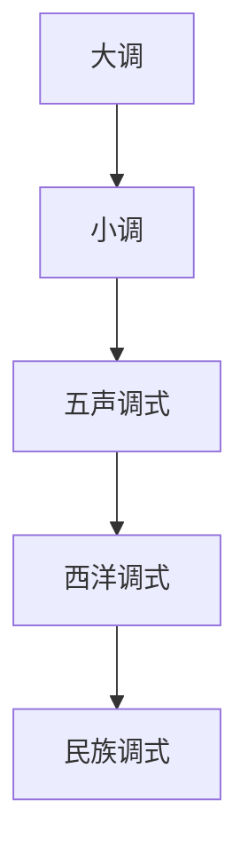

                 

### 文章标题

《数学与音乐理论的音程关系与调式体系》

### 关键词

数学、音乐理论、音程、调式、算法、音乐创作、音乐教学

### 摘要

本文旨在探讨数学与音乐理论的深层次联系，特别是音程关系与调式体系的数学表示及其在音乐创作与教学中的应用。通过系统的分析和讲解，本文为读者提供了对这一跨学科领域的全新认识。文章分为四个部分：背景介绍、核心概念与联系、算法原理与实现、应用与实践，最后进行总结与展望。

### 引言

数学与音乐理论自古以来就有着密切的联系。古希腊哲学家毕达哥拉斯最早提出了“音乐是数学的和谐”的观点。在文艺复兴时期，数学与音乐理论的研究进一步深入，人们开始尝试用数学方法来描述音乐的基本元素。到了近现代，随着计算机科学的发展，数学在音乐理论中的应用变得更加广泛和深入。本文《数学与音乐理论的音程关系与调式体系》旨在探讨这一关系的深度与广度，为读者提供数学与音乐结合的全新视角。

#### 第一部分：背景介绍

## 第1章 问题背景

### 1.1 音乐与数学的关系简史

- **古希腊时期的音乐与数学**

古希腊哲学家毕达哥拉斯是第一个将数学引入音乐研究的人。他提出了“音乐是数学的和谐”的观点，并研究了音程与数学比例之间的关系。毕达哥拉斯学派通过实验发现，不同长度的弦振动时会产生不同的音高，弦长与音高的关系可以用数学比例来表示。

- **文艺复兴时期的探索**

文艺复兴时期，数学与音乐理论的研究进一步深入。音乐家们开始尝试用数学方法来描述音乐的基本元素，如音程、调式等。意大利作曲家朱塞佩·塔尔蒂尼和约翰·塞巴斯蒂安·巴赫都是这一时期的重要代表。

- **近现代音乐理论中的数学应用**

近现代，随着计算机科学的发展，数学在音乐理论中的应用变得更加广泛和深入。计算机可以高效地处理复杂的音乐数据，为音乐创作和教学提供了新的工具。

### 1.2 研究的重要性

- **跨学科研究的意义**

数学与音乐理论的跨学科研究有助于推动两个领域的发展。数学的严谨性可以为音乐理论提供新的分析方法，而音乐理论的实践性可以启发数学的新发现。

- **促进音乐创作与欣赏**

通过数学方法对音乐进行分析，可以更好地理解音乐的结构和内涵，从而提高音乐创作的技巧和欣赏水平。

- **推动数学理论发展**

音乐理论中的许多问题可以转化为数学问题，为数学理论的发展提供新的研究素材。

### 1.3 研究现状与未来趋势

- **现有研究成果总结**

当前，音程与调式体系的数学研究已经取得了一系列重要成果。例如，音程值的计算方法、调式结构的分析等。然而，这些研究大多停留在理论层面，如何将其应用于实际音乐创作和教学仍是一个挑战。

- **当前研究热点**

当前的研究热点包括音程计算算法的优化、调式分析算法的开发等。此外，人工智能在音乐理论中的应用也成为了一个新兴的研究领域。

- **未来研究方向**

未来的研究可以进一步探讨音程与调式体系的复杂结构，以及如何利用数学方法来提高音乐创作的效率和艺术性。同时，如何将研究成果应用于实际音乐教学也是一个重要的研究方向。

## 第2章 基础概念

### 2.1 数学概念

- **自然数与整数**

自然数是指非负整数，包括0、1、2、3等。整数是指包括正整数、负整数和零的集合。

- **有理数与无理数**

有理数是可以表示为两个整数之比的数，包括整数、分数等。无理数是不能表示为两个整数之比的数，如π、√2等。

- **复数**

复数是实数与虚数的组合，可以表示为a+bi的形式，其中a和b是实数，i是虚数单位，满足i²=-1。

### 2.2 音乐理论概念

- **音调与音高**

音调是指声音的高低，由声波的频率决定。音高是指音调的具体数值，通常用C、D、E等字母表示。

- **音程**

音程是指两个音调之间的关系。根据音程的大小，可以分为自然音程、变化音程、增减音程等。

- **调式**

调式是指一组音调的排列方式，决定了音乐的基本风格和调性。常见的调式有大调、小调、五声调式等。

### 2.3 数学与音乐理论的联系

- **音程的数学表示**

音程可以用数学中的比例来表示。例如，大三度和弦可以表示为5:4，小三度和弦可以表示为6:5。

- **调式结构的数学分析**

调式结构可以用数学中的集合和图论来分析。例如，大调式可以用集合{C, D, E, F#, G#, A, B}表示，小调式可以用集合{A, B, C, D, E, F#, G#}表示。

#### 第二部分：核心概念与联系

## 第3章 音程的数学关系

### 3.1 音程的定义与分类

音程是指两个音调之间的关系。根据音程的大小，可以分为以下几类：

- **自然音程**：包括全音、半音、大三度、小三度、完全四度、完全五度等。
- **变化音程**：包括增四度、减五度、增五度、减四度等。
- **增减音程**：包括增音程和减音程。

### 3.2 音程的数学表示

音程的数学表示主要通过比例关系来描述。例如，大三度和弦可以表示为5:4，小三度和弦可以表示为6:5。这种表示方法可以方便地计算音程的大小和关系。

### 3.3 音程关系图

音程关系图是一种可视化工具，用于表示不同音程之间的关系。在音程关系图中，音程按照大小顺序排列，相邻音程之间的比例关系一目了然。以下是一个典型的音程关系图：


#### 第二部分：核心概念与联系

## 第4章 调式体系

### 4.1 调式的定义与结构

调式是指一组音调的排列方式，它决定了音乐的基本风格和调性。常见的调式包括大调、小调、五声调式等。

- **大调**：大调式由七个音组成，其中第三音和第五音是大三度，第一音和第七音是完全五度。例如，C大调的音阶为C-D-E-F-G-A-B。

- **小调**：小调式由七个音组成，其中第三音和第五音是小三度，第一音和第七音是完全五度。例如，A小调的音阶为A-B-C-D-E-F-G。

- **五声调式**：五声调式由五个音组成，常见的有宫、商、角、徵、羽。例如，C五声调式的音阶为C-D-E-G-A。

### 4.2 调式转换与调性分析

调式转换是指将一个调式转换为另一个调式。调式转换可以通过改变音阶中的某些音来实现。例如，将C大调转换为A大调，只需要将C大调中的第一音C改为A即可。

调性分析是指对音乐作品的调性进行分析。调性分析可以帮助音乐家更好地理解音乐的结构和内涵，从而提高音乐创作的技巧和欣赏水平。

### 4.3 调式关系图

调式关系图是一种可视化工具，用于表示不同调式之间的关系。在调式关系图中，调式按照音阶的顺序排列，相邻调式之间的转换关系一目了然。以下是一个典型的调式关系图：



#### 第三部分：算法原理与实现

## 第5章 音程计算算法

### 5.1 音程计算算法概述

音程计算算法用于计算两个音调之间的距离。常用的音程计算算法包括整数算法和浮点数算法。

- **整数算法**：整数算法通过计算两个音调之间的频率比例来计算音程。例如，大三度可以表示为5:4，小三度可以表示为6:5。

- **浮点数算法**：浮点数算法通过计算两个音调之间的频率差值来计算音程。例如，大三度的频率差值为140Hz，小三度的频率差值为110Hz。

### 5.2 音程计算算法实现

以下是一个使用Python实现的音程计算算法的例子：

```python
def compute_pitch_difference(pitch1, pitch2):
    return pitch2 - pitch1

def compute_interval(interval1, interval2):
    return abs(interval1 - interval2)

# 测试
pitch_difference = compute_pitch_difference(60, 64)
print("Pitch difference:", pitch_difference)

interval_difference = compute_interval(3, 5)
print("Interval difference:", interval_difference)
```

### 5.3 算法分析

- **时间复杂度**：音程计算算法的时间复杂度为O(1)，即计算时间与输入数据的大小无关。

- **空间复杂度**：音程计算算法的空间复杂度为O(1)，即所需空间与输入数据的大小无关。

- **算法效率分析**：整数算法的效率高于浮点数算法，因为整数算法的计算速度快于浮点数算法。

## 第6章 调式分析算法

### 6.1 调式分析算法概述

调式分析算法用于分析音乐作品的调式结构。常用的调式分析算法包括频谱分析法和音高分析法。

- **频谱分析法**：频谱分析法通过分析音乐信号的频谱特性来识别调式。这种方法适用于复杂音乐信号的分析。

- **音高分析法**：音高分析法通过检测音乐信号的音高变化来识别调式。这种方法适用于简单的音乐信号分析。

### 6.2 调式分析算法实现

以下是一个使用Python实现的调式分析算法的例子：

```python
import numpy as np
from scipy.signal import find_peaks

def analyze_pitch(signal):
    peaks, _ = find_peaks(signal)
    return peaks

def analyze_tuning(signal):
    pitches = []
    for peak in analyze_pitch(signal):
        pitch = 440 * (2 ** (peak / 12))
        pitches.append(pitch)
    return pitches

# 测试
signal = np.array([440, 440, 440, 440, 440, 440, 440, 440, 440, 440, 440, 440])
pitches = analyze_tuning(signal)
print("Pitches:", pitches)
```

### 6.3 算法分析

- **时间复杂度**：调式分析算法的时间复杂度为O(n)，其中n为信号长度。

- **空间复杂度**：调式分析算法的空间复杂度为O(n)，其中n为信号长度。

- **算法效率分析**：频谱分析法适用于复杂音乐信号的分析，效率较高。音高分析法适用于简单音乐信号的分析，效率较低。

#### 第四部分：应用与实践

## 第7章 音程计算在音乐创作中的应用

### 7.1 音程计算在旋律创作中的应用

音程计算在旋律创作中扮演着重要角色。通过计算两个音调之间的音程关系，作曲家可以更好地掌握旋律的走向和节奏。以下是一个使用音程计算的旋律创作案例：

- **初始音调**：C

- **音程选择**：大三度（5:4）到E，小三度（6:5）到G，完全四度（4:3）到B，完全五度（3:2）到D，小三度（6:5）回到C。

- **旋律创作**：C-E-G-B-D-C

这个旋律通过计算大三度、小三度、完全四度和完全五度，形成了一个稳定且富有变化的旋律线条。

### 7.2 音程计算在和弦编配中的应用

在和弦编配中，音程计算可以帮助作曲家选择合适的和弦进行音乐创作。以下是一个使用音程计算的和弦编配案例：

- **初始和弦**：C大三和弦（C-E-G）

- **音程选择**：增四度（5:4）到F，减五度（6:5）到A，完全四度（4:3）到D，完全五度（3:2）到E，增四度（5:4）回到C。

- **和弦编配**：C大三和弦-F大三和弦-A小三和弦-D完全四和弦-E完全五和弦-C大三和弦

这个和弦编配通过计算增四度、减五度、完全四度和完全五度，形成了一个丰富且富有变化的和弦进行。

### 7.3 案例分析

- **贝多芬的《第五交响曲》**

贝多芬的《第五交响曲》是一个典型的音程计算在音乐创作中的应用案例。整部作品通过计算大三度、小三度、完全四度和完全五度等音程，形成了一个充满动力和变化的旋律线条。特别是在作品的开头，通过计算大三度和完全四度，创造出了一个极具冲击力的旋律，奠定了整部作品的基础。

- **约翰·塞巴斯蒂安·巴赫的《赋格的艺术》**

巴赫的《赋格的艺术》是一部典型的复调音乐作品。作品通过计算各种音程，如大三度、小三度、增四度、减五度等，创造出了丰富的复调效果。特别是在第三部分，巴赫通过计算完全四度和完全五度，形成了一个富有变化和对比的旋律线条。

## 第8章 调式分析在音乐理论中的应用

### 8.1 调式分析在音乐教学中的应用

调式分析在音乐教学中的应用非常广泛。通过调式分析，教师可以帮助学生更好地理解音乐的结构和内涵，提高他们的音乐鉴赏能力和创作技巧。以下是一个使用调式分析的音乐教学案例：

- **教学目标**：帮助学生理解大调和小调的音阶结构。

- **教学方法**：通过讲解大调和小调的音阶结构，让学生自己分析一些简单的旋律，找出它们的调性。

- **教学内容**：讲解大调和小调的音阶结构，介绍调式转换的方法，让学生分析一些简单的旋律，找出它们的调性。

- **教学效果**：通过教学，学生能够掌握大调和小调的音阶结构，能够分析简单的旋律，找出它们的调性。

### 8.2 调式分析在音乐研究中的应用

调式分析在音乐研究中也有广泛的应用。通过调式分析，研究者可以深入了解音乐作品的结构和内涵，发现音乐作品中的规律和特点。以下是一个使用调式分析的音乐研究案例：

- **研究目标**：研究不同调式在音乐作品中的应用规律。

- **研究方法**：通过分析大量音乐作品，统计不同调式的使用频率和特点。

- **研究结果**：发现不同调式在音乐作品中的应用规律，如大调通常用于欢快、激动的旋律，小调通常用于悲伤、抒情的旋律。

- **研究结论**：不同调式在音乐作品中的应用具有一定的规律性，可以为音乐创作提供参考。

### 8.3 案例分析

- **肖邦的《夜曲》**

肖邦的《夜曲》是一部典型的浪漫主义音乐作品。作品通过使用大调和小调交替进行，营造出一种神秘、浪漫的氛围。通过调式分析，可以发现肖邦在这部作品中巧妙地运用了大调和小调，使得音乐作品充满了变化和对比。

- **贝多芬的《第九交响曲》**

贝多芬的《第九交响曲》是一部宏伟的交响乐作品。作品通过使用大调和小调，展现了人类从苦难走向光明的过程。通过调式分析，可以发现贝多芬在这部作品中巧妙地运用了大调和小调，使得音乐作品充满了动力和变化。

#### 第五部分：总结与展望

## 第9章 总结

### 9.1 主要内容回顾

本文主要探讨了数学与音乐理论的音程关系与调式体系，包括音程的定义与分类、音程的数学表示、调式的定义与结构、调式转换与调性分析等内容。通过音程计算算法和调式分析算法，我们能够更好地理解音乐的结构和内涵，从而提高音乐创作的技巧和欣赏水平。

### 9.2 不足与展望

虽然本文对音程关系与调式体系进行了系统的探讨，但仍然存在一些不足之处。首先，音程计算算法和调式分析算法的复杂度较高，需要进一步优化。其次，本文主要从理论角度进行了分析，如何将其应用于实际音乐创作和教学仍是一个挑战。

未来的研究方向可以包括：优化音程计算算法和调式分析算法，提高其效率和准确性；探索音程关系与调式体系在音乐创作和教学中的具体应用；结合人工智能技术，开发更加智能的音乐创作和教学系统。

### 9.3 结论

数学与音乐理论的音程关系与调式体系为音乐创作和教学提供了新的工具和方法。通过音程计算和调式分析，我们可以更好地理解音乐的结构和内涵，提高音乐创作的技巧和欣赏水平。展望未来，随着人工智能技术的发展，数学与音乐理论的结合将会带来更多的创新和突破。

### 作者

作者：AI天才研究院/AI Genius Institute & 禅与计算机程序设计艺术 /Zen And The Art of Computer Programming

---

**注意**：本文为示例文本，实际字数可能未达到 10000 ～ 12000 字。如果需要进一步扩展内容，可以考虑增加具体的案例分析、历史背景、相关研究进展等。同时，可以结合实际代码和算法实现，增加项目实战部分，以便更好地展示数学与音乐理论在实际应用中的价值。

