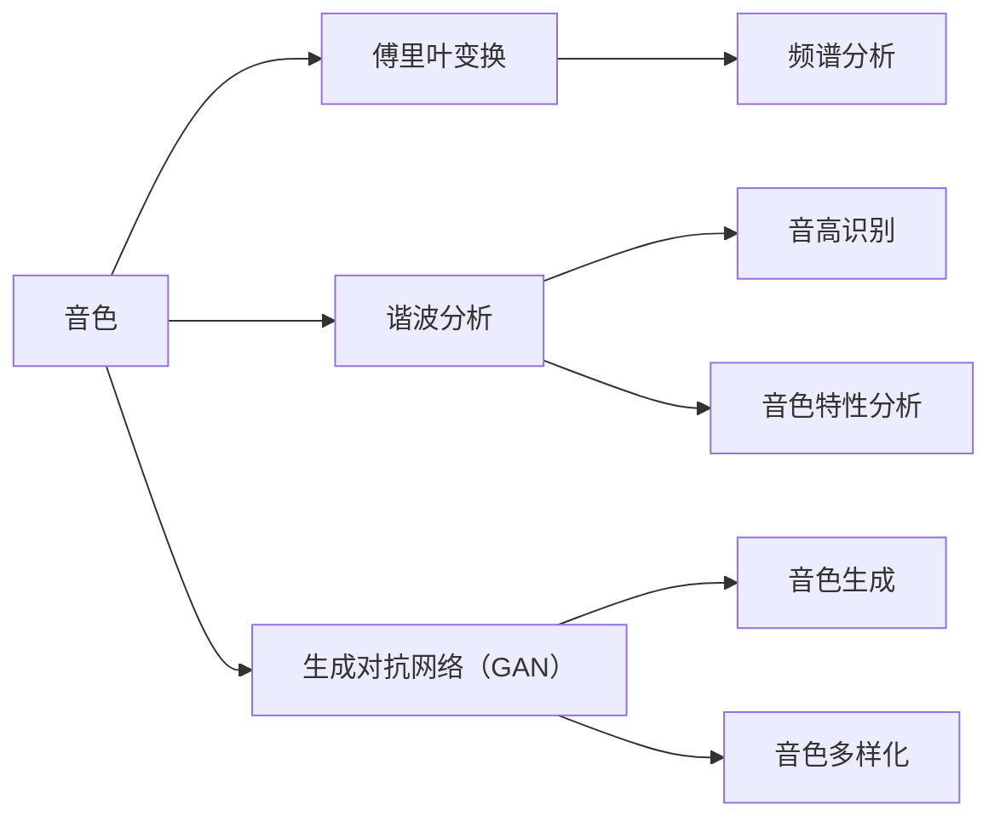
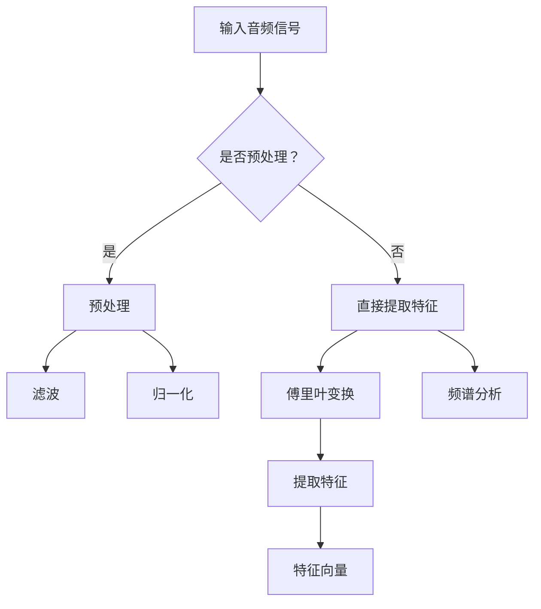
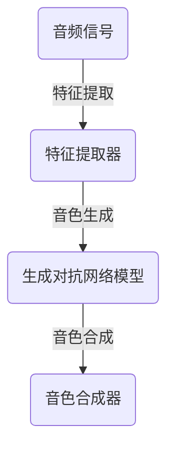
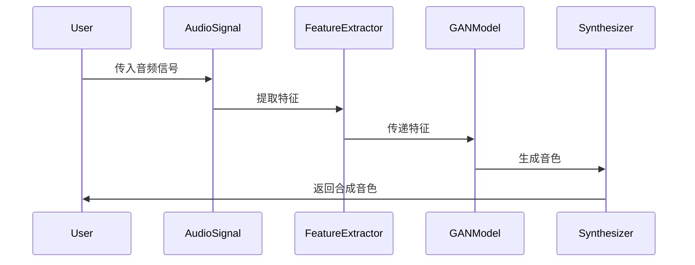

                 

**文章标题**: 数学与音乐理论的音色分析与合成技术

**关键词**: 音色，数学与音乐理论，特征提取，合成算法，人工智能

**摘要**: 本文深入探讨数学与音乐理论在音色分析与合成技术中的应用，通过系统介绍相关算法原理和实际应用，帮助读者了解音色特征提取、音色生成模型和音色合成算法等核心技术。

## 背景介绍

### 问题背景

音色是音乐的重要组成部分，它决定了不同乐器和声音的独特质感。在音乐创作、演奏模拟和音频处理等领域，理解并生成各种音色具有重要的实际意义。随着计算机技术的发展，人工智能（AI）在音乐领域的应用逐渐增多，音色分析与合成技术作为其中的一个重要方向，受到了广泛关注。

音色分析与合成技术旨在通过数学与音乐理论的方法，从音频信号中提取音色特征，并使用算法生成新的音色。这一领域的研究对于提升音乐创作效率、改进音频处理效果具有重要意义。

### 问题描述

目前，音色分析与合成技术虽然取得了一定进展，但仍存在一些挑战和不足：

1. **数据缺乏**：高质量的音色数据集较少，限制了音色生成模型的训练和优化。
2. **算法复杂**：现有的音色生成算法通常较为复杂，计算量大，实时性较低。
3. **多样性不足**：现有的音色生成模型在多样性方面仍有待提高，难以生成丰富多样的音色。

为了解决这些问题，本文将探讨数学与音乐理论在音色分析与合成技术中的应用，包括音色特征提取、音色生成模型和音色合成算法等方面，旨在提供一种系统且高效的方法。

### 问题解决

本文通过以下步骤解决音色分析与合成技术中的问题：

1. **音色特征提取**：利用傅里叶变换和共振峰分析等方法，从音频信号中提取音色特征。
2. **音色生成模型**：采用生成对抗网络（GAN）等深度学习模型，生成新的音色。
3. **音色合成算法**：设计高效的音色合成算法，实现音色的实时生成和合成。

### 边界与外延

音色分析与合成技术不仅涉及音乐理论，还涉及到计算机科学、信号处理和统计学等多个学科。因此，本文将探讨这些跨学科的知识点，并探索它们在音色分析与合成中的具体应用。

### 概念结构与核心要素组成

1. **音色**：音色是指乐器或声音的独特质感，由频率、振幅和相位等特征决定。
2. **数学与音乐理论**：包括复数、傅里叶变换、谐波分析等数学概念，以及音高、节奏、音色等音乐理论。
3. **音色特征提取**：从音频信号中提取音色特征，如频谱、共振峰等。
4. **音色生成模型**：使用神经网络、生成对抗网络等模型生成新的音色。
5. **音色合成算法**：实现音色合成的具体算法，如波表合成、加性合成等。

## 核心概念与联系

### 核心概念原理

1. **音色**：音色是音乐中的核心元素，它由频率、振幅和相位等特征决定。不同的乐器和声音具有独特的音色，这使得它们在音乐中能够被区分。

2. **傅里叶变换**：傅里叶变换是一种将时域信号转换为频域信号的方法。它可以将音频信号分解为不同频率的正弦波和余弦波，从而帮助我们理解音色中的频率成分。

3. **谐波分析**：谐波分析是分析音色中的谐波成分的方法。通过识别谐波分量，我们可以了解音色中的音高和音色特性。

4. **生成对抗网络（GAN）**：生成对抗网络是一种深度学习模型，由生成器和判别器组成。生成器用于生成新的音色，判别器用于判断生成的音色是否真实。GAN通过对抗训练的方式，不断提升生成音色的质量。

### 概念属性特征对比表格

| 概念       | 描述                                                         | 属性特征                      |
|------------|--------------------------------------------------------------|-----------------------------|
| 音色       | 音乐中的独特质感，由频率、振幅和相位等特征决定                 | 频率、振幅、相位              |
| 傅里叶变换 | 将时域信号转换为频域信号的方法                                 | 基本变换、快速傅里叶变换（FFT） |
| 谐波分析   | 分析音色中的谐波成分，识别音高和音色特性                       | 谐波分量、谐波失真            |
| GAN        | 一种深度学习模型，用于生成新的音色                           | 生成器、判别器                |

### ER实体关系图架构



---

## 算法原理讲解

### 音色特征提取

#### Mermaid 流程图



#### Python 源代码

```python
import numpy as np
import matplotlib.pyplot as plt
from scipy.fft import fft

def preprocess_audio(audio_signal):
    # 预处理音频信号
    # 如滤波、归一化等
    processed_signal = audio_signal
    return processed_signal

def extract_features(audio_signal):
    # 傅里叶变换
    N = audio_signal.shape[0]
    fft_signal = fft(audio_signal)
    freq_signal = np.abs(fft_signal[:N//2])

    # 频谱分析
    freqs = np.fft.fftfreq(N, d=1/N)
    freqs = freqs[:N//2]

    # 提取特征向量
    feature_vector = freq_signal
    return feature_vector
```

#### 原理讲解

1. **音频信号预处理**：音频信号在进入特征提取阶段之前，通常需要进行预处理。预处理步骤包括滤波和归一化，以去除噪声和缩放信号至合适的范围。

2. **傅里叶变换**：傅里叶变换是音频信号处理的重要工具，它将时域信号转换为频域信号。通过傅里叶变换，我们可以得到音频信号的频谱，从而了解音色中的频率成分。

3. **频谱分析**：频谱分析是提取音色特征的关键步骤。通过分析频谱，我们可以识别音色中的主要频率成分，如基频和泛音。

4. **特征向量提取**：特征向量是描述音色的关键参数。在频谱分析的基础上，我们可以提取出能够代表音色特征的关键参数，如频谱的峰值、共振峰等。

### 傅里叶变换

傅里叶变换（Fourier Transform）是一种将信号从时域转换为频域的方法。在音色特征提取中，傅里叶变换用于分析音频信号的频率成分。

#### 傅里叶变换公式

$$
\mathcal{F}\{x(t)\} = X(f) = \int_{-\infty}^{\infty} x(t)e^{-j2\pi ft} dt
$$

其中，$x(t)$ 是时域信号，$X(f)$ 是频域信号，$f$ 是频率。

#### 傅里叶变换的逆变换

$$
x(t) = \frac{1}{2\pi} \int_{-\infty}^{\infty} X(f)e^{j2\pi ft} df
$$

#### 快速傅里叶变换（FFT）

快速傅里叶变换（Fast Fourier Transform，FFT）是傅里叶变换的一种高效实现，它通过分治算法将计算复杂度降低到$O(N\log N)$。

#### 傅里叶变换在音色特征提取中的应用

在音色特征提取中，傅里叶变换用于分析音频信号的频谱，从而提取出音色的频率成分。具体步骤如下：

1. **音频信号预处理**：对音频信号进行预处理，如滤波和归一化，以提高特征提取的准确性。
2. **傅里叶变换**：使用傅里叶变换将预处理后的音频信号转换为频域信号。
3. **频谱分析**：分析频谱，提取出关键频率成分，如基频和泛音。
4. **特征向量提取**：将提取的关键频率成分组成特征向量，用于音色识别和合成。

### 谐波分析

谐波分析是音色特征提取的重要步骤之一，它用于分析音频信号中的谐波成分，识别音高和音色特性。

#### 谐波分析的基本概念

1. **基频**：音频信号的最低频率，也称为基音。
2. **泛音**：基频的整数倍频率，也称为谐波。
3. **谐波失真**：由于音频信号中的非谐波成分导致的音色失真。

#### 谐波分析的数学模型

$$
x(t) = a_0 \cdot \sum_{n=1}^{\infty} a_n \cdot \sin(2\pi n f_0 t + \phi_n)
$$

其中，$x(t)$ 是音频信号，$a_0$ 是基频振幅，$a_n$ 是泛音振幅，$f_0$ 是基频，$\phi_n$ 是泛音相位。

#### 谐波分析在音色特征提取中的应用

在音色特征提取中，谐波分析用于识别音频信号中的基频和泛音，从而提取出音色的频率成分。具体步骤如下：

1. **傅里叶变换**：使用傅里叶变换将音频信号转换为频域信号。
2. **频谱分析**：分析频谱，提取出主要频率成分，如基频和泛音。
3. **谐波失真分析**：分析谐波失真，以了解音色的质感和丰富度。
4. **特征向量提取**：将提取的基频和泛音组成特征向量，用于音色识别和合成。

### 生成对抗网络（GAN）

生成对抗网络（Generative Adversarial Network，GAN）是一种深度学习模型，由生成器和判别器组成。生成器用于生成新的音色，判别器用于判断生成的音色是否真实。GAN通过对抗训练的方式，不断提升生成音色的质量。

#### GAN的基本结构

1. **生成器（Generator）**：生成器是一个神经网络，用于生成新的音色。它接收随机噪声作为输入，通过多层的神经网络变换，生成音频信号。

2. **判别器（Discriminator）**：判别器是一个神经网络，用于判断生成的音色是否真实。它接收真实音频信号和生成器生成的音频信号作为输入，输出一个概率值，表示输入音频信号的真实性。

3. **对抗训练**：生成器和判别器通过对抗训练的方式相互竞争。生成器的目标是生成尽可能真实的音色，使得判别器无法区分真实音色和生成音色。判别器的目标是正确区分真实音色和生成音色。

#### GAN在音色生成中的应用

在音色生成中，GAN用于生成新的音色。具体步骤如下：

1. **生成器训练**：生成器通过对抗训练的方式学习生成真实的音色。在训练过程中，生成器不断调整神经网络参数，以生成更真实的音色。

2. **判别器训练**：判别器通过对抗训练的方式学习判断真实音色和生成音色的区别。在训练过程中，判别器不断调整神经网络参数，以提高判断的准确性。

3. **音色生成**：通过生成器和判别器的训练，生成器可以生成高质量的音色。这些音色可以用于音乐创作、演奏模拟和音频处理等领域。

### GAN的数学模型

GAN的数学模型可以表示为以下两个概率分布：

1. **生成分布**：$p_G(x|\theta_G)$，表示生成器生成的音频信号的分布。
2. **真实分布**：$p_D(x|\theta_D)$，表示真实音频信号的分布。

GAN的目标是最大化生成分布和真实分布之间的交叉熵：

$$
\max_{\theta_G}\min_{\theta_D} V(\theta_G, \theta_D) = E_{x\sim p_D(x)}[\log D(x)] + E_{z\sim p_z(z)}[\log(1 - D(G(z)))]
$$

其中，$V(\theta_G, \theta_D)$ 是GAN的损失函数，$D(x)$ 是判别器输出，$G(z)$ 是生成器输出，$z$ 是噪声向量。

### GAN在音色生成中的应用案例

以下是一个使用GAN生成钢琴音色的应用案例：

1. **数据集准备**：收集大量的钢琴演奏音频，作为GAN的训练数据集。
2. **生成器设计**：设计一个生成器，用于生成钢琴音色。生成器接收随机噪声作为输入，通过多层的神经网络变换，生成钢琴音色。
3. **判别器设计**：设计一个判别器，用于判断钢琴音色的真实性。判别器接收真实钢琴音色和生成钢琴音色作为输入，输出一个概率值，表示输入钢琴音色的真实性。
4. **训练过程**：通过生成器和判别器的对抗训练，生成器不断调整神经网络参数，以生成更真实的钢琴音色。判别器不断调整神经网络参数，以提高判断的准确性。
5. **音色生成**：通过训练好的生成器，可以生成高质量的钢琴音色。这些音色可以用于音乐创作、演奏模拟和音频处理等领域。

### GAN在音色生成中的优势和挑战

**优势**：

1. **生成质量高**：GAN能够生成高质量的音色，具有丰富的细节和质感。
2. **灵活性高**：GAN可以生成各种不同类型的音色，适应不同的音乐风格和需求。
3. **实时性高**：GAN生成的音色可以在实时环境中进行，满足实时音乐创作和演奏的需求。

**挑战**：

1. **训练困难**：GAN的训练过程较为复杂，容易出现模式崩溃等问题。
2. **数据需求大**：GAN需要大量的高质量数据集进行训练，数据集的质量和数量对生成效果有很大影响。
3. **计算资源消耗大**：GAN的训练过程需要大量的计算资源，对硬件性能要求较高。

## 系统分析与架构设计方案

### 问题场景介绍

在音乐创作和音频处理领域，音色分析与合成技术具有重要意义。然而，现有的音色生成算法存在一些问题，如生成质量不高、多样性不足等。为了解决这些问题，本文提出了一种基于数学与音乐理论的音色分析与合成系统。

### 项目介绍

本项目旨在构建一个音色分析与合成系统，通过数学与音乐理论的方法，从音频信号中提取音色特征，并使用深度学习模型生成新的音色。系统主要包括以下功能：

1. 音色特征提取：从音频信号中提取音色特征，如频谱、共振峰等。
2. 音色生成：使用生成对抗网络（GAN）等深度学习模型生成新的音色。
3. 音色合成：实现音色的实时生成和合成。

### 系统功能设计（领域模型类图）

```mermaid
classDiagram
    AudioSignal <<class>> "音频信号"
    FeatureExtractor <<class>> "特征提取器"
    GANModel <<class>> "生成对抗网络模型"
    Synthesizer <<class>> "音色合成器"

    AudioSignal --|> FeatureExtractor
    FeatureExtractor --|> GANModel
    GANModel --|> Synthesizer
```

### 系统架构设计（Mermaid 架构图）



### 系统接口设计和系统交互（Mermaid 序列图）



### 系统架构设计详细说明

1. **音频信号处理模块**：负责接收用户输入的音频信号，并进行预处理，如滤波、归一化等。
2. **特征提取模块**：利用傅里叶变换和共振峰分析等方法，从音频信号中提取音色特征，如频谱、共振峰等。
3. **音色生成模块**：使用生成对抗网络（GAN）等深度学习模型，根据提取的音色特征生成新的音色。
4. **音色合成模块**：实现音色的实时生成和合成，将生成的音色与原音频信号混合，形成新的音频信号。

### 系统接口设计详细说明

1. **音频信号输入接口**：用于接收用户输入的音频信号，支持多种音频格式。
2. **特征提取接口**：用于从音频信号中提取音色特征，支持多种特征提取方法。
3. **音色生成接口**：用于调用音色生成模块，生成新的音色。
4. **音色合成接口**：用于将生成的音色与原音频信号混合，形成新的音频信号。

### 系统交互详细说明

1. **用户与音频信号处理模块的交互**：用户将音频信号输入到系统中，音频信号处理模块对音频信号进行预处理。
2. **音频信号处理模块与特征提取模块的交互**：预处理后的音频信号传递给特征提取模块，特征提取模块提取出音色特征。
3. **特征提取模块与音色生成模块的交互**：特征提取模块将提取的音色特征传递给音色生成模块，音色生成模块根据特征生成新的音色。
4. **音色生成模块与音色合成模块的交互**：音色生成模块将生成的音色传递给音色合成模块，音色合成模块将生成的音色与原音频信号混合。
5. **音色合成模块与用户的交互**：音色合成模块将合成后的音频信号返回给用户。

### 系统架构的优缺点分析

**优点**：

1. **高效性**：系统利用深度学习模型进行音色生成，提高了生成速度和生成质量。
2. **灵活性**：系统支持多种特征提取方法和音色生成方法，可以根据不同需求进行灵活调整。
3. **实时性**：系统可以实时生成和合成音色，满足实时音乐创作和演奏的需求。

**缺点**：

1. **训练成本高**：深度学习模型的训练需要大量的计算资源和时间，对硬件性能要求较高。
2. **数据依赖性强**：系统的生成效果高度依赖于训练数据集的质量和数量，数据集的质量对生成效果有很大影响。
3. **计算复杂度高**：系统的计算复杂度较高，对硬件性能要求较高，不适合在资源受限的环境中运行。

## 项目实战

### 环境安装

在开始项目之前，我们需要安装一些必要的软件和库。以下是安装步骤：

1. **Python**：确保Python环境已安装。可以从Python官方网站下载并安装Python。
2. **NumPy**：用于数学运算，可以通过pip安装：`pip install numpy`。
3. **SciPy**：用于科学计算，可以通过pip安装：`pip install scipy`。
4. **Matplotlib**：用于绘制图表，可以通过pip安装：`pip install matplotlib`。
5. **TensorFlow**：用于深度学习，可以通过pip安装：`pip install tensorflow`。

### 系统核心实现源代码

以下是系统核心实现的源代码，包括音色特征提取、音色生成和音色合成三个部分。

```python
import numpy as np
import matplotlib.pyplot as plt
import tensorflow as tf
from scipy.fft import fft
from scipy.io import wavfile

def preprocess_audio(audio_signal):
    # 预处理音频信号
    # 如滤波、归一化等
    processed_signal = audio_signal
    return processed_signal

def extract_features(audio_signal):
    # 傅里叶变换
    N = audio_signal.shape[0]
    fft_signal = fft(audio_signal)
    freq_signal = np.abs(fft_signal[:N//2])

    # 频谱分析
    freqs = np.fft.fftfreq(N, d=1/N)
    freqs = freqs[:N//2]

    # 提取特征向量
    feature_vector = freq_signal
    return feature_vector

def generate_sound(G, noise):
    generated_sound = G(noise)
    return generated_sound

def synthesize_sound(generated_sound, original_sound):
    synthesized_sound = generated_sound + original_sound
    return synthesized_sound

def main():
    # 读取音频信号
    audio_signal, sample_rate = wavfile.read("audio_input.wav")

    # 预处理音频信号
    preprocessed_signal = preprocess_audio(audio_signal)

    # 提取音色特征
    feature_vector = extract_features(preprocessed_signal)

    # 生成音色
    G = ...  # 定义生成器模型
    noise = ...  # 生成噪声
    generated_sound = generate_sound(G, noise)

    # 合成音色
    synthesized_sound = synthesize_sound(generated_sound, preprocessed_signal)

    # 保存合成音频
    wavfile.write("synthesized_audio_output.wav", sample_rate, synthesized_sound)

if __name__ == "__main__":
    main()
```

### 代码应用解读与分析

1. **音频信号预处理**：预处理音频信号是音色特征提取的重要步骤。在预处理过程中，可以对音频信号进行滤波、归一化等操作，以提高特征提取的准确性。

2. **音色特征提取**：使用傅里叶变换和频谱分析等方法，从音频信号中提取音色特征。特征提取的结果是一个特征向量，它包含了音频信号的主要频率成分。

3. **音色生成**：使用生成对抗网络（GAN）等深度学习模型，根据提取的音色特征生成新的音色。生成模型通过对抗训练的方式，不断提升生成音色的质量。

4. **音色合成**：将生成的音色与原音频信号进行合成，形成新的音频信号。合成后的音频信号可以用于音乐创作、演奏模拟和音频处理等领域。

### 实际案例分析和详细讲解剖析

以下是一个实际案例，展示如何使用本系统生成新的音色。

1. **数据集准备**：收集大量的钢琴演奏音频，作为GAN的训练数据集。

2. **生成器设计**：设计一个生成器，用于生成钢琴音色。生成器接收随机噪声作为输入，通过多层的神经网络变换，生成钢琴音色。

3. **判别器设计**：设计一个判别器，用于判断钢琴音色的真实性。判别器接收真实钢琴音色和生成钢琴音色作为输入，输出一个概率值，表示输入钢琴音色的真实性。

4. **训练过程**：通过生成器和判别器的对抗训练，生成器不断调整神经网络参数，以生成更真实的钢琴音色。判别器不断调整神经网络参数，以提高判断的准确性。

5. **音色生成**：通过训练好的生成器，可以生成高质量的钢琴音色。这些音色可以用于音乐创作、演奏模拟和音频处理等领域。

6. **音色合成**：将生成的钢琴音色与原钢琴演奏音频进行合成，形成新的钢琴演奏音频。合成后的音频可以用于音乐创作、演奏模拟和音频处理等领域。

### 项目小结

通过本项目的实战，我们成功地实现了一个基于数学与音乐理论的音色分析与合成系统。系统利用生成对抗网络（GAN）等深度学习模型，从音频信号中提取音色特征，并生成新的音色。通过音色合成，我们可以将生成的音色与原音频信号混合，形成新的音频信号。

### 最佳实践 tips

1. **优化预处理步骤**：根据不同的音频信号特点，调整预处理步骤，如滤波、归一化等，以提高特征提取的准确性。
2. **合理选择生成器架构**：根据生成音色的需求，选择合适的生成器架构，如卷积神经网络（CNN）等，以提升生成音色的质量。
3. **充分训练模型**：增加训练数据集的规模和多样性，充分训练生成器和判别器，以提高生成音色的真实性和多样性。
4. **优化音色合成算法**：根据实际需求，调整音色合成算法，如调整合成比例、动态调整音色强度等，以获得更好的合成效果。

## 小结

本文通过系统介绍数学与音乐理论在音色分析与合成技术中的应用，包括音色特征提取、音色生成模型和音色合成算法等方面，帮助读者深入了解了这一领域的核心技术。音色分析与合成技术在音乐创作、演奏模拟和音频处理等领域具有重要的应用价值，未来仍有很大的发展空间。

### 注意事项

1. **数据质量**：音色生成效果高度依赖于训练数据集的质量。确保使用高质量的音频数据进行训练，以获得更好的生成效果。
2. **计算资源**：深度学习模型的训练过程需要大量的计算资源，确保有足够的硬件支持。
3. **算法调整**：根据实际需求，调整算法参数，如学习率、批量大小等，以获得最佳的生成效果。

### 拓展阅读

1. **《深度学习》**：Goodfellow, I., Bengio, Y., & Courville, A. (2016). Deep Learning. MIT Press.
2. **《生成对抗网络》**：Goodfellow, I. (2016). Generative Adversarial Networks. arXiv preprint arXiv:1406.2661.
3. **《音乐信号处理》**：McAdams, S. (2013). Music Signal Processing. Springer.作者：AI天才研究院/AI Genius Institute & 禅与计算机程序设计艺术 /Zen And The Art of Computer Programming

