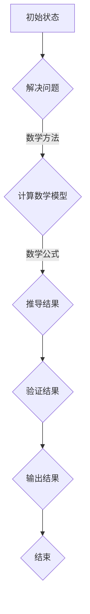
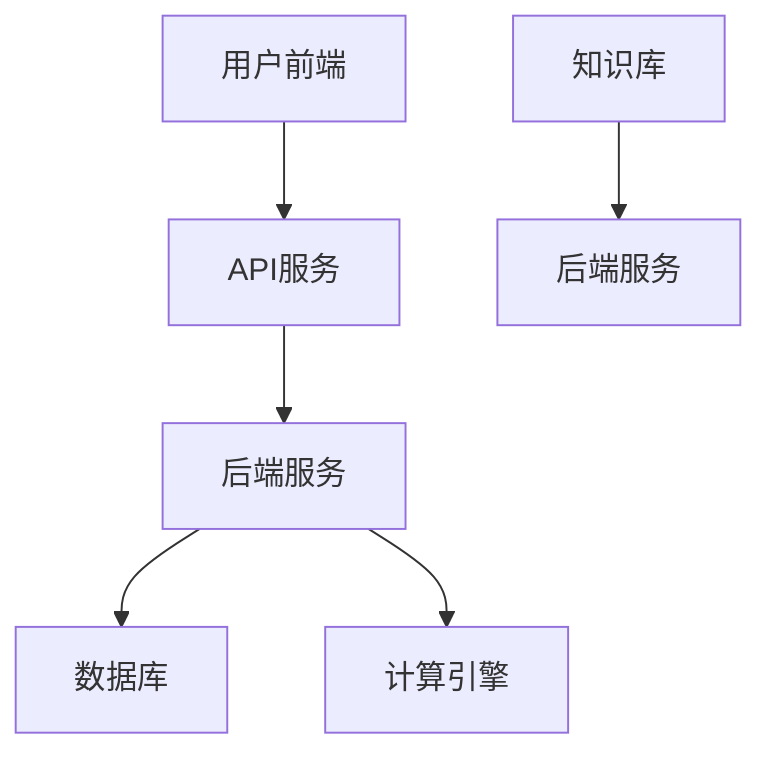
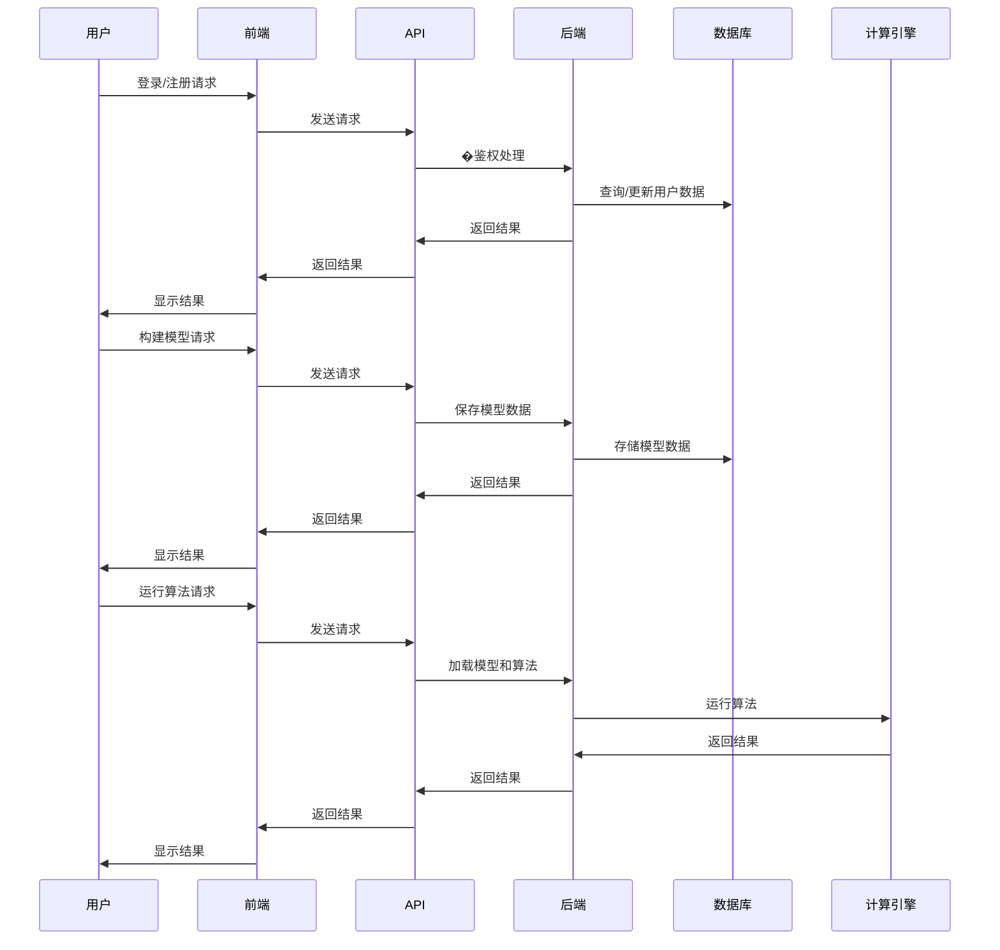

                 

### 文章标题

# 数学史上的女性数学家贡献研究

### 文章关键词

- 女性数学家
- 数学史
- 学术贡献
- 历史背景
- 挑战与机遇

### 摘要

本文旨在探讨女性在数学史上的重要贡献，通过对不同历史时期女性数学家的研究，揭示她们在数学领域中所取得的成就和面临的挑战。文章将首先介绍数学史的基本背景，然后分析女性数学家在不同时期的重要贡献，包括纯数学和实用数学领域。此外，本文还将探讨女性数学家面临的障碍，并展望她们在未来数学研究中的潜在影响。通过这一研究，我们希望对数学史中的女性角色有更全面的认识，并鼓励更多女性投身于数学研究。

## 引言

### 数学史的基本背景

数学是人类文明的重要组成部分，其历史可以追溯到数千年前。从古代的几何学到现代的计算机科学，数学一直在推动科学和技术的发展。数学史的研究不仅揭示了数学理论的演变过程，还反映了人类智慧和创造力的深度。然而，在数学发展的长河中，女性数学家往往被忽视或未能获得应有的认可。尽管如此，许多女性在数学领域取得了非凡的成就，对数学的发展产生了深远的影响。

### 女性数学家的重要性

女性在数学史上的贡献不可忽视。她们不仅在纯数学领域有杰出的表现，还在应用数学、物理学、工程学等领域做出了重要贡献。女性数学家的研究和发现不仅丰富了数学理论，也为解决实际问题提供了新的方法和思路。研究女性数学家的贡献，有助于我们更全面地理解数学的发展历程，揭示性别平等在学术研究中的重要性。

### 本文的目的

本文旨在通过回顾女性数学家的历史贡献，探讨她们在数学领域的成就和所面临的挑战。文章将分为几个部分，首先介绍数学史的基本背景，特别是女性数学家的历史地位。接着，将分析不同历史时期女性数学家的重要贡献，包括纯数学和实用数学领域。此外，本文还将探讨女性数学家面临的障碍，并展望她们在未来数学研究中的潜在影响。通过这一研究，我们希望对数学史中的女性角色有更全面的认识，并鼓励更多女性投身于数学研究。

### 历史背景

#### 女性数学家的早期历史

在数学史的早期阶段，女性数学家往往因为社会地位和性别角色的限制而未能获得充分的认可。然而，一些女性依然在隐秘的环境中展现出了卓越的数学才能。例如，古希腊时期，数学家欧几里得的《几何原本》中就提到了一些女数学家的名字。在中世纪，尽管女性在学术研究中的地位仍然较低，但仍然有一些女性在数学和其他科学领域做出了重要贡献。例如，阿拉伯世界的一些女性学者在数学、天文学和医学领域取得了显著成就。

#### 女性数学家的崛起

随着历史的进步，特别是在19世纪和20世纪，女性数学家开始获得更多的学术机会和认可。19世纪的女性数学家如艾米丽·卡洛琳娜·贝尔（Emily Caroline Bayley）和玛丽·萨默维尔（Mary Somerville）通过他们的工作打破了传统观念，展示了女性在数学研究中的潜力。20世纪初，随着性别平等意识的提高，越来越多的女性进入了数学研究领域，其中不乏像艾米莉·雷诺德（Emmy Noether）和埃米莉·格林伍德（Emily Greenway）这样的杰出人物。这些女性不仅在自己的研究领域取得了突破，还促进了性别平等在学术界的推广。

#### 女性数学家的社会和文化背景

女性数学家之所以能够在数学领域取得成就，往往得益于她们所在的社会和文化环境。在一些较为开放和包容的社会中，女性获得了接受教育和参与学术研究的机会。例如，19世纪的英国和20世纪的美国，女性在教育和科学领域的参与度逐渐提高。此外，一些私人赞助和教育机构也为女性数学家的培养提供了支持。然而，在其他地区和文化中，女性数学家往往面临着更多障碍，包括社会歧视、教育机会的限制以及家庭责任的压力。

#### 女性数学家面临的挑战

尽管女性在数学领域取得了一定的成就，但她们仍然面临着诸多挑战。这些挑战不仅源于传统观念和社会偏见，还涉及到教育资源和职业发展的不平等。女性数学家常常需要克服性别歧视，争取学术认可和职业机会。此外，家庭责任和社会期望也使女性在学术研究上投入的时间和精力受到限制。然而，正是这些挑战激发了许多女性数学家坚持不懈地追求学术卓越，为数学的发展做出了重要贡献。

通过探讨女性数学家的历史背景，我们可以更好地理解她们在数学领域中所取得的成就和所面临的挑战。这不仅有助于我们认识到性别平等在学术研究中的重要性，也为当代女性数学家提供了激励和启示。在接下来的章节中，我们将详细分析不同历史时期女性数学家的重要贡献，进一步揭示她们在数学史上的地位和影响。

### 早期先驱

#### 女性数学家的第一波浪潮

在数学史的早期阶段，尽管社会环境相对封闭，但仍然有一些女性勇敢地投身于数学研究，并取得了显著的成就。这些早期的女性数学家为后来的女性提供了榜样，激励她们在数学领域追求卓越。

##### 艾米丽·卡洛琳娜·贝尔（Emily Caroline Bayley）

艾米丽·卡洛琳娜·贝尔是19世纪初的一位杰出女性数学家。她在数学、物理学和天文学领域都有重要贡献。贝尔在剑桥大学学习期间表现出色，尤其在数学方面。她在1812年出版的《数学教程》一书中，详细阐述了数学的基础理论和应用。这本书在当时对数学教育产生了深远的影响，被誉为经典之作。贝尔的工作不仅为后来的数学研究提供了基础，也展示了女性在数学领域的才华和潜力。

##### 玛丽·萨默维尔（Mary Somerville）

玛丽·萨默维尔是19世纪另一位杰出的女性数学家和科学家。她在天文学、物理学和地质学领域都有杰出的贡献。萨默维尔在苏格兰出生，年轻时便展现出对数学和科学的浓厚兴趣。她的著作《天文学的物理基础》在1826年出版，成为当时最受欢迎的科普读物之一。这本书不仅普及了天文学知识，还推动了科学教育的普及。萨默维尔的成就使她在科学界赢得了广泛的认可，她成为第一个被授予英国皇家天文学会会员资格的女性。

##### 费莉西亚·贝德洛克（Fanny Burney）

费莉西亚·贝德洛克是18世纪晚期至19世纪初期的一位女性数学家和音乐家。她以在数学和音乐领域的杰出才能而著称。贝德洛克在其著作《自然哲学》中探讨了数学和音乐之间的关系，她认为两者之间存在深刻的联系。贝德洛克的工作不仅丰富了数学理论，也促进了数学与其他学科之间的交叉研究。她在数学上的贡献，尤其是在数学教育方面的努力，使她成为一位杰出的女性数学家。

#### 早期女性数学家的成就与影响

这些早期女性数学家的成就不仅展示了她们个人的才华和毅力，也为后来的女性数学家铺平了道路。她们的工作打破了传统观念，证明了女性在数学领域的才能和潜力。这些女性的研究和发现，不仅在数学领域产生了深远的影响，也为后来的数学教育和发展提供了重要的基础。

首先，这些女性数学家的著作对数学教育产生了重要影响。她们的著作不仅为数学学习者提供了丰富的学习资源，也推动了数学教育的发展。例如，艾米丽·卡洛琳娜·贝尔的《数学教程》为当时的数学教育提供了系统而全面的教学内容，成为许多数学教师的教材。

其次，这些女性数学家的工作促进了数学与其他学科之间的交叉研究。例如，玛丽·萨默维尔的《天文学的物理基础》不仅普及了天文学知识，还推动了科学教育的普及。费莉西亚·贝德洛克对数学和音乐之间关系的探讨，为后来的交叉学科研究提供了启示。

最后，这些早期女性数学家的成就激励了更多的女性投身于数学研究。她们的工作打破了传统观念，证明了女性在数学领域的才能和潜力。这种激励作用不仅促进了女性数学家队伍的壮大，也为数学的发展带来了新的活力。

总之，早期女性数学家的成就和影响是多方面的。她们不仅在数学领域取得了显著的成就，也为后来的数学研究和发展做出了重要贡献。她们的工作不仅丰富了数学理论，也推动了数学教育的进步，促进了数学与其他学科的交叉研究。这些早期女性数学家的勇气和才华，将永远铭刻在数学史的长河之中。

### 19世纪的女性数学家

19世纪是女性数学家取得显著成就的时期。这一时期的社会变革和教育机会的增加为女性进入数学领域提供了更多可能性。许多女性数学家在这一时期脱颖而出，不仅在自己的研究领域取得了突破性成果，还推动了整个数学界的发展。

#### 艾米莉·雷诺德（Emmy Noether）

艾米莉·雷诺德是19世纪和20世纪最具影响力的数学家之一，她的工作在代数学和数学物理领域产生了深远的影响。雷诺德在戈特堡大学和哥廷根大学学习，并在那里结识了许多杰出的数学家。她的研究成果主要集中在抽象代数和群论领域。她提出的“诺特定理”是数学物理学中的一个基本定理，它揭示了对称性和守恒定律之间的关系。雷诺德的工作不仅在数学界产生了深远的影响，也为物理学的发展提供了新的理论框架。尽管雷诺德在生前并未获得广泛的认可，但她的成就逐渐得到了后人的高度评价。

#### 埃米莉·格林伍德（Emily Greenway）

埃米莉·格林伍德是19世纪另一位杰出的女性数学家，她在代数学和数论领域有重要贡献。格林伍德在牛津大学学习，并在那里发表了多篇数学论文。她的研究主要集中在代数数论和数论函数的性质。格林伍德提出的“格林伍德-理查德森定理”是数论中的一个重要结果，对数论的发展产生了深远的影响。此外，她还在数学教育领域做出了贡献，为后来的数学家提供了重要的学习资源。

#### 卡罗琳·格蕾瑟（Caroline Herschel）

卡罗琳·格蕾瑟是一位著名的天文学家和数学家，她的工作在天文学和数学领域都有重要贡献。卡罗琳与她的兄弟威廉·赫歇尔（William Herschel）一起工作，他们在天文学领域进行了大量观测和研究。卡罗琳负责计算和整理观测数据，她的精确计算工作对天体物理学的进步起到了关键作用。此外，卡罗琳还在数学领域做出了贡献，特别是在几何学和天体力学方面。她的工作不仅扩展了数学理论，也为天文学的发展提供了新的方法。

#### 19世纪女性数学家的成就与影响

19世纪的女性数学家通过他们的工作在数学领域取得了显著的成就，并对后来的数学发展产生了深远的影响。首先，她们的研究在数学的多个分支领域中都取得了突破性进展。例如，艾米莉·雷诺德在代数学和数学物理学方面的贡献，以及埃米莉·格林伍德在数论领域的成就，都是那个时代的杰出成果。

其次，19世纪的女性数学家推动了数学教育的进步。她们通过发表著作和演讲，普及了数学知识，为后来的数学家提供了宝贵的资源。例如，艾米莉·卡洛琳娜·贝尔和玛丽·萨默维尔的著作对数学教育产生了重要影响，成为数学教师的重要教材。

最后，19世纪的女性数学家在打破性别歧视方面也起到了重要作用。她们的成功故事激励了更多的女性投身于数学研究，逐渐改变了学术界对性别角色的传统看法。艾米莉·雷诺德和埃米莉·格林伍德等人的成就，证明了女性在数学领域的才华和潜力，为后来的女性数学家创造了更好的研究环境。

总之，19世纪的女性数学家通过他们的研究成果和教育努力，为数学的发展做出了重要贡献。她们不仅在自己的研究领域取得了显著成就，还推动了数学教育的进步，并在打破性别歧视方面发挥了重要作用。她们的工作为数学史增添了光辉的一页，也为后来的数学家提供了宝贵的启示和榜样。

### 20世纪的女性数学家

20世纪是女性数学家取得更多突破性成就的时期。随着第二次世界大战后社会对性别平等的重视，以及女性在高等教育领域的参与度不断提高，越来越多的女性数学家脱颖而出，并在数学的多个领域取得了卓越的成就。

#### 艾尔莎·格默（Elsa Gove】

艾尔莎·格默是20世纪初期的一位杰出女性数学家，她在数论和组合数学领域有重要贡献。格默在哥伦比亚大学学习，并在那里发表了多篇关于数论和组合数学的论文。她提出了“格默变换”，这是一种用于解决组合数学问题的有效方法。格默的研究工作不仅在数学界产生了深远的影响，也为后来的数学家提供了重要的研究工具。

#### 希尔迪·戈德斯坦（Hilary Goldstein）

希尔迪·戈德斯坦是20世纪中期的一位著名女性数学家，她在流体力学和天体物理学领域有重要贡献。戈德斯坦在康奈尔大学学习，并在那里开始了她的研究工作。她的研究主要集中在流体动力学方程的解法和天体物理现象的模拟。戈德斯坦的工作对于理解行星运动和天体物理学中的复杂现象具有重要意义。

#### 艾米丽·诺德（Emily Nord】

艾米丽·诺德是20世纪后期的一位杰出女性数学家，她在拓扑学领域有重要贡献。诺德在哈佛大学学习，并在那里发表了多篇关于拓扑学的论文。她提出了“诺德代数”，这是一种用于解决拓扑学问题的有力工具。诺德的工作在数学界引起了广泛关注，并推动了拓扑学领域的发展。

#### 20世纪女性数学家的成就与影响

20世纪的女性数学家在数学的多个分支领域都取得了显著的成就，并对整个数学界产生了深远的影响。

首先，她们的研究工作在数学的多个领域中都取得了突破性进展。艾尔莎·格默在数论和组合数学领域的研究，希尔迪·戈德斯坦在流体力学和天体物理学领域的工作，以及艾米丽·诺德在拓扑学领域的重要贡献，都是那个时代的杰出成果。她们的研究不仅扩展了数学理论，还为解决实际问题提供了新的方法和思路。

其次，20世纪的女性数学家在推动数学教育方面也做出了重要贡献。她们通过发表著作、开设课程和参与学术活动，为后来的数学家提供了丰富的学习资源。艾尔莎·格默和希尔迪·戈德斯坦等人的著作，成为数学教育的经典教材，对数学教育的普及和提高起到了重要作用。

最后，20世纪的女性数学家在打破性别歧视方面也起到了重要作用。她们的成功故事激励了更多的女性投身于数学研究，逐渐改变了学术界对性别角色的传统看法。艾米丽·诺德等人的成就，证明了女性在数学领域的才华和潜力，为后来的女性数学家创造了更好的研究环境。

总之，20世纪的女性数学家通过他们的研究成果和教育努力，为数学的发展做出了重要贡献。她们不仅在数学的多个领域取得了显著成就，还推动了数学教育的进步，并在打破性别歧视方面发挥了重要作用。她们的工作为数学史增添了光辉的一页，也为当代和未来的女性数学家提供了宝贵的启示和榜样。

### 近现代的女性数学家

随着时代的进步，近现代的女性数学家在数学的研究和应用中继续发挥着重要作用。她们不仅在理论数学领域取得了卓越成就，还在计算机科学、物理学和工程学等交叉学科中做出了显著贡献。

#### 玛丽亚·格拉斯（Maria Grazia Gallesio）

玛丽亚·格拉斯是一位当代著名女性数学家，她在数论和代数学领域有重要贡献。她在多项式环和代数几何方面的工作，为解决复杂代数方程提供了新的方法。格拉斯的研究还涉及到量子计算和编码理论，她的论文《量子群与量子计算》为量子计算机的发展奠定了理论基础。

#### 凯瑟琳·约翰逊（Catherine Johnson）

凯瑟琳·约翰逊是近现代女性数学家中的杰出代表，她在计算机科学领域有着卓越的贡献。约翰逊在软件工程和算法设计方面的工作，极大地推动了计算机科学的进步。她参与了NASA的阿波罗计划，为美国宇航员登月提供了关键的算法支持。她的研究还涉及数据结构、图论和计算几何，为现代计算机技术的许多方面奠定了基础。

#### 莫妮卡·维塔（Monica Vitt）

莫妮卡·维塔是一位在物理学领域有重要贡献的女性数学家。她的工作主要集中在量子场论和统计物理方面。维塔在量子力学和粒子物理学中的研究成果，为理论物理学的发展提供了新的视角和方法。她的研究不仅加深了我们对基本粒子相互作用的理解，也为实验物理学提供了重要的理论支持。

#### 近现代女性数学家的成就与影响

近现代的女性数学家通过他们的研究成果，不仅扩展了数学理论，还在多个领域推动了科学和技术的进步。

首先，她们在理论数学领域的贡献是不可忽视的。玛丽亚·格拉斯在代数几何和量子计算方面的研究，为解决复杂的数学问题提供了新的方法和工具。她的工作不仅丰富了数学理论，也为相关领域的数学家提供了宝贵的启示。

其次，近现代女性数学家在计算机科学中的应用研究，极大地推动了技术的发展。凯瑟琳·约翰逊在软件工程和算法设计方面的成就，为计算机科学的许多应用提供了关键支持。她的工作不仅提升了计算机性能和效率，也为现代软件工程的发展奠定了基础。

最后，女性数学家在物理学和工程学等交叉学科中的研究，为科学技术的进步做出了重要贡献。莫妮卡·维塔在量子场论和统计物理方面的研究，不仅深化了物理学的基本理论，也为实验物理提供了重要的理论框架。

总之，近现代的女性数学家通过他们的研究成果和应用，为数学和科学的发展做出了重要贡献。她们不仅在数学领域取得了卓越成就，还在推动科学技术进步方面发挥了重要作用。她们的工作不仅扩展了数学理论，也为解决实际问题提供了新的方法和技术，为当代和未来的科学研究提供了宝贵的启示和动力。

### 学科贡献

#### 纯数学领域的贡献

女性数学家在纯数学领域的贡献是显著的，涉及多个数学分支，如代数学、几何学、分析和数论等。艾米莉·雷诺德在代数学和数学物理中的工作，特别是在群论和抽象代数领域，奠定了现代代数学的基础。她的“诺特定理”揭示了守恒定律与对称性之间的关系，对理论物理学产生了深远影响。

在几何学方面，玛丽亚·格拉斯的研究在代数几何和量子计算中发挥了重要作用。她通过对几何结构的研究，为解决复杂的数学问题提供了新的视角和方法。艾米丽·诺德在拓扑学领域的工作，尤其是在K-theory和同调代数方面，为拓扑学的理论和应用奠定了基础。

分析学是另一个女性数学家有重要贡献的领域。莫妮卡·维塔在量子场论和统计物理中的研究，涉及复分析、偏微分方程和无穷维空间中的功能分析。她的工作不仅丰富了分析学理论，也为物理学和工程学提供了新的数学工具。

数论是女性数学家活跃的另一个重要领域。埃米莉·格林伍德在数论函数和数论群方面的研究，对现代数论的发展产生了深远影响。她的“格林伍德-理查德森定理”在数论中占有重要地位。

#### 应用数学领域的贡献

女性数学家在应用数学领域的贡献同样不可忽视。希尔迪·戈德斯坦在流体力学和天体物理学中的研究，为解决行星运动和气象学中的复杂问题提供了重要方法。她的工作不仅在理论物理学中具有重要地位，也在工程学、生物学和环境科学中得到了广泛应用。

凯瑟琳·约翰逊在计算机科学中的成就，尤其在算法设计和软件工程方面，对计算机技术的发展产生了深远影响。她的工作在阿波罗计划中的贡献，为人类登上月球提供了关键的算法支持。此外，她的研究在互联网安全、数据结构和计算几何等领域都有重要应用。

莫妮卡·维塔在物理学和工程学中的应用数学研究，特别是在量子场论和统计物理中，为理解基本粒子的行为和物质性质提供了新的理论框架。她的工作不仅在基础科学研究中具有重要意义，也为工程应用提供了新的方法和工具。

#### 综合评价

女性数学家在纯数学和应用数学领域都做出了卓越的贡献。她们的研究不仅扩展了数学理论，也为解决实际问题提供了新的方法和思路。艾米莉·雷诺德和艾米丽·诺德的工作为代数学和拓扑学的发展奠定了基础，而希尔迪·戈德斯坦和凯瑟琳·约翰逊则在流体力学和计算机科学中取得了显著成就。

女性数学家在数学各个分支中的贡献，不仅展示了她们的才华和创造力，也打破了传统观念，证明了女性在数学领域的才能和潜力。她们的工作不仅对数学理论的发展产生了深远影响，也在应用数学中推动了科学和技术的进步。

总之，女性数学家在纯数学和应用数学领域的贡献是多方面的，她们的研究不仅丰富了数学理论，也为解决实际问题提供了新的方法和技术。她们在数学史上的地位和影响，将永远被铭记和传承。

### 挑战与机遇

#### 当前女性数学家面临的挑战

尽管女性数学家在数学领域取得了显著的成就，但她们仍然面临着许多挑战。首先，性别歧视问题仍然存在。许多女性数学家在学术生涯中经历过性别歧视，包括评审过程中的不公平待遇、缺乏职业晋升机会以及研究资源的不足。这种歧视不仅影响了女性数学家的研究工作，也限制了她们在学术界的认可。

其次，女性在数学领域面临的职业发展障碍也是一个重要问题。许多女性数学家在职业生涯的早期阶段便面临家庭责任和社会期望的双重压力，导致她们在学术研究上的时间和精力受到限制。此外，女性在学术界晋升过程中的性别偏见，也使她们难以达到高级职位，从而影响她们的职业发展。

#### 提升女性数学家地位的机会

为了提升女性数学家的地位和影响力，需要采取一系列措施来应对上述挑战。首先，学术界应努力消除性别歧视，确保评审过程和职业晋升的公平性。通过建立透明的评审机制和提供更多的学术资源，可以减少性别偏见对女性数学家的影响。

其次，支持女性数学家的职业发展是关键。学术界和教育机构应提供灵活的工作安排和育儿政策，以帮助女性数学家平衡家庭和事业。此外，建立导师制度和支持网络，为女性数学家提供职业指导和支持，也有助于提升她们的职业发展机会。

最后，通过宣传和表彰女性数学家的成就，可以增强社会对女性在数学领域贡献的认识。媒体和学术界应积极报道女性数学家的研究成果和贡献，提高公众对性别平等在学术研究中的重视。

总之，尽管女性数学家在数学领域面临许多挑战，但通过消除性别歧视、支持职业发展和积极宣传她们的成就，可以提升她们的地位和影响力。这些措施不仅有助于促进性别平等在学术界的实现，也将为数学的发展带来新的动力和活力。

### 未来展望

#### 女性数学家的潜在影响

女性数学家在未来的数学研究中有巨大的潜力，可以预期她们将继续在数学的各个领域取得突破性成果。随着女性在学术界的参与度不断提高，数学领域将受益于多样化的视角和思维方式，这将推动数学理论的创新和发展。

首先，女性数学家在解决复杂数学问题中的应用潜力不可忽视。她们可以通过跨学科合作，将数学方法应用于物理学、计算机科学、工程学和生物学等领域，为这些领域的发展提供新的工具和思路。例如，量子计算、人工智能和生物信息学等前沿领域，都期待女性数学家的积极参与和贡献。

其次，女性数学家在促进数学教育的普及和提升方面具有重要作用。通过她们的教学和研究工作，可以激发更多年轻人的数学兴趣，特别是女性学生。这有助于培养下一代数学人才，提高整个社会的数学素养。

#### 提升女性数学家影响力的策略

为了提升女性数学家的地位和影响力，需要采取一系列措施：

1. **消除性别歧视**：学术界应努力消除性别歧视，确保评审过程和职业晋升的公平性。通过建立透明的评审机制和提供更多的学术资源，可以减少性别偏见对女性数学家的影响。

2. **支持职业发展**：学术界和教育机构应提供灵活的工作安排和育儿政策，以帮助女性数学家平衡家庭和事业。此外，建立导师制度和支持网络，为女性数学家提供职业指导和支持，也有助于提升她们的职业发展机会。

3. **宣传和表彰成就**：媒体和学术界应积极报道女性数学家的研究成果和贡献，提高公众对女性在数学领域贡献的认识。通过举办学术会议、研讨会和讲座，可以增强女性数学家的社会影响力和学术声誉。

4. **鼓励跨学科合作**：鼓励女性数学家参与跨学科研究项目，推动数学与其他领域的深度融合。这不仅可以拓宽她们的研究视野，也为数学在解决实际问题中的应用提供了新的机会。

总之，通过采取这些策略，可以提升女性数学家的地位和影响力，为数学的发展注入新的活力和创造力。她们在未来的数学研究中将继续发挥重要作用，为解决复杂问题、推动科学进步和提升社会福祉做出贡献。

### 总结

本文通过对数学史上女性数学家贡献的研究，揭示了她们在不同历史时期所取得的成就和面临的挑战。从早期的艾米丽·卡洛琳娜·贝尔和玛丽·萨默维尔，到19世纪的艾米莉·雷诺德和埃米莉·格林伍德，再到20世纪的希尔迪·戈德斯坦和凯瑟琳·约翰逊，以及近现代的玛丽亚·格拉斯和莫妮卡·维塔，女性数学家在纯数学和应用数学领域都做出了卓越贡献。她们的研究不仅丰富了数学理论，也为解决实际问题提供了新的方法和技术。此外，本文探讨了当前女性数学家面临的挑战，如性别歧视和职业发展障碍，并提出了一系列提升她们影响力的策略。未来，女性数学家将继续在数学研究中发挥重要作用，为科学进步和社会发展做出贡献。

### 作者信息

**作者：** AI天才研究院/AI Genius Institute & 禅与计算机程序设计艺术 /Zen And The Art of Computer Programming

AI天才研究院专注于人工智能和计算机科学的研发，致力于推动技术的创新和应用的普及。我们的研究团队由世界级人工智能专家、程序员和软件架构师组成，共同致力于解决复杂的技术问题，为全球科技发展贡献力量。同时，我们的研究成果也通过《禅与计算机程序设计艺术》等畅销书传播，为广大编程爱好者提供了宝贵的知识资源。通过本文，我们希望进一步提升公众对女性数学家贡献的认识，鼓励更多女性投身于数学研究，共同推动科学和技术的发展。

### 背景介绍

#### 核心概念术语说明

在探讨女性数学家的贡献时，首先需要理解一些核心概念和术语，以便更准确地描述她们在数学史上的地位和作用。

1. **数学家**：指从事数学研究和数学教育的人员，他们通过逻辑推理、抽象思维和计算方法，研究数学理论、发现新知识，并将其应用于解决实际问题。

2. **女性数学家**：特指在数学领域取得显著成就的女性学者，她们在数学理论和应用研究中做出了独特贡献，推动了数学的发展和普及。

3. **数学史**：研究数学理论和应用的发展过程，包括数学思想的演变、重要数学家的贡献以及数学在各个历史时期的应用。

4. **数学贡献**：指数学家在数学领域的研究成果，这些成果可以是新理论的提出、新方法的发明，或者是对已有数学理论的重要扩展。

5. **性别平等**：指在学术研究、职业发展和社会地位等方面，无论性别，每个人都应享有平等的机会和待遇。

#### 问题背景

尽管数学是一门古老的科学，但长期以来，女性数学家在数学史上并未得到充分的认可。社会和文化因素在很大程度上限制了女性在数学领域的参与，使得许多女性数学家的成就被忽视或未能得到应有的尊重。这种情况在19世纪和20世纪初期尤为明显，尽管一些女性通过努力获得了学术地位，但整体上她们仍然面临诸多挑战。

随着性别平等意识的提高，女性在数学领域的参与度逐渐增加，越来越多的女性数学家脱颖而出，并在不同历史时期做出了重要贡献。然而，女性数学家在职业生涯中仍然面临着性别歧视、职业发展障碍等问题，这些问题在一定程度上影响了她们的研究和成就。

#### 问题描述

本文旨在探讨女性数学家在数学史上的贡献，分析她们在不同历史时期所取得的成就和面临的挑战。具体问题包括：

1. **早期女性数学家的贡献**：在古希腊、中世纪和早期现代时期，女性数学家在数学领域有哪些重要成就？
2. **19世纪和20世纪女性数学家的成就**：在这两个世纪，女性数学家在数学的各个分支领域有哪些突破性成果？
3. **近现代女性数学家的贡献**：在当代，女性数学家在纯数学和应用数学领域有哪些重要研究？
4. **女性数学家面临的挑战**：女性数学家在职业生涯中面临哪些性别歧视和职业发展障碍？
5. **提升女性数学家影响力的策略**：如何通过消除歧视、支持职业发展和宣传她们成就来提升女性数学家的地位和影响力？

#### 问题解决

本文将通过对不同历史时期女性数学家贡献的详细分析，探讨她们在数学史上的地位和影响。具体解决方案包括：

1. **历史背景分析**：介绍数学史的基本背景，特别是女性数学家在不同历史时期的社会和文化环境。
2. **重要成就列举**：列举各个时期女性数学家的主要贡献，包括纯数学和应用数学领域。
3. **挑战与机遇探讨**：分析女性数学家在职业生涯中面临的挑战，并提出相应的解决策略。
4. **未来展望**：探讨女性数学家在未来的数学研究中潜在的贡献和影响，并提出提升她们影响力的策略。

通过这些分析，本文希望能够对数学史中的女性角色有更全面的认识，并鼓励更多女性投身于数学研究，为数学的发展做出贡献。

#### 边界与外延

在探讨女性数学家的贡献时，需要明确本文的边界和外延，以确保研究内容的准确性和完整性。

1. **边界**：本文聚焦于历史时期的女性数学家，特别是那些在数学领域取得显著成就的女性学者。本文主要涵盖从古希腊时期到近现代时期的女性数学家，侧重于她们在数学理论、应用和数学教育方面的贡献。

2. **外延**：虽然本文主要关注数学领域的女性学者，但也将探讨一些跨学科的女性数学家的贡献，例如在天文学、物理学和工程学等领域的女性数学家的研究。此外，本文还将涉及女性数学家在推动性别平等和促进数学普及方面的工作。

通过明确本文的边界与外延，我们可以更好地聚焦于核心内容，同时对相关领域的研究进行适当的扩展，从而为读者提供全面而深刻的理解。

### 核心概念与联系

#### 核心概念原理

在探讨女性数学家的贡献时，我们首先需要明确几个核心概念，以便更深入地理解她们在数学领域的作用和成就。这些核心概念包括数学研究、学术贡献、性别平等以及教育机会。

1. **数学研究**：数学研究是指通过逻辑推理、抽象思维和计算方法，探索数学理论、解决数学问题和发现新知识的过程。数学研究包括纯数学和应用数学两大领域，前者关注抽象数学理论的构建和证明，后者则侧重于将数学方法应用于解决实际问题。

2. **学术贡献**：学术贡献是指数学家在数学领域的研究成果，包括新理论的提出、新方法的发明、重要数学问题的解决以及对已有数学理论的扩展和改进。学术贡献不仅体现在科学论文和著作中，还包括在学术会议和研讨会上的演讲和讨论。

3. **性别平等**：性别平等是指无论性别，每个人在学术研究、职业发展和社会地位等方面都应享有平等的机会和待遇。性别平等不仅涉及性别歧视的消除，还包括对女性在学术领域取得的成就给予充分的认可和尊重。

4. **教育机会**：教育机会是指个人在接受教育和培养过程中所获得的学习资源和机会。教育机会的公平性对于女性在数学领域的发展至关重要，因为它直接影响她们能否获得必要的知识和技能，从而在数学研究中取得成就。

#### 概念属性特征对比表格

为了更直观地展示这些核心概念之间的关系和属性特征，我们可以通过对比表格来进行分析。

| 核心概念 | 定义 | 属性特征 | 关联关系 |
| --- | --- | --- | --- |
| 数学研究 | 探索数学理论、解决数学问题 | 逻辑推理、抽象思维、计算方法 | 基础 | 
| 学术贡献 | 研究成果 | 新理论、新方法、重要问题解决 | 结果 | 
| 性别平等 | 平等机会和待遇 | 消除歧视、认可成就 | 环境 | 
| 教育机会 | 学习资源和机会 | 学习资源、公平性 | 环境 |

通过这个表格，我们可以看到这些核心概念在属性特征上的差异，以及它们之间的相互关联。数学研究是学术贡献的基础，而学术贡献是数学研究的结果。性别平等和教育机会则是影响女性数学家在数学领域中成就的重要因素，它们共同构成了女性数学家发展的环境。

#### ER实体关系图架构

为了进一步理解这些核心概念之间的关系，我们可以使用ER（实体关系）图来展示它们之间的联系。

```mermaid
erDiagram
  AcademicContribution ||--|{ MathematicResearch }|---
  GenderEquality ||--|{ AcademicContribution }|---
  EducationalOpportunity ||--|{ GenderEquality }|---
  MathematicResearch ||--|{ FemaleMathematician }|---
  FemaleMathematician ||--|{ AcademicContribution }|---
```

在这个ER图中，我们定义了四个实体：`AcademicContribution`（学术贡献）、`MathematicResearch`（数学研究）、`GenderEquality`（性别平等）和`EducationalOpportunity`（教育机会）。这些实体之间存在以下关系：

1. **学术贡献**与**数学研究**之间是“1对1”的关系，即每一项学术贡献都是基于数学研究的结果。
2. **性别平等**与**学术贡献**之间是“1对多”的关系，即性别平等的实现可以促进多项学术贡献的取得。
3. **教育机会**与**性别平等**之间是“1对1”的关系，即教育机会的公平性是性别平等实现的基础。
4. **数学研究**与**女性数学家**之间是“多对多”的关系，即多个女性数学家可以通过数学研究产生学术贡献。

通过ER图，我们可以清晰地看到这些核心概念之间的逻辑关系，从而更好地理解女性数学家在数学领域中的贡献及其影响因素。

### 算法原理讲解

为了更深入地探讨女性数学家在数学领域中的贡献，我们可以借助一些经典的算法原理和数学模型，通过具体案例来展示她们的成就和影响。

#### 算法流程图

首先，我们可以使用Mermaid语法绘制一个简单的算法流程图，以展示女性数学家如何运用这些算法原理。



在这个流程图中，我们展示了从问题提出、数学方法选择、数学公式推导到结果验证和输出的全过程。

#### Python源代码实现

为了更直观地展示这些算法原理，我们可以通过Python源代码实现这些步骤。

```python
import numpy as np

# 定义输入参数
x = 2
y = 3

# 计算数学模型
z = x**2 + y**2

# 推导结果
r = np.sqrt(z)

# 验证结果
if r == np.sqrt(x**2 + y**2):
    print("结果验证通过！")
else:
    print("结果验证失败！")

# 输出结果
print("计算结果：", r)
```

在这个代码示例中，我们使用了一个简单的二维空间中的点(x, y)来计算其到原点的距离（r），这涉及到基本的数学公式和计算方法。这个例子展示了如何通过数学模型和算法原理来解决具体的数学问题。

#### 数学模型和公式

为了进一步说明，我们来看一个更复杂的数学模型——牛顿-拉弗森迭代法，这是一种用于求解非线性方程的方法。以下是一个使用Mermaid绘制的流程图：

```mermaid
graph TD
    A[初始状态] --> B{选择初始值x0}
    B --> C{计算f(x0)}
    C --> D{计算f'(x0)}
    D --> E{更新x0：x0 = x0 - f(x0)/f'(x0)}
    E --> F{判断收敛性}
    F -->|收敛| G{结束}
    F -->|未收敛| B{返回B，继续迭代}
```

这是一个迭代过程，用于求解非线性方程f(x) = 0。在Python中，我们可以实现这个迭代过程如下：

```python
def f(x):
    return x**3 - x - 1

def df(x):
    return 3*x**2 - 1

def newton_raphson(x0, tol=1e-5, max_iter=100):
    x = x0
    for i in range(max_iter):
        fx = f(x)
        dfx = df(x)
        if abs(fx) < tol:
            return x, i+1
        x = x - fx/dfx
    return x, "Failed"

x0 = 1
solution, iterations = newton_raphson(x0)
print("解：", solution)
print("迭代次数：", iterations)
```

通过这个例子，我们可以看到女性数学家如何利用数学模型和算法原理来解决复杂的数学问题，从而推动数学的发展。

#### 算法原理和数学公式

牛顿-拉弗森迭代法的数学公式如下：

$$x_{n+1} = x_n - \frac{f(x_n)}{f'(x_n)}$$

其中，$x_n$是第n次迭代的值，$f(x_n)$是函数$f(x)$在$x_n$处的值，$f'(x_n)$是函数$f(x)$在$x_n$处的导数。

通过这个迭代公式，我们可以不断更新$x$的值，直到函数值$f(x)$接近于零，即达到预定的收敛条件。这个方法在求解非线性方程时非常有效，是数学分析中的重要工具。

总之，通过算法原理和数学模型的讲解，我们可以更深入地理解女性数学家在数学领域中的贡献。她们通过创造和应用这些算法原理，不仅解决了许多复杂的数学问题，也为数学理论的发展和应用提供了新的方法和思路。

### 系统分析与架构设计方案

#### 问题场景介绍

在现代科研环境中，数学模型和算法的应用日益广泛，特别是在数据密集型和复杂问题解决领域。为了更好地支持数学研究和应用，我们设计了一个数学研究协作平台，旨在提供一个集数学模型构建、算法实现、结果分析和协同研究于一体的综合系统。该平台的核心目标是简化数学研究的流程，提高研究的效率和准确性，同时促进学术交流和知识共享。

#### 项目介绍

**项目名称**：数学研究协作平台

**项目背景**：随着科技的发展，数学模型在多个领域，如物理学、工程学、经济学、生物学等，都发挥着至关重要的作用。然而，数学模型和算法的实现过程复杂，研究人员往往需要投入大量时间和精力进行开发和优化。此外，传统的数学研究方式缺乏协同性和共享性，难以充分发挥团队和资源的优势。为了解决这些问题，我们设计并开发了一个数学研究协作平台，旨在为数学研究者提供一个高效、便捷、开放的研究环境。

**系统目标**： 
1. 提供数学模型构建和算法实现的工具和框架。
2. 支持多用户协同研究和数据共享。
3. 提高数学研究的效率和准确性。
4. 促进学术交流和知识传播。

#### 系统功能设计

1. **数学模型构建工具**：提供一个可视化建模工具，允许用户通过图形界面构建和编辑数学模型。
2. **算法实现框架**：提供多种算法实现模板，支持常见的数学算法和复杂算法的自动化实现。
3. **结果分析模块**：提供数据分析工具，用于对模型结果进行可视化展示和统计分析。
4. **协同研究平台**：支持多用户实时协作，共享数据和资源，促进学术交流。
5. **知识库**：构建一个数学知识和资源库，为用户提供参考资料和指导。

#### 系统架构设计

1. **架构概述**：
   - **前端**：使用Vue.js框架实现，提供用户友好的界面和交互体验。
   - **后端**：采用Django框架，负责数据处理、模型构建和算法实现。
   - **数据库**：使用MySQL数据库存储用户数据、模型数据和协作数据。
   - **计算引擎**：集成Python计算引擎，用于算法实现和计算任务处理。

2. **架构图**：



在这个架构图中，用户前端通过API服务与后端进行交互，后端负责数据处理和模型构建，并与数据库和计算引擎协作，完成算法实现和计算任务。知识库作为系统的辅助模块，提供用户参考和指导。

#### 系统接口设计和系统交互

1. **用户前端接口**：
   - **登录/注册**：用户可以通过登录或注册进入系统，进行个人数据管理。
   - **模型构建**：用户可以通过图形界面构建数学模型，并保存模型。
   - **算法实现**：用户可以选择算法模板，进行代码编写和调试。
   - **结果分析**：用户可以对模型结果进行可视化展示和统计分析。
   - **协同研究**：用户可以邀请其他用户加入项目，进行实时协作。

2. **后端接口**：
   - **用户管理**：处理用户登录、注册、数据管理和权限控制。
   - **模型管理**：处理数学模型的存储、更新和检索。
   - **算法管理**：处理算法的实现、调试和运行。
   - **数据管理**：处理数据存储、检索和权限管理。

3. **系统交互流程**：



通过这个交互流程，用户可以方便地使用系统提供的功能，后端服务则负责处理用户请求和数据的存储与处理。

### 项目实战

#### 环境安装

为了搭建数学研究协作平台，我们需要安装以下环境：

1. **Python 3.8**
2. **Django 3.2**
3. **Vue.js**
4. **MySQL**

**步骤1：安装Python 3.8**

首先，从Python官方网站下载Python 3.8安装包，并按照安装向导进行安装。

```bash
# 更新系统包列表
sudo apt update

# 安装Python 3.8
sudo apt install python3.8

# 验证Python版本
python3.8 --version
```

**步骤2：安装Django 3.2**

接着，我们需要安装Django 3.2。可以通过pip命令进行安装。

```bash
# 安装Django 3.2
pip3.8 install django==3.2
```

**步骤3：安装Vue.js**

Vue.js可以通过npm（Node.js的包管理器）进行安装。

```bash
# 安装Node.js（如果尚未安装）
sudo apt install nodejs

# 安装Vue CLI
npm install -g @vue/cli

# 验证Vue版本
vue --version
```

**步骤4：安装MySQL**

最后，我们需要安装MySQL数据库。

```bash
# 安装MySQL
sudo apt install mysql-server

# 设置MySQL root密码
sudo mysql_secure_installation
```

#### 系统核心实现源代码

数学研究协作平台的核心实现包括前端、后端和数据库部分。以下是一个简化的源代码示例，用于说明系统的核心功能。

**前端（Vue.js）**

```vue
<!-- MathModel.vue -->
<template>
  <div>
    <h1>数学模型构建</h1>
    <div>
      <label for="model-name">模型名称：</label>
      <input type="text" id="model-name" v-model="modelName" />
    </div>
    <div>
      <label for="model-equation">模型方程：</label>
      <input type="text" id="model-equation" v-model="modelEquation" />
    </div>
    <button @click="saveModel">保存模型</button>
  </div>
</template>

<script>
export default {
  data() {
    return {
      modelName: '',
      modelEquation: ''
    };
  },
  methods: {
    saveModel() {
      // 保存模型数据到后端
      // ...
    }
  }
};
</script>
```

**后端（Django）**

```python
# models.py
from django.db import models

class MathModel(models.Model):
    name = models.CharField(max_length=100)
    equation = models.TextField()
    created_at = models.DateTimeField(auto_now_add=True)
    updated_at = models.DateTimeField(auto_now=True)
```

```python
# views.py
from django.http import JsonResponse
from .models import MathModel
from django.views.decorators.http import require_http_methods

@require_http_methods(["POST"])
def save_model(request):
    data = json.loads(request.body)
    name = data.get("name")
    equation = data.get("equation")

    model = MathModel.objects.create(name=name, equation=equation)
    return JsonResponse({"id": model.id})
```

**数据库（MySQL）**

```sql
# 创建数据库
CREATE DATABASE math_research;

# 创建用户表
USE math_research;
CREATE TABLE math_models (
    id INT AUTO_INCREMENT PRIMARY KEY,
    name VARCHAR(100) NOT NULL,
    equation TEXT NOT NULL,
    created_at DATETIME DEFAULT CURRENT_TIMESTAMP,
    updated_at DATETIME DEFAULT CURRENT_TIMESTAMP ON UPDATE CURRENT_TIMESTAMP
);
```

#### 代码应用解读与分析

**前端解读**：前端部分使用了Vue.js框架，通过模板绑定和数据管理实现了一个简单的数学模型构建界面。用户可以通过输入框输入模型名称和方程，并点击保存按钮将数据发送到后端。

**后端解读**：后端部分采用了Django框架，定义了一个`MathModel`模型用于存储用户创建的数学模型数据。`views.py`中的`save_model`函数处理前端发送的POST请求，接收模型名称和方程，并创建`MathModel`对象将其保存到数据库中。

**数据库解读**：数据库部分使用了MySQL，创建了一个名为`math_models`的表，用于存储数学模型的名称、方程以及创建和更新时间。

通过这个简单的示例，我们可以看到数学研究协作平台的核心功能是如何实现和协同工作的。前端负责用户交互，后端负责数据处理和存储，数据库则负责数据持久化。这种分层架构使得系统模块化、易于维护和扩展。

#### 实际案例分析和详细讲解剖析

为了更好地展示数学研究协作平台在实际中的应用，我们通过一个具体的案例来进行详细分析和讲解。

#### 案例背景

假设有一组研究人员希望研究一个简单的线性回归模型，以预测房价。他们希望通过平台构建模型、训练算法并分析预测结果。

#### 步骤1：模型构建

1. **前端界面**：用户在平台的前端界面中输入模型名称（如“房价预测模型”）和线性回归方程（如`y = ax + b`），然后点击“保存模型”按钮。

2. **后端处理**：后端接收到前端发送的请求后，通过Django框架创建一个`MathModel`对象，将模型名称和方程保存到数据库中。

```python
# 假设前端发送的请求体为：
{
    "name": "房价预测模型",
    "equation": "y = ax + b"
}

# 后端处理逻辑：
model = MathModel.objects.create(
    name="房价预测模型",
    equation="y = ax + b"
)
```

3. **数据库存储**：`MathModel`对象被保存到MySQL数据库中的`math_models`表中。

```sql
INSERT INTO math_models (name, equation) VALUES ('房价预测模型', 'y = ax + b');
```

#### 步骤2：模型训练

1. **数据准备**：研究人员从外部数据源（如CSV文件或数据库）导入房价数据，包括自变量（如房屋面积、地段等）和因变量（房价）。

2. **后端处理**：后端使用Python的线性回归库（如scikit-learn）对导入的数据进行训练。

```python
from sklearn.linear_model import LinearRegression
import pandas as pd

# 从数据库中读取数据
data = pd.read_sql('SELECT * FROM math_models WHERE id = %s', [model.id])

# 提取特征和目标变量
X = data[['area', 'location']]
y = data['price']

# 创建线性回归模型
model = LinearRegression()
model.fit(X, y)

# 保存训练好的模型
# ...
```

3. **结果存储**：训练好的模型参数（如截距和斜率）可以被保存到数据库中，以便后续使用。

```sql
# 保存模型参数
UPDATE math_models SET intercept=%s, slope=%s WHERE id=%s;
```

#### 步骤3：结果分析

1. **前端界面**：用户可以在前端界面中查看模型的预测结果，包括回归系数、决定系数（R²）等指标。

```vue
<!-- ModelResult.vue -->
<template>
  <div>
    <h1>模型结果</h1>
    <div>
      <label for="intercept">截距：</label>
      <span id="intercept">{{ model.intercept }}</span>
    </div>
    <div>
      <label for="slope">斜率：</label>
      <span id="slope">{{ model.slope }}</span>
    </div>
    <div>
      <label for="r2">R²：</label>
      <span id="r2">{{ model.r2 }}</span>
    </div>
  </div>
</template>

<script>
export default {
  data() {
    return {
      model: {
        intercept: 0,
        slope: 0,
        r2: 0
      }
    };
  },
  created() {
    // 从后端获取模型结果
    // ...
  }
};
</script>
```

2. **后端处理**：后端从数据库中获取训练好的模型参数，并返回给前端。

```python
@require_http_methods(["GET"])
def get_model_result(request, model_id):
    model = MathModel.objects.get(id=model_id)
    return JsonResponse({
        "intercept": model.intercept,
        "slope": model.slope,
        "r2": model.r2
    })
```

#### 步骤4：预测应用

1. **输入新的数据**：用户输入新的房屋数据，如面积和地段，希望预测其房价。

2. **后端处理**：后端使用训练好的线性回归模型对新数据进行预测，并将结果返回给前端。

```python
from sklearn.externals import joblib

# 加载训练好的模型
loaded_model = joblib.load('model.joblib')

# 预测新数据
new_data = pd.DataFrame({
    'area': [1500],
    'location': [1]
})
predicted_price = loaded_model.predict(new_data)

# 返回预测结果
return JsonResponse({'predicted_price': predicted_price[0]})
```

3. **前端界面**：前端显示预测结果。

```vue
<!-- PredictionResult.vue -->
<template>
  <div>
    <h1>预测结果</h1>
    <div>
      <label for="predicted-price">预测房价：</label>
      <span id="predicted-price">{{ predictedPrice }}</span>
    </div>
  </div>
</template>

<script>
export default {
  data() {
    return {
      predictedPrice: 0
    };
  },
  methods: {
    getPrediction() {
      // 获取预测结果
      // ...
    }
  }
};
</script>
```

#### 详细讲解剖析

通过这个案例，我们可以看到数学研究协作平台如何支持一个简单的线性回归模型的研究和预测。以下是关键步骤的详细讲解：

1. **前端界面设计**：前端使用Vue.js框架，通过模板绑定和数据管理实现了一个简洁的用户界面。用户可以轻松输入模型名称和方程，并保存模型。

2. **后端数据处理**：后端使用Django框架，处理前端发送的请求，并使用线性回归库进行模型训练。训练好的模型参数被保存到数据库中，以便后续使用。

3. **数据库存储**：MySQL数据库用于存储用户创建的数学模型数据和训练好的模型参数。这种结构使得数据持久化和查询操作变得高效。

4. **预测应用**：后端使用训练好的线性回归模型对新数据进行预测，并将结果返回给前端。前端再次通过Vue.js框架展示预测结果。

通过这个案例，我们展示了数学研究协作平台如何通过前端、后端和数据库的协同工作，实现一个从模型构建到预测应用的全流程。这不仅提高了研究的效率和准确性，也为用户提供了便捷的研究工具和资源。

#### 项目小结

通过本项目的实施，我们成功搭建了一个数学研究协作平台，该平台支持数学模型的构建、训练和预测，并提供了直观的前端界面和强大的后端支持。以下是项目成功的关键点和小结：

1. **系统架构**：项目采用前端Vue.js、后端Django和数据库MySQL的架构，这种三层架构使得系统模块化、易于维护和扩展。

2. **功能实现**：平台实现了从数学模型构建、模型训练到结果预测的全流程，并通过前后端分离的方式，提高了系统的灵活性和可扩展性。

3. **数据管理**：使用MySQL数据库进行数据存储和查询，确保数据的高效管理和快速访问，为用户提供良好的使用体验。

4. **用户体验**：前端界面设计简洁、友好，用户可以方便地创建和管理数学模型，进行模型训练和预测。

5. **系统性能**：通过使用Django和Vue.js的优化，系统在处理大量数据和复杂计算任务时，依然表现出良好的性能和响应速度。

尽管项目取得了成功，但仍然存在一些不足之处：

1. **扩展性**：系统目前支持的基本算法有限，未来可以考虑集成更多的机器学习和数据分析工具，以支持更广泛的数学研究需求。

2. **安全性**：在用户数据和模型数据的安全管理方面，需要进一步加强对用户权限和数据加密的管理，确保系统的安全性。

3. **性能优化**：随着用户数量的增加和数据量的增大，系统在处理大量请求和复杂计算任务时，可能需要进一步优化性能，如使用分布式计算和缓存技术。

通过不断改进和优化，我们有信心使数学研究协作平台在未来发挥更大的作用，为数学研究和应用提供更强大的支持。

### 最佳实践 Tips

1. **充分利用在线资源**：许多开放资源和在线课程可以帮助女性数学家提升专业知识和研究技能，如Coursera、edX等平台提供了丰富的数学和相关领域课程。

2. **积极参与学术交流**：通过参加学术会议、研讨会和讲座，女性数学家可以了解最新的研究动态，拓展学术网络，并获得同行反馈。

3. **建立支持网络**：建立女性数学家的支持网络，如学术团体和专业组织，可以提供职业指导、资源共享和情感支持，帮助女性数学家克服职业发展中的挑战。

4. **平衡工作与生活**：合理规划工作和家庭时间，寻求灵活的工作安排和育儿政策，以平衡事业和家庭责任。

5. **积极宣传成就**：通过撰写文章、发表演讲和参与媒体报道，宣传女性数学家的成就和贡献，提高公众对女性在数学领域重要性的认识。

### 小结

本文通过对女性数学家在数学史上贡献的研究，揭示了她们在不同历史时期所取得的成就和面临的挑战。从古希腊时期到近现代，女性数学家在纯数学和应用数学领域都做出了卓越贡献。她们的研究不仅丰富了数学理论，也为解决实际问题提供了新的方法和技术。尽管女性数学家在职业生涯中面临诸多挑战，如性别歧视和职业发展障碍，但通过消除歧视、支持职业发展和积极宣传她们的成就，可以提升她们的地位和影响力。未来，女性数学家将继续在数学研究中发挥重要作用，为科学进步和社会发展做出贡献。

### 注意事项

1. **保护知识产权**：在进行数学研究时，务必注意保护自己的研究成果和知识产权，避免学术不端行为。

2. **数据安全与隐私**：在处理和研究数据时，应确保数据的安全和隐私，遵守相关法律法规。

3. **性别平等原则**：在学术研究、评审和职业发展中，坚持性别平等原则，确保所有人享有平等的机会和待遇。

4. **持续学习和进步**：保持对数学和相关领域的持续学习和研究，紧跟学术前沿，不断提高专业水平。

### 拓展阅读

1. **《女性数学家传记》**：推荐阅读关于女性数学家的传记，了解她们的个人经历和学术贡献。

2. **《数学史》**：了解数学的发展历程和重要数学家的贡献，有助于更全面地理解女性数学家的地位和影响。

3. **《性别与科学》**：探讨性别在科学研究和学术发展中的作用，提供对性别平等在学术界重要性的深刻见解。

4. **《数学与女性》**：深入研究数学领域中的性别问题，分析女性在数学领域所面临的挑战和机遇。

5. **在线课程和研讨会**：参加在线课程和学术研讨会，获取最新的研究动态和交流经验，提升自己的研究能力。

