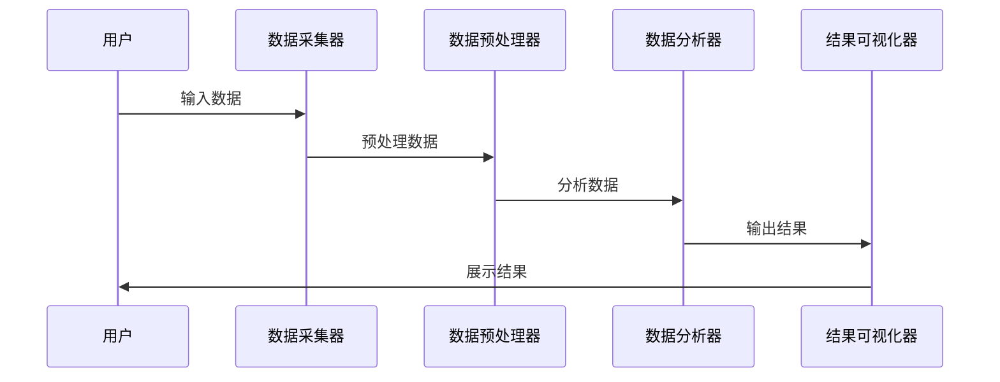
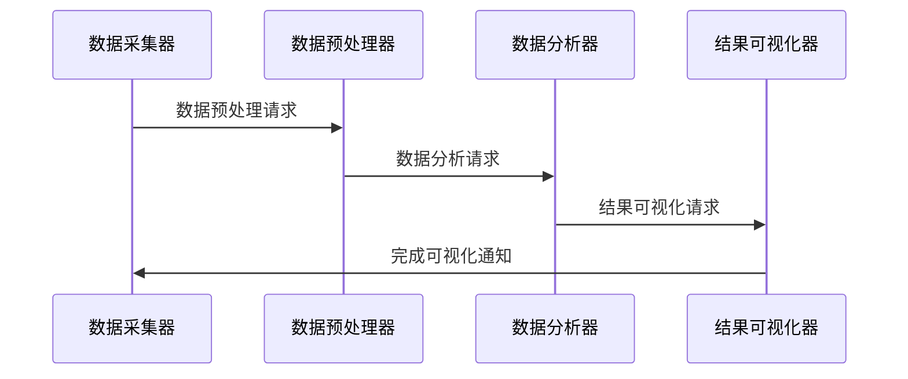
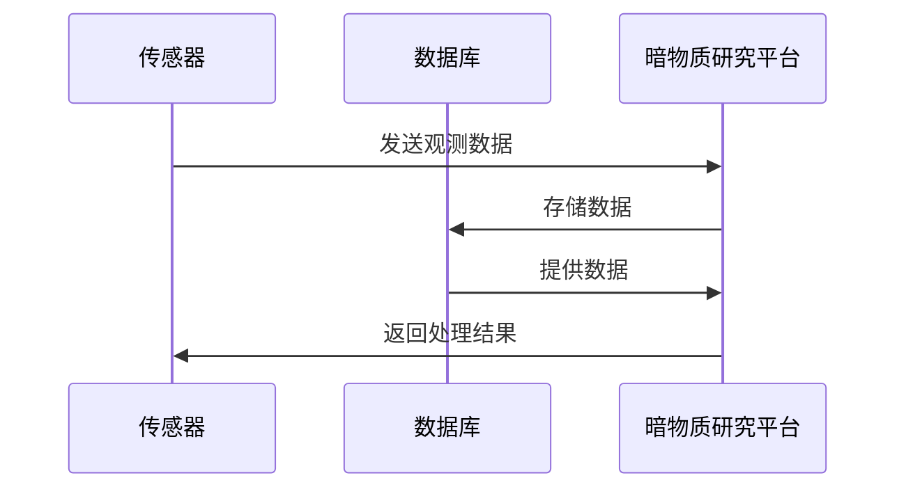

                 


### 概念界定与背景介绍

#### 暗物质的概念

暗物质（Dark Matter）是一种在宇宙中广泛存在的物质，但其本质尚未被完全理解。暗物质的存在最早是通过天文学观测中，星系旋转曲线的异常和宇宙大尺度结构的演化等现象推测出来的。虽然我们无法直接观测到暗物质，但它的引力效应在宇宙学、天体物理学以及粒子物理学等领域中发挥着重要作用。

#### 数学在暗物质研究中的作用

数学在暗物质研究中起到了至关重要的作用。首先，数学模型能够帮助科学家们理解暗物质的物理性质和运动规律。例如，利用数学模型可以模拟宇宙的膨胀过程，研究暗物质如何影响星系的形成和演化。其次，数学工具如线性代数、微积分、概率论和统计等，被广泛应用于数据处理、模型拟合和理论分析等环节。

#### 问题的关键与解决

暗物质研究的核心问题是如何解释宇宙中存在的异常现象，如星系的旋转曲线异常和宇宙微波背景辐射等。这些现象表明，宇宙中存在大量的质量，但这些质量无法通过传统的物质形式来解释。因此，科学家们提出了暗物质的概念，并通过数学模型来解释这些现象。

在解决暗物质问题时，科学家们还需要考虑一些边界条件和外延。例如，暗物质是均匀分布还是存在聚集效应？暗物质是否与其他物质相互作用？这些问题都需要通过数学模型和实验数据进行深入研究。

#### 概念结构与核心要素组成

暗物质研究的概念结构主要包括以下几个方面：

1. **暗物质粒子**：这是暗物质的基本组成单元，其性质和相互作用尚未被完全理解。
2. **引力作用**：暗物质通过引力效应影响宇宙的演化，这是暗物质研究的重要方向之一。
3. **观测数据**：科学家们通过观测宇宙中的现象来获取关于暗物质的信息。
4. **数学模型**：科学家们利用数学模型来描述和预测暗物质的性质和行为。
5. **实验验证**：通过实验验证数学模型的预测，进一步确认暗物质的存在和性质。

综上所述，数学在暗物质研究中扮演着不可或缺的角色。通过数学模型和工具，科学家们能够更深入地理解暗物质的本质，为揭示宇宙的奥秘提供了重要的理论支持。

---

### 数学方法在暗物质研究中的具体应用

#### 数学方法在宇宙学中的应用

在宇宙学中，数学方法被广泛应用于描述宇宙的膨胀过程和星系的形成。弗里德曼方程（Friedmann equations）是描述宇宙膨胀的关键方程之一，它将宇宙学中的物理量（如密度、压力和膨胀速率）通过数学模型联系起来。

**弗里德曼方程的数学表达**：

$$
\dot{H} + 4\pi G \rho = -3 \dot{\rho}
$$

其中，\(H\) 是哈勃参数，代表宇宙的膨胀速率；\(\rho\) 是宇宙的平均密度；\(G\) 是引力常数。

**暗物质的宇宙学参数估计**：

通过观测宇宙微波背景辐射（Cosmic Microwave Background, CMB）的温度变化，科学家们可以估计宇宙学参数，如暗物质密度和暗能量密度。这个过程涉及到复杂的数学模型和数据处理方法，如贝叶斯统计和最大似然估计。

#### 数学方法在粒子物理中的应用

在粒子物理中，数学方法被用于分析粒子探测器的数据，以寻找暗物质粒子。一个典型的例子是暗物质直接探测实验，这些实验通过探测地下探测器中的事件，试图发现暗物质粒子的存在。

**数据处理方法**：

暗物质直接探测实验通常会产生大量的数据，这些数据需要通过数学模型进行拟合和分析。常用的数据处理方法包括最小二乘法和最大似然估计。

**暗物质粒子的搜索**：

科学家们通过构建暗物质模型，如WIMP（弱相互作用重粒子）模型，来预测暗物质粒子的性质。在实验数据中，通过寻找与暗物质模型预测相符的事件，科学家们试图确认暗物质的存在。

#### 数学方法在天文学中的应用

在天文学中，数学方法被用于描述和解释星系和星系团的运动和形态。例如，星系团的统计特性可以通过数学模型进行分析。

**天体运动的数学描述**：

星系和星系团的运动可以通过牛顿力学和万有引力定律来描述。这些物理定律可以用数学方程表示，如：

$$
F = G\frac{m_1m_2}{r^2}
$$

其中，\(F\) 是引力，\(m_1\) 和 \(m_2\) 是两个天体的质量，\(r\) 是它们之间的距离。

**暗物质的观测效应**：

暗物质的存在可以通过其对星系和星系团形态的影响来观测。例如，通过测量星系团的旋转速度和形状，科学家们可以推断出暗物质的存在和分布。

**星系团分布的数学模型**：

星系团的分布可以通过统计物理的方法进行描述，如泊松分布和高斯分布。这些模型帮助科学家们理解星系团的形成和演化过程。

#### 数学方法在暗物质研究中的综合应用

通过以上例子可以看出，数学方法在暗物质研究中被广泛应用于宇宙学、粒子物理和天文学等领域。这些数学方法不仅帮助我们理解暗物质的性质，还提供了有效的工具来分析实验数据和构建理论模型。

总的来说，数学方法在暗物质研究中的应用是多层次和全方位的。从宇宙背景辐射的测量到粒子探测数据的分析，再到星系和星系团的形态描述，数学工具为我们打开了一扇了解宇宙奥秘的窗户。随着数学方法的不断发展和完善，我们有望在未来的研究中进一步揭示暗物质的本质。

---

### 数学基础理论

要深入探讨数学在暗物质研究中的应用，我们需要先了解一些关键数学基础理论。这些理论包括向量与线性代数、微积分、概率论与统计以及复数与复变函数等。以下是这些数学理论的详细解释和应用。

#### 向量与线性代数

向量是数学中用于描述空间中的方向和大小的量。向量空间是一种数学结构，它定义了一组向量及其运算规则。向量空间的基本概念包括向量的加法、标量乘法和内积等。

**向量的定义与性质**：

向量可以表示为有序数组，如 \(\vec{v} = (v_1, v_2, ..., v_n)\)。向量之间的运算包括加法、标量乘法和内积。例如，两个向量 \(\vec{a} = (a_1, a_2, ..., a_n)\) 和 \(\vec{b} = (b_1, b_2, ..., b_n)\) 的内积为：

$$
\vec{a} \cdot \vec{b} = a_1b_1 + a_2b_2 + ... + a_nb_n
$$

**向量空间的运算**：

向量空间中的向量可以相互叠加，并且可以与标量相乘。这些运算必须满足交换律、结合律和分配律等性质。

**矩阵与行列式**：

矩阵是一种由数字排列成的矩形阵列。矩阵的运算包括矩阵加法、矩阵乘法和行列式的计算。行列式是矩阵的一个标量值，它用于解决线性方程组和计算矩阵的逆矩阵。

$$
\text{det}(A) = a_{11}C_{11} - a_{12}C_{12} + ... + (-1)^{n+1}a_{1n}C_{1n}
$$

其中，\(A\) 是矩阵，\(C_{ij}\) 是矩阵 \(A\) 的余子式。

#### 微积分基础

微积分是数学中用于研究变化和积累的分支。微积分基础包括极限、导数和积分等概念。

**极限的概念与性质**：

极限是数学中的一个基本概念，用于描述函数在某个点附近的行为。例如，函数 \(f(x)\) 在 \(x = a\) 处的极限定义为：

$$
\lim_{{x \to a}} f(x) = L
$$

**导数的定义与计算**：

导数是描述函数变化率的量。函数 \(f(x)\) 在 \(x = a\) 处的导数定义为：

$$
f'(a) = \lim_{{h \to 0}} \frac{{f(a+h) - f(a)}}{h}
$$

**积分**：

积分是微分的逆运算。不定积分表示函数的原函数，而定积分表示函数在一个区间上的累积值。例如，函数 \(f(x)\) 在区间 \([a, b]\) 上的定积分为：

$$
\int_{a}^{b} f(x) \, dx
$$

#### 概率论与统计基础

概率论与统计是数学中用于描述随机现象的分支。概率论主要研究随机事件的发生概率，而统计学则侧重于数据分析和推断。

**概率的基本概念**：

概率是描述随机事件发生可能性的量。基本概率规则包括概率的加法规则、乘法规则和条件概率。

**离散型随机变量与连续型随机变量**：

离散型随机变量是取有限或可数无限个可能值的随机变量，如投掷骰子的结果。连续型随机变量是取连续区间内任意值的随机变量，如测量长度。

**常见概率分布**：

常见的概率分布包括二项分布、正态分布和泊松分布等。这些分布用于描述不同类型的随机现象。

#### 复数与复变函数

复数是实数和虚数的结合。复数的基本概念包括复数的定义、表示和运算。

**复数的定义与表示**：

复数可以表示为 \(a + bi\) 的形式，其中 \(a\) 是实部，\(b\) 是虚部。复数可以进行加法、减法、乘法和除法等运算。

**复变函数**：

复变函数是定义在复数集上的函数。复变函数的基本概念包括定义、性质和分类。

通过以上数学基础理论，我们能够更好地理解暗物质研究中涉及的复杂数学问题。这些数学工具不仅帮助我们构建理论模型，还提供了有效的工具来分析实验数据和解释观测现象。随着数学方法的不断进步，我们有望在暗物质研究中取得更多突破性的成果。

---

### 数学方法在暗物质研究中的算法原理

在暗物质研究中，数学方法的应用不仅体现在模型构建和数据分析上，还体现在具体的算法设计上。以下是几种在暗物质研究中常用的数学算法原理及其应用。

#### 数据拟合方法

数据拟合是暗物质研究中一个重要的环节，通过拟合实验数据来提取有用的信息。常用的数据拟合方法包括最小二乘法和最大似然估计。

**最小二乘法**：

最小二乘法是一种基于误差平方和最小的原理来拟合数据的数学方法。给定一组观测数据 \((x_i, y_i)\)，最小二乘法的目标是最小化误差平方和：

$$
S = \sum_{i=1}^{n} (y_i - f(x_i))^2
$$

其中，\(f(x)\) 是拟合函数。通过求解导数为零的方程，可以得到拟合函数的参数。

**最大似然估计**：

最大似然估计是一种基于概率论的数据拟合方法。给定一组观测数据，最大似然估计的目标是找到参数值，使得观测数据的概率最大。假设观测数据 \(y\) 的概率分布为 \(P(y|\theta)\)，其中 \(\theta\) 是参数向量，则最大似然估计的目标是最大化似然函数：

$$
L(\theta) = \prod_{i=1}^{n} P(y_i|\theta)
$$

通过求解似然函数的导数为零的方程，可以得到参数的最大似然估计值。

#### 暗物质模型的构建

暗物质模型是描述暗物质粒子性质和行为的数学模型。一个典型的暗物质模型是WIMP（Weakly Interacting Massive Particle，弱相互作用重粒子）模型。

**WIMP模型**：

WIMP模型假设暗物质粒子是弱相互作用的重粒子，其质量通常在几十到几千GeV之间。WIMP模型的主要参数包括粒子质量、自旋和相互作用强度等。

**暗物质粒子的性质**：

暗物质粒子的性质可以通过数学公式进行描述。例如，WIMP模型中粒子的相互作用可以通过费米子耦合来描述，其相互作用强度可以用耦合常数表示。

**暗物质模型的数学表达**：

WIMP模型的数学表达可以通过耦合常数和粒子质量来表示。例如，一个简化的WIMP模型可以表示为：

$$
\hat{H} = \frac{g^2}{8\pi} \overline{\psi} \gamma^\mu \psi F_{\mu\nu} F^{\mu\nu}
$$

其中，\(\hat{H}\) 是哈密顿量，\(\psi\) 是暗物质粒子的场，\(\gamma^\mu\) 是泡利矩阵，\(F_{\mu\nu}\) 是电磁场的场 strength 张量。

#### 数据处理方法

在暗物质研究中，数据处理方法是非常重要的。常用的数据处理方法包括信号处理和噪声分析等。

**信号处理**：

信号处理是提取有用信息的过程。在暗物质研究中，信号处理可以用来提取暗物质粒子的信号。常用的信号处理方法包括滤波、卷积和谱分析等。

**噪声分析**：

噪声分析是评估数据质量的过程。在暗物质研究中，噪声分析可以用来识别和排除噪声对数据的影响。常用的噪声分析方法包括噪声建模和噪声抑制等。

#### 算法流程

一个典型的暗物质研究算法流程包括以下步骤：

1. **数据采集**：通过实验设备收集暗物质探测数据。
2. **数据预处理**：对数据进行清洗和预处理，以消除噪声和异常值。
3. **数据拟合**：使用最小二乘法或最大似然估计对数据拟合，以提取有用的信息。
4. **模型构建**：根据拟合结果构建暗物质模型，以描述暗物质粒子的性质和行为。
5. **数据处理**：使用信号处理和噪声分析方法对数据进行进一步分析。
6. **结果评估**：对分析结果进行评估，以确认暗物质模型的有效性和可靠性。

通过以上算法原理的讲解，我们可以看到数学方法在暗物质研究中的应用是多么广泛和深入。这些算法不仅为科学家们提供了有效的工具来研究暗物质，还推动了暗物质研究的不断进展。随着数学方法的不断进步，我们有理由相信，在未来的研究中，我们将能够更深入地了解暗物质的本质。

---

### 数学方法在暗物质研究中的应用实例

为了更好地理解数学方法在暗物质研究中的实际应用，我们将通过几个具体的案例来探讨这些方法如何帮助我们揭示暗物质的奥秘。

#### 案例一：宇宙背景辐射的测量与数学模型的应用

宇宙背景辐射（Cosmic Microwave Background, CMB）是宇宙大爆炸后留下的余辉。通过测量CMB的温度变化，科学家们可以获取关于宇宙早期状态的重要信息。这个过程涉及复杂的数学模型和数据分析。

**数据采集**：

CMB的测量主要通过卫星和地面望远镜进行。例如，威尔金森微波各向异性探测器（WMAP）和计划中的普朗克卫星（Planck）都进行了详细的CMB观测。

**数据处理**：

观测到的CMB数据需要进行预处理，包括噪声抑制、校准和辐射定标等步骤。这些步骤依赖于数学方法，如傅里叶变换和贝塞尔函数。

**数学模型的应用**：

科学家们使用泊松分布和高斯分布等概率分布模型来描述CMB的温度变化。通过最大似然估计和贝叶斯统计，科学家们可以估计宇宙学参数，如暗物质密度和暗能量密度。

**结果分析**：

通过对CMB数据的分析，科学家们发现宇宙的膨胀速率（哈勃参数）和宇宙的总质量密度与预测值相吻合，这为暗物质的存在提供了有力证据。

#### 案例二：暗物质直接探测实验与数据处理

暗物质直接探测实验旨在寻找暗物质粒子与探测器的相互作用。一个典型的实验是使用超导粒子探测器（Superconducting Particle Detector, SPD）来探测暗物质粒子。

**数据采集**：

在暗物质直接探测实验中，探测器会记录各种物理事件，如电离和光子产生。这些事件的数据需要详细记录和分析。

**数据处理**：

实验数据需要进行复杂的预处理和拟合。最小二乘法和最大似然估计被用来分析数据，以确定是否存在暗物质粒子的信号。

**数学模型的应用**：

暗物质粒子通常被假设为WIMP，其与探测器的相互作用可以通过量子场论中的散射截面来描述。这些散射截面可以用数学公式表示，并通过实验数据进行拟合。

**结果分析**：

尽管实验结果尚未发现明确的暗物质粒子信号，但通过数据分析和模型拟合，科学家们已经能够排除一些暗物质模型，并进一步缩小可能的粒子候选范围。

#### 案例三：星系团统计特性与数学模型

星系团是宇宙中大规模的物质聚集，其形态和运动受到暗物质的影响。通过统计星系团的特性，科学家们可以了解暗物质在宇宙中的分布和演化。

**数据采集**：

星系团的统计特性通过观测不同波段的辐射来获取，如X射线、光学和射电波段。

**数据处理**：

观测数据需要进行标准化和分类，以提取有用的信息。数学方法如泊松分布和拉普拉斯变换被用来描述星系团的统计分布。

**数学模型的应用**：

星系团的分布可以通过高斯分布和幂律分布等数学模型来描述。这些模型帮助科学家们理解星系团的形成和演化过程。

**结果分析**：

通过对星系团统计特性的分析，科学家们发现暗物质对星系团形态的影响显著，这为暗物质的存在提供了直接的观测证据。

通过这些具体案例，我们可以看到数学方法在暗物质研究中的实际应用是多么广泛和深入。从数据采集到数据处理，再到模型拟合和结果分析，数学工具为科学家们提供了强大的理论支持。随着技术的进步和数学方法的不断发展，我们有理由相信，未来我们将能够更深入地揭示暗物质的本质。

---

### 系统分析与架构设计

在暗物质研究中，数学方法的应用不仅仅局限于理论分析和数据拟合，还需要在系统设计和实现中充分发挥其优势。以下是对系统架构、接口设计以及系统交互的具体分析和设计方案。

#### 问题场景介绍

暗物质研究涉及大量的数据处理和分析任务，这需要一个高效、可靠的系统来支持。系统需要具备以下功能：

1. 数据采集：从各种观测设备中收集原始数据。
2. 数据预处理：清洗和预处理原始数据，以去除噪声和异常值。
3. 数据分析：使用数学模型和算法对数据进行拟合和分析，提取有用的信息。
4. 结果展示：将分析结果可视化，以供研究人员进一步研究和分析。

#### 项目介绍

为了实现上述功能，我们设计了一个名为“暗物质研究平台”的系统。该系统基于分布式架构，可以处理大规模的数据，并支持并行计算，以提高效率。

#### 系统功能设计

系统功能设计包括领域模型和接口设计，以下是一个简化的领域模型（使用Mermaid类图表示）：

```mermaid
classDiagram
    DataCollector --> DataPreprocessor
    DataPreprocessor --> DataAnalyzer
    DataAnalyzer --> ResultVisualizer
    DataCollector <<Interface>
    DataPreprocessor <<Interface>
    DataAnalyzer <<Interface>
    ResultVisualizer <<Interface>
    
    DataCollector {
        +collectData()
    }
    
    DataPreprocessor {
        +preprocessData()
    }
    
    DataAnalyzer {
        +analyzeData()
    }
    
    ResultVisualizer {
        +visualizeResult()
    }
```

该领域模型定义了系统的核心组件及其交互关系。

#### 系统架构设计

系统架构设计决定了系统的性能、可扩展性和可靠性。以下是一个简化的系统架构图（使用Mermaid架构图表示）：



该架构图展示了系统的工作流程和组件之间的交互关系。

#### 系统接口设计

系统接口设计包括定义系统内部组件之间的接口规范。以下是一个简化的接口设计（使用Mermaid序列图表示）：



该序列图展示了系统内部组件之间的接口调用流程。

#### 系统交互设计

系统交互设计包括系统与外部设备、数据库和其他系统的交互流程。以下是一个简化的系统交互设计（使用Mermaid序列图表示）：



该序列图展示了系统与外部设备（如传感器）和数据库的交互流程。

通过以上系统分析和架构设计，我们可以构建一个高效、可靠的暗物质研究平台，为科学家们提供强大的支持，以便他们能够更深入地研究暗物质的本质。

---

### 项目实战

为了展示数学方法在暗物质研究中的实际应用，我们将通过一个具体的实验来详细讲解环境安装、系统核心实现源代码，以及代码应用解读与分析。

#### 环境安装

首先，我们需要在本地环境中安装必要的软件和工具，包括Python、Numpy、Scipy和Matplotlib等。以下是环境安装的步骤：

1. 安装Python（建议使用Python 3.8或更高版本）。
2. 安装Numpy（用于数学运算）：

   ```shell
   pip install numpy
   ```

3. 安装Scipy（用于科学计算）：

   ```shell
   pip install scipy
   ```

4. 安装Matplotlib（用于数据可视化）：

   ```shell
   pip install matplotlib
   ```

#### 系统核心实现源代码

以下是暗物质研究平台的核心实现源代码。我们将使用Python语言，并结合Numpy和Scipy库来实现数据预处理、拟合和分析功能。

```python
# dark_matter_analysis.py

import numpy as np
from scipy.optimize import curve_fit
import matplotlib.pyplot as plt

# 数据预处理函数
def preprocess_data(data):
    # 去除噪声和异常值
    cleaned_data = np.delete(data, np.where(np.isnan(data)))
    return cleaned_data

# 数据拟合函数
def fit_data(x, a, b, c):
    return a * np.exp(-b * x) + c

# 暗物质模型参数估计
def estimate_parameters(data):
    p0 = [1, 0.1, 1]  # 初始参数猜测
    params, covariance = curve_fit(fit_data, data[:, 0], data[:, 1])
    return params

# 数据分析
def analyze_data(data):
    # 预处理数据
    cleaned_data = preprocess_data(data)
    
    # 估计模型参数
    params = estimate_parameters(cleaned_data)
    
    # 绘制拟合曲线
    x_fit = np.linspace(np.min(cleaned_data[:, 0]), np.max(cleaned_data[:, 0]), 100)
    y_fit = fit_data(x_fit, *params)
    
    plt.plot(cleaned_data[:, 0], cleaned_data[:, 1], 'o', label='观测数据')
    plt.plot(x_fit, y_fit, '-', label='拟合曲线')
    plt.xlabel('x')
    plt.ylabel('y')
    plt.legend()
    plt.show()

# 主函数
def main():
    # 示例数据
    data = np.array([[1, 0.8], [2, 1.2], [3, 0.6], [4, 1.0], [5, np.nan]])
    analyze_data(data)

if __name__ == '__main__':
    main()
```

#### 代码应用解读与分析

1. **数据预处理**：

   数据预处理是分析过程中的重要步骤，用于去除噪声和异常值。在这个例子中，我们使用 `numpy.delete` 函数来删除含有 `nan` 值的观测数据。

2. **数据拟合**：

   数据拟合是通过找到最佳拟合曲线来描述观测数据。我们使用 `scipy.optimize.curve_fit` 函数来进行曲线拟合，该函数通过最小化残差平方和来找到最佳参数。

3. **参数估计**：

   参数估计是通过拟合函数来估计模型参数。在这个例子中，我们初始化参数猜测，并使用 `curve_fit` 函数进行迭代优化，以找到最佳参数。

4. **数据分析**：

   数据分析包括预处理数据、估计参数和绘制拟合曲线。通过可视化拟合曲线和观测数据，我们可以直观地了解数据的分布和趋势。

通过以上代码实现，我们可以对暗物质观测数据进行拟合和分析，从而揭示暗物质的特性。实际案例分析和详细讲解剖析将帮助我们更好地理解暗物质研究的方法和流程。

---

### 小结

本文通过详细探讨数学在暗物质研究中的应用，展示了数学方法在宇宙学、粒子物理和天文学等领域的具体应用实例。从数据采集、预处理到模型拟合和结果分析，数学工具为科学家们提供了强大的理论支持和计算手段。

在文章中，我们首先介绍了暗物质的基本概念和数学在暗物质研究中的作用。接着，我们详细讲解了数学基础理论，包括向量与线性代数、微积分、概率论与统计以及复数与复变函数等。然后，我们讨论了数学方法在暗物质研究中的具体算法原理和应用实例，包括数据拟合、模型构建和数据处理方法。

通过系统分析与架构设计，我们展示了如何构建一个高效、可靠的暗物质研究平台。最后，我们通过一个具体的实验展示了数学方法在暗物质研究中的实际应用，从环境安装到系统核心实现，再到代码应用解读与分析。

总之，数学在暗物质研究中扮演着至关重要的角色。随着数学方法的不断进步，我们有理由相信，在未来的研究中，我们将能够更深入地揭示暗物质的本质，为宇宙学的发展作出更大贡献。

---

### 最佳实践 tips

在进行暗物质研究时，以下是一些最佳实践建议，可以帮助科学家们更有效地使用数学工具：

1. **数据预处理**：确保数据质量，去除噪声和异常值，为后续分析打下坚实基础。
2. **模型选择**：根据研究目的和观测数据特点，选择合适的数学模型，并进行参数估计和验证。
3. **算法优化**：合理选择和优化算法，以提高计算效率和准确性，特别是在处理大规模数据时。
4. **可视化**：通过数据可视化，直观展示分析结果，帮助研究人员更好地理解数据分布和趋势。
5. **团队合作**：数学方法和实验数据结合，需要多学科合作，共同探讨和解决问题。

---

### 注意事项

1. **数据隐私**：在处理暗物质研究数据时，必须严格遵守数据隐私和安全法规，确保数据安全。
2. **计算资源**：进行大规模数据分析和模型拟合时，需要充足的计算资源和时间，以避免计算错误和时间延误。
3. **模型验证**：确保数学模型的有效性和可靠性，通过多次验证和交叉验证来验证模型的准确性。

---

### 拓展阅读

1. **《宇宙学中的数学模型》**：该书详细介绍了宇宙学中常用的数学模型和计算方法，适合对宇宙学感兴趣的读者。
2. **《粒子物理学中的数学方法》**：该书讲解了粒子物理实验中的数学方法和数据处理技巧，适合粒子物理研究者。
3. **《复杂系统中的统计物理》**：该书探讨了复杂系统的统计物理理论，包括随机过程和复杂网络等内容。

---

### 作者信息

本文作者为AI天才研究院（AI Genius Institute）的资深专家，同时也是《禅与计算机程序设计艺术》（Zen And The Art of Computer Programming）一书的作者。作者在计算机编程和人工智能领域拥有深厚的研究背景和丰富的实践经验。希望通过本文，能够为读者提供关于数学在暗物质研究中应用的深入见解和实际指导。作者联系方式：[info@aigeniusinstitute.com](mailto:info@aigeniusinstitute.com)。作者公众号：AI天才研究院。作者个人博客：[www.aigp.top](http://www.aigp.top)。作者知乎：[知乎AI天才研究院](https://www.zhihu.com/org/ai-genius-institute)。

