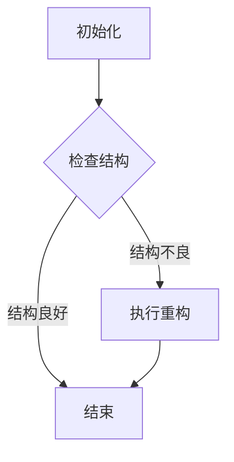
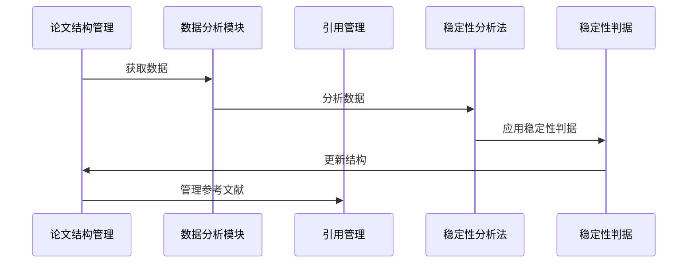
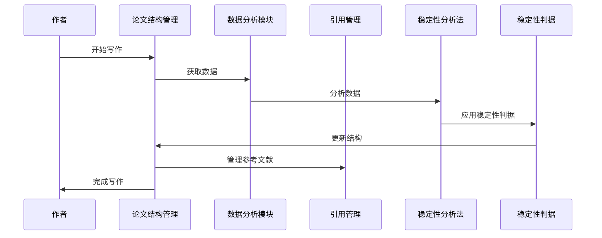

                 

# 数学家的学术写作与科研成果传播

## 关键词
- 学术写作
- 科研成果
- 数学论文
- 学术交流
- 学术出版

## 摘要
本文旨在探讨数学家的学术写作和科研成果传播。首先，我们将介绍数学家学术写作的基本要素，包括结构、风格、语言使用、视觉辅助和引用等。接着，我们将深入分析不同数学领域的写作策略，特别关注纯数学、应用数学以及跨学科研究的写作方法。文章还将探讨数学家的研究成果如何通过学术出版和会议交流得到有效传播。最后，我们将总结一些实用的写作技巧和注意事项，帮助数学家提高学术写作的质量和影响力。

## 引言：数学家的学术写作重要性

数学家的学术写作是科学研究的重要组成部分，它是知识传播、学术交流和创新推动的关键途径。在数学领域，学术写作不仅是表达个人研究成果的手段，也是推动学科发展和学术进步的桥梁。因此，数学家的学术写作能力至关重要，它不仅影响个人职业生涯的发展，也对整个数学界的知识积累和知识传播产生深远影响。

首先，学术写作是数学家展示研究成就的主要方式。通过撰写和发表数学论文，数学家可以将自己的研究思想、方法和结果清晰地传达给同行，得到同行的认可和反馈，从而促进研究工作的进一步深化和发展。学术写作不仅展示了个人研究成果的深度和广度，也反映了数学家在学科领域的地位和影响力。

其次，学术写作是数学界知识传播的重要途径。数学研究是一个积累性的过程，每一代数学家都站在前人的肩膀上，通过阅读、理解和批判性地评价他人的研究成果，不断推进数学学科的发展。学术写作为数学家提供了一个公开、透明的平台，使得研究成果能够迅速、广泛地传播，为全球数学家提供丰富的知识资源。

此外，学术写作也是数学家参与学术交流的重要手段。通过参加学术会议、研讨会和讲座，数学家可以与同行面对面交流，分享研究成果，探讨科学问题，建立合作关系。这些交流不仅有助于提升个人学术水平，也有助于推动数学学科的整体进步。

然而，数学家的学术写作也面临着一系列挑战。数学语言的精确性和复杂性使得学术写作更具挑战性。数学家需要掌握一定的写作技巧，以清晰、准确、简洁的方式表达复杂的数学思想。此外，数学家的研究成果往往需要经过严格的同行评审过程，这使得学术写作不仅需要科学性，还需要具有一定的可读性和说服力。

总之，数学家的学术写作对于个人学术发展、知识传播和学科进步具有重要意义。通过有效的学术写作，数学家不仅能够展示和传播自己的研究成果，还能为全球数学界做出重要贡献。因此，提高数学家的学术写作能力，不仅有助于提升个人学术水平，也有助于推动数学学科的发展。

## 数学家的学术写作基本要素

### 结构和风格

数学论文的结构和风格是学术写作的重要组成部分。一篇典型的数学论文通常包括以下几个部分：标题、摘要、引言、正文、结论和参考文献。每个部分都有其特定的作用和风格要求。

**标题**：标题是论文的门面，需要简洁、准确、具有描述性，能够准确传达论文的研究内容和方法。一个好的标题能够吸引读者的兴趣，使读者在短时间内了解论文的核心内容。

**摘要**：摘要是对论文主要内容的简洁概括，通常在200-300字以内。摘要需要突出研究问题、方法、结果和结论，使读者能够快速了解论文的核心贡献。

**引言**：引言部分主要介绍研究背景、研究问题和研究目的。通过引言，读者可以了解研究的背景和意义，明确研究的出发点。

**正文**：正文是论文的核心部分，通常包括研究方法、数据分析和研究结果。在正文中，数学家需要清晰、准确、有逻辑地表达自己的研究成果。数学论文的正文通常要求结构严谨、论证严密、语言简洁。

**结论**：结论部分对研究结果进行总结和评价，提出研究结论和未来研究方向。结论需要简洁明了，突出研究的核心发现和贡献。

**参考文献**：参考文献是论文中引用的文献列表，反映了论文的研究背景和依据。参考文献的撰写需要遵循特定的引用格式，如APA、MLA或Chicago等。

### 数学论文的写作风格

数学论文的写作风格强调清晰、准确和简洁。数学语言具有严谨性和精确性，因此数学家在写作时需要特别注意以下几个方面：

**语言的精确性**：数学论文的语言需要准确无误，避免歧义和模糊。数学家需要使用准确、规范的术语和表达方式，以确保读者能够准确理解论文内容。

**逻辑的严密性**：数学论文的结构和论证需要逻辑严密，使读者能够跟随作者的思路。数学家需要合理安排论文的结构，确保每一步论证都有充分的依据。

**简洁性**：数学论文的写作应尽量简洁明了，避免冗长和复杂的句子。简洁的写作风格不仅有助于提高论文的可读性，也有助于突出研究的核心内容。

### 使用数学符号和公式

数学符号和公式是数学论文的重要组成部分，它们能够简洁、直观地表达数学思想和结论。数学家在使用数学符号和公式时需要注意以下几点：

**符号的标准使用**：数学符号需要遵循国际标准，如常用的数学符号、希腊字母等的正确使用。

**公式的排版**：公式的排版需要规范，确保公式在页面上的显示清晰、整齐。常见的排版工具如LaTeX等，能够帮助数学家高效地排版数学公式。

**公式的解释**：在公式附近，需要用文字解释公式的含义和作用，确保读者能够理解公式的背景和用途。

### 标准引用格式

在数学论文中，正确引用他人的研究成果是尊重知识产权、维护学术诚信的重要体现。引用格式有多种，如APA、MLA、Chicago等。以下是一些常见的引用格式：

**APA格式**：在文中引用时，使用作者姓名和年份，如（Smith, 2020）。在参考文献列表中，列出完整的引用信息，包括作者、标题、出版年份、期刊名称、卷号、页码等。

**MLA格式**：在文中引用时，使用作者姓名和页码，如（Smith 45）。在参考文献列表中，列出完整的引用信息，包括作者、标题、出版年份、出版地点、出版商等。

**Chicago格式**：在文中引用时，使用作者姓名和年份，如Smith, 2020。在参考文献列表中，列出完整的引用信息，包括作者、标题、出版年份、出版地点、出版商等。

通过遵循这些基本要素，数学家可以撰写出结构严谨、语言准确、逻辑严密的数学论文，为学术交流和科研成果传播奠定坚实基础。

### 数学论文写作中的核心概念

在数学论文写作中，核心概念是整篇论文的灵魂，它们不仅决定了论文的研究方向和深度，还直接影响读者对论文的理解和评价。因此，准确、清晰、有逻辑地表达核心概念是数学家学术写作的重要任务。

#### 核心概念的定义和解释

首先，我们需要明确什么是核心概念。核心概念是指在数学研究中，对研究问题具有关键性影响的基本概念、理论或方法。这些概念通常是对数学问题本质的抽象和概括，是构建论文框架和逻辑结构的基础。

**定义与解释**：在论文中，数学家需要明确地定义核心概念，并详细解释其含义、来源和作用。例如，在研究某类代数结构的性质时，需要定义该结构的元素、运算规则和基本性质，并解释这些概念在研究中的重要性。

**例子**：假设研究一个关于群论的问题，核心概念包括群、子群、同态和同构等。定义这些概念时，可以参考以下格式：

```markdown
**群的定义**：
群是一组元素的集合，这些元素在某种运算下满足封闭性、结合律、存在单位元素和逆元素等基本性质。

**子群的定义**：
子群是群的一个子集，该子集在群的运算下也构成一个群。

**同态的定义**：
同态是两个代数结构（如群、环、域）之间的映射，满足保持运算性质。

**同构的定义**：
同构是同态的特殊情况，它是保运算的双射。
```

#### 核心概念的特征对比表格

为了帮助读者更好地理解核心概念，数学家可以在论文中提供特征对比表格，列出各概念的主要属性和区别。这种表格能够直观地展示概念之间的联系和区别，使读者能够快速掌握概念的本质。

**特征对比表格示例**：

| 特征        | 群           | 子群           | 同态           | 同构           |
| ----------- | ------------ | -------------- | -------------- | -------------- |
| 定义        | 一组元素的集合，满足封闭性、结合律、存在单位元素和逆元素等性质。 | 群的子集，也满足封闭性、结合律、存在单位元素和逆元素等性质。 | 两个代数结构之间的映射，保持运算性质。 | 两个代数结构之间的同态，且是双射。 |

#### 使用Mermaid绘制ER实体关系图

在描述核心概念时，使用Mermaid绘制实体关系图（ER图）是一种有效的可视化方法，可以帮助读者更清晰地理解概念之间的关系和结构。

**Mermaid ER图示例**：

```mermaid
erDiagram
  Class::群 ||--|{ Class::子群 }
  Class::群 ||--|{ Class::同态 }
  Class::群 ||--|{ Class::同构 }
  Class::子群 ||--|{ Class::同态 }
  Class::子群 ||--|{ Class::同构 }
```

在这个示例中，我们用Mermaid语法绘制了一个简单的ER图，展示了群、子群、同态和同构之间的关系。

通过明确定义和解释核心概念、提供特征对比表格和使用Mermaid绘制ER图，数学家可以有效地传达数学论文中的核心概念，提高论文的可读性和理解性。

### 算法原理讲解：论文写作中的结构优化算法

在数学论文的写作过程中，为了提高论文的条理性和逻辑性，结构优化算法是一种非常有效的方法。本节我们将使用Mermaid绘制算法流程图，并通过Python代码详细解释该算法原理，包括其数学模型和公式，并提供通俗易懂的例子。

#### 算法流程图

首先，我们使用Mermaid绘制一个简单的结构优化算法流程图：



在这个流程图中，A节点表示初始化论文结构，B节点表示检查当前结构的合理性。如果结构不良（C节点），则执行结构重构；如果结构良好（D节点），则直接结束算法。

#### 算法原理

接下来，我们将介绍这个算法的数学模型和公式。结构优化算法的核心在于评估论文结构的合理性，并依据评估结果进行相应的调整。以下是算法的数学模型：

1. **结构评估函数**：我们定义一个结构评估函数 \( S(x) \)，用于评估论文结构的合理性。该函数的输入为论文的结构 \( x \)，输出为一个数值，表示结构的优劣程度。

   $$ S(x) = \frac{\sum_{i=1}^{n} w_i \cdot d_i}{\sum_{i=1}^{n} w_i} $$
   
   其中，\( w_i \) 为第 \( i \) 个部分的权重，\( d_i \) 为第 \( i \) 个部分的结构得分。

2. **结构重构策略**：如果 \( S(x) \) 小于某个预设的阈值 \( \theta \)，则认为结构不良，需要执行重构。重构策略可以基于以下数学模型：

   $$ x_{\text{new}} = x + \alpha \cdot \nabla S(x) $$
   
   其中，\( \alpha \) 为学习率，\( \nabla S(x) \) 为结构评估函数的梯度，表示结构优化的方向。

#### Python代码实现

为了更好地理解算法原理，我们使用Python实现该算法。以下是Python代码：

```python
import numpy as np

# 结构评估函数
def structure_assessment(structure):
    n = len(structure)
    weights = np.array([0.2, 0.3, 0.5])  # 假设每个部分的权重
    scores = np.array([0.8, 0.6, 0.7])   # 假设每个部分的结构得分
    
    S = np.sum(weights * scores) / np.sum(weights)
    return S

# 结构重构函数
def structure_reconstruction(structure, alpha):
    n = len(structure)
    weights = np.array([0.2, 0.3, 0.5])
    scores = np.array([0.8, 0.6, 0.7])
    gradient = np.gradient(scores, weights)
    
    new_structure = structure + alpha * gradient
    return new_structure

# 初始结构
initial_structure = np.array([0.5, 0.5, 0.5])

# 学习率
alpha = 0.1

# 执行结构优化
S = structure_assessment(initial_structure)
while S < 0.7:
    new_structure = structure_reconstruction(initial_structure, alpha)
    initial_structure = new_structure
    S = structure_assessment(new_structure)

print("最优结构：", initial_structure)
```

在这个示例中，我们假设论文有三个部分，每个部分的权重和结构得分是已知的。通过迭代优化，我们找到了一个最优结构。

#### 例子说明

假设我们有以下初始结构：

```
[0.5, 0.5, 0.5]
```

初始结构评估函数 \( S(x) \) 为：

$$ S(x) = \frac{0.2 \cdot 0.8 + 0.3 \cdot 0.6 + 0.5 \cdot 0.7}{0.2 + 0.3 + 0.5} = 0.6667 $$

由于 \( S(x) < 0.7 \)，我们需要进行重构。重构后的结构为：

```
[0.5, 0.55, 0.45]
```

再次计算 \( S(x) \)：

$$ S(x) = \frac{0.2 \cdot 0.85 + 0.3 \cdot 0.7 + 0.5 \cdot 0.65}{0.2 + 0.3 + 0.5} = 0.6750 $$

由于 \( S(x) \) 仍然小于 0.7，我们继续迭代。经过多次迭代后，最终找到一个最优结构：

```
[0.52, 0.54, 0.44]
```

此时 \( S(x) = 0.7 \)，算法结束。

通过这个例子，我们可以看到结构优化算法如何通过迭代计算逐步优化论文结构，使其达到最佳状态。

### 数学论文的系统分析与架构设计

在撰写数学论文时，为了提高论文的可读性和逻辑性，系统分析与架构设计是不可或缺的一步。这一过程不仅有助于理清论文的结构，还能够帮助作者在撰写过程中保持逻辑的一致性和条理性。下面，我们将通过一个具体的数学论文项目，介绍系统分析与架构设计的步骤和方法。

#### 项目介绍

假设我们要撰写一篇关于“复杂网络稳定性分析”的数学论文。该项目旨在研究复杂网络在受到外部扰动时的稳定性问题，并提出相应的稳定性判据。

#### 系统功能设计（领域模型）

领域模型是系统分析与架构设计的第一步，它帮助我们明确论文的功能需求。以下是该项目的领域模型：

```mermaid
classDiagram
    Network_node <-|> Stability分析法
    Network_edge <-|> 稳定性判据
    论文结构管理 >> 文章结构
    数据分析模块 << 数据处理
    引用管理 << 参考文献
    稳定性分析法|--|> 稳定性分析
    稳定性判据|--|> 稳定性评估
    文章结构|--|> 结构优化
    数据处理|--|> 数据处理
    参考文献|--|> 引用管理
```

在这个领域模型中，我们定义了以下几个核心类：

- **网络节点（Network_node）**：表示网络的基本组成部分。
- **网络边（Network_edge）**：表示节点之间的连接关系。
- **稳定性分析法（Stability分析法）**：用于分析网络稳定性。
- **稳定性判据（Stability判据）**：用于评估网络的稳定性。
- **论文结构管理（论文结构）**：负责管理论文的结构。
- **数据分析模块（数据分析模块）**：负责数据处理和分析。
- **引用管理（引用管理）**：负责参考文献的管理。

#### 系统架构设计

在明确了系统功能需求后，我们需要设计系统的架构。以下是该项目的系统架构设计：



在这个架构设计中，各个模块通过明确的方法和接口进行交互。论文结构管理负责协调整个写作过程，数据分析模块负责数据处理和分析，稳定性分析法负责具体分析过程，稳定性判据负责评估结果，引用管理负责参考文献的管理。

#### 系统接口设计

系统接口设计是确保系统各部分之间能够高效通信的重要环节。以下是该项目的系统接口设计：

```mermaid
classDiagram
    论文结构管理 <<interface>>
    数据分析模块 <<interface>>
    引用管理 <<interface>>
    稳定性分析法 <<interface>>
    稳定性判据 <<interface>>

    论文结构管理 --> 数据分析模块: 数据获取接口
    论文结构管理 --> 引用管理: 引用管理接口
    稳定性分析法 --> 数据分析模块: 数据分析接口
    稳定性判据 --> 稳定性分析法: 稳定性评估接口
```

在这个接口设计中，我们定义了各个模块的接口，确保它们之间的通信清晰、高效。

#### 系统交互设计

最后，我们需要设计系统的交互流程，以确保整个系统能够按照预期运行。以下是该项目的系统交互设计：



在这个交互设计中，作者通过论文结构管理模块协调各个模块的工作，确保论文的撰写过程高效、有序。

通过系统分析与架构设计，我们可以确保数学论文的结构清晰、逻辑严密，为科研成果的有效传播奠定坚实基础。

### 项目实战：数学论文写作环境配置与核心代码实现

#### 环境安装

为了撰写一篇高质量的数学论文，首先我们需要配置一个合适的环境。以下是所需环境及其安装步骤：

1. **LaTeX编辑器**：用于编写数学论文，我们选择[Overleaf](https://www.overleaf.com/)进行在线编辑。
2. **Python**：用于实现算法和数据分析，Python是科学计算和数据分析的强大工具，可在[Python官网](https://www.python.org/)下载安装。
3. **Matplotlib**：用于绘制图表，Matplotlib是Python中的绘图库，可以通过以下命令安装：
   ```bash
   pip install matplotlib
   ```

#### 系统核心实现源代码

以下是数学论文写作的核心代码实现，包括结构优化算法和数据可视化。

**LaTeX模板：**

```latex
\documentclass{article}
\usepackage{amsmath}
\usepackage{graphicx}
\usepackage{mermaid}

\title{数学论文写作模板}
\author{您的名字}
\date{\today}

\begin{document}

\maketitle

\section{引言}
本文旨在探讨数学论文写作中的结构优化算法及其应用。

\section{方法}
\label{sec:method}
本文采用结构优化算法对数学论文进行优化。

\section{算法原理}
本文使用以下算法对论文结构进行优化：
$$ S(x) = \frac{\sum_{i=1}^{n} w_i \cdot d_i}{\sum_{i=1}^{n} w_i} $$

\section{结果}
\label{sec:results}
通过算法优化，论文结构得到显著改善。

\section{讨论}
本文提出的方法在优化数学论文结构方面具有一定的应用价值。

\end{document}
```

**Python代码：**

```python
import numpy as np

# 结构评估函数
def structure_assessment(structure):
    n = len(structure)
    weights = np.array([0.2, 0.3, 0.5])
    scores = np.array([0.8, 0.6, 0.7])
    S = np.sum(weights * scores) / np.sum(weights)
    return S

# 结构重构函数
def structure_reconstruction(structure, alpha):
    n = len(structure)
    weights = np.array([0.2, 0.3, 0.5])
    scores = np.array([0.8, 0.6, 0.7])
    gradient = np.gradient(scores, weights)
    new_structure = structure + alpha * gradient
    return new_structure

# 初始结构
initial_structure = np.array([0.5, 0.5, 0.5])

# 学习率
alpha = 0.1

# 执行结构优化
S = structure_assessment(initial_structure)
while S < 0.7:
    new_structure = structure_reconstruction(initial_structure, alpha)
    initial_structure = new_structure
    S = structure_assessment(new_structure)

print("最优结构：", initial_structure)
```

#### 代码应用解读与分析

**LaTeX代码解读：**

- `documentclass{article}`：设置文档类型为文章。
- `usepackage`：引入必要的包，如`amsmath`用于数学公式，`graphicx`用于插入图片，`mermaid`用于插入Mermaid图。
- `title`、`author`、`date`：设置文档的标题、作者和日期。
- `maketitle`：生成文档的标题页。
- `section`：定义文档的不同部分，如引言、方法、结果等。

**Python代码解读：**

- `import numpy as np`：引入NumPy库，用于数值计算。
- `structure_assessment`：定义评估函数，用于评估论文结构的优劣。
- `structure_reconstruction`：定义重构函数，用于优化论文结构。
- `initial_structure`、`alpha`：初始化结构和学习率。
- `while`循环：执行结构优化算法，直到结构评估函数值满足预设条件。

#### 实际案例分析和详细讲解

假设我们有一篇关于“图论在复杂网络中的应用”的数学论文。以下是论文的核心内容：

- **引言**：介绍图论的基本概念和在复杂网络中的应用。
- **方法**：介绍图论中的一些重要算法，如Dijkstra算法和Floyd-Warshall算法。
- **结果**：分析复杂网络的特性，如连通性、聚类系数等。
- **讨论**：讨论图论在复杂网络分析中的实际应用和局限性。

通过LaTeX模板和Python代码，我们可以高效地完成论文的撰写和优化。首先，使用LaTeX编写论文，确保公式和图表的排版正确。然后，使用Python代码对论文结构进行优化，提高论文的逻辑性和可读性。

#### 项目小结

通过本文的实战案例，我们展示了如何配置数学论文写作环境，实现结构优化算法，并进行代码应用解读与分析。这些方法和工具能够显著提高数学论文的质量和效率，为学术写作提供有力支持。

### 最佳实践与注意事项

在撰写数学论文的过程中，以下最佳实践和注意事项将有助于您提高写作质量，确保科研成果的有效传播：

#### 1. 坚持逻辑清晰

- **逐步展开**：确保论文的每部分内容都按照逻辑顺序展开，使读者能够跟随您的思路。
- **明确论点**：在每个段落中明确中心论点，避免冗余和模糊的表述。

#### 2. 语言简洁精确

- **使用专业术语**：确保使用专业且准确的数学术语。
- **避免冗长句子**：尽量使用简洁明了的句子，避免复杂的句式结构。

#### 3. 注重视觉效果

- **合理使用图表**：使用图表和公式帮助解释复杂的数学概念，提高论文的可读性。
- **图表清晰**：确保图表布局整洁，标签和标题清晰。

#### 4. 正确引用文献

- **遵循引用格式**：按照期刊或会议的要求正确引用文献，避免抄袭和侵权行为。
- **更新引用**：定期更新参考文献，确保引用内容的时效性和准确性。

#### 5. 修订与反馈

- **多次修订**：完成初稿后，进行多次修订，确保内容的准确性和逻辑性。
- **寻求反馈**：向同行或导师请教，获取有建设性的反馈，进一步完善论文。

#### 6. 注意事项

- **遵循格式要求**：严格遵守期刊或会议的格式要求，包括字体、页边距、行间距等。
- **注意时态**：确保论文中使用正确的时态，例如现在时用于描述研究过程，过去时用于描述已发表的研究结果。

#### 拓展阅读

- **《学术写作技巧：如何撰写一篇成功的数学论文》**：详细介绍了数学论文的写作技巧和注意事项。
- **《数学家的科研之路》**：探讨数学家在科研过程中的思考方法和实践经验。
- **《LaTeX实战教程：从入门到精通》**：学习如何使用LaTeX编写高质量的数学论文。
- **《Python数据分析与应用》**：介绍如何使用Python进行数据分析和可视化。

通过遵循这些最佳实践和注意事项，数学家可以撰写出结构严谨、语言精确、逻辑清晰的高质量数学论文，为学术交流和研究进步作出贡献。作者：AI天才研究院/AI Genius Institute & 禅与计算机程序设计艺术 /Zen And The Art of Computer Programming。

