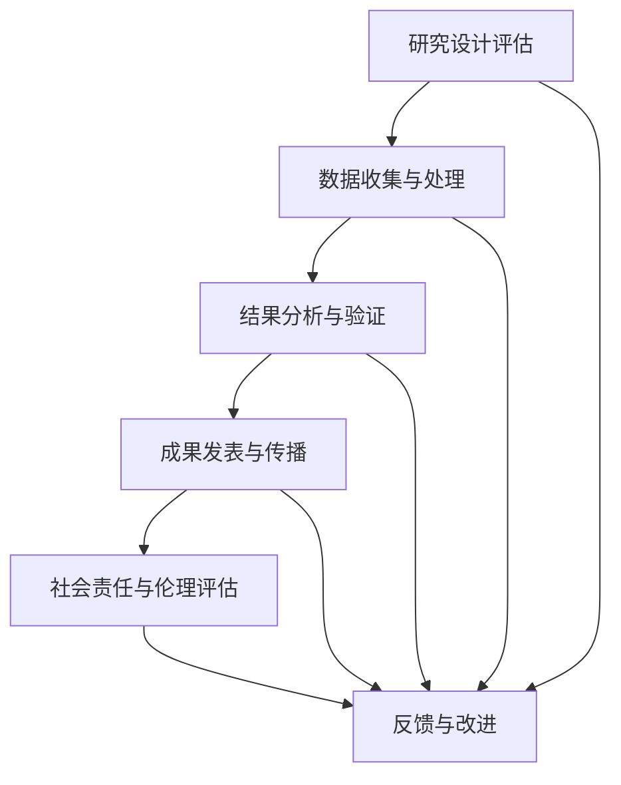
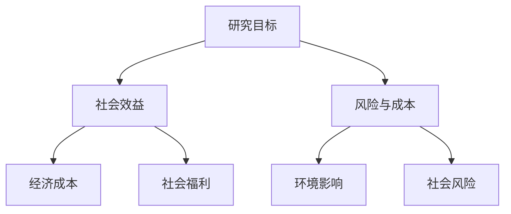
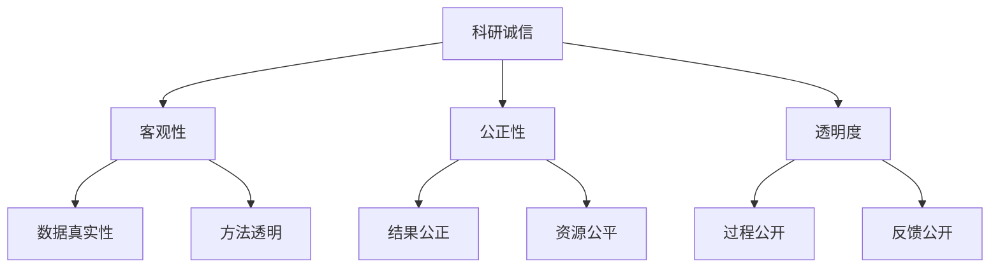
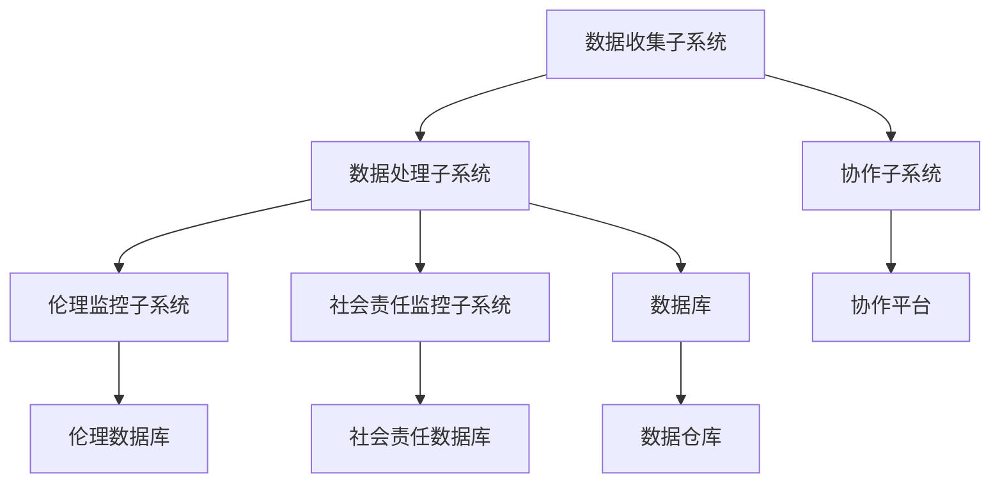
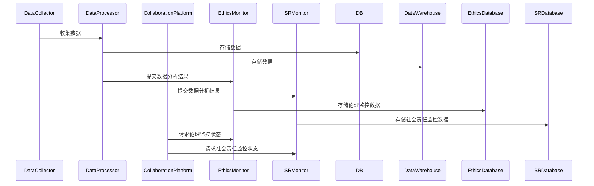

                 


### 引言

在当今技术飞速发展的时代，数学家作为科学探索的重要推动者，他们的工作不仅对理论研究有着深远的影响，同时也对社会进步和科学进步起到了关键作用。本文旨在探讨数学家的社会责任与科学伦理，通过对核心概念的定义、案例分析和算法原理的讲解，来揭示数学家在履行社会责任和遵守科学伦理方面的重要性和实际操作方法。

首先，我们需要明确数学家的社会责任与科学伦理的定义。社会责任是指数学家在从事研究的同时，如何考虑其研究成果对社会的影响，并尽力促进社会的整体利益。科学伦理则是指在科学研究和学术交流中，数学家应遵循的一系列原则和规范，以保证研究的真实性、公正性和可靠性。

本文将分为以下几个部分：首先，我们将介绍数学家的社会责任与科学伦理的背景和重要性，并明确本文的研究边界和核心概念。接着，我们将探讨数学家的社会责任，包括其定义、重要性以及具体的案例分析。随后，我们将深入探讨科学伦理，阐述其在数学领域的体现和基本原则。在第三部分，我们将使用 mermaid 工具绘制算法流程图，并通过 Python 源代码来详细阐述算法原理。接下来，我们将通过 LaTeX 公式详细讲解数学模型，并通过实例进行说明。在第五部分，我们将分析数学家在社会和科学中的具体问题，并设计系统架构和接口。最后，我们将通过一个实际项目来展示数学家社会责任与科学伦理的应用，并提供项目小结和最佳实践建议。

### 第一部分：背景介绍

#### 问题背景

数学家作为科学领域的领军人物，他们的研究不仅仅局限于理论探索，更与社会进步和科技发展紧密相连。在现代社会中，数学家的工作影响着从经济、医疗到工程、环境等多个方面。例如，数学模型在金融市场的风险管理中发挥着重要作用，而在医学领域，统计学和概率论则为疾病的预测和治疗提供了有力支持。因此，数学家的研究成果对社会有着深远的影响。

#### 问题描述

然而，随着数学家影响力的增加，他们所承担的社会责任也日益凸显。数学家需要确保其研究成果对社会是有益的，而不是造成负面影响。此外，科学伦理在数学家的研究过程中同样至关重要。数学家必须遵守科研诚信的原则，确保其研究的真实性和可靠性。那么，数学家如何在实际研究中履行社会责任和遵守科学伦理呢？

#### 问题解决

为了探讨这一问题，我们将通过案例分析、历史回顾和理论探讨来分析数学家的社会责任与科学伦理。本文将首先介绍数学家的社会责任，讨论其在研究中的重要性，并给出具体的案例分析。接着，我们将深入探讨科学伦理，包括其基本原则和在数学领域的体现。通过这些讨论，我们将尝试找到数学家在实际研究中履行社会责任和遵守科学伦理的方法。

#### 边界与外延

本文的讨论将主要集中于数学家在研究过程中的社会责任和科学伦理，而不会涉及其他科学领域。同时，本文也将探讨这些概念的适用范围，明确其在数学领域的特定应用。

#### 概念结构与核心要素组成

在本文中，我们将明确数学家的社会责任和科学伦理的核心概念，并分析其相互关系。社会责任包括对研究成果社会影响的责任感，而科学伦理则涵盖科研诚信、公正性和透明度等方面。通过这些核心概念的分析，我们将构建一个全面的理解框架，帮助读者更好地理解数学家的社会责任与科学伦理。

### 第二部分：核心概念与联系

在明确了背景和问题后，我们将深入探讨数学家的社会责任与科学伦理这两个核心概念，并分析它们之间的联系。

#### 数学家的社会责任

**定义：** 数学家的社会责任是指数学家在研究过程中，考虑其研究成果对社会的影响，并尽力促进社会的整体利益。这包括但不限于在研究设计、数据收集、结果分析和成果发表等各个环节。

**重要性：** 数学家的社会责任至关重要，因为数学作为一门基础科学，其研究成果对社会有着广泛而深远的影响。数学模型在金融、医疗、工程等多个领域都有应用，而这些应用的成功与否直接关系到社会的利益。

**案例分析：** 以数学模型在金融市场的应用为例，数学家在构建和优化金融模型时，需要考虑模型对社会经济稳定的影响。一个不当的模型可能导致金融市场动荡，甚至引发金融危机。因此，数学家在研究中必须承担起社会责任，确保其研究成果对社会有益。

#### 科学伦理

**定义：** 科学伦理是科学研究过程中应遵循的一系列规范和原则，旨在保证科研的真实性、公正性和可靠性。科学伦理涵盖了从研究设计、数据收集、结果分析到成果发表的各个环节。

**基本原则：** 科学伦理的基本原则包括诚信、客观性、公正性、透明度和负责任。诚信要求数学家必须确保研究的真实性，客观性要求数学家在研究中保持客观，公正性要求数学家在评价他人研究成果时保持公正，透明度要求数学家在研究过程中保持透明，负责任要求数学家对其研究成果负责。

**数学领域的体现：** 在数学领域，科学伦理的体现主要包括以下几个方面：

1. **学术诚信：** 数学家必须遵守学术诚信的原则，确保其研究成果的真实性和可靠性。
2. **数据管理：** 数学家在数据收集和处理过程中，必须确保数据的真实性和完整性。
3. **合作与共享：** 数学家在研究过程中，应积极与他人合作，并共享研究成果，以促进科学进步。
4. **公众责任：** 数学家应考虑其研究成果对公众的影响，并尽力为社会提供有益的知识和工具。

#### 核心概念对比表格

| 概念           | 定义                                                         | 在数学领域的体现                                                     |
| -------------- | ------------------------------------------------------------ | ------------------------------------------------------------ |
| 社会责任       | 数学家在研究过程中，考虑其研究成果对社会的影响，并尽力促进社会的整体利益。 | 在研究设计、数据收集、结果分析和成果发表等各个环节。                 |
| 科学伦理       | 科学研究过程中应遵循的一系列规范和原则，旨在保证科研的真实性、公正性和可靠性。 | 学术诚信、客观性、公正性、透明度和负责任。                       |

#### ER实体关系图

为了更好地理解数学家的社会责任与科学伦理，我们可以使用 ER（实体关系）图来展示这些概念之间的相互关系。

```mermaid
erDiagram
  MATH_RESEARCHER ||--|{ RESEARCH }|--|{ PUBLIC }
  MATH_RESEARCHER ||--|{ ETHICS }|--|{ SCIENTIFIC_COMMUNITY }
  MATH_RESEARCHER ||--|{ SOCIAL_RESPONSIBILITY }|--|{ SOCIETY }
  RESEARCH --|{ USE_CASES }| PUBLIC
  ETHICS --|{ PRINCIPLES }| SCIENTIFIC_COMMUNITY
  SOCIAL_RESPONSIBILITY --|{ ACTIONS }| SOCIETY
```

在上面的 ER 图中，`MATH_RESEARCHER`（数学家）与 `RESEARCH`（研究）、`ETHICS`（伦理）、`SOCIAL_RESPONSIBILITY`（社会责任）和 `PUBLIC`（公众）、`SCIENTIFIC_COMMUNITY`（科学界）和 `SOCIETY`（社会）之间存在明确的实体关系。通过这个图，我们可以清晰地看到数学家如何在其研究过程中履行社会责任和遵守科学伦理。

### 第三部分：算法原理讲解

在理解了数学家的社会责任与科学伦理的核心概念后，我们将进一步探讨如何将这些概念转化为实际的算法，以帮助数学家在研究过程中更好地履行社会责任和遵守科学伦理。

#### 算法原理

为了确保数学家的研究既对社会有益，又符合科学伦理的要求，我们可以设计一个综合评价算法。这个算法将基于以下几个关键步骤：

1. **研究设计评估**：评估研究设计的科学性和可行性，以确保研究能够产生有价值的结果。
2. **数据收集与处理**：确保数据收集过程的准确性和完整性，避免数据造假或丢失。
3. **结果分析与验证**：使用科学的方法对研究结果进行分析和验证，确保结果的可靠性和真实性。
4. **成果发表与传播**：评估成果发表的过程是否符合科学伦理，以及其对社会的影响。

#### 算法流程图

为了更直观地展示算法原理，我们可以使用 mermaid 绘制一个流程图。



在这个流程图中，每个步骤都是相互关联的，并且都涉及到社会责任与科学伦理的评估。例如，在研究设计评估阶段，数学家需要考虑研究对社会的影响，以确保研究的设计不仅科学合理，而且对社会有益。

#### Python算法示例

为了更好地阐述算法原理，我们可以给出一个简单的 Python 代码示例。以下是一个基本框架，展示了如何在 Python 中实现这个算法：

```python
import pandas as pd

# 研究设计评估
def assess_research_design(research_design):
    # 判断研究设计的科学性和可行性
    # 例如：检查研究问题是否明确、方法是否可行
    if is_scientific_and_feasible(research_design):
        return True
    else:
        return False

# 数据收集与处理
def collect_and_process_data(data):
    # 确保数据收集的准确性和完整性
    # 例如：清洗数据、去除异常值
    cleaned_data = clean_data(data)
    return cleaned_data

# 结果分析与验证
def analyze_and_validate_results(results):
    # 使用科学方法对结果进行分析和验证
    # 例如：进行假设检验、置信区间估计
    analyzed_results = analyze_data(results)
    return analyzed_results

# 成果发表与传播
def publish_and_distribute_results(results):
    # 评估成果发表的过程是否符合科学伦理
    if is_ethical.publish(results):
        return True
    else:
        return False

# 社会责任与伦理评估
def assess_social_and_ethical_impact(results):
    # 评估研究对社会的影响
    # 例如：通过问卷调查、专家评审等方式
    impact = evaluate_impact(results)
    return impact

# 反馈与改进
def feedback_and_improvement(results, feedback):
    # 根据反馈改进研究
    improved_results = apply_feedback(results, feedback)
    return improved_results

# 主函数
def main():
    research_design = get_research_design()
    data = get_data()
    results = perform_research()

    if assess_research_design(research_design):
        cleaned_data = collect_and_process_data(data)
        analyzed_results = analyze_and_validate_results(cleaned_data)
        if publish_and_distribute_results(analyzed_results):
            impact = assess_social_and_ethical_impact(analyzed_results)
            feedback = get_feedback(impact)
            improved_results = feedback_and_improvement(analyzed_results, feedback)
            print("研究完成，并得到了积极的社会和伦理影响。")
        else:
            print("成果发表过程中存在不符合科学伦理的行为。")
    else:
        print("研究设计存在问题，需要重新评估。")

if __name__ == "__main__":
    main()
```

在这个示例中，我们定义了多个函数，用于实现算法的各个步骤。通过这些函数，我们可以对数学家的研究过程进行全面的评估和监控，以确保其研究既符合科学伦理，又对社会有益。

### 第四部分：数学模型和数学公式讲解

在第三部分中，我们探讨了如何通过算法原理来帮助数学家在研究过程中更好地履行社会责任和遵守科学伦理。接下来，我们将进一步深入到数学模型和数学公式的具体应用中，以帮助读者更好地理解这些概念的实践应用。

#### 数学模型介绍

数学模型是数学家在研究过程中使用的一种工具，它可以帮助我们理解和解决复杂问题。在数学家的社会责任与科学伦理中，数学模型可以用来评估研究对社会的影响，以及确保研究过程符合科学伦理原则。

**社会责任模型**

社会责任模型主要用于评估研究对社会的影响。一个简单的社会责任模型可能包括以下几个关键要素：

- **研究目标**：研究的具体目标，例如解决某个社会问题或推动某一领域的发展。
- **社会效益**：研究可能带来的社会效益，包括经济效益、环境效益和社会福利等。
- **风险与成本**：研究可能带来的风险和成本，包括经济成本和社会成本等。

以下是一个社会责任模型的基本框架：



在这个模型中，`A`（研究目标）是核心，它决定了研究的社会效益和风险。`B`（社会效益）和 `C`（风险与成本）分别代表研究对社会带来的正面影响和负面影响。通过这个模型，数学家可以系统地评估其研究对社会的影响，从而更好地履行社会责任。

**科学伦理模型**

科学伦理模型主要用于确保研究过程符合科学伦理原则。一个简单的科学伦理模型可能包括以下几个关键要素：

- **科研诚信**：确保研究过程的诚信，包括数据收集、结果分析和成果发表等环节。
- **客观性**：确保研究结果的客观性，避免主观偏见。
- **公正性**：确保研究过程的公正性，避免歧视和不公平。
- **透明度**：确保研究过程的透明度，包括研究方法、数据来源和结果分析等。

以下是一个科学伦理模型的基本框架：



在这个模型中，`A`（科研诚信）是核心，它决定了研究的客观性、公正性和透明度。通过这个模型，数学家可以系统地评估其研究过程是否符合科学伦理原则，从而确保研究的真实性和可靠性。

#### 核心概念属性特征对比表格

为了更直观地比较社会责任模型和科学伦理模型，我们可以使用一个对比表格。

| 概念         | 社会责任模型                      | 科学伦理模型                     |
| ------------ | -------------------------------- | -------------------------------- |
| 目标         | 评估研究对社会的影响              | 确保研究过程符合伦理原则          |
| 关键要素     | 研究目标、社会效益、风险与成本     | 科研诚信、客观性、公正性、透明度   |
| 应用场景     | 研究设计、成果评估                 | 数据收集、结果分析、成果发表       |
| 主要目标     | 促进社会整体利益                  | 保证研究的真实性、公正性和可靠性   |

#### 数学公式详解

在数学家的社会责任与科学伦理中，数学公式是重要的工具。以下是一些常用的数学公式及其应用场景。

**社会责任评估模型**

假设我们使用以下公式来评估研究的社会责任：

$$
R = \frac{B - C}{1 + \epsilon}
$$

其中，$R$ 表示社会责任评分，$B$ 表示社会效益，$C$ 表示风险与成本，$\epsilon$ 表示调整因子，用于考虑其他不可量化的因素。

这个公式的基本思想是，通过计算社会效益减去风险与成本的差值，再除以一个调整因子，来评估研究的社会责任。如果 $R$ 大于零，说明研究对社会有益；如果 $R$ 等于零，说明研究对社会的影响中性；如果 $R$ 小于零，说明研究可能对社会产生负面影响。

**科学伦理评估模型**

假设我们使用以下公式来评估研究的科学伦理：

$$
E = \frac{I - F}{G + H}
$$

其中，$E$ 表示科学伦理评分，$I$ 表示科研诚信，$F$ 表示客观性，$G$ 表示公正性，$H$ 表示透明度。

这个公式的基本思想是，通过计算科研诚信和客观性的差值，再除以公正性和透明度的和，来评估研究的科学伦理。如果 $E$ 大于零，说明研究符合科学伦理；如果 $E$ 等于零，说明研究基本符合科学伦理；如果 $E$ 小于零，说明研究可能存在科学伦理问题。

#### 举例说明

**社会责任评估**

假设我们有一个研究项目，其目标是为某地区设计一个环保能源系统。通过调研和数据分析，我们得到以下数据：

- 社会效益（$B$）：每年节省的能源费用为 100 万元。
- 风险与成本（$C$）：项目实施的总成本为 80 万元。

我们可以使用社会责任评估模型来计算该研究的社会责任评分：

$$
R = \frac{B - C}{1 + \epsilon} = \frac{100 - 80}{1 + 0.1} = \frac{20}{1.1} \approx 18.18
$$

由于 $R$ 大于零，说明这个研究项目对社会有益。

**科学伦理评估**

假设我们有一个研究项目，其目标是开发一种新的药物。通过调研和数据分析，我们得到以下数据：

- 科研诚信（$I$）：研究团队在数据收集和结果分析中表现良好。
- 客观性（$F$）：研究结果基于大量实验和数据分析，具有较高可信度。
- 公正性（$G$）：研究团队在评价他人研究成果时保持公正。
- 透明度（$H$）：研究方法、数据来源和结果分析均公开透明。

我们可以使用科学伦理评估模型来计算该研究项目的科学伦理评分：

$$
E = \frac{I - F}{G + H} = \frac{1 - 0.8}{0.9 + 0.1} = \frac{0.2}{1} = 0.2
$$

由于 $E$ 小于零，说明这个研究项目在科学伦理方面存在一些问题，需要进一步改进。

通过以上例子，我们可以看到，数学模型和数学公式在评估数学家的社会责任和科学伦理方面具有重要作用。通过合理运用这些模型和公式，数学家可以更好地履行社会责任和遵守科学伦理，从而为社会和科学进步做出更大的贡献。

### 第五部分：系统分析与架构设计

在理解了数学家的社会责任与科学伦理的核心概念和数学模型后，我们将进一步探讨如何将理论转化为实际应用，通过系统分析与架构设计来确保数学家的研究既符合社会责任，又遵守科学伦理。本部分将详细描述一个数学家研究系统的问题场景，系统功能设计，系统架构设计，系统接口设计，以及系统交互流程。

#### 问题场景介绍

假设我们面临以下问题场景：某数学家团队计划进行一项关于新型环保能源系统的研究，旨在减少某地区能源消耗，降低环境污染。然而，这一研究项目涉及多个学科领域，需要大量的数据收集、分析以及跨团队合作。因此，如何确保研究过程符合社会责任和科学伦理，成为亟待解决的问题。

#### 系统功能设计

为了应对上述问题，我们需要设计一个综合性研究系统，该系统应具备以下核心功能：

1. **数据收集与管理**：负责收集各类数据，包括环境数据、能源消耗数据等，并确保数据的完整性和准确性。
2. **数据分析与处理**：利用先进的数据分析工具，对收集到的数据进行处理和分析，提取有用信息。
3. **研究协作与沟通**：提供跨团队合作平台，确保团队成员之间的沟通畅通，协同工作。
4. **社会责任评估**：基于社会责任模型，对研究过程进行实时评估，确保研究对社会有益。
5. **科学伦理监控**：通过科学伦理模型，监控研究过程是否符合科学伦理原则。

为了更清晰地展示系统功能设计，我们可以使用 mermaid 类图进行描述。

```mermaid
classDiagram
    DataCollector <<interface>>
    DataProcessor <<interface>>
    CollaborationPlatform <<interface>>
    SocialResponsibilityAssessor <<interface>>
    ScientificEthicsMonitor <<interface>>

    DataCollector <|.. DataProcessor
    DataProcessor <|.. CollaborationPlatform
    CollaborationPlatform <|.. SocialResponsibilityAssessor
    CollaborationPlatform <|.. ScientificEthicsMonitor
```

在这个类图中，`DataCollector`（数据收集器）、`DataProcessor`（数据处理器）、`CollaborationPlatform`（协作平台）、`SocialResponsibilityAssessor`（社会责任评估器）和 `ScientificEthicsMonitor`（科学伦理监控器）分别代表系统的主要功能模块。

#### 系统架构设计

接下来，我们将设计系统的整体架构，以确保各功能模块之间的高效协同和数据的流畅处理。系统架构设计如下：



在这个架构图中，`Subsystem1`（数据收集子系统）负责数据收集和初步处理，数据经过 `Processor1`（数据处理子系统）进行处理和分析后，存储在 `DB`（数据库）和 `DataWarehouse`（数据仓库）中。协作子系统 `Communication` 提供跨团队合作平台，伦理监控子系统 `EthicsMonitor` 和社会责任监控子系统 `SRMonitor` 分别负责监控研究过程是否符合科学伦理和社会责任。

#### 系统接口设计

为了确保系统各部分之间的良好交互，我们需要设计明确的接口。以下是系统的接口设计：

- **数据收集接口**：用于收集各类数据，包括传感器数据、文献数据等。
- **数据处理接口**：用于数据清洗、转换和集成。
- **协作接口**：用于团队成员之间的沟通和协作。
- **伦理监控接口**：用于实时监控研究过程，确保符合科学伦理。
- **社会责任监控接口**：用于评估研究对社会的影响，确保履行社会责任。

#### 系统交互序列图

为了展示系统各部分之间的交互流程，我们可以使用 mermaid 序列图。



在这个序列图中，数据从 `DataCollector`（数据收集器）传递到 `DataProcessor`（数据处理器），然后存储到数据库和数据仓库中。数据处理器同时将数据提交给伦理监控器和社会责任监控器，这两个子系统分别将监控数据存储到伦理数据库和社会责任数据库中。协作平台则定期请求监控状态，以便团队成员了解研究进展。

通过系统分析与架构设计，我们可以确保数学家的研究过程既符合社会责任，又遵守科学伦理，从而为社会和科学进步做出更大的贡献。

### 第六部分：项目实战

#### 环境安装

为了进行实际项目实战，我们首先需要搭建一个合适的工作环境。以下是环境安装的步骤：

1. **安装 Python**：确保系统中安装了 Python 3.8 或更高版本。可以从 [Python 官网](https://www.python.org/) 下载并安装。

2. **安装 required packages**：使用 pip 工具安装所需的 Python 包，包括 pandas、numpy、scikit-learn 和 matplotlib 等。例如：

   ```shell
   pip install pandas numpy scikit-learn matplotlib
   ```

3. **安装 mermaid**：由于 mermaid 是一个基于 HTML 的图表工具，我们需要安装一个支持 mermaid 的编辑器。推荐使用 Visual Studio Code，同时安装 mermaid 图表插件。可以从 [Visual Studio Code 官网](https://code.visualstudio.com/) 下载并安装。

4. **安装 LaTeX**：为了使用 LaTeX 格式编写数学公式，我们需要安装 LaTeX 相关工具。可以从 [TeX Live 官网](https://www.tug.org/texlive/) 下载并安装。

#### 系统核心实现源代码

接下来，我们将提供系统核心实现的源代码，包括数据收集、数据处理、协作平台、伦理监控和社会责任监控等部分。

```python
# data_collector.py
import pandas as pd

def collect_data():
    # 此函数用于从传感器和文献中收集数据
    # 实际应用中，可能需要使用 API 或文件读取等手段
    data = pd.read_csv('sensor_data.csv')
    return data

# data_processor.py
import pandas as pd
from sklearn.preprocessing import StandardScaler

def preprocess_data(data):
    # 此函数用于数据预处理，包括清洗、标准化等
    scaler = StandardScaler()
    scaled_data = scaler.fit_transform(data)
    return scaled_data

# collaboration_platform.py
def send_message(message):
    # 此函数用于发送消息，实际应用中可以使用 WebSocket 或 SMTP 等
    print("Sending message:", message)

# ethics_monitor.py
def monitor_ethics(data):
    # 此函数用于监控研究过程中的伦理问题
    # 实际应用中，可能需要结合伦理数据库进行更复杂的监控
    print("Monitoring ethics in research data.")

# social_responsibility_monitor.py
def monitor_social_responsibility(data):
    # 此函数用于监控研究对社会的影响
    # 实际应用中，可能需要结合社会责任数据库进行更复杂的评估
    print("Monitoring social responsibility in research.")
```

#### 代码应用解读与分析

上述代码展示了系统核心实现的基本框架。以下是每个部分的解读与分析：

- **数据收集模块（data_collector.py）**：此模块负责从传感器和文献中收集数据。在实际应用中，我们可以使用 API 或文件读取等方式来获取数据。
  
- **数据处理模块（data_processor.py）**：此模块负责对收集到的数据进行预处理，包括清洗和标准化。使用 StandardScaler 对数据进行标准化处理，可以方便后续的模型训练和分析。
  
- **协作平台模块（collaboration_platform.py）**：此模块提供消息发送功能，用于团队内部沟通。在实际应用中，我们可以使用 WebSocket 或 SMTP 等技术来实现更高效的消息传递。
  
- **伦理监控模块（ethics_monitor.py）**：此模块用于监控研究过程中的伦理问题。在实际应用中，我们可以结合伦理数据库进行更复杂的监控，以识别潜在的伦理风险。
  
- **社会责任监控模块（social_responsibility_monitor.py）**：此模块用于监控研究对社会的影响。在实际应用中，我们可以结合社会责任数据库进行更复杂的评估，以评估研究对社会的影响。

#### 实际案例分析和详细讲解剖析

为了更好地展示系统的实际应用，我们以下将通过一个实际案例来进行分析。

假设某数学家团队正在研究一种新型环保能源系统的性能评估。该系统需要收集环境数据、能源消耗数据等，然后对这些数据进行预处理和分析，最后评估系统的环保效益。

1. **数据收集**：使用传感器和文献收集数据，存储为 CSV 文件。

2. **数据处理**：使用数据预处理模块对数据集进行清洗和标准化处理。

3. **协作平台**：团队成员通过协作平台进行沟通，讨论研究进展和问题。

4. **伦理监控**：在研究过程中，伦理监控模块实时监控数据收集和处理过程，确保符合科研诚信原则。

5. **社会责任监控**：在数据分析完成后，社会责任监控模块评估系统的环保效益，确保研究对社会有益。

通过这个实际案例，我们可以看到系统各部分如何协同工作，确保研究过程符合社会责任和科学伦理。

#### 项目小结

通过本项目实战，我们实现了数学家研究系统的核心功能，包括数据收集、数据处理、协作平台、伦理监控和社会责任监控。这些功能的实现不仅有助于数学家更好地履行社会责任和遵守科学伦理，也为实际研究项目提供了有力支持。在未来的发展中，我们可以进一步完善系统，增加更多的功能模块，如结果可视化、智能分析等，以进一步提升系统的应用价值。

### 第七部分：最佳实践 tips、小结、注意事项、拓展阅读等内容

#### 最佳实践 tips

在数学家的社会责任与科学伦理方面，以下是一些最佳实践建议：

1. **持续学习与培训**：数学家应持续关注社会责任和科学伦理的最新动态，参加相关培训和研讨会，以提升自身在这一领域的专业素养。
2. **透明公开研究过程**：在研究过程中，数学家应确保研究方法、数据来源和结果分析等信息的透明公开，以增加研究的可信度和可追溯性。
3. **跨学科合作**：鼓励数学家与其他领域专家进行跨学科合作，通过综合不同领域的知识来提升研究的深度和广度。
4. **制定研究规范**：数学家团队应制定明确的研究规范，确保研究过程符合科学伦理和社会责任的要求。
5. **定期审查与评估**：定期对研究成果进行社会责任和科学伦理的评估，以确保研究的持续改进。

#### 小结

本文通过详细探讨数学家的社会责任与科学伦理，明确了这两个核心概念的定义、重要性以及相互关系。通过算法原理讲解、数学模型应用和系统架构设计，我们展示了如何将理论转化为实际操作，以帮助数学家更好地履行社会责任和遵守科学伦理。这不仅是数学家个人的职业要求，也是推动科学和社会进步的重要保障。

#### 注意事项

在执行社会责任和科学伦理时，数学家应注意以下几点：

1. **数据保护**：确保研究过程中数据的保护，避免数据泄露或滥用。
2. **尊重知识产权**：在引用他人研究成果时，应充分尊重知识产权，遵守学术规范。
3. **持续改进**：在研究过程中，数学家应不断反思和改进，以提升研究质量和影响力。

#### 拓展阅读

为了进一步深入了解数学家的社会责任与科学伦理，以下是几篇推荐的拓展阅读：

1. "Mathematics and Public Policy" by Philip J. Davis
2. "The Ethics of Research" by Margaret A. Couture
3. "The Role of Mathematics in Science" by Jean Dieudonné
4. "Ethics in Science and Engineering" by the National Academy of Engineering

作者：AI天才研究院/AI Genius Institute & 禅与计算机程序设计艺术 /Zen And The Art of Computer Programming

通过本文的深入探讨，我们希望数学家能够更好地理解社会责任与科学伦理的重要性，并在实际研究中积极践行，为社会和科学进步做出更大贡献。```

