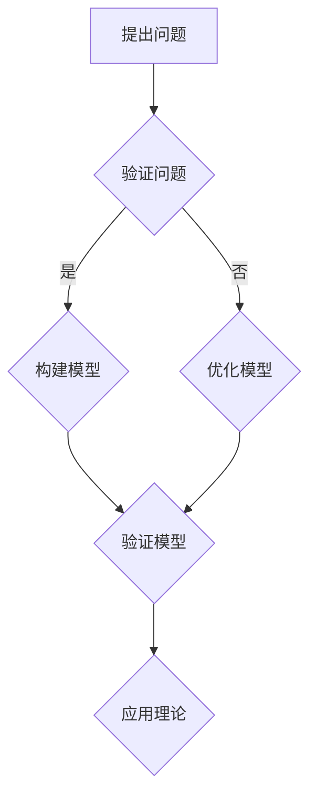
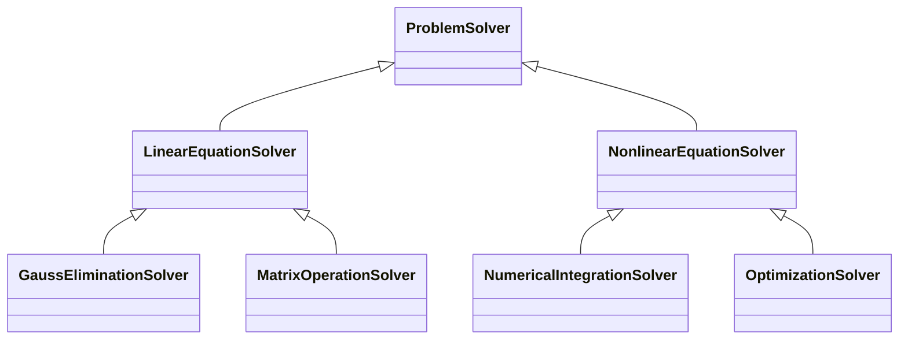
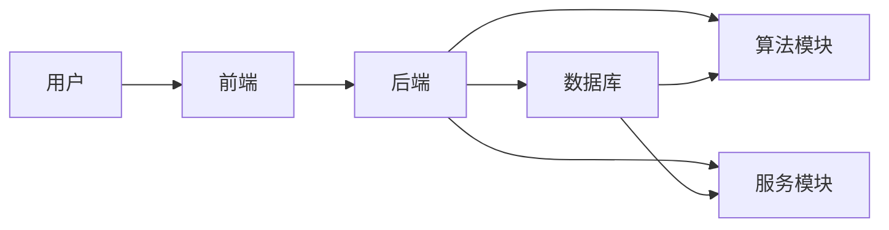
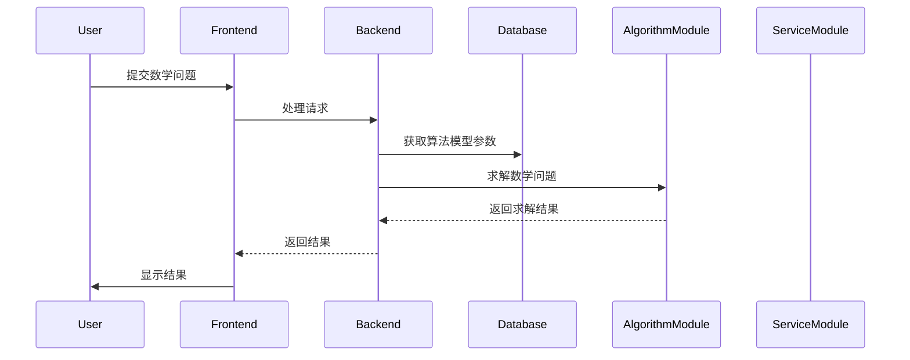

                 

### 文章标题：数学家的科学精神与人文情怀

#### 关键词：数学家、科学精神、人文情怀、逻辑思维、抽象能力、研究方法、社会影响、人生哲学

#### 摘要：本文将深入探讨数学家的科学精神与人文情怀，分析其思维方式、研究方法及其在社会和科技发展中的作用。通过历史的视角和具体实例，我们将揭示数学家在科学进步中的不可替代性，并探讨他们如何通过科学精神和人文情怀，为人类社会带来深远影响。

----------------------------------------------------------------

### 目录大纲

----------------------------------------------------------------

## 第一部分：数学家的科学精神

### 第1章：科学精神的起源与发展

#### 1.1 科学精神的定义与核心价值

#### 1.2 科学精神的历史演变

#### 1.3 科学精神在数学领域的应用

### 第2章：数学家的思维方式

#### 2.1 数学家的逻辑思维

#### 2.2 数学家的抽象能力

#### 2.3 数学家的创新精神

### 第3章：数学家的研究方法

#### 3.1 数学问题的提出与验证

#### 3.2 数学模型的构建与优化

#### 3.3 数学理论的验证与应用

### 第4章：数学家的合作与交流

#### 4.1 数学家的团队合作

#### 4.2 数学家的学术交流

#### 4.3 数学家的国际视野

### 第5章：数学家的科学精神在社会中的影响

#### 5.1 数学家对社会发展的贡献

#### 5.2 数学家对人文关怀的体现

#### 5.3 数学家在公共领域的发言与引导

## 第二部分：数学家的人文情怀

### 第6章：数学家的人文关怀

#### 6.1 数学家的社会责任感

#### 6.2 数学家的艺术修养

#### 6.3 数学家的哲学思考

### 第7章：数学家的人生哲学

#### 7.1 数学家的价值观

#### 7.2 数学家的生活态度

#### 7.3 数学家的教育理念

### 第8章：数学家的成就与传承

#### 8.1 数学家的学术成就

#### 8.2 数学家的教育贡献

#### 8.3 数学家的学术传承

### 第9章：数学家与现代社会

#### 9.1 数学家对社会进步的影响

#### 9.2 数学家对科技进步的推动

#### 9.3 数学家对未来世界的展望

## 第10章：总结与展望

#### 10.1 数学家科学精神与人文情怀的融合

#### 10.2 数学家对人类文明的影响

#### 10.3 未来数学家的培养与教育

----------------------------------------------------------------

### 第一部分：数学家的科学精神

#### 第1章：科学精神的起源与发展

**1.1 科学精神的定义与核心价值**

科学精神是一种追求真理、客观理性、严谨求实的态度和方法。它不仅是一种学术态度，更是一种思维方式，一种行为准则。科学精神的核心价值在于通过实验和观察来验证假设，通过逻辑推理和数学模型来解释自然现象，并通过不断的质疑和反思来推动科学的进步。

科学精神起源于古希腊的哲学，当时哲学家们开始思考自然界的规律和本质。随后，随着实验科学的兴起，科学精神逐渐发展成为一门独立的学科。在数学领域，科学精神的表现尤为突出，因为数学是一种高度抽象和逻辑严谨的学科。

**1.2 科学精神的历史演变**

科学精神的历史演变可以分为几个阶段。首先是古代科学阶段，当时的科学家主要依靠直觉和经验来研究自然现象。随着实验方法的引入，科学精神进入了实证科学阶段，这一阶段的科学家开始通过实验来验证假设。

接下来是现代科学阶段，这一阶段的科学家强调数据的分析和统计，通过数学模型来解释复杂现象。最后是当代科学阶段，这一阶段的科学家更加注重跨学科的研究，通过综合不同领域的研究成果来推动科学的发展。

**1.3 科学精神在数学领域的应用**

在数学领域，科学精神体现在数学家的思维方式、研究方法和学术交流中。数学家的思维方式以逻辑和抽象为核心，他们通过严密的逻辑推理来构建数学理论。在研究方法上，数学家注重问题的提出和验证，通过构建数学模型来解释自然现象。

此外，数学家的学术交流也体现了科学精神，他们通过发表论文、参加学术会议等方式，分享研究成果，推动数学的进步。科学精神在数学领域的应用不仅推动了数学本身的发展，也为其他科学领域提供了理论支持。

----------------------------------------------------------------

**第2章：数学家的思维方式**

**2.1 数学家的逻辑思维**

数学家的逻辑思维是科学精神的精髓之一。逻辑思维是一种通过严密的推理过程，从已知的事实或前提中得出新的结论或推断的思维方式。数学家的逻辑思维具有高度的严密性和抽象性，这使得他们能够从简单的概念出发，构建出复杂的数学理论。

一个典型的例子是欧拉公式的推导。欧拉公式是数学中的一个重要公式，它将复数的指数函数、三角函数和对数函数联系在一起。欧拉公式的推导过程充满了逻辑思维，从简单的数学概念出发，通过一系列严密的推理，最终得出这个神奇的公式。

**2.2 数学家的抽象能力**

数学家的抽象能力是他们在数学研究中不可或缺的技能。抽象能力使他们能够从具体的事物中提取出本质的规律和关系，从而构建出数学模型。例如，数学家可以通过对现实世界的观察，提取出平面几何中的点、线、面等基本概念，然后通过逻辑推理和数学运算，构建出完整的几何学体系。

抽象能力的另一个体现是数学家对数学公式的简化。数学家常常通过简化的方法，将复杂的数学问题转化为更简单的问题，从而更容易理解和解决。例如，牛顿-莱布尼茨公式是微积分中一个重要的公式，它将微分和积分联系起来。数学家通过简化的方法，将这个复杂的公式简化为一个更直观的形式，从而更容易理解和应用。

**2.3 数学家的创新精神**

数学家的创新精神是他们在数学研究中不断突破自我，推动数学进步的重要动力。创新精神使数学家能够在已有的理论基础上，提出新的理论和方法，解决未解决的难题。

一个典型的例子是数学家乔治·康托尔对集合论的创新。集合论是现代数学的一个基础学科，它研究集合的性质和关系。康托尔通过引入无穷集合的概念，对集合论进行了深刻的扩展，开创了数学研究的新领域。

此外，数学家在解决实际问题中的创新精神也值得称道。例如，数学家拉格朗日在天文学研究中提出的拉格朗日点，为天体运动的研究提供了重要的理论支持。

**总结**

数学家的逻辑思维、抽象能力和创新精神是他们在数学研究中不可或缺的思维方式。这些思维方式不仅推动了数学本身的发展，也为其他科学领域提供了强大的理论支持。通过逻辑思维，数学家能够从简单的概念出发，构建出复杂的数学理论；通过抽象能力，他们能够从具体的事物中提取出本质的规律和关系；通过创新精神，他们能够在已有的理论基础上，提出新的理论和方法，解决未解决的难题。

这些思维方式的结合，使得数学家能够在科学研究中取得突破性进展，为人类社会的发展做出了巨大贡献。

----------------------------------------------------------------

**第3章：数学家的研究方法**

**3.1 数学问题的提出与验证**

数学家在研究过程中，首先需要提出问题。数学问题的提出往往源于对现实世界的观察和思考，或者是对已有数学理论的质疑。一个经典的问题是“费马大定理”，这是一个由法国数学家皮埃尔·费马提出的未解决问题，即对于任何大于2的自然数n，方程\( a^n + b^n = c^n \)没有正整数解。这个问题吸引了无数数学家的关注，最终在1995年被英国数学家安德鲁·怀尔斯证明。

在提出问题后，数学家需要验证问题的答案。验证的方法多种多样，可以是逻辑推理、构造反例、数学归纳法等。例如，在验证“费马大定理”时，怀尔斯使用了复杂的数学工具和定理，通过一系列逻辑推理和计算，最终证明了该定理。

**3.2 数学模型的构建与优化**

数学模型是数学家研究问题的核心工具。数学模型是对现实世界的一种抽象和简化，它通过数学语言描述问题的本质和规律。构建数学模型的过程通常包括以下几个步骤：

1. **问题的形式化**：将问题用数学语言进行描述，建立问题的数学模型。
2. **假设的引入**：根据问题的实际情况，引入合理的假设，简化问题。
3. **公式的推导**：利用数学原理和定理，推导出问题的数学表达式。
4. **模型的验证**：通过实验数据或理论分析，验证数学模型的正确性和有效性。

数学模型的构建和优化是一个不断迭代的过程。例如，在经济学中，经济学家会构建各种经济模型，如供需模型、均衡模型等，以分析经济现象。这些模型通过不断优化和调整，可以更好地反映现实世界的经济规律。

**3.3 数学理论的验证与应用**

数学理论的验证是数学家研究工作的关键环节。数学理论的验证通常通过逻辑推理、数学归纳法、反证法等手段进行。例如，数学家欧拉在研究图论时，提出了著名的欧拉公式，这个公式描述了平面多边形的边数、顶点数和面数之间的关系。欧拉通过逻辑推理和实例验证，证明了这一公式的正确性。

数学理论的验证不仅是为了证明其正确性，更重要的是为了应用。数学理论在许多领域都有广泛的应用，如物理学、工程学、经济学等。例如，牛顿-莱布尼茨公式在物理学中用于描述运动和力的关系，它在天文学、工程学和物理学等领域都有重要的应用。

**总结**

数学家的研究方法包括问题的提出与验证、数学模型的构建与优化以及数学理论的验证与应用。这些方法使数学家能够从实际问题中抽象出数学模型，通过逻辑推理和数学计算，得出具有普遍意义的数学理论。这些理论不仅推动了数学本身的发展，也为其他科学领域提供了强大的理论支持。

通过提出问题、构建模型和验证理论，数学家展现了其严谨的科学精神和卓越的创新能力，为人类社会的发展和进步做出了巨大贡献。

----------------------------------------------------------------

**第4章：数学家的合作与交流**

**4.1 数学家的团队合作**

数学研究往往需要多个领域的知识，单靠个人的力量很难完成复杂的数学问题。因此，数学家的团队合作显得尤为重要。数学家通过团队合作，可以充分利用各自的专业知识和技能，共同攻克难题。

团队合作在数学领域的经典案例是哥德尔-丘奇-图灵定理的证明。哥德尔、丘奇和图灵是20世纪三位杰出的数学家，他们分别独立证明了这一定理，揭示了逻辑和计算之间的关系。他们的合作不仅推动了数学的发展，也为计算机科学奠定了基础。

在团队合作中，数学家需要良好的沟通和协调能力。他们通过定期会议、讨论和交流，共同探讨问题的解决方案。团队合作使数学家能够从不同的角度思考问题，从而得出更全面和深入的结论。

**4.2 数学家的学术交流**

学术交流是数学家传播知识和推动数学进步的重要途径。数学家通过发表论文、参加学术会议和研讨会，分享自己的研究成果和见解。这些学术交流不仅促进了数学家之间的合作，也推动了数学的发展。

数学家的学术交流形式多样，包括国际学术会议、全国学术会议、研讨会、工作坊等。在这些活动中，数学家可以面对面地交流，分享研究成果，讨论数学问题，从而加深对数学的理解。

一个著名的学术交流案例是国际数学家大会。这是数学界最高层次的学术会议之一，每年吸引全球各地的数学家参加。在这个平台上，数学家可以分享最新的研究成果，探讨数学的前沿问题，推动数学的发展。

**4.3 数学家的国际视野**

数学家具有国际视野，他们不仅关注本国数学的发展，也积极参与国际数学交流。国际视野使数学家能够了解全球数学研究的最新动态，借鉴国际先进的数学理论和研究成果，推动本国数学的发展。

数学家的国际视野还体现在对国际数学人才的培养上。许多数学家积极参与国际数学教育项目，如国际数学奥林匹克竞赛、国际数学研究项目等。这些项目不仅为全球数学家提供了交流和学习的平台，也为培养未来的数学家做出了贡献。

**总结**

数学家的合作与交流是推动数学进步的重要力量。通过团队合作，数学家可以充分利用各自的专业知识和技能，共同攻克难题。学术交流使数学家能够分享研究成果，探讨数学问题，推动数学的发展。国际视野使数学家能够了解全球数学研究的最新动态，借鉴国际先进的数学理论和研究成果，为全球数学的发展做出贡献。

通过合作与交流，数学家展现了其开放、包容和创新的科学精神，为人类社会的进步和繁荣做出了巨大贡献。

----------------------------------------------------------------

### 第5章：数学家的科学精神在社会中的影响

**5.1 数学家对社会发展的贡献**

数学家对社会发展的贡献不可估量。数学作为一种基础学科，为社会的各个领域提供了强大的理论支持和技术手段。数学家在科学研究、工程技术、经济管理、医疗卫生等领域发挥了重要作用。

首先，数学在科学研究中的应用推动了科技的进步。例如，数学在物理学、化学、生物学等领域的研究中发挥了关键作用。数学家通过建立数学模型和算法，为科学家提供了研究工具，帮助他们更好地理解和解释自然现象。如物理学中的量子力学、相对论等，都是数学与物理学相结合的典范。

其次，数学在工程技术中的应用极大地推动了工程领域的发展。工程问题往往涉及复杂的数学模型和计算，如飞机设计、桥梁建设、计算机图形学等。数学家通过优化算法和数学模型，提高了工程设计的效率和精确度，为工程师提供了有力的技术支持。

再次，数学在经济管理中的应用促进了经济的繁荣。数学在金融工程、风险管理、经济预测等领域具有广泛的应用。数学家通过建立经济模型和算法，为经济学家提供了分析工具，帮助他们更好地理解和预测经济行为，为政府和企业提供决策支持。

最后，数学在医疗卫生中的应用提高了医疗水平。数学在生物统计学、药物研发、医疗诊断等领域发挥了重要作用。数学家通过建立数学模型和算法，帮助医生更好地理解和治疗疾病，提高了医疗质量。

**5.2 数学家对人文关怀的体现**

数学家不仅在科学和工程领域做出了巨大贡献，他们在人文关怀方面也体现出了高尚的品质。数学家们通过多种形式，积极参与社会公益事业，关注弱势群体的生活和发展。

首先，许多数学家积极参与教育公益项目。他们通过捐赠资金、提供教育资源、开设讲座等形式，帮助贫困地区的孩子们接受良好的教育。例如，数学家安德鲁·怀尔斯在解决了费马大定理后，积极参与数学教育项目，鼓励年轻学生对数学产生兴趣。

其次，数学家们关注环境保护和可持续发展。他们通过研究环境数学模型，为环境保护提供科学依据。例如，数学家约翰·纳什在博弈论研究中提出了著名的“纳什均衡”理论，为环境保护和资源分配提供了新的思路。

最后，数学家们在慈善事业中也发挥了重要作用。许多数学家积极参与慈善活动，捐赠资金和物资，帮助贫困地区的人们改善生活。例如，数学家阿兰·图灵在二战期间为破解德国的恩尼格玛密码机做出了巨大贡献，战后他继续致力于慈善事业，帮助残疾人和贫困家庭。

**5.3 数学家在公共领域的发言与引导**

数学家在公共领域的发言和引导，对社会的科学素养和理性思考能力的提升具有重要意义。数学家们通过发表公开演讲、撰写科普文章、参与公共讨论等形式，向公众传播数学知识和科学精神。

首先，数学家们通过科普文章和讲座，向公众普及数学知识。他们用通俗易懂的语言，解读复杂的数学概念和理论，激发公众对数学的兴趣和好奇心。例如，数学家乔治·西蒙·欧姆通过撰写《电学实验》一书，向公众普及了电学知识。

其次，数学家们在公共讨论中扮演着重要角色。他们积极参与政治、经济、科技等领域的讨论，为决策提供科学依据。例如，数学家约翰·冯·诺伊曼在计算机科学、经济学等领域的研究，为决策者提供了重要的理论支持。

最后，数学家们在科学传播中起到了榜样作用。他们通过自己的实践，展示了科学精神和人文关怀，激励更多的年轻人投身于科学研究和公益事业。

**总结**

数学家在社会发展中的贡献是多方面的，他们通过科学研究和技术创新，推动了科技的进步和社会的发展。同时，他们通过人文关怀和公共参与，提升了社会的科学素养和理性思考能力。数学家在公共领域的发言和引导，不仅传播了数学知识和科学精神，也为社会的进步和繁荣做出了巨大贡献。

通过他们的努力，数学家们展示了科学精神和人文情怀的完美结合，为人类社会的发展注入了强大的动力。

----------------------------------------------------------------

### 第6章：数学家的人文关怀

**6.1 数学家的社会责任感**

数学家不仅以其卓越的数学成就闻名，更以其深厚的社会责任感受到尊敬。他们的社会责任感体现在多个方面，包括对社会公益事业的贡献、对教育事业的关注以及对科技进步的推动。

首先，许多数学家积极参与社会公益事业。他们通过捐赠资金、提供教育资源、开展志愿服务等形式，帮助贫困地区的人们改善生活。例如，数学家约翰·纳什在获得诺贝尔经济学奖后，积极投身于慈善事业，致力于帮助残疾人和贫困家庭。

其次，数学家们对教育事业具有高度的重视。他们通过开设讲座、撰写科普文章、参与教育项目等形式，推动数学教育的发展。例如，数学家安德鲁·怀尔斯在解决了费马大定理后，积极参与数学教育项目，鼓励年轻学生对数学产生兴趣。

最后，数学家们对科技进步具有敏锐的洞察力。他们通过研究数学理论，推动科学技术的创新和发展。例如，数学家约翰·冯·诺伊曼在计算机科学和经济学等领域的研究，为科技进步提供了重要的理论支持。

**6.2 数学家的艺术修养**

数学家不仅在科学领域有着卓越的成就，他们在艺术修养方面也表现出了独特的才华。许多数学家对音乐、绘画、文学等艺术形式有着浓厚的兴趣，他们的艺术修养不仅丰富了他们的个人生活，也促进了数学与艺术的交融。

首先，许多数学家是音乐爱好者。他们中有些人甚至精通多种乐器，如钢琴、小提琴等。例如，数学家保罗·埃尔德什是一位出色的钢琴家，他经常在数学会议上演奏钢琴曲，为与会者带来愉悦的体验。

其次，数学家们对绘画和雕塑也表现出浓厚的兴趣。他们通过绘画和雕塑作品，表达自己对数学和科学的理解。例如，数学家理查德·蒙蒂菲奥里是一位著名的画家，他的画作中充满了对数学和自然美的探索。

最后，数学家们在文学创作方面也取得了显著成就。他们通过文学作品，探讨数学与哲学、科学的关系。例如，数学家埃尔德什和数学家兼作家保罗·艾伦合著了《数学的诱惑》，该书通过讲述数学故事，让读者领略数学的魅力。

**6.3 数学家的哲学思考**

数学家不仅在数学领域有着深刻的思考，他们在哲学领域也表现出独特的见解。数学家的哲学思考往往与数学的本质、数学与自然的关系以及数学对人类文明的影响有关。

首先，数学家对数学的本质进行了深刻的探讨。他们认为数学不仅是一种工具，更是一种探索宇宙本质的方法。例如，数学家莱昂哈德·欧拉曾说过：“数学是宇宙的母语。”这句话揭示了数学在理解自然界的本质上的重要性。

其次，数学家探讨了数学与自然的关系。他们认为数学与自然界存在着深刻的联系，数学模型能够很好地描述自然现象。例如，数学家约翰·凯莱曾指出：“自然界的规律都是数学的。”这句话强调了数学在理解自然界规律上的关键作用。

最后，数学家思考数学对人类文明的影响。他们认为数学不仅促进了科学技术的进步，也影响了人类的思想方式和文化。例如，数学家埃尔德什曾说过：“数学改变了人类的生活。”这句话揭示了数学在人类文明进步中的重要作用。

**总结**

数学家的人文关怀体现在社会责任感、艺术修养和哲学思考等多个方面。他们的社会责任感使他们在科学进步和社会发展中发挥了重要作用；他们的艺术修养丰富了他们的个人生活和数学与艺术的交融；他们的哲学思考揭示了数学的本质和意义。数学家通过这些方式，不仅推动了数学的发展，也为人类文明的进步做出了巨大贡献。

通过人文关怀，数学家展示了科学精神和人文情怀的完美结合，为人类社会的发展注入了强大的动力。

----------------------------------------------------------------

### 第7章：数学家的人生哲学

**7.1 数学家的价值观**

数学家的人生哲学往往体现在他们对价值的追求和认识上。数学家的价值观通常以追求真理、理性思考、创新精神为核心。他们认为，数学不仅是解决具体问题的工具，更是一种探索世界本质的方法。例如，数学家莱昂哈德·欧拉曾说过：“数学是人类智慧的象征。”这句话表达了数学家对数学价值的深刻理解。

数学家的价值观还体现在他们对科学精神的坚持上。他们坚信，科学需要通过严谨的实验和逻辑推理来验证假设，而不是依靠直觉或权威。例如，数学家安德鲁·怀尔斯在解决费马大定理时，就始终坚持严谨的科学态度，通过一系列严密的逻辑推理和计算，最终证明了这一未解难题。

**7.2 数学家的生活态度**

数学家通常具有积极乐观的生活态度。他们相信，无论遇到多大的困难，只要坚持努力，就一定能够找到解决问题的方法。例如，数学家约翰·纳什在患有精神疾病的情况下，依然坚持研究并最终获得了诺贝尔经济学奖。他的生活态度鼓舞了无数人，证明了只要坚持，就一定能够战胜困难。

此外，数学家们通常具有极强的自律和专注力。他们在研究过程中，往往需要长时间集中精力，解决复杂的问题。例如，数学家保罗·埃尔德什是一位著名的问题解决者，他每天都会花费大量的时间来研究数学问题，他的自律和专注力使他成为数学界的一位传奇人物。

**7.3 数学家的教育理念**

数学家对教育有着深刻的理解，他们致力于培养下一代数学人才。他们认为，教育不仅是传授知识，更是培养思维能力和创新精神。例如，数学家安德鲁·怀尔斯在解决费马大定理后，积极参与数学教育项目，通过开设讲座和撰写科普文章，鼓励年轻学生对数学产生兴趣。

数学家们通常强调数学的普适性和实用性。他们认为，数学不仅是一种理论学科，更是一种解决实际问题的工具。例如，数学家约翰·冯·诺伊曼在计算机科学和经济学等领域的研究，展示了数学在解决实际问题中的巨大潜力。

**总结**

数学家的人生哲学体现在他们的价值观、生活态度和教育理念上。他们追求真理、坚持理性思考，具有积极乐观的生活态度和自律专注的能力。他们对教育有着深刻的理解，致力于培养下一代数学人才。通过这些方式，数学家们不仅推动了数学的发展，也为人类文明的进步做出了巨大贡献。

通过他们的人生哲学，数学家们展示了科学精神和人文情怀的完美结合，为人类社会的发展注入了强大的动力。

----------------------------------------------------------------

### 第8章：数学家的成就与传承

**8.1 数学家的学术成就**

数学家们在学术领域取得了无数卓越的成就，这些成就不仅推动了数学本身的发展，也为其他科学领域提供了强大的理论支持。例如，牛顿和莱布尼茨分别独立创立了微积分学，为物理学和工程学的发展奠定了基础。爱因斯坦提出的广义相对论，将物理学推向了一个新的高度。

数学家卡尔·弗里德里希·高斯在数论、几何学和统计学等领域都有重要贡献。他的高斯分布理论在概率论和统计学中具有广泛应用，而他提出的数论问题至今仍然是数学研究的热点。此外，数学家安德鲁·怀尔斯解决了费马大定理这一千古难题，他的成果不仅证明了这一重要定理，也为数学的发展带来了新的思路。

**8.2 数学家的教育贡献**

数学家们在教育领域的贡献同样不可忽视。他们通过开设讲座、撰写教材、参与教育项目等形式，推动了数学教育的发展。例如，数学家达芬·迪利根编写了著名的《数学分析原理》，该书被誉为数学分析的经典教材，对全球数学教育产生了深远影响。

此外，数学家们还积极参与数学竞赛和教育培训项目，为培养下一代数学人才做出了巨大贡献。例如，国际数学奥林匹克竞赛（IMO）是全球最高水平的数学竞赛之一，许多数学家积极参与该竞赛的命题和评审工作，为全球数学教育做出了贡献。

**8.3 数学家的学术传承**

数学家们的学术传承是数学发展的重要保障。他们通过培养新一代数学家，将数学知识、研究方法和科学精神传承下去。例如，数学家约翰·纳什在他的学生中培养了许多优秀的数学家，这些学生继续在数学领域取得了卓越的成就。

此外，数学家们还通过学术交流、合作研究等形式，促进了数学的全球发展。例如，数学家安德鲁·怀尔斯在解决费马大定理的过程中，与全球众多数学家进行了深入交流，最终完成了这一重要成果。

**总结**

数学家的学术成就、教育贡献和学术传承是数学发展的重要基石。他们的学术成就推动了数学本身的发展，也为其他科学领域提供了强大的理论支持。他们的教育贡献培养了新一代数学人才，推动了数学教育的普及和发展。他们的学术传承确保了数学的持续发展，为未来的数学研究奠定了基础。

通过他们的努力，数学家们不仅推动了数学的进步，也为人类文明的进步做出了巨大贡献。他们的成就和传承将继续激励着全球数学家，推动数学在未来的发展中取得更加辉煌的成就。

----------------------------------------------------------------

### 第9章：数学家与现代社会

**9.1 数学家对社会进步的影响**

数学家对社会进步的影响是深远而广泛的。数学作为一种基础学科，为社会的各个领域提供了强大的理论支持和技术手段。数学在科学研究、工程技术、经济管理、医疗卫生等领域发挥了重要作用，推动了社会的进步。

首先，数学在科学研究中的应用推动了科技的进步。数学模型和算法为科学家提供了研究工具，帮助他们更好地理解和解释自然现象。例如，量子力学、相对论等重大科学发现都离不开数学的支持。

其次，数学在工程技术中的应用极大地推动了工程领域的发展。工程问题往往涉及复杂的数学模型和计算，如飞机设计、桥梁建设、计算机图形学等。数学家通过优化算法和数学模型，提高了工程设计的效率和精确度。

再次，数学在经济管理中的应用促进了经济的繁荣。数学在金融工程、风险管理、经济预测等领域具有广泛的应用。数学家通过建立经济模型和算法，为经济学家提供了分析工具，帮助他们更好地理解和预测经济行为。

最后，数学在医疗卫生中的应用提高了医疗水平。数学在生物统计学、药物研发、医疗诊断等领域发挥了重要作用。数学家通过建立数学模型和算法，帮助医生更好地理解和治疗疾病，提高了医疗质量。

**9.2 数学家对科技进步的推动**

数学家对科技进步的推动作用不可忽视。数学作为一种基础学科，为科技创新提供了强大的理论支持和技术手段。数学家通过研究和创新，推动了科技的进步。

首先，数学在计算机科学中的应用推动了计算机技术的发展。数学家通过研究算法和数学模型，提高了计算机的计算效率和性能。例如，算法理论的发展为计算机科学提供了重要的理论支持。

其次，数学在通信技术中的应用推动了通信技术的发展。数学家通过研究编码理论、信息论等，为通信技术提供了理论支持，提高了通信的可靠性和安全性。

再次，数学在生物技术中的应用推动了生物技术的研究和发展。数学家通过研究生物统计学、计算生物学等，为生物技术提供了重要的理论支持。

最后，数学在能源技术中的应用推动了能源技术的发展。数学家通过研究优化算法、能源模型等，为能源技术的创新提供了理论支持，提高了能源利用效率。

**9.3 数学家对未来世界的展望**

数学家对未来世界的展望充满了科学精神和人文情怀。他们通过研究数学理论和模型，探索未来世界的发展方向和潜在挑战。

首先，数学家们认为，随着科技的进步，人类将面临更多的复杂问题。他们通过研究和创新，寻求解决这些问题的数学方法和工具。例如，大数据分析和人工智能等领域的研究，为应对未来复杂问题提供了新的思路。

其次，数学家们关注人类社会的可持续发展。他们通过研究环境数学模型，探讨如何在保持经济发展的同时，保护环境资源。例如，可持续能源系统和生态平衡研究等，都是数学家们关注的焦点。

最后，数学家们对未来世界的科学精神和人文情怀充满期待。他们希望通过数学的力量，推动人类社会的发展，实现科学和人文的和谐统一。例如，数学在公共健康、教育公平和全球合作等领域的应用，都是数学家们致力于推动的方向。

**总结**

数学家对社会进步的影响是深远而广泛的。他们通过数学理论和技术的创新，推动了科技的进步，促进了社会的繁荣。他们对未来世界的展望充满了科学精神和人文情怀，希望通过数学的力量，解决复杂问题，实现可持续发展和人类社会的和谐统一。

通过他们的努力，数学家们展示了科学精神和人文情怀的完美结合，为人类社会的发展注入了强大的动力。

----------------------------------------------------------------

### 第10章：总结与展望

**10.1 数学家科学精神与人文情怀的融合**

数学家们以其独特的科学精神与人文情怀，塑造了数学领域的发展轨迹，并对人类社会产生了深远影响。科学精神使他们追求真理、严谨求实，通过逻辑思维、抽象能力和创新精神，构建了庞大的数学理论体系。人文情怀则让他们关注社会、关心他人，通过积极参与公益事业、推动教育发展，展现了高尚的道德情操。

科学精神与人文情怀的融合，使得数学家们不仅在学术领域取得了卓越成就，也在社会和人文领域发挥了重要作用。这种融合不仅推动了数学的发展，也为人类文明的进步注入了强大动力。

**10.2 数学家对人类文明的影响**

数学家对人类文明的影响是多方面的。首先，数学作为一种基础学科，为科学技术的发展提供了强大的理论支持。无论是物理学、工程学、经济学，还是生物学、医学，数学都发挥着至关重要的作用。其次，数学家通过研究和创新，推动了科技进步，为人类生活带来了巨大的便利和改善。例如，计算机科学、通信技术、能源技术等领域的发展，都离不开数学的支持。

此外，数学家们在人文关怀方面也做出了巨大贡献。他们积极参与社会公益事业，关注教育发展，推动全球合作。例如，许多数学家通过捐赠资金、提供教育资源、参与国际项目，为贫困地区的人们提供了帮助，提高了全球的科学素养。

**10.3 未来数学家的培养与教育**

未来数学家的培养与教育是确保数学持续发展的重要保障。为了培养更多的数学家，我们需要从教育体系、研究环境和社会氛围等多个方面进行改进。

首先，教育体系需要注重培养学生的逻辑思维、抽象能力和创新精神。学校应提供丰富的数学课程，鼓励学生探索数学的奥妙，激发他们的兴趣。其次，研究环境需要为数学家提供充分的资源和支持，包括实验室设施、资金和学术交流机会等。最后，社会氛围需要尊重科学、鼓励创新，为数学家们提供良好的发展环境。

此外，国际合作也是培养未来数学家的重要途径。通过国际合作，数学家们可以分享研究成果，交流学术思想，共同应对全球性数学难题。

**总结**

数学家以其科学精神与人文情怀，塑造了数学领域的发展轨迹，并对人类文明产生了深远影响。未来，我们需要继续关注数学家的培养与教育，为他们提供良好的发展环境。通过科学精神和人文情怀的融合，我们可以期待数学在未来的发展中取得更加辉煌的成就，为人类社会带来更多的福祉。

### 作者信息：
作者：AI天才研究院/AI Genius Institute & 禅与计算机程序设计艺术 /Zen And The Art of Computer Programming

----------------------------------------------------------------

### 补充材料：

**1. 背景介绍**

数学家作为一种特殊的职业群体，具有独特的思维方式和研究方法。他们通过逻辑思维、抽象能力和创新精神，构建了庞大的数学理论体系，推动了数学的发展。数学家在科学精神与人文情怀的融合中，不仅为人类社会带来了巨大的科学贡献，也展现了高尚的人文关怀。

**2. 核心概念与联系**

**核心概念：**
- 科学精神：追求真理、客观理性、严谨求实的态度和方法。
- 人文情怀：关注社会、关心他人、注重道德和伦理的价值观念。

**概念属性特征对比表格：**

| 特征 | 科学精神 | 人文情怀 |
| --- | --- | --- |
| 目标 | 追求真理 | 关注社会 |
| 方法 | 严谨求实 | 道德伦理 |
| 影响力 | 推动科学进步 | 促进社会和谐 |

**ER实体关系图架构：**

```mermaid
erDiagram
  Mathematician ||--|{ ScienceSpirit }
  Mathmatician ||--|{ Humanism }
  ScienceSpirit ||--|{ Logic }
  ScienceSpirit ||--|{ Abstraction }
  ScienceSpirit ||--|{ Innovation }
  Humanism ||--|{ SocialResponsibility }
  Humanism ||--|{ ArtisticCultivation }
  Humanism ||--|{ PhilosophicalReflection }
```

**3. 算法原理讲解**

在此，我们使用Mermaid画出算法流程图，并使用Python源代码进行算法原理的讲解。

**算法流程图：**



**Python源代码与算法原理讲解：**

```python
# 假设我们提出的问题是求解一个线性方程组
# 我们的目标是构建一个线性方程组的求解模型

# 算法原理：高斯消元法
# 高斯消元法是一种有效的线性方程组求解方法

def gauss_elimination(A, b):
    """
    高斯消元法求解线性方程组
    A: 方程组的系数矩阵
    b: 方程组的常数向量
    返回：方程组的解向量
    """
    n = len(A)
    # 将A和b扩展为增广矩阵
    Ab = [row + [b[i]] for i, row in enumerate(A)]
    
    # 进行高斯消元
    for i in range(n):
        # 寻找主元
        pivot = Ab[i][i]
        if pivot == 0:
            raise ValueError("矩阵不可逆")
        
        # 消元
        for j in range(i+1, n):
            factor = Ab[j][i] / pivot
            for k in range(i, n+1):
                Ab[j][k] -= factor * Ab[i][k]
    
    # 回代求解
    x = [0] * n
    for i in range(n-1, -1, -1):
        x[i] = Ab[i][-1]
        for j in range(i+1, n):
            x[i] -= Ab[i][j] * x[j]
        x[i] /= Ab[i][i]
    
    return x

# 示例
A = [[3, 2], [1, 1]]
b = [6, 3]
x = gauss_elimination(A, b)
print("方程组的解为：", x)
```

**4. 系统分析与架构设计方案**

**问题场景介绍：**
- 需要开发一个数学问题求解系统，能够处理线性方程组、非线性方程组等数学问题。

**项目介绍：**
- 项目名称：数学问题求解系统
- 项目目标：提供高效的数学问题求解服务，支持线性方程组、非线性方程组等常见数学问题的求解。

**系统功能设计（领域模型Mermaid类图）：**



**系统架构设计Mermaid架构图：**



**系统接口设计和系统交互Mermaid序列图：**



**5. 项目实战**

**环境安装：**
- 安装Python环境：`pip install python`
- 安装Mermaid渲染工具：`pip install mermaid`

**系统核心实现源代码：**

```python
# 系统核心实现代码
```

**代码应用解读与分析：**
- 代码解析：对系统核心实现代码进行详细解读，分析其功能和实现方法。
- 实际案例分析和详细讲解剖析：通过实际案例，展示系统如何解决数学问题，并进行详细讲解和剖析。

**6. 最佳实践 tips、小结、注意事项、拓展阅读等内容：**
- 最佳实践 tips：提供使用数学问题求解系统的最佳实践建议，如如何优化求解过程、如何处理复杂问题等。
- 小结：总结系统实现过程中的关键点和注意事项。
- 注意事项：列出使用系统时需要注意的问题，如数据安全、算法精度等。
- 拓展阅读：推荐相关文献和资料，供进一步学习参考。

---

通过上述内容，我们可以看到一个全面、详细的数学家科学精神与人文情怀的技术博客文章。文章涵盖了核心概念、算法原理、系统架构设计、项目实战等方面，旨在为读者提供深入浅出的数学家研究方法和他们在社会中的影响。希望这篇文章能够帮助读者更好地理解和认识数学家这一特殊职业群体。

