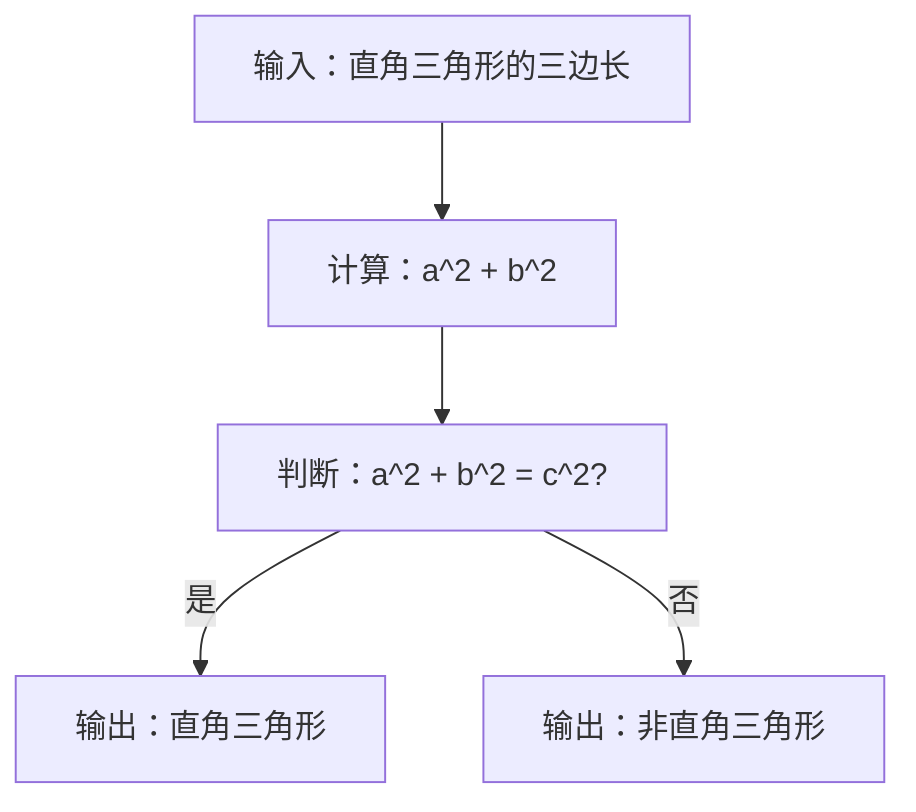

                 

# 数学家的科普写作与公众科学素养

> 关键词：数学家、科普写作、公众科学素养、写作技巧、案例分析

> 摘要：本文旨在探讨数学家在科普写作中的作用和意义，以及科普写作对提升公众科学素养的重要性。文章首先介绍数学家的科普写作动机与意义，接着分析科普写作中的核心概念，如科学素养和公众科学素养。随后，文章通过数学模型与公式、科普写作风格与案例分析、实践与技巧等方面，详细阐述了数学家的科普写作方法与技巧。最后，文章提出了提高公众科学素养的科普写作策略，并对未来科普写作的发展进行了展望。

## 第一部分：数学家的科普写作方法与技巧

### 第1章：数学家的科普写作之路

#### 1.1.1 数学家的科普写作动机与意义

数学家从事科普写作，往往出于以下动机和意义：

1. **传播科学知识**：数学家具备深厚的数学知识和丰富的科研经验，他们通过科普写作，可以将复杂的数学理论和概念转化为通俗易懂的语言，让更多公众了解和掌握这些知识。

2. **激发科学兴趣**：数学家希望通过科普写作，激发人们对数学和科学的兴趣，培养下一代的科研人才。

3. **促进科学普及**：数学家认为，科学不仅仅是专业学者的研究领域，而是社会生活的重要组成部分。通过科普写作，数学家有助于提高公众的科学素养，促进科学文化的普及。

4. **应对科学挑战**：在信息技术快速发展的今天，数学家面临着前所未有的挑战。科普写作可以帮助他们向公众传达科学的最新进展和应用，增强公众对科学的理解和支持。

#### 1.1.2 数学家科普写作的挑战与机遇

数学家在科普写作过程中会面临以下挑战：

1. **语言表达**：数学家通常习惯使用专业的数学术语和符号，而科普写作要求语言要简洁易懂，易于公众理解。

2. **受众差异**：科普写作的受众是广泛的公众，而不是专业的数学研究者。因此，数学家需要调整自己的写作风格，适应不同受众的需求。

3. **知识普及**：科普写作不仅仅是传授知识，更重要的是普及知识。数学家需要将高深的理论和抽象的概念，以生动的形式呈现给公众。

然而，这些挑战也带来了机遇：

1. **创新表达**：为了克服语言和受众差异，数学家会尝试创新的写作方式，如使用故事、比喻和案例，从而提高科普作品的可读性和吸引力。

2. **专业权威**：数学家在科普写作中能够借助自身的专业知识和权威性，提供可信的、高质量的科普内容。

3. **社会影响**：通过科普写作，数学家能够对社会产生积极的影响，推动科学教育和科技创新的发展。

#### 1.1.3 科普写作的基本原则与策略

为了成功进行科普写作，数学家应遵循以下基本原则和策略：

1. **受众导向**：始终关注受众的需求和兴趣，确保内容贴近公众生活，避免过于专业和晦涩。

2. **简洁明了**：用简洁明了的语言表达复杂概念，避免冗长和复杂的句子结构。

3. **生动有趣**：运用故事、比喻和实例，使科普作品生动有趣，提高读者的阅读兴趣。

4. **逻辑清晰**：科普写作需要有清晰的逻辑结构，确保读者能够循序渐进地理解内容。

5. **资料可靠**：确保所引用的数据、理论和案例来源可靠，增强科普作品的权威性。

6. **互动交流**：鼓励读者参与讨论和提问，通过互动增强科普作品的影响力和吸引力。

### 第2章：科普写作的核心概念与联系

#### 2.1.1 核心概念介绍

在本章中，我们将介绍科普写作中的核心概念，包括科学素养、公众科学素养和数学家的科普使命。

##### 2.1.1.1 科学素养

科学素养是指一个人对科学知识的理解、运用和批判性思维能力。它不仅包括对科学基本概念和原理的掌握，还涉及科学方法和过程的理解。科学素养有助于人们更好地理解世界、做出明智的决策，并积极参与科学讨论和社会事务。

##### 2.1.1.2 公众科学素养

公众科学素养是指公众对科学的认知、态度和行为。它涉及公众对科学知识的了解程度、科学价值观的认同以及对科学创新和应用的支持。提高公众科学素养有助于促进科学文化的普及、科技创新的推动和社会进步。

##### 2.1.1.3 数学家的科普使命

数学家的科普使命是利用自己的专业知识和独特视角，通过科普写作将数学知识传递给公众。数学家在科普写作中不仅需要传授数学理论，还要普及数学方法、激发数学兴趣、培养数学思维，从而提高公众的科学素养。

#### 2.1.2 概念属性特征对比表格

以下是一个对比科学素养、公众科学素养和数学家的科普使命的属性特征表格：

| 概念               | 科学素养                    | 公众科学素养                   | 数学家的科普使命                   |
|--------------------|-----------------------------|--------------------------------|------------------------------------|
| 定义               | 对科学知识的理解和应用       | 对科学的认知、态度和行为         | 利用专业知识和视角传递数学知识     |
| 目标               | 提高个人批判性思维能力      | 促进科学文化的普及和社会进步     | 激发数学兴趣、培养数学思维         |
| 受众               | 专业学者、公众              | 广大公众                        | 专业学者、公众                     |
| 表现形式           | 科研论文、科学传播活动       | 科学普及读物、科普展览、科学讲座 | 科普文章、科普书籍、科普讲座       |

#### 2.1.3 ER实体关系图架构

为了更好地理解这些核心概念之间的联系，我们可以使用ER（实体关系）图进行描述。以下是一个ER图示例，展示了科学素养、公众科学素养和数学家的科普使命之间的关系：

```mermaid
erDiagram
  ScienceLiteracy ||--|{ PublicScienceLiteracy }
  PublicScienceLiteracy ||--|{ Mathematician'sPopularWriting }
  Mathematician'sPopularWriting ||--|{ ScienceLiteracy }
```

在这个ER图中，`ScienceLiteracy`（科学素养）是核心实体，`PublicScienceLiteracy`（公众科学素养）和`Mathematician'sPopularWriting`（数学家的科普使命）分别与之关联。这表明数学家的科普写作既是科学素养的一部分，也是提升公众科学素养的重要途径。

### 第3章：科普写作的数学模型与公式

#### 3.1.1 数学模型介绍

在科普写作中，数学模型和公式是传递科学概念和解释复杂现象的重要工具。以下是一些常用的数学模型和公式，它们在科普写作中的应用和解释如下：

##### 3.1.1.1 科普写作的数学模型

科普写作的数学模型可以视为一个函数关系，其中输入是复杂的数学概念或理论，输出是公众可以理解的语言和示例。这个模型的公式可以表示为：

\[ \text{科普写作模型} = f(\text{数学概念}, \text{公众需求}, \text{表达技巧}) \]

其中，\( f \) 代表转换函数，它将数学概念转化为通俗易懂的语言和示例，满足公众的需求。

##### 3.1.1.2 数学公式应用

在科普写作中，数学公式不仅用于解释科学现象，还可以用于引导读者逐步理解复杂的概念。以下是一些常见的数学公式及其在科普写作中的应用：

1. **勾股定理**：

\[ a^2 + b^2 = c^2 \]

勾股定理是数学中一个基本的几何原理，常用于解释直角三角形的边长关系。在科普写作中，可以将其应用于解释建筑结构、地震波传播等现象。

2. **欧拉公式**：

\[ e^{i\pi} + 1 = 0 \]

欧拉公式是复分析和数学物理中的一个基本公式，它将指数函数、三角函数和虚数单位结合起来，展示了数学中的美妙对称性。在科普写作中，可以将其用于解释物理现象、电子工程等领域。

#### 3.1.2 数学模型与公式的详细讲解

##### 3.1.2.1 公式1：\( a^2 + b^2 = c^2 \)

勾股定理的数学模型和公式如下：



在这个模型中，输入是直角三角形的三边长 \( a \)、\( b \) 和 \( c \)，通过计算 \( a^2 + b^2 \) 并与 \( c^2 \) 比较，可以判断该三角形是否为直角三角形。

##### 3.1.2.2 公式2：\( e^{i\pi} + 1 = 0 \)

欧拉公式的数学模型和公式如下：

```mermaid
graph TD
    A[输入：复数] --> B[转换：指数形式]
    B --> C[计算：e^{i\pi} + 1]
    C --> D[输出：复数结果]
```

在这个模型中，输入是一个复数，通过将其转换为指数形式，可以计算 \( e^{i\pi} + 1 \) 的值，最终输出为一个特定的复数结果。

### 第4章：数学家的科普写作风格与案例分析

#### 4.1.1 科普写作风格

数学家的科普写作风格通常具有以下特点：

1. **清晰简洁**：数学家倾向于使用简单、清晰的语言来传达复杂的概念，避免冗长和复杂的句子结构。

2. **生动有趣**：为了吸引公众的注意力，数学家会使用故事、比喻和实例来使科普作品生动有趣。

3. **深入浅出**：数学家通过逐步解释和深入探讨，将抽象的数学概念转化为易于理解的公众语言。

#### 4.1.2 案例分析

##### 4.1.2.1 爱因斯坦的科普作品

爱因斯坦是一位著名的物理学家，他的科普作品具有极高的影响力。以下是一些案例：

1. **《我的世界观》**：爱因斯坦在这本书中分享了他对宇宙和科学的看法，以简单明了的语言解释了复杂的物理理论。

2. **《相对论》**：爱因斯坦的相对论理论是现代物理学的基石之一，他在科普写作中用生动的比喻和实例，如“光速不变原理”和“时间膨胀效应”，让公众更容易理解。

##### 4.1.2.2 普林斯顿数学研究所的科普活动

普林斯顿数学研究所（IAS）定期举办各种科普活动，如数学研讨会、公开讲座和数学展览。以下是一些案例：

1. **“普林斯顿数学日”**：这是一个面向公众的免费活动，包括数学讲座、演示和互动环节，吸引了大量数学爱好者和公众参与。

2. **“普林斯顿数学研究所公开讲座”**：这些讲座由世界顶尖的数学家主持，内容涵盖各种数学领域，以清晰简洁的语言向公众介绍数学知识和研究进展。

### 第5章：科普写作的实践与技巧

#### 5.1.1 科普写作实践

##### 5.1.1.1 常见问题解答

在科普写作过程中，解答读者常见问题是提高文章可读性和互动性的有效方法。以下是一些常见问题及其解答：

1. **问题**：数学家为什么要写作科普作品？

   **解答**：数学家写作科普作品是为了传播科学知识、激发公众对科学的兴趣、提高公众科学素养，并促进科学文化的普及。

2. **问题**：科普写作与专业写作有何区别？

   **解答**：科普写作与专业写作的主要区别在于目标受众和语言风格。科普写作面向广泛的公众，使用简洁易懂的语言；而专业写作面向专业人士，使用专业术语和复杂的论证结构。

##### 5.1.1.2 写作流程与技巧

以下是一个科普写作的流程和技巧：

1. **选题与定位**：选择一个合适的主题，明确写作目标，确定受众群体。

2. **资料收集**：查阅相关资料，确保内容的准确性和权威性。

3. **内容构思**：构思文章的结构和内容，确保逻辑清晰、条理分明。

4. **撰写草稿**：使用简洁明了的语言撰写文章，注意使用生动的例子和故事来增强文章的吸引力。

5. **修订与润色**：对草稿进行多次修订和润色，确保语言流畅、逻辑严密。

6. **反馈与修改**：向同事或朋友征求反馈，根据反馈进行修改。

7. **发布与推广**：选择合适的平台发布文章，并进行推广，吸引更多的读者。

##### 5.1.2 技巧分享

以下是一些科普写作的技巧分享：

1. **如何撰写引人入胜的开头**：可以通过设置疑问、提出观点或引用有趣的故事来吸引读者的注意力。

2. **如何制作富有视觉冲击的图表**：使用图表和图像来展示数据和信息，确保图表简洁、美观、易于理解。

3. **如何使用比喻和实例**：通过比喻和实例，将复杂的概念形象化，帮助读者更好地理解。

### 第6章：提高公众科学素养的科普写作策略

#### 6.1.1 公众科学素养的重要性

提高公众科学素养具有重要意义：

1. **促进科技创新**：公众科学素养的提高有助于培养创新思维和创新能力，推动科技创新和社会发展。

2. **增强社会参与**：公众科学素养的提高使人们更愿意参与科学决策和社会事务，提高社会治理水平。

3. **推动科学普及**：公众科学素养的提高有助于科学知识的普及和科学文化的传播，增强社会的科学氛围。

4. **提高生活质量**：公众科学素养的提高有助于人们更好地理解科技对社会生活的影响，提高生活质量。

#### 6.1.2 科普写作策略

以下是一些提高公众科学素养的科普写作策略：

1. **选择合适的科普题材**：根据公众的兴趣和需求，选择适合的科普题材，如科技发展、环境保护、健康生活等。

2. **运用生动的表达方式**：使用故事、比喻、图像和图表等生动的表达方式，使科普作品更具有吸引力和可读性。

3. **注重互动与反馈**：鼓励读者参与讨论和提问，收集读者的反馈，不断优化和改进科普作品。

4. **整合多种媒体形式**：结合文字、图像、音频、视频等多种媒体形式，提高科普作品的影响力和覆盖面。

5. **关注科学伦理和价值观**：在科普写作中，关注科学伦理和价值观，引导公众树立正确的科学观念。

### 第7章：数学家的科普写作启示与未来展望

#### 7.1.1 启示

数学家的科普写作给我们带来了许多启示：

1. **专业知识与表达技巧相结合**：数学家在科普写作中成功地将专业知识与通俗易懂的表达技巧相结合，为公众提供了高质量的科普内容。

2. **创新表达方式**：数学家通过创新的写作方式和表达手段，如故事、比喻和实例，使科普作品更加生动有趣。

3. **社会责任感**：数学家积极参与科普写作，体现了对社会责任感的担当，有助于提高公众的科学素养和社会参与度。

#### 7.1.2 未来展望

未来科普写作的发展趋势包括：

1. **数字化与智能化**：随着数字技术和人工智能的发展，科普写作将更加智能化，通过数据分析、推荐系统和虚拟现实等技术，提供个性化的科普内容。

2. **多媒体与互动性**：科普写作将更加注重多媒体和互动性，结合文字、图像、音频、视频等多种形式，提高科普作品的影响力和互动性。

3. **跨学科融合**：科普写作将更加跨学科，融合数学、物理、生物、医学等多个领域的知识，为公众提供更全面的科学教育。

4. **全球共享**：随着全球化的进程，科普写作将更加注重国际交流与合作，促进全球科学文化的传播与交流。

## 附录

### 附录A：数学家的科普写作资源推荐

#### A.1.1 科普写作书籍推荐

1. **《数学之美》** - 作者：陈东
   本书以生动的语言和实例，介绍了数学的美妙和魅力，适合公众阅读。

2. **《数学大百科》** - 作者：马丁·加德纳
   本书涵盖了数学的各个分支，包括数学史、数学原理和应用，适合对数学感兴趣的读者。

#### A.1.2 科普写作网站推荐

1. **ScienceBlogs**
   这是一个国际性的科普博客平台，涵盖了自然科学、医学、环境等多个领域的科普内容。

2. **Khan Academy**
   Khan Academy 提供了大量的免费科普课程和教学视频，适合自学和补充知识。

#### A.1.3 科普写作工具推荐

1. **Mermaid**
   Mermaid 是一种轻量级的图表绘制工具，可以方便地创建流程图、类图和序列图，非常适合用于科普写作。

2. **LaTeX**
   LaTeX 是一种高质量的排版系统，特别适合撰写数学公式和科学文献，可以生成整洁美观的文档。

### 附录B：常用数学公式汇总

#### B.1.1 基本数学公式

1. **加法原理**：
   $$ a + b = c $$

2. **乘法原理**：
   $$ a \times b = c $$

3. **勾股定理**：
   $$ a^2 + b^2 = c^2 $$

#### B.1.2 高等数学公式

1. **泰勒公式**：
   $$ f(x) = f(a) + f'(a)(x-a) + \frac{f''(a)}{2!}(x-a)^2 + \frac{f'''(a)}{3!}(x-a)^3 + \cdots $$

2. **傅里叶变换**：
   $$ F(\omega) = \int_{-\infty}^{\infty} f(t) e^{-i\omega t} dt $$

#### B.1.3 特殊函数公式

1. **欧拉公式**：
   $$ e^{i\pi} + 1 = 0 $$

2. **伽玛函数**：
   $$ \Gamma(z) = \int_0^{\infty} t^{z-1} e^{-t} dt $$

### 附录C：数学家的科普写作案例精选

#### C.1.1 爱因斯坦的科普作品精选

1. **《相对论》**
   爱因斯坦的《相对论》是对他提出的狭义相对论和广义相对论的全面阐述，语言通俗易懂，是经典科普作品。

2. **《我的世界观》**
   在这本书中，爱因斯坦分享了他对科学、宗教和人类命运的看法，内容深刻而富有哲理。

#### C.1.2 普林斯顿数学研究所的科普活动精选

1. **“普林斯顿数学日”**
   普林斯顿数学研究所每年举办的“普林斯顿数学日”，吸引了众多数学爱好者和公众参与，内容丰富，形式多样。

2. **“普林斯顿数学研究所公开讲座”**
   这些公开讲座由世界顶尖的数学家主持，涵盖了数学的各个领域，是了解数学前沿研究的好机会。

