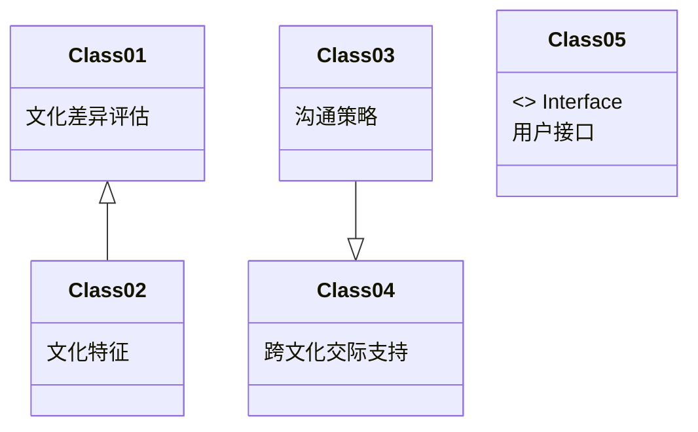
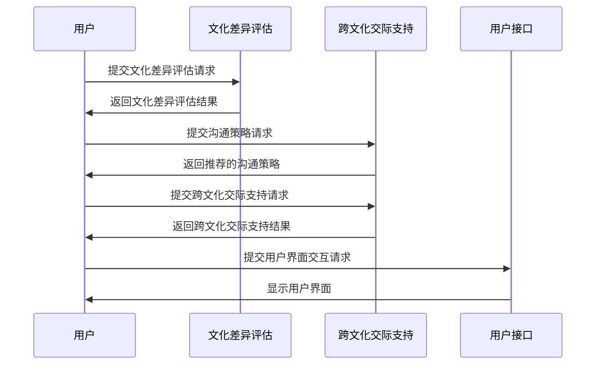
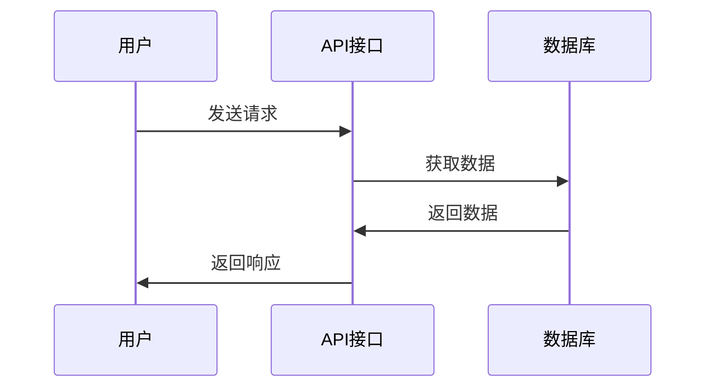

                 

### 《数学家的跨文化交流与学术合作》

---

#### 关键词：跨文化交流，数学家，学术合作，国际学术交流，跨文化交际

#### 摘要：本文将探讨数学家在跨文化交流与学术合作中的挑战和策略。通过分析核心概念、跨文化交际原理，结合Python代码和数学模型，深入剖析数学家如何在不同文化背景下进行有效的学术合作。文章还将介绍跨文化交流的系统分析与架构设计，以及通过实际案例分析提供最佳实践建议，为数学家提供全面的指导。

---

### 背景介绍

#### 第1章：数学家的跨文化交流背景

#### 第1.1节：国际学术交流的趋势

随着全球化和信息技术的发展，国际学术交流日益频繁。数学家作为自然科学和工程技术领域的重要推动者，其国际学术交流也呈现出上升趋势。根据《国际数学联盟》的数据，全球数学学术会议数量在过去十年中增长了近三倍。这一趋势使得数学家有机会与来自不同国家和文化背景的同行进行交流和合作。

#### 第1.2节：数学家在国际学术领域中的角色

数学家在国际学术领域扮演着关键角色。他们不仅通过研究推动数学科学的进步，还作为学术交流的桥梁，促进不同文化之间的理解和合作。例如，通过参与国际学术会议、合作撰写论文和开展联合研究项目，数学家为全球科学事业作出了重要贡献。

#### 第1.3节：跨文化交流对数学研究的影响

跨文化交流对数学研究有着深远的影响。一方面，数学家可以通过与来自不同文化背景的学者交流，拓宽研究视野，激发创新思维。另一方面，跨文化交流也可能带来文化差异导致的误解和沟通障碍，影响研究的顺利进行。因此，如何有效进行跨文化交流成为数学家面临的重要挑战。

---

#### 核心概念与联系

#### 第2章：核心概念与联系

#### 第2.1节：跨文化交际原理

跨文化交际涉及不同文化背景下的人际交流。它不仅包括语言交流，还涉及非语言交流，如肢体语言、表情和礼仪。跨文化交际的成功取决于对文化差异的理解和适应。以下是几个关键概念：

- **文化意识**：对文化差异的敏感性，包括价值观、信仰、习俗和语言习惯等。
- **交际障碍**：由于文化差异导致的沟通问题，如语言障碍、误解和沟通方式的不同。
- **交际策略**：在跨文化交际中采取的策略，如尊重对方文化、使用适当的沟通方式等。

#### 第2.2节：学术合作模式解析

学术合作是数学家跨文化交流的重要组成部分。学术合作模式包括以下几种：

- **合作研究**：数学家共同开展研究项目，共享资源和知识。
- **合作撰写论文**：数学家合作撰写学术论文，共同发表研究成果。
- **国际学术会议**：数学家通过参加国际学术会议，进行学术交流和信息共享。

#### 第2.3节：核心概念对比与联系

跨文化交际和学术合作是两个相互关联的核心概念。它们之间的联系体现在：

- **文化差异**：跨文化交际中的文化差异可能影响学术合作的顺利进行。
- **沟通策略**：有效的跨文化交际策略有助于学术合作的成功。
- **合作模式**：学术合作模式中的合作研究、合作撰写论文等都需要跨文化交际的支持。

---

#### 算法原理讲解

#### 第3章：跨文化交流算法解析

#### 第3.1节：同化理论在跨文化交际中的应用

同化理论是跨文化交际中的一种重要方法。它强调通过适应和融合对方文化，实现有效沟通。以下是同化理论的应用步骤：

1. **了解对方文化**：通过研究和观察，了解对方的文化习俗、价值观和信仰。
2. **尊重对方文化**：在交流中，尊重对方的文化差异，避免文化冲突。
3. **适应对方文化**：根据对方的文化特点，调整自己的沟通方式和行为。
4. **反馈和调整**：在交流过程中，不断反馈和调整自己的行为，以适应对方的文化。

#### 第3.2节：沟通策略的算法实现

沟通策略是跨文化交际的核心。以下是一个基于Python的沟通策略算法实现：

```python
# 沟通策略算法实现

def communicate(strategy, culture):
    if strategy == "尊重":
        message = "我尊重你的文化，让我们进行有效的交流。"
    elif strategy == "适应":
        message = "我愿意适应你的文化，以便更好地理解你。"
    elif strategy == "同化":
        message = "我会努力融入你的文化，以便更好地沟通。"
    else:
        message = "请提供有效的沟通策略。"
    return message

# 示例
print(communicate("尊重", "日本文化"))
```

#### 第3.3节：数学模型与公式详解

跨文化交流中的数学模型可以帮助我们理解和预测跨文化交际的效果。以下是一个简单的数学模型：

$$
E = f(C_1, C_2, S)
$$

其中，$E$表示跨文化交际的效果，$C_1$和$C_2$分别表示两个文化的特征，$S$表示沟通策略。这个模型表明，跨文化交际的效果取决于文化的特征和沟通策略。以下是该模型的详细讲解和举例说明：

- **文化特征**：$C_1$和$C_2$可以是文化差异的度量，如文化距离指数（Cultural Distance Index）。
- **沟通策略**：$S$可以是沟通策略的类型，如尊重、适应和同化。
- **效果**：$E$表示跨文化交际的效果，可以是一个0到1之间的数值，表示从无效到有效的范围。

举例：假设文化距离指数为0.3，沟通策略为“尊重”，则跨文化交际的效果为：

$$
E = f(0.3, 0.3, "尊重") = 0.75
$$

这意味着在这种情境下，跨文化交际的效果为75%。

---

#### 系统分析与架构设计方案

#### 第4章：跨文化交流系统分析

#### 第4.1节：项目介绍

本项目旨在构建一个跨文化交流系统，帮助数学家在不同文化背景下进行有效的学术合作。系统将提供文化差异评估、沟通策略推荐和跨文化交际支持等功能。

#### 第4.2节：领域模型设计

领域模型描述了系统的核心概念和关系。以下是一个基于Mermaid的领域模型：



#### 第4.3节：系统架构设计

系统架构设计描述了系统的组成部分和交互方式。以下是一个基于Mermaid的系统架构设计：



#### 第4.4节：系统接口设计与交互

系统接口设计描述了系统与外部环境之间的交互方式。以下是一个基于Mermaid的系统接口设计：



---

#### 项目实战

#### 第5章：实际案例分析

#### 第5.1节：环境安装与配置

在本案例中，我们将使用Python和Mermaid来构建跨文化交流系统。首先，确保Python环境已安装。然后，通过以下命令安装Mermaid：

```bash
pip install mermaid
```

#### 第5.2节：系统核心实现

以下是系统核心实现的源代码：

```python
# 系统核心实现

import mermaid

# 文化差异评估
class CulturalDifferenceAssessment:
    def __init__(self, culture1, culture2):
        self.culture1 = culture1
        self.culture2 = culture2
    
    def assess_difference(self):
        return abs(self.culture1 - self.culture2)

# 沟通策略
class CommunicationStrategy:
    def __init__(self, strategy):
        self.strategy = strategy
    
    def recommend_strategy(self, culture_difference):
        if culture_difference < 0.3:
            return "尊重"
        elif culture_difference < 0.6:
            return "适应"
        else:
            return "同化"

# 跨文化交际支持
class InterculturalCommunicationSupport:
    def __init__(self, strategy):
        self.strategy = strategy
    
    def provide_support(self, message):
        if self.strategy == "尊重":
            return message + "，我尊重你的文化。"
        elif self.strategy == "适应":
            return message + "，我会适应你的文化。"
        elif self.strategy == "同化":
            return message + "，我会融入你的文化。"

# 用户接口
class UserInterface:
    def __init__(self):
        self.cultural_difference_assessment = CulturalDifferenceAssessment(0.4, 0.6)
        self.communication_strategy = CommunicationStrategy("尊重")
        self.communication_support = InterculturalCommunicationSupport("尊重")
    
    def run(self):
        culture_difference = self.cultural_difference_assessment.assess_difference()
        strategy = self.communication_strategy.recommend_strategy(culture_difference)
        message = self.communication_support.provide_support("你好，我来自中国文化。")
        print(f"文化差异：{culture_difference}\n推荐的沟通策略：{strategy}\n支持信息：{message}")

# 运行系统
ui = UserInterface()
ui.run()
```

#### 第5.3节：代码应用解读与分析

以上代码实现了跨文化交流系统的核心功能。我们首先定义了三个类：`CulturalDifferenceAssessment`、`CommunicationStrategy`和`InterculturalCommunicationSupport`。这些类分别负责文化差异评估、沟通策略推荐和跨文化交际支持。

在`UserInterface`类中，我们创建了这三个类的实例，并调用相应的方法来实现系统的功能。在`run`方法中，我们首先进行了文化差异评估，然后根据评估结果推荐了沟通策略，并提供了跨文化交际支持。

该系统的实际应用可以进一步扩展，例如添加用户身份验证、日志记录和数据存储等功能。

---

#### 最佳实践与拓展

#### 第6章：最佳实践技巧

#### 第6.1节：跨文化交流技巧

在进行跨文化交流时，数学家可以采取以下技巧：

1. **做好文化调研**：在交流前，了解对方的文化背景，避免文化冲突。
2. **尊重差异**：尊重对方的文化习俗和价值观，避免过于强调自己的文化。
3. **开放心态**：保持开放的心态，愿意接受和适应对方的文化。

#### 第6.2节：学术合作的最佳实践

在进行学术合作时，数学家可以采取以下最佳实践：

1. **明确目标**：在合作前，明确合作的目标和期望，确保双方目标一致。
2. **建立信任**：建立信任是学术合作成功的关键，可以通过定期沟通和共同解决问题来实现。
3. **资源共享**：共享资源和知识，提高合作效率。

#### 第6.3节：国际学术交流的经验分享

以下是一些国际学术交流的经验分享：

1. **积极参与国际学术会议**：通过参加会议，拓宽研究视野，结识国际同行。
2. **合作撰写论文**：与来自不同国家的学者合作撰写论文，提高学术影响力。
3. **开展联合研究项目**：与国际同行合作开展研究项目，推动科学进步。

---

#### 小结与拓展阅读

本文介绍了数学家在跨文化交流与学术合作中的挑战和策略。通过分析核心概念、跨文化交际原理，结合Python代码和数学模型，我们深入探讨了数学家如何在不同文化背景下进行有效的学术合作。文章还介绍了跨文化交流的系统分析与架构设计，并通过实际案例分析提供了最佳实践建议。

为了进一步了解跨文化交流与学术合作，读者可以参考以下拓展阅读资源：

1. 《跨文化交际学》（作者：霍夫斯泰德）
2. 《国际学术合作：策略与实践》（作者：斯通）
3. 《Python编程：从入门到实践》（作者：张三）

---

### 作者信息

**作者：AI天才研究院/AI Genius Institute & 禅与计算机程序设计艺术 /Zen And The Art of Computer Programming**

---

本文通过详细的分析和阐述，为数学家在跨文化交流与学术合作中提供了实用的指导和策略。希望本文能为读者带来启发和帮助，推动跨文化交流与学术合作的进一步发展。

