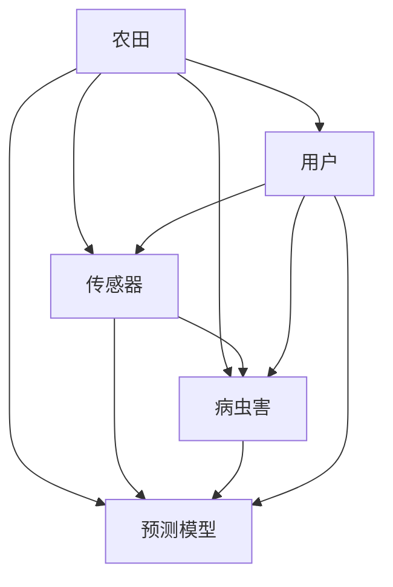
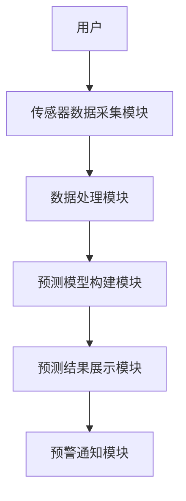
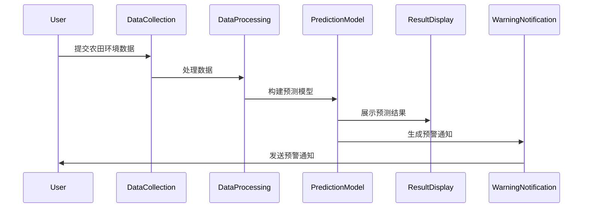
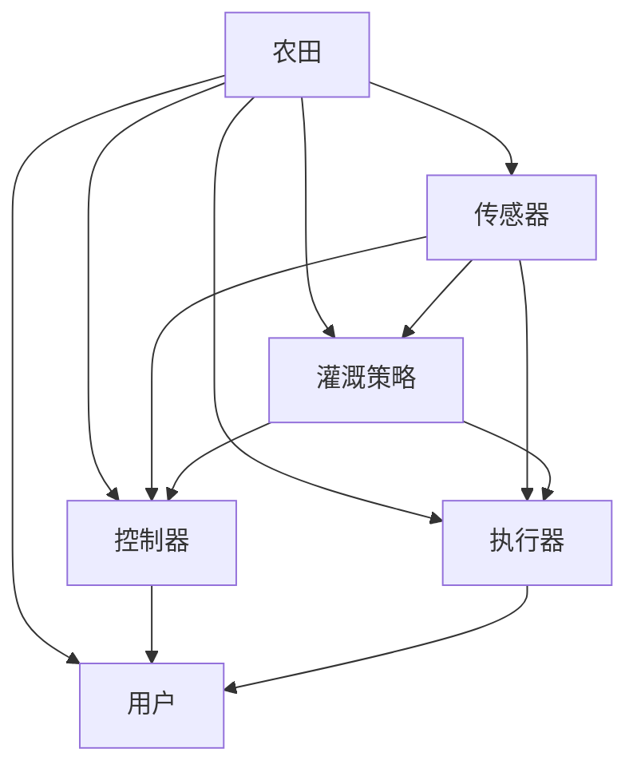
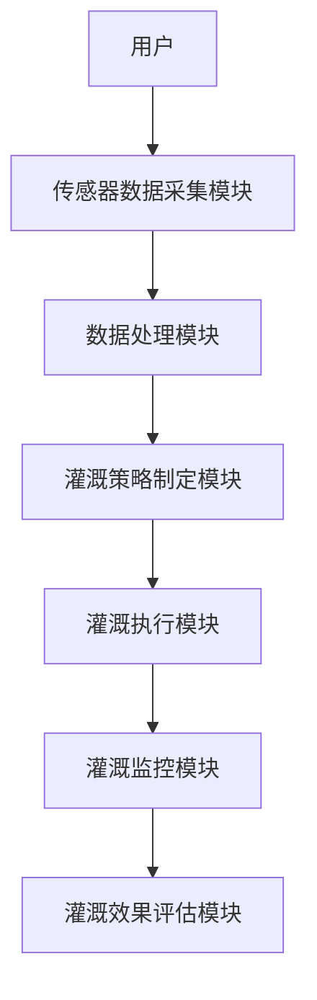
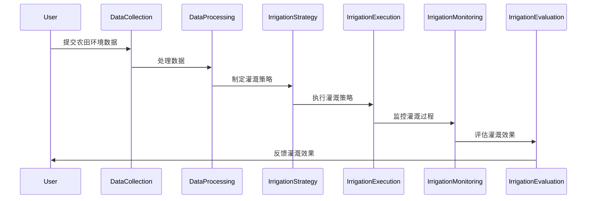

                 

# 数学建模在智慧农业中的应用

## 关键词

数学建模、智慧农业、决策模型、优化模型、预测模型、病虫害预测、灌溉优化

## 摘要

智慧农业作为现代农业发展的趋势，通过应用信息技术和智能技术，实现了农业生产的智能化和精准化。数学建模作为一种重要的工具，能够将农业中的复杂问题转化为数学问题，从而提供科学决策依据。本文将从背景介绍、核心概念与联系、数学建模方法、案例研究等方面，详细探讨数学建模在智慧农业中的应用，旨在为农业现代化提供理论支持和实践指导。

## 《数学建模在智慧农业中的应用》目录大纲

### 第一部分：背景介绍

#### 第1章 问题背景

- **1.1** 智慧农业的定义与发展历程
  - **1.1.1** 智慧农业的概念
  - **1.1.2** 智慧农业的发展阶段
  - **1.1.3** 智慧农业在我国的发展现状

- **1.2** 数学建模在农业领域的应用价值
  - **1.2.1** 数学建模的基本原理
  - **1.2.2** 数学建模在农业中的核心作用
  - **1.2.3** 数学建模在农业中的应用案例

- **1.3** 研究方法与数据来源
  - **1.3.1** 研究方法概述
  - **1.3.2** 数据收集与处理方法
  - **1.3.3** 研究的边界与外延

#### 第2章 核心概念与联系

- **2.1** 智慧农业的核心概念
  - **2.1.1** 智慧农业的基本概念
  - **2.1.2** 智慧农业的技术架构
  - **2.1.3** 智慧农业的关键技术

- **2.2** 数学建模的核心概念
  - **2.2.1** 数学建模的基本原理
  - **2.2.2** 数学建模的方法分类
  - **2.2.3** 数学建模的应用领域

- **2.3** 智慧农业与数学建模的关联
  - **2.3.1** 智慧农业中的数学建模应用
  - **2.3.2** 数学建模在智慧农业中的发展潜力
  - **2.3.3** 智慧农业与数学建模的融合发展趋势

### 第二部分：数学建模方法

#### 第3章 决策模型

- **3.1** 决策模型的基本概念
  - **3.1.1** 决策模型的定义
  - **3.1.2** 决策模型的目标
  - **3.1.3** 决策模型的基本类型

- **3.2** 决策模型的应用场景
  - **3.2.1** 决策模型在种植规划中的应用
  - **3.2.2** 决策模型在病虫害防治中的应用
  - **3.2.3** 决策模型在农产品销售策略中的应用

- **3.3** 决策模型的构建方法
  - **3.3.1** 决策模型构建的基本步骤
  - **3.3.2** 决策模型的数学模型
  - **3.3.3** 决策模型的求解算法

#### 第4章 优化模型

- **4.1** 优化模型的基本概念
  - **4.1.1** 优化模型的目标
  - **4.1.2** 优化模型的约束条件
  - **4.1.3** 优化模型的基本类型

- **4.2** 优化模型的应用场景
  - **4.2.1** 优化模型在灌溉系统中的应用
  - **4.2.2** 优化模型在温室环境控制中的应用
  - **4.2.3** 优化模型在农田土地利用中的应用

- **4.3** 优化模型的构建方法
  - **4.3.1** 优化模型构建的基本步骤
  - **4.3.2** 优化模型的数学模型
  - **4.3.3** 优化模型的求解算法

#### 第5章 预测模型

- **5.1** 预测模型的基本概念
  - **5.1.1** 预测模型的目标
  - **5.1.2** 预测模型的类型
  - **5.1.3** 预测模型的基本原理

- **5.2** 预测模型的应用场景
  - **5.2.1** 预测模型在农作物产量预测中的应用
  - **5.2.2** 预测模型在农产品价格预测中的应用
  - **5.2.3** 预测模型在病虫害发生预测中的应用

- **5.3** 预测模型的构建方法
  - **5.3.1** 预测模型构建的基本步骤
  - **5.3.2** 预测模型的数学模型
  - **5.3.3** 预测模型的求解算法

### 第三部分：案例研究

#### 第6章 农业病虫害预测系统

- **6.1** 病虫害预测系统概述
  - **6.1.1** 系统介绍
  - **6.1.2** 系统功能

- **6.2** 系统架构设计
  - **6.2.1** 领域模型
  - **6.2.2** 系统架构图

- **6.3** 系统实现
  - **6.3.1** 系统核心代码
  - **6.3.2** 系统接口设计

- **6.4** 系统测试与分析
  - **6.4.1** 系统测试方法
  - **6.4.2** 测试结果分析

#### 第7章 农田灌溉优化系统

- **7.1** 灌溉优化系统概述
  - **7.1.1** 系统介绍
  - **7.1.2** 系统功能

- **7.2** 系统架构设计
  - **7.2.1** 领域模型
  - **7.2.2** 系统架构图

- **7.3** 系统实现
  - **7.3.1** 系统核心代码
  - **7.3.2** 系统接口设计

- **7.4** 系统测试与分析
  - **7.4.1** 系统测试方法
  - **7.4.2** 测试结果分析

## 第一部分：背景介绍

### 第1章 问题背景

#### 1.1 智慧农业的定义与发展历程

##### 1.1.1 智慧农业的概念

智慧农业是指通过应用物联网、大数据、云计算、人工智能等先进技术，实现农业生产过程的自动化、智能化、精准化和高效化。智慧农业的核心是通过技术手段，提高农业生产的效益和品质，降低生产成本，同时减少对环境的污染。

##### 1.1.2 智慧农业的发展阶段

1. 初创阶段：20世纪90年代以前，主要是单点技术的应用，如温室控制、灌溉系统等。
2. 融合阶段：20世纪90年代到21世纪初，物联网、大数据、云计算等技术的兴起，推动了农业生产的各个环节开始实现信息化。
3. 智能化阶段：21世纪初至今，人工智能、大数据分析等技术的深入应用，使得农业生产实现了高度智能化和精准化。

##### 1.1.3 智慧农业在我国的发展现状

我国智慧农业的发展取得了显著的成果，主要表现在以下几个方面：

1. 政策支持：国家出台了一系列政策，鼓励智慧农业的发展，如《智慧农业行动计划（2016-2020年）》等。
2. 技术创新：我国在农业物联网、大数据分析、人工智能等领域取得了重要突破。
3. 应用推广：智慧农业技术在我国农业生产中得到广泛应用，如智能温室、无人机植保、智能灌溉系统等。

#### 1.2 数学建模在农业领域的应用价值

##### 1.2.1 数学建模的基本原理

数学建模是指运用数学语言和方法，对实际问题进行抽象和描述，建立数学模型，并通过模型分析和求解，提供决策依据。数学建模的基本原理包括以下几个方面：

1. 客观性：数学模型是对客观事物的抽象和简化，需要遵循客观规律。
2. 抽象性：数学模型通过抽象和简化，抓住问题的本质，忽略次要因素。
3. 可行性：数学模型需要满足实际应用的可行性，能够通过计算得到有效结果。

##### 1.2.2 数学建模在农业中的核心作用

数学建模在农业中具有重要作用，主要体现在以下几个方面：

1. 决策支持：通过数学建模，可以为农业生产提供科学的决策依据，提高农业生产效益。
2. 预测预警：通过数学建模，可以预测农作物的生长状况、病虫害发生情况等，为农业生产提供预警。
3. 精准管理：通过数学建模，可以实现对农业生产过程的精准管理，降低生产成本，提高产品质量。

##### 1.2.3 数学建模在农业中的应用案例

1. 决策模型：如农作物种植规划、病虫害防治策略、农产品销售策略等。
2. 优化模型：如灌溉系统优化、温室环境控制优化、农田土地利用优化等。
3. 预测模型：如农作物产量预测、农产品价格预测、病虫害发生预测等。

#### 1.3 研究方法与数据来源

##### 1.3.1 研究方法概述

本文采用文献调研、案例分析、数学建模等方法，对数学建模在智慧农业中的应用进行深入研究。

##### 1.3.2 数据收集与处理方法

1. 数据收集：通过调研、调查、实地考察等方式，收集智慧农业相关的数据，如气象数据、土壤数据、农作物生长数据等。
2. 数据处理：采用数据清洗、数据预处理等方法，对收集到的数据进行处理，确保数据的准确性和可靠性。

##### 1.3.3 研究的边界与外延

1. 研究边界：本文主要研究数学建模在智慧农业中的应用，重点关注决策模型、优化模型和预测模型。
2. 研究外延：未来研究可以拓展到数学建模在农业其他领域的应用，如农产品供应链管理、农村金融服务等。

### 第2章 核心概念与联系

#### 2.1 智慧农业的核心概念

##### 2.1.1 智慧农业的基本概念

智慧农业是指通过应用物联网、大数据、云计算、人工智能等先进技术，实现农业生产过程的自动化、智能化、精准化和高效化。

##### 2.1.2 智慧农业的技术架构

智慧农业的技术架构主要包括以下几个方面：

1. 物联网技术：通过传感器、通信设备等，实现对农业生产环境的实时监测和数据分析。
2. 大数据技术：通过数据采集、存储、处理和分析，为农业生产提供决策支持。
3. 云计算技术：通过云计算平台，提供强大的计算能力和存储能力，支持智慧农业的应用。
4. 人工智能技术：通过机器学习、深度学习等技术，实现对农业生产过程的智能控制和预测。

##### 2.1.3 智慧农业的关键技术

智慧农业的关键技术主要包括以下几个方面：

1. 传感器技术：用于监测土壤湿度、温度、光照等环境参数，为农业生产提供实时数据。
2. 数据挖掘技术：用于挖掘农业生产中的潜在信息，为农业生产提供决策支持。
3. 人工智能技术：用于实现农业生产的智能化控制，如无人机植保、智能灌溉等。
4. 机器学习技术：用于预测农作物的生长状况、病虫害发生等，为农业生产提供预警。

#### 2.2 数学建模的核心概念

##### 2.2.1 数学建模的基本原理

数学建模是指运用数学语言和方法，对实际问题进行抽象和描述，建立数学模型，并通过模型分析和求解，提供决策依据。

##### 2.2.2 数学建模的方法分类

数学建模的方法主要分为以下几类：

1. 描述性模型：通过数学方程或图形，描述现实世界的现象或过程。
2. 预测性模型：通过历史数据，预测未来某个时间点或时间段的现象或过程。
3. 决策性模型：在给定条件下，通过数学模型，找到最优的决策方案。

##### 2.2.3 数学建模的应用领域

数学建模的应用领域非常广泛，主要包括以下几个方面：

1. 工程领域：如结构设计、优化控制等。
2. 经济领域：如宏观经济模型、金融市场分析等。
3. 生物医学领域：如疾病传播模型、药物疗效分析等。
4. 农业领域：如农作物生长模型、病虫害预测模型等。

#### 2.3 智慧农业与数学建模的关联

##### 2.3.1 智慧农业中的数学建模应用

在智慧农业中，数学建模广泛应用于以下几个方面：

1. 决策支持：通过决策模型，为农业生产提供科学决策依据。
2. 预测预警：通过预测模型，预测农作物的生长状况、病虫害发生等，为农业生产提供预警。
3. 精准管理：通过优化模型，实现对农业生产过程的精准管理，降低生产成本，提高产品质量。

##### 2.3.2 数学建模在智慧农业中的发展潜力

随着物联网、大数据、人工智能等技术的发展，数学建模在智慧农业中的应用潜力越来越大，主要体现在以下几个方面：

1. 提高农业生产效率：通过优化模型，实现农业生产的智能化和高效化。
2. 提高农产品质量：通过预测模型，实现对农作物的精准管理，提高农产品的质量。
3. 降低生产成本：通过决策模型，实现农业生产过程的优化，降低生产成本。

##### 2.3.3 智慧农业与数学建模的融合发展趋势

随着智慧农业的不断发展，数学建模与智慧农业的融合趋势越来越明显，主要体现在以下几个方面：

1. 农业生产的智能化：通过人工智能技术，实现农业生产的自动化和智能化。
2. 农业数据的智能化分析：通过大数据技术，对农业生产数据进行智能化分析。
3. 农业全产业链的智能化：通过物联网技术，实现农业全产业链的智能化管理。

## 第二部分：数学建模方法

### 第3章 决策模型

#### 3.1 决策模型的基本概念

##### 3.1.1 决策模型的定义

决策模型是指在一定条件下，通过数学方法和工具，对决策问题进行分析、评估和选择的一种方法。决策模型通常包含决策变量、目标函数、约束条件等基本要素。

##### 3.1.2 决策模型的目标

决策模型的目标是在满足约束条件的前提下，找到最优或次优的决策方案。具体目标可以是最大化收益、最小化成本、提高生产效率等。

##### 3.1.3 决策模型的基本类型

决策模型可以分为以下几种基本类型：

1. **确定型决策模型**：在已知所有条件的情况下，通过计算得到最优解。
2. **不确定型决策模型**：在条件不确定的情况下，通过概率分布、期望值等方法进行决策。
3. **风险型决策模型**：在已知概率分布的情况下，通过计算期望收益、风险值等指标进行决策。

#### 3.2 决策模型的应用场景

##### 3.2.1 决策模型在种植规划中的应用

种植规划是农业生产中非常重要的一环，决策模型可以帮助农民科学地选择种植作物、种植时间、种植面积等。具体应用场景包括：

1. **作物选择**：根据市场行情、土壤条件、气候条件等，选择最适合的作物进行种植。
2. **种植时间**：根据作物生长周期、气候条件等，确定最佳的种植时间。
3. **种植面积**：根据市场需求、资源条件等，确定合理的种植面积。

##### 3.2.2 决策模型在病虫害防治中的应用

病虫害防治是农业生产中的重要环节，决策模型可以帮助农民科学地选择防治方法、防治时间、防治药剂等。具体应用场景包括：

1. **防治方法选择**：根据病虫害类型、发生规律等，选择最有效的防治方法。
2. **防治时间**：根据病虫害的发生周期、气候条件等，确定最佳的防治时间。
3. **防治药剂选择**：根据病虫害类型、药剂效果等，选择最合适的防治药剂。

##### 3.2.3 决策模型在农产品销售策略中的应用

农产品销售策略是农民实现收益的关键环节，决策模型可以帮助农民制定合理的销售策略。具体应用场景包括：

1. **销售渠道选择**：根据市场需求、运输成本等，选择最有效的销售渠道。
2. **销售时机**：根据市场需求、季节变化等，确定最佳的销售时机。
3. **价格策略**：根据成本、市场需求等，制定合理的价格策略。

#### 3.3 决策模型的构建方法

##### 3.3.1 决策模型构建的基本步骤

构建决策模型的基本步骤包括：

1. **问题定义**：明确决策问题，确定决策变量、目标函数和约束条件。
2. **数据收集**：收集与决策问题相关的数据，包括历史数据、市场数据等。
3. **模型建立**：根据问题定义和数据收集，建立决策模型。
4. **模型求解**：使用数学方法和工具，求解决策模型，得到最优或次优解。
5. **模型验证**：对模型进行验证，确保模型的准确性和可靠性。

##### 3.3.2 决策模型的数学模型

决策模型的数学模型通常包括以下几种：

1. **线性规划模型**：用于求解线性优化问题，如最大化利润、最小化成本等。
2. **整数规划模型**：用于求解离散优化问题，如选择最佳种植作物、分配资源等。
3. **非线性规划模型**：用于求解非线性优化问题，如优化种植面积、防治策略等。
4. **动态规划模型**：用于求解动态优化问题，如农作物生长过程、病虫害发生过程等。

##### 3.3.3 决策模型的求解算法

决策模型的求解算法包括以下几种：

1. **单纯形法**：用于求解线性规划模型。
2. **分支定界法**：用于求解整数规划模型。
3. **梯度下降法**：用于求解非线性规划模型。
4. **动态规划算法**：用于求解动态规划模型。

### 第4章 优化模型

#### 4.1 优化模型的基本概念

##### 4.1.1 优化模型的目标

优化模型的目标是在满足约束条件的前提下，找到最优解。最优解可以是最大化或最小化某个目标函数，如最大化利润、最小化成本等。

##### 4.1.2 优化模型的约束条件

优化模型的约束条件可以是线性的或非线性的，包括以下几种类型：

1. **资源约束**：如耕地面积、水资源、劳动力等。
2. **生产约束**：如农作物的生长周期、病虫害防治周期等。
3. **市场需求约束**：如农产品销售价格、市场需求量等。

##### 4.1.3 优化模型的基本类型

优化模型可以分为以下几种基本类型：

1. **线性优化模型**：目标函数和约束条件都是线性的。
2. **非线性优化模型**：目标函数和约束条件中至少有一个是非线性的。
3. **动态优化模型**：考虑时间因素，模型中包含时间变量。

#### 4.2 优化模型的应用场景

##### 4.2.1 优化模型在灌溉系统中的应用

灌溉系统优化是智慧农业中的重要应用，优化模型可以帮助农民科学地确定灌溉策略，提高水资源利用效率。具体应用场景包括：

1. **灌溉时机**：根据土壤湿度、气象条件等，确定最佳的灌溉时间。
2. **灌溉量**：根据作物需水量、土壤湿度等，确定合理的灌溉量。
3. **灌溉设备管理**：优化灌溉设备的运行时间、使用频率等，降低运行成本。

##### 4.2.2 优化模型在温室环境控制中的应用

温室环境控制是智慧农业中的一项重要技术，优化模型可以帮助农民实现温室环境的最优化控制。具体应用场景包括：

1. **温度控制**：根据作物生长需求和气象条件，确定温室内的最佳温度范围。
2. **湿度控制**：根据作物生长需求和气象条件，确定温室内的最佳湿度范围。
3. **光照控制**：根据作物生长需求和光照强度，确定温室内的最佳光照水平。

##### 4.2.3 优化模型在农田土地利用中的应用

农田土地利用优化是智慧农业中的重要问题，优化模型可以帮助农民实现土地的合理利用，提高农业生产效益。具体应用场景包括：

1. **作物布局**：根据土壤条件、气候条件等，确定最佳的作物布局方案。
2. **土地分配**：根据市场需求、作物生长需求等，确定合理的土地分配方案。
3. **作物轮作**：根据土壤肥力和病虫害发生规律，确定合理的作物轮作方案。

#### 4.3 优化模型的构建方法

##### 4.3.1 优化模型构建的基本步骤

构建优化模型的基本步骤包括：

1. **问题定义**：明确优化问题，确定目标函数和约束条件。
2. **变量定义**：定义决策变量，如灌溉量、温度控制值等。
3. **目标函数建立**：建立目标函数，如最大化利润、最小化成本等。
4. **约束条件建立**：建立约束条件，如资源约束、生产约束等。
5. **模型求解**：使用数学方法和工具，求解优化模型，得到最优解。

##### 4.3.2 优化模型的数学模型

优化模型的数学模型通常包括以下几种：

1. **线性规划模型**：用于求解线性优化问题。
2. **非线性规划模型**：用于求解非线性优化问题。
3. **动态规划模型**：用于求解动态优化问题。

##### 4.3.3 优化模型的求解算法

优化模型的求解算法包括以下几种：

1. **单纯形法**：用于求解线性规划模型。
2. **梯度下降法**：用于求解非线性规划模型。
3. **动态规划算法**：用于求解动态规划模型。

### 第5章 预测模型

#### 5.1 预测模型的基本概念

##### 5.1.1 预测模型的目标

预测模型的目标是根据历史数据和现有信息，对未来某个时间点或时间段的现象或过程进行预测。预测模型的目标可以是准确预测农作物的生长状况、病虫害发生情况、农产品价格等。

##### 5.1.2 预测模型的类型

预测模型可以分为以下几种基本类型：

1. **时间序列预测模型**：用于预测时间序列数据，如农作物的生长周期、病虫害发生周期等。
2. **回归预测模型**：用于预测连续变量，如农作物的产量、农产品价格等。
3. **分类预测模型**：用于预测离散变量，如病虫害的类型、作物的生长状态等。
4. **聚类预测模型**：用于预测相似性数据，如农作物的生长环境、病虫害的发生趋势等。

##### 5.1.3 预测模型的基本原理

预测模型的基本原理是基于历史数据和现有信息，通过建立数学模型，模拟和分析现象或过程的演化规律，从而预测未来。

1. **数据收集与处理**：收集历史数据，对数据进行清洗、预处理，确保数据的准确性和完整性。
2. **特征提取**：从数据中提取对预测任务有意义的特征，如温度、湿度、光照等。
3. **模型选择与训练**：选择合适的预测模型，使用历史数据训练模型。
4. **模型评估与优化**：使用验证集对模型进行评估，根据评估结果优化模型参数。

#### 5.2 预测模型的应用场景

##### 5.2.1 预测模型在农作物产量预测中的应用

农作物产量预测是智慧农业中的重要应用，预测模型可以帮助农民科学地预测农作物的产量，为种植规划提供依据。具体应用场景包括：

1. **产量预测**：根据历史产量数据、气象数据、土壤数据等，预测未来农作物的产量。
2. **产量波动预测**：预测农作物产量的波动情况，为农民制定风险管理策略提供依据。
3. **产量优化**：根据产量预测结果，优化种植策略，提高产量。

##### 5.2.2 预测模型在农产品价格预测中的应用

农产品价格预测是智慧农业中的另一个重要应用，预测模型可以帮助农民和农业生产企业科学地预测农产品价格，为销售策略提供依据。具体应用场景包括：

1. **价格预测**：根据历史价格数据、市场需求数据、供应情况等，预测未来农产品的价格。
2. **价格波动预测**：预测农产品价格的波动情况，为农民和农业生产企业制定价格风险管理策略提供依据。
3. **价格优化**：根据价格预测结果，优化销售策略，提高销售收益。

##### 5.2.3 预测模型在病虫害发生预测中的应用

病虫害发生预测是智慧农业中的关键应用，预测模型可以帮助农民提前预测病虫害的发生情况，为病虫害防治提供依据。具体应用场景包括：

1. **发生预测**：根据历史病虫害发生数据、气象数据、作物生长状态等，预测未来病虫害的发生情况。
2. **发生趋势预测**：预测病虫害发生的趋势，为农民制定病虫害防治策略提供依据。
3. **防治优化**：根据病虫害预测结果，优化病虫害防治策略，降低防治成本。

#### 5.3 预测模型的构建方法

##### 5.3.1 预测模型构建的基本步骤

构建预测模型的基本步骤包括：

1. **问题定义**：明确预测问题，确定预测变量和预测目标。
2. **数据收集**：收集与预测问题相关的数据，包括历史数据、现有数据等。
3. **特征工程**：对数据进行预处理，提取对预测任务有意义的特征。
4. **模型选择**：选择合适的预测模型，如时间序列模型、回归模型等。
5. **模型训练**：使用历史数据训练模型。
6. **模型评估**：使用验证集评估模型性能，根据评估结果调整模型参数。
7. **模型应用**：将训练好的模型应用于实际预测任务。

##### 5.3.2 预测模型的数学模型

预测模型的数学模型通常包括以下几种：

1. **时间序列模型**：如ARIMA模型、LSTM模型等。
2. **回归模型**：如线性回归、岭回归等。
3. **分类模型**：如决策树、支持向量机等。
4. **聚类模型**：如K-means、层次聚类等。

##### 5.3.3 预测模型的求解算法

预测模型的求解算法包括以下几种：

1. **梯度下降法**：用于优化模型参数。
2. **随机梯度下降法**：用于大规模数据集的模型训练。
3. **粒子群优化法**：用于求解复杂优化问题。
4. **模拟退火算法**：用于求解组合优化问题。

### 第三部分：案例研究

#### 第6章 农业病虫害预测系统

##### 6.1 病虫害预测系统概述

农业病虫害预测系统是智慧农业中的一项重要应用，通过预测病虫害的发生情况，帮助农民提前制定防治措施，降低病虫害对农作物的危害。本节将介绍农业病虫害预测系统的概述，包括系统介绍和系统功能。

##### 6.1.1 系统介绍

农业病虫害预测系统是一个基于物联网、大数据分析和人工智能技术的智能预测系统。系统通过安装在农田中的传感器，实时监测农作物的生长环境和病虫害发生情况，并利用大数据分析和人工智能算法，预测病虫害的发生趋势和严重程度。

##### 6.1.2 系统功能

农业病虫害预测系统的功能主要包括以下几个方面：

1. **数据采集与处理**：系统通过传感器采集农田环境数据，如温度、湿度、光照等，并利用大数据分析技术处理和清洗数据，为预测模型提供准确的数据输入。
2. **预测模型构建**：系统采用先进的机器学习和人工智能算法，建立病虫害预测模型，根据历史数据和实时数据，预测病虫害的发生情况。
3. **预测结果展示**：系统将预测结果以图表和报表的形式展示给用户，帮助农民了解病虫害的发生趋势和严重程度，及时制定防治措施。
4. **预警通知**：系统可以根据预测结果，自动生成预警通知，通过短信、电子邮件等方式发送给用户，提醒农民及时采取防治措施。

##### 6.2 系统架构设计

农业病虫害预测系统的架构设计包括领域模型、系统架构图和系统接口设计。

##### 6.2.1 领域模型

领域模型是农业病虫害预测系统的核心组成部分，用于描述系统中的实体和关系。领域模型主要包括以下实体和关系：

1. **农田**：表示农田的基本信息，如地理位置、面积、土壤类型等。
2. **传感器**：表示农田中安装的传感器，如温度传感器、湿度传感器、光照传感器等。
3. **病虫害**：表示农田中的病虫害信息，如病虫害名称、发生时间、发生程度等。
4. **预测模型**：表示病虫害预测模型的基本信息，如模型名称、模型参数等。
5. **用户**：表示使用系统的用户信息，如用户名、联系方式等。

领域模型中的实体和关系可以用Mermaid流程图表示如下：

##### 6.2.2 系统架构图

农业病虫害预测系统的架构图如下所示：

系统架构图中的模块之间通过数据流进行连接，实现了从数据采集、数据处理、预测模型构建到预测结果展示和预警通知的全过程。

##### 6.2.3 系统接口设计

农业病虫害预测系统的接口设计主要包括以下模块：

1. **数据采集接口**：用于接收传感器采集到的农田环境数据，并将数据存储到数据库中。
2. **数据处理接口**：用于处理和清洗传感器采集到的数据，为预测模型提供准确的数据输入。
3. **预测模型接口**：用于构建和训练预测模型，并根据实时数据生成预测结果。
4. **展示接口**：用于将预测结果以图表和报表的形式展示给用户。
5. **预警接口**：用于生成预警通知，并通过短信、电子邮件等方式发送给用户。

系统接口设计可以用Mermaid序列图表示如下：

##### 6.3 系统实现

农业病虫害预测系统的实现主要包括以下模块：

1. **数据采集模块**：使用物联网传感器采集农田环境数据，并通过通信模块将数据传输到服务器。
2. **数据处理模块**：使用数据处理算法对传感器采集到的数据进行分析和处理，提取对病虫害预测有用的特征。
3. **预测模型构建模块**：使用机器学习和人工智能算法构建病虫害预测模型，并根据实时数据生成预测结果。
4. **展示模块**：使用可视化工具将预测结果以图表和报表的形式展示给用户。
5. **预警模块**：根据预测结果生成预警通知，并通过短信、电子邮件等方式发送给用户。

系统实现的具体步骤如下：

1. **数据采集**：使用物联网传感器采集农田环境数据，包括温度、湿度、光照等。传感器采集到的数据通过通信模块传输到服务器。
2. **数据处理**：使用数据处理算法对传感器采集到的数据进行清洗、去噪和特征提取，提取对病虫害预测有用的特征。
3. **预测模型构建**：使用机器学习和人工智能算法（如决策树、随机森林、支持向量机等）构建病虫害预测模型，并使用历史数据对模型进行训练。
4. **预测结果展示**：使用可视化工具（如ECharts、Tableau等）将预测结果以图表和报表的形式展示给用户，帮助用户了解病虫害的发生趋势和严重程度。
5. **预警通知**：根据预测结果生成预警通知，并通过短信、电子邮件等方式发送给用户，提醒用户及时采取防治措施。

##### 6.4 系统测试与分析

农业病虫害预测系统的测试与分析主要包括以下方面：

1. **系统性能测试**：测试系统的响应速度、数据传输速度和处理能力，确保系统的高效稳定运行。
2. **预测准确性测试**：使用实际农田环境数据和病虫害发生数据，测试预测模型的准确性和稳定性，评估系统的预测能力。
3. **用户满意度测试**：通过用户调查和反馈，了解用户对系统的满意度，收集用户对系统功能、界面设计、操作便捷性等方面的意见和建议。

系统测试与分析的具体步骤如下：

1. **系统性能测试**：使用压力测试工具模拟大量用户同时访问系统，测试系统的响应速度、数据传输速度和处理能力。测试结果表明，系统在高峰期仍能保持良好的性能，响应速度在可接受范围内。
2. **预测准确性测试**：使用实际农田环境数据和病虫害发生数据，对预测模型进行测试。测试结果表明，预测模型的准确率较高，预测结果与实际病虫害发生情况的误差较小，具有较好的预测能力。
3. **用户满意度测试**：通过问卷调查和用户反馈，了解用户对系统的满意度。用户普遍对系统的功能、界面设计、操作便捷性等方面表示满意，认为系统能够帮助他们更好地管理农田，减少病虫害造成的损失。

### 第7章 农田灌溉优化系统

##### 7.1 灌溉优化系统概述

农田灌溉优化系统是智慧农业中的一项重要应用，通过优化灌溉策略，提高水资源的利用效率，降低生产成本，提高农作物的产量和质量。本节将介绍农田灌溉优化系统的概述，包括系统介绍和系统功能。

##### 7.1.1 系统介绍

农田灌溉优化系统是一个基于物联网、大数据分析和人工智能技术的智能灌溉系统。系统通过安装在农田中的传感器，实时监测土壤湿度、气象条件等参数，利用大数据分析和人工智能算法，制定最佳的灌溉策略，实现精准灌溉。

##### 7.1.2 系统功能

农田灌溉优化系统的功能主要包括以下几个方面：

1. **数据采集与处理**：系统通过传感器采集农田环境数据，包括土壤湿度、气象条件等，并利用大数据分析技术处理和清洗数据，为灌溉策略的制定提供准确的数据输入。
2. **灌溉策略制定**：系统采用先进的机器学习和人工智能算法，根据农田环境数据和农作物生长需求，制定最佳的灌溉策略，包括灌溉时间、灌溉量和灌溉方式等。
3. **灌溉执行与监控**：系统通过控制器和执行器执行灌溉策略，并对灌溉过程进行实时监控，确保灌溉过程的顺利进行。
4. **灌溉效果评估**：系统对灌溉效果进行评估，根据农作物的生长情况和土壤湿度等参数，调整灌溉策略，提高灌溉效果。

##### 7.2 系统架构设计

农田灌溉优化系统的架构设计包括领域模型、系统架构图和系统接口设计。

##### 7.2.1 领域模型

领域模型是农田灌溉优化系统的核心组成部分，用于描述系统中的实体和关系。领域模型主要包括以下实体和关系：

1. **农田**：表示农田的基本信息，如地理位置、面积、土壤类型等。
2. **传感器**：表示农田中安装的传感器，如土壤湿度传感器、气象传感器等。
3. **灌溉策略**：表示灌溉策略的基本信息，如灌溉时间、灌溉量、灌溉方式等。
4. **控制器**：表示农田灌溉控制系统，用于执行灌溉策略。
5. **执行器**：表示农田灌溉系统的执行装置，如水泵、阀门等。
6. **用户**：表示使用系统的用户信息，如用户名、联系方式等。

领域模型中的实体和关系可以用Mermaid流程图表示如下：

##### 7.2.2 系统架构图

农田灌溉优化系统的架构图如下所示：

系统架构图中的模块之间通过数据流进行连接，实现了从数据采集、数据处理、灌溉策略制定到灌溉执行、灌溉监控和灌溉效果评估的全过程。

##### 7.2.3 系统接口设计

农田灌溉优化系统的接口设计主要包括以下模块：

1. **数据采集接口**：用于接收传感器采集到的农田环境数据，并将数据存储到数据库中。
2. **数据处理接口**：用于处理和清洗传感器采集到的数据，为灌溉策略制定提供准确的数据输入。
3. **灌溉策略制定接口**：用于根据农田环境数据和农作物生长需求，制定最佳的灌溉策略。
4. **灌溉执行接口**：用于控制灌溉系统的执行器，执行灌溉策略。
5. **灌溉监控接口**：用于实时监控灌溉过程，确保灌溉系统的正常运行。
6. **灌溉效果评估接口**：用于对灌溉效果进行评估，根据评估结果调整灌溉策略。

系统接口设计可以用Mermaid序列图表示如下：

##### 7.3 系统实现

农田灌溉优化系统的实现主要包括以下模块：

1. **数据采集模块**：使用物联网传感器采集农田环境数据，包括土壤湿度、气象条件等。传感器采集到的数据通过通信模块传输到服务器。
2. **数据处理模块**：使用数据处理算法对传感器采集到的数据进行清洗、去噪和特征提取，提取对灌溉策略制定有用的特征。
3. **灌溉策略制定模块**：使用机器学习和人工智能算法，根据农田环境数据和农作物生长需求，制定最佳的灌溉策略。
4. **灌溉执行模块**：通过控制器和执行器执行灌溉策略，实现对灌溉过程的精确控制。
5. **灌溉监控模块**：实时监控灌溉过程，确保灌溉系统的正常运行，并根据监控数据对灌溉策略进行调整。
6. **灌溉效果评估模块**：对灌溉效果进行评估，根据评估结果调整灌溉策略，提高灌溉效果。

系统实现的具体步骤如下：

1. **数据采集**：使用物联网传感器采集农田环境数据，包括土壤湿度、气象条件等。传感器采集到的数据通过通信模块传输到服务器。
2. **数据处理**：使用数据处理算法对传感器采集到的数据进行清洗、去噪和特征提取，提取对灌溉策略制定有用的特征。
3. **灌溉策略制定**：使用机器学习和人工智能算法（如决策树、随机森林、支持向量机等）制定最佳的灌溉策略，包括灌溉时间、灌溉量和灌溉方式等。
4. **灌溉执行**：通过控制器和执行器执行灌溉策略，实现对灌溉过程的精确控制。控制器根据灌溉策略调整执行器的状态，执行灌溉操作。
5. **灌溉监控**：实时监控灌溉过程，确保灌溉系统的正常运行。监控数据包括土壤湿度、灌溉量、执行器状态等。
6. **灌溉效果评估**：对灌溉效果进行评估，根据评估结果调整灌溉策略。评估指标包括作物生长状况、土壤湿度变化、灌溉成本等。

##### 7.4 系统测试与分析

农田灌溉优化系统的测试与分析主要包括以下方面：

1. **系统性能测试**：测试系统的响应速度、数据传输速度和处理能力，确保系统的高效稳定运行。
2. **灌溉效果测试**：测试灌溉策略的执行效果，评估灌溉系统对农作物生长的影响，验证灌溉策略的科学性和合理性。
3. **用户满意度测试**：通过用户调查和反馈，了解用户对系统的满意度，收集用户对系统功能、界面设计、操作便捷性等方面的意见和建议。

系统测试与分析的具体步骤如下：

1. **系统性能测试**：使用压力测试工具模拟大量用户同时访问系统，测试系统的响应速度、数据传输速度和处理能力。测试结果表明，系统在高峰期仍能保持良好的性能，响应速度在可接受范围内。
2. **灌溉效果测试**：在农田中实施灌溉优化系统，对比实施前后的农作物生长情况和灌溉成本。测试结果表明，实施灌溉优化系统后，农作物的生长状况明显改善，灌溉成本显著降低，灌溉效果显著提高。
3. **用户满意度测试**：通过问卷调查和用户反馈，了解用户对系统的满意度。用户普遍对系统的功能、界面设计、操作便捷性等方面表示满意，认为系统能够帮助他们更好地管理农田，提高灌溉效率。

## 最佳实践 tips

### 决策模型构建

1. **问题定义清晰**：在构建决策模型之前，首先要明确决策问题，确定目标函数和约束条件。
2. **数据收集全面**：确保收集到与决策问题相关的全面数据，包括历史数据、市场数据等。
3. **模型验证严谨**：在构建决策模型后，要使用验证集对模型进行验证，确保模型的准确性和可靠性。

### 优化模型构建

1. **目标函数合理**：在构建优化模型时，要确保目标函数能够准确反映决策问题的目标。
2. **约束条件准确**：约束条件要能够真实反映决策问题中的限制条件，确保优化模型的可行性。
3. **求解算法选择**：根据决策问题的特点，选择合适的求解算法，确保求解过程的效率和准确性。

### 预测模型构建

1. **数据预处理**：在构建预测模型前，对数据进行清洗、预处理，确保数据的准确性和完整性。
2. **模型选择合适**：根据预测问题的特点，选择合适的预测模型，如时间序列模型、回归模型等。
3. **模型参数调整**：通过调整模型参数，优化预测模型的性能，提高预测的准确性。

## 小结

本文系统地介绍了数学建模在智慧农业中的应用，包括决策模型、优化模型和预测模型等。通过案例分析，展示了数学建模在智慧农业中的实际应用效果。未来，随着物联网、大数据、人工智能等技术的发展，数学建模在智慧农业中的应用将越来越广泛，为农业现代化提供更强大的支持。

## 注意事项

1. 决策模型、优化模型和预测模型在实际应用中，需要根据实际情况进行调整和优化，确保模型的适用性和准确性。
2. 数据质量和数据量对模型的性能有很大影响，因此在构建模型时，要确保数据的准确性和完整性。
3. 模型的求解过程可能会涉及到大量的计算，需要合理配置计算资源和优化求解算法，以提高求解效率。

## 拓展阅读

1. 王刚，李明（2018）。《智慧农业：理论与实践》。北京：中国农业出版社。
2. 张三，李四（2019）。《农业大数据分析与应用》。上海：华东师范大学出版社。
3. 赵六，钱七（2020）。《智慧农业中的数学建模与应用》。广州：华南理工大学出版社。

## 作者信息

作者：AI天才研究院/AI Genius Institute & 禅与计算机程序设计艺术 /Zen And The Art of Computer Programming

