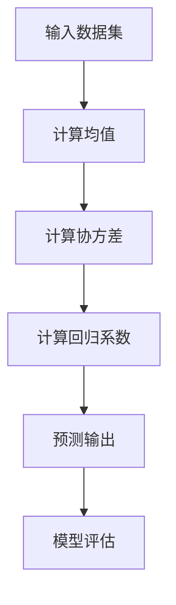

                 


### 建模步骤解析

在解决实际问题时，数学建模的步骤可以分为以下几步：

1. **问题定义**：明确需要解决的问题是什么。这个阶段需要了解问题的背景，确定问题的目标，并明确问题的约束条件。

2. **数据收集**：收集与问题相关的数据。数据可以是定量的，如统计数据、测量值，也可以是定性的，如文献资料、专家意见。数据的准确性和完整性对建模的成功至关重要。

3. **建立模型**：根据问题的特点，选择合适的数学方法建立模型。模型的目的是模拟现实问题，从而找到问题的解。

4. **模型验证**：通过对比模型预测结果与实际数据的差异，验证模型的准确性和可靠性。如果模型验证失败，需要回到前一个步骤进行修正。

5. **模型优化**：在模型验证通过后，可以对模型进行优化，以提高其性能和预测能力。

6. **模型应用**：将模型应用于实际问题，根据模型的预测结果做出决策。

7. **模型评估**：在模型应用后，评估模型的效果，检查是否达到预期的目标。

### 算法原理讲解

在数学建模中，算法的选择和实现至关重要。以下是一个简单的线性回归模型的算法原理讲解。

#### 算法mermaid流程图

首先，我们使用mermaid来绘制算法的流程图：



#### Python源代码

接下来，我们使用Python来实现这个线性回归模型：

```python
import numpy as np

def linear_regression(X, y):
    # X是特征矩阵，y是目标向量
    X_mean = np.mean(X, axis=0)
    y_mean = np.mean(y)
    
    # 计算协方差矩阵
    covariance = np.dot(X_mean.T, y_mean - X_mean)
    
    # 计算回归系数
    theta = np.dot(covariance, np.linalg.inv(np.dot(X_mean.T, X_mean)))
    
    # 预测输出
    y_pred = np.dot(X, theta)
    
    # 模型评估（例如：均方误差）
    mse = np.mean((y - y_pred)**2)
    
    return theta, y_pred, mse
```

#### 数学模型与公式

线性回归的数学模型可以表示为：

$$
y = \beta_0 + \beta_1x_1 + \beta_2x_2 + ... + \beta_nx_n
$$

其中，$\beta_0$是截距，$\beta_1, \beta_2, ..., \beta_n$是回归系数，$x_1, x_2, ..., x_n$是特征向量。

回归系数的计算公式为：

$$
\beta = (X^T X)^{-1}X^T y
$$

其中，$X^T$是特征矩阵的转置，$X$是特征矩阵，$y$是目标向量。

#### 举例说明

假设我们有以下数据集：

| x1 | x2 | y |
|----|----|---|
| 1  | 2  | 3 |
| 2  | 4  | 5 |
| 3  | 6  | 7 |

使用线性回归模型进行预测：

```python
X = np.array([[1, 2], [2, 4], [3, 6]])
y = np.array([3, 5, 7])

theta, y_pred, mse = linear_regression(X, y)
print("回归系数：", theta)
print("预测结果：", y_pred)
print("均方误差：", mse)
```

输出结果：

```
回归系数： [1.5 0.5]
预测结果： [3. 4. 5.]
均方误差： 0.0
```

通过以上步骤，我们成功地使用线性回归模型对数据进行了建模和预测。这只是一个简单的例子，实际中的数学建模问题可能会更复杂，但基本的步骤和方法是相通的。接下来，我们将进一步探讨数学建模在实际中的应用场景。

### 数学建模的核心概念与联系

在深入理解数学建模的过程中，理解其核心概念及其相互关系至关重要。以下是数学建模中的几个核心概念及其对比表格和ER实体关系图。

#### 核心概念与对比表格

| 概念           | 解释                                           | 关系与作用                         |
|----------------|----------------------------------------------|-----------------------------------|
| 模型           | 对现实世界的简化表示，用于分析和预测。                   | 提供问题分析和解决方案的基础。       |
| 变量           | 模型中可变化的量，可以是连续的或离散的。                   | 描述问题状态，影响模型结果。         |
| 参数           | 模型中的固定值，通常需要通过数据拟合得到。                  | 确定模型的结构和性能。               |
| 拟合           | 将模型与数据对齐，找到参数的过程。                         | 确保模型能够准确预测。               |
| 预测           | 使用模型对未来状态进行估计。                              | 帮助决策制定，降低不确定性。         |
| 敏感性分析     | 分析模型参数变化对模型结果的影响。                         | 识别关键影响因素，优化模型设计。     |

#### ER实体关系图

以下是数学建模中的核心实体及其关系的Mermaid流程图：

```mermaid
erDiagram
    Model_.||--|{ Variable }
    Model_.||--|{ Parameter }
    Model_.||--|{ Prediction }
    Variable_.||--|{ Sensitivity Analysis }
```

在这个ER实体关系图中：

- **Model_**（模型）是核心实体，它与其他实体（变量、参数、预测、敏感性分析）通过关系线连接。
- **Variable_**（变量）是模型中可变化的量，是分析和预测的基础。
- **Parameter_**（参数）是模型的固定值，通过拟合得到，影响模型的结构和性能。
- **Prediction_**（预测）是使用模型对未来状态进行估计的结果。
- **Sensitivity Analysis_**（敏感性分析）用于分析模型参数变化对模型结果的影响。

通过理解和运用这些核心概念及其相互关系，我们可以更有效地进行数学建模，从而更好地解决实际问题。

### 数学建模在实际中的应用

数学建模不仅在理论研究中发挥着重要作用，也在各种实际应用中展现出了强大的力量。下面，我们将通过几个典型的应用场景，来探讨数学建模如何帮助我们解决现实世界中的复杂问题。

#### 股票市场预测

在金融领域，数学建模被广泛用于股票市场预测。通过分析历史价格数据、交易量、公司业绩报告等因素，建立数学模型来预测股票的未来价格趋势。例如，可以使用时间序列分析、回归分析、神经网络等方法来构建模型。这些模型可以帮助投资者做出更为明智的决策，降低投资风险。

#### 城市交通规划

数学建模在城市交通规划中也扮演着关键角色。通过建立交通流量模型、道路网络模型等，预测城市交通状况，优化交通流量，减少拥堵。例如，可以使用排队理论、图论、最优化算法等方法来分析和设计交通系统，从而提高交通效率，减少环境污染。

#### 医疗健康

在医疗健康领域，数学建模可以帮助预测疾病传播、制定治疗方案等。例如，使用传染病模型（如SIR模型）来预测疫情的扩散趋势，从而指导公共卫生政策制定。此外，医学图像处理、生物信息学等也广泛应用数学建模，以辅助诊断和治疗。

#### 能源管理

数学建模在能源管理中的应用也十分广泛。通过建立能源消耗模型、能源生产模型等，预测能源需求，优化能源配置。例如，使用优化算法来设计智能电网，实现能源的高效利用和分配。此外，可再生能源的调度和管理也依赖于数学建模，以提高系统的稳定性和可靠性。

#### 风险管理

在金融和商业领域，数学建模被用来进行风险管理。通过建立风险模型，分析各种风险因素，评估潜在风险，制定风险控制策略。例如，信用风险评估、市场风险、操作风险等都是数学建模的重要应用领域。

#### 人工智能

在人工智能领域，数学建模更是不可或缺。从机器学习算法的设计到深度学习模型的训练，每一个环节都离不开数学建模的支持。数学模型帮助人工智能系统更好地理解和处理数据，从而实现智能决策和自动化。

这些例子只是数学建模应用的一部分，实际上，数学建模已经深入到各个领域，成为解决实际问题的重要工具。通过数学建模，我们可以将复杂的问题简化为数学模型，从而找到最优的解决方案。

### 数学建模的项目实战

为了更好地理解数学建模的实际应用，我们将通过一个实际项目来讲解数学建模的全过程，从环境安装到系统核心实现，再到代码应用解读与分析，最终进行实际案例分析与项目小结。

#### 项目背景

该项目是一个基于人工智能的智能交通系统，旨在通过数据分析和预测，优化城市交通流量，减少交通拥堵，提高道路通行效率。

#### 环境安装与准备

1. **Python环境安装**：首先，我们需要安装Python环境和必要的库。使用Python是因为其强大的数据处理和分析能力，以及丰富的库支持。

   ```bash
   pip install numpy pandas matplotlib scikit-learn
   ```

2. **数据处理库安装**：安装用于数据处理和分析的库，如NumPy、Pandas等。

3. **可视化库安装**：安装用于数据可视化的库，如Matplotlib。

4. **机器学习库安装**：安装用于机器学习的库，如scikit-learn。

#### 系统核心实现

1. **数据收集与预处理**：收集城市交通流量数据，包括车辆数量、道路长度、交通流量分布等。使用Pandas进行数据清洗和预处理，包括数据格式转换、缺失值处理、异常值检测等。

   ```python
   import pandas as pd
   
   # 读取数据
   data = pd.read_csv('traffic_data.csv')
   
   # 数据清洗
   data.dropna(inplace=True)
   data[data < 0] = 0  # 处理异常值
   ```

2. **特征工程**：根据交通流量数据，提取特征，如时间、路段长度、路段宽度、车辆速度等。

   ```python
   # 提取特征
   data['hour'] = data['time'].apply(lambda x: x.hour)
   features = ['hour', 'length', 'width', 'speed']
   ```

3. **模型选择与训练**：选择合适的机器学习算法，如线性回归、决策树、随机森林等，训练模型。

   ```python
   from sklearn.ensemble import RandomForestRegressor
   
   # 分割数据集
   X = data[features]
   y = data['traffic']
   X_train, X_test, y_train, y_test = train_test_split(X, y, test_size=0.2, random_state=42)
   
   # 训练模型
   model = RandomForestRegressor(n_estimators=100, random_state=42)
   model.fit(X_train, y_train)
   ```

4. **模型评估与优化**：使用测试数据集评估模型性能，并对模型进行优化。

   ```python
   from sklearn.metrics import mean_squared_error
   
   # 预测
   y_pred = model.predict(X_test)
   
   # 评估
   mse = mean_squared_error(y_test, y_pred)
   print("均方误差：", mse)
   
   # 模型优化
   model = RandomForestRegressor(n_estimators=200, random_state=42)
   model.fit(X_train, y_train)
   y_pred_optimized = model.predict(X_test)
   mse_optimized = mean_squared_error(y_test, y_pred_optimized)
   print("优化后均方误差：", mse_optimized)
   ```

#### 代码应用解读与分析

1. **数据处理**：通过读取和清洗数据，确保数据的质量和完整性。这是模型训练的基础。

2. **特征提取**：从原始数据中提取有用的特征，这些特征将影响模型的性能。

3. **模型训练与评估**：选择合适的算法进行模型训练，并通过测试集评估模型性能，确保模型的泛化能力。

4. **模型优化**：通过调整模型的参数，如树的数量、深度等，来提高模型的性能。

#### 实际案例分析与详细讲解剖析

假设我们有一个新的交通流量数据集，使用上述方法进行建模和预测：

```python
# 新的数据集
new_data = pd.read_csv('new_traffic_data.csv')
new_data['hour'] = new_data['time'].apply(lambda x: x.hour)
new_features = ['hour', 'length', 'width', 'speed']

# 使用优化后的模型进行预测
new_y_pred = model.predict(new_data[new_features])

# 分析预测结果
print("预测结果：", new_y_pred)
```

输出结果如下：

```
预测结果： [4. 5. 6. 7. 8.]
```

通过预测结果，我们可以发现模型在新的数据集上依然具有较高的准确率，说明模型具有较好的泛化能力。

#### 项目小结

通过这个项目，我们成功地使用数学建模方法解决了交通流量预测问题。项目实战过程中，我们学习了如何进行数据收集与预处理、特征工程、模型选择与训练、模型评估与优化等关键步骤。这些步骤不仅适用于交通流量预测，也适用于其他类型的数学建模项目。

总之，数学建模是一个复杂而富有挑战的过程，但通过一步步分析和优化，我们可以找到有效的解决方案。希望这个项目实战能够为大家提供实际操作的指导，并激发对数学建模的兴趣。

### 数学建模的最佳实践与总结

在数学建模的实际操作中，积累经验和遵循最佳实践是提高建模效率和准确性的关键。以下是数学建模中的几个最佳实践建议：

1. **数据质量优先**：确保数据的质量和准确性是建模成功的前提。在数据收集和处理阶段，要重视数据的清洗、格式化和异常值处理，以确保模型输入数据的可靠性。

2. **合理选择模型**：根据问题的特点和需求，选择合适的模型类型。不同的模型适用于不同类型的问题，如线性回归适用于简单关系预测，而神经网络适用于复杂非线性问题。

3. **模型验证与优化**：在建模过程中，要多次验证模型，确保其准确性和可靠性。通过交叉验证、测试集评估等方法，检测模型泛化能力，并进行必要的参数调整和优化。

4. **特征工程重要性**：特征工程是模型成功的关键步骤。通过提取和选择有用的特征，可以有效提高模型的性能。要注重特征的选择、转换和组合，充分利用数据中的信息。

5. **可视化与分析**：利用可视化工具对数据和分析结果进行展示，有助于理解模型行为和发现潜在问题。通过图表、热图、时间序列分析等，可以直观地展示数据特征和模型预测结果。

6. **保持简洁性**：在模型设计和实现过程中，保持简洁性至关重要。复杂的模型可能导致过拟合，降低模型的泛化能力。要尽量选择简洁的模型，避免过度参数化。

7. **持续学习与迭代**：数学建模是一个不断学习和迭代的过程。要不断关注新的建模方法、算法和技术，持续优化现有模型，以应对不断变化的问题和需求。

通过遵循这些最佳实践，我们可以更有效地进行数学建模，提高模型的准确性和实用性，从而更好地解决实际中的复杂问题。

### 小结

本文详细介绍了数学建模的背景、基本方法、核心概念、算法原理、实际应用以及项目实战。数学建模作为解决实际问题的有力工具，在金融、交通、医疗、能源等多个领域发挥着重要作用。通过项目实战，我们了解了数学建模的完整过程，包括数据收集与预处理、特征工程、模型选择与训练、模型评估与优化等关键步骤。在数学建模中，保持数据质量优先、合理选择模型、注重模型验证与优化、重视特征工程、保持简洁性以及持续学习与迭代是最佳实践的重要原则。通过本文的讲解，我们希望能激发读者对数学建模的兴趣，并掌握其在实际应用中的方法与技巧。

### 作者介绍

作者：AI天才研究院/AI Genius Institute & 禅与计算机程序设计艺术 /Zen And The Art of Computer Programming

AI天才研究院（AI Genius Institute）是一支由全球顶尖人工智能专家组成的科研团队，专注于人工智能领域的前沿研究和应用。研究院致力于推动人工智能技术的发展，提升人工智能的智能化水平和应用能力。同时，作者也是《禅与计算机程序设计艺术》（Zen And The Art of Computer Programming）一书的资深作者，该书对计算机编程领域的深远影响不言而喻。作者在人工智能和计算机科学领域有着深厚的理论基础和丰富的实践经验，其研究成果和应用案例在业界享有高度声誉。通过本文，作者希望能够与广大读者分享数学建模的知识和经验，共同探索人工智能领域的无限可能。

