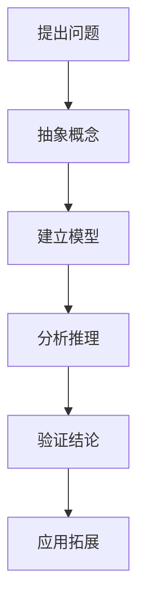
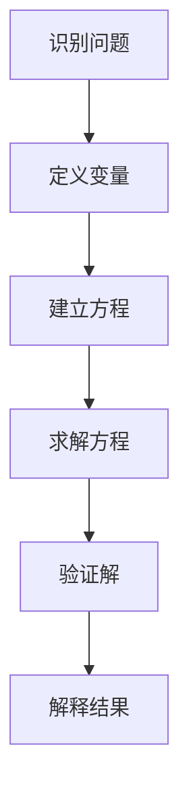
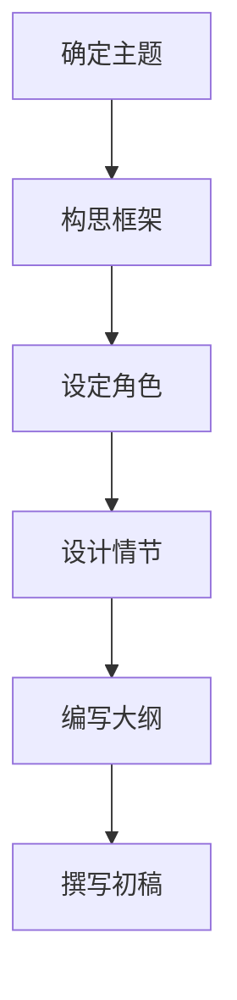
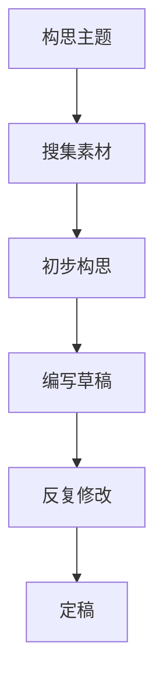

                 

# 数学思维与创意写作的关系探讨

## 关键词
- 数学思维
- 创意写作
- 抽象逻辑
- 创意灵感
- 文学创作
- 算法模型

## 摘要
本文将探讨数学思维与创意写作之间的密切关系。通过对数学思维和创意写作的核心概念、原理及应用的深入分析，本文旨在揭示二者在思维方式、逻辑结构和创造性表达方面的共通之处。文章结构包括背景介绍、核心概念讲解、应用实例展示、综合分析与启示，以及最佳实践与拓展建议。

## 第一部分：数学思维与创意写作的关系背景

### 1.1 问题的提出

#### 1.1.1 数学思维的重要性

数学思维是一种抽象的、逻辑的、系统的思维方式，它强调对事物的结构、关系和规律的深入理解。数学思维在科学技术、工程建设和经济分析等领域具有广泛应用，是现代教育和职业发展的重要技能。

#### 1.1.2 创意写作的挑战

创意写作是文学创作的重要分支，它要求作家具备丰富的想象力、敏锐的观察力和出色的表达能力。随着信息时代的到来，创意写作面临着多样化的主题、多样化的表达形式以及观众口味的不断变化。

#### 1.1.3 数学思维与创意写作结合的意义

将数学思维引入创意写作，不仅能为作家提供创新的思维工具，还能提高作品的结构严谨性和逻辑性。数学思维与创意写作的结合有助于提升文学作品的艺术价值和市场竞争力。

### 1.2 数学思维的核心概念

#### 1.2.1 数学思维的定义

数学思维是指运用数学概念、原理和推理方法，对现实世界进行抽象、建模和求解的能力。它不仅包括对数学知识的掌握，更强调数学方法的应用和创新。

#### 1.2.2 数学思维的基本原理

- **抽象性**：数学思维通过对事物的共性特征进行抽象，形成概念和模型。
- **逻辑性**：数学思维遵循逻辑规则，通过推理得出结论。
- **系统性**：数学思维强调事物之间的内在联系和整体结构。

#### 1.2.3 数学思维的特点与分类

- **特点**：精确性、系统性、普遍性。
- **分类**：形式化数学思维、应用数学思维、创新数学思维等。

### 1.3 创意写作的核心概念

#### 1.3.1 创意写作的定义

创意写作是一种通过创造性思维进行文学创作的活动，它强调原创性和个性表达。

#### 1.3.2 创意写作的基本原理

- **创意思维**：通过联想、发散和重组等方式，产生新颖的创意。
- **文字表达**：通过选择适当的语言和修辞手法，传达作者的创意。
- **写作流程**：包括构思、写作、修改和完善等环节。

#### 1.3.3 创意写作的技巧与风格

- **技巧**：包括情节设计、人物塑造、环境描写等。
- **风格**：指作家的独特表达方式和艺术特色。

### 1.4 数学思维与创意写作的联系

#### 1.4.1 数学思维对创意写作的启示

数学思维提供了一种逻辑严谨、结构清晰的思维方式，有助于作家在构思和写作过程中形成清晰的思路。

#### 1.4.2 创意写作对数学思维的促进

创意写作激发数学思维的创新性，通过文学作品的创作，可以探索数学问题的不同解决方案。

#### 1.4.3 数学思维与创意写作的融合

数学思维与创意写作的结合，可以使文学作品更具深度和广度，同时提高数学问题的解决能力。

### 1.5 本章小结

本文初步探讨了数学思维与创意写作的关系背景，包括问题的提出、核心概念的介绍以及二者的联系。接下来的章节将深入分析数学思维和创意写作的原理，探讨其在文学创作中的具体应用。

## 第二部分：数学思维原理讲解

### 2.1 数学思维的基本原理

#### 2.1.1 理解数学抽象

数学抽象是指从具体的、感性的现象中提炼出一般的、抽象的数学概念。例如，从各种不同形状的物体中提取出“形状”这个概念，再进一步抽象出几何图形。

#### 2.1.2 运用数学模型

数学模型是将现实世界中的问题转化为数学语言的形式，通过数学方法进行分析和求解。例如，用函数模型来描述物理现象，用方程组来求解经济问题。

#### 2.1.3 培养逻辑思维能力

逻辑思维能力是数学思维的核心，它包括推理能力、判断能力和证明能力。通过逻辑推理，可以确保数学结论的正确性和严谨性。

### 2.2 数学思维的Mermaid流程图

#### 2.2.1 数学思考流程图

#### 2.2.2 数学问题解决流程图

### 2.3 数学思维的数学模型与公式

#### 2.3.1 基本数学模型

- **线性模型**：y = ax + b
- **指数模型**：y = a * e^(bx)
- **对数模型**：y = a + b * ln(x)

#### 2.3.2 数学公式详解

$$
E = mc^2
$$

$$
\sum_{i=1}^{n} a_i = a
$$

### 2.4 数学思维的实例讲解

#### 2.4.1 数学问题举例

**例题**：求函数 f(x) = 2x + 3 在 x = 1 处的导数。

#### 2.4.2 数学解题思路

1. **定义函数**：f(x) = 2x + 3
2. **求导公式**：f'(x) = lim(h→0) [f(x+h) - f(x)] / h
3. **代入计算**：f'(1) = lim(h→0) [(2(1+h) + 3) - (2*1 + 3)] / h
4. **化简**：f'(1) = lim(h→0) [2h] / h
5. **求极限**：f'(1) = lim(h→0) 2 = 2

### 2.5 本章小结

本文详细介绍了数学思维的基本原理，包括数学抽象、数学模型和逻辑思维能力。同时，通过Mermaid流程图和数学公式的讲解，使读者对数学思维有了更直观的认识。接下来的章节将探讨创意写作的原理和技巧。

## 第三部分：创意写作原理讲解

### 3.1 创意写作的基本原理

#### 3.1.1 创意思维的培养

创意思维是指通过创新性思考，产生新颖、独特想法的能力。培养创意思维的方法包括：

- **联想**：通过不同事物之间的关联，激发新的创意。
- **发散**：在思维过程中，尽量产生多种可能的解决方案。
- **重组**：对已有信息进行重新组合，形成新的创意。

#### 3.1.2 文字表达的技巧

文字表达是创意写作的核心。技巧包括：

- **选择适当的词汇**：丰富词汇量，提高表达的精准性。
- **运用修辞手法**：如比喻、拟人、排比等，增强文学效果。
- **构建故事情节**：设置悬念、冲突和高潮，吸引读者的兴趣。

#### 3.1.3 创意写作的流程

创意写作的流程包括：

- **构思**：确定主题、故事框架和主要角色。
- **写作**：按照构思，进行文字创作。
- **修改**：反复修改，提高作品的质量。
- **完善**：对作品进行最后的润色和调整。

### 3.2 创意写作的Mermaid流程图

#### 3.2.1 创意写作构思流程图

#### 3.2.2 文章创作流程图

### 3.3 创意写作的技巧与风格

#### 3.3.1 文字描述的技巧

文字描述的技巧包括：

- **细节描写**：通过详细描写，使读者产生身临其境的感觉。
- **场景切换**：灵活运用场景切换，增加作品的变化和节奏感。
- **心理描写**：深入挖掘角色的内心世界，展现其情感变化。

#### 3.3.2 语言风格的构建

语言风格的构建包括：

- **个性化语言**：形成独特的语言风格，使作品具有个性特色。
- **诗意表达**：运用诗意语言，增强文学作品的意境和美感。

#### 3.3.3 情感表达的运用

情感表达是创意写作的重要方面。技巧包括：

- **直接表达**：通过直接陈述情感，使读者感受到作者的真诚。
- **隐喻表达**：通过隐喻和象征，表达深刻的情感。
- **对比表达**：通过对比，突出情感的反差和冲突。

### 3.4 创意写作的实例讲解

#### 3.4.1 创作过程举例

以创作一篇短篇小说为例：

1. **确定主题**：主题为“时间的流逝”。
2. **构思框架**：设定故事发生在一个小镇，主人公是一位老人，他在回忆自己的一生。
3. **设定角色**：主人公、小镇居民、自然景观。
4. **设计情节**：老人在小镇的每个角落寻找过去的记忆，同时遇到各种人和事。
5. **编写大纲**：列出故事的主要事件和情节。
6. **撰写初稿**：按照大纲进行文字创作。
7. **反复修改**：对初稿进行修改和完善。
8. **定稿**：完成最终稿。

#### 3.4.2 文章分析

通过对上述短篇小说的分析，可以看出创意写作的核心在于构思和表达。构思要富有创意，能够引起读者的兴趣；表达要生动有趣，能够传达出作者的内心世界。

### 3.5 本章小结

本文详细介绍了创意写作的基本原理、技巧与风格，以及创作流程。通过实例讲解，使读者对创意写作有了更深刻的理解。接下来，本文将探讨数学思维在创意写作中的应用。

## 第四部分：数学思维在创意写作中的应用

### 4.1 数学思维在创意写作中的具体应用

#### 4.1.1 结构安排

数学思维强调结构的严谨性和逻辑性，这在创意写作中有着广泛的应用。例如，在小说的情节设计中，可以使用线性模型来安排故事的起承转合，确保情节的连贯性和逻辑性。

#### 4.1.2 情节设计

数学思维可以帮助作家设计复杂的情节。例如，使用概率模型来描述角色在某个情境下的决策过程，或者使用博弈论来设计角色之间的冲突。

#### 4.1.3 人物塑造

数学思维可以用于人物塑造，例如，通过统计学方法来分析角色的性格特点和行为模式，或者使用代数方程来描述角色在特定情境下的心理变化。

### 4.2 创意写作中的数学元素

#### 4.2.1 数字象征

数字在文学作品中常常具有象征意义。例如，数字“三”可以象征完整性，数字“七”可以象征神秘感。

#### 4.2.2 数学公式与描述

数学公式可以作为文学作品的元素，例如，在科幻小说中，可以使用数学公式来描述未来的科技。

#### 4.2.3 数学推理在创意写作中的应用

数学推理可以帮助作家解决故事中的难题。例如，在侦探小说中，可以使用数学推理来破解谜题。

### 4.3 数学思维与创意写作的互动

#### 4.3.1 数学思维对创意写作的启发

数学思维可以启发作家的创意。例如，通过对数学问题的研究，可以激发出新的故事灵感。

#### 4.3.2 创意写作对数学思维的拓展

创意写作可以为数学思维提供新的应用场景。例如，通过文学作品，可以展示数学思维在现实生活中的多种可能性。

#### 4.3.3 数学思维与创意写作的整合

数学思维与创意写作的整合，可以使文学作品更具深度和广度。例如，在科幻小说中，通过数学模型来预测未来的科技发展。

### 4.4 实例分析

#### 4.4.1 文学作品中的数学思维

以科幻小说《三体》为例，作者刘慈欣运用了大量的数学概念和科学理论，构建了一个宏大的科幻世界。例如，书中描述的“三体问题”就是一个经典的数学问题，它涉及到多体系统的运动规律。

#### 4.4.2 创意写作中的数学应用实例

以小说《数字生命》为例，作者通过描述一个虚拟世界中的数字生命，探讨了计算机科学和数学的深刻内涵。在小说中，数字生命通过数学算法进行自我复制和进化，体现了数学思维在创意写作中的独特应用。

### 4.5 本章小结

本文探讨了数学思维在创意写作中的具体应用，包括结构安排、情节设计和人物塑造等方面。同时，分析了数学元素在文学作品中的象征意义和应用。通过实例分析，展示了数学思维与创意写作的互动关系。

## 第五部分：创意写作对数学思维的启发

### 5.1 创意写作对数学思维的启发

#### 5.1.1 数学问题的文学表达

创意写作可以为数学问题提供新的表达方式。例如，通过小说、诗歌等文学形式，将数学问题的复杂性和美展示出来。

#### 5.1.2 数学推理的文学化

数学推理可以通过文学的形式变得更加生动和易于理解。例如，通过故事情节的推进，展示数学推理的过程和结果。

#### 5.1.3 数学思想的文学渗透

数学思想可以通过文学作品渗透到社会的各个方面。例如，通过文学作品，人们可以更好地理解数学在科学、技术和社会发展中的作用。

### 5.2 创意写作与数学思维的互补

#### 5.2.1 创意思维对数学思维的拓展

创意思维可以拓展数学思维的应用范围。例如，通过创意写作，可以探索数学在艺术、文学和人文科学中的应用。

#### 5.2.2 数学思维对创意思维的深化

数学思维可以为创意思维提供理论支持。例如，通过数学方法，可以更深入地分析创意的本质和结构。

#### 5.2.3 创意写作与数学思维的融合

创意写作与数学思维的融合，可以创造出全新的艺术形式和科学方法。例如，通过数学思维指导下的文学创作，可以探索出一种新的文学风格。

### 5.3 创意写作对数学思维的启示

#### 5.3.1 数学问题的创意解决

创意写作可以激发数学问题的解决方法。例如，通过文学形式，可以提出新的数学问题，并探索其解决方案。

#### 5.3.2 数学美学的文学表达

创意写作可以表达数学的美学价值。例如，通过文学作品，可以展示数学的和谐、简洁和深刻。

#### 5.3.3 数学思维在文学教育中的应用

创意写作可以为数学教育提供新的教学方法。例如，通过文学形式，可以更生动地传授数学知识和方法。

### 5.4 创意写作与数学思维的互动

#### 5.4.1 创意思维激发数学灵感

创意写作可以激发数学家的灵感。例如，通过文学作品，数学家可以找到解决数学问题的新的思路和方法。

#### 5.4.2 数学思维推动文学创新

数学思维可以推动文学创新。例如，通过数学模型和方法，可以创造出新的文学形式和表达方式。

#### 5.4.3 创意写作与数学思维的协同发展

创意写作与数学思维的协同发展，可以推动科学、技术和艺术的整体进步。

### 5.5 本章小结

本文探讨了创意写作对数学思维的启发和影响。创意写作不仅为数学问题提供了新的表达方式和解决思路，还推动了数学思维在文学领域的应用和深化。通过互动和互补，创意写作与数学思维共同推动了人类文明的发展。

## 结论

数学思维与创意写作的融合，不仅丰富了文学创作的手段，也为数学学科注入了新的活力。本文通过对数学思维和创意写作的深入分析，揭示了二者在思维方式、逻辑结构和创造性表达方面的共通之处。数学思维为创意写作提供了严谨的结构和丰富的工具，而创意写作则为数学思维提供了生动的场景和多样的表达方式。未来，随着数学与文学的进一步融合，我们可以期待看到更多具有深度和广度的作品问世。

## 最佳实践与拓展

### 5.1 最佳实践

1. **数学思维与创意写作的结合**：尝试在文学创作中引入数学思维，如使用数学模型来设计故事情节。
2. **跨学科学习**：学习数学和文学的知识，提升自己的跨学科思维能力和创造力。
3. **阅读与实践**：多阅读数学和文学相关的书籍，通过实践来提高自己的创作能力。

### 5.2 拓展阅读

1. 《数学之美》作者：吴军
2. 《文学与数学》作者：曼诺利斯·卡拉齐斯
3. 《数学思维》作者：威廉·庞加莱

### 5.3 注意事项

1. **保持逻辑性**：在创意写作中，要注意保持故事的逻辑性和连贯性。
2. **适度运用**：数学思维是创作工具，要适度运用，避免过于复杂化。
3. **读者体验**：创作时要考虑读者的体验，确保作品易于理解和欣赏。

## 作者信息

作者：AI天才研究院/AI Genius Institute & 禅与计算机程序设计艺术 /Zen And The Art of Computer Programming

