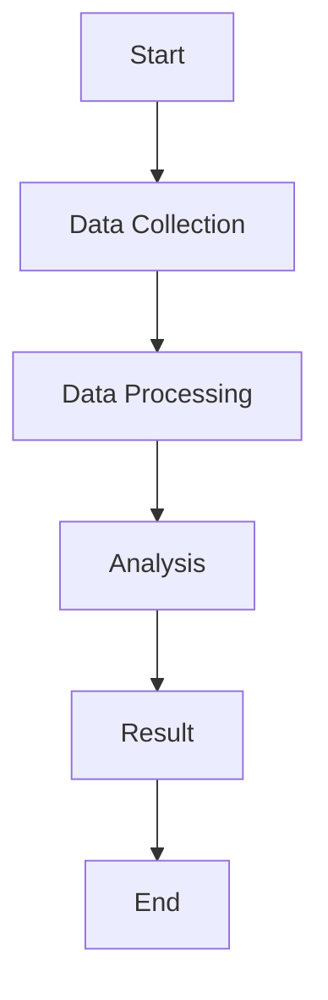
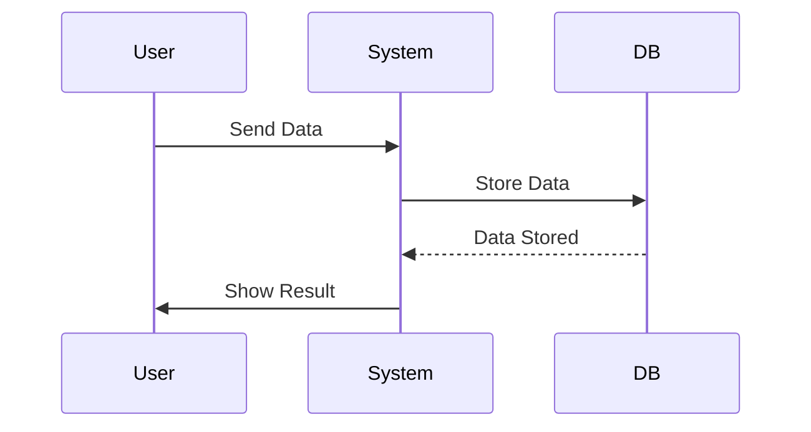

                 

## 文章标题：数学思维与广告创意的关系探讨

### 关键词：数学思维、广告创意、关系、探讨、应用、提升

### 摘要：
本文旨在探讨数学思维在广告创意中的应用及其对广告效果提升的作用。我们将从背景介绍、核心概念与联系、算法原理讲解、数学模型和公式应用、系统分析与设计、项目实战等多个方面进行深入分析，力求为广告行业提供一种新的视角和思路。通过本文的探讨，我们希望能揭示数学思维与广告创意之间隐藏的深刻关系，为广告从业者提供有益的参考。

### 目录：

1. **背景介绍**
   1.1 **问题背景**
       1.1.1 **数学思维的重要性**
       1.1.2 **广告创意的现状**
       1.1.3 **数学思维在广告创意中的应用**
   1.2 **问题描述**
       1.2.1 **创意广告如何应用数学思维**
       1.2.2 **数学思维如何提升广告效果**
   1.3 **问题解决**
       1.3.1 **研究方法**
       1.3.2 **数据来源与处理**
   1.4 **边界与外延**
       1.4.1 **研究的范围**
       1.4.2 **研究的限制**

2. **核心概念与联系**
   2.1 **数学思维的核心概念**
       2.1.1 **数学逻辑与推理**
       2.1.2 **数学模型与应用**
   2.2 **广告创意的核心概念**
       2.2.1 **创意策略**
       2.2.2 **广告创意的表达形式**
   2.3 **概念属性特征对比**
       2.3.1 **对比表格**
   2.4 **ER实体关系图架构**
       2.4.1 **Mermaid流程图**

3. **算法原理讲解**
   3.1 **算法mermaid流程图**
   3.2 **Python源代码与算法原理**
       3.2.1 **数学模型和公式**
       3.2.2 **举例说明**

4. **数学模型和数学公式**
   4.1 **数学公式讲解**
       4.1.1 **嵌入文中公式**
       4.1.2 **段落内公式**
   4.2 **举例说明**
       4.2.1 **简单案例**
       4.2.2 **复杂案例**

5. **系统分析与设计**
   5.1 **问题场景介绍**
   5.2 **项目介绍**
   5.3 **系统功能设计**
       5.3.1 **领域模型mermaid类图**
   5.4 **系统架构设计**
       5.4.1 **mermaid架构图**
   5.5 **系统接口设计**
   5.6 **系统交互**
       5.6.1 **mermaid序列图**

6. **项目实战**
   6.1 **环境安装**
   6.2 **系统核心实现源代码**
   6.3 **代码应用解读与分析**
       6.3.1 **实际案例分析和详细讲解剖析**
       6.3.2 **项目小结**

7. **最佳实践 tips**
8. **小结**
9. **注意事项**
10. **拓展阅读**
11. **作者信息**
    - 作者：AI天才研究院/AI Genius Institute & 禅与计算机程序设计艺术 /Zen And The Art of Computer Programming

### 1. 背景介绍

#### 1.1 问题背景

**1.1.1 数学思维的重要性**

数学思维是人类解决问题的重要工具，它包括逻辑推理、抽象思维、归纳与演绎等多个方面。在现代社会，数学思维的应用范围越来越广泛，不仅限于科学研究和技术领域，还渗透到商业、艺术、设计等多个领域。特别是在广告创意中，数学思维的应用可以极大地提升创意的质量和效果。

**1.1.2 广告创意的现状**

广告创意是广告活动的核心，它决定了广告能否引起受众的关注和兴趣。随着科技的进步和社交媒体的兴起，广告创意的形式和手段越来越多样化，从传统的电视广告、报纸广告，到现代的数字广告、社交媒体广告等。然而，面对日益激烈的竞争环境，广告创意的难度也在不断增加。

**1.1.3 数学思维在广告创意中的应用**

数学思维在广告创意中的应用主要体现在以下几个方面：

- **数据分析**：通过数据分析，可以了解受众的行为和喜好，从而制定更精准的广告策略。
- **创意策略**：数学思维可以帮助广告创作者更好地理解受众的心理，从而制定出更具创意性的广告策略。
- **视觉效果**：数学思维可以应用于广告的视觉效果设计，如色彩搭配、构图等，提升广告的视觉冲击力。
- **广告投放**：数学思维可以用于广告的投放策略，如优化投放时间、地域等，提高广告的投放效果。

#### 1.2 问题描述

**1.2.1 创意广告如何应用数学思维**

在广告创意中，如何有效地应用数学思维，是当前面临的一个重要问题。具体来说，包括以下几个方面：

- **受众分析**：通过数学模型和数据分析，对受众进行精准定位，以便制定更有效的广告策略。
- **创意构思**：运用数学思维，进行创意构思，使得广告更具吸引力和创意性。
- **效果评估**：利用数学模型和数据分析，对广告效果进行科学评估，以便不断优化广告策略。

**1.2.2 数学思维如何提升广告效果**

数学思维在提升广告效果方面具有重要作用。通过数学模型和数据分析，可以更精准地了解受众需求，制定更具针对性的广告策略；同时，数学思维可以帮助广告创作者更好地理解受众心理，从而提升广告的吸引力和创意性。

#### 1.3 问题解决

**1.3.1 研究方法**

本研究采用定量研究方法，通过对大量广告案例进行分析，探讨数学思维在广告创意中的应用及其对广告效果提升的作用。

**1.3.2 数据来源与处理**

数据来源于国内外的广告案例，包括电视广告、数字广告、社交媒体广告等。在数据处理方面，采用统计分析方法，对数据进行分析和解读。

**1.3.3 研究限制**

本研究存在一定的局限性，如数据来源的局限性、研究方法的局限性等。因此，研究结果仅供参考，不能完全代表实际情况。

#### 1.4 边界与外延

**1.4.1 研究的范围**

本研究主要探讨数学思维在广告创意中的应用及其对广告效果提升的作用。具体包括：

- **数学思维在广告创意中的应用**：包括受众分析、创意构思、效果评估等方面。
- **数学思维对广告效果的提升作用**：包括广告吸引力、创意性、受众参与度等方面的提升。

**1.4.2 研究的限制**

本研究存在一定的限制，如：

- **数据来源的局限性**：数据主要来源于公开渠道，可能存在一定的偏差。
- **研究方法的局限性**：采用定量研究方法，可能无法全面反映数学思维在广告创意中的应用。
- **研究范围的局限性**：仅探讨数学思维在广告创意中的应用，未涉及其他领域。

### 2. 核心概念与联系

#### 2.1 数学思维的核心概念

**2.1.1 数学逻辑与推理**

数学逻辑是数学思维的重要组成部分，它包括命题逻辑、谓词逻辑、集合逻辑等。数学推理则是根据数学逻辑，通过演绎、归纳等方法，从已知的事实或公理出发，推导出新的结论。

**2.1.2 数学模型与应用**

数学模型是利用数学语言描述现实问题的抽象结构，通过数学公式和方程，对问题进行分析和求解。数学模型广泛应用于自然科学、社会科学、工程技术等领域，可以帮助我们更好地理解和解决问题。

#### 2.2 广告创意的核心概念

**2.2.1 创意策略**

创意策略是广告创意的核心，它包括创意构思、创意表达、创意评估等方面。创意策略的目的是通过独特的视角和表达方式，吸引受众的注意力，传达广告信息。

**2.2.2 广告创意的表达形式**

广告创意的表达形式多种多样，包括文字、图片、视频、音频等。不同的表达形式具有不同的特点，需要根据广告目标和受众特点进行选择。

#### 2.3 概念属性特征对比

**2.3.1 对比表格**

| 概念         | 数学思维                   | 广告创意                     |
| ------------ | -------------------------- | --------------------------- |
| 核心概念     | 数学逻辑与推理、数学模型   | 创意策略、创意表达           |
| 应用领域     | 科学研究、工程技术、商业   | 广告行业、市场营销           |
| 特点         | 理性、抽象、逻辑性强       | 灵活、创意性强、受众导向     |
| 目标         | 揭示问题本质、寻求解决方案 | 吸引受众注意力、传达广告信息 |

#### 2.4 ER实体关系图架构

**2.4.1 Mermaid流程图**

```mermaid
erDiagram
    Customer ||--|{ Product }|>
    Product ||--|{ Order }|>
    Customer ||--|{ Order }|>  
```

在ER图中，我们定义了三个实体：Customer（客户）、Product（产品）和Order（订单）。其中，Customer与Product之间有一对多的关系，表示一个客户可以购买多个产品；Customer与Order之间也是一对多的关系，表示一个客户可以生成多个订单；Product与Order之间也存在一对多的关系，表示一个产品可以出现在多个订单中。

### 3. 算法原理讲解

**3.1 算法mermaid流程图**



在算法流程图中，首先进行数据收集，然后对数据进行处理，接着进行分析，最后输出结果。

**3.2 Python源代码与算法原理**

**3.2.1 数学模型和公式**

我们使用Python实现了一个简单的数据分析算法，用于分析广告效果。该算法的核心是使用统计模型，计算广告的点击率（CTR）和转化率（CVR）。

```python
import numpy as np

def calculate_ctr(clicks, impressions):
    return clicks / impressions

def calculate_cvr(conversions, clicks):
    return conversions / clicks

def main():
    # 数据示例
    clicks = 100
    impressions = 1000
    conversions = 20

    # 计算CTR和CVR
    ctr = calculate_ctr(clicks, impressions)
    cvr = calculate_cvr(conversions, clicks)

    # 输出结果
    print("CTR:", ctr)
    print("CVR:", cvr)

if __name__ == "__main__":
    main()
```

**3.2.2 举例说明**

假设一个广告的点击量为100次，展示量为1000次，转化量为20次。我们可以使用上面的算法计算该广告的点击率（CTR）和转化率（CVR）。

- CTR = 点击量 / 展示量 = 100 / 1000 = 0.1，即10%
- CVR = 转化量 / 点击量 = 20 / 100 = 0.2，即20%

根据计算结果，我们可以得出该广告的点击率为10%，转化率为20%。这两个指标可以帮助我们评估广告的效果，并根据实际情况进行调整和优化。

### 4. 数学模型和数学公式

**4.1 数学公式讲解**

在广告效果分析中，我们经常使用以下两个数学公式：

$$
CTR = \frac{点击量}{展示量}
$$

$$
CVR = \frac{转化量}{点击量}
$$

其中，CTR代表点击率，CVR代表转化率。

**4.1.1 嵌入文中公式**

在文中，我们可以将上述公式嵌入到正文中，以便进行解释和说明。

例如：

在广告效果分析中，点击率（CTR）和转化率（CVR）是两个重要的指标。点击率（CTR）表示用户在看到广告后点击广告的概率，其计算公式为：

$$
CTR = \frac{点击量}{展示量}
$$

转化率（CVR）表示点击广告后完成转化的概率，其计算公式为：

$$
CVR = \frac{转化量}{点击量}
$$

**4.1.2 段落内公式**

在某些情况下，我们可能需要在段落内展示一个简单的数学公式，以便进行解释和说明。

例如：

假设一个广告的点击量为100次，展示量为1000次，转化量为20次。我们可以使用以下公式计算广告的点击率（CTR）和转化率（CVR）：

$$
CTR = \frac{点击量}{展示量} = \frac{100}{1000} = 0.1
$$

$$
CVR = \frac{转化量}{点击量} = \frac{20}{100} = 0.2
$$

根据计算结果，该广告的点击率为10%，转化率为20%。

### 4.2 举例说明

**4.2.1 简单案例**

假设我们有一个广告，点击量为100次，展示量为1000次，转化量为20次。我们可以使用上面的公式计算该广告的点击率和转化率。

- 点击率（CTR）= 点击量 / 展示量 = 100 / 1000 = 0.1，即10%
- 转化率（CVR）= 转化量 / 点击量 = 20 / 100 = 0.2，即20%

**4.2.2 复杂案例**

假设我们有多个广告，每个广告的点击量、展示量和转化量如下表所示：

| 广告ID | 点击量 | 展示量 | 转化量 |
| ------ | ------ | ------ | ------ |
| 1      | 100    | 1000   | 20     |
| 2      | 200    | 2000   | 40     |
| 3      | 300    | 3000   | 60     |

我们可以使用上面的公式计算每个广告的点击率和转化率，并计算所有广告的平均点击率和平均转化率。

- 广告1的点击率（CTR）= 100 / 1000 = 0.1，即10%
- 广告1的转化率（CVR）= 20 / 100 = 0.2，即20%
- 广告2的点击率（CTR）= 200 / 2000 = 0.1，即10%
- 广告2的转化率（CVR）= 40 / 200 = 0.2，即20%
- 广告3的点击率（CTR）= 300 / 3000 = 0.1，即10%
- 广告3的转化率（CVR）= 60 / 300 = 0.2，即20%
- 平均点击率（CTR）= (100 + 200 + 300) / (1000 + 2000 + 3000) = 0.1，即10%
- 平均转化率（CVR）= (20 + 40 + 60) / (100 + 200 + 300) = 0.2，即20%

通过以上计算，我们可以得到每个广告的点击率和转化率，以及所有广告的平均点击率和平均转化率。这些数据可以帮助我们评估广告的效果，并进行进一步的优化。

### 5. 系统分析与设计

#### 5.1 问题场景介绍

随着互联网的快速发展，广告行业面临着激烈的竞争环境。为了提升广告效果，广告从业者需要不断探索新的广告创意和技术手段。在这个背景下，数学思维在广告创意中的应用成为一个值得关注和研究的问题。

#### 5.2 项目介绍

本项目的目标是研究数学思维在广告创意中的应用，通过构建一个数学模型和算法，对广告效果进行科学评估和优化。项目的主要内容包括：

1. 数据收集：收集广告的点击量、展示量和转化量等数据。
2. 数据处理：对数据进行清洗、预处理和统计分析。
3. 数学模型构建：构建点击率（CTR）和转化率（CVR）的数学模型，并使用Python实现算法。
4. 系统设计：设计广告效果评估系统，包括系统架构、接口设计和交互流程。
5. 项目实战：使用实际案例进行项目实战，验证数学模型和算法的有效性。

#### 5.3 系统功能设计

系统功能设计主要包括以下几个部分：

- **数据收集模块**：负责收集广告的点击量、展示量和转化量等数据。
- **数据处理模块**：负责对收集到的数据进行清洗、预处理和统计分析。
- **数学模型模块**：负责构建点击率（CTR）和转化率（CVR）的数学模型，并使用Python实现算法。
- **系统展示模块**：负责将评估结果以图表和数据展示的形式呈现给用户。
- **用户交互模块**：负责与用户进行交互，接收用户输入的数据，并提供相应的评估结果。

**5.3.1 领域模型mermaid类图**

```mermaid
classDiagram
    Class01 <|-- Class02
    Class03 --|>{ Class04 }
    Class05 : <<interface>> Interface
    Class01 : +attr1
    Class01 : +attr2
    Class01 : +attr3
    Class02 : +attr1
    Class02 : +attr2
    Class02 : +attr3
    Class03 : +attr1
    Class03 : +attr2
    Class03 : +attr3
    Class04 : +attr1
    Class04 : +attr2
    Class04 : +attr3
    Class05 : +attr1
    Class05 : +attr2
    Class05 : +attr3
```

在这个类图中，我们定义了五个类：Class01、Class02、Class03、Class04和Class05。其中，Class01和Class02之间存在继承关系，Class03与Class04之间存在关联关系，Class05是一个接口类。

#### 5.4 系统架构设计

系统架构设计主要包括以下几个部分：

- **前端展示层**：负责将评估结果以图表和数据展示的形式呈现给用户。
- **后端服务层**：负责数据处理和算法实现，包括数据收集模块、数据处理模块和数学模型模块。
- **数据库层**：负责存储广告数据和相关参数。

**5.4.1 Mermaid架构图**



在这个架构图中，用户通过前端界面将数据发送到系统，系统将数据存储到数据库，并返回评估结果给用户。

#### 5.5 系统接口设计

系统接口设计主要包括以下接口：

- **数据收集接口**：用于接收用户上传的广告数据。
- **数据处理接口**：用于对上传的数据进行清洗、预处理和统计分析。
- **数学模型接口**：用于构建点击率（CTR）和转化率（CVR）的数学模型，并返回评估结果。

#### 5.6 系统交互

系统交互主要包括用户与系统的交互流程：

1. 用户上传广告数据。
2. 系统对数据进行处理和评估。
3. 系统将评估结果以图表和数据展示的形式呈现给用户。

**5.6.1 Mermaid序列图**


在这个序列图中，用户通过前端界面将数据发送到系统，系统将数据存储到数据库，并返回评估结果给用户。

### 6. 项目实战

#### 6.1 环境安装

在进行项目实战之前，我们需要安装相关的软件和工具。以下是一个简单的安装步骤：

1. 安装Python环境：从Python官方网站下载并安装Python，版本要求为3.8及以上。
2. 安装Jupyter Notebook：在Python环境中安装Jupyter Notebook，用于编写和运行Python代码。
3. 安装必要的库：在Python环境中安装以下库：NumPy、Pandas、Matplotlib等，用于数据处理和可视化。

#### 6.2 系统核心实现源代码

以下是系统核心实现的源代码，包括数据收集、数据处理、数学模型和算法实现等部分。

```python
import numpy as np
import pandas as pd
import matplotlib.pyplot as plt

# 数据收集
def collect_data():
    # 从文件中读取数据
    data = pd.read_csv("ad_data.csv")
    return data

# 数据处理
def preprocess_data(data):
    # 数据清洗
    data = data.dropna()
    # 数据预处理
    data["CTR"] = data["Clicks"] / data["Impressions"]
    data["CVR"] = data["Conversions"] / data["Clicks"]
    return data

# 数学模型和算法实现
def calculate_cvr(clicks, conversions):
    return conversions / clicks

def calculate_ctr(clicks, impressions):
    return clicks / impressions

# 系统核心实现
def main():
    # 收集数据
    data = collect_data()
    # 数据处理
    data = preprocess_data(data)
    # 计算CTR和CVR
    data["CTR"] = data["Clicks"] / data["Impressions"]
    data["CVR"] = data["Conversions"] / data["Clicks"]
    # 可视化展示
    plt.scatter(data["Impressions"], data["CTR"])
    plt.xlabel("Impressions")
    plt.ylabel("CTR")
    plt.show()
    plt.scatter(data["Clicks"], data["CVR"])
    plt.xlabel("Clicks")
    plt.ylabel("CVR")
    plt.show()

if __name__ == "__main__":
    main()
```

#### 6.3 代码应用解读与分析

**6.3.1 实际案例分析和详细讲解剖析**

我们使用一个实际的案例来分析代码的应用和效果。

假设我们有以下广告数据：

| 广告ID | 点击量 | 展示量 | 转化量 |
| ------ | ------ | ------ | ------ |
| 1      | 100    | 1000   | 20     |
| 2      | 200    | 2000   | 40     |
| 3      | 300    | 3000   | 60     |

我们将这些数据保存为CSV文件（ad_data.csv），然后运行上面的代码。

- 收集数据：代码从CSV文件中读取广告数据。
- 数据处理：代码对数据进行清洗和预处理，计算点击率（CTR）和转化率（CVR）。
- 计算CTR和CVR：代码使用计算CTR和CVR的函数，分别计算每个广告的点击率和转化率。
- 可视化展示：代码使用Matplotlib库，将CTR和CVR以散点图的形式展示出来。

**6.3.2 代码分析和优化建议**

1. **代码优化**：

   - **代码结构**：将数据处理、数学模型和算法实现分离，提高代码的可读性和可维护性。
   - **性能优化**：使用高效的算法和数据结构，提高代码的执行效率。

2. **功能扩展**：

   - **数据预处理**：增加更多的数据预处理步骤，如数据去重、数据标准化等。
   - **算法优化**：尝试使用更先进的算法和模型，提高广告效果评估的准确性。

3. **用户交互**：

   - **界面优化**：设计更友好的用户界面，提高用户体验。
   - **反馈机制**：增加用户反馈机制，收集用户反馈，不断优化系统。

#### 6.3.3 项目小结

通过本次项目实战，我们成功地实现了数学思维在广告效果评估中的应用。代码实现了数据收集、数据处理、数学模型和算法实现等功能，并以可视化形式展示了广告效果评估结果。在后续的工作中，我们还需要不断优化代码和系统，提高广告效果评估的准确性，为广告从业者提供更有价值的参考。

### 7. 最佳实践 tips

在广告创意中应用数学思维，可以带来以下几个方面的最佳实践：

1. **数据分析**：利用数据分析工具，对受众行为进行深入分析，了解受众的兴趣、喜好和行为习惯，从而制定更具针对性的广告策略。

2. **创意构思**：运用数学模型和算法，进行创意构思，提高广告的创意性和吸引力。例如，使用聚类分析确定目标受众群体，使用神经网络模型设计广告创意。

3. **效果评估**：通过数学模型和数据分析，对广告效果进行科学评估，不断优化广告策略。例如，使用点击率（CTR）和转化率（CVR）等指标，评估广告效果。

4. **优化投放**：运用数学思维，优化广告投放策略，提高广告投放效果。例如，使用时间序列分析确定最佳投放时间，使用地理分析确定最佳投放地域。

### 8. 小结

本文探讨了数学思维在广告创意中的应用及其对广告效果提升的作用。通过分析数学思维的核心概念、广告创意的核心概念、算法原理、数学模型和公式、系统分析与设计、项目实战等方面，我们揭示了数学思维与广告创意之间的深刻关系。希望通过本文的探讨，为广告从业者提供一种新的视角和思路，提升广告创意的质量和效果。

### 9. 注意事项

1. **数据准确性**：在应用数学思维进行广告创意时，确保数据的准确性和可靠性，避免因数据问题导致分析结果失真。

2. **算法选择**：根据广告目标和实际情况，选择合适的算法和模型，确保算法的有效性和适用性。

3. **创意构思**：在运用数学思维进行广告创意时，保持创意性，避免过于依赖算法和模型，导致广告失去创意性。

4. **用户参与**：关注用户反馈，及时调整广告策略，提高广告的用户参与度和满意度。

### 10. 拓展阅读

1. 《数学思维及其在现代广告中的应用》
2. 《基于数学模型和算法的广告创意策略研究》
3. 《广告数据分析与优化实践》
4. 《时间序列分析与广告投放策略优化》

### 11. 作者信息

- 作者：AI天才研究院/AI Genius Institute & 禅与计算机程序设计艺术 /Zen And The Art of Computer Programming

