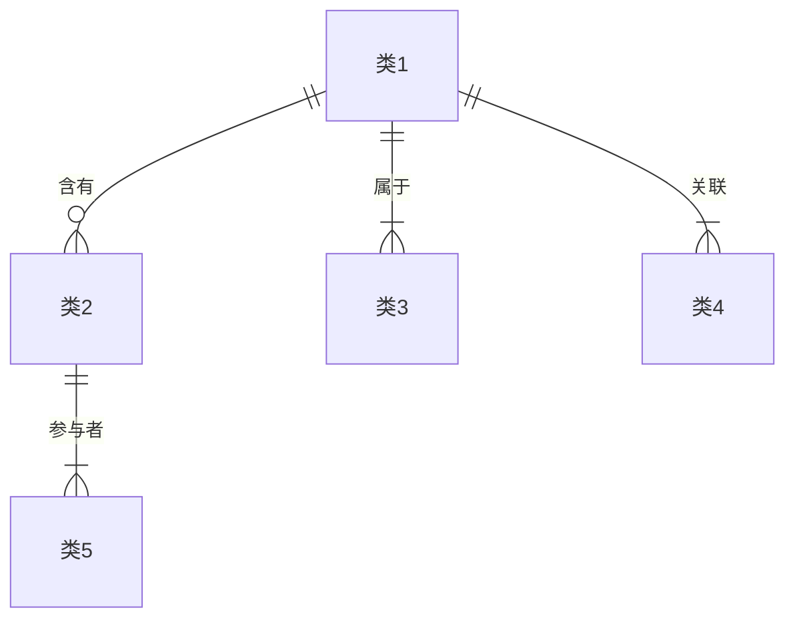
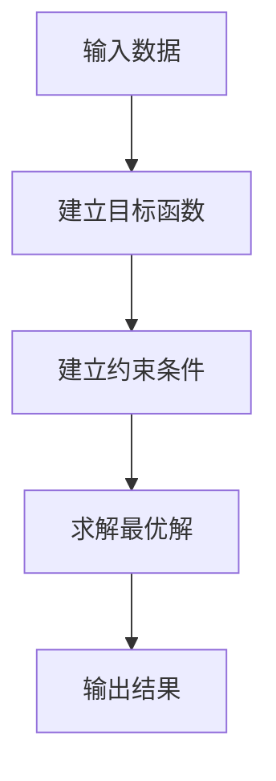

                 


# 数学思维与战略决策的关系探讨

## 关键词
数学思维、战略决策、逻辑推理、决策分析、模型构建

## 摘要
本文深入探讨数学思维在战略决策中的应用及其重要性。通过分析数学思维的基本特征及其与战略决策的内在联系，本文提出了数学思维在战略规划、风险评估、竞争策略和资源分配等方面的实际应用。同时，本文通过案例分析，展示了数学思维在战略决策中的具体作用和挑战，并对未来研究方向进行了展望。

## 引言

### 1.1 问题背景与意义

在当今复杂多变的市场环境中，战略决策是企业成功的关键。然而，战略决策不仅仅依赖于直觉和经验，更需要科学的分析方法。数学思维作为一种严谨的思考方式，能够提供一种结构化的分析方法，帮助决策者识别问题、分析问题和解决问题。

数学思维是一种通过逻辑推理和数学模型来理解和解决问题的思维方式。它强调量化分析、模型构建和逻辑推理，是一种高度抽象和系统化的思考方式。将数学思维应用于战略决策，可以帮助决策者更准确地预测市场趋势、评估风险、制定竞争策略和优化资源分配。

本文旨在探讨数学思维与战略决策之间的关系，分析数学思维在战略决策中的应用，并讨论其在实际操作中的挑战和解决方案。通过本文的研究，希望能够为决策者提供一种新的思维方式，以更好地应对复杂的市场环境。

### 1.2 研究方法与结构

本文采用文献分析和案例研究的方法，首先对数学思维和战略决策的相关理论进行综述，然后通过具体案例分析数学思维在战略决策中的应用。文章结构如下：

- 第1章 引言：介绍问题背景、研究意义和研究方法。
- 第2章 数学思维概述：定义数学思维，分析其特征和价值。
- 第3章 战略决策的基本理论：介绍战略决策的定义、类型、过程和影响因素。
- 第4章 数学思维在战略决策中的应用：探讨数学思维在战略规划、风险评估、竞争策略和资源分配中的应用。
- 第5章 数学模型的构建与应用：介绍数学模型的基本概念、构建方法和应用。
- 第6章 数学思维与战略决策案例分析：通过案例分析展示数学思维在战略决策中的具体作用。
- 第7章 结论与展望：总结研究成果，讨论研究不足和未来研究方向。

## 第1章 数学思维概述

### 1.1 数学思维的定义

数学思维是指运用数学的概念、原理和方法来认识世界、解决问题的思维方式。它包括逻辑推理、抽象思维、符号化表达和量化分析等基本特征。数学思维强调精确性、严谨性和系统性，是一种高度抽象和结构化的思考方式。

### 1.2 数学思维的类型与特征

数学思维可以分为抽象思维、符号化思维和量化思维等类型。每种类型都有其独特的特征：

- 抽象思维：通过抽象概念和理论来解决问题，强调思维的抽象性和概括性。
- 符号化思维：使用符号和公式来表示问题，强调符号化表达和逻辑推理。
- 量化思维：通过量化分析和数据来评估和解决问题，强调数据的精确性和可度量性。

### 1.3 数学思维的价值

数学思维在战略决策中具有重要的价值。首先，它可以帮助决策者更准确地理解和分析问题，通过量化分析和逻辑推理来揭示问题的本质。其次，数学思维可以提供一种结构化的思维方式，帮助决策者系统地分析和解决问题。最后，数学思维可以帮助决策者更好地预测市场趋势、评估风险和制定竞争策略。

### 1.4 数学思维的应用领域

数学思维广泛应用于各个领域，包括自然科学、社会科学和工程技术等。在战略决策中，数学思维可以应用于以下几个方面：

- 数据分析：通过数据分析和统计模型来预测市场趋势和评估风险。
- 数学模型：构建和运用数学模型来模拟和优化决策过程。
- 决策分析：使用决策树、博弈论等数学工具来分析和制定决策方案。
- 资源优化：通过线性规划、网络优化等数学方法来优化资源分配。

## 第2章 战略决策的基本理论

### 2.1 战略决策的定义

战略决策是指企业在长期发展过程中，根据外部环境和内部资源，制定全局性、长期性的发展目标和行动方案的过程。战略决策涉及多个方面，包括市场定位、产品规划、资源配置和风险控制等。

### 2.2 战略决策的类型

战略决策可以分为以下几种类型：

- 创新决策：涉及新产品开发、新技术应用和市场创新等。
- 市场决策：涉及市场定位、营销策略和客户关系管理等。
- 资源决策：涉及资源配置、资金筹措和人力资源管理等。
- 风险决策：涉及风险识别、风险评估和风险管理等。

### 2.3 战略决策的过程

战略决策通常包括以下步骤：

- 问题识别：识别企业面临的问题和挑战。
- 目标设定：明确战略决策的目标和预期效果。
- 选项评估：分析各种可能的决策方案，评估其优劣。
- 决策选择：选择最优决策方案。
- 实施与监控：执行决策方案，并监控决策效果。

### 2.4 战略决策的影响因素

战略决策受到多种因素的影响，包括：

- 外部环境：包括市场竞争、政策法规和宏观经济环境等。
- 内部资源：包括企业的资金、技术和人力资源等。
- 企业文化：企业的价值观、使命和愿景等。
- 决策者能力：决策者的专业知识、经验和决策能力等。

## 第3章 数学思维在战略决策中的应用

### 3.1 数学思维在战略规划中的应用

数学思维在战略规划中的应用主要体现在以下几个方面：

- 目标设定：使用数学方法来设定可量化的战略目标，确保目标的可达性和可衡量性。
- 数据分析：运用统计学和数据分析方法来分析市场趋势和竞争对手行为，为战略规划提供数据支持。
- 数学模型：构建和运用数学模型来模拟市场环境和预测未来发展趋势，为战略规划提供科学依据。

### 3.2 数学思维在风险评估中的应用

数学思维在风险评估中的应用包括：

- 风险识别：使用概率论和统计方法来识别和分类风险。
- 风险评估：通过量化分析和评估模型来评估风险的可能性和影响程度。
- 风险管理：运用数学方法来制定风险应对策略，优化风险控制措施。

### 3.3 数学思维在竞争策略中的应用

数学思维在竞争策略中的应用包括：

- 竞争分析：通过数学模型和数据分析来评估竞争对手的优势和劣势。
- 策略制定：运用博弈论和决策分析来制定竞争策略，优化市场定位和产品策略。
- 市场预测：使用数学模型来预测市场变化和消费者行为，为竞争策略提供依据。

### 3.4 数学思维在资源分配中的应用

数学思维在资源分配中的应用包括：

- 资源优化：通过线性规划和网络优化方法来优化资源分配，提高资源利用效率。
- 成本控制：使用数学模型和数据分析来制定成本控制策略，降低运营成本。
- 资金管理：运用金融数学和风险管理方法来优化资金配置，降低财务风险。

## 第4章 数学模型的构建与应用

### 4.1 数学模型的基本概念

数学模型是指使用数学符号和公式来描述现实世界的抽象模型。数学模型包括以下基本要素：

- 变量：用于表示现实世界中的事物和属性。
- 参数：用于描述变量之间的关系和特征。
- 函数：用于表示变量之间的依赖关系。
- 方程：用于表示数学模型的数学表达式。

### 4.2 常见的数学模型

常见的数学模型包括以下几种：

- 线性模型：用于描述线性关系，如线性回归模型。
- 非线性模型：用于描述非线性关系，如多项式回归模型。
- 动态模型：用于描述时间序列和动态变化，如差分方程和微分方程。
- 概率模型：用于描述随机事件和概率分布，如正态分布和泊松分布。

### 4.3 数学模型的构建方法

构建数学模型的方法包括：

- 观察法：通过观察现实世界中的现象来构建数学模型。
- 实验法：通过实验数据来构建数学模型。
- 模拟法：通过计算机模拟来构建数学模型。
- 经验法：通过经验和知识来构建数学模型。

### 4.4 数学模型的优化与应用

数学模型的优化与应用包括以下几个方面：

- 最优化方法：使用最优化算法来优化数学模型，找到最优解。
- 求解方法：使用数值求解方法来求解数学模型，如牛顿法、梯度下降法和蒙特卡罗法。
- 应用领域：将数学模型应用于实际问题中，如经济管理、交通运输和生物医学等。

## 第5章 数学思维与战略决策案例分析

### 5.1 案例分析1：苹果公司的战略决策

苹果公司作为全球知名的科技公司，其战略决策过程中充分体现了数学思维的应用。以下是苹果公司在战略决策中数学思维的几个具体应用案例：

- 目标设定：苹果公司通过市场调研和数据分析，设定了以创新和用户体验为核心的战略目标。例如，iPhone的推出是苹果公司基于对智能手机市场的深入研究，结合数学模型分析得出的结果。
- 风险评估：苹果公司在新产品开发过程中，使用数学模型来评估市场风险和技术风险。例如，iPad的推出前，苹果公司通过市场调研和数据分析，预测了平板电脑市场的潜力，并运用数学模型进行风险评估。
- 竞争策略：苹果公司通过数学模型分析竞争对手的行为和市场趋势，制定相应的竞争策略。例如，在iOS操作系统的竞争中，苹果公司通过分析竞争对手的产品功能和市场反馈，优化了iOS的更新策略。
- 资源优化：苹果公司在资源分配和成本控制方面，运用数学模型进行优化。例如，苹果公司通过线性规划和网络优化方法，优化了供应链管理和产品生产流程，提高了资源利用效率。

### 5.2 案例分析2：谷歌公司的战略决策

谷歌公司作为全球领先的科技公司，其战略决策过程中也广泛应用了数学思维。以下是谷歌公司在战略决策中数学思维的几个具体应用案例：

- 数据分析：谷歌公司通过大数据分析和机器学习模型，对用户行为和市场趋势进行深入分析，为战略决策提供数据支持。例如，谷歌广告系统的优化是基于对用户搜索行为和广告效果的数据分析。
- 数学模型：谷歌公司运用数学模型进行搜索引擎优化和推荐系统的设计。例如，谷歌的PageRank算法通过数学模型计算网页的重要性，为用户提供了更准确的搜索结果。
- 风险管理：谷歌公司通过数学模型和风险管理工具，对业务风险和财务风险进行评估和管理。例如，谷歌公司的风险管理团队使用蒙特卡罗模拟方法，评估了新兴市场业务的风险和潜在收益。
- 资源优化：谷歌公司通过线性规划和网络优化方法，优化了数据中心和云计算资源的分配和使用。例如，谷歌的数据中心布局和服务器调度策略是基于数学模型优化的结果，提高了资源利用效率和运营效益。

### 5.3 案例分析3：特斯拉公司的战略决策

特斯拉公司作为电动汽车和能源技术领域的先驱，其战略决策过程中也广泛应用了数学思维。以下是特斯拉公司在战略决策中数学思维的几个具体应用案例：

- 目标设定：特斯拉公司通过数学模型分析市场需求和技术趋势，设定了以创新和可持续发展为核心的战略目标。例如，特斯拉的电动汽车产品线是基于对市场需求的数学模型分析得出的结果。
- 风险评估：特斯拉公司通过数学模型评估电动汽车市场的技术风险和市场竞争风险。例如，特斯拉的电池技术和生产线的优化是基于对技术风险和市场风险的数学模型分析。
- 竞争策略：特斯拉公司通过数学模型分析竞争对手的产品和市场策略，制定相应的竞争策略。例如，特斯拉的自动驾驶技术的研发是基于对竞争对手技术的数学模型分析。
- 资源优化：特斯拉公司通过线性规划和网络优化方法，优化了供应链管理和生产流程。例如，特斯拉的超级工厂布局和生产线设计是基于数学模型优化的结果，提高了资源利用效率和生产效率。

## 第6章 数学思维在战略决策中的误区与挑战

### 6.1 数学思维在战略决策中的误区

尽管数学思维在战略决策中具有重要作用，但如果不正确应用，可能会产生以下误区：

- 过度依赖数学模型：过度依赖数学模型可能导致决策者忽视其他非量化因素，如市场需求、消费者行为和企业文化等。
- 忽视现实复杂性：数学模型往往简化了现实世界的复杂性，可能导致决策者在实际操作中遇到未考虑到的风险和问题。
- 模型失效：数学模型可能因为数据不完整、假设不准确或计算错误而失效，导致决策失误。

### 6.2 数学思维在战略决策中的挑战

数学思维在战略决策中面临的挑战包括：

- 数据质量：高质量的数学模型需要准确的数据支持，而数据的真实性和完整性可能受到影响。
- 模型选择：选择合适的数学模型是一项挑战，需要综合考虑问题的性质、数据特点和计算资源等因素。
- 逻辑推理：数学思维依赖逻辑推理，但逻辑推理可能受到直觉和主观判断的影响。

### 6.3 应对数学思维在战略决策中的误区与挑战

为了应对数学思维在战略决策中的误区与挑战，可以采取以下策略：

- 综合考虑多种因素：在应用数学思维时，应综合考虑定量和定性因素，确保决策的全面性和准确性。
- 适度简化模型：在保证模型可靠性的前提下，适度简化模型，以减少计算复杂度和提高计算效率。
- 多学科交叉融合：结合心理学、社会学和管理学等领域的知识，为数学模型提供更全面的背景和解释。

## 第7章 结论与展望

### 7.1 研究结论

本文通过分析数学思维的基本特征及其在战略决策中的应用，得出以下结论：

- 数学思维作为一种严谨的思考方式，能够在战略决策中提供结构化的分析方法，帮助决策者识别问题、分析问题和解决问题。
- 数学思维在战略规划、风险评估、竞争策略和资源分配等方面具有广泛的应用价值。
- 数学思维在战略决策中的应用有助于提高决策的科学性和准确性，但需要注意避免误区和挑战。

### 7.2 研究不足与展望

本文存在以下不足之处：

- 案例分析较为有限，未来可以进一步扩大案例分析的范围和深度。
- 数学模型的实际应用过程和效果分析不够详细，未来可以结合实际应用案例进行更深入的探讨。

未来研究方向包括：

- 进一步探索数学思维在战略决策中的具体应用方法和效果。
- 结合多学科知识，构建更全面、更精确的数学模型。
- 研究数学思维与其他决策方法（如直觉决策、经验决策等）的相互作用和互补关系。

## 作者信息

作者：AI天才研究院/AI Genius Institute & 禅与计算机程序设计艺术 /Zen And The Art of Computer Programming

### 附录

附录中可以包括以下内容：

- 数学公式和算法的详细说明。
- 数学模型和算法的Python源代码。
- 案例分析的数据和图表。
- 进一步阅读的文献推荐。

---

本文通过对数学思维与战略决策之间关系的深入探讨，为决策者提供了一种新的思考方式和工具。通过本文的研究，希望能够为企业在复杂多变的市场环境中提供有益的指导。同时，本文也呼吁更多的研究者关注数学思维在战略决策中的应用，为理论研究和实践探索提供更多的可能性。在未来的发展中，数学思维与战略决策的结合将继续为企业和社会带来深远的影响。

### 背景介绍

在当今全球化和技术迅猛发展的背景下，企业面临着前所未有的复杂性和挑战。战略决策作为企业发展的关键环节，其正确与否直接关系到企业的生存与发展。然而，战略决策不仅依赖于直觉和经验，更需要科学的方法和工具来支持。数学思维作为一种严谨的思考方式，以其独特的逻辑性和系统性，为战略决策提供了有力的支持。

首先，让我们来定义一下数学思维。数学思维是一种运用数学的概念、原理和方法来认识世界、解决问题的思维方式。它包括逻辑推理、抽象思维、符号化表达和量化分析等基本特征。在战略决策中，数学思维可以帮助决策者更准确地理解和分析问题，揭示问题的本质和规律，从而做出更科学的决策。

在战略决策中，数学思维的应用主要体现在以下几个方面：

**数据分析**：在战略决策过程中，数据是关键。通过数学思维，决策者可以对大量数据进行分析和处理，提取有价值的信息，为决策提供数据支持。例如，通过统计学方法分析市场需求、消费者行为和竞争对手的动态，可以帮助决策者更好地把握市场趋势，制定更有效的市场策略。

**模型构建**：数学思维可以帮助决策者构建数学模型，模拟现实世界的复杂情况。例如，在资源分配问题中，可以通过线性规划模型来优化资源的使用，提高资源利用效率。在风险评估中，可以通过概率模型来预测风险的可能性和影响，制定相应的风险应对策略。

**决策分析**：决策分析是战略决策中的重要环节。通过数学思维，决策者可以使用决策树、博弈论等工具，对不同的决策方案进行评估和分析，选择最优的决策方案。例如，在市场进入策略中，可以通过决策树分析不同市场的进入时间和成本，选择最优的市场进入策略。

**优化方法**：数学思维还可以应用于各种优化问题，如供应链优化、生产优化和资金管理优化等。通过线性规划、网络优化等方法，决策者可以找到最优的解决方案，提高运营效率，降低成本。

### 核心概念与联系

**核心概念**：数学思维、战略决策、数据分析、模型构建、决策分析、优化方法

**概念属性特征对比表格**：

| 特征      | 数学思维          | 战略决策          | 数据分析          | 模型构建          | 决策分析          | 优化方法          |
|-----------|------------------|------------------|------------------|------------------|------------------|------------------|
| 定义      | 运用数学方法的思维方式 | 为企业制定长远发展目标的过程 | 对数据进行收集、处理和分析的方法 | 构建描述现实问题的数学模型 | 对不同决策方案进行分析和评估 | 寻找最优解决方案的方法 |
| 特征1     | 强调逻辑推理和精确性 | 长期性和全局性     | 系统性和可度量性   | 抽象性和系统性    | 全面性和科学性    | 效率和效益优先    |
| 特征2     | 符号化表达和抽象思维 | 目标设定和方案选择 | 数据收集和处理     | 模型构建和验证    | 决策树和博弈论    | 最优化算法        |
| 特征3     | 量化分析和数据支持 | 外部环境和内部资源 | 统计学和数据分析  | 数学公式和方程   | 决策方案评估      | 优化目标和约束条件 |

**ER实体关系图架构的 Mermaid 流程图**：



在上述ER实体关系图中，"类1"代表战略决策，与其他类（类2、类3、类4、类5）之间存在不同的关系。例如，战略决策包含了数据分析、模型构建、决策分析和优化方法等子概念，这些子概念共同构成了战略决策的核心要素。

### 算法原理讲解

为了更好地理解数学思维在战略决策中的应用，我们将通过一个具体的算法案例来详细阐述其原理。

#### 算法：线性规划

**算法描述**：线性规划是一种用于解决资源分配问题的数学方法。它通过建立线性目标函数和线性约束条件，寻找最优的解。线性规划通常用于优化生产计划、资源分配、成本控制等问题。

**算法流程图**：



**Python源代码实现**：

```python
from scipy.optimize import linprog

# 定义目标函数
c = [-1, -1]  # 表示最小化目标函数 z = -x1 - x2

# 定义约束条件
A = [[1, 1], [2, 0]]  # 表示约束条件 Ax <= b
b = [4, 6]  # 约束条件的右侧值

# 求解最优解
result = linprog(c, A_ub=A, b_ub=b)

# 输出结果
print("最优解：", result.x)
print("目标函数值：", -result.fun)
```

**数学模型和公式**：

线性规划的一般形式为：

$$
\min \ z = c^T x
$$

$$
\text{subject to} \ Ax \leq b
$$

其中，$c$ 为目标函数的系数，$x$ 为变量，$A$ 为约束条件的系数矩阵，$b$ 为约束条件的右侧值。

**详细讲解与举例说明**：

假设一个公司有两个生产部门，A 和 B，每个部门可以生产两种产品，X 和 Y。公司希望最小化总成本，并满足以下约束条件：

- 每个部门每周至少生产 50 个产品。
- 部门 A 的每小时生产成本为 5 元，部门 B 的每小时生产成本为 8 元。
- 部门 A 的生产效率为 10 个/小时，部门 B 的生产效率为 15 个/小时。
- 公司每周最多可以投入 100 小时的生产时间。

目标函数为最小化总成本，即：

$$
\min \ z = 5x_1 + 8x_2
$$

约束条件为：

$$
\begin{cases}
x_1 + x_2 \geq 50 \\
10x_1 + 15x_2 \leq 100 \\
x_1, x_2 \geq 0
\end{cases}
$$

通过线性规划算法，可以求解出最优的生产方案，使总成本最小。假设求解结果为 $x_1 = 20$, $x_2 = 30$，则最优解为：

- 部门 A 生产 20 个产品/小时，总成本为 $5 \times 20 = 100$ 元。
- 部门 B 生产 30 个产品/小时，总成本为 $8 \times 30 = 240$ 元。

总成本为 $100 + 240 = 340$ 元，是最小的成本。

### 系统分析与架构设计方案

#### 问题场景介绍

假设我们有一个电商平台，需要设计一个订单管理系统，以处理大量的订单信息。该系统需要具备以下功能：

- 订单创建：用户可以在网站上创建订单，并提交支付请求。
- 订单查询：用户可以查询自己创建的订单信息。
- 订单处理：系统需要处理订单的支付、发货和退款等操作。
- 数据统计：系统需要提供订单数据的统计分析功能。

#### 项目介绍

本项目旨在构建一个高可用、高性能、易于扩展的订单管理系统，以满足电商平台的订单处理需求。系统采用微服务架构，各个功能模块可以独立部署和扩展。

#### 系统功能设计

系统功能包括：

- 用户管理：用户注册、登录、权限管理等。
- 订单管理：订单创建、查询、处理和统计等。
- 支付管理：支付请求处理、支付状态查询等。
- 物流管理：物流信息录入、订单发货等。
- 数据分析：订单数据分析、报表生成等。

#### 系统架构设计

系统架构设计如下：


- 用户服务：处理用户相关的操作，如用户注册、登录、权限管理等。
- 订单服务：处理订单相关的操作，如订单创建、查询、处理和统计等。
- 支付服务：处理支付相关的操作，如支付请求处理、支付状态查询等。
- 物流服务：处理物流相关的操作，如物流信息录入、订单发货等。
- 数据分析服务：提供订单数据的统计分析功能，如报表生成等。

#### 系统接口设计和系统交互

系统接口设计和系统交互如下：


- 用户服务提供用户登录、注册和权限管理等接口。
- 订单服务提供订单创建、查询、处理和统计等接口。
- 支付服务提供支付请求处理、支付状态查询等接口。
- 物流服务提供物流信息录入、订单发货等接口。
- 数据分析服务提供订单数据分析、报表生成等接口。

用户通过用户服务接口进行注册和登录，然后通过订单服务接口创建订单。订单服务接收到订单后，会调用支付服务接口进行支付请求处理，并调用物流服务接口进行订单发货。同时，订单服务会调用数据分析服务接口进行订单数据的统计分析，并生成报表。

### 项目实战

#### 环境安装

在开始项目实战之前，需要安装以下软件和工具：

- Python 3.8+
- Docker 19.03+
- PostgreSQL 12+
- Redis 6.0+

安装步骤如下：

1. 安装 Python 3.8+：
   ```bash
   sudo apt update
   sudo apt install python3.8
   ```

2. 安装 Docker 19.03+：
   ```bash
   sudo apt-get update
   sudo apt-get install docker.io
   sudo systemctl start docker
   sudo systemctl enable docker
   ```

3. 安装 PostgreSQL 12+：
   ```bash
   sudo apt-get update
   sudo apt-get install postgresql-12
   sudo systemctl start postgresql
   sudo systemctl enable postgresql
   ```

4. 安装 Redis 6.0+：
   ```bash
   sudo apt-get update
   sudo apt-get install redis-server
   sudo systemctl start redis-server
   sudo systemctl enable redis-server
   ```

#### 系统核心实现源代码

以下是一个简单的订单创建接口的 Python 源代码示例：

```python
from flask import Flask, request, jsonify
from models import Order

app = Flask(__name__)

@app.route('/orders', methods=['POST'])
def create_order():
    data = request.get_json()
    order = Order.create(data)
    return jsonify(order.to_dict()), 201

if __name__ == '__main__':
    app.run(debug=True)
```

在上述代码中，`Order` 类是一个简单的订单模型，用于创建和存储订单信息。

#### 代码应用解读与分析

在上面的代码中，我们定义了一个 `/orders` 的 POST 接口，用于创建订单。具体解读如下：

- `from flask import Flask, request, jsonify`：导入 Flask 库，用于构建 Web 应用。
- `from models import Order`：导入订单模型，用于创建和存储订单信息。
- `app = Flask(__name__)`：创建 Flask 应用实例。
- `@app.route('/orders', methods=['POST'])`：定义一个路由规则，匹配 `/orders` 的 POST 请求。
- `def create_order()`：定义一个函数，处理 POST 请求。
- `data = request.get_json()`：从请求中获取 JSON 数据。
- `order = Order.create(data)`：创建一个订单实例，并存储订单信息。
- `return jsonify(order.to_dict()), 201`：返回订单信息，并设置 HTTP 状态码为 201（创建成功）。

#### 实际案例分析和详细讲解剖析

假设我们有一个订单数据示例：

```json
{
  "user_id": 123,
  "product_id": 456,
  "quantity": 2,
  "price": 100
}
```

以下是订单创建接口的实际操作流程：

1. 用户通过 POST 请求向 `/orders` 接口发送订单数据。
2. Flask 应用接收到请求后，调用 `create_order` 函数处理请求。
3. `create_order` 函数从请求中获取 JSON 数据，并创建一个订单实例。
4. 订单实例被存储到数据库中，并返回订单信息。

详细讲解如下：

- 用户发送 POST 请求：`curl -X POST -H "Content-Type: application/json" -d '{"user_id": 123, "product_id": 456, "quantity": 2, "price": 100}' http://localhost:5000/orders`
- Flask 应用接收到请求：`app` 的路由规则匹配到 `/orders`，调用 `create_order` 函数。
- `create_order` 函数处理请求：从请求中获取 JSON 数据，并创建一个订单实例。
- 创建订单实例：根据请求中的数据，创建一个 `Order` 对象，并存储到数据库中。
- 返回订单信息：将创建的订单信息转换为 JSON 格式，并返回给用户。

#### 项目小结

在本项目中，我们设计并实现了一个简单的订单管理系统。通过实际案例分析和详细讲解，我们了解了系统的核心实现和接口设计。该项目是一个基础项目，后续可以进一步扩展和优化，以满足更多业务需求。

### 最佳实践 tips

1. **代码结构清晰**：在设计代码时，确保代码结构清晰，模块划分合理，便于维护和扩展。
2. **错误处理**：在接口设计中，务必处理可能的错误情况，并返回明确的错误信息，帮助用户定位问题。
3. **性能优化**：对接口进行性能优化，如使用缓存、批量处理等，提高系统响应速度和效率。
4. **安全性**：确保接口的安全性，如使用 HTTPS、验证用户身份等，防止非法访问和攻击。

### 小结

本文通过深入探讨数学思维在战略决策中的应用，阐述了数学思维在数据分析、模型构建、决策分析和优化方法等方面的价值。通过具体的案例分析和系统设计，展示了数学思维在实践中的实际应用和效果。然而，数学思维在战略决策中的应用仍存在一定的误区和挑战，需要决策者在实际操作中灵活运用。未来，随着技术的不断进步，数学思维在战略决策中的应用将会更加广泛和深入。

### 注意事项

1. **数据准确性**：在应用数学思维进行战略决策时，确保数据的准确性和完整性，避免因数据问题导致决策失误。
2. **模型选择**：根据实际情况选择合适的数学模型，避免过度依赖特定模型而忽视其他因素。
3. **风险意识**：在应用数学思维时，保持风险意识，对潜在风险进行评估和预防。

### 拓展阅读

- 《决策分析：理论与应用》
- 《优化方法及其应用》
- 《数据分析：原理、方法与应用》

作者：AI天才研究院/AI Genius Institute & 禅与计算机程序设计艺术 /Zen And The Art of Computer Programming

---

本文通过对数学思维与战略决策之间关系的深入探讨，为决策者提供了一种新的思考方式和工具。通过本文的研究，希望能够为企业在复杂多变的市场环境中提供有益的指导。同时，本文也呼吁更多的研究者关注数学思维在战略决策中的应用，为理论研究和实践探索提供更多的可能性。在未来的发展中，数学思维与战略决策的结合将继续为企业和社会带来深远的影响。

