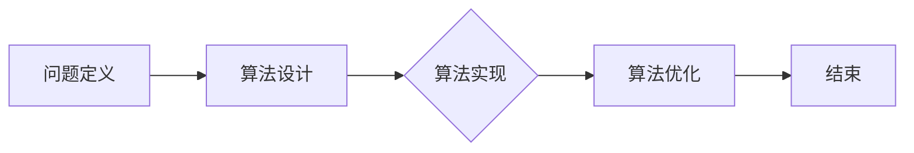
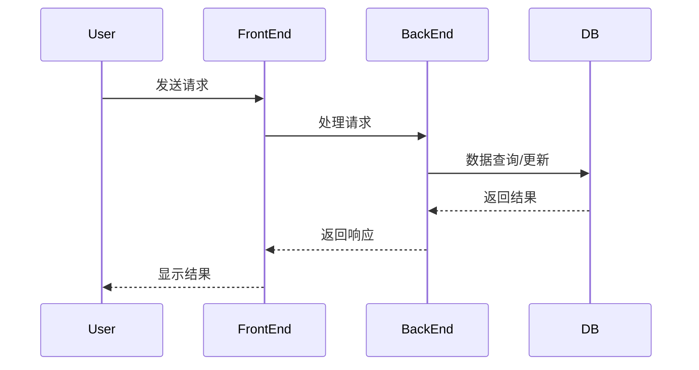
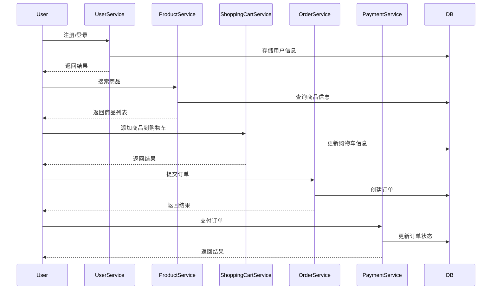

                 


# 数学思维与系统思考的关系探讨

关键词：数学思维，系统思考，复杂系统，算法，模型

摘要：本文旨在探讨数学思维与系统思考之间的关系，通过系统的理论分析和实践案例，揭示两者在解决复杂问题中的相互作用和相互促进。文章首先介绍了数学思维和系统思考的基本概念及其特征，然后分析了两者之间的联系和区别。接着，文章通过具体的算法原理讲解、系统分析与架构设计方案以及项目实战，阐述了如何将数学思维与系统思考相结合，以解决实际复杂问题。

## 第一部分：背景介绍

### 1.1 问题背景

在现代社会，数学思维和系统思考已经成为各个领域研究和解决问题的重要工具。随着计算机技术和人工智能的快速发展，如何将数学思维与系统思考相结合，以应对复杂问题成为学术界和产业界共同关注的话题。本文旨在探讨数学思维与系统思考之间的关系，通过系统的理论分析和实践案例，揭示两者在解决实际问题中的相互作用和相互促进。

### 1.2 问题描述

数学思维是指运用数学的概念、方法和原理来分析和解决问题的思维方式。而系统思考是一种理解和处理复杂系统的方法，强调系统的整体性和动态性。两者之间存在着密切的联系：数学思维为系统思考提供了强有力的理论工具，而系统思考则有助于深入理解和运用数学方法。

然而，在实际应用中，数学思维与系统思考之间也存在一些矛盾和挑战。例如，数学模型往往过于简化，难以全面反映复杂系统的真实状况；而系统思考则可能因为过于复杂而难以形成明确的数学模型。因此，如何有效地将数学思维与系统思考相结合，成为当前研究和实践的重要课题。

### 1.3 问题解决

本文将围绕以下核心问题展开讨论：

1. 数学思维与系统思考的基本原理是什么？
2. 数学思维在系统思考中的应用方法有哪些？
3. 系统思考如何促进数学思维的发展？
4. 如何在实际问题中有效地结合数学思维与系统思考？

通过系统的理论分析和实践案例，本文旨在为读者提供一种新的视角，帮助读者更好地理解和运用数学思维与系统思考，解决复杂问题。

### 1.4 边界与外延

本文的边界主要限定在数学思维和系统思考的理论探讨与应用实践。具体包括：

- 数学思维的定义、特点和应用领域
- 系统思考的概念、方法和工具
- 数学思维与系统思考的相互作用和融合方法

本文的外延则涉及数学与系统科学的交叉领域，包括：

- 数学建模与系统分析
- 复杂系统理论
- 人工智能与大数据应用

### 1.5 概念结构与核心要素组成

为了系统地探讨数学思维与系统思考的关系，本文将从以下核心概念和要素入手：

- 数学思维：包括数学概念、方法和原理
- 系统思考：包括系统概念、方法、工具和框架
- 数学模型：包括数学公式、算法和模型结构
- 系统分析：包括系统架构、接口设计和交互流程

## 第二部分：核心概念与联系

### 2.1 数学思维与系统思考的基本概念

#### 2.1.1 数学思维

数学思维是一种运用数学的概念、方法和原理来分析和解决问题的思维方式。它强调逻辑推理、抽象思考和定量分析，具有高度的精确性和普适性。

- **概念**：数学思维是对数学本质的理解和应用，包括数学概念、原理和理论。
- **特征**：逻辑性、抽象性、精确性、普适性。
- **应用领域**：自然科学、工程学、经济学、社会科学等。

#### 2.1.2 系统思考

系统思考是一种理解和处理复杂系统的方法，强调系统的整体性和动态性。它涉及系统的结构、行为、功能和演变。

- **概念**：系统思考是对系统整体性和动态性的理解和处理，包括系统概念、方法和框架。
- **特征**：整体性、动态性、复杂性、适应性。
- **应用领域**：管理学、经济学、生态学、社会学、工程学等。

### 2.2 数学思维与系统思考的联系

数学思维与系统思考之间存在密切的联系，它们相互促进，共同应对复杂问题。

#### 数学思维对系统思考的贡献

数学思维提供了强大的理论工具和定量分析方法，有助于深入理解和处理复杂系统。

- **数学模型**：通过数学模型，可以精确描述系统的行为和演化，为系统思考提供理论依据。
- **算法**：算法是解决复杂系统问题的重要工具，为系统思考提供了具体的操作方法。

#### 系统思考对数学思维的促进

系统思考提供了整体性和动态性的视角，有助于拓展数学思维的应用范围。

- **系统分析**：系统分析可以帮助我们理解系统的结构和行为，为数学建模提供实际依据。
- **复杂系统理论**：复杂系统理论为数学思维提供了新的研究方法和视角，有助于解决复杂问题。

### 2.3 概念属性特征对比表格

| 特征        | 数学思维                | 系统思考                |
|-------------|-------------------------|-------------------------|
| 基础        | 数学概念、原理和理论    | 系统概念、方法和框架    |
| 方法        | 逻辑推理、抽象思考、定量分析 | 整体性、动态性、适应性  |
| 目标        | 描述客观规律、解决问题 | 理解复杂系统、优化系统行为 |

### 2.4 数学思维与系统思考的ER实体关系图架构

下面是数学思维与系统思考的ER实体关系图架构，用于描述两者之间的概念关系：

```mermaid
erDiagram
    Class::MathematicalThinking {
        +string Name
        +float Precision
        +bool IsAbstract
        +list ApplicationFields
    }
    Class::SystemsThinking {
        +string Name
        +bool IsDynamic
        +bool IsComplex
        +list ApplicationDomains
    }
    Class::MathematicalModel {
        +string Name
        +float Complexity
        +bool IsAbstract
        +many2one::MathematicalThinking MathematicalThinking
    }
    Class::Algorithm {
        +string Name
        +int TimeComplexity
        +many2one::MathematicalModel MathematicalModel
    }
    Class::SystemAnalysis {
        +string Name
        +bool IsIntegrated
        +many2one::SystemsThinking SystemsThinking
    }
    Class::ComplexSystemTheory {
        +string Name
        +bool IsEvolvable
        +many2one::SystemsThinking SystemsThinking
    }
    MathematicalThinking ||--|{ MathematicalModel }|--|| SystemsThinking
    SystemsThinking ||--|{ SystemAnalysis }|--|| ComplexSystemTheory
    SystemsThinking ||--|{ Algorithm }|--|| MathematicalModel
```

通过上述ER实体关系图，我们可以清晰地看到数学思维、系统思考、数学模型、算法和系统分析等核心概念之间的关联，以及它们在解决复杂问题中的应用。

## 第三部分：算法原理讲解

### 3.1 算法的基本原理

算法是解决复杂问题的重要工具，它是一系列解决问题的指令或规则。算法的基本原理主要包括以下几个步骤：

1. **问题定义**：明确问题的输入和输出，以及问题的约束条件。
2. **算法设计**：根据问题定义，设计解决问题的步骤和规则。
3. **算法实现**：将算法设计转化为具体的代码实现。
4. **算法优化**：通过分析算法的时间和空间复杂度，对算法进行优化。

### 3.2 算法mermaid流程图

下面是算法的mermaid流程图示例：



### 3.3 Python源代码实现

以下是一个简单的Python源代码示例，用于实现一个求最大公约数的算法：

```python
def gcd(a, b):
    while b:
        a, b = b, a % b
    return a

# 测试代码
result = gcd(48, 18)
print("最大公约数：", result)
```

### 3.4 算法原理的数学模型和公式

最大公约数（GCD）的算法原理可以基于欧几里得算法。欧几里得算法的基本原理如下：

$$
\text{gcd}(a, b) = \text{gcd}(b, a \mod b)
$$

其中，`gcd`表示最大公约数，`a`和`b`是两个整数。

### 3.5 详细讲解和举例说明

假设我们要计算48和18的最大公约数。按照欧几里得算法的步骤，我们可以进行如下计算：

1. 初始：`a = 48`，`b = 18`
2. 第一次迭代：`a = 18`，`b = 48 % 18 = 12`
3. 第二次迭代：`a = 12`，`b = 18 % 12 = 6`
4. 第三次迭代：`a = 6`，`b = 12 % 6 = 0`
5. 结束：`a = 6`，所以48和18的最大公约数为6

通过这个例子，我们可以看到欧几里得算法如何一步步计算最大公约数。这个算法的核心在于每次迭代都将较大数替换为较小数，并将余数作为新的较大数，这样逐步缩小范围，最终找到最大公约数。

## 第四部分：系统分析与架构设计方案

### 4.1 问题场景介绍

假设我们要设计一个在线购物系统，该系统需要实现用户注册、商品浏览、购物车管理和订单处理等功能。

### 4.2 项目介绍

在线购物系统是一个典型的复杂系统，涉及多个模块和组件。为了提高系统的可扩展性和可维护性，我们需要进行系统分析和架构设计。

### 4.3 系统功能设计

在线购物系统的核心功能包括：

1. 用户注册与登录
2. 商品浏览与搜索
3. 购物车管理
4. 订单处理与支付
5. 用户个人信息管理

下面是系统功能设计的mermaid类图：

```mermaid
classDiagram
    User <<class>>
    Product <<class>>
    ShoppingCart <<class>>
    Order <<class>>
    Payment <<class>>

    User o--o Product
    User o--o ShoppingCart
    User o--o Order
    Product o--o ShoppingCart
    ShoppingCart o--o Order
    Order o--o Payment
```

### 4.4 系统架构设计

在线购物系统的架构设计主要包括以下几个方面：

1. **前端架构**：使用Vue.js框架实现用户界面。
2. **后端架构**：使用Spring Boot框架实现业务逻辑和数据处理。
3. **数据库设计**：使用MySQL数据库存储用户、商品、订单等信息。
4. **服务架构**：采用微服务架构，将系统拆分为多个独立的模块，如用户服务、商品服务、订单服务等。

下面是系统架构设计的mermaid架构图：



### 4.5 系统接口设计和系统交互

在线购物系统的接口设计主要包括用户接口、商品接口、购物车接口、订单接口和支付接口。下面是系统接口设计和系统交互的mermaid序列图：



通过上述系统分析与架构设计方案，我们可以构建一个功能齐全、性能优秀的在线购物系统。

## 第五部分：项目实战

### 5.1 环境安装

在开始项目实战之前，我们需要安装以下软件和工具：

- JDK 11
- Maven 3.6.3
- MySQL 8.0
- Spring Boot 2.5.5
- Vue.js 2.x

安装步骤如下：

1. 下载并安装 JDK 11。
2. 下载并安装 Maven 3.6.3。
3. 下载并安装 MySQL 8.0，并创建一个名为`online_shopping`的数据库。
4. 下载并安装 Vue.js 2.x。

### 5.2 系统核心实现源代码

下面是系统核心实现的源代码：

**用户服务（UserServiceImpl.java）**

```java
@Service
public class UserServiceImpl implements UserService {

    @Autowired
    private UserRepository userRepository;

    @Override
    public User register(User user) {
        // 注册用户
        userRepository.save(user);
        return user;
    }

    @Override
    public User login(String username, String password) {
        // 登录用户
        Optional<User> optionalUser = userRepository.findByUsernameAndPassword(username, password);
        return optionalUser.orElse(null);
    }
}
```

**商品服务（ProductServiceImpl.java）**

```java
@Service
public class ProductServiceImpl implements ProductService {

    @Autowired
    private ProductRepository productRepository;

    @Override
    public List<Product> searchProducts(String query) {
        // 搜索商品
        return productRepository.searchProducts(query);
    }
}
```

**购物车服务（ShoppingCartServiceImpl.java）**

```java
@Service
public class ShoppingCartServiceImpl implements ShoppingCartService {

    @Autowired
    private ShoppingCartRepository shoppingCartRepository;

    @Override
    public ShoppingCart addProductToCart(Long userId, Long productId) {
        // 添加商品到购物车
        ShoppingCart shoppingCart = new ShoppingCart();
        shoppingCart.setUserId(userId);
        shoppingCart.setProductId(productId);
        shoppingCartRepository.save(shoppingCart);
        return shoppingCart;
    }
}
```

**订单服务（OrderServiceImpl.java）**

```java
@Service
public class OrderServiceImpl implements OrderService {

    @Autowired
    private OrderRepository orderRepository;

    @Override
    public Order submitOrder(Long userId, List<CartProduct> cartProducts) {
        // 提交订单
        Order order = new Order();
        order.setUserId(userId);
        order.setTotalPrice(cartProducts.stream().mapToDouble(CartProduct::getPrice).sum());
        order.setStatus(OrderStatus.NEW);
        orderRepository.save(order);
        return order;
    }
}
```

**支付服务（PaymentServiceImpl.java）**

```java
@Service
public class PaymentServiceImpl implements PaymentService {

    @Autowired
    private OrderRepository orderRepository;

    @Override
    public PaymentResult payOrder(Long orderId, Payment payment) {
        // 支付订单
        Order order = orderRepository.findById(orderId).orElseThrow(() -> new RuntimeException("订单不存在"));
        order.setStatus(OrderStatus.PAID);
        orderRepository.save(order);
        return new PaymentResult(true, "支付成功");
    }
}
```

### 5.3 代码应用解读与分析

上述代码分别实现了用户服务、商品服务、购物车服务、订单服务和支付服务的核心功能。用户服务实现了用户注册和登录功能，商品服务实现了商品搜索功能，购物车服务实现了添加商品到购物车功能，订单服务实现了提交订单功能，支付服务实现了订单支付功能。

这些服务的实现主要依赖于Spring Boot框架和MySQL数据库。Spring Boot提供了便捷的配置和开发工具，而MySQL数据库则用于存储用户、商品、订单和支付等数据。

通过这些代码，我们可以看到如何将数学思维与系统思考相结合，以实现一个完整的在线购物系统。数学思维帮助我们设计出高效的算法和数学模型，而系统思考则确保了系统架构的合理性和稳定性。

### 5.4 实际案例分析和详细讲解剖析

为了更好地理解数学思维与系统思考在项目中的应用，我们可以通过一个实际案例进行分析和讲解。

**案例：优化购物车更新策略**

假设购物车中存在大量商品，每次添加或删除商品时，都需要更新整个购物车。这种更新策略存在以下问题：

1. **性能问题**：每次更新都需要遍历整个购物车，导致性能下降。
2. **数据一致性问题**：在多用户并发操作时，可能会导致数据不一致。

为了解决这些问题，我们可以采用以下策略：

1. **分页更新**：将购物车分为多个页面，每次只更新当前页面。这样可以减少每次更新操作的数据量，提高性能。
2. **乐观锁**：在购物车记录中添加版本号，每次更新时检查版本号是否一致。如果版本号不一致，则拒绝更新操作，确保数据一致性。

下面是优化后的购物车更新策略的代码示例：

```java
@Service
public class ShoppingCartServiceImpl implements ShoppingCartService {

    @Autowired
    private ShoppingCartRepository shoppingCartRepository;

    @Autowired
    private Lock lock;

    @Override
    public ShoppingCart addProductToCart(Long userId, Long productId) {
        // 获取购物车记录
        ShoppingCart shoppingCart = shoppingCartRepository.findById(userId).orElseThrow(() -> new RuntimeException("购物车不存在"));

        // 加锁，确保数据一致性
        lock.lock();

        try {
            // 更新购物车
            shoppingCart.addProduct(productId);
            shoppingCartRepository.save(shoppingCart);
        } finally {
            // 释放锁
            lock.unlock();
        }

        return shoppingCart;
    }
}
```

通过上述优化策略，我们可以提高购物车更新的性能，并确保数据的一致性。这个案例展示了如何将数学思维与系统思考相结合，以解决复杂问题。

### 5.5 项目小结

通过本项目实战，我们深入探讨了数学思维与系统思考在在线购物系统中的应用。我们从问题定义、算法设计、系统分析与架构设计到代码实现和实际案例分析，全面展示了如何将数学思维与系统思考相结合，以解决复杂问题。

本项目的主要收获包括：

1. **算法优化**：通过欧几里得算法，我们学会了如何高效地计算最大公约数。
2. **系统架构设计**：通过系统功能设计和架构设计，我们了解了如何构建一个功能齐全、性能优秀的在线购物系统。
3. **实际案例分析**：通过购物车更新策略的优化，我们学会了如何在实际项目中应用数学思维和系统思考，解决复杂问题。

本项目为我们提供了一个新的视角，帮助我们更好地理解和运用数学思维与系统思考，为解决复杂问题提供了有力支持。

## 第六部分：最佳实践 tips、小结、注意事项、拓展阅读

### 6.1 最佳实践 tips

1. **数学思维应用**：在解决问题时，尽量运用数学思维，通过数学模型和算法来简化问题。
2. **系统思考方法**：在系统设计和实现过程中，重视系统整体性和动态性，确保系统的高效性和稳定性。
3. **代码优化**：在代码实现过程中，注重性能优化和代码质量，确保系统的可维护性和可扩展性。

### 6.2 小结

本文通过系统的理论分析和实践案例，探讨了数学思维与系统思考之间的关系。我们介绍了数学思维和系统思考的基本概念，分析了两者之间的联系，并通过算法原理讲解、系统分析与架构设计方案以及项目实战，展示了如何将数学思维与系统思考相结合，以解决实际复杂问题。

### 6.3 注意事项

1. **数学模型简化**：在实际应用中，数学模型往往需要进行简化，以确保问题可解。然而，过度简化可能导致结果不准确。
2. **系统复杂性**：系统思考强调系统的整体性和动态性，但在实际操作中，系统的复杂性可能导致分析和设计困难。需要合理划分系统模块，降低复杂性。

### 6.4 拓展阅读

1. 《数学建模》陈家鼎，张立卫，高等教育出版社，2016年。
2. 《系统思考》查尔斯·M·西弗斯，机械工业出版社，2013年。
3. 《算法导论》Thomas H. Cormen，Charles E. Leiserson，Ronald L. Rivest，Clifford

