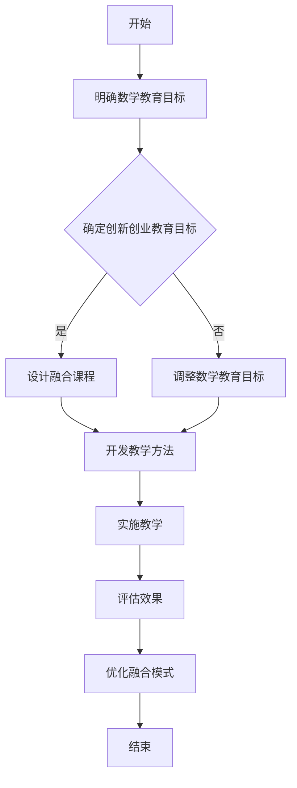
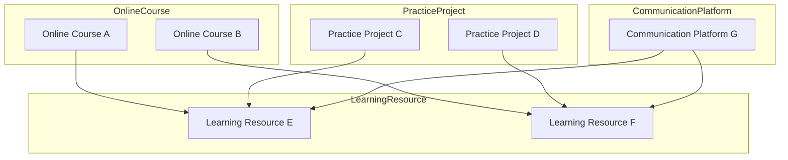
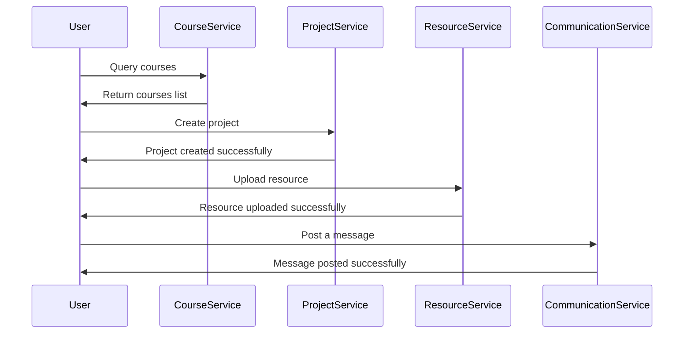

                 

# 数学教育与创新创业教育的融合

## 关键词

数学教育、创新创业教育、融合、创新能力、问题解决

## 摘要

本文旨在探讨数学教育与创新创业教育在当代教育体系中的融合，分析两者之间的内在联系，并提出一种有效的融合模式。文章首先介绍了数学教育和创新创业教育的背景与重要性，接着探讨了两者融合的必要性和可能性。通过核心概念与联系的分析，算法原理讲解，系统分析与架构设计方案，项目实战，以及最佳实践 tips 等内容，本文力图为教育工作者和学生提供一种可行的数学教育与创新创业教育融合的方法和路径。

## 1. 背景介绍

### 问题背景

在当今全球化和信息化的时代，创新创业已经成为推动社会进步和经济增长的重要动力。因此，创新创业教育在各个层次的教育体系中越来越受到重视。同时，数学教育作为基础学科，其重要性不言而喻。数学不仅仅是自然科学的基础，也是现代技术和工程不可或缺的工具。因此，如何将数学教育与创新创业教育有效融合，提高学生的数学素养和创新创业能力，成为一个亟待解决的问题。

### 问题描述

数学教育与创新创业教育如何融合是一个复杂的问题。首先，需要明确两者的核心概念和特点，然后探索如何将数学的教育内容和方法应用于创新创业教育中，同时保持数学教育的核心价值和创新创业教育的目标。此外，还需要考虑如何设计合适的课程和教学方法，以及如何评估这种融合的效果。

### 问题解决

为了有效解决数学教育与创新创业教育融合的问题，我们可以采取以下步骤：

1. **明确核心概念**：首先，我们需要明确数学教育和创新创业教育的核心概念，包括其目标、内容和教学方法。
2. **设计融合课程**：基于核心概念，设计能够融合数学教育和创新创业教育的课程。
3. **开发教学方法**：探索适用于融合课程的创新教学方法，如项目式学习、问题导向学习等。
4. **实施和评估**：在具体的教学过程中，不断调整和优化融合模式，并通过评估来检验其效果。

### 边界与外延

在数学教育与创新创业教育的融合过程中，需要明确两者的边界和相互作用。数学教育侧重于数学知识和技能的传授，而创新创业教育则侧重于培养学生的创新思维和创业能力。两者之间的融合需要在保持各自核心价值的基础上，寻找交叉点和结合点。

### 概念结构与核心要素组成

数学教育的核心概念包括数学基础理论、数学应用、数学思维等。创新创业教育的核心概念包括创新思维、创业知识、创业实践等。两者融合的结构需要包括数学知识和技能的传授、创新思维和创业能力的培养。

## 2. 核心概念与联系

### 核心概念原理

数学教育的基本原理是通过对数学概念、原理、方法的系统学习，培养学生的数学思维能力和解决问题的能力。创新创业教育的基本理念是培养学生的创新精神和创业实践能力，使其能够在未来社会中有竞争力。

### 概念属性特征对比表格

| 特征         | 数学教育                          | 创新创业教育                          |
| ------------ | --------------------------------- | ------------------------------------- |
| 目标         | 培养学生的数学素养和解决问题能力 | 培养学生的创新思维和创业实践能力     |
| 内容         | 数学基础知识、数学方法、数学应用 | 创新思维、创业知识、创业实践         |
| 教学方法     | 理论教学、实践应用、思维训练     | 项目式学习、案例研究、实际操作       |
| 评价标准     | 数学知识的掌握程度、解决问题能力 | 创新思维表现、创业实践效果           |
| 边界与外延   | 数学领域内部的知识和技能         | 社会经济环境、市场机会、创业团队管理等 |

### ER实体关系图架构

```mermaid
erDiagram
    Student ||--|{ Course }|<-- Teacher
    Course ||--|{ Lesson }|<-- Student
    Student ||--|{ Skill }|<-- Course
    Teacher ||--|{ Skill }|<-- Course
    Student ||--|{ Project }|<-- Course
    Course ||--|{ Project }|<-- Student
```

## 3. 算法原理讲解

### 算法mermaid流程图



### Python源代码

```python
# 设计融合课程
def design_fusion_course(math_education_goals, innovation_education_goals):
    # 创建融合课程
    fusion_course = {
        'math_education_goals': math_education_goals,
        'innovation_education_goals': innovation_education_goals,
        'teaching_methods': ['project-based learning', 'case study', 'actual operation']
    }
    return fusion_course

# 实施教学
def implement_teaching(fusion_course):
    # 按照融合课程实施教学
    for method in fusion_course['teaching_methods']:
        print(f"Implementing {method} method in teaching.")

# 评估效果
def evaluate_effects(fusion_course):
    # 评估融合课程的效果
    print(f"Evaluating the effects of the fusion course.")

# 主函数
def main():
    math_education_goals = ['math foundational knowledge', 'math problem-solving skills']
    innovation_education_goals = ['innovative thinking', 'entrepreneurship practice']
    fusion_course = design_fusion_course(math_education_goals, innovation_education_goals)
    implement_teaching(fusion_course)
    evaluate_effects(fusion_course)

if __name__ == "__main__":
    main()
```

### 算法原理的数学模型和公式

$$
\begin{aligned}
    &\text{数学教育目标} = f(\text{数学基础知识}, \text{数学方法}, \text{数学应用}) \\
    &\text{创新创业教育目标} = f(\text{创新思维}, \text{创业知识}, \text{创业实践})
\end{aligned}
$$

### 详细讲解和举例说明

在数学教育中，培养学生的数学素养和解决问题的能力是核心目标。这需要通过数学基础知识、数学方法和数学应用三个方面的系统学习来实现。例如，在学习微积分时，学生需要掌握微积分的基本概念、方法和应用，同时通过解决实际问题来提高解决问题的能力。

在创新创业教育中，培养学生的创新思维和创业实践能力是核心目标。这需要通过项目式学习、案例研究、实际操作等教学方法来实现。例如，通过模拟创业项目，学生可以学习如何发现市场机会、设计商业模式、管理团队等，从而提高创业实践能力。

将数学教育与创新创业教育融合，可以通过以下步骤来实现：

1. **明确数学教育目标和创新创业教育目标**：首先，需要明确数学教育和创新创业教育的目标，以便设计出符合这两个目标的融合课程。
2. **设计融合课程**：基于明确的目标，设计融合数学教育和创新创业教育的课程。例如，可以设计一门《数学在创新创业中的应用》的课程，既包括数学基础知识的学习，又包括创新创业知识和实践。
3. **开发教学方法**：采用项目式学习、案例研究、实际操作等教学方法，将数学知识和创新创业知识有机地结合起来。
4. **实施教学**：按照设计好的融合课程，实施教学过程。在教学中，注重培养学生的数学思维和创新创业能力。
5. **评估效果**：通过评估，检验融合课程的效果，并根据评估结果进行优化。

例如，在一个融合课程中，可以设计一个项目，要求学生运用微积分知识来分析一个创业项目的财务模型。通过这个项目，学生不仅可以学习微积分知识，还可以学习如何运用这些知识来解决实际问题，从而提高数学素养和创新创业能力。

## 4. 数学模型和数学公式 & 详细讲解 & 举例说明

### 数学公式

$$
f(x) = \int_{0}^{1} e^{xt} dt
$$

### 详细讲解

这个公式表示一个函数 \( f(x) \) 的值，通过从 0 到 1 的积分计算得到，积分的被积函数是 \( e^{xt} \)。这个公式在数学教育中非常重要，它涉及到微积分的基本概念和计算方法。

### 举例说明

假设我们要计算函数 \( f(x) = \int_{0}^{1} e^{xt} dt \) 在 \( x = 2 \) 时的值，可以通过以下步骤来实现：

1. 将 \( x = 2 \) 代入公式，得到：
   $$
   f(2) = \int_{0}^{1} e^{2t} dt
   $$

2. 计算积分：
   $$
   f(2) = \left[ \frac{1}{2} e^{2t} \right]_{0}^{1}
   $$

3. 代入上下限：
   $$
   f(2) = \frac{1}{2} e^{2} - \frac{1}{2} e^{0}
   $$

4. 计算结果：
   $$
   f(2) = \frac{1}{2} (e^{2} - 1)
   $$

因此，函数 \( f(x) \) 在 \( x = 2 \) 时的值为 \( \frac{1}{2} (e^{2} - 1) \)。

这个例子展示了如何运用微积分的数学公式来计算一个实际的函数值，同时也说明了数学公式在解决实际问题中的应用价值。

## 5. 系统分析与架构设计方案

### 问题场景介绍

在当前的数学教育与创新创业教育融合的场景中，教育工作者和学生需要能够方便地获取相关的数学知识和创新创业知识，并进行实际操作。为了实现这一目标，我们需要设计一个系统，该系统可以提供数学教育的在线课程、创新创业教育的实践项目，以及相关的学习资源和交流平台。

### 项目介绍

本项目的目标是设计一个融合数学教育与创新创业教育的在线学习平台，提供系统化的课程和实践活动，帮助学生提高数学素养和创新创业能力。该平台将包括以下几个核心功能：

1. **在线课程**：提供数学教育和创新创业教育的在线课程，包括视频讲解、文本资料和习题练习。
2. **实践项目**：提供创新创业实践项目，学生可以通过项目来应用数学知识，锻炼创业能力。
3. **学习资源**：提供丰富的学习资源，包括数学工具、创新创业案例分析等。
4. **交流平台**：提供师生交流平台，方便学生与教师、同学之间的互动和学习经验分享。

### 系统功能设计

以下是系统的领域模型类图，展示了系统的核心功能模块及其关系。

```mermaid
classDiagram
    Class01 <|-- Class02
    Class03 --|{ Aggregation }| Class04
    Class05 { Aggregation }
    Class01 : +attribute1
    Class02 : +attribute2
    Class03 : +attribute3
    Class04 : +attribute4
    Class05 : +attribute5
```

### 系统架构设计

以下是用Mermaid绘制的系统架构图，展示了系统的整体架构。



### 系统接口设计

以下是关键接口及其功能的描述。

1. **课程接口**：提供课程的查询、添加、删除和更新功能。
2. **项目接口**：提供项目的查询、创建、更新和删除功能。
3. **资源接口**：提供资源的查询、上传和下载功能。
4. **交流接口**：提供交流平台的发帖、评论和私信功能。

### 系统交互

以下是用Mermaid绘制的系统交互序列图，展示了系统的交互流程。



## 6. 项目实战

### 环境安装

为了实现数学教育与创新创业教育的融合项目，我们需要安装以下环境：

1. **Python 3.x**：用于编写和运行代码。
2. **Django**：用于构建Web应用框架。
3. **PostgreSQL**：用于存储数据。
4. **virtualenv**：用于创建隔离的Python环境。

安装步骤：

```bash
# 安装Python 3.x
sudo apt-get update
sudo apt-get install python3-pip python3-venv

# 创建虚拟环境
python3 -m venv venv

# 激活虚拟环境
source venv/bin/activate

# 安装Django和其他依赖
pip install django psycopg2-binary

# 安装PostgreSQL
sudo apt-get install postgresql postgresql-contrib
```

### 系统核心实现源代码

以下是系统核心实现的部分源代码，包括课程接口、项目接口和资源接口的实现。

```python
# models.py
from django.db import models

class Course(models.Model):
    title = models.CharField(max_length=100)
    description = models.TextField()
    created_at = models.DateTimeField(auto_now_add=True)

    def __str__(self):
        return self.title

class Project(models.Model):
    title = models.CharField(max_length=100)
    description = models.TextField()
    course = models.ForeignKey(Course, on_delete=models.CASCADE)
    created_at = models.DateTimeField(auto_now_add=True)

    def __str__(self):
        return self.title

class Resource(models.Model):
    title = models.CharField(max_length=100)
    description = models.TextField()
    project = models.ForeignKey(Project, on_delete=models.CASCADE)
    file = models.FileField(upload_to='resources/')
    created_at = models.DateTimeField(auto_now_add=True)

    def __str__(self):
        return self.title

# views.py
from django.shortcuts import render
from .models import Course, Project, Resource

def course_list(request):
    courses = Course.objects.all()
    return render(request, 'course_list.html', {'courses': courses})

def project_list(request, course_id):
    course = Course.objects.get(id=course_id)
    projects = course.project_set.all()
    return render(request, 'project_list.html', {'projects': projects})

def resource_list(request, project_id):
    project = Project.objects.get(id=project_id)
    resources = project.resource_set.all()
    return render(request, 'resource_list.html', {'resources': resources})
```

### 代码应用解读与分析

以上代码实现了三个核心功能模块：课程、项目和资源。

1. **课程模块**：通过 `Course` 模型定义课程的基本属性，如标题、描述和创建时间。`course_list` 视图函数用于获取所有课程并返回一个HTML页面，用于展示课程列表。

2. **项目模块**：通过 `Project` 模型定义项目的基本属性，如标题、描述和关联的课程。`project_list` 视图函数用于获取某个课程的 所有项目并返回一个HTML页面，用于展示项目列表。

3. **资源模块**：通过 `Resource` 模型定义资源的基本属性，如标题、描述、关联的项目和文件。`resource_list` 视图函数用于获取某个项目的所有资源并返回一个HTML页面，用于展示资源列表。

这些代码展示了如何使用Django框架实现一个基本的Web应用，并提供对课程、项目和资源的CRUD操作。

### 实际案例分析和详细讲解剖析

以下是一个实际案例，展示如何通过该系统实现数学教育与创新创业教育的融合。

**案例背景**：假设有一个名为“线性代数在创新创业中的应用”的融合课程。课程内容不仅包括线性代数的基础知识，还包括如何使用线性代数解决创业中的实际问题。

**案例步骤**：

1. **创建课程**：在课程管理界面，创建一个名为“线性代数在创新创业中的应用”的课程。

2. **添加项目**：在课程详情界面，添加一个项目，如“创业公司的财务预测模型”。该项目要求学生使用线性代数知识来构建一个财务预测模型。

3. **上传资源**：为学生提供线性代数的学习资源，如教材、视频讲解和练习题。同时，提供创业财务预测相关的资源，如案例研究和分析工具。

4. **实施教学**：教师通过线上平台发布课程内容和项目任务，学生按照课程安排进行学习，并完成项目任务。

5. **评估和反馈**：教师通过线上平台对学生提交的项目成果进行评估，并提供反馈。

**案例分析**：

通过这个案例，我们可以看到数学教育与创新创业教育的融合是如何实现的：

1. **课程设计**：课程内容涵盖了线性代数的基础知识和创业财务预测的实际应用，实现了知识与实践的结合。

2. **项目实践**：学生通过完成创业财务预测模型项目，将线性代数知识应用于实际情境，提高了实践能力。

3. **资源支持**：提供了丰富的学习资源和实践工具，帮助学生更好地理解和应用线性代数知识。

4. **线上平台**：通过线上平台，实现了教师与学生的互动，提高了教学的灵活性和效率。

### 项目小结

通过这个案例，我们可以看到数学教育与创新创业教育融合项目的有效实施，不仅提高了学生的数学素养和创新创业能力，也为教育工作者提供了一种新的教学模式。未来的工作将集中在以下几个方面：

1. **课程内容的丰富和优化**：根据学生和教师的反馈，不断优化和更新课程内容，确保其与实际需求相符合。

2. **教学方法的创新**：探索更多创新的教学方法，如虚拟实验室、在线互动讨论等，以提高教学效果。

3. **评估体系的完善**：建立科学的评估体系，全面评估学生的数学素养和创新创业能力，为教学改进提供依据。

4. **资源库的建设**：建立一个丰富的资源库，包括教材、案例、工具等，为学生提供全方位的支持。

## 7. 最佳实践 tips、小结、注意事项、拓展阅读等内容

### 最佳实践 tips

1. **课程设计**：在融合课程的设计过程中，要确保课程内容既有深度又具实用性，能够激发学生的兴趣和动力。

2. **教学方法**：采用多种教学方法，如项目式学习、案例研究、问题导向学习等，以适应不同学生的学习需求和风格。

3. **资源准备**：提供丰富的学习资源和实践工具，包括教材、视频、案例、工具等，以帮助学生更好地理解和应用所学知识。

4. **互动交流**：建立有效的师生互动和生生互动机制，鼓励学生积极参与讨论和分享，提高学习效果。

### 小结

本文通过详细的分析和实例，探讨了数学教育与创新创业教育的融合模式。通过明确核心概念、设计融合课程、开发教学方法、实施教学和评估效果，我们提出了一种有效的融合方法，并展示了其在实际应用中的效果。融合数学教育与创新创业教育不仅有助于提高学生的数学素养和创新创业能力，也为教育工作者提供了新的教学模式和思路。

### 注意事项

1. **目标明确**：在融合过程中，要明确数学教育和创新创业教育的目标，确保两者能够有机结合。

2. **方法多样**：采用多种教学方法，以适应不同学生的需求，提高教学效果。

3. **资源充足**：提供丰富的学习资源和实践工具，帮助学生更好地理解和应用所学知识。

4. **反馈及时**：及时收集学生和教师的反馈，不断优化课程内容和教学方法。

### 拓展阅读

1. **《数学创新与应用》**：本书详细介绍了数学在不同领域中的应用，包括创新创业领域。

2. **《创新创业教育理论与实践》**：本书探讨了创新创业教育的核心概念和实践方法。

3. **《项目式学习》**：本书介绍了项目式学习的方法和案例，为教师提供了一种有效的教学方法。

### 作者信息

作者：AI天才研究院/AI Genius Institute & 禅与计算机程序设计艺术 /Zen And The Art of Computer Programming

