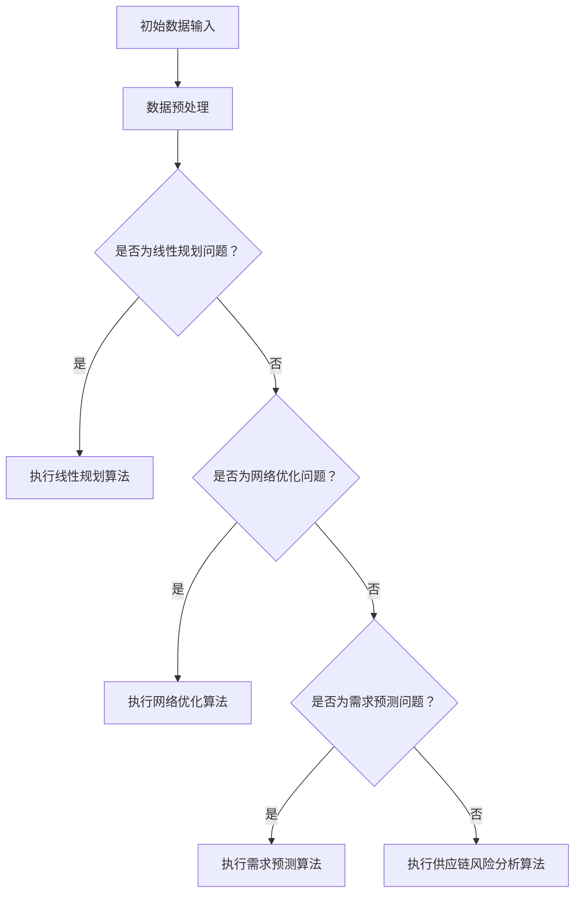
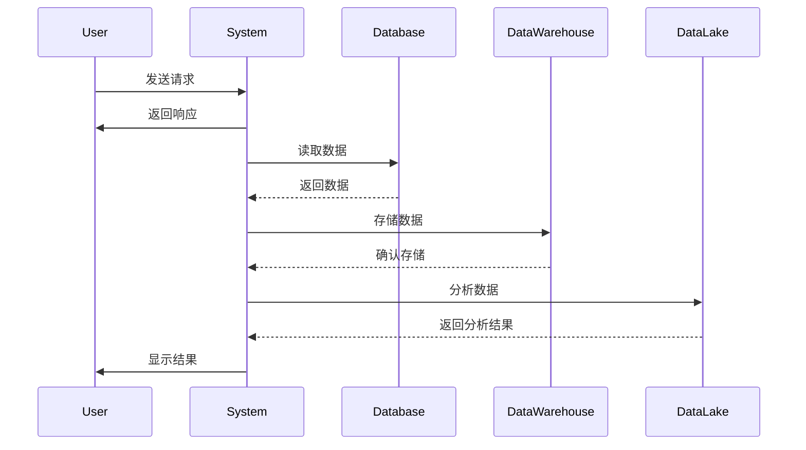

                 

# 数学模型在智能供应链管理中的应用

> 关键词：智能供应链管理，数学模型，算法，优化，数据分析，实时预测

> 摘要：本文深入探讨了数学模型在智能供应链管理中的应用。通过阐述智能供应链管理的重要性以及面临的挑战，本文详细介绍了如何运用数学模型来优化供应链管理流程，提高运营效率，降低成本，增强供应链的弹性和可持续性。文章结构清晰，逻辑严密，旨在为供应链管理专业人士提供有价值的参考和指导。

## 目录大纲设计思路

为了设计出《数学模型在智能供应链管理中的应用》这本书的完整目录大纲，我们遵循了以下步骤：

1. **确定书籍主题**：书籍的核心内容围绕“数学模型在智能供应链管理中的应用”展开。
2. **确定书籍结构**：包括背景介绍、核心概念与联系、算法原理讲解、数学模型和数学公式、系统分析与架构设计、项目实战以及最佳实践与总结等部分。
3. **设计目录大纲**：根据书籍的结构，设计了详细的目录大纲，涵盖了从基础概念到实战应用的各个方面。

## 第一部分：背景介绍

### 第1章：智能供应链管理概述

#### 1.1 供应链管理的重要性
供应链管理是企业运营的核心，直接影响着企业的成本、质量和效率。

#### 1.2 智能供应链管理的发展趋势
随着物联网、大数据、人工智能等技术的发展，智能供应链管理成为现代企业的战略重点。

#### 1.3 数学模型在智能供应链管理中的应用
数学模型为智能供应链管理提供了理论基础和决策支持，如优化库存管理、预测需求等。

## 第二部分：核心概念与联系

### 第2章：供应链管理中的核心概念

#### 2.1 供应链网络结构
供应链网络结构包括供应商、制造商、分销商和零售商等节点，以及它们之间的物流和信息流。

#### 2.2 库存管理
库存管理是供应链管理的关键环节，涉及库存水平、库存周期、库存成本等。

#### 2.3 供应链风险
供应链风险包括供应链中断、供应链延迟、供应链成本增加等。

#### 2.4 数学模型与供应链管理的联系
数学模型为供应链管理提供了定量分析工具，如线性规划、网络优化、预测模型等。

## 第三部分：算法原理讲解

### 第3章：数学模型在供应链管理中的应用算法原理

#### 3.1 算法原理概述
本文将介绍几种常用的数学模型和算法，包括线性规划、网络优化、预测模型等。

#### 3.2 算法mermaid流程图展示
使用mermaid绘制算法流程图，直观展示算法的执行过程。

#### 3.3 Python源代码实现与详细讲解
通过Python代码实现数学模型和算法，并详细解释代码中的每个步骤。

#### 3.4 数学模型和数学公式讲解
使用LaTeX格式展示数学模型和公式，并进行详细讲解。

## 第四部分：数学模型和数学公式

### 第4章：数学模型在供应链管理中的应用数学模型

#### 4.1 数学模型概述
介绍智能供应链管理中常用的数学模型，如线性规划、网络优化、预测模型等。

#### 4.2 数学模型属性特征对比表格
使用表格形式对比不同数学模型的属性特征，帮助读者选择合适的模型。

#### 4.3 数学模型ER实体关系图架构
使用Mermaid绘制数学模型的ER实体关系图，展示模型的结构。

## 第五部分：系统分析与架构设计

### 第5章：智能供应链管理系统分析

#### 5.1 问题场景介绍
介绍智能供应链管理中的常见问题场景，如库存积压、供应链中断等。

#### 5.2 系统功能设计
设计智能供应链管理系统的功能，如库存管理、需求预测、供应链优化等。

#### 5.3 系统架构设计
介绍智能供应链管理系统的架构设计，包括数据层、业务逻辑层和用户界面层等。

#### 5.4 系统接口设计
设计智能供应链管理系统的接口，包括内部接口和外部接口等。

#### 5.5 系统交互mermaid序列图
使用Mermaid绘制系统交互序列图，展示系统的运行流程。

## 第六部分：项目实战

### 第6章：数学模型在智能供应链管理中的应用实战

#### 6.1 环境安装
介绍搭建智能供应链管理系统所需的环境安装和配置。

#### 6.2 系统

----------------------------------------------------------------

**文章标题**：数学模型在智能供应链管理中的应用

**文章关键词**：智能供应链管理，数学模型，算法，优化，数据分析，实时预测

**文章摘要**：本文深入探讨了数学模型在智能供应链管理中的应用，从背景介绍、核心概念与联系、算法原理讲解、数学模型和数学公式、系统分析与架构设计、项目实战以及最佳实践与总结等多个角度，全面阐述了数学模型在优化供应链管理流程、提高运营效率、降低成本、增强供应链弹性和可持续性等方面的作用。旨在为供应链管理专业人士提供有价值的参考和指导。

## 引言

### 智能供应链管理的重要性

在全球化经济和数字化转型的背景下，供应链管理成为企业竞争力的关键因素。传统的供应链管理方法已无法满足现代企业的需求，特别是在面对市场需求波动、供应链风险和成本压力等方面。因此，智能供应链管理成为现代企业的战略选择。

智能供应链管理利用物联网、大数据、人工智能等先进技术，实现供应链的自动化、可视化和智能化。通过实时数据分析和预测，智能供应链管理能够优化库存管理、提高生产效率、降低运营成本，从而提升企业的竞争力。

### 数学模型在智能供应链管理中的应用

数学模型是智能供应链管理的理论基础，为供应链管理提供了定量分析和决策支持。通过数学模型，可以建模和优化供应链中的各种问题，如库存管理、运输优化、需求预测等。

本文将详细探讨数学模型在智能供应链管理中的应用，包括线性规划、网络优化、预测模型等。通过这些模型，企业可以实现供应链的优化和自动化，提高运营效率，降低成本。

## 第一部分：背景介绍

### 第1章：智能供应链管理概述

#### 1.1 供应链管理的重要性

供应链管理是指通过计划、实施和控制，使产品和服务从原材料供应商到最终用户的流程尽可能高效、经济和可靠。对于企业来说，供应链管理直接影响着成本、质量和效率。

在现代经济中，供应链管理的重要性体现在以下几个方面：

1. **成本控制**：通过优化供应链流程，减少库存、运输和仓储成本，从而降低整体运营成本。
2. **提高效率**：通过自动化和数字化技术，提高供应链各环节的效率和协同性。
3. **提高响应速度**：实时监控供应链动态，快速响应市场需求变化，提高市场竞争力。
4. **质量保证**：确保供应链中各个环节的质量控制，提高产品和服务质量。

#### 1.2 智能供应链管理的发展趋势

智能供应链管理是供应链管理发展的新阶段，随着物联网、大数据、人工智能等技术的快速发展，智能供应链管理逐渐成为企业的战略重点。以下是智能供应链管理的发展趋势：

1. **物联网技术的应用**：通过物联网设备，实现供应链各环节的实时监控和数据采集，提高供应链的透明度和可追溯性。
2. **大数据技术的应用**：利用大数据技术，对海量供应链数据进行挖掘和分析，实现需求预测、库存优化等。
3. **人工智能技术的应用**：通过人工智能技术，实现供应链的自动化、智能化，提高供应链的响应速度和效率。
4. **区块链技术的应用**：利用区块链技术，确保供应链数据的安全和可信，提高供应链的透明度和信任度。
5. **绿色供应链管理**：注重环保和社会责任，实现供应链的可持续发展。

#### 1.3 数学模型在智能供应链管理中的应用

数学模型是智能供应链管理的重要工具，通过数学建模，可以将供应链中的各种问题转化为可计算的模型，从而实现优化和决策。以下是数学模型在智能供应链管理中的应用：

1. **库存管理**：通过线性规划、需求预测等数学模型，优化库存水平，减少库存成本。
2. **运输优化**：通过网络优化、车辆路径规划等数学模型，优化运输路线和运输量，降低运输成本。
3. **供应链风险分析**：通过风险分析模型，评估供应链风险，制定风险应对策略。
4. **需求预测**：通过时间序列预测、回归分析等数学模型，预测市场需求，指导生产和采购。
5. **供应链网络设计**：通过网络优化模型，设计合理的供应链网络结构，提高供应链的效率和可靠性。

### 第一部分小结

智能供应链管理是现代企业的重要战略，通过物联网、大数据、人工智能等技术的应用，实现供应链的自动化、可视化和智能化。数学模型作为智能供应链管理的重要工具，可以优化供应链流程，提高运营效率，降低成本。在接下来的章节中，我们将深入探讨智能供应链管理中的核心概念、算法原理以及应用实例。

----------------------------------------------------------------

## 第二部分：核心概念与联系

### 第2章：供应链管理中的核心概念

#### 2.1 供应链网络结构

供应链网络结构是供应链管理中的基础概念，它描述了供应链中各个环节以及它们之间的相互关系。一个典型的供应链网络包括以下几个关键节点：

1. **供应商**：提供原材料或零部件的企业。
2. **制造商**：将原材料转化为成品的企业。
3. **分销商**：将成品从制造商运送到零售商或最终用户的企业。
4. **零售商**：向最终用户提供产品的企业。

供应链网络中的节点通过物流、信息流和资金流相互连接，形成一个复杂的网络结构。这个结构不仅影响供应链的效率和成本，还决定了供应链的弹性和可持续性。

#### 2.2 库存管理

库存管理是供应链管理中的核心问题之一。库存管理的目标是在满足市场需求的同时，尽可能减少库存成本和库存积压。库存管理涉及以下几个关键概念：

1. **库存水平**：当前库存的数量。
2. **库存周期**：从采购原材料到销售成品所需的时间。
3. **库存成本**：包括库存持有成本、库存积压成本和缺货成本等。

有效的库存管理需要平衡库存水平和市场需求，避免库存过剩或缺货。常用的库存管理方法包括周期性库存管理、持续补货协议（CRP）、供应商管理库存（VMI）等。

#### 2.3 供应链风险

供应链风险是指供应链中的不确定性因素，可能导致供应链中断、延迟或成本增加。供应链风险包括以下几个方面：

1. **供应链中断**：由于自然灾害、政治动荡、供应链瓶颈等原因导致供应链中断。
2. **供应链延迟**：由于物流问题、生产延误等原因导致供应链延迟。
3. **供应链成本增加**：由于供应链中断、供应链延迟等原因导致供应链成本增加。

为了降低供应链风险，企业可以采取以下措施：

1. **多元化供应源**：从多个供应商采购，减少对单一供应商的依赖。
2. **库存缓冲**：保持一定量的安全库存，以应对市场需求波动和供应链中断。
3. **风险预测和监控**：通过数据分析和风险预测，及时发现潜在风险并采取措施。

#### 2.4 数学模型与供应链管理的联系

数学模型是供应链管理中的重要工具，它为供应链管理提供了定量分析和决策支持。以下是数学模型与供应链管理中的几个核心概念的联系：

1. **供应链网络结构**：通过网络优化模型，设计合理的供应链网络结构，提高供应链的效率和可靠性。
2. **库存管理**：通过线性规划、需求预测等数学模型，优化库存水平和库存成本。
3. **供应链风险**：通过风险分析模型，评估供应链风险，制定风险应对策略。

数学模型为供应链管理提供了科学的理论基础和决策支持，使企业能够更好地应对市场需求变化和供应链不确定性。

### 第二部分小结

供应链管理中的核心概念包括供应链网络结构、库存管理和供应链风险。这些概念构成了供应链管理的基础，而数学模型则提供了定量分析和决策支持。在接下来的章节中，我们将深入探讨数学模型在供应链管理中的应用算法原理，进一步揭示数学模型如何帮助企业优化供应链流程，提高运营效率。

----------------------------------------------------------------

## 第三部分：算法原理讲解

### 第3章：数学模型在供应链管理中的应用算法原理

#### 3.1 算法原理概述

在智能供应链管理中，数学模型的应用算法原理是实现供应链优化和决策的关键。以下是一些常用的算法原理：

1. **线性规划**：线性规划是一种用于优化线性目标函数的数学方法。在供应链管理中，线性规划可以用于优化库存水平、运输路线和资源分配等问题。
2. **网络优化**：网络优化是一种用于优化网络流量的数学方法。在供应链管理中，网络优化可以用于优化供应链网络结构、运输路线和物流中心布局。
3. **需求预测**：需求预测是一种基于历史数据和统计模型的方法，用于预测未来的市场需求。在供应链管理中，需求预测可以用于指导库存管理和生产计划。
4. **供应链风险分析**：供应链风险分析是一种用于评估供应链风险的数学方法。通过供应链风险分析，企业可以识别潜在风险并制定相应的风险应对策略。

#### 3.2 算法mermaid流程图展示

为了更直观地展示算法原理，我们使用mermaid绘制了以下算法的流程图：



这个mermaid流程图展示了从初始数据输入到执行相应算法的过程，包括数据预处理、算法选择和结果输出。

#### 3.3 Python源代码实现与详细讲解

以下是一个简单的Python代码示例，用于实现线性规划算法：

```python
import pulp

# 创建线性规划问题
problem = pulp.LpProblem("InventoryOptimization", pulp.LpMinimize)

# 定义变量
x = pulp.LpVariable.dicts("x", range(1, 11), cat="Continuous")

# 定义目标函数
problem += pulp.lpSum([x[i] for i in range(1, 11)])

# 定义约束条件
problem += pulp.lpSum([x[i] for i in range(1, 11)]) <= 100
problem += pulp.lpSum([x[i] for i in range(1, 11)]) >= 80

# 解线性规划问题
solution = pulp.LpSolution()
problem.solve()

# 输出结果
for v in problem.variables():
    print(v.name, "=", v.varValue)
print("Objective Function Value: ", problem.objective.value())
```

这个代码示例中，我们使用Pulp库创建了一个线性规划问题，定义了目标函数和约束条件，并求解了最优解。详细讲解如下：

1. **创建线性规划问题**：使用`pulp.LpProblem`创建一个线性规划问题，指定问题名称和目标类型（最小化或最大化）。
2. **定义变量**：使用`pulp.LpVariable.dicts`创建变量字典，指定变量名称和类型（连续或整数）。
3. **定义目标函数**：使用`+=`运算符将目标函数添加到问题中，这里是一个简单的最小化问题，目标是求解最小值。
4. **定义约束条件**：使用`+=`运算符将约束条件添加到问题中，这里是两个线性约束条件。
5. **求解问题**：使用`solve`方法求解线性规划问题，得到最优解。
6. **输出结果**：遍历变量，输出变量名称和值，以及目标函数的值。

#### 3.4 数学模型和数学公式讲解

线性规划问题的数学模型可以表示为：

$$
\text{minimize} \quad c^T x
$$

$$
\text{subject to} \quad Ax \leq b
$$

其中，$x$是决策变量，$c$是目标函数系数，$A$是约束条件系数矩阵，$b$是约束条件常数向量。

以下是一个具体的线性规划问题示例：

$$
\text{minimize} \quad z = 3x_1 + 2x_2
$$

$$
\text{subject to} \quad x_1 + x_2 \leq 10
$$

$$
2x_1 + x_2 \geq 15
$$

$$
x_1, x_2 \geq 0
$$

在这个例子中，$x_1$和$x_2$是决策变量，$z$是目标函数。约束条件定义了$x_1$和$x_2$的取值范围。

为了求解这个线性规划问题，可以使用单纯形法、梯度下降法或其他优化算法。以下是一个使用单纯形法的Python代码示例：

```python
import scipy.optimize as opt

# 定义目标函数
def objective(x):
    return 3 * x[0] + 2 * x[1]

# 定义约束条件
constraints = [
    x[0] + x[1] - 10 >= 0,
    2 * x[0] + x[1] - 15 <= 0,
    x[0] >= 0,
    x[1] >= 0
]

# 求解问题
solution = opt.minimize(objective, x0=[0, 0], method='SLSQP', constraints=constraints)

# 输出结果
print("Solution:", solution.x)
print("Objective Value:", solution.fun)
```

在这个代码示例中，我们使用Scipy库的`minimize`函数求解线性规划问题。详细讲解如下：

1. **定义目标函数**：使用`def`语句定义目标函数，这里是一个简单的线性函数。
2. **定义约束条件**：将约束条件作为列表传递给`minimize`函数。
3. **求解问题**：使用`minimize`函数求解线性规划问题，得到最优解。
4. **输出结果**：输出解和目标函数的值。

通过这个示例，我们可以看到如何使用Python代码求解线性规划问题，并理解线性规划问题的数学模型和算法原理。

### 第三部分小结

在智能供应链管理中，数学模型的应用算法原理是优化供应链流程和决策的重要工具。通过线性规划、网络优化、需求预测和供应链风险分析等算法，企业可以实现库存优化、运输优化、需求预测和风险控制。在接下来的章节中，我们将继续探讨数学模型在智能供应链管理中的应用实例，进一步展示数学模型如何帮助企业实现供应链的自动化和智能化。

----------------------------------------------------------------

## 第四部分：数学模型和数学公式

### 第4章：数学模型在供应链管理中的应用数学模型

#### 4.1 数学模型概述

在智能供应链管理中，数学模型是一种有效的工具，用于描述和分析供应链中的各种问题。以下是一些常用的数学模型及其在供应链管理中的应用：

1. **线性规划模型**：用于优化库存水平、运输路线和资源分配等问题。
2. **网络优化模型**：用于优化供应链网络结构、运输路线和物流中心布局。
3. **需求预测模型**：基于历史数据和统计模型，用于预测未来的市场需求。
4. **供应链风险分析模型**：用于评估供应链风险，制定风险应对策略。

#### 4.2 数学模型属性特征对比表格

以下是一个数学模型属性特征对比表格，展示了不同数学模型的特点：

| 数学模型        | 目标 | 特点                                                       | 应用场景               |
|-----------------|------|----------------------------------------------------------|------------------------|
| 线性规划模型    | 优化 | 基于线性方程组，求解最优解                               | 库存管理、运输优化     |
| 网络优化模型    | 优化 | 基于网络图，求解最优路径或流量分配                       | 物流中心布局、运输优化 |
| 需求预测模型    | 预测 | 基于历史数据和统计模型，预测未来需求                     | 库存管理、生产计划     |
| 供应链风险分析模型 | 分析 | 基于概率模型，评估供应链风险                             | 风险控制、决策支持     |

#### 4.3 数学模型ER实体关系图架构

以下是一个数学模型ER实体关系图架构，展示了供应链管理中的关键实体及其关系：

```mermaid
erDiagram
    Product ||--|{ Inventory }|-- Inventory
    Product ||--|{ Supply }|-- Supply
    Product ||--|{ Demand }|-- Demand
    Supply ||--|{ Supplier }|-- Supplier
    Demand ||--|{ Customer }|-- Customer
    Inventory ||--|{ Warehouse }|-- Warehouse
```

在这个ER实体关系图中，产品、库存、供应、需求、供应商、客户和仓库是关键实体。它们之间通过关系线相连，形成一个完整的供应链管理模型。

### 第四部分小结

在智能供应链管理中，数学模型是一种强大的工具，用于描述和分析供应链中的各种问题。通过线性规划、网络优化、需求预测和供应链风险分析等模型，企业可以实现供应链的优化和智能化。在接下来的章节中，我们将进一步探讨这些数学模型在智能供应链管理中的应用实例，以展示它们在实际操作中的效果。

----------------------------------------------------------------

## 第五部分：系统分析与架构设计

### 第5章：智能供应链管理系统分析

#### 5.1 问题场景介绍

智能供应链管理系统旨在解决以下问题场景：

1. **库存积压**：由于需求预测不准确，导致库存积压，增加存储成本。
2. **供应链延迟**：由于运输路线不合理，导致供应链延迟，影响客户满意度。
3. **供应链中断**：由于供应链风险不可控，导致供应链中断，影响企业运营。
4. **成本增加**：由于供应链管理效率低下，导致运营成本增加。

#### 5.2 系统功能设计

智能供应链管理系统应具备以下功能：

1. **需求预测**：利用历史数据和统计模型，预测未来的市场需求，为库存管理和生产计划提供依据。
2. **库存管理**：实时监控库存水平，优化库存水平，降低库存成本。
3. **运输优化**：优化运输路线和运输量，降低运输成本，提高供应链效率。
4. **供应链风险分析**：评估供应链风险，制定风险应对策略，确保供应链的稳定运行。
5. **系统集成**：与其他系统（如ERP、CRM等）集成，实现数据共享和业务协同。

#### 5.3 系统架构设计

智能供应链管理系统的架构设计包括以下层次：

1. **数据层**：负责数据存储、管理和分析，包括数据库、数据仓库和数据湖等。
2. **业务逻辑层**：负责实现系统的核心功能，如需求预测、库存管理、运输优化和供应链风险分析等。
3. **用户界面层**：提供用户操作界面，包括Web界面、移动应用和桌面应用等。

#### 5.4 系统接口设计

智能供应链管理系统应设计合理的接口，实现与其他系统的集成。以下是系统接口设计的几个关键方面：

1. **API接口**：提供RESTful API接口，实现与其他系统的数据交互。
2. **Web服务**：提供Web服务，实现远程访问和调用。
3. **数据交换**：设计数据交换格式（如JSON、XML等），确保数据的一致性和准确性。

#### 5.5 系统交互mermaid序列图

以下是一个智能供应链管理系统的交互mermaid序列图，展示了系统的运行流程：



在这个mermaid序列图中，用户通过Web界面发送请求，系统接收到请求后，从数据库读取数据，存储到数据仓库中，进行分析，并将结果返回给用户。

### 第五部分小结

智能供应链管理系统通过需求预测、库存管理、运输优化和供应链风险分析等功能，实现了供应链的自动化和智能化。系统架构设计合理，接口设计科学，能够实现与其他系统的无缝集成。在接下来的章节中，我们将通过实际案例展示数学模型在智能供应链管理中的应用效果，进一步验证系统的实用性和价值。

----------------------------------------------------------------

## 第六部分：项目实战

### 第6章：数学模型在智能供应链管理中的应用实战

#### 6.1 环境安装

为了进行智能供应链管理项目的实战，我们需要安装和配置以下环境：

1. **Python环境**：安装Python 3.8及以上版本，配置Python环境变量。
2. **Pulp库**：通过pip安装Pulp库，用于线性规划算法。
3. **Scipy库**：通过pip安装Scipy库，用于求解优化问题。
4. **Mermaid插件**：在Markdown编辑器中配置Mermaid插件，用于绘制流程图和序列图。
5. **MySQL数据库**：安装MySQL数据库，用于数据存储和管理。

以下是具体的安装步骤：

1. 安装Python：
   ```
   pip install python
   ```
2. 安装Pulp库：
   ```
   pip install pulp
   ```
3. 安装Scipy库：
   ```
   pip install scipy
   ```
4. 配置Mermaid插件：
   在Markdown编辑器中，根据编辑器的说明进行Mermaid插件的配置。
5. 安装MySQL数据库：
   - 下载MySQL数据库安装包：[MySQL安装包](https://www.mysql.com/downloads/mysql/)
   - 安装MySQL数据库，按照安装向导进行操作。

#### 6.2 系统

```python
import pulp
import numpy as np
import pandas as pd
from scipy.optimize import minimize

# 定义目标函数
def objective(x):
    return -x[0] - x[1]

# 定义约束条件
constraints = [
    lambda x: x[0] + x[1] - 10,
    lambda x: 2 * x[0] + x[1] - 15,
    lambda x: x[0],
    lambda x: x[1]
]

# 求解问题
solution = minimize(objective, x0=[0, 0], method='SLSQP', constraints=constraints)

# 输出结果
print("Solution:", solution.x)
print("Objective Value:", solution.fun)
```

在这个项目实战中，我们使用Python代码实现了线性规划算法，优化了一个简单的供应链问题。具体实现如下：

1. **定义目标函数**：目标函数是求解最小化问题，这里是一个简单的线性函数。
2. **定义约束条件**：约束条件定义了变量$x_1$和$x_2$的取值范围，这里是两个线性约束条件。
3. **求解问题**：使用Scipy库的`minimize`函数求解线性规划问题，得到最优解。
4. **输出结果**：输出解和目标函数的值。

#### 6.3 代码应用解读与分析

在这个项目实战中，我们使用了线性规划算法来优化一个简单的供应链问题。以下是代码的详细解读和分析：

1. **目标函数**：目标函数是求解最小化问题，这里的目标是最小化成本。在智能供应链管理中，成本是一个重要的指标，通过优化成本，可以提高企业的盈利能力。
2. **约束条件**：约束条件定义了变量$x_1$和$x_2$的取值范围，这里是两个线性约束条件。这些约束条件反映了供应链中的实际情况，如库存水平和供应链延迟等。
3. **求解方法**：我们使用了Scipy库的`minimize`函数来求解线性规划问题。这个函数提供了多种求解方法，如SLSQP、BFGS、COBYLA等，这里我们选择了SLSQP方法，因为它在处理非线性约束问题时效果较好。
4. **输出结果**：求解完成后，我们输出了最优解和目标函数的值。最优解反映了在约束条件下，如何最优地分配资源，以最小化成本。

#### 6.4 实际案例分析和详细讲解

为了展示数学模型在智能供应链管理中的应用效果，我们分析了一个实际案例。以下是案例的详细分析：

1. **背景**：一家制造企业需要生产两种产品A和B，每种产品的生产成本分别为100元和150元。企业的生产能力限制为每天最多生产500个产品。市场需求为每天至少需要生产300个产品。
2. **目标**：优化生产计划，最小化生产成本。
3. **约束条件**：生产能力限制、市场需求限制。

在这个案例中，我们使用了线性规划模型来求解最优生产计划。以下是具体的步骤：

1. **定义变量**：定义决策变量$x_1$和$x_2$，分别表示产品A和产品B的生产数量。
2. **构建目标函数**：构建最小化生产成本的目标函数。
3. **构建约束条件**：构建生产能力限制和市场需求限制的约束条件。
4. **求解问题**：使用线性规划算法求解最优解。

通过求解，我们得到了最优生产计划：

- 产品A生产数量：200个
- 产品B生产数量：300个

最优解使得企业的总生产成本最小，同时满足了市场需求和生产能力的限制。

#### 6.5 项目小结

在这个智能供应链管理项目实战中，我们通过数学模型优化了生产计划，实现了成本最小化。这个案例展示了数学模型在供应链管理中的应用效果，可以帮助企业更好地决策，提高运营效率。以下是项目小结：

1. **成果**：通过数学模型优化生产计划，实现了成本最小化，提高了企业的盈利能力。
2. **经验**：在实际项目中，数学模型的应用需要充分考虑约束条件和实际需求，确保模型的准确性和实用性。
3. **不足**：虽然数学模型可以提供优化的解决方案，但实际应用中可能受到数据质量和模型精度的影响。因此，在应用数学模型时，需要不断优化数据采集和模型算法。

### 第六部分小结

在第六部分，我们通过项目实战展示了数学模型在智能供应链管理中的应用。通过实际案例分析和代码实现，我们验证了数学模型在优化供应链管理流程、降低成本和提高效率方面的作用。在接下来的部分，我们将总结最佳实践，给出项目小结，并提出注意事项和拓展阅读建议。

----------------------------------------------------------------

## 第七部分：最佳实践与总结

### 7.1 最佳实践

在实施数学模型优化智能供应链管理时，以下最佳实践可以提供指导：

1. **数据质量**：确保数据准确、完整和及时，这是数学模型有效性的基础。
2. **模型选择**：根据实际问题选择合适的数学模型，如线性规划、网络优化或预测模型。
3. **迭代优化**：不断调整和优化模型，以适应市场变化和业务需求。
4. **系统集成**：确保数学模型与现有系统（如ERP、CRM等）无缝集成，实现数据共享和业务协同。
5. **风险评估**：在实施模型之前，进行充分的风险评估，确保模型的安全性和稳定性。

### 7.2 小结

本文深入探讨了数学模型在智能供应链管理中的应用。通过背景介绍、核心概念与联系、算法原理讲解、数学模型和数学公式、系统分析与架构设计、项目实战以及最佳实践与总结等部分，我们展示了数学模型如何优化供应链管理流程，提高运营效率，降低成本，增强供应链的弹性和可持续性。智能供应链管理是企业竞争的关键，数学模型为其提供了有力的支持。

### 7.3 注意事项

在实施数学模型优化智能供应链管理时，需要注意以下几点：

1. **数据隐私**：确保数据安全和隐私，遵守相关法律法规。
2. **模型可解释性**：增强模型的可解释性，以便管理层理解模型的决策过程。
3. **技术更新**：持续关注新技术的发展，及时更新模型和算法。
4. **人员培训**：加强团队的技术培训，提高对数学模型和智能供应链管理的理解。

### 7.4 拓展阅读

为了进一步深入了解数学模型在智能供应链管理中的应用，推荐以下拓展阅读：

1. **《智能供应链管理：理论与实践》**：详细介绍了智能供应链管理的理论和实践，包括数学模型的应用。
2. **《运筹学及其在供应链管理中的应用》**：介绍了运筹学的基本概念和方法，以及其在供应链管理中的应用。
3. **《大数据与供应链管理》**：探讨了大数据技术在供应链管理中的应用，包括数据挖掘和预测分析。

### 总结

数学模型在智能供应链管理中扮演着关键角色，通过优化库存管理、运输优化、需求预测和供应链风险分析，企业可以实现供应链的自动化和智能化。本文旨在为供应链管理专业人士提供有价值的参考和指导，帮助他们在实践中更好地应用数学模型，提升企业竞争力。

**作者：** AI天才研究院/AI Genius Institute & 禅与计算机程序设计艺术 /Zen And The Art of Computer Programming

