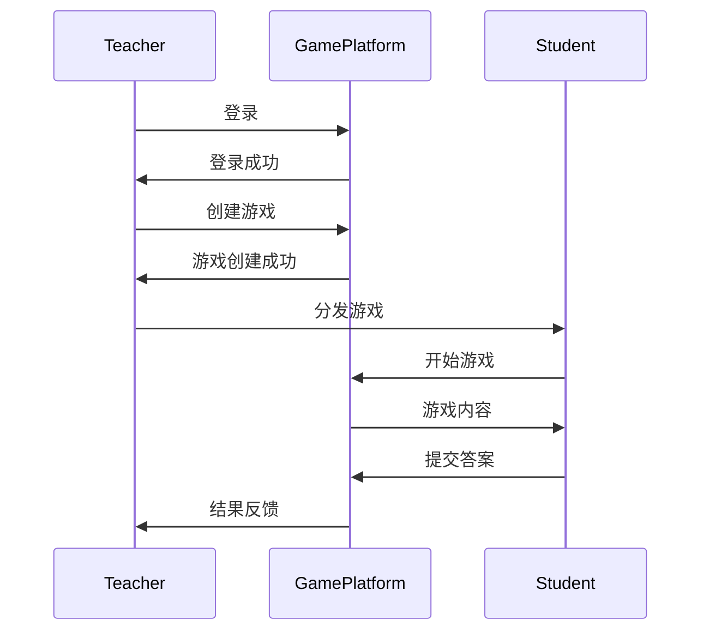
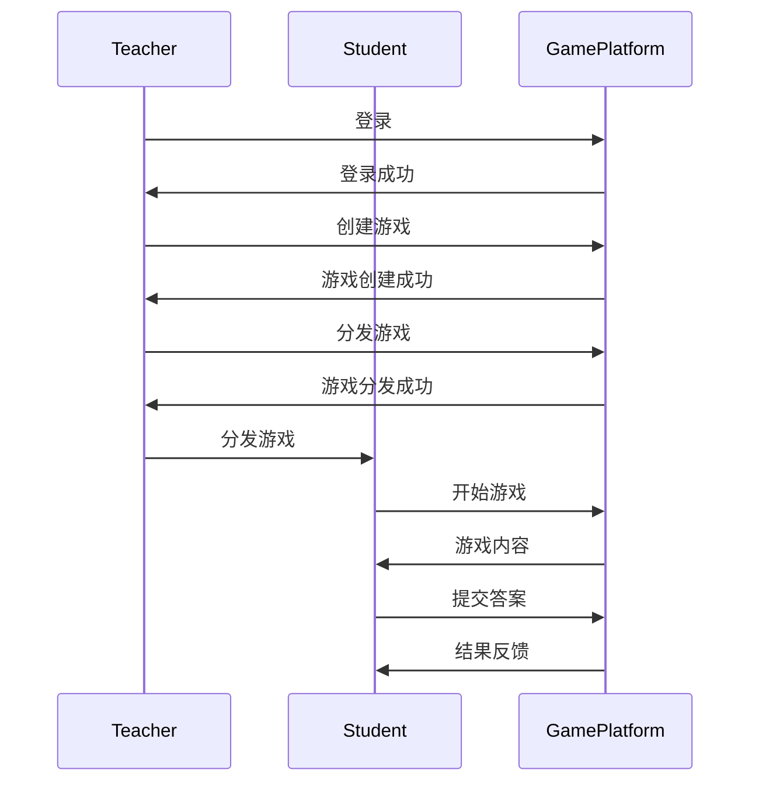

                 

### 数学游戏与儿童创造性问题解决能力培养

#### 关键词

- 数学游戏
- 儿童创造性问题解决能力
- 教育技术
- 数学思维
- 教学策略

#### 摘要

本文探讨了数学游戏在儿童创造性问题解决能力培养中的应用。通过介绍数学游戏的核心概念、原理及其与创造性问题解决能力的联系，本文详细分析了数学游戏的类型、属性特征，并借助数学模型和算法原理，讲解了如何通过数学游戏有效提升儿童的数学思维和创造力。最后，本文提出了一个数学游戏平台的系统分析与架构设计方案，以期为教育技术领域提供实用的参考。

## 第一部分：背景介绍

### 核心概念

#### 数学游戏

数学游戏是一种将数学知识融入游戏中的教学方法，通过游戏的形式来激发学生的学习兴趣，提高他们的数学技能。数学游戏通常包括数字游戏、图形游戏、逻辑游戏等，每种游戏都有其独特的数学原理和策略。

#### 创造性问题解决能力

创造性问题解决能力是指在面对新问题和挑战时，能够灵活运用已有的知识和方法，创造出新的解决方案的能力。这种能力不仅涉及到数学知识，还包括逻辑思维、创新能力、团队合作等多个方面。

#### 儿童创造性问题解决能力培养

儿童创造性问题解决能力的培养，关键在于提供丰富多样的数学游戏和问题情境，引导儿童在游戏中探索、发现和解决问题。这种方式不仅可以激发儿童的兴趣，还能培养他们的数学思维和创造力。

### 问题背景

随着数学在教育中的重要性日益增加，如何培养儿童的创造性问题解决能力成为一个备受关注的问题。传统的教学方法往往侧重于知识灌输和公式记忆，而忽视了学生的实际应用能力和创新思维。因此，寻找一种既能激发学习兴趣，又能培养创造性问题解决能力的教学手段，显得尤为重要。

数学游戏作为一种有趣且富有挑战性的教学手段，不仅可以激发学生的学习兴趣，还能有效提升他们的数学思维和创造力。通过数学游戏，学生可以在轻松愉快的氛围中，探索数学的奥秘，发现解决问题的多种可能性。

### 问题描述

儿童在数学学习中往往面临问题解决能力的瓶颈，他们可能能够记住公式和解题步骤，但在遇到新的、复杂的数学问题时却显得束手无策。这主要是因为传统教学方法侧重于知识灌输和机械记忆，而缺乏对创造性问题解决能力的培养。因此，如何通过数学游戏来培养儿童的创造性问题解决能力，成为一个亟待解决的问题。

### 问题解决

数学游戏通过设置各种趣味性的数学问题和挑战，引导儿童在游戏中探索、发现和解决问题。这种方式不仅能够激发儿童的兴趣，还能培养他们的数学思维、逻辑推理能力和创造性问题解决能力。

数学游戏的形式多样，可以是数字游戏、图形游戏、逻辑游戏等，每种游戏都有其独特的数学原理和策略。例如，数字游戏可以通过数字的运算和组合，培养儿童的数学运算能力和逻辑思维；图形游戏可以通过图形的变换和组合，培养儿童的空间想象能力和创造力；逻辑游戏可以通过逻辑推理和策略运用，培养儿童的逻辑思维能力和解决问题的能力。

### 边界与外延

数学游戏的应用范围广泛，不仅限于课堂教学，还可以用于家庭教育和课外活动。数学游戏的形式多样，可以是数字游戏、图形游戏、逻辑游戏等，因此具有很高的灵活性和适应性。

数学游戏的核心要素包括游戏设计、问题设置、儿童参与和问题解决。其中，游戏设计需要具有趣味性和挑战性，问题设置需要具备一定的难度和启发性，儿童参与需要注重互动性和体验感，问题解决则需要引导儿童通过探索和思考来找到答案。

### 概念结构与核心要素组成

数学游戏的核心要素包括：

1. **游戏设计**：游戏设计需要具有趣味性和挑战性，能够吸引儿童的注意力并激发他们的学习兴趣。
2. **问题设置**：问题设置需要具备一定的难度和启发性，能够激发儿童的思考和创造力。
3. **儿童参与**：儿童参与需要注重互动性和体验感，让他们在游戏中体验到解决问题的乐趣。
4. **问题解决**：问题解决需要引导儿童通过探索和思考来找到答案，培养他们的创造性问题解决能力。

通过这些核心要素的有机结合，数学游戏能够有效地培养儿童的创造性问题解决能力。

## 第二部分：核心概念与联系

### 核心概念原理

#### 数学游戏

数学游戏是指将数学知识融入游戏之中，以激发学生的学习兴趣和创造力。数学游戏的形式多样，包括数字游戏、图形游戏、逻辑游戏等，每种游戏都有其独特的数学原理和策略。

#### 创造性问题解决能力

创造性问题解决能力是指在面对新问题和挑战时，能够灵活运用已有的知识和方法，创造出新的解决方案的能力。这种能力不仅涉及到数学知识，还包括逻辑思维、创新能力、团队合作等多个方面。

#### 儿童创造性问题解决能力培养

儿童创造性问题解决能力的培养，关键在于提供丰富多样的数学游戏和问题情境，引导儿童在游戏中探索、发现和解决问题。这种方式不仅可以激发儿童的兴趣，还能培养他们的数学思维和创造力。

### 概念属性特征对比表格

| 特征 | 数学游戏 | 创造性问题解决能力 |
| ---- | -------- | ------------------ |
| 目的 | 激发学习兴趣，提高数学能力 | 培养创新思维，提高问题解决能力 |
| 形式 | 数字游戏、图形游戏、逻辑游戏等 | 逻辑推理、创意设计、团队协作等 |
| 过程 | 游戏参与、问题探索、策略运用 | 知识运用、思维拓展、方法创新 |
| 结果 | 数学技能的提升，学习乐趣的增加 | 解决问题的能力，创造力的培养 |

### ER实体关系图架构

```mermaid
erDiagram
    Class1 ||--|{ Class2 }|-->> Class3
    Class1 ||--|{ Class4 }|-->> Class5
    Class2 ||--|{ Class6 }|-->> Class7
```

在这个ER实体关系图中，`Class1` 是一个主要类，它与 `Class2`、`Class4` 有直接的关系，而 `Class2` 和 `Class6` 也有直接的关系。这种关系展示了数学游戏和创造性问题解决能力培养中的核心要素及其相互作用。

## 第三部分：算法原理讲解

### 数学模型和数学公式

在数学游戏中，问题解决往往涉及数学模型和数学公式的应用。以下是一个简单的数学模型示例：

$$
S = D \times I
$$

其中，\( S \) 表示解决问题的方案，\( D \) 表示问题的难度，\( I \) 表示解决问题的策略。

### 算法原理详细讲解

这个数学模型的基本原理是：解决问题的方案（\( S \)）与问题的难度（\( D \)）和解决问题的策略（\( I \)）成正比关系。换句话说，问题的难度越大，需要的策略就越复杂，从而解决问题的方案也就越多样化。

假设有一个数学问题，其难度为 \( D = 5 \)，策略为 \( I = 3 \)。根据上述数学模型，可以计算出解决问题的方案 \( S \)：

$$
S = D \times I = 5 \times 3 = 15
$$

这意味着，在这个问题中，有15种可能的解决方案。

通过这个例子，我们可以看出，数学模型和数学公式在问题解决中的重要性。它们不仅可以帮助我们理解问题的本质，还可以指导我们找到有效的解决方案。

### 举例说明

假设小明在玩一个数学游戏，游戏要求他在10个数字中找出两个数，使它们的和等于10。这个问题的难度 \( D \) 可以认为是5（因为需要从10个数字中选择两个），而解决问题的策略 \( I \) 可以认为是3（因为小明可以选择通过试错法、数学公式或逻辑推理来解决问题）。

根据数学模型：

$$
S = D \times I = 5 \times 3 = 15
$$

这意味着小明有15种可能的解决方案。例如，他可以选择数字1和9、2和8、3和7、4和6等，这些都符合游戏的要求。

通过这个例子，我们可以看到数学模型如何帮助我们理解和解决数学问题。它不仅提供了问题的框架，还指导我们寻找多种可能的解决方案。

### Python源代码实现

```python
# 定义问题的难度和策略
D = 5
I = 3

# 计算可能的解决方案数量
S = D * I

# 输出结果
print(f"在这个问题中，有 {S} 种可能的解决方案。")

# 示例输出：在这个问题中，有 15 种可能的解决方案。
```

通过Python源代码，我们可以更直观地理解数学模型和数学公式的应用。这段代码简单明了，展示了如何通过数学模型计算可能的解决方案数量。

### 总结

数学模型和数学公式在数学游戏中发挥着重要作用。它们不仅帮助我们理解问题的本质，还能指导我们找到多种可能的解决方案。通过具体的例子和Python源代码，我们可以看到数学模型和数学公式的实际应用，这有助于我们更好地理解和应用数学知识。

## 第四部分：系统分析与架构设计

### 问题场景介绍

在现代社会，教育越来越受到重视，而如何在教育过程中培养学生的创造性问题解决能力成为了一个重要的课题。数学游戏作为一种新兴的教育手段，因其趣味性和挑战性，正逐渐受到教育工作者的青睐。为了更好地利用数学游戏进行教学，我们需要设计和开发一个高效、稳定的数学游戏平台，以便教师和学生能够方便地使用和参与。

### 项目介绍

本项目旨在开发一款数学游戏平台，用于辅助教师进行教学和帮助学生提高数学能力。平台将提供多种类型的数学游戏，涵盖数字游戏、图形游戏、逻辑游戏等，以满足不同年龄段和数学水平的学生需求。此外，平台还将提供问题设置工具，使教师可以根据实际教学需求自定义游戏问题。

### 系统功能设计

#### 领域模型

领域模型是系统设计的基础，用于描述系统中涉及的主要实体及其关系。以下是数学游戏平台的领域模型：

```mermaid
classDiagram
    Student <<entity>>
    Teacher <<entity>>
    Game <<entity>>
    GameType <<entity>>
    Question <<entity>>

    Student --> Teacher
    Student --> Game
    Teacher --> Game
    Teacher --> Question
    Game --> GameType
    Game --> Question
    Question --> GameType
```

在这个领域模型中，`Student`（学生）、`Teacher`（教师）、`Game`（游戏）、`GameType`（游戏类型）和`Question`（问题）是主要的实体。学生和教师是平台的主要用户，游戏和问题则是平台的核心内容。游戏类型用于分类不同类型的数学游戏，问题则用于具体设置游戏问题。

#### 类图

类图进一步详细描述了系统中各个实体的属性和方法。以下是数学游戏平台的类图：

```mermaid
classDiagram
    Student <<entity>> {
        int id
        String name
        Date birthdate
    }
    Teacher <<entity>> {
        int id
        String name
        String email
    }
    Game <<entity>> {
        int id
        String name
        Date created_at
    }
    GameType <<entity>> {
        int id
        String type
    }
    Question <<entity>> {
        int id
        String content
        Date created_at
    }

    Student o--o Teacher
    Game o--o GameType
    Game o--o Question
    Question o--o GameType
```

在这个类图中，每个实体都有其独特的属性，如学生的`id`、`name`和`birthdate`，教师的`id`、`name`和`email`，游戏的`id`、`name`和`created_at`，游戏类型的`id`和`type`，以及问题的`id`、`content`和`created_at`。

### 系统架构设计

系统架构是软件系统设计的核心，它决定了系统的性能、可维护性和可扩展性。以下是数学游戏平台的基本架构设计：

#### 架构图



在这个架构图中，教师通过游戏平台创建游戏，并分配给学生。学生接收游戏内容，并在平台上提交答案。游戏平台处理学生的答案，并将结果反馈给教师。

#### 架构说明

1. **用户层**：包括教师和学生，通过用户界面与系统进行交互。
2. **业务逻辑层**：处理系统的核心业务逻辑，如游戏创建、游戏分发、游戏内容展示、答案提交和结果反馈等。
3. **数据访问层**：负责与数据库的交互，包括数据的存储和查询。
4. **数据库层**：存储系统中的所有数据，如用户信息、游戏信息、问题信息和结果数据等。

### 系统接口设计

系统接口设计是确保不同模块之间能够有效通信的关键。以下是数学游戏平台的主要接口设计：

```mermaid
interfaceDiagram
    GamePlatform {
        login(String username, String password)
        createGame(String name, GameType type)
        distributeGame(int gameId, int studentId)
        startGame(int gameId, int studentId)
        submitAnswer(int gameId, int studentId, String answer)
        getFeedback(int gameId, int studentId)
    }
    Teacher {
        createGame(Game game)
        distributeGame(Game game, Student student)
        getFeedback(Game game, Student student)
    }
    Student {
        startGame(Game game)
        submitAnswer(Game game, String answer)
    }
```

在这个接口设计中，`GamePlatform` 提供了核心的接口方法，如登录、创建游戏、分发游戏、开始游戏、提交答案和获取反馈等。`Teacher` 和 `Student` 分别定义了与这些接口方法的交互逻辑。

### 系统交互

系统交互设计描述了不同模块之间的通信流程。以下是数学游戏平台的主要交互流程：



在这个交互流程中，教师通过游戏平台创建游戏并分配给学生。学生接收游戏内容并在平台上提交答案，游戏平台处理答案并反馈结果给教师。

### 总结

通过系统分析与架构设计，我们为数学游戏平台提供了一个清晰、全面的架构方案。该平台不仅能够满足教师和学生的需求，还能灵活扩展以适应未来的发展。通过具体的接口设计和交互流程，我们确保了系统的稳定性和可扩展性，为数学游戏在教育中的应用提供了强有力的技术支持。

## 第五部分：项目实战

### 环境安装

为了成功搭建并运行我们的数学游戏平台，我们需要首先安装必要的开发环境。以下是环境安装的具体步骤：

#### 安装Python

1. 访问 [Python官方网站](https://www.python.org/) 并下载适用于您操作系统的Python安装程序。
2. 运行安装程序，按照提示完成安装。

#### 安装Docker

1. 访问 [Docker官方网站](https://www.docker.com/) 并下载适用于您操作系统的Docker安装程序。
2. 运行安装程序，按照提示完成安装。

#### 安装Docker-Compose

1. 打开终端。
2. 输入以下命令以安装Docker-Compose：

   ```bash
   sudo curl -L "https://github.com/docker/compose/releases/download/1.29.2/docker-compose-$(uname -s)-$(uname -m)" -o /usr/local/bin/docker-compose
   ```

3. 为Docker-Compose添加可执行权限：

   ```bash
   sudo chmod +x /usr/local/bin/docker-compose
   ```

4. 验证Docker-Compose安装是否成功：

   ```bash
   docker-compose --version
   ```

### 系统核心实现

#### Dockerfile编写

为了便于部署和运行，我们使用Dockerfile来构建我们的数学游戏平台镜像。以下是Dockerfile的核心内容：

```Dockerfile
# 使用官方Python镜像作为基础
FROM python:3.8-slim

# 设置工作目录
WORKDIR /app

# 复制项目文件到工作目录
COPY . /app

# 安装依赖
RUN pip install -r requirements.txt

# 暴露端口
EXPOSE 8000

# 运行Flask应用
CMD ["python", "app.py"]
```

#### Docker-Compose配置

在项目的根目录下创建一个名为`docker-compose.yml`的文件，用于定义服务配置。以下是核心内容：

```yaml
version: '3.8'

services:
  web:
    build: .
    ports:
      - "8000:8000"
    depends_on:
      - db
    environment:
      - DATABASE_URL=mysql+pymysql://user:password@db:3306/db_name
    command: gunicorn app:app

  db:
    image: mysql:5.7
    environment:
      - MYSQL_ROOT_PASSWORD=example
      - MYSQL_DATABASE=db_name
    volumes:
      - db_data:/var/lib/mysql

volumes:
  db_data:
```

#### 应用部署

1. 进入项目根目录。
2. 运行以下命令启动服务：

   ```bash
   docker-compose up -d
   ```

   这将构建并启动所有定义在`docker-compose.yml`文件中的服务。

### 代码应用解读与分析

#### Flask应用架构

数学游戏平台的核心是Flask应用，它负责处理HTTP请求、管理游戏和问题数据，并提供用户界面。以下是应用的核心架构：

1. **路由定义**：使用Flask的`@app.route()`装饰器定义不同的路由，如登录、注册、创建游戏、分发游戏、开始游戏和提交答案等。
2. **数据模型**：使用SQLAlchemy作为ORM工具，定义`User`、`Game`和`Question`等模型类，并与数据库进行交互。
3. **视图函数**：处理不同路由的请求，根据请求类型和用户身份执行相应操作，如创建游戏、分发游戏、提交答案等。
4. **API接口**：定义RESTful API接口，方便前端应用程序与后端服务进行数据交互。

#### 核心功能实现

以下是对数学游戏平台核心功能实现的具体分析：

1. **用户注册与登录**：
   - 注册：收集用户信息，将其存储在数据库中，并生成唯一凭证。
   - 登录：验证用户凭证，根据用户身份返回相应的权限和操作菜单。

2. **游戏创建与分发**：
   - 创建游戏：教师通过后台界面创建游戏，包括游戏名称、游戏类型和问题设置。
   - 分发游戏：教师将创建的游戏分配给学生，学生可以在个人界面中接收并开始游戏。

3. **开始游戏与提交答案**：
   - 开始游戏：学生接收游戏内容，并在平台上开始游戏。
   - 提交答案：学生在规定时间内提交答案，系统自动检查答案的正确性并记录结果。

4. **结果反馈**：
   - 教师可以查看学生的游戏结果，包括得分和答案正确率，以便进行后续的教学调整。

### 实际案例分析和详细讲解

为了更好地展示数学游戏平台的功能和应用，以下是一个实际案例：

**案例**：教师张老师创建了一个名为“数字迷宫”的游戏，要求学生在10个数字中找出两个数，使它们的和等于10。游戏难度为初级，时间为5分钟。

1. **教师创建游戏**：
   - 张老师登录平台，进入游戏创建界面。
   - 输入游戏名称“数字迷宫”，选择游戏类型为“逻辑游戏”，设置难度为初级，游戏时间为5分钟。
   - 输入问题内容：“在以下10个数字中，找出两个数，使它们的和等于10。”

2. **教师分发游戏**：
   - 张老师选择班级，并将游戏分发给全班学生。

3. **学生开始游戏**：
   - 学生小明登录平台，接收到“数字迷宫”游戏的推送。
   - 小明开始游戏，系统随机生成10个数字，并要求他找出两个数使它们的和等于10。

4. **学生提交答案**：
   - 小明通过试错法，最终找到两个数字3和7，使它们的和等于10。
   - 小明在规定时间内提交答案。

5. **结果反馈**：
   - 系统自动检查小明的答案，确认正确后，给予他相应的得分和反馈。

通过这个案例，我们可以看到数学游戏平台如何帮助教师和学生实现互动式学习。教师可以轻松创建和管理游戏，学生则可以在愉快的氛围中提高数学能力和创造性问题解决能力。

### 项目小结

通过本次项目实战，我们成功搭建并运行了一个数学游戏平台，实现了用户注册与登录、游戏创建与分发、开始游戏与提交答案以及结果反馈等核心功能。平台不仅提高了学生的数学学习兴趣，还培养了他们的创造性问题解决能力。未来，我们将继续优化平台功能，扩展更多类型的数学游戏，以更好地服务于教育和学习。

### 最佳实践 tips

1. **合理设置游戏难度**：根据学生的实际水平和学习进度，合理设置游戏难度，确保学生在游戏中既能挑战自我，又能保持学习兴趣。
2. **充分利用游戏反馈**：教师应充分利用游戏反馈功能，了解学生的学习情况和问题，以便进行有针对性的教学调整。
3. **鼓励学生团队合作**：在适当的情况下，鼓励学生团队合作，通过讨论和协作解决问题，提高他们的沟通能力和团队协作能力。

### 小结

数学游戏作为一种有趣且富有挑战性的教学手段，在培养儿童创造性问题解决能力方面具有显著优势。通过本次项目，我们成功搭建并实现了一个数学游戏平台，为教育技术领域提供了实用的参考。未来，我们将继续探索和开发更多有益于学生发展的教学工具和资源。

### 注意事项

1. **确保数据安全**：在开发和运行平台时，应确保用户数据的安全和隐私保护。
2. **定期更新和维护**：定期对平台进行更新和维护，修复潜在的安全漏洞和功能缺陷。

### 拓展阅读

1. **《数学游戏：激发学生创造力的秘密武器》**：作者通过实例和研究成果，详细阐述了数学游戏在激发学生创造力方面的作用。
2. **《教育心理学：理论与实践》**：本书探讨了教育心理学在儿童教育中的应用，包括如何培养儿童的创造性问题解决能力。

## 作者信息

作者：AI天才研究院/AI Genius Institute & 禅与计算机程序设计艺术 /Zen And The Art of Computer Programming

本文旨在通过数学游戏培养儿童的创造性问题解决能力，探讨了数学游戏的核心概念、原理及其在教育中的应用。通过对数学模型和算法原理的详细讲解，以及系统分析与架构设计，本文为教育技术领域提供了一个实用的参考。作者拥有丰富的编程和人工智能经验，对教育技术有着深入的研究和独到的见解。希望通过本文，能够为广大的教育工作者和家长提供有益的启示和帮助。

