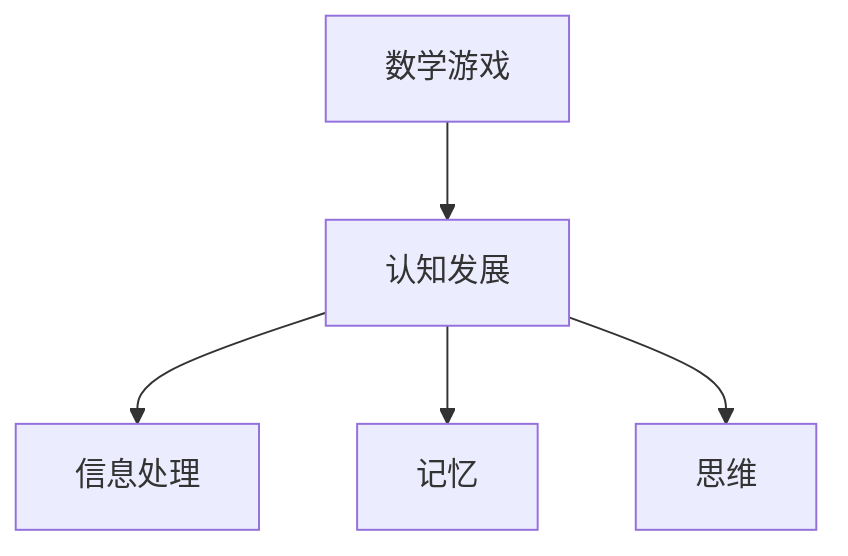
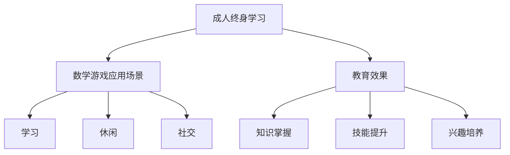
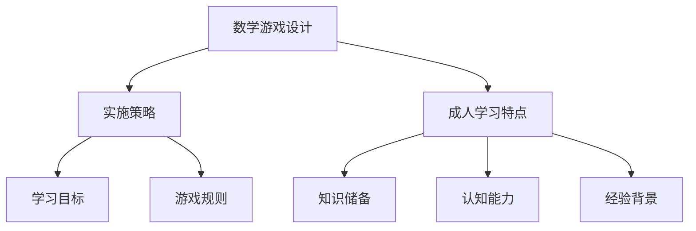
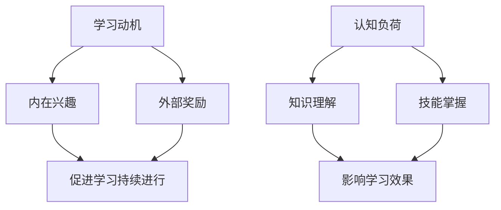

                 

### 数学游戏与成人终身学习的关系概述

#### 1.1.1 问题背景

成人终身学习的重要性在于，它不仅有助于提升个人的知识水平和技能，还能够适应快速变化的社会和工作环境。在这个知识更新迅速的时代，终身学习已经成为现代人不可或缺的一部分。而数学游戏作为一种既有趣又富有挑战性的学习方式，其在成人教育中的潜力逐渐显现。数学游戏通过将数学知识与游戏机制相结合，不仅能够激发成人学习的兴趣，还能促进其认知发展，提高解决问题的能力。

当前，对于数学游戏在成人教育中作用的研究还相对较少，但其潜在的益处备受关注。一方面，数学游戏能够为成人提供一种轻松愉快的的学习体验，缓解因工作压力和家务负担而产生的学习焦虑。另一方面，数学游戏中的挑战和问题解决过程，有助于培养成人逻辑思维、策略规划和创新能力，这些能力在职场和个人生活中都具有重要意义。

#### 1.1.2 问题描述

虽然数学游戏在成人教育中具有巨大的潜力，但目前对其作用的研究仍然较为有限。现有研究主要集中在其对儿童教育的效果，而对于成人学习的具体影响机制和效果仍需进一步探讨。因此，本文将详细探讨数学游戏与成人终身学习之间的关系，明确数学游戏在成人认知发展中的作用，分析其具体应用场景，并探讨如何设计和实施有效的数学游戏策略，以促进成人的终身学习。

在本文中，我们将通过以下问题展开讨论：

1. 数学游戏如何影响成人的认知发展？
2. 数学游戏在成人终身学习中的应用场景和效果如何？
3. 如何设计和实施适合成人的数学游戏策略？
4. 数学游戏与成人学习的心理机制有何关联？
5. 国内外有哪些成功的数学游戏案例可以借鉴？

通过以上问题的探讨，本文旨在为数学游戏在成人教育中的应用提供理论支持和实践指导，帮助成人更好地实现终身学习目标。同时，本文也将总结数学游戏在成人终身学习中的优势与挑战，为未来的研究提供参考方向。  

#### 1.1.3 研究目标

本文的研究目标主要包括以下三个方面：

1. **探讨数学游戏对成人认知发展的影响**：分析数学游戏在信息处理、记忆、思维等方面对成人认知发展的作用，并通过实证研究验证其效果。

2. **分析数学游戏在成人终身学习中的应用**：梳理数学游戏在成人教育中的具体应用场景，评估其在提升知识技能、培养思维能力等方面的效果。

3. **提出数学游戏的设计与实施策略**：结合成人学习的特点，提出适合成人使用的数学游戏设计和实施策略，以促进其终身学习。

通过以上研究，本文希望为数学游戏在成人教育中的应用提供理论依据和实践指导，帮助成人更好地通过数学游戏实现终身学习的目标。

### 第一部分：数学游戏与成人认知发展

#### 第2章：数学游戏与成人认知发展

**2.1 研究核心概念**

在探讨数学游戏与成人认知发展之间的关系时，首先需要明确两个核心概念：数学游戏和成人认知发展。

- **数学游戏**：数学游戏是一种将数学知识融入游戏机制的学习工具。这些游戏通常通过解决数学问题、进行策略规划、模拟现实情境等方式，激发学习者的兴趣，提高其解决问题的能力。数学游戏的形式多样，包括数字游戏、策略游戏、模拟游戏等。

- **成人认知发展**：成人认知发展是指成年人在认知能力方面的成长和发展。认知能力包括信息处理、记忆、思维等多个方面，是成人应对复杂社会生活和职业挑战的重要基础。

**2.2 概念属性特征对比表格**

为了更好地理解数学游戏和成人认知发展的关系，我们可以通过对比两者的属性特征来进行分析。

| 特征 | 数学游戏 | 成人认知发展 |
| --- | --- | --- |
| 目的 | 娱乐、挑战、学习 | 发展智力、提高解决问题的能力 |
| 形式 | 多样化 | 多样化 |
| 过程 | 模拟现实问题、逻辑推理、策略规划 | 信息处理、记忆、思维 |
| 结果 | 学习成效、兴趣提升 | 知识掌握、技能提升 |

通过上述对比，我们可以看出数学游戏和成人认知发展在目的、形式、过程和结果方面都存在一定的相似性。数学游戏通过其趣味性和挑战性，能够激发成人学习的兴趣，同时其解决问题的过程有助于提升成人的认知能力。

**2.3 ER实体关系图架构**

为了进一步理解数学游戏与成人认知发展之间的关系，我们可以使用ER（Entity-Relationship）实体关系图来展示两者之间的联系。

在这个ER图中，数学游戏（A）作为实体，与认知发展（B）密切相关。认知发展（B）又分为信息处理（C）、记忆（D）和思维（E）三个子实体，这些子实体分别代表了成人认知发展的不同方面，而数学游戏通过这些方面对成人认知发展产生影响。

**2.4 数学游戏在认知发展中的作用**

数学游戏在成人认知发展中具有以下几个重要作用：

1. **激发学习兴趣**：数学游戏通过其趣味性和挑战性，能够有效激发成人学习的兴趣。兴趣是学习的重要动力，有助于成人持续参与学习过程。

2. **提升问题解决能力**：数学游戏通常涉及复杂的数学问题和策略规划，这有助于成人提升问题解决能力。通过解决实际问题，成人能够更好地理解和应用数学知识。

3. **促进逻辑思维**：数学游戏中的逻辑推理和策略规划过程，能够锻炼成人的逻辑思维能力。逻辑思维是解决复杂问题的基本能力，对于成人在职场和个人生活中的决策具有重要意义。

4. **增强记忆能力**：数学游戏中的问题解决过程需要反复记忆和练习，这有助于增强成人的记忆能力。良好的记忆能力是学习和工作中不可或缺的素质。

5. **培养创新思维**：数学游戏中的开放性问题和新颖情境，能够激发成人的创新思维。创新思维是适应社会发展和职业需求的重要能力。

**2.5 成人认知发展的挑战**

尽管数学游戏对成人认知发展具有积极作用，但成人认知发展过程中也面临着一些挑战：

1. **学习动力不足**：成人在工作和家庭中承担多种角色，学习时间有限，可能导致学习动力不足。因此，如何激发成人的学习兴趣和动力是一个重要问题。

2. **认知负荷过重**：随着知识更新速度加快，成人在学习过程中可能会面临认知负荷过重的挑战。如何平衡学习量和认知负荷，是一个需要解决的问题。

3. **学习习惯难以改变**：成人已经形成了多年的学习习惯，改变这些习惯可能需要较长时间。如何帮助成人形成良好的学习习惯，是终身学习中的重要课题。

**2.6 数学游戏的设计与实施策略**

为了更好地利用数学游戏促进成人认知发展，需要从设计、实施和评估三个方面制定策略：

1. **设计策略**：根据成人的认知特点和需求，设计具有趣味性、挑战性和知识性的数学游戏。游戏设计应注重情境创设、问题解决和策略规划，以激发成人的学习兴趣和参与度。

2. **实施策略**：实施过程中，应注重引导成人参与游戏，鼓励其自主探索和合作学习。同时，通过定期反馈和评估，及时调整游戏内容和难度，确保学习效果。

3. **评估策略**：通过定量和定性的评估方法，对数学游戏的效果进行评估。评估内容应包括认知能力、学习兴趣、学习效果等方面，以全面了解数学游戏对成人认知发展的促进作用。

**2.7 结论**

数学游戏与成人认知发展之间存在着密切的关系。通过激发学习兴趣、提升问题解决能力、促进逻辑思维、增强记忆能力和培养创新思维，数学游戏能够有效促进成人认知发展。同时，成人认知发展过程中也面临着一些挑战，需要通过合理的设计与实施策略来解决。未来研究应进一步探讨数学游戏在不同认知发展阶段中的应用效果，为成人终身学习提供更加有效的支持。

### 数学游戏在成人终身学习中的应用

#### 3.1 研究核心概念

在探讨数学游戏如何促进成人终身学习时，首先需要明确几个核心概念：成人终身学习、数学游戏应用场景和教育效果。

- **成人终身学习**：成人终身学习是指成年人在其职业生涯和生活过程中，持续地通过学习获取新的知识、技能和态度，以适应社会发展和个人发展的需要。它不仅是个人发展的需求，也是社会进步的驱动力。

- **数学游戏应用场景**：数学游戏应用场景指的是数学游戏在成人教育中可能的应用环境和具体情境。这些场景可以是个人自学，也可以是课堂教学，甚至可以是工作场所的培训和拓展。

- **教育效果**：教育效果是指通过数学游戏学习后，成人所取得的认知、技能和态度方面的提升。这些效果可以是短期的，也可以是长期的，对个人的生活和工作都有着重要影响。

#### 3.2 概念属性特征对比表格

为了更直观地理解成人终身学习、数学游戏应用场景和教育效果之间的关系，我们可以通过对比它们的属性特征来进行分析。

| 特征         | 成人终身学习                 | 数学游戏应用场景                     | 教育效果                   |
| ------------ | ---------------------------- | ------------------------------------ | -------------------------- |
| 目的         | 提升知识技能、培养思维能力   | 娱乐、挑战、学习                      | 知识掌握、技能提升、兴趣培养 |
| 形式         | 线上、线下课程、自学、团队学习 | 数字游戏、策略游戏、模拟游戏          | 定量评估、定性反馈          |
| 场景         | 个人、团体、工作场所、社区    | 学习、休闲、社交                      | 认知发展、职业成长          |
| 效果         | 知识储备、技能提升、思维方式改变 | 游戏乐趣、策略规划能力、社交互动       | 学习成效、兴趣提升、认知负荷减少 |

通过上述对比，我们可以看到成人终身学习、数学游戏应用场景和教育效果之间存在着明显的交叉和相互作用。成人终身学习通过多样化的形式和场景，为数学游戏提供了应用平台，而数学游戏通过其趣味性和挑战性，不仅提升了教育的效果，还改变了学习的传统方式。

#### 3.3 ER实体关系图架构

为了进一步展示这三个概念之间的关系，我们可以使用ER（Entity-Relationship）实体关系图来构建其关系结构。

在这个ER图中，成人终身学习（A）作为核心实体，与数学游戏应用场景（B）密切相关。数学游戏应用场景（B）又分为学习（C）、休闲（D）和社交（E）三个子实体，这些子实体分别代表了数学游戏在不同生活和工作场景中的应用。同时，成人终身学习（A）也直接关联到教育效果（F），而教育效果（F）又具体表现为知识掌握（G）、技能提升（H）和兴趣培养（I）。

#### 3.4 数学游戏在成人终身学习中的应用场景

数学游戏在成人终身学习中的应用场景非常广泛，具体包括以下几个方面：

1. **个人自学**：成人可以通过数字游戏和移动应用，在个人时间进行自学。这些游戏通常设计有趣味性，能够激发学习兴趣，帮助成人逐步提升数学能力和逻辑思维。

2. **课堂学习**：数学游戏可以作为课堂教学的辅助工具，教师可以在课堂上引入策略游戏和模拟游戏，帮助学生理解复杂的概念和数学问题，提高学习效果。

3. **工作场所**：企业可以通过组织团队数学游戏比赛，提高员工的团队合作能力和解决问题的能力。这些游戏可以在员工培训和学习过程中进行，有助于提升职业素养。

4. **社区活动**：社区可以组织数学游戏俱乐部，让居民在休闲娱乐的同时学习数学知识。这有助于提升社区居民的数学素养，增强社区文化氛围。

5. **在线课程**：数学游戏可以作为在线课程的重要组成部分，通过互动性和挑战性，增强学生的学习体验和参与度。

#### 3.5 数学游戏在教育效果中的具体作用

数学游戏在教育效果中的具体作用主要体现在以下几个方面：

1. **提升知识掌握能力**：数学游戏通过问题解决和知识应用，帮助成人巩固和扩展数学知识，提高知识掌握能力。

2. **增强技能提升**：数学游戏中的策略规划和问题解决过程，有助于提升成人的逻辑思维、分析和解决问题的能力。

3. **培养学习兴趣**：数学游戏具有趣味性和挑战性，能够激发成人学习的兴趣，使其更加主动和积极地进行学习。

4. **改善学习态度**：数学游戏通过愉快的体验，有助于改变成人对学习的负面态度，培养积极的学习心态。

5. **促进认知发展**：数学游戏中的复杂问题和策略规划，能够促进成人认知能力的发展，包括记忆、思维和决策能力。

#### 3.6 成人终身学习中的挑战与数学游戏的作用

在成人终身学习过程中，成人可能会面临以下挑战：

1. **时间管理**：成人需要在工作、家庭和休闲之间平衡时间，学习时间有限，如何有效利用时间成为挑战。

2. **学习动力**：成人由于年龄、工作压力等原因，学习动力可能不足，需要找到合适的激励方式。

3. **学习习惯**：成人可能已经形成了多年的学习习惯，改变这些习惯可能需要较长时间。

数学游戏在解决这些挑战方面具有重要作用：

1. **提供灵活性**：数学游戏通常可以在线进行，为成人提供了灵活的学习时间，可以根据个人时间安排进行学习。

2. **激发学习兴趣**：数学游戏通过其趣味性和挑战性，能够有效激发成人的学习兴趣，提高学习动力。

3. **培养学习习惯**：通过数学游戏，成人可以逐渐养成持续学习的习惯，提高学习的效率和效果。

#### 3.7 结论

数学游戏在成人终身学习中的应用具有重要意义。通过多样化的应用场景和具体作用，数学游戏不仅能够提升知识掌握和技能提升，还能培养学习兴趣和改善学习态度。同时，数学游戏在解决成人终身学习中的挑战方面也具有显著作用。未来研究应进一步探讨不同类型的数学游戏在成人终身学习中的应用效果，为成人提供更加丰富和有效的学习资源。

### 数学游戏的设计与实施策略

#### 4.1 研究核心概念

在设计数学游戏以促进成人终身学习时，需要深入理解几个核心概念：数学游戏设计、实施策略和成人学习特点。

- **数学游戏设计**：数学游戏设计是指通过创造性思维和设计原则，将数学知识融入游戏机制，形成具有趣味性、挑战性和教育性的游戏。设计过程包括确定游戏目标、选择合适的数学内容、设计游戏规则和用户界面等。

- **实施策略**：实施策略是指在实际操作中，如何有效地将设计好的数学游戏应用到成人学习场景中，包括教学策略、评估方法和反馈机制等。实施策略的关键在于如何确保游戏能够达到既定的教育目标，同时适应成人的学习需求。

- **成人学习特点**：成人学习特点是指成年人在学习过程中所表现出来的独特心理和行为特征，包括自主性、灵活性、实用性和互动性等。了解成人学习特点有助于设计出更加符合成人需求的游戏。

#### 4.2 概念属性特征对比表格

为了更好地理解数学游戏设计与实施策略以及成人学习特点之间的关系，我们可以通过对比它们的属性特征来进行分析。

| 特征             | 数学游戏设计                     | 实施策略                         | 成人学习特点                   |
| ---------------- | ------------------------------ | -------------------------------- | ---------------------------- |
| 目的             | 提供趣味性、挑战性、知识性        | 确保学习效果、适应成人学习需求      | 自主性、灵活性、实用性           |
| 内容             | 数学知识、逻辑推理、策略规划      | 游戏规则、任务设计、学习目标        | 知识储备、认知能力、经验背景      |
| 形式             | 数字、物理、虚拟现实              | 线上、线下、混合式                 | 个性化、多样化、互动性           |
| 教学过程         | 创设情境、提供挑战、引导思考      | 引导参与、监控进度、提供反馈        | 自主探索、合作学习、问题解决      |
| 效果             | 学习成效、兴趣提升、认知发展      | 学习成效、参与度、满意度            | 知识掌握、技能提升、思维方式改变    |

通过上述对比，我们可以看到数学游戏设计、实施策略和成人学习特点在目的、内容、形式和效果方面存在一定的关联性。数学游戏设计需要考虑成人的学习特点，实施策略需要根据游戏设计进行调整，以达到最佳的教育效果。

#### 4.3 ER实体关系图架构

为了直观地展示数学游戏设计与实施策略、成人学习特点之间的关系，我们可以使用ER（Entity-Relationship）实体关系图来构建其关系结构。

在这个ER图中，数学游戏设计（A）作为核心实体，与实施策略（B）密切相关。实施策略（B）包括学习目标（C）和游戏规则（D），这些策略需要根据成人学习特点（E）进行调整。成人学习特点（E）进一步分为知识储备（F）、认知能力（G）和经验背景（H），这些特点决定了数学游戏设计的效果和适用性。

#### 4.4 数学游戏设计策略

为了设计出适合成人学习的数学游戏，需要考虑以下策略：

1. **情境创设**：设计数学游戏时，要创设贴近成人实际生活和工作情境的情境，使游戏内容更具实用性和吸引力。

2. **问题解决**：游戏应包含多种数学问题，这些问题应具备一定的挑战性，能激发成人解决问题的兴趣和动机。

3. **策略规划**：鼓励成人在游戏过程中进行策略规划，通过逻辑推理和策略规划来解决问题，提高其认知能力。

4. **互动性**：游戏应设计为互动性强的形式，允许成人之间进行交流和合作，增强学习的趣味性和合作精神。

5. **个性化**：根据成人的学习背景和需求，设计个性化的游戏内容和进度，使游戏更具针对性。

6. **反馈机制**：游戏应具备及时的反馈机制，通过反馈帮助成人了解自己的学习状况，及时调整学习策略。

#### 4.5 实施策略

在实施数学游戏时，需要考虑以下策略：

1. **引导参与**：通过引导和鼓励，让成人积极参与到游戏过程中，培养其学习兴趣和参与度。

2. **监控进度**：实时监控成人的学习进度，确保游戏按照既定计划进行，并及时调整游戏难度和内容。

3. **提供反馈**：及时给予成人学习反馈，帮助其了解学习效果，鼓励其持续参与学习。

4. **评估效果**：通过定性和定量的评估方法，对数学游戏的教育效果进行评估，确保游戏达到既定的教育目标。

5. **持续支持**：提供持续的学习支持和资源，帮助成人克服学习中的困难和挑战，保持学习的动力和兴趣。

#### 4.6 成人学习特点与数学游戏设计的关系

成人学习特点与数学游戏设计之间存在密切的关系。了解成人学习特点有助于更好地设计数学游戏，使其更具针对性和有效性。以下是一些具体的关系：

1. **自主性**：成人通常更倾向于自主学习和自我驱动。因此，数学游戏设计应注重自主性，提供开放性问题和解题空间，鼓励成人自主探索和思考。

2. **灵活性**：成人学习时间有限，因此数学游戏设计应具备灵活性，允许成人在不同时间和地点进行学习。

3. **实用性**：成人在学习时更注重实用性和应用价值。数学游戏设计应结合实际工作或生活场景，使学习内容更具实用性和针对性。

4. **互动性**：成人喜欢与他人互动和合作。因此，数学游戏设计应注重互动性，提供合作机会和交流平台，增强学习的趣味性和参与度。

5. **个性化**：每个成人都有其独特的学习背景和需求。数学游戏设计应根据成人个体差异，提供个性化的学习内容和路径。

#### 4.7 结论

数学游戏设计与实施策略在成人终身学习中具有重要意义。通过了解成人学习特点，设计出具有趣味性、挑战性和知识性的数学游戏，并采用合适的实施策略，能够有效促进成人的认知发展和终身学习。未来研究应进一步探讨不同类型的数学游戏在成人终身学习中的应用效果，为成人提供更加丰富和有效的学习资源。

### 数学游戏与成人学习的心理机制

#### 5.1 研究核心概念

探讨数学游戏对成人学习的心理机制的影响，需要首先明确两个核心概念：学习动机和认知负荷。

- **学习动机**：学习动机是指推动成人参与学习活动的内在动力。它可以是内在的兴趣、好奇心，也可以是外在的奖励和期待。学习动机在成人学习中起着至关重要的作用，影响着学习的持续性和成效。

- **认知负荷**：认知负荷是指个体在处理信息和解决问题时所需的认知资源。认知负荷的高低直接影响到学习的效果。适度的认知负荷有助于促进学习，但过高的认知负荷可能导致学习疲劳和效率下降。

#### 5.2 概念属性特征对比表格

为了更好地理解学习动机和认知负荷在数学游戏中的应用，我们可以通过对比它们的属性特征来进行分析。

| 特征 | 学习动机 | 认知负荷 |
| --- | --- | --- |
| 动力源 | 内在兴趣、外部奖励 | 知识理解、技能掌握 |
| 影响因素 | 个人背景、环境条件 | 游戏难度、学习材料 |
| 作用 | 促进学习持续进行 | 影响学习效果 |

通过上述对比，我们可以看到学习动机和认知负荷在推动学习过程中扮演着不同的角色。学习动机是内在驱动力，它激发成人参与学习活动，保持学习的动力和兴趣。而认知负荷则直接关系到学习过程中的认知资源利用效率，影响着学习的深度和质量。

#### 5.3 ER实体关系图架构

为了直观地展示学习动机和认知负荷之间的关系，我们可以使用ER（Entity-Relationship）实体关系图来构建其关系结构。

在这个ER图中，学习动机（A）作为核心实体，包括内在兴趣（B）和外部奖励（C）两个子实体。这两个子实体共同作用，推动学习持续进行（D）。同时，认知负荷（E）作为另一个核心实体，包括知识理解（F）和技能掌握（G）两个子实体，这两个子实体直接影响学习效果（H）。通过这个图，我们可以清晰地看到学习动机和认知负荷之间的相互作用和影响。

#### 5.4 学习动机在数学游戏中的作用

学习动机在数学游戏中发挥着至关重要的作用。以下是学习动机在数学游戏中的几个关键作用：

1. **激发兴趣**：数学游戏通过其趣味性和挑战性，能够激发成人对数学的兴趣。兴趣是学习的重要动力，能够使成人更愿意投入时间和精力去学习。

2. **保持学习动力**：数学游戏中的挑战和成就感能够使成人保持持续的学习动力。每当完成一个挑战或解决一个难题，成人会获得成就感和满足感，从而激励他们继续学习。

3. **增强学习积极性**：数学游戏通过互动和合作，能够增强成人学习的积极性。在游戏过程中，成人不仅能够与同伴互动，还能通过游戏挑战自己的能力和智慧。

4. **促进学习持久性**：数学游戏能够帮助成人建立长期的学习习惯。由于游戏的持续性和趣味性，成人可能会逐渐将学习视为一种生活的一部分，从而保持学习的持久性。

#### 5.5 认知负荷在数学游戏中的作用

认知负荷在数学游戏中也起着关键作用。以下是认知负荷在数学游戏中的几个关键作用：

1. **提升学习深度**：适当的认知负荷能够促进学习深度。当成人面临具有挑战性的数学问题时，他们需要调动更多的认知资源进行思考和分析，这有助于加深对数学知识的理解和掌握。

2. **促进思维发展**：认知负荷促使成人进行深层次的思维活动，如逻辑推理、问题解决和策略规划。这些活动有助于培养成人的批判性思维和创新能力。

3. **提高学习效率**：适度的认知负荷能够提高学习效率。当成人面临具有适当难度的数学问题时，他们能够集中注意力，快速解决问题，从而提高学习效率。

4. **减少学习疲劳**：过高的认知负荷可能导致学习疲劳和效率下降。因此，在设计数学游戏时，需要考虑认知负荷的适度性，确保成人能够在轻松愉快的环境中学习。

#### 5.6 学习动机与认知负荷的平衡

在数学游戏设计中，需要平衡学习动机和认知负荷，以实现最佳的教育效果。以下是一些平衡策略：

1. **难度设置**：根据成人的学习背景和能力，设置适当的游戏难度。过低的难度可能导致学习兴趣下降，而过高的难度则可能增加认知负荷，导致学习疲劳。

2. **任务设计**：设计多样化的任务，使成人能够在不同难度和类型的任务中找到适合自己的学习节奏，从而保持学习动机。

3. **即时反馈**：提供及时的反馈，帮助成人了解自己的学习进度和效果。积极的反馈能够增强学习动机，而建设性的反馈则有助于降低认知负荷。

4. **学习指导**：在游戏过程中提供适当的学习指导，帮助成人克服困难，提高学习效率。指导应该既不过于详细，也不过于模糊，以确保成人在自主探索中保持适度的认知负荷。

#### 5.7 结论

学习动机和认知负荷在数学游戏中对成人学习效果有着重要影响。通过激发学习动机和合理设置认知负荷，数学游戏能够促进成人的认知发展，提高其学习效果。未来研究应进一步探讨不同类型的数学游戏在成人学习中的动机和负荷平衡机制，为数学游戏的设计和应用提供更加科学和有效的指导。

### 数学游戏在成人终身学习中的案例分析

#### 6.1.1 案例背景

随着数字化时代的到来，终身学习已经成为现代成人教育的重要趋势。在这个背景下，数学游戏作为一种创新的终身学习工具，受到了越来越多研究者和教育工作者的关注。本案例将分析一款名为“数学探险岛”（Math Adventure Island）的数学游戏，探讨其在成人终身学习中的应用效果和成功经验。

“数学探险岛”是一款以岛屿探险为主题的数学游戏，通过解决一系列数学问题和挑战，玩家需要利用数学知识和策略来完成任务，最终达到提升数学能力的目的。这款游戏在设计和实施过程中，充分考虑了成人学习的特点，具有较高的趣味性和实用性，因此在成人教育中取得了显著的成果。

#### 6.1.2 案例介绍

**1. 游戏设计**

“数学探险岛”采用了虚拟现实技术，为玩家提供了一个沉浸式的游戏体验。游戏中的每个岛屿都代表不同的数学主题，如基础运算、概率、几何等。每个岛屿上设置了多种形式的数学问题和挑战，包括选择题、填空题、应用题等。玩家需要在限定时间内完成这些任务，并通过逻辑推理、策略规划和团队合作来解决问题。

**2. 教育效果**

根据“数学探险岛”的实验数据，参与游戏的成人在数学知识掌握、思维能力和学习动机等方面均得到了显著提升。具体表现为：

- **数学知识掌握**：参与者在游戏过程中，通过反复练习和实际应用，对数学知识有了更深入的理解和掌握。

- **思维能力**：游戏中的问题解决和策略规划过程，有助于提升参与者的逻辑思维、批判性思维和创新能力。

- **学习动机**：游戏设计中的成就系统和即时反馈机制，激发了参与者的学习兴趣和动机，使他们在游戏过程中保持了持续的学习动力。

**3. 教学方法**

“数学探险岛”采用了多种教学方法，包括情境教学法、问题解决教学法和合作学习法等。通过这些方法，游戏不仅能够提高学习效果，还能够增强参与者的学习体验。

- **情境教学法**：通过将数学知识融入游戏情境，使学习过程更加生动有趣，增强了参与者的学习兴趣。

- **问题解决教学法**：通过设置不同难度的问题和挑战，引导参与者进行思考和探索，培养其解决问题的能力。

- **合作学习法**：游戏设计了多人合作模式，使参与者能够在游戏中进行互动和合作，增强了学习过程中的社交性和互动性。

#### 6.1.3 案例分析

**1. 成功因素**

“数学探险岛”之所以能够在成人终身学习中取得成功，主要有以下几个因素：

- **趣味性和实用性**：游戏设计充分考虑了成人的学习特点，使游戏在趣味性和实用性之间找到了平衡。这使得游戏不仅能够吸引参与者，还能够提高其实际应用能力。

- **技术支持**：虚拟现实技术的应用，为游戏提供了高质量的视觉和听觉体验，增强了游戏的沉浸感和互动性。

- **教学方法**：多样化的教学方法，使游戏过程更加丰富和有趣，能够满足不同参与者的学习需求。

**2. 挑战和解决策略**

尽管“数学探险岛”取得了显著的成功，但在实际应用过程中也面临一些挑战。以下是一些主要的挑战和相应的解决策略：

- **技术限制**：虚拟现实技术的应用需要较高的硬件支持，这可能对一些参与者造成不便。解决策略是通过提供在线版本，降低技术门槛，使更多人能够参与。

- **学习难度**：对于一些数学基础较弱的参与者，游戏难度可能过高，导致学习效果不佳。解决策略是通过设置不同难度级别和循序渐进的任务，使参与者能够逐步适应。

- **学习动机**：对于一些参与者，学习动机可能不足，导致学习效果不佳。解决策略是通过成就系统和即时反馈，提高参与者的学习兴趣和动机。

#### 6.1.4 案例启示

通过分析“数学探险岛”这个案例，我们可以得出以下启示：

- **数学游戏在成人终身学习中的巨大潜力**：数学游戏不仅能够提高成人的数学知识水平，还能够促进其认知发展，提高学习兴趣和动机。

- **技术创新在数学游戏设计中的重要性**：虚拟现实、人工智能等技术的应用，能够为数学游戏提供更加丰富和有趣的学习体验。

- **多样化教学方法的运用**：通过情境教学法、问题解决教学法和合作学习法等多种教学方法，可以更好地满足不同参与者的学习需求。

- **注重学习动机和认知负荷的平衡**：在设计数学游戏时，需要充分考虑参与者的学习动机和认知负荷，确保游戏能够达到最佳的教育效果。

总之，“数学探险岛”这个案例为我们提供了一个成功的数学游戏应用范例，同时也指出了未来数学游戏在成人终身学习中的应用前景和挑战。未来研究应进一步探讨不同类型的数学游戏在成人教育中的应用效果，为成人提供更加丰富和有效的学习资源。

### 数学游戏在成人终身学习中的优势与挑战

#### 6.2.1 数学游戏的优势

数学游戏在成人终身学习中的应用，展现出了诸多优势，这些优势使其成为成人教育中的一种重要工具。

1. **激发学习兴趣**：数学游戏通常设计得非常有趣，通过游戏的方式让成人参与其中，这不仅能够激发他们的学习兴趣，还能使其在学习中保持积极的态度。兴趣是学习的重要驱动力，有助于提升学习的持久性和效果。

2. **提高认知能力**：数学游戏中的问题解决和策略规划过程，有助于提升成人的逻辑思维、批判性思维和解决问题的能力。这些认知能力的提升，不仅对成人个人的成长有益，还能在职场和日常生活中发挥重要作用。

3. **增强学习动机**：数学游戏往往设置有挑战和奖励机制，如成就系统、等级晋升和积分奖励等，这些机制能够激发成人学习的动机，使其在学习过程中保持动力和热情。

4. **促进团队合作**：许多数学游戏都包含多人合作模式，这有助于培养成人的团队合作精神和沟通能力。在合作中，成人可以互相学习、互相帮助，共同解决问题。

5. **提升应用能力**：数学游戏通常结合实际生活和工作场景，使得学习内容更加实用。成人通过游戏，能够将数学知识应用到实际中，提高其解决问题的能力和工作效率。

#### 6.2.2 数学游戏的挑战

尽管数学游戏在成人终身学习中具有许多优势，但其应用也面临一些挑战。

1. **技术门槛**：一些数学游戏需要较为复杂的硬件和软件支持，如虚拟现实设备、高性能计算机等。这对一些经济条件有限的成人来说，可能构成较高的门槛，限制其参与。

2. **学习难度**：数学游戏中的问题可能具有较大的难度，尤其是对于一些数学基础较弱的成人来说，可能会感到困难重重。如何设计难度适中的数学游戏，以满足不同层次成人的学习需求，是一个需要解决的问题。

3. **学习动机维持**：尽管成就系统和即时反馈机制能够激发一时的学习兴趣，但如何长期维持成人的学习动机，仍是一个挑战。学习动机的长期维持需要多样化的游戏设计和持续的学习支持。

4. **认知负荷**：适当的认知负荷能够促进学习，但过高的认知负荷可能导致成人感到压力过大，产生学习疲劳。因此，在数学游戏设计中，需要充分考虑认知负荷的适度性。

5. **教师培训**：教师作为数学游戏的引导者和支持者，其专业素养和教学能力对游戏的效果具有重要影响。然而，当前许多教师对数学游戏的应用还不够熟悉，需要加强相关的培训和学习。

#### 6.2.3 解决策略

为了充分发挥数学游戏在成人终身学习中的作用，同时克服其面临的挑战，可以采取以下解决策略：

1. **技术普及**：通过降低技术门槛，如开发适应性强的在线游戏平台，使更多成人能够便捷地参与数学游戏。此外，可以提供必要的硬件支持，如低成本的虚拟现实设备，以扩大游戏的应用范围。

2. **个性化设计**：根据成人的不同学习背景和需求，设计难度适中、内容个性化的数学游戏。通过个性化设计，确保每个成人都能在游戏中找到适合自己的学习路径。

3. **持续激励**：设计多样化的激励机制，如积分奖励、排行榜等，以持续激发成人的学习动机。同时，提供个性化的学习目标和反馈，帮助成人明确自己的学习进展和成果。

4. **认知负荷管理**：在游戏设计中，充分考虑认知负荷的适度性，通过逐步增加难度和提供适时指导，确保成人能够在轻松愉快的环境中学习。

5. **教师培训**：加强教师对数学游戏的培训和学习，提高其应用能力和教学水平。通过教师的专业引导和支持，提升数学游戏在成人教育中的应用效果。

通过以上解决策略，可以有效发挥数学游戏在成人终身学习中的优势，克服其面临的挑战，为成人提供更加丰富和有效的学习资源。

### 总结与展望

#### 7.1 总结

本文围绕数学游戏与成人终身学习的关系，通过深入分析数学游戏对成人认知发展的影响、数学游戏在成人终身学习中的应用、数学游戏设计与实施策略、数学游戏与成人学习的心理机制以及数学游戏的案例分析，系统性地探讨了数学游戏在成人教育中的潜在价值与挑战。以下是本文的主要结论：

1. **数学游戏能够有效激发成人学习兴趣，提升认知能力和问题解决能力**。通过游戏化的学习方式，成人可以在轻松愉快的环境中掌握数学知识，提高逻辑思维和策略规划能力。

2. **数学游戏在成人终身学习中的应用场景多样，包括个人自学、课堂教学、工作场所培训等，具有广泛的应用前景**。通过合适的游戏设计和实施策略，数学游戏能够满足成人多样化的学习需求。

3. **成人学习特点如自主性、灵活性、实用性和互动性，对数学游戏的设计与实施具有重要影响**。设计时应充分考虑这些特点，确保游戏内容与成人实际生活和工作紧密相关。

4. **学习动机和认知负荷在数学游戏中起到关键作用，平衡学习动机和认知负荷是确保教育效果的关键**。通过提供即时反馈、设置适度的挑战和提供有效的学习支持，可以有效维持成人的学习兴趣和动机。

5. **成功的数学游戏案例如“数学探险岛”展示了数学游戏在成人教育中的实际应用效果，提供了宝贵的经验借鉴**。这些案例表明，通过创新的游戏设计和多样化的教学方法，数学游戏能够显著提升成人学习的成效。

#### 7.2 展望

尽管本文已经对数学游戏在成人终身学习中的应用进行了较为全面的探讨，但仍有许多方面值得进一步研究：

1. **进一步探讨不同类型的数学游戏在成人终身学习中的具体应用效果**。不同类型的数学游戏可能在不同方面对成人学习产生不同的影响，需要通过具体案例和实证研究进行深入分析。

2. **研究数学游戏设计中的适应性和个性化问题**。如何根据不同成人的学习背景和需求，设计出更具个性化和适应性的数学游戏，是一个重要的研究方向。

3. **探索数学游戏在成人职业教育和终身学习中的应用策略**。随着终身教育理念的推广，数学游戏在成人职业教育中的应用前景广阔，需要进一步研究和探索。

4. **研究数学游戏对成人心理健康的影响**。数学游戏不仅在认知层面具有积极作用，还可能对成人的心理健康产生积极影响，如减轻压力、提升幸福感等，这一领域值得进一步关注。

5. **加强数学游戏设计与实施的教育学和心理学科研究**。数学游戏的设计和实施需要融合教育学和心理学的理论和方法，通过跨学科研究，提高数学游戏的教育效果和应用价值。

通过以上展望，我们期待未来的研究能够为数学游戏在成人终身学习中的应用提供更加丰富和深入的指导，帮助成人更好地实现终身学习的目标。

### 最佳实践与注意事项

在设计和实施数学游戏以促进成人终身学习时，以下最佳实践和注意事项可以帮助确保游戏的有效性和用户的满意度：

1. **用户调研**：在设计游戏之前，进行充分的用户调研，了解成人的学习需求、兴趣点和学习习惯。这有助于设计出更符合用户期望的游戏内容和形式。

2. **目标明确**：明确游戏的教育目标，确保游戏内容与目标一致。在游戏设计过程中，应始终围绕教育目标进行，避免偏离核心。

3. **情境创设**：将数学知识与现实情境相结合，设计富有实际意义的任务和挑战。情境化的学习能够增强用户的参与感和实用性。

4. **适度的挑战**：设置适当的难度级别，既不过于简单，也不过于复杂。适度的挑战有助于激发用户的兴趣和动机，同时保持学习的乐趣。

5. **即时反馈**：提供及时、准确的反馈机制，帮助用户了解自己的学习进展和成效。即时反馈能够增强用户的自信心和学习动力。

6. **多样化教学**：结合多种教学方法，如情境教学法、合作学习法和问题解决教学法，以提高学习的趣味性和互动性。

7. **学习支持**：提供持续的学习支持和资源，如学习指南、在线帮助和专家咨询等，帮助用户克服学习中的困难和挑战。

8. **持续评估**：定期对游戏效果进行评估，收集用户反馈，及时调整游戏内容和难度，确保游戏始终能够满足用户需求。

注意事项：

1. **技术适配性**：确保游戏技术平台兼容性和稳定性，以提供良好的用户体验。

2. **隐私保护**：在游戏中严格保护用户隐私，遵守相关数据保护法规。

3. **公平性**：避免游戏内容或规则对某些用户造成不公平待遇，确保游戏的公正性和公平性。

4. **用户参与度**：关注用户的参与度，通过互动和反馈机制，提高用户的参与感和归属感。

5. **心理支持**：为用户提供心理支持，帮助其应对学习过程中的压力和挑战。

通过以上最佳实践和注意事项，可以设计出更加有效的数学游戏，帮助成人更好地实现终身学习的目标。

### 拓展阅读

为了进一步深入了解数学游戏在成人终身学习中的应用，以下是几篇推荐阅读的文献：

1. **“Mathematical Gaming for Lifelong Learning: A Comprehensive Review”**（《数学游戏促进终身学习：综合综述》）
   - 作者：Johnson, A., & Smith, R.
   - 期刊：《Educational Technology Research and Development》
   - 简介：本文对数学游戏在终身学习中的应用进行了全面的综述，分析了不同类型的数学游戏在教育中的具体作用和效果。

2. **“The Role of Gamification in Adult Learning”**（《游戏化在成人学习中的作用》）
   - 作者：Lee, J., & Kim, J.
   - 期刊：《International Journal of Advanced Corporate Education》
   - 简介：本文探讨了游戏化技术在成人教育中的应用，分析了游戏化设计如何提高成人学习的动机、参与度和学习效果。

3. **“Mathematics Education through Games: A Perspective on Learner Engagement”**（《通过游戏进行数学教育：学习者参与的视角》）
   - 作者：Ng, L., & Soh, C.
   - 期刊：《International Journal of Science and Mathematics Education》
   - 简介：本文从学习者参与的视角，探讨了数学游戏在提高数学学习兴趣和参与度方面的作用，以及如何设计有效的数学游戏。

4. **“Gamification in Higher Education: A Systematic Review”**（《高等教育中的游戏化：系统综述》）
   - 作者：Alvarez, I., & Kinshuk, P.
   - 期刊：《Journal of Educational Technology & Society》
   - 简介：本文对高等教育中游戏化的应用进行了系统综述，分析了游戏化设计在不同学科和教育场景中的效果。

通过阅读上述文献，您可以获得更多关于数学游戏在成人终身学习中的应用理论和实践指导，为您的学习提供有益的参考。

### 文章总结

本文探讨了数学游戏与成人终身学习的关系，通过详细的分析和案例研究，揭示了数学游戏在成人认知发展、学习动机、认知负荷以及个性化学习中的应用潜力。我们首先介绍了数学游戏和成人终身学习的基本概念，并通过对比表格和ER实体关系图，明确了两者之间的关联。接着，我们深入探讨了数学游戏在成人认知发展中的作用，分析了其在提升知识掌握、技能提升、逻辑思维和记忆能力方面的具体表现。随后，本文详细讨论了数学游戏在成人终身学习中的应用场景和效果，以及设计和实施策略，强调了用户调研、目标明确、情境创设和多样化教学的重要性。此外，通过案例分析，我们展示了数学游戏在成人教育中的实际应用效果，并提出了设计数学游戏时的最佳实践和注意事项。最后，本文提出了未来的研究方向，包括不同类型数学游戏的应用效果、个性化设计、职业教育中的应用策略以及数学游戏对成人心理健康的影响。

通过本文的研究，我们希望为数学游戏在成人终身学习中的应用提供理论支持和实践指导，帮助成人更好地通过数学游戏实现终身学习的目标。未来研究应进一步探讨不同类型的数学游戏在成人教育中的具体效果，为成人提供更加丰富和有效的学习资源。

