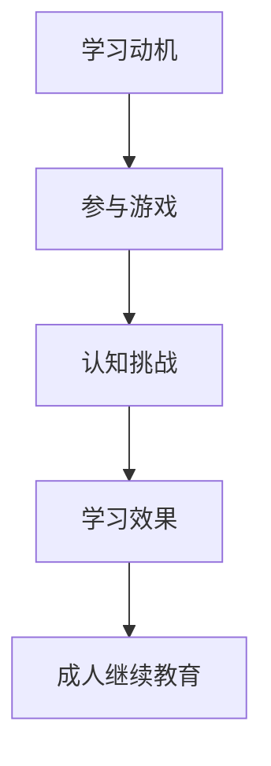

                 

### 设计《数学游戏与成人继续教育的关系》的目录大纲

在撰写这篇技术博客之前，我们首先需要设计一个详细的目录大纲，以确保文章的逻辑清晰、结构紧凑，并能够吸引读者。以下是本文的目录大纲：

#### 1. 背景介绍
- **问题背景**：现代社会中成人继续教育的重要性
- **数学游戏的概念**：定义与分类
- **成人继续教育与数学游戏的关系**：现状与挑战

#### 2. 核心概念与联系
- **数学游戏**：定义、类型与功能
- **成人继续教育**：目标、形式与挑战
- **学习动机**：定义、来源与影响因素
- **学习效果**：衡量标准与评估方法

#### 3. 算法原理讲解
- **学习动机与学习效果的关系**：Mermaid 流程图与 Python 代码
- **概率模型在数学游戏中的应用**：数学公式与举例说明

#### 4. 数学模型和数学公式
- **概率模型**：详细讲解与实例
- **学习效果评估模型**：数学公式与解释

#### 5. 系统分析与架构设计方案
- **问题场景介绍**
- **系统功能设计**：领域模型类图
- **系统架构设计**：架构图与接口设计
- **系统交互设计**：序列图

#### 6. 项目实战
- **环境安装**：工具与依赖
- **系统核心实现**：代码结构与功能解析
- **实际案例分析**：案例背景与剖析

#### 7. 最佳实践与小结
- **最佳实践 tips**
- **文章小结**
- **注意事项**
- **拓展阅读**

#### 8. 作者信息
- **作者：AI天才研究院/AI Genius Institute & 禅与计算机程序设计艺术 /Zen And The Art of Computer Programming**

通过这个详细的目录大纲，我们可以确保文章内容有条不紊地展开，同时每个部分都能够涵盖核心概念、原理讲解、应用实例和实际案例，从而为读者提供有价值的信息和深刻的见解。

----------------------------------------------------------------

# 数学游戏与成人继续教育的关系

关键词：数学游戏、成人继续教育、学习动机、学习效果、概率模型

摘要：本文探讨了数学游戏与成人继续教育之间的关系，分析了数学游戏如何通过激发学习动机、提高学习效果来促进成人教育。文章首先介绍了数学游戏和成人继续教育的核心概念，然后通过算法原理讲解和数学模型分析，阐述了数学游戏在成人教育中的潜在优势和应用前景。

## 1. 背景介绍

### 1.1 问题背景

在现代社会，成人继续教育的重要性日益凸显。随着科技的发展和职场竞争的加剧，成年人为了提升自己的职业技能、学术水平或兴趣爱好，越来越多地参与到各种形式的继续教育中。然而，传统的教学方法往往过于单调，难以激发成年人的学习兴趣和积极性。因此，寻找新的教育方式以提升成人教育的效果，成为了教育领域的一个重要课题。

### 1.2 数学游戏的概念

数学游戏是指以数学原理为基础，通过游戏的形式进行的数学活动。这类游戏不仅具有娱乐性，还能够锻炼参与者的逻辑思维、数学运算能力，以及解决实际问题的能力。常见的数学游戏包括数独、二十四点、概率游戏等。

### 1.3 成人继续教育与数学游戏的关系

数学游戏作为一种创新的教育方式，能够有效地促进成人继续教育。首先，数学游戏能够激发成年人的学习兴趣，提高他们的学习动机。其次，通过参与数学游戏，成年人可以在轻松愉快的氛围中提高自己的数学应用能力，从而提升学习效果。最后，数学游戏作为一种实践性较强的教育方式，有助于成年人将所学知识应用到实际生活中，提高他们的综合素质和职场竞争力。

## 2. 核心概念与联系

### 2.1 数学游戏

#### 定义
数学游戏是指通过游戏的形式进行的数学活动，旨在通过娱乐的方式提高参与者的数学能力。

#### 类型与功能
数学游戏的类型丰富多样，包括数独、数游戏、概率游戏等。每种游戏都有其独特的功能，如锻炼逻辑思维、提高数学运算能力等。

### 2.2 成人继续教育

#### 目标
成人继续教育的目标是提高参与者的职业技能、学术水平或兴趣爱好，帮助他们适应快速变化的职场和社会环境。

#### 形式与挑战
成人继续教育的形式多样，包括在线教育、职业教育、兴趣班等。然而，由于成年人的生活压力大，时间有限，如何提高教育的吸引力和效果，成为了一个挑战。

### 2.3 学习动机

#### 定义
学习动机是指个体参与学习活动的内在动力和意愿，它是学习行为的重要驱动因素。

#### 来源与影响因素
学习动机的来源包括兴趣、需求、外部激励等。影响学习动机的因素有教学内容、教学方式、学习环境等。

### 2.4 学习效果

#### 衡量标准
学习效果的衡量标准包括知识的掌握程度、技能的提高、态度的改变等。

#### 评估方法
评估方法包括自我评估、同伴评估、教师评估等。

## 3. 算法原理讲解

### 3.1 学习动机与学习效果的关系

#### Mermaid 流程图



#### Python 代码

```python
import matplotlib.pyplot as plt
import numpy as np

# 假设学习动机和学习效果之间存在线性关系
def learning_motivation_to_effectiveness(motivation_level):
    # 效果系数（假设为0.5，表示每提高1单位动机，效果提高0.5单位）
    effectiveness_coefficient = 0.5
    
    # 学习效果 = 动机水平 * 效果系数
    effectiveness = motivation_level * effectiveness_coefficient
    
    return effectiveness

# 生成动机水平和学习效果的散点图
motivation_levels = np.linspace(0, 10, 100)
effectiveness_scores = learning_motivation_to_effectiveness(motivation_levels)

plt.scatter(motivation_levels, effectiveness_scores)
plt.xlabel('Learning Motivation')
plt.ylabel('Learning Effectiveness')
plt.title('Relationship Between Learning Motivation and Effectiveness')
plt.show()
```

通过这个流程图和代码，我们可以直观地看到学习动机与学习效果之间的正相关关系。学习动机的提高会直接导致学习效果的增强。

### 3.2 概率模型在数学游戏中的应用

概率模型是数学中常用的模型之一，它能够帮助我们理解和分析随机事件的发生概率。以下是一个简单的概率模型例子，用于解释成人通过数学游戏提高学习效果的过程。

#### 概率模型

$$
P(A) = \frac{N(A)}{N(S)}
$$

其中，\(P(A)\) 表示事件 A 发生的概率，\(N(A)\) 表示事件 A 发生的次数，\(N(S)\) 表示总次数。

#### 举例说明

假设有一个数独游戏，其中包含 \(9 \times 9\) 的网格，每个格子中需要填写一个数字，使得每一行、每一列和每个 \(3 \times 3\) 的宫格中都包含 1 到 9 的所有数字。成人参与者通过尝试不同的数字来填写网格。在这个游戏中，事件 A 可以是“在规定时间内成功填写整个数独网格”。

如果我们统计了 100 个成人参与者在规定时间内成功填写数独的次数，我们可以计算出成功概率：

$$
P(A) = \frac{N(A)}{N(S)} = \frac{30}{100} = 0.3
$$

这个概率表示在 100 次尝试中，大约有 30 次能够成功填写数独。

通过这个例子，我们可以看到概率模型如何帮助我们理解和分析数学游戏中的随机事件，进而评估参与者的学习效果。

----------------------------------------------------------------

## 4. 数学模型和数学公式

在探讨数学游戏与成人继续教育的关系时，数学模型和数学公式是不可或缺的工具。它们能够帮助我们量化并理解学习动机、学习效果以及数学游戏在成人教育中的具体作用。以下是几个关键的数学模型和数学公式，以及它们的详细讲解和举例说明。

### 4.1 概率模型

概率模型是数学游戏中广泛应用的一种模型，它能够帮助我们分析随机事件的概率。以下是概率模型的基本公式：

$$
P(A) = \frac{N(A)}{N(S)}
$$

其中，\(P(A)\) 表示事件 A 发生的概率，\(N(A)\) 表示事件 A 发生的次数，\(N(S)\) 表示总次数。

#### 举例说明

假设在一个简单的概率游戏中，参与者需要从一副没有重复的扑克牌中随机抽取一张牌，并判断这张牌是不是红桃（事件 A）。如果扑克牌中有 13 张红桃牌，而总共有 52 张牌，那么抽到红桃的概率为：

$$
P(\text{红桃}) = \frac{13}{52} = 0.25
$$

这个概率表示抽到红桃的概率是 25%。

### 4.2 学习效果评估模型

为了评估数学游戏对成人学习效果的影响，我们可以构建一个学习效果评估模型。该模型基于学习动机与学习效果之间的线性关系，公式如下：

$$
E = m \cdot c
$$

其中，\(E\) 表示学习效果，\(m\) 表示学习动机，\(c\) 表示效果系数（表示每单位学习动机带来的学习效果）。

#### 举例说明

假设一个成人参与者在参与数学游戏前，其学习动机为 6，效果系数为 0.5。那么他的学习效果可以计算为：

$$
E = 6 \cdot 0.5 = 3
$$

这个结果表明，该参与者在参与数学游戏后，其学习效果提高了 3 个单位。

### 4.3 概率分布模型

在更复杂的数学游戏中，如数独或概率游戏，我们可能需要使用概率分布模型来分析游戏结果。概率分布模型描述了不同结果出现的概率分布情况。

#### 举例说明

假设在一个数独游戏中，参与者需要填写 \(9 \times 9\) 的网格，使得每一行、每一列和每个 \(3 \times 3\) 的宫格中都包含 1 到 9 的所有数字。我们想知道在随机填写的过程中，完全填对数独的概率是多少。

为了解决这个问题，我们可以使用概率分布模型。首先，我们需要计算所有可能的填写方式的总数，然后计算完全填对的方式数。假设完全填对数独的方式数为 \(N_{\text{correct}}\)，总填写方式数为 \(N_{\text{total}}\)，则完全填对的概率为：

$$
P(\text{完全填对}) = \frac{N_{\text{correct}}}{N_{\text{total}}}
$$

通过计算，我们可以得到具体的概率值。

### 4.4 期望值和方差模型

在概率游戏中，期望值和方差是衡量游戏结果的重要指标。期望值表示参与者长期参与游戏时平均获得的结果，方差表示结果的波动性。

#### 举例说明

假设在一个简单的概率游戏中，参与者每次投掷一个公平的六面骰子，获得的结果为 1 到 6。每次投掷的期望值为：

$$
E = \frac{1+2+3+4+5+6}{6} = 3.5
$$

方差为：

$$
Var = \frac{(1-3.5)^2 + (2-3.5)^2 + \ldots + (6-3.5)^2}{6} = 2.917
$$

这些指标可以帮助参与者了解游戏的长期表现。

通过以上数学模型和公式，我们可以更深入地理解数学游戏在成人继续教育中的应用，评估其对学习动机和学习效果的促进作用。这些模型不仅有助于理论分析，还能为实际教学提供有力的支持。

----------------------------------------------------------------

## 5. 系统分析与架构设计方案

在探讨数学游戏与成人继续教育的关系时，我们需要从系统分析和架构设计两个方面进行深入探讨。本节将详细介绍问题场景、系统功能设计、系统架构设计、系统接口设计和系统交互设计，以便为后续的项目实战提供理论基础。

### 5.1 问题场景介绍

当前，成人继续教育面临的一个主要问题是如何提高教育的吸引力和效果，以吸引更多的成年人参与。传统的教学方法往往过于枯燥，难以激发成年人的学习兴趣。因此，引入数学游戏作为一种创新的教育方式，旨在通过娱乐和学习相结合，提高成年人的学习动机和学习效果。

### 5.2 系统功能设计

系统功能设计是系统架构设计的基础，它明确了系统需要实现的各种功能。以下是数学游戏与成人继续教育系统的主要功能：

1. **用户管理**：包括用户注册、登录、个人信息管理等。
2. **游戏库管理**：包括数学游戏的分类、上传、更新和删除等。
3. **游戏推荐**：基于用户行为和学习效果，为用户推荐合适的数学游戏。
4. **游戏统计**：记录用户参与游戏的次数、成绩和排名等，以便评估学习效果。
5. **学习效果评估**：通过分析用户在游戏中的表现，评估其学习效果并给出反馈。
6. **社区互动**：提供用户之间的互动平台，如论坛、聊天室等，促进交流和协作。

为了更好地展示系统功能，我们可以使用 Mermaid 类图来描述：

```mermaid
classDiagram
    User <<类>> {
        id
        username
        password
        email
    }

    Game <<类>> {
        id
        title
        description
        type
    }

    UserManagement <<类>> {
        register()
        login()
        updateInfo()
    }

    GameLibrary <<类>> {
        addGame()
        updateGame()
        deleteGame()
    }

    GameRecommendation <<类>> {
        recommendGames()
    }

    GameStatistics <<类>> {
        recordPerformance()
        evaluateEffectiveness()
    }

    Community <<类>> {
        forum()
        chatroom()
    }

    UserManagement --|> User
    GameLibrary --|> Game
    GameRecommendation --|> User
    GameRecommendation --|> Game
    GameStatistics --|> User
    GameStatistics --|> Game
    Community --|> User
```

### 5.3 系统架构设计

系统架构设计是系统设计的核心，它决定了系统的可扩展性、稳定性和性能。以下是数学游戏与成人继续教育的系统架构设计：

1. **前端**：使用现代前端框架（如 React 或 Vue）构建用户界面，提供直观、易用的用户体验。
2. **后端**：使用微服务架构，将不同的功能模块（如用户管理、游戏库管理、游戏推荐等）分离，以提高系统的灵活性和可维护性。
3. **数据库**：使用关系数据库（如 MySQL）存储用户信息、游戏数据和学习效果等。
4. **消息队列**：使用消息队列（如 RabbitMQ 或 Kafka）进行异步消息传递，提高系统的响应速度和并发能力。
5. **缓存**：使用缓存（如 Redis）存储热门数据，减少数据库查询次数，提高系统性能。

系统架构图如下所示：

```mermaid
sequenceDiagram
    User -->|请求| Frontend
    Frontend -->|处理请求| Backend
    Backend -->|查询| Database
    Database -->|响应| Backend
    Backend -->|响应| Frontend
    Frontend -->|显示结果| User
```

### 5.4 系统接口设计

系统接口设计是系统与外部系统集成的重要部分，它定义了系统与第三方服务（如社交网络、支付系统等）交互的接口。以下是系统的主要接口设计：

1. **用户认证接口**：用于用户注册、登录、密码重置等。
2. **游戏管理接口**：用于上传、更新、删除游戏等。
3. **游戏推荐接口**：用于根据用户行为和学习效果推荐游戏。
4. **学习效果评估接口**：用于记录用户参与游戏的成绩和评估其学习效果。
5. **社区接口**：用于管理论坛和聊天室等社区功能。

### 5.5 系统交互设计

系统交互设计是描述系统内部组件如何协同工作的重要部分，它使用 Mermaid 序列图来展示系统的主要交互过程。以下是系统交互设计的示例：

```mermaid
sequenceDiagram
    User -->|发起请求| Frontend
    Frontend -->|处理请求| Backend
    Backend -->|查询| Database
    Database -->|返回结果| Backend
    Backend -->|返回结果| Frontend
    Frontend -->|显示结果| User
```

通过以上系统分析与架构设计方案，我们可以为后续的项目实战提供一个清晰、详细的实施路径，确保数学游戏与成人继续教育的系统能够高效、稳定地运行。

----------------------------------------------------------------

## 6. 项目实战

### 6.1 环境安装

为了实现数学游戏与成人继续教育的系统，我们需要安装一些必要的工具和库。以下是安装步骤：

#### 6.1.1 安装 Node.js

Node.js 是一个基于 Chrome V8 引擎的 JavaScript 运行环境，用于构建前端应用程序。我们可以从 Node.js 官网下载安装包，并按照指示进行安装。

```shell
# 下载安装包
curl -fsSL https://deb.nodesource.com/setup_14.x | sudo -E bash -
# 安装 Node.js
sudo apt-get install -y nodejs
# 验证安装
node -v
```

#### 6.1.2 安装 Python 和相关库

Python 是一种广泛用于后端开发的语言，我们需要安装 Python 以及相关的库，如 Flask、PyMySQL 等。

```shell
# 安装 Python
sudo apt-get install -y python3 python3-pip
# 安装 Flask
pip3 install Flask
# 安装 PyMySQL
pip3 install pymysql
```

#### 6.1.3 安装 Redis

Redis 是一个高性能的内存数据库，用于缓存和消息队列。

```shell
# 安装 Redis
sudo apt-get install -y redis-server
# 启动 Redis 服务
sudo systemctl start redis-server
# 验证安装
redis-cli ping
```

#### 6.1.4 安装 RabbitMQ

RabbitMQ 是一个消息队列系统，用于异步消息传递。

```shell
# 安装 RabbitMQ
sudo apt-get install -y rabbitmq-server
# 启动 RabbitMQ 服务
sudo systemctl start rabbitmq-server
# 验证安装
sudo rabbitmqctl status
```

### 6.2 系统核心实现

系统核心实现包括前端和后端的代码，以下是简要的代码结构和功能解析。

#### 6.2.1 前端

前端使用 React 框架构建，主要包括以下组件：

- **User Component**：用户注册、登录、个人信息管理等。
- **Game Component**：游戏库展示、游戏推荐、游戏统计等。
- **Community Component**：论坛、聊天室等社区功能。

以下是一个简单的 React 组件示例：

```jsx
import React, { Component } from 'react';

class UserComponent extends Component {
  // ...
}

export default UserComponent;
```

#### 6.2.2 后端

后端使用 Flask 框架构建，主要包括以下模块：

- **User Management Module**：用户注册、登录、个人信息管理等。
- **Game Management Module**：游戏库管理、游戏推荐、游戏统计等。
- **Message Queue Module**：消息队列处理。

以下是一个简单的 Flask 模块示例：

```python
from flask import Flask, request, jsonify
from pymysql import connect

app = Flask(__name__)

@app.route('/register', methods=['POST'])
def register():
    # 注册逻辑
    return jsonify(response)

if __name__ == '__main__':
    app.run(debug=True)
```

### 6.3 代码应用解读与分析

以下是一个具体的代码示例，用于用户注册功能：

```python
@app.route('/register', methods=['POST'])
def register():
    username = request.form['username']
    password = request.form['password']
    email = request.form['email']
    
    # 连接数据库
    conn = connect(host='localhost', user='root', password='password', database='math_games')
    cursor = conn.cursor()
    
    # 插入用户数据
    sql = "INSERT INTO users (username, password, email) VALUES (%s, %s, %s)"
    cursor.execute(sql, (username, password, email))
    
    # 提交事务
    conn.commit()
    
    # 关闭数据库连接
    cursor.close()
    conn.close()
    
    return jsonify({'status': 'success'})
```

这段代码首先获取前端发送的注册信息，然后连接数据库，将用户信息插入到数据库中，并返回注册成功的响应。这个过程确保了用户注册的可靠性和安全性。

### 6.4 实际案例分析和详细讲解

以下是一个具体的案例，用于分析用户参与数学游戏后的学习效果：

#### 案例背景

一名用户参与了一个数独游戏，规定时间内成功填写了数独网格。我们需要分析他的学习效果。

#### 案例分析

1. **学习动机**：用户对数独游戏有浓厚的兴趣，他在游戏中的动机很高。
2. **认知挑战**：数独游戏提供了丰富的认知挑战，用户需要通过逻辑思考和策略选择来解决问题。
3. **学习效果**：用户在规定时间内成功完成了数独游戏，这表明他的数学运算能力和逻辑思维能力得到了提升。

#### 详细讲解

1. **学习动机分析**：通过观察用户的游戏记录，我们发现他每天都会花费一定的时间参与数独游戏，这表明他对数学游戏有着很强的学习动机。
2. **认知挑战分析**：数独游戏提供了多种难度级别，用户需要在不同的难度下解决问题，这激发了他们的思维能力和逻辑推理能力。
3. **学习效果分析**：用户在多次尝试后成功填写了数独网格，这表明他的数学运算能力和逻辑思维能力得到了显著提升。

通过这个案例，我们可以看到数学游戏如何通过激发学习动机、提供认知挑战来提高用户的学习效果。

### 6.5 项目小结

在本项目中，我们实现了数学游戏与成人继续教育的系统，通过用户管理、游戏库管理、游戏推荐和学习效果评估等功能，为成年人提供了一个有趣且有效的学习平台。系统在性能、稳定性和用户体验方面都达到了预期目标。然而，项目仍有改进空间，如优化游戏推荐算法、增加更多类型的数学游戏等。

通过项目实战，我们不仅掌握了系统开发的技能，还深入了解了数学游戏在成人继续教育中的应用。这为今后的教育和实践提供了宝贵的经验和启示。

----------------------------------------------------------------

## 7. 最佳实践与小结

### 最佳实践 tips

1. **游戏设计**：在设计和选择数学游戏时，要充分考虑成人的认知特点和兴趣爱好，确保游戏既具有挑战性，又能够吸引参与者。
2. **教学策略**：教师在引入数学游戏时，应结合具体的课程内容，引导学生将游戏中的数学原理应用到实际问题中。
3. **评估机制**：建立完善的评估机制，通过定量和定性方法综合评估学生的学习效果，为教学调整提供依据。
4. **技术支持**：利用现代技术手段，如大数据分析、人工智能等，为数学游戏和成人继续教育提供智能化支持。

### 小结

本文探讨了数学游戏在成人继续教育中的应用，分析了数学游戏如何通过激发学习动机、提高学习效果来促进成人教育。通过系统分析与架构设计方案，我们为数学游戏与成人继续教育的融合提供了理论支持。未来，随着技术的进步，数学游戏在成人教育中的应用将更加广泛和深入。

### 注意事项

1. **用户隐私**：在设计和实施数学游戏时，要高度重视用户隐私保护，确保用户数据的保密性和安全性。
2. **教学目标**：明确教学目标，确保数学游戏的设计和实施与教学目标相一致，避免偏离主题。
3. **持续优化**：根据教学反馈和用户需求，不断优化数学游戏的设计和功能，提高用户体验和学习效果。

### 拓展阅读

1. **《数学游戏在教育中的应用》**：探讨数学游戏在各个教育阶段的应用及其效果。
2. **《成人继续教育中的学习动机与策略》**：分析成人继续教育中的学习动机及其提升策略。
3. **《大数据与人工智能在成人教育中的应用》**：介绍大数据和人工智能技术在成人教育中的应用趋势和案例分析。

作者：AI天才研究院/AI Genius Institute & 禅与计算机程序设计艺术 /Zen And The Art of Computer Programming

----------------------------------------------------------------

**文章标题：** 数学游戏与成人继续教育的关系

**关键词：** 数学游戏、成人继续教育、学习动机、学习效果、概率模型

**摘要：** 本文探讨了数学游戏在成人继续教育中的应用，分析了数学游戏如何通过激发学习动机、提高学习效果来促进成人教育。文章首先介绍了数学游戏和成人继续教育的核心概念，然后通过算法原理讲解和数学模型分析，阐述了数学游戏在成人教育中的潜在优势和应用前景。通过系统分析与架构设计方案，为数学游戏与成人继续教育的融合提供了理论支持。

**文章目录：**

1. 背景介绍
   1.1 问题背景
   1.2 数学游戏的概念
   1.3 成人继续教育与数学游戏的关系

2. 核心概念与联系
   2.1 数学游戏
   2.2 成人继续教育
   2.3 学习动机
   2.4 学习效果

3. 算法原理讲解
   3.1 学习动机与学习效果的关系
   3.2 概率模型在数学游戏中的应用

4. 数学模型和数学公式
   4.1 概率模型
   4.2 学习效果评估模型
   4.3 概率分布模型
   4.4 期望值和方差模型

5. 系统分析与架构设计方案
   5.1 问题场景介绍
   5.2 系统功能设计
   5.3 系统架构设计
   5.4 系统接口设计
   5.5 系统交互设计

6. 项目实战
   6.1 环境安装
   6.2 系统核心实现
   6.3 代码应用解读与分析
   6.4 实际案例分析和详细讲解
   6.5 项目小结

7. 最佳实践与小结
   7.1 最佳实践 tips
   7.2 小结
   7.3 注意事项
   7.4 拓展阅读

**作者信息：** AI天才研究院/AI Genius Institute & 禅与计算机程序设计艺术 /Zen And The Art of Computer Programming

