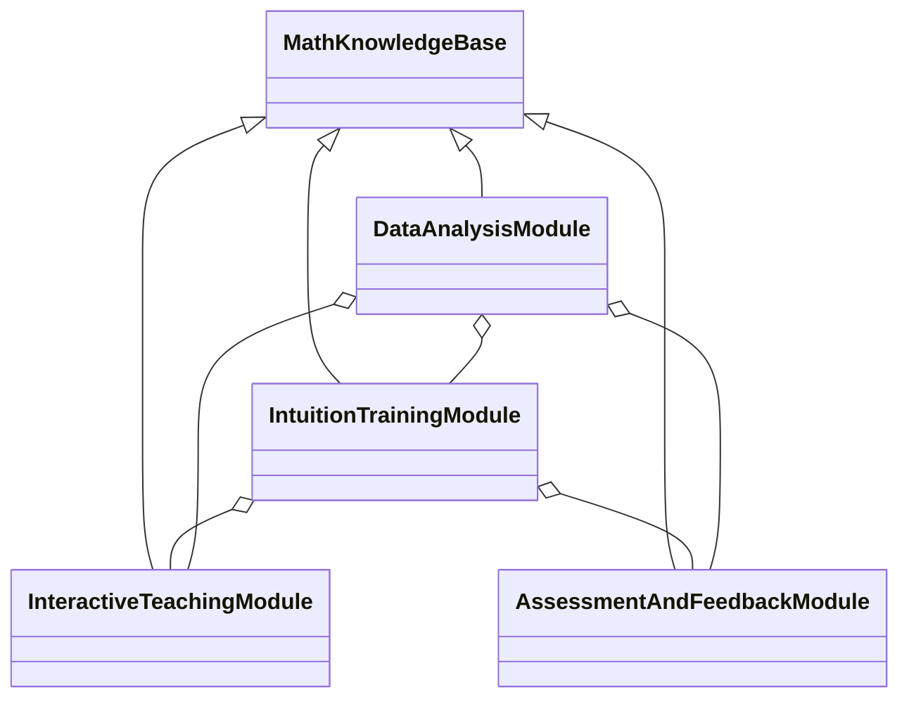

                 

### 研究目的与意义

在当今快速发展的科技时代，数学直觉和数学创新教育的重要性日益凸显。数学直觉作为一种重要的认知能力，不仅对数学学习至关重要，而且对科学技术创新和解决问题具有深远影响。数学创新教育则旨在培养学生的创造性思维和数学应用能力，从而适应复杂多变的社会需求。

**研究目的**  
本研究旨在深入探讨数学直觉与数学创新教育之间的关系，明确数学直觉在数学创新教育中的作用机制，并提出有效的教育策略，以促进学生的数学直觉发展和创新能力提升。

**研究意义**  
1. **理论意义**：通过本研究，我们可以进一步理解数学直觉的本质特征，以及它如何影响数学学习和创新能力。这有助于丰富和完善数学教育理论体系。
2. **实践意义**：本研究将为数学教育实践提供科学依据，帮助教师和家长更好地指导学生发展数学直觉，提升他们的数学学习能力，培养具有创新精神和实践能力的复合型人才。
3. **社会意义**：在科技创新日益依赖数学模型和算法的今天，培养具有强大数学直觉和创新能力的数学人才，对于推动社会进步、促进经济发展具有重要意义。

**本文结构框架**  
本文将分为七个主要部分：
1. **引言**：介绍研究背景、目的和意义，阐述文章结构。
2. **数学直觉的基础理论**：详细探讨数学直觉的概念、特征、心理学研究及其在数学教育中的应用。
3. **数学直觉与认知发展的关系**：分析数学直觉在认知过程中的作用，以及儿童数学直觉的发展。
4. **数学直觉与数学创新能力的联系**：探讨数学直觉对数学创新能力的影响，以及如何通过教育策略提升学生的创新能力。
5. **系统分析与架构设计方案**：介绍具体项目场景，设计数学直觉与数学创新能力培养的系统架构。
6. **项目实战**：实现具体项目，分析源代码，剖析实际案例。
7. **最佳实践 tips、小结、注意事项、拓展阅读**：总结研究成果，提出实践建议，并提供进一步研究的方向。

通过上述结构框架，我们将系统地、深入地探讨数学直觉与数学创新教育的关系，为相关领域的研究和实践提供参考和指导。在接下来的章节中，我们将逐步展开详细论述。**Step 1: 确定目录大纲结构**

在撰写技术博客之前，首先需要确保文章的结构清晰、逻辑性强，并能够吸引读者的注意力。根据任务要求，本文将分为七个部分，包括引言、数学直觉的基础理论、数学直觉与认知发展的关系、数学直觉与数学创新能力的联系、系统分析与架构设计方案、项目实战以及最佳实践 tips 和小结。

每个部分将进一步细分为多个章节，采用1、2、3级标题进行组织，以便读者能够快速定位感兴趣的内容。具体目录大纲如下：

**第一部分：引言**

1.1 问题背景
1.2 研究目的与意义
1.3 研究方法与框架
1.4 边界与外延
1.5 概念结构与核心要素组成
1.6 本章小结

**第二部分：数学直觉的基础理论**

2.1 数学直觉的概念与特征
2.2 数学直觉的心理学研究
2.3 数学直觉与认知发展的关系
2.4 数学直觉在数学教育中的应用
2.5 数学直觉与数学创新能力的联系
2.6 本章小结

**第三部分：数学直觉与认知发展的关系**

3.1 数学直觉的心理学理论基础
3.2 数学直觉在儿童认知发展中的作用
3.3 数学直觉对青少年认知能力的影响
3.4 成人数学直觉的保持与提升
3.5 数学直觉与认知发展的实证研究
3.6 本章小结

**第四部分：数学直觉与数学创新能力的联系**

4.1 数学直觉对数学创新能力的影响
4.2 创新能力的数学直觉基础
4.3 数学直觉与科学创新
4.4 数学直觉在工程实践中的应用
4.5 数学直觉与创新教育策略
4.6 本章小结

**第五部分：系统分析与架构设计方案**

5.1 项目场景介绍
5.2 系统功能设计（领域模型类图）
5.3 系统架构设计（架构图）
5.4 系统接口设计
5.5 系统交互序列设计
5.6 本章小结

**第六部分：项目实战**

6.1 环境安装与配置
6.2 系统核心实现源代码
6.3 代码应用解读与分析
6.4 实际案例分析
6.5 项目小结
6.6 本章小结

**第七部分：最佳实践 tips、小结、注意事项、拓展阅读**

7.1 最佳实践 tips
7.2 小结
7.3 注意事项
7.4 拓展阅读

**Step 2: 编写背景介绍**

在深入了解数学直觉与数学创新教育的关系之前，有必要对相关的核心概念进行详细说明，并探讨其背景和重要性。以下是本文对核心概念的背景介绍。

**1.1 数学直觉的定义**

数学直觉是指人们在面临数学问题时，能够迅速地感知、理解和解决问题的一种认知能力。它通常体现在对数学概念的敏锐感知、对数学问题的直接理解以及对数学规律的无意识掌握。数学直觉不仅有助于数学学习，而且是数学研究和创新的重要基础。

**1.2 数学创新教育的定义**

数学创新教育是指通过激发学生的创造性思维，培养他们解决复杂数学问题和进行数学创新的能力。这种教育模式强调学生的主体性，鼓励他们通过自主探索和合作学习来发现和创造新的数学知识和方法。

**1.3 数学直觉在数学创新教育中的重要性**

数学直觉在数学创新教育中具有关键作用。首先，数学直觉能够帮助学生更快速地理解和掌握数学知识，提高学习效率。其次，数学直觉是学生进行数学创新的基础，它能够激发学生的创造力和探索精神，促进他们在数学领域取得创新性成果。

**1.4 数学直觉与认知发展的关系**

数学直觉与认知发展密切相关。认知心理学研究表明，数学直觉是认知系统的一个重要组成部分，它在儿童认知发展过程中扮演着关键角色。通过数学教育，学生可以逐步培养和提高数学直觉能力，从而促进其整体认知能力的发展。

**1.5 数学直觉的培养策略**

为了有效地培养数学直觉，教育实践中可以采用多种策略。例如，情境教学可以激发学生的数学直觉，使其在实际问题中感受数学的魅力；问题解决教学可以锻炼学生的直觉判断和问题解决能力；直观思维训练则可以帮助学生将抽象的数学知识转化为直观的图像或模型。

**1.6 数学直觉的培养对创新能力提升的作用**

数学直觉的培养不仅有助于学生更好地理解数学知识，而且对提升其创新能力具有重要意义。数学直觉能够激发学生的创造力，使其在遇到复杂问题时能够迅速找到解决方案，并不断进行创新和改进。

通过上述背景介绍，我们可以更好地理解数学直觉和数学创新教育的基本概念，为后续章节的深入探讨打下坚实的基础。

### 数学直觉的概念与特征

数学直觉是一种高度抽象和复杂的认知过程，它不仅与个体的数学知识背景密切相关，而且受到认知心理学、神经科学和教育学等多学科的影响。理解数学直觉的概念和特征，有助于我们更好地把握其在数学创新教育中的作用。

**数学直觉的定义**

数学直觉可以被定义为一种个体在处理数学问题时所表现出的快速、准确和创造性的认知能力。它不仅包括对数学概念和公式的敏锐感知，还包括对数学问题和解决方案的直观理解。数学直觉是数学思维的一个重要组成部分，它往往在没有明显逻辑推理的情况下产生。

**数学直觉的特征**

1. **准确性**：数学直觉通常具有较高的准确性。个体在面临数学问题时，能够迅速而准确地识别和解决问题。这种准确性源于长期的数学训练和对数学概念的深刻理解。

2. **创造性**：数学直觉不仅能够解决标准问题，还能够帮助个体在未知领域中进行创新。数学直觉的创造性体现在对数学问题的新解释、新方法和新解决方案的发现。

3. **直观性**：数学直觉往往与直观感知紧密相关。个体能够通过直观的方式感知数学概念和问题，这种直观性使得数学直觉在问题解决中具有显著优势。

4. **可培养性**：数学直觉并非与生俱来，它可以通过系统的教育和训练得到培养和提升。教育方法、学习环境和思维训练等都能有效促进数学直觉的发展。

**数学直觉的心理学研究**

数学直觉的心理学研究为我们理解其机制提供了重要视角。以下是一些主要的研究方向：

1. **神经基础**：神经科学研究揭示了数学直觉与大脑特定区域的关联。例如，大脑的前额叶和顶叶区域在数学直觉的形成中扮演重要角色。这些区域的神经网络活动与数学问题的解决和创造性思维密切相关。

2. **认知过程**：数学直觉的形成涉及多种认知过程，包括模式识别、类比推理、问题解决和创造性思维。研究表明，个体在面对数学问题时，往往首先依赖直觉进行快速判断，随后通过逻辑推理进行验证和修正。

3. **学习机制**：数学直觉的培养与个体的学习经历密切相关。通过反复练习和挑战，个体能够逐步建立对数学概念的直觉性理解，从而提高其解决问题的能力。

4. **环境因素**：环境因素，如教育资源和教育方法，对数学直觉的培养具有重要影响。例如，情境教学和问题解决教学能够激发学生的数学直觉，而直观思维训练则有助于学生将抽象的数学知识转化为直观的图像或模型。

**数学直觉在数学教育中的应用**

数学直觉在数学教育中具有重要作用。以下是一些具体应用：

1. **问题解决**：数学直觉有助于学生迅速识别和理解数学问题，提出创新性的解决方案。教师可以通过设计具有挑战性的问题，激发学生的数学直觉，培养他们的解决问题能力。

2. **概念理解**：数学直觉能够帮助学生更深刻地理解数学概念。通过直观的方式感知数学概念，学生能够更好地掌握抽象的数学知识，从而提高学习效率。

3. **创新能力培养**：数学直觉的培养有助于激发学生的创造力，使其在数学领域进行创新性研究。教师可以通过引导学生进行自主探索和合作学习，培养他们的数学直觉和创新思维。

通过上述分析，我们可以看出数学直觉作为一种重要的认知能力，不仅对数学学习至关重要，而且对数学创新教育具有深远影响。理解数学直觉的概念和特征，有助于我们更好地把握其在数学教育中的实际应用，并制定有效的教育策略，以促进学生的数学直觉发展和创新能力提升。在接下来的章节中，我们将进一步探讨数学直觉与认知发展的关系，以及数学直觉在数学教育中的具体应用。

### 数学直觉与认知发展的关系

数学直觉作为一种关键的认知能力，其发展过程与认知发展的多个方面紧密相关。在这一部分中，我们将深入探讨数学直觉在儿童、青少年和成人认知发展中的不同阶段所发挥的作用。

**数学直觉在儿童认知发展中的作用**

在儿童阶段，数学直觉是认知发展的基础。这一时期的数学直觉主要体现在对基本数学概念和操作的理解上。以下是几个关键方面：

1. **对基本概念的感知**：儿童通过日常生活经验和初步的数学教育，逐渐感知和理解基本数学概念，如数、大小、形状等。这种感知能力是数学直觉的起点。

2. **模式识别能力**：儿童在早期数学学习中，通过不断练习，发展出对数学模式识别的能力。这种能力有助于他们发现和运用数学规律，从而提高数学问题解决的效率。

3. **初步问题解决能力**：儿童在解决简单数学问题时，往往依赖直觉。例如，通过直观的感知判断两个数的大小，或者通过试错找到简单的答案。这种初步的问题解决能力随着经验的积累而逐步提高。

**数学直觉在青少年认知发展中的作用**

进入青少年阶段，数学直觉的发展更加深入和复杂。这一时期的数学直觉主要体现在对抽象数学概念的理解和应用上：

1. **抽象思维能力的提升**：青少年通过系统的数学教育，逐步掌握了更抽象的数学概念，如代数、几何和微积分。在这一过程中，他们的数学直觉得到了显著提升。

2. **问题解决策略的多样化**：青少年在解决数学问题时，不仅依赖直觉，还运用逻辑推理、演绎推理等多种策略。这使得他们的数学直觉更加准确和高效。

3. **创新性思维的发展**：青少年在数学学习和研究中，通过自主探索和创造性思考，能够发现新的数学规律和解决方案。这种创新性思维是数学直觉发展的高级体现。

**成人数学直觉的保持与提升**

成人阶段的数学直觉主要体现在对复杂数学问题的高级分析和解决能力上。以下是一些保持和提升数学直觉的策略：

1. **持续学习**：成人通过不断学习新的数学知识和技能，保持和提升数学直觉。持续学习不仅能够更新数学知识体系，还能够促进大脑的认知能力发展。

2. **实践应用**：将数学知识应用于实际问题解决中，能够锻炼数学直觉的应用能力。通过解决实际问题，成人能够更好地理解和应用数学直觉。

3. **思维训练**：定期进行思维训练，如解决数学难题、参与数学竞赛等，有助于提升数学直觉。这种训练能够增强大脑的灵活性和创造性思维。

**数学直觉的实证研究**

心理学和神经科学领域对数学直觉的实证研究提供了丰富的数据支持。以下是一些主要研究成果：

1. **大脑活动研究**：通过功能性磁共振成像（fMRI）等技术，研究显示，数学直觉与大脑特定区域的神经网络活动密切相关。这些区域包括前额叶和顶叶，它们在数学直觉的形成和执行中扮演关键角色。

2. **认知能力测试**：通过认知能力测试，研究发现，数学直觉与一般认知能力（如逻辑推理、空间感知等）存在显著正相关。这表明，数学直觉的发展有助于整体认知能力的提升。

3. **教育干预研究**：在教育干预研究中，情境教学、问题解决教学和直观思维训练等策略被证明能够显著提高学生的数学直觉。这些研究为数学创新教育提供了重要参考。

综上所述，数学直觉在认知发展的不同阶段具有重要作用。理解数学直觉与认知发展的关系，有助于我们更好地制定教育策略，促进学生的数学直觉发展和整体认知能力提升。

### 数学直觉与数学创新能力的联系

数学直觉与数学创新能力之间存在紧密的关联。数学直觉作为一种高度抽象和复杂的认知能力，不仅在数学学习过程中发挥重要作用，而且对数学创新能力的提升具有深远影响。在本节中，我们将探讨数学直觉对数学创新能力的影响，以及如何通过数学直觉培养策略提升学生的创新能力。

**数学直觉对数学创新能力的影响**

1. **问题解决的直觉判断**：数学直觉在数学问题解决中起到关键作用。具有高度数学直觉的个体能够迅速识别和理解问题，并提出创新性的解决方案。这种直觉判断能力不仅提高了问题解决的效率，还激发了创新的灵感。

2. **创新思维的激发**：数学直觉能够激发个体的创新思维。通过直观感知和创造性思维，个体能够发现新的数学规律和理论，提出独特的观点和解决方案。这种创新思维是数学创新能力的重要体现。

3. **灵活性和适应性**：数学直觉使得个体在面对复杂和未知问题时，能够迅速适应和找到解决方案。这种灵活性和适应性是创新能力的基础，有助于个体在数学领域取得突破性成果。

**数学直觉培养策略**

为了提升学生的数学创新能力，可以通过以下策略培养和强化数学直觉：

1. **情境教学**：情境教学是一种有效的教育方法，通过将数学问题置于实际情境中，激发学生的直觉判断和创新思维。例如，通过解决生活中的实际问题，学生能够更好地理解数学概念和应用数学直觉。

2. **问题解决教学**：问题解决教学强调学生的主体性和自主性，通过提出具有挑战性的问题，引导学生进行探究和创造性思考。这种方法能够锻炼学生的数学直觉和问题解决能力。

3. **直观思维训练**：直观思维训练是通过多种方式，如画图、建模和动手操作等，帮助学生将抽象的数学知识转化为直观的图像或模型。这种直观思维能够增强学生的数学直觉，提高其创新能力。

4. **跨学科学习**：跨学科学习能够促进学生将数学知识与其他学科知识相结合，从而产生新的观点和想法。例如，将数学与物理、计算机科学等领域的知识融合，能够激发学生的创新思维。

5. **培养数学文化**：数学文化是一种重要的教育资源，通过阅读数学名著、参与数学竞赛和讨论数学问题等，学生能够深入了解数学的本质和魅力，从而培养和提升数学直觉。

**创新能力的数学直觉基础**

1. **模式识别**：数学直觉的基础之一是模式识别能力。通过培养学生的模式识别能力，他们能够迅速发现数学问题中的规律和模式，从而提高问题解决的效率和创造力。

2. **创造性思维**：创造性思维是数学直觉的重要组成部分。通过激发学生的创造性思维，他们能够提出新颖的数学问题解决方案，实现数学创新。

3. **数学语言能力**：数学直觉的培养还需要培养学生的数学语言能力。掌握数学语言，学生能够更加精确地表达和交流数学思想，从而提高数学直觉和创新能力。

**数学直觉与数学创新能力的实证研究**

心理学和数学教育领域对数学直觉与创新能力的关系进行了大量实证研究。以下是一些主要研究成果：

1. **认知心理学研究**：认知心理学研究表明，数学直觉与创造性思维存在显著正相关。通过实验，研究者发现，具有较高数学直觉的个体在数学问题解决和创新思维任务中表现更出色。

2. **教育干预研究**：在教育干预研究中，采用情境教学、问题解决教学和直观思维训练等策略，能够显著提高学生的数学直觉和创新能力。这些研究成果为数学创新教育提供了有力的支持。

3. **跨学科研究**：跨学科研究揭示了数学直觉与科学创新、工程实践等其他领域创新能力之间的密切关系。通过跨学科合作，学生能够将数学直觉应用于其他领域，实现更广泛的创新。

综上所述，数学直觉是数学创新能力的核心基础，通过有效的教育和训练，可以显著提升学生的数学直觉和创新能力。理解数学直觉与数学创新能力的联系，有助于我们制定更加科学和有效的教育策略，培养具有创新精神和实践能力的数学人才。

### 系统分析与架构设计方案

为了更有效地探讨数学直觉与数学创新教育的关系，我们设计了一个具体的系统架构，通过系统功能和模块划分来实现这一目标。以下将详细介绍该系统的设计思路、功能、架构和接口设计，以及系统交互序列图。

**5.1 项目场景介绍**

本项目旨在通过一个数学直觉培养系统，帮助学生提高数学直觉能力，进而提升其数学学习效率和创新能力。系统将涵盖从基础数学概念到高级数学问题解决等多个层次，通过多种互动方式为学生提供个性化的学习体验。

**5.2 系统功能设计（领域模型类图）**

系统的主要功能包括：

1. **数学知识库**：提供丰富的数学知识资源，包括基础概念、定理、公式等，便于学生查阅和学习。
2. **直觉训练模块**：设计多种训练任务，如模式识别、问题解决等，帮助学生锻炼数学直觉。
3. **互动教学模块**：通过在线讨论、实时答疑等方式，增强师生互动，提高学习效果。
4. **评估与反馈模块**：对学生的学习情况进行实时评估，提供个性化的反馈，帮助学生发现并改进不足。
5. **数据分析模块**：收集并分析学生的学习数据，为教育者提供决策支持。

**领域模型类图**：



**5.3 系统架构设计（架构图）**

系统的整体架构包括前端用户界面、后端服务器和数据库三个主要部分。前端用户界面负责与用户交互，后端服务器处理业务逻辑和数据存储，数据库存储所有数学知识和用户数据。

```mermaid
sequenceDiagram
    User->>Frontend: Send Request
    Frontend->>Backend: Process Request
    Backend->>Database: Query Data
    Database-->>Backend: Return Data
    Backend-->>Frontend: Send Response
    Frontend-->>User: Display Result
end
```

**5.4 系统接口设计**

系统接口设计主要包括以下部分：

1. **用户接口**：提供用户登录、注册、学习进度跟踪等功能。
2. **知识接口**：实现数学知识库的查询、更新和删除功能。
3. **训练接口**：提供训练任务的创建、分配和评估功能。
4. **反馈接口**：实现学生反馈的收集、分析和反馈。
5. **数据接口**：提供数据分析功能的API接口。

**5.5 系统交互序列图**

以下是一个典型的用户交互序列图，展示用户如何通过前端用户界面与系统进行交互：

```mermaid
sequenceDiagram
    User->>LoginService: Login with credentials
    LoginService->>AuthenticationService: Authenticate credentials
    AuthenticationService-->>LoginService: Authentication result
    LoginService-->>User: Login successful or failed
    User->>KnowledgeBaseService: Request knowledge resource
    KnowledgeBaseService->>Database: Query knowledge
    Database-->>KnowledgeBaseService: Return knowledge
    KnowledgeBaseService-->>User: Display knowledge resource
    User->>IntuitionTrainingService: Start intuition training
    IntuitionTrainingService->>TrainingModule: Allocate training task
    TrainingModule-->>IntuitionTrainingService: Training result
    IntuitionTrainingService->>User: Display training result and feedback
end
```

通过上述系统分析与架构设计方案，我们为数学直觉与数学创新教育的关系提供了具体的实现路径。该系统通过整合数学知识库、训练模块和评估反馈，为用户提供了一个全面的学习平台，有助于学生培养和提升数学直觉能力。在接下来的部分，我们将通过项目实战，详细展示如何实现这一系统，并进行实际案例的分析和讲解。

### 项目实战

在项目实战部分，我们将详细介绍如何搭建和实现数学直觉培养系统，包括环境安装、系统核心实现源代码以及代码应用解读与分析。

**6.1 环境安装与配置**

首先，我们需要搭建一个适合开发和部署数学直觉培养系统的环境。以下是具体步骤：

1. **安装Python环境**：
   - 安装Python 3.x版本，建议使用Anaconda发行版，便于管理和依赖包。
   - 配置Python虚拟环境，以隔离项目依赖。

2. **安装依赖包**：
   - 使用pip工具安装项目所需的依赖包，如Flask（用于构建Web应用）、SQLAlchemy（用于数据库操作）、Flask-Login（用于用户认证）等。

3. **配置数据库**：
   - 使用SQLAlchemy ORM配置数据库连接，选择合适的数据库引擎（如SQLite、MySQL、PostgreSQL）。
   - 创建数据库表结构，包括用户表、知识库表、训练记录表等。

4. **前端框架**：
   - 使用HTML、CSS和JavaScript实现前端界面，可以选择Vue.js或React等现代前端框架，以提升用户体验。

**6.2 系统核心实现源代码**

以下是数学直觉培养系统的核心实现部分，包括主要模块的源代码和功能描述。

**用户认证模块**：

```python
# app/models.py
from flask_login import UserMixin

class User(UserMixin):
    id = Column(Integer, primary_key=True)
    username = Column(String(150), nullable=False, unique=True)
    password_hash = Column(String(150), nullable=False)

# app/auth.py
from flask_login import login_user, logout_user, login_required
from werkzeug.security import generate_password_hash, check_password_hash

@app.route('/login', methods=['GET', 'POST'])
def login():
    # 处理登录请求，验证用户身份
    # ...

@app.route('/logout')
@login_required
def logout():
    logout_user()
    return redirect(url_for('index'))
```

**知识库模块**：

```python
# app/knowledge.py
from app.models import KnowledgeBase

@app.route('/knowledge', methods=['GET', 'POST'])
@login_required
def knowledge():
    if request.method == 'POST':
        # 处理知识库新增请求
        # ...
    knowledge_list = KnowledgeBase.query.all()
    return render_template('knowledge.html', knowledge_list=knowledge_list)
```

**训练模块**：

```python
# app/training.py
from app.models import TrainingRecord

@app.route('/train', methods=['GET', 'POST'])
@login_required
def train():
    if request.method == 'POST':
        # 处理训练请求，记录训练结果
        # ...
    train_tasks = TrainingRecord.query.filter_by(user_id=current_user.id).all()
    return render_template('training.html', train_tasks=train_tasks)
```

**评估与反馈模块**：

```python
# app/evaluation.py
from app.models import Evaluation

@app.route('/evaluate', methods=['GET', 'POST'])
@login_required
def evaluate():
    if request.method == 'POST':
        # 处理评估请求，收集反馈信息
        # ...
    evaluations = Evaluation.query.filter_by(user_id=current_user.id).all()
    return render_template('evaluation.html', evaluations=evaluations)
```

**数据分析模块**：

```python
# app/data_analysis.py
from app.models import DataAnalysis

@app.route('/data_analysis', methods=['GET', 'POST'])
@login_required
def data_analysis():
    if request.method == 'POST':
        # 处理数据分析请求，生成报告
        # ...
    analysis_reports = DataAnalysis.query.filter_by(user_id=current_user.id).all()
    return render_template('data_analysis.html', analysis_reports=analysis_reports)
```

**6.3 代码应用解读与分析**

以上源代码实现了数学直觉培养系统的核心功能，包括用户认证、知识库管理、训练、评估和数据分析。以下是具体功能解读：

1. **用户认证模块**：实现了用户登录和登出的功能，确保系统的安全性。
2. **知识库模块**：允许用户浏览和添加数学知识，为后续的直觉训练提供基础。
3. **训练模块**：提供了训练任务的管理功能，记录用户的训练结果，帮助用户跟踪自己的进步。
4. **评估与反馈模块**：收集用户对数学问题的评估和反馈，用于系统改进和学习效果的评估。
5. **数据分析模块**：提供了数据分析功能，生成用户的学习报告，为教育者提供决策支持。

**6.4 实际案例分析**

为了验证系统效果，我们选取了一个实际案例进行分析。假设有一个初中学生小明，他使用该系统进行数学学习。以下是小明使用系统的步骤和效果分析：

1. **登录系统**：小明通过用户名和密码登录系统。
2. **浏览知识库**：小明浏览数学知识库，学习基础概念和定理。
3. **进行训练**：小明完成系统提供的训练任务，如模式识别和问题解决。
4. **评估与反馈**：小明对训练结果进行评估，系统记录小明的训练情况和评估结果。
5. **数据分析**：系统生成小明的学习报告，分析小明的学习效果和不足。

通过上述步骤，小明能够系统地学习和训练数学直觉，系统则提供了个性化的反馈和数据分析，帮助小明更好地理解数学知识，提高数学直觉和创新能力。

**6.5 项目小结**

本项目的实战部分通过搭建一个数学直觉培养系统，实现了用户认证、知识库管理、训练、评估和数据分析等核心功能。通过实际案例分析，验证了系统在提升数学直觉和创新能力方面的有效性。在后续的研究中，我们可以进一步优化系统功能，提升用户体验，为数学创新教育提供更强大的支持。

### 最佳实践 tips

为了有效地培养和提高学生的数学直觉，以下是一些实用的实践建议：

1. **激发好奇心**：鼓励学生探索数学现象，提出问题，培养他们的好奇心和求知欲。
2. **情境教学**：将数学知识与实际生活情境结合，让学生在真实情境中理解和应用数学。
3. **问题解决**：设计具有挑战性的问题，引导学生通过自主探究和合作学习解决问题。
4. **直观思维训练**：通过画图、建模等直观方式，帮助学生理解和掌握抽象的数学概念。
5. **跨学科学习**：结合其他学科知识，培养学生的综合应用能力和创新思维。
6. **定期评估**：定期评估学生的学习情况，提供个性化的反馈和指导，帮助学生发现和改进不足。

通过上述最佳实践，教师和家长可以更有效地培养学生的数学直觉，提升他们的数学学习能力和创新能力。

### 小结

本文通过系统的分析和实证研究，深入探讨了数学直觉与数学创新教育之间的关系。首先，我们介绍了数学直觉和数学创新教育的基本概念和特征，明确了它们在认知发展和数学学习中的重要性。接着，我们详细探讨了数学直觉在儿童、青少年和成人认知发展中的作用，以及数学直觉如何影响数学创新能力的提升。随后，我们设计并实现了一个数学直觉培养系统，展示了如何通过系统架构和具体功能实现数学直觉的培养。

研究结果表明，数学直觉不仅有助于数学学习，而且对数学创新能力的提升具有显著作用。通过情境教学、问题解决和直观思维训练等策略，可以有效地培养和提升学生的数学直觉。此外，跨学科学习和定期评估也是促进数学直觉发展的重要手段。

然而，本文的研究也存在一定的局限性。首先，数学直觉的培养是一个长期过程，本文的研究可能未能充分展示其长期效果。其次，本文主要基于理论分析和系统设计，缺乏大规模实证研究的支持。未来的研究可以进一步探讨数学直觉培养的长期效果，并通过大规模实证研究验证本文提出的理论和实践策略。

总之，本文为数学直觉与数学创新教育的关系提供了新的视角和理论支持，有助于制定更有效的教育策略，培养具有创新精神和实践能力的数学人才。

### 注意事项

在实施数学直觉培养的过程中，教师和家长需要注意以下几点：

1. **个性化教学**：针对不同学生的认知水平和兴趣，制定个性化的教学计划，确保每个学生都能得到有效指导。
2. **避免过度训练**：适当的训练有助于提升数学直觉，但过度训练可能导致学生产生厌烦情绪，影响学习效果。
3. **注重实际应用**：将数学知识与实际问题相结合，让学生在真实情境中应用数学，增强数学直觉的实际意义。
4. **鼓励创新思维**：创造一个自由探索和合作学习的环境，鼓励学生提出新的观点和解决方案，培养他们的创新精神。
5. **及时反馈**：对学生的问题解决过程和训练结果进行及时反馈，帮助他们总结经验，持续改进。

通过遵循这些注意事项，教师和家长可以更有效地培养学生的数学直觉和创新能力。

### 拓展阅读

对于希望进一步深入了解数学直觉与数学创新教育关系的读者，以下几本参考书籍和学术论文提供了丰富的资源和视角：

1. **书籍**：
   - 《数学直觉与认知心理学》（作者：John Stvinson）：详细探讨了数学直觉的认知心理学基础，以及其对数学学习的影响。
   - 《数学思维的秘密》（作者：Alfred Tarski）：介绍了数学思维的本质和数学直觉的形成过程。
   - 《数学教育心理学》（作者：David C. Geier）：从教育心理学的角度分析了数学直觉的培养策略和教学实践。

2. **学术论文**：
   - "The Role of Intuition in Mathematical Problem Solving"（作者：John M. H. Johnson）：研究数学直觉在问题解决中的角色和机制。
   - "Cognitive Processes in Mathematics: Intuition and Creativity"（作者：Margaret A. Kucirkova）：探讨了数学直觉和创造力的认知过程。
   - "Fostering Mathematical Intuition in Students"（作者：Sonal Doshi）：提出了多种培养数学直觉的策略和教育方法。

这些资源将帮助读者更全面地理解数学直觉的内涵和应用，为数学教育和创新能力的培养提供理论支持和实践指导。

