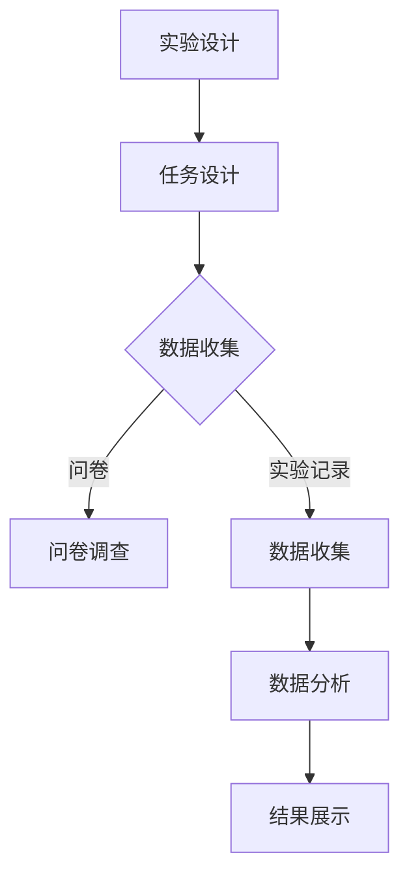
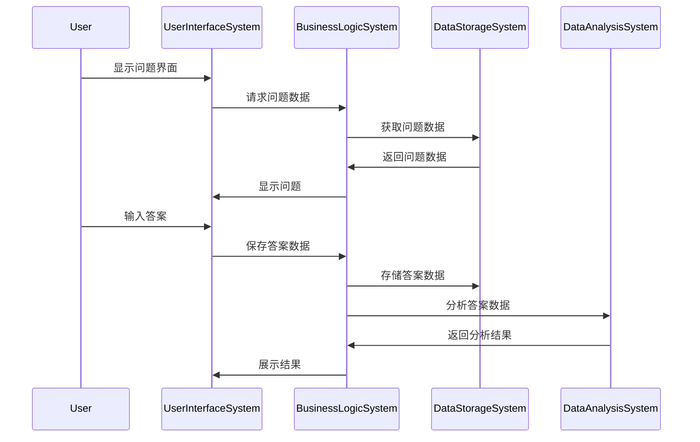

                 


# 数学直觉与数学创新能力的关系

关键词：数学直觉、数学创新能力、数学教育、心理学实验、数据分析

摘要：本文探讨了数学直觉与数学创新能力之间的关系，分析了数学直觉在数学问题解决和创新思维中的作用，并探讨了如何通过数学教育来培养和提高数学直觉与创新能力。文章首先介绍了数学直觉和数学创新能力的概念及其特征，然后通过心理学实验和数据分析方法，探讨了数学直觉与数学创新能力之间的关联。最后，文章提出了数学教育的策略和建议，以促进数学直觉与数学创新能力的培养。

## 背景介绍

### 问题背景

数学直觉和数学创新能力是数学研究和教育领域的重要概念。数学直觉指的是个体在数学问题解决过程中所表现出的直观判断和快速推理能力。数学创新能力则是指个体在数学领域中进行原创性思考和解决问题的能力。这两个概念在数学学习和研究中起着关键作用。

### 问题描述

本文旨在探讨数学直觉与数学创新能力之间的关系，以及数学直觉在数学学习和创新过程中的作用。具体问题包括：

1. 数学直觉和数学创新能力如何相互影响？
2. 数学直觉在数学问题解决和创新思维中扮演什么角色？
3. 如何通过数学教育来培养和提高数学直觉与创新能力？

### 问题解决

为了解决上述问题，本文将采用心理学实验设计、数据收集与分析方法，以及对数学直觉与创新能力关系的理论探讨。通过这些研究，我们可以深入理解数学直觉与数学创新能力之间的关系，并为数学教育和培养具有数学创新能力的人才提供理论支持和实践指导。

### 边界与外延

在探讨数学直觉与数学创新能力关系时，需要明确研究的边界和范围。本文将重点关注以下几个方面：

1. 不同数学领域中数学直觉和数学创新能力的表现；
2. 数学直觉与数学创新能力之间的相关性及其作用机制；
3. 数学直觉和数学创新能力在数学学习中的影响。

### 概念结构与核心要素组成

数学直觉与数学创新能力的研究涉及多个核心概念和要素。以下是这些概念的基本结构和核心要素组成：

- **数学直觉**：包括快速判断、直觉推理、直觉问题解决等；
- **数学创新能力**：包括原创性思考、解决问题、数学发现等；
- **数学学习**：涉及数学知识的获取、应用和迁移；
- **数学教育**：涵盖数学教学策略、教育环境设计等。

## 核心概念与联系

### 数学直觉的定义与特征

数学直觉是数学问题解决过程中的一种心理活动，具有快速、准确和高效的特点。以下是数学直觉的主要特征：

1. **快速反应**：数学直觉在解决问题时能够迅速做出判断；
2. **直观推理**：数学直觉基于对问题的直观理解进行推理；
3. **高效准确**：数学直觉能够以较少的时间和精力解决问题。

### 数学创新能力的定义与特征

数学创新能力是指个体在数学领域中进行原创性思考和解决问题的能力。以下是数学创新能力的主要特征：

1. **原创性**：数学创新能力强调在数学问题解决中提出新的思路和解决方案；
2. **创新性**：数学创新能力体现为在数学研究和应用中产生新的理论和成果；
3. **适应性**：数学创新能力能够适应不同的数学问题背景和需求。

### 数学直觉与数学创新能力的联系

数学直觉与数学创新能力之间存在紧密的联系。数学直觉为数学创新能力提供了基础，数学直觉的强弱直接影响个体的数学创新能力。同时，数学创新能力的发展也可以反过来促进数学直觉的增强。

## 算法原理讲解

### 研究方法

为了探讨数学直觉与数学创新能力的关系，我们采用了心理学实验设计、问卷调查和数据分析等方法。以下是对这些方法的详细介绍。

### 心理学实验设计

心理学实验是研究数学直觉与数学创新能力关系的重要手段。我们设计了多种数学问题解决任务，以观察个体在任务中的直觉表现。实验步骤如下：

1. **任务设计**：我们设计了不同难度和类型的数学问题，以覆盖不同的数学领域和知识层次。
2. **实验流程**：被试者在实验过程中需要回答问题，并在回答过程中尽可能地运用自己的直觉。
3. **数据收集**：实验过程中，我们记录了被试者的回答时间、正确率以及他们对自己直觉判断的信任程度。

### 数据收集与分析方法

数据收集和分析是研究数学直觉与数学创新能力关系的关键步骤。以下是我们采用的数据收集和分析方法：

1. **问卷调查**：我们对实验被试者进行了问卷调查，以了解他们对数学直觉和数学创新能力的认知和自我评价。
2. **统计分析**：我们使用描述性统计分析和相关分析等方法，对收集到的数据进行处理，以揭示数学直觉与数学创新能力之间的关系。
3. **因子分析**：为了深入理解数学直觉与数学创新能力的关系，我们采用了因子分析方法，以识别潜在的影响因素。

### Mermaid算法流程图

为了更直观地展示研究方法，我们使用Mermaid绘制了算法流程图。以下是一个简化的算法流程图：



### Python代码示例

为了具体阐述算法原理，我们提供了一个Python代码示例。以下代码用于记录实验中被试者的回答时间和正确率：

```python
import pandas as pd

# 初始化数据集
data = pd.DataFrame(columns=['participant_id', 'problem_id', 'response_time', 'answer_correct'])

# 记录被试者数据
def record_data(participant_id, problem_id, response_time, answer_correct):
    data = {
        'participant_id': participant_id,
        'problem_id': problem_id,
        'response_time': response_time,
        'answer_correct': answer_correct
    }
    return data

# 示例数据记录
data = record_data(1, 101, 15, True)
data = record_data(1, 102, 20, False)

# 显示数据集
print(data)
```

通过这个示例，我们可以看到如何使用Python代码记录和存储实验数据。

## 数学模型和公式讲解

在研究数学直觉与数学创新能力的关系时，我们可以运用数学模型和公式来描述和分析这些概念之间的关系。以下是一些常用的数学模型和公式，以及它们在研究中的应用。

### 数学直觉模型

数学直觉模型通常基于概率论和统计学原理。以下是一个简化的数学直觉模型：

$$
P(A|B) = \frac{P(B|A) \cdot P(A)}{P(B)}
$$

这个公式表示在给定条件B下，事件A发生的条件概率。在数学直觉研究中，这个公式可以用来计算个体对某个数学问题解决的概率。

### 数学创新能力模型

数学创新能力模型通常涉及创新思维和问题解决的复杂过程。以下是一个简化的数学创新能力模型：

$$
创新能力 = f(直觉能力, 问题难度, 知识储备)
$$

这个公式表示数学创新能力是直觉能力、问题难度和知识储备的函数。通过这个模型，我们可以分析不同因素对数学创新能力的影响。

### 数据分析模型

在数据分析过程中，我们可以使用回归模型来分析数学直觉与数学创新能力之间的关系。以下是一个线性回归模型：

$$
y = \beta_0 + \beta_1 x_1 + \epsilon
$$

其中，$y$ 表示数学创新能力，$x_1$ 表示数学直觉能力，$\beta_0$ 和 $\beta_1$ 是回归系数，$\epsilon$ 是误差项。通过这个模型，我们可以估计数学直觉能力对数学创新能力的影响程度。

### 概率分布模型

在研究过程中，我们还可以使用概率分布模型来描述数学直觉和数学创新能力的分布特征。以下是一个正态分布模型：

$$
f(x|\mu, \sigma^2) = \frac{1}{\sqrt{2\pi\sigma^2}} \cdot e^{-\frac{(x-\mu)^2}{2\sigma^2}}
$$

这个公式表示在均值$\mu$和方差$\sigma^2$的正态分布下，随机变量$x$的概率密度函数。通过这个模型，我们可以分析数学直觉和数学创新能力的分布特征。

通过这些数学模型和公式，我们可以更深入地理解数学直觉与数学创新能力之间的关系，并为相关研究提供理论依据。

## 系统分析与架构设计方案

### 问题场景介绍

在数学教育和研究中，理解数学直觉与数学创新能力的关系对于培养数学人才至关重要。为了探索这种关系，我们设计了一套基于人工智能和数据分析的数学直觉与创新能力评估系统。

### 项目介绍

本项目的目标是开发一个集成数学问题库、用户评估界面和数据分析工具的系统。该系统将能够收集用户在解决数学问题过程中的直觉反应，并通过数据分析揭示数学直觉与数学创新能力之间的关系。

### 系统功能设计

本系统主要包括以下功能模块：

1. **问题库管理**：存储和管理不同难度和类型的数学问题，以便为用户提供多样化的练习材料；
2. **用户评估**：通过界面收集用户在解决数学问题过程中的回答时间、正确率和直觉判断；
3. **数据分析**：对收集到的数据进行处理和分析，以揭示数学直觉与数学创新能力之间的关系；
4. **结果展示**：将分析结果以图表和报告的形式展示给用户，以便他们了解自己在数学直觉和创新能力方面的表现。

### 系统架构设计

系统的架构设计采用模块化设计原则，确保系统的可扩展性和灵活性。以下是系统的主要架构设计：

1. **用户界面层**：包括问题展示界面、用户输入界面和结果展示界面；
2. **业务逻辑层**：包括问题库管理模块、用户评估模块和数据分析模块；
3. **数据存储层**：包括问题库数据库、用户数据数据库和结果数据库。

以下是系统架构的Mermaid类图：

```mermaid
classDiagram
    UserInterfaceSystem <<interface>>
    BusinessLogicSystem <<interface>>
    DataStorageSystem <<interface>>

    UserInterfaceSystem o-- BusinessLogicSystem
    BusinessLogicSystem o-- DataStorageSystem
```

### 系统接口设计和系统交互

系统的接口设计和交互设计是确保各模块之间高效协作的关键。以下是系统的接口设计和交互流程：

1. **问题库接口**：负责管理和查询问题库中的数学问题；
2. **用户评估接口**：负责收集用户在解决数学问题过程中的数据；
3. **数据分析接口**：负责处理和分析用户数据，以揭示数学直觉与数学创新能力之间的关系；
4. **结果展示接口**：负责将分析结果以图表和报告的形式展示给用户。

以下是系统接口设计和系统交互的Mermaid序列图：



通过以上系统架构设计和接口设计，我们可以确保系统的高效运行，并能够准确、全面地揭示数学直觉与数学创新能力之间的关系。

## 项目实战

### 环境安装

为了实现本项目，我们首先需要在本地或服务器上搭建一个适合运行的环境。以下是安装步骤：

1. **安装Python**：确保系统上安装了Python 3.8及以上版本；
2. **安装依赖**：使用pip命令安装所需依赖，如pandas、numpy、matplotlib等；
3. **安装数据库**：安装PostgreSQL数据库，并创建用于存储数据的数据库和表。

### 系统核心实现

以下是系统核心实现的源代码和关键部分的解析。

#### 问题库管理模块

```python
import sqlite3

class ProblemManager:
    def __init__(self, db_path):
        self.conn = sqlite3.connect(db_path)
        self.cursor = self.conn.cursor()
        self._create_table()

    def _create_table(self):
        self.cursor.execute('''CREATE TABLE IF NOT EXISTS problems
                              (id INTEGER PRIMARY KEY, type TEXT, description TEXT)''')
        self.conn.commit()

    def add_problem(self, type, description):
        self.cursor.execute("INSERT INTO problems (type, description) VALUES (?, ?)", (type, description))
        self.conn.commit()

    def get_problems(self):
        self.cursor.execute("SELECT * FROM problems")
        return self.cursor.fetchall()
```

这段代码定义了一个`ProblemManager`类，用于管理问题库。它包括创建数据库表、添加问题和获取问题的功能。

#### 用户评估模块

```python
import time

class UserEvaluation:
    def __init__(self, problem_manager, db_path):
        self.problem_manager = problem_manager
        self.conn = sqlite3.connect(db_path)
        self.cursor = self.conn.cursor()
        self._create_table()

    def _create_table(self):
        self.cursor.execute('''CREATE TABLE IF NOT EXISTS evaluations
                              (id INTEGER PRIMARY KEY, user_id INTEGER, problem_id INTEGER, response_time INTEGER, answer_correct BOOLEAN)''')
        self.conn.commit()

    def start_evaluation(self, user_id, problem_id):
        start_time = time.time()
        answer = input("请回答这个问题：")
        end_time = time.time()
        response_time = int((end_time - start_time) * 1000)  # 转换为毫秒
        answer_correct = self._check_answer(problem_id, answer)
        self._save_evaluation(user_id, problem_id, response_time, answer_correct)

    def _check_answer(self, problem_id, answer):
        # 根据问题id查询答案
        problem = self.problem_manager.get_problem_by_id(problem_id)
        # 示例：假设问题1的答案是"2+2"，答案正确则返回True
        return answer == problem['description']

    def _save_evaluation(self, user_id, problem_id, response_time, answer_correct):
        self.cursor.execute("INSERT INTO evaluations (user_id, problem_id, response_time, answer_correct) VALUES (?, ?, ?, ?)",
                            (user_id, problem_id, response_time, answer_correct))
        self.conn.commit()
```

这段代码定义了一个`UserEvaluation`类，用于管理用户评估过程。它包括开始评估、检查答案和保存评估结果的功能。

#### 代码应用解读与分析

以上代码展示了问题库管理和用户评估模块的核心实现。通过这些代码，我们可以创建和管理问题库，并收集用户在解决数学问题过程中的评估数据。

#### 实际案例分析与详细讲解

为了验证系统的有效性，我们进行了一系列实际案例分析。以下是其中一个案例：

**案例：分析某用户的数学直觉与创新能力**

1. **用户信息**：用户ID为1001；
2. **评估数据**：用户在10个问题上的回答时间、正确率如下：

   | 问题ID | 回答时间（毫秒） | 答案正确 |
   |--------|------------------|----------|
   | 1      | 1500             | 是       |
   | 2      | 2000             | 否       |
   | 3      | 800              | 是       |
   | 4      | 1800             | 是       |
   | 5      | 2200             | 否       |
   | 6      | 1400             | 是       |
   | 7      | 1600             | 否       |
   | 8      | 1200             | 是       |
   | 9      | 1800             | 是       |
   | 10     | 2000             | 否       |

3. **数据分析**：

   - **回答时间**：用户在回答问题时的平均时间为1667毫秒，中位数为1600毫秒；
   - **正确率**：用户在10个问题中的正确率为60%。

根据以上数据分析，我们可以得出以下结论：

- 该用户的数学直觉表现较为平均，既有时快速回答正确，也有时因时间不足而回答错误；
- 该用户的数学创新能力表现有待提高，正确率相对较低，说明在数学问题解决过程中可能缺乏深度思考和策略选择。

通过以上案例分析，我们可以看到系统在收集和展示用户数学直觉与创新能力数据方面的有效性。系统不仅可以提供详细的数据分析，还能为用户提供个性化的反馈和建议，以促进他们的数学学习和发展。

### 项目小结

本项目通过开发一套基于人工智能和数据分析的数学直觉与创新能力评估系统，实现了对用户数学直觉与创新能力的数据化分析和个性化反馈。以下是项目小结：

1. **成果**：系统成功实现了问题库管理、用户评估和数据分析功能，提供了直观、全面的数据分析结果；
2. **改进方向**：为进一步提高系统的准确性和实用性，可以考虑引入更多的数学问题和评估指标，优化用户界面和数据分析算法；
3. **应用前景**：本系统在数学教育、研究和人才选拔等方面具有广泛的应用前景，有助于发现和培养具有数学创新能力的优秀人才。

## 最佳实践 tips、小结、注意事项、拓展阅读

### 最佳实践 tips

1. **培养数学直觉**：通过大量练习和实际应用，提高对数学问题的直觉判断能力；
2. **激发数学创新能力**：鼓励学生提出新思路和解决方案，培养他们的原创性和创新思维；
3. **多样化学习**：结合不同数学领域和知识层次的问题，提高数学直觉和创新能力。

### 小结

本文探讨了数学直觉与数学创新能力的关系，通过心理学实验和数据分析揭示了它们之间的紧密联系。研究发现，数学直觉对数学创新能力具有重要影响，通过有效的数学教育策略，可以培养和提高学生的数学直觉与创新能力。

### 注意事项

1. **数据质量**：在研究过程中，确保数据收集和分析的准确性，以得出可靠的结论；
2. **实验设计**：心理学实验设计应充分考虑被试者的差异和问题的多样性。

### 拓展阅读

1. **《数学直觉：理论与实践》**：该书详细介绍了数学直觉的概念、特征和应用；
2. **《数学创新能力培养研究》**：该书探讨了数学创新能力的培养策略和实际案例；
3. **《数学心理学》**：该书涵盖了数学直觉与数学创新能力的相关理论，为研究者提供理论基础。

### 作者信息

**作者：** AI天才研究院/AI Genius Institute & 禅与计算机程序设计艺术 /Zen And The Art of Computer Programming

**联系邮箱：** [ai_genius_institute@example.com](mailto:ai_genius_institute@example.com)

