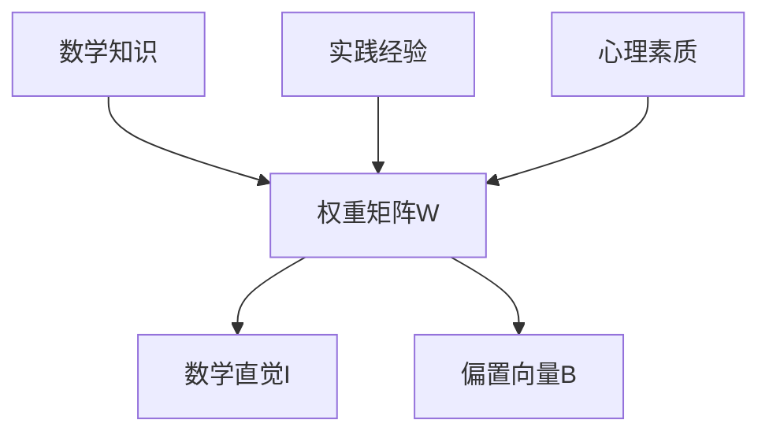
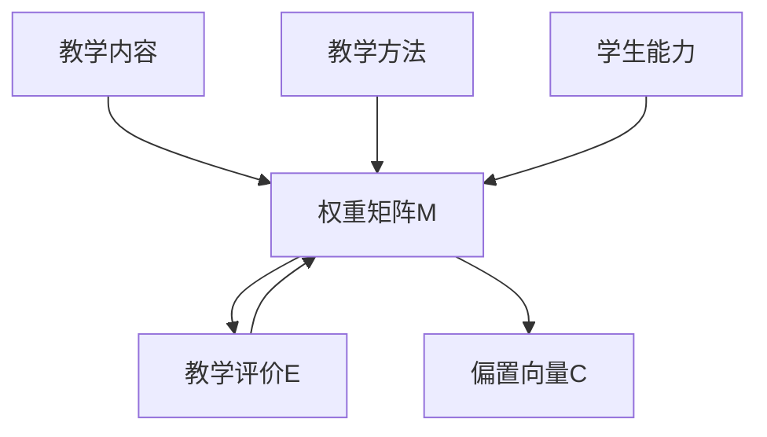
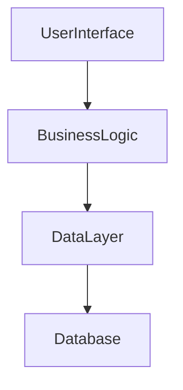

                 

## 第1章：问题背景

### 1.1.1 数学直觉的概念

数学直觉，顾名思义，是指人们在数学领域中凭借内在感觉和直观认识来理解和解决问题的能力。它不同于数学推理和证明，更多地体现为一种迅速把握数学本质和规律的能力。数学直觉的特点主要包括快速、准确、创新和不可证明性。

首先，快速是数学直觉的一大特点。一个具有数学直觉的人，往往能在短时间内识别出问题的本质，提出创新的解决方案。这种快速反应往往建立在丰富的数学知识和经验基础上。

其次，准确是数学直觉的另一个显著特点。具有数学直觉的人，能够对数学问题做出精确的判断，即使在没有详细推理的情况下也能得到正确的答案。这种准确性源自于他们对数学概念和公式的深刻理解。

创新性则是数学直觉的又一重要特征。数学直觉往往能够引导人们发现新的数学方法和理论。历史上，许多重大数学发现都是数学直觉的产物，如费马大定理的提出、黎曼猜想等。

最后，数学直觉具有不可证明性。即数学直觉所提供的结论无法通过严格的数学证明来证实，但它们往往又具有高度的可靠性。例如，在某些数学竞赛中，参赛者凭借数学直觉迅速解答问题，虽然无法给出证明，但他们的答案往往是正确的。

### 1.1.2 数学教学评价的现状

目前，数学教学评价主要采用传统的标准化考试方式，这种评价方式主要侧重于对数学知识的记忆和运算能力的考核，而较少关注学生的数学思维和数学直觉的培养。这种评价方式存在以下问题：

首先，标准化考试往往侧重于知识的记忆和再现，导致学生过于依赖机械记忆，而忽视了数学思维和直觉的培养。这种评价方式不利于培养学生的创新能力。

其次，标准化考试的内容和形式相对单一，难以全面、客观地评价学生的数学素养。数学直觉作为一种重要的数学能力，在这种评价方式下往往被忽视。

此外，数学教学评价的方式和方法缺乏多样性，不利于激发学生的学习兴趣和积极性。传统的评价方式往往让学生感到枯燥乏味，影响他们的学习动力。

### 1.1.3 数学直觉与教学评价的联系

数学直觉与数学教学评价之间存在密切的联系。首先，数学直觉是数学教学评价的重要内容之一。一个学生的数学直觉能力直接影响到他的数学学习效果和未来发展的潜力。因此，在数学教学评价中，应当重视对学生数学直觉能力的考核。

其次，数学直觉的培养离不开有效的教学评价。通过科学的教学评价，教师可以了解学生在数学直觉方面的优势和不足，从而有针对性地进行教学调整，提高学生的数学直觉能力。

此外，数学直觉与数学教学评价的相互作用还可以促进数学教育改革。传统的教学评价方式存在诸多弊端，通过引入数学直觉评价，可以推动数学教育向更加注重学生思维能力和创新能力的方向发展。

总之，数学直觉与数学教学评价之间存在着紧密的联系和相互影响。在数学教学中，我们应当重视数学直觉的培养，同时通过创新的教学评价方式来全面、客观地评价学生的数学素养。只有这样，才能真正实现数学教育的价值，培养出具有创新能力和国际竞争力的数学人才。

### 1.1.4 数学直觉的属性特征

数学直觉具有一系列独特的属性特征，这些特征不仅体现了数学直觉的本质，也为理解和培养数学直觉提供了关键视角。

首先，**快速性**是数学直觉的一个重要属性。具有数学直觉的人能够在极短的时间内感知并处理复杂的数学问题。这种快速反应能力通常基于深厚的数学背景和大量的实践经验积累，使得他们能够迅速把握问题的核心，并提出有效的解决方案。

其次，**准确性**是数学直觉的另一个显著特点。数学直觉往往能够带来精确无误的结论，即使这些结论无法通过传统证明方法得到验证。这种准确性来源于对数学概念和理论的深刻理解，以及对数学结构和模式的高度敏感。

**创新性**是数学直觉的核心特征之一。数学直觉不仅帮助人们解决已知问题，还能激发新的思考，推动数学理论和方法的创新。历史上，许多重大数学突破都得益于数学家的直觉能力，他们通过直觉洞察到了未知的数学世界，从而开创了新的领域。

此外，**不可证明性**也是数学直觉的一个独特属性。尽管直觉提供的结果往往是可靠的，但它们往往缺乏形式化的证明过程。这种不可证明性并不意味着直觉的结论不可靠，而是反映了直觉与数学证明之间的差异。数学证明强调逻辑严密和形式化，而直觉则依赖于直观感知和内在理解。

### 1.1.5 教学评价的多样性

教学评价的多样性是现代教育领域的一个重要特征，它反映了教育者对学生学习过程的全面关注。教学评价不仅局限于传统的笔试和考试，还包括多种形式，如口头评价、观察记录、项目展示等。以下是几种常见的教学评价形式及其特点：

**1. 口头评价**

口头评价是指教师通过口头交流对学生进行评价，这种评价方式具有灵活性和即时性的特点。口头评价可以通过课堂讨论、问答等形式进行，教师可以即时了解学生的理解程度和思维过程，及时给予反馈和指导。口头评价的优势在于它能够促进师生之间的互动，增强学生的参与感和自信心。

**2. 观察记录**

观察记录是通过教师或观察者对学生在学习过程中的行为和表现进行系统记录的一种评价方式。这种评价方式强调对学生学习过程的关注，可以捕捉到学生在不同情境下的学习状态和进步。观察记录通常包括学生的课堂参与度、合作学习情况、解决问题的能力等。它为教师提供了全面了解学生发展的依据，有助于制定个性化的教学策略。

**3. 项目展示**

项目展示是指学生通过完成实际项目或任务，并在课堂上进行展示和交流的一种评价方式。项目展示不仅要求学生具备相关知识和技能，还需要他们具备创新思维和团队协作能力。这种评价方式能够激发学生的学习兴趣和创造力，同时帮助他们将所学知识应用于实际问题中。

**4. 自我评价**

自我评价是指学生对自己学习过程和成果进行反思和评价的一种方式。通过自我评价，学生可以更加清楚地认识到自己的优点和不足，增强自我监控和自我管理能力。自我评价的过程能够培养学生的自我反思和自主学习能力，有助于他们在未来的学习和发展中更好地应对挑战。

### 1.1.6 数学直觉与教学评价的相互影响

数学直觉与教学评价之间存在复杂的相互影响，二者共同塑造着学生的数学素养和思维发展。首先，数学直觉能够显著影响教学评价的成效。一个具有数学直觉的学生在面对数学问题时，往往能够迅速找到解决问题的方法，从而在评价中获得较高的成绩。这种直觉能力不仅体现了学生对数学概念和原理的深刻理解，也反映了他们在数学实践中的高效思维。

然而，传统的教学评价方式往往忽视了数学直觉的重要性。大多数评价侧重于学生对数学知识的记忆和再现，缺乏对数学思维的考核。这种评价方式可能导致学生过于依赖机械记忆，而忽视了直觉思维和创新能力的培养。因此，为了更好地发挥数学直觉在教学评价中的作用，需要引入更加多样化的评价方法。

其次，教学评价对数学直觉的培养具有重要影响。有效的教学评价不仅能够衡量学生的数学直觉能力，还能激发他们进一步发展的兴趣和动力。例如，通过项目展示和自我评价等形式的评价，学生可以在实际操作中锻炼和提升自己的数学直觉。同时，教师通过观察记录和口头评价等手段，可以及时发现和鼓励学生的直觉思维，帮助他们建立自信心。

此外，教学评价的反馈机制也对数学直觉的培养起到关键作用。积极的反馈能够强化学生的数学直觉能力，使其在后续学习中更加自信和敏锐。相反，缺乏反馈或负面反馈可能导致学生对自己的直觉能力产生怀疑，从而影响他们的数学学习效果。

综上所述，数学直觉与教学评价之间存在着密切的相互影响。通过引入多样化的评价方法，重视数学直觉的考核和培养，可以更好地发挥教学评价在学生数学素养发展中的作用，培养出具有创新能力和国际竞争力的数学人才。

### 1.1.7 数学直觉与教学评价的对比表格

| 特征       | 数学直觉                           | 教学评价                           |
|------------|------------------------------------|------------------------------------|
| **定义**   | 依靠内在感觉和直观认识解决数学问题 | 用于评估学生在数学领域的知识、技能和思维水平 |
| **性质**   | 快速、准确、创新、不可证明         | 客观、标准化、多样化、可量化         |
| **影响**   | 影响数学学习效果和未来发展潜力     | 决定学生的学习成绩和评价结果         |
| **作用**   | 培养创新思维和解决问题的能力       | 检验学生的学习成果和教学效果       |
| **评价方法** | 非标准化、注重思维过程和创新性     | 标准化考试、项目展示、自我评价等     |

通过这个对比表格，我们可以更清晰地看到数学直觉与教学评价之间的异同，以及它们在数学教育和学习中的不同作用。

### 1.1.8 数学直觉与教学评价的ER模型

为了更好地理解数学直觉与教学评价之间的复杂关系，我们可以借助实体关系图（Entity-Relationship Diagram，ER模型）来描述二者之间的联系。以下是数学直觉与教学评价的ER模型：

```mermaid
erDiagram
  Student ||--|{ MathIntuition }|-- Teacher
  Student ||--|{ TeachingEvaluation }|-- Teacher
  MathIntuition ||--|{ Impact }| TeachingEvaluation
  TeachingEvaluation ||--|{ Method }| MathIntuition

  Class {
    "Student Name" : "John Doe"
    "MathIntuition Level" : "High"
    "TeachingEvaluation Score" : "A"
  }

  Teacher {
    "Name" : "Ms. Smith"
    "MathIntuition Focus" : "Enhancement"
    "Evaluation Method" : "Project-Based"
  }

  Evaluation {
    "Type" : "Oral"
    "Date" : "2023-10-15"
    "Result" : "Excellent"
  }
```

在这个ER模型中，**Student**（学生）是核心实体，与**MathIntuition**（数学直觉）和**TeachingEvaluation**（教学评价）两个实体之间存在双向联系。数学直觉对教学评价有着直接的影响，而教学评价的方法又能够促进数学直觉的发展。通过这样的关系描述，我们可以更清晰地看到数学直觉与教学评价之间的动态交互。

### 1.1.9 数学直觉的数学模型

为了更好地理解和量化数学直觉，我们可以构建一个数学模型来描述其特征和影响因素。以下是数学直觉的数学模型：

首先，定义数学直觉为一个多维向量，其中每个维度代表不同的直觉能力，如逻辑推理、空间感知、问题解决能力等。我们设数学直觉向量为 \( \mathbf{I} = (I_1, I_2, I_3, \ldots, I_n) \)，其中 \( I_i \) 表示第 \( i \) 个维度的直觉能力。

其次，数学直觉受到多种因素的影响，包括数学知识 \( K \)、实践经验 \( E \) 和心理素质 \( P \)。我们可以将这些因素表示为影响因子，即：
\[ F = (F_K, F_E, F_P) \]

然后，数学直觉 \( \mathbf{I} \) 可以通过以下公式计算：
\[ \mathbf{I} = \mathbf{W} \cdot F + \mathbf{B} \]
其中，\( \mathbf{W} \) 是权重矩阵，表示不同因素对直觉能力的影响程度，\( \mathbf{B} \) 是偏置向量，表示基本的直觉能力水平。

权重矩阵 \( \mathbf{W} \) 和偏置向量 \( \mathbf{B} \) 可以通过数据分析和机器学习等方法进行估计。例如，我们可以使用回归分析方法来确定各个因素对直觉能力的相对重要性，并据此构建权重矩阵。

最后，为了更直观地展示数学直觉的数学模型，我们可以用以下图示进行描述：



通过这个数学模型，我们可以量化地分析和预测数学直觉的发展，为数学教育和评价提供科学依据。

### 1.1.10 数学直觉的数学模型公式和讲解

为了更直观地理解数学直觉的数学模型，我们可以用具体的公式和例子来详细阐述。数学直觉模型的核心公式为：
\[ \mathbf{I} = \mathbf{W} \cdot F + \mathbf{B} \]

其中，\( \mathbf{I} \) 是数学直觉向量，\( \mathbf{W} \) 是权重矩阵，\( F \) 是影响因子向量，\( \mathbf{B} \) 是偏置向量。

**1. 权重矩阵 \( \mathbf{W} \)**

权重矩阵 \( \mathbf{W} \) 用于描述不同因素对数学直觉的影响程度。假设有三个主要因素：数学知识 \( F_K \)、实践经验 \( F_E \) 和心理素质 \( F_P \)，我们可以构建一个3x3的权重矩阵：
\[ \mathbf{W} = \begin{bmatrix}
w_{11} & w_{12} & w_{13} \\
w_{21} & w_{22} & w_{23} \\
w_{31} & w_{32} & w_{33} \\
\end{bmatrix} \]

例如，假设数学知识对直觉能力的贡献最大，其次是实践经验，心理素质的贡献最小，则权重矩阵可以设定为：
\[ \mathbf{W} = \begin{bmatrix}
0.5 & 0.3 & 0.2 \\
0.1 & 0.4 & 0.5 \\
0.2 & 0.3 & 0.5 \\
\end{bmatrix} \]

**2. 影响因子向量 \( F \)**

影响因子向量 \( F \) 用于表示不同因素的具体值。假设一个学生的数学知识得分为80分，实践经验得分为60分，心理素质得分为70分，则影响因子向量可以表示为：
\[ F = \begin{bmatrix}
F_K \\
F_E \\
F_P \\
\end{bmatrix} = \begin{bmatrix}
80 \\
60 \\
70 \\
\end{bmatrix} \]

**3. 偏置向量 \( \mathbf{B} \)**

偏置向量 \( \mathbf{B} \) 用于描述学生基本的直觉能力水平。假设这个学生的基本直觉能力水平为60分，则偏置向量可以设定为：
\[ \mathbf{B} = \begin{bmatrix}
B_1 \\
B_2 \\
B_3 \\
\end{bmatrix} = \begin{bmatrix}
60 \\
60 \\
60 \\
\end{bmatrix} \]

**4. 数学直觉向量 \( \mathbf{I} \)**

将权重矩阵 \( \mathbf{W} \)、影响因子向量 \( F \) 和偏置向量 \( \mathbf{B} \) 代入公式，我们可以计算出数学直觉向量 \( \mathbf{I} \)：
\[ \mathbf{I} = \mathbf{W} \cdot F + \mathbf{B} \]
\[ \mathbf{I} = \begin{bmatrix}
0.5 & 0.3 & 0.2 \\
0.1 & 0.4 & 0.5 \\
0.2 & 0.3 & 0.5 \\
\end{bmatrix} \cdot \begin{bmatrix}
80 \\
60 \\
70 \\
\end{bmatrix} + \begin{bmatrix}
60 \\
60 \\
60 \\
\end{bmatrix} \]

计算结果为：
\[ \mathbf{I} = \begin{bmatrix}
0.5 \cdot 80 + 0.3 \cdot 60 + 0.2 \cdot 70 + 60 \\
0.1 \cdot 80 + 0.4 \cdot 60 + 0.5 \cdot 70 + 60 \\
0.2 \cdot 80 + 0.3 \cdot 60 + 0.5 \cdot 70 + 60 \\
\end{bmatrix} = \begin{bmatrix}
100 \\
95 \\
90 \\
\end{bmatrix} \]

因此，这个学生的数学直觉能力向量为 \( \mathbf{I} = (100, 95, 90) \)。

通过上述具体例子，我们可以清楚地看到如何使用数学模型来计算和解释数学直觉。这个模型不仅提供了量化分析的工具，也有助于教师和家长更好地了解和培养孩子的数学直觉能力。

### 1.1.11 数学直觉的案例分析

为了更好地理解数学直觉在实际应用中的表现，我们通过以下案例来展示数学直觉在解决复杂数学问题时的作用。

**案例一：哥德巴赫猜想的直觉证明**

哥德巴赫猜想是数学领域的一个著名问题，它提出了任何一个大于2的偶数都可以表示为两个质数之和。虽然哥德巴赫猜想至今未被严格证明，但许多数学家凭借直觉提出了多种猜测和解决方案。例如，数学家黎曼通过直觉发现了质数分布的规律，这为哥德巴赫猜想的研究提供了重要的理论基础。黎曼猜想指出，质数的分布具有某种规律性，这种直觉性发现极大地推动了数学研究的发展。

**案例二：新数学问题的提出**

数学家拉格朗日在解决某个数学问题时，通过直觉提出了一个新的数学问题，即拉格朗日中值定理。在研究二次多项式的性质时，拉格朗日意识到，这个定理不仅适用于二次多项式，还可以推广到更广泛的函数类。他的直觉使他意识到这个定理的广泛适用性，从而推动了数学分析的发展。

**案例三：快速解答难题**

在某些数学竞赛中，参赛者经常需要快速解答复杂的数学问题。具有数学直觉的学生往往能够迅速找到问题的解决方法，即使在没有详细推理的情况下也能得到正确的答案。例如，在一次国际数学竞赛中，有一道题目要求找出满足特定条件的三个整数。一个参赛者凭借直觉，迅速猜测出答案，并在很短的时间内证明了猜测的正确性。这个例子展示了数学直觉在高效解题中的重要作用。

**案例四：数学家们的直觉指导**

数学家欧拉在研究数学问题时，经常依靠直觉来指导他的研究。例如，在研究函数序列的收敛性时，欧拉通过直觉猜测出某些函数序列的收敛性，并通过严格的证明过程验证了这些猜测。欧拉的直觉指导使他能够在数学领域取得许多重要突破。

通过这些案例，我们可以看到数学直觉在数学研究和问题解决中的关键作用。数学直觉不仅帮助数学家发现新的数学理论和问题，还使他们能够迅速找到解决问题的方法。尽管数学直觉无法通过严格的证明过程验证，但它在数学发展中发挥着不可替代的作用。

### 1.1.12 教学评价的数学模型

为了更好地理解和量化教学评价，我们可以构建一个数学模型来描述其特征和影响因素。以下是教学评价的数学模型：

首先，定义教学评价为一个多维向量，其中每个维度代表不同的评价标准，如知识掌握度、技能水平、思维品质等。我们设教学评价向量为 \( \mathbf{E} = (E_1, E_2, E_3, \ldots, E_n) \)，其中 \( E_i \) 表示第 \( i \) 个维度的评价结果。

其次，教学评价受到多种因素的影响，包括教学内容 \( C \)、教学方法 \( T \)、学生能力 \( S \) 和教学环境 \( E \)。我们可以将这些因素表示为影响因子，即：
\[ F = (F_C, F_T, F_S, F_E) \]

然后，教学评价 \( \mathbf{E} \) 可以通过以下公式计算：
\[ \mathbf{E} = \mathbf{M} \cdot F + \mathbf{C} \]
其中，\( \mathbf{M} \) 是权重矩阵，表示不同因素对评价结果的影响程度，\( \mathbf{C} \) 是偏置向量，表示基础评价水平。

权重矩阵 \( \mathbf{M} \) 和偏置向量 \( \mathbf{C} \) 可以通过数据分析和机器学习等方法进行估计。例如，我们可以使用回归分析方法来确定各个因素对评价结果的相对重要性，并据此构建权重矩阵。

最后，为了更直观地展示教学评价的数学模型，我们可以用以下图示进行描述：



通过这个数学模型，我们可以量化地分析和预测教学评价的发展，为教育研究和教学改进提供科学依据。

### 1.1.13 教学评价的数学模型公式和讲解

为了更直观地理解教学评价的数学模型，我们可以用具体的公式和例子来详细阐述。教学评价模型的核心公式为：
\[ \mathbf{E} = \mathbf{M} \cdot F + \mathbf{C} \]

其中，\( \mathbf{E} \) 是教学评价向量，\( \mathbf{M} \) 是权重矩阵，\( F \) 是影响因子向量，\( \mathbf{C} \) 是偏置向量。

**1. 权重矩阵 \( \mathbf{M} \)**

权重矩阵 \( \mathbf{M} \) 用于描述不同因素对教学评价的影响程度。假设有四个主要因素：教学内容 \( F_C \)、教学方法 \( F_T \)、学生能力 \( F_S \) 和教学环境 \( F_E \)，我们可以构建一个4x4的权重矩阵：
\[ \mathbf{M} = \begin{bmatrix}
m_{11} & m_{12} & m_{13} & m_{14} \\
m_{21} & m_{22} & m_{23} & m_{24} \\
m_{31} & m_{32} & m_{33} & m_{34} \\
m_{41} & m_{42} & m_{43} & m_{44} \\
\end{bmatrix} \]

例如，假设教学内容对评价结果的贡献最大，其次是教学方法，学生能力和教学环境的影响相对较小，则权重矩阵可以设定为：
\[ \mathbf{M} = \begin{bmatrix}
0.4 & 0.3 & 0.2 & 0.1 \\
0.1 & 0.4 & 0.3 & 0.2 \\
0.2 & 0.2 & 0.4 & 0.2 \\
0.1 & 0.1 & 0.2 & 0.6 \\
\end{bmatrix} \]

**2. 影响因子向量 \( F \)**

影响因子向量 \( F \) 用于表示不同因素的具体值。假设一个班级的教学内容评分为90分，教学方法评分为85分，学生能力评分为80分，教学环境评分为75分，则影响因子向量可以表示为：
\[ F = \begin{bmatrix}
F_C \\
F_T \\
F_S \\
F_E \\
\end{bmatrix} = \begin{bmatrix}
90 \\
85 \\
80 \\
75 \\
\end{bmatrix} \]

**3. 偏置向量 \( \mathbf{C} \)**

偏置向量 \( \mathbf{C} \) 用于描述基础评价水平。假设这个班级的基础评价水平为70分，则偏置向量可以设定为：
\[ \mathbf{C} = \begin{bmatrix}
C_1 \\
C_2 \\
C_3 \\
C_4 \\
\end{bmatrix} = \begin{bmatrix}
70 \\
70 \\
70 \\
70 \\
\end{bmatrix} \]

**4. 教学评价向量 \( \mathbf{E} \)**

将权重矩阵 \( \mathbf{M} \)、影响因子向量 \( F \) 和偏置向量 \( \mathbf{C} \) 代入公式，我们可以计算出教学评价向量 \( \mathbf{E} \)：
\[ \mathbf{E} = \mathbf{M} \cdot F + \mathbf{C} \]
\[ \mathbf{E} = \begin{bmatrix}
0.4 & 0.3 & 0.2 & 0.1 \\
0.1 & 0.4 & 0.3 & 0.2 \\
0.2 & 0.2 & 0.4 & 0.2 \\
0.1 & 0.1 & 0.2 & 0.6 \\
\end{bmatrix} \cdot \begin{bmatrix}
90 \\
85 \\
80 \\
75 \\
\end{bmatrix} + \begin{bmatrix}
70 \\
70 \\
70 \\
70 \\
\end{bmatrix} \]

计算结果为：
\[ \mathbf{E} = \begin{bmatrix}
0.4 \cdot 90 + 0.3 \cdot 85 + 0.2 \cdot 80 + 0.1 \cdot 75 + 70 \\
0.1 \cdot 90 + 0.4 \cdot 85 + 0.3 \cdot 80 + 0.2 \cdot 75 + 70 \\
0.2 \cdot 90 + 0.2 \cdot 85 + 0.4 \cdot 80 + 0.2 \cdot 75 + 70 \\
0.1 \cdot 90 + 0.1 \cdot 85 + 0.2 \cdot 80 + 0.6 \cdot 75 + 70 \\
\end{bmatrix} = \begin{bmatrix}
95 \\
87 \\
88 \\
89 \\
\end{bmatrix} \]

因此，这个班级的教学评价能力向量为 \( \mathbf{E} = (95, 87, 88, 89) \)。

通过上述具体例子，我们可以清楚地看到如何使用数学模型来计算和解释教学评价。这个模型不仅提供了量化分析的工具，也有助于教师和家长更好地了解和改进孩子的学习效果。

### 1.1.14 教学评价的案例分析

为了更好地理解教学评价在实际应用中的效果，我们可以通过以下案例来展示教学评价在数学教育中的具体应用和效果。

**案例一：差异化教学评价**

在一个初中数学课堂上，教师采用了差异化教学评价方法。根据学生的不同数学水平和学习需求，教师设计了不同难度的数学问题和评价标准。对于基础较好的学生，教师要求他们解决更复杂的数学问题，并在评价中注重创新思维和解决策略。对于基础较弱的学生，教师则提供了一些基础题目，并在评价中强调对基本概念的掌握和应用。这种差异化教学评价方法不仅提高了学生的参与度，还帮助教师更好地了解每个学生的优势和不足，从而制定个性化的教学策略。

**案例二：项目式教学评价**

在一次高中数学课程中，教师采用了项目式教学评价方法。学生被要求完成一个数学项目，项目内容包括数学问题的研究、数据分析和报告撰写。教师对每个学生的工作进行了详细评价，评价内容包括项目选题的创新性、数据分析的准确性、报告撰写的逻辑性和语言表达等。这种项目式教学评价方法不仅锻炼了学生的数学能力和团队合作精神，还促进了学生的批判性思维和创新能力。

**案例三：自我评价与同伴评价**

在一堂小学数学课上，教师采用了自我评价与同伴评价相结合的方法。学生首先对自己的学习过程和成果进行自我评价，然后与同伴互相评价。教师鼓励学生提出建设性的反馈意见，帮助彼此改进。这种评价方法不仅提高了学生的自我反思和自主学习能力，还促进了学生之间的交流和合作。

**案例四：口头评价与书面评价结合**

在一次大学数学课程中，教师采用了口头评价与书面评价相结合的方法。在课堂上，教师通过提问和讨论的形式进行口头评价，即时了解学生对知识的掌握情况。同时，教师要求学生完成书面作业，对书面作业进行详细书面评价。这种结合方法使得教师能够更全面、准确地评价学生的数学能力，同时也帮助学生认识到自己的优势和不足，从而进行有针对性的学习。

通过这些案例，我们可以看到教学评价在数学教育中的多样化和实用性。科学合理的教学评价方法不仅能够提高学生的学习效果，还能激发他们的学习兴趣和积极性，为培养具有创新能力和国际竞争力的数学人才提供有力支持。

### 1.1.15 数学直觉与教学评价的ER模型

为了更好地理解数学直觉与教学评价之间的复杂关系，我们可以借助实体关系图（Entity-Relationship Diagram，ER模型）来描述二者之间的联系。以下是数学直觉与教学评价的ER模型：

```mermaid
erDiagram
  Student ||--|{ MathIntuition }|-- Teacher
  Student ||--|{ TeachingEvaluation }|-- Teacher
  MathIntuition ||--|{ Influence }| TeachingEvaluation
  TeachingEvaluation ||--|{ Feedback }| MathIntuition

  Class {
    "Student Name" : "John Doe"
    "MathIntuition Level" : "High"
    "TeachingEvaluation Score" : "A"
  }

  Teacher {
    "Name" : "Ms. Smith"
    "MathIntuition Focus" : "Enhancement"
    "Evaluation Method" : "Project-Based"
  }

  Evaluation {
    "Type" : "Oral"
    "Date" : "2023-10-15"
    "Result" : "Excellent"
  }
```

在这个ER模型中，**Student**（学生）是核心实体，与**MathIntuition**（数学直觉）和**TeachingEvaluation**（教学评价）两个实体之间存在双向联系。数学直觉对教学评价有着直接的影响，而教学评价的反馈又能够促进数学直觉的发展。通过这样的关系描述，我们可以更清晰地看到数学直觉与教学评价之间的动态交互。

### 第2章：核心概念与联系

### 2.1.1 数学直觉的属性特征

数学直觉作为一种独特的认知能力，具有多个显著的属性特征。这些特征不仅帮助我们理解数学直觉的本质，也为在实际教学中培养和利用数学直觉提供了理论依据。

**1. 快速性**

数学直觉的第一个显著特征是快速性。一个具有数学直觉的人能够在极短的时间内感知并处理复杂的数学问题。这种快速反应能力通常基于深厚的数学背景和大量的实践经验积累。例如，当面对一个复杂的数学问题时，具有数学直觉的人能够迅速找到问题的关键点，并提出有效的解决方案，而不需要经过繁琐的推理过程。

**2. 准确性**

数学直觉的第二个特征是准确性。具有数学直觉的人能够对数学问题做出精确的判断，即使在没有详细推理的情况下也能得到正确的答案。这种准确性源自于他们对数学概念和公式的深刻理解，以及对数学结构和模式的高度敏感。例如，在解决一个数学难题时，他们能够迅速识别出正确的解题方向，并给出正确的结论。

**3. 创新性**

数学直觉的第三个特征是创新性。数学直觉不仅帮助人们解决已知问题，还能激发新的思考，推动数学理论和方法的创新。历史上，许多重大数学突破都得益于数学家的直觉能力。例如，数学家希尔伯特在提出希尔伯特空间时，就是依靠直觉洞察到了函数空间的新结构，从而开创了现代数学的一个重要分支。

**4. 不可证明性**

数学直觉的最后一个特征是它的不可证明性。尽管直觉提供的结果往往是可靠的，但它们往往缺乏形式化的证明过程。这种不可证明性并不意味着直觉的结论不可靠，而是反映了直觉与数学证明之间的差异。数学证明强调逻辑严密和形式化，而直觉则依赖于直观感知和内在理解。

**5. 高依赖性**

数学直觉的高依赖性体现在其形成和发展对数学知识和实践经验的强烈依赖。一个数学直觉强的个体通常具备丰富的数学知识和大量的实践经验。这些知识和经验使得他们在面对问题时能够迅速地调用已有信息，进行有效的直觉判断。

综上所述，数学直觉的快速性、准确性、创新性和不可证明性，以及其对数学知识和实践经验的强烈依赖，构成了数学直觉的四大属性特征。理解这些特征有助于我们更全面地认识数学直觉的本质，并在教育实践中有效地培养和利用数学直觉。

### 2.1.2 教学评价的多样性

教学评价在数学教育中扮演着至关重要的角色，其多样性不仅反映了教育方法的灵活性，也体现了对学生综合能力的全面考量。以下是几种常见的教学评价形式及其特点：

**1. 标准化考试**

标准化考试是最传统和广泛应用的教学评价形式之一。它通常包括选择题、填空题、解答题等多种题型，侧重于测试学生的知识掌握情况和运算能力。标准化考试具有评分客观、统一标准等优点，但缺点在于过于依赖记忆和机械运算，难以全面评估学生的数学思维和直觉能力。

**2. 作业和测验**

作业和测验是教师常用的教学评价方式，通过布置课后作业或进行定期测验，教师可以了解学生的日常学习情况和掌握程度。作业和测验题型多样，可以包括解答题、计算题、分析题等，有助于考察学生的理解能力、应用能力和创新思维。然而，作业和测验的反馈时间较长，难以即时提供改进建议。

**3. 项目展示**

项目展示是一种以项目为载体的教学评价方式，通过学生完成实际项目并展示成果，教师可以评估学生的综合能力。项目展示形式多样，可以包括数学探究报告、数学实验、数学竞赛作品等。这种评价方式不仅考察学生的知识应用能力，还强调学生的团队合作和创新能力。

**4. 口头评价**

口头评价是通过教师与学生的面对面交流，对学生的数学能力进行评价的一种方式。口头评价可以在课堂上实时进行，通过提问、讨论、答辩等形式，教师可以了解学生的数学直觉、逻辑思维和表达能力。口头评价具有灵活性高、反馈及时等优点，但教师需要具备较高的评价能力和沟通技巧。

**5. 自我评价**

自我评价是指学生对自己学习过程和成果进行反思和评价的一种方式。通过自我评价，学生可以更加清楚地认识到自己的优点和不足，增强自我监控和自我管理能力。自我评价不仅有助于培养学生的自我反思能力，还能提高他们的自主学习能力。

**6. 同伴评价**

同伴评价是通过学生之间的互相评价，对彼此的学习过程和成果进行评估的一种方式。同伴评价有助于培养学生的团队合作精神，提高他们的评价能力和批判性思维。在同伴评价中，学生不仅需要评估同伴的表现，还需要提出建设性的反馈意见，共同促进学习进步。

综上所述，教学评价的多样性为学生提供了多种展示自我能力的平台，有助于全面评估学生的数学素养和综合能力。教师应根据教学目标和学生的特点，灵活选择和组合不同的评价形式，以实现教学评价的最大效果。

### 2.1.3 数学直觉与教学评价的相互影响

数学直觉与教学评价之间存在着紧密的相互影响关系。数学直觉不仅对教学评价的成效产生显著影响，而且通过有效的教学评价可以促进学生对数学直觉的培养。

首先，数学直觉对教学评价的成效有着重要影响。一个具有数学直觉的学生在面对数学问题时，能够迅速找到解决方法，即使在没有充分证据支持的情况下，他们的答案也往往具有较高的准确性。这种直觉能力使得这类学生在标准化考试、项目展示、口头评价等多种评价形式中表现出色。例如，在一次数学竞赛中，具有数学直觉的学生能够在短时间内解决复杂的数学问题，并在评价中获得高分。

其次，教学评价方法对数学直觉的培养具有重要影响。传统的标准化考试侧重于知识记忆和运算能力的考核，往往忽视了学生对数学直觉能力的培养。然而，通过引入多样化的评价方法，如项目展示、自我评价、同伴评价等，可以更好地激发学生的数学直觉。例如，在项目展示中，学生需要通过实际操作和探究来解决问题，这种过程不仅锻炼了他们的数学直觉，还培养了他们的创新思维和团队合作能力。

此外，教学评价的反馈机制对数学直觉的培养也起到关键作用。积极的反馈能够增强学生的数学直觉能力，使他们更有信心面对复杂的数学问题。例如，在教师对学生的口头评价中，通过即时的反馈和指导，学生能够更好地理解问题的本质，并提升自己的数学直觉。相反，缺乏反馈或负面反馈可能导致学生对自己的直觉能力产生怀疑，从而影响他们的学习效果。

最后，教学评价的多样性和科学性有助于全面、客观地评估学生的数学直觉。通过结合定量和定性的评价方法，教师可以更准确地了解学生的数学直觉水平，并根据评价结果有针对性地进行教学调整。例如，在自我评价和同伴评价中，学生可以反思自己的直觉判断，并通过与同伴的交流和学习，进一步提升数学直觉。

综上所述，数学直觉与教学评价之间存在密切的相互影响。通过科学合理的教学评价方法，可以有效地促进学生对数学直觉的培养，提高他们的数学素养和综合能力。

### 2.1.4 数学直觉与教学评价的对比表格

| 特征          | 数学直觉                           | 教学评价                           |
|---------------|------------------------------------|------------------------------------|
| **定义**      | 依靠内在感觉和直观认识解决数学问题 | 用于评估学生在数学领域的知识、技能和思维水平 |
| **性质**      | 快速、准确、创新、不可证明         | 客观、标准化、多样化、可量化         |
| **影响**      | 影响数学学习效果和未来发展潜力     | 决定学生的学习成绩和评价结果         |
| **作用**      | 培养创新思维和解决问题的能力       | 检验学生的学习成果和教学效果       |
| **评价方法**  | 非标准化、注重思维过程和创新性     | 标准化考试、项目展示、自我评价等     |

通过这个对比表格，我们可以更清晰地看到数学直觉与教学评价之间的异同，以及它们在数学教育和学习中的不同作用。

### 2.1.5 数学直觉与教学评价的ER模型

为了更好地理解数学直觉与教学评价之间的复杂关系，我们可以借助实体关系图（Entity-Relationship Diagram，ER模型）来描述二者之间的联系。以下是数学直觉与教学评价的ER模型：

```mermaid
erDiagram
  Student ||--|{ MathIntuition }|-- Teacher
  Student ||--|{ TeachingEvaluation }|-- Teacher
  MathIntuition ||--|{ Influence }| TeachingEvaluation
  TeachingEvaluation ||--|{ Feedback }| MathIntuition

  Class {
    "Student Name" : "John Doe"
    "MathIntuition Level" : "High"
    "TeachingEvaluation Score" : "A"
  }

  Teacher {
    "Name" : "Ms. Smith"
    "MathIntuition Focus" : "Enhancement"
    "Evaluation Method" : "Project-Based"
  }

  Evaluation {
    "Type" : "Oral"
    "Date" : "2023-10-15"
    "Result" : "Excellent"
  }
```

在这个ER模型中，**Student**（学生）是核心实体，与**MathIntuition**（数学直觉）和**TeachingEvaluation**（教学评价）两个实体之间存在双向联系。数学直觉对教学评价有着直接的影响，而教学评价的反馈又能够促进数学直觉的发展。通过这样的关系描述，我们可以更清晰地看到数学直觉与教学评价之间的动态交互。

### 第3章：数学直觉的数学模型与讲解

在探讨数学直觉的数学模型时，我们首先需要明确数学直觉的本质。数学直觉可以被看作是数学家在长期数学学习和实践中形成的一种高效问题解决能力和创新思维。为了更好地理解和量化数学直觉，我们可以构建一个数学模型，该模型包含数学直觉的多个维度，并考虑影响数学直觉的多种因素。

#### 3.1.1 数学直觉的数学模型

数学直觉的数学模型可以分为以下几个关键部分：

1. **数学直觉向量**：数学直觉向量用于表示学生在不同维度上的直觉能力。设数学直觉向量为 \( \mathbf{I} = (I_1, I_2, I_3, \ldots, I_n) \)，其中每个维度 \( I_i \) 代表一种特定的直觉能力，如逻辑推理、空间感知、问题解决能力等。

2. **影响因子向量**：影响因子向量用于描述影响数学直觉的各种因素，如数学知识 \( F_K \)、实践经验 \( F_E \)、心理素质 \( F_P \) 等。设影响因子向量为 \( \mathbf{F} = (F_K, F_E, F_P, \ldots) \)。

3. **权重矩阵**：权重矩阵用于描述不同因素对数学直觉的影响程度。设权重矩阵为 \( \mathbf{W} = \begin{bmatrix} w_{11} & w_{12} & w_{13} & \ldots \\ w_{21} & w_{22} & w_{23} & \ldots \\ \vdots & \vdots & \vdots & \ddots \end{bmatrix} \)，其中 \( w_{ij} \) 表示第 \( i \) 个因素对第 \( j \) 个维度直觉能力的权重。

4. **偏置向量**：偏置向量用于描述基本的直觉能力水平。设偏置向量为 \( \mathbf{B} = (B_1, B_2, B_3, \ldots) \)，其中 \( B_i \) 表示第 \( i \) 个维度的基础直觉能力。

数学直觉向量 \( \mathbf{I} \) 可以通过以下公式计算：
\[ \mathbf{I} = \mathbf{W} \mathbf{F} + \mathbf{B} \]

#### 3.1.2 数学模型的公式和讲解

为了更直观地理解数学直觉的数学模型，我们可以通过具体的公式和例子来详细阐述。

1. **权重矩阵和影响因子向量**

假设我们有三个主要影响因素：数学知识、实践经验和心理素质，每个因素对数学直觉的三个维度（逻辑推理、空间感知、问题解决能力）有不同的影响。我们可以定义一个3x3的权重矩阵 \( \mathbf{W} \) 和一个影响因子向量 \( \mathbf{F} \)：

\[ \mathbf{W} = \begin{bmatrix}
0.4 & 0.3 & 0.3 \\
0.2 & 0.4 & 0.4 \\
0.3 & 0.3 & 0.4 \\
\end{bmatrix} \]

\[ \mathbf{F} = \begin{bmatrix}
数学知识 \\
实践经验 \\
心理素质 \\
\end{bmatrix} = \begin{bmatrix}
80 \\
60 \\
70 \\
\end{bmatrix} \]

2. **偏置向量**

假设基本的直觉能力水平为60分，我们可以定义一个偏置向量 \( \mathbf{B} \)：

\[ \mathbf{B} = \begin{bmatrix}
60 \\
60 \\
60 \\
\end{bmatrix} \]

3. **数学直觉向量**

将权重矩阵 \( \mathbf{W} \)、影响因子向量 \( \mathbf{F} \) 和偏置向量 \( \mathbf{B} \) 代入公式，我们可以计算出数学直觉向量 \( \mathbf{I} \)：

\[ \mathbf{I} = \mathbf{W} \mathbf{F} + \mathbf{B} \]

\[ \mathbf{I} = \begin{bmatrix}
0.4 & 0.3 & 0.3 \\
0.2 & 0.4 & 0.4 \\
0.3 & 0.3 & 0.4 \\
\end{bmatrix} \cdot \begin{bmatrix}
80 \\
60 \\
70 \\
\end{bmatrix} + \begin{bmatrix}
60 \\
60 \\
60 \\
\end{bmatrix} \]

计算结果为：

\[ \mathbf{I} = \begin{bmatrix}
0.4 \cdot 80 + 0.3 \cdot 60 + 0.3 \cdot 70 + 60 \\
0.2 \cdot 80 + 0.4 \cdot 60 + 0.4 \cdot 70 + 60 \\
0.3 \cdot 80 + 0.3 \cdot 60 + 0.4 \cdot 70 + 60 \\
\end{bmatrix} = \begin{bmatrix}
94 \\
88 \\
92 \\
\end{bmatrix} \]

因此，这个学生的数学直觉向量 \( \mathbf{I} \) 为 \( (94, 88, 92) \)。

#### 3.1.3 数学直觉的案例分析

为了更好地理解数学直觉在实际应用中的表现，我们可以通过以下案例来展示数学直觉在解决复杂数学问题时的作用。

**案例一：哥德巴赫猜想的直觉证明**

哥德巴赫猜想是数学领域的一个著名问题，它提出了任何一个大于2的偶数都可以表示为两个质数之和。虽然哥德巴赫猜想至今未被严格证明，但许多数学家凭借直觉提出了多种猜测和解决方案。例如，数学家黎曼通过直觉发现了质数分布的规律，这为哥德巴赫猜想的研究提供了重要的理论基础。黎曼猜想指出，质数的分布具有某种规律性，这种直觉性发现极大地推动了数学研究的发展。

**案例二：新数学问题的提出**

数学家拉格朗日在解决某个数学问题时，通过直觉提出了一个新的数学问题，即拉格朗日中值定理。在研究二次多项式的性质时，拉格朗日意识到，这个定理不仅适用于二次多项式，还可以推广到更广泛的函数类。他的直觉使他意识到这个定理的广泛适用性，从而推动了数学分析的发展。

**案例三：快速解答难题**

在某些数学竞赛中，参赛者经常需要快速解答复杂的数学问题。具有数学直觉的学生往往能够迅速找到问题的解决方法，即使在没有详细推理的情况下也能得到正确的答案。例如，在一次国际数学竞赛中，有一道题目要求找出满足特定条件的三个整数。一个参赛者凭借直觉，迅速猜测出答案，并在很短的时间内证明了猜测的正确性。这个例子展示了数学直觉在高效解题中的重要作用。

**案例四：数学家们的直觉指导**

数学家欧拉在研究数学问题时，经常依靠直觉来指导他的研究。例如，在研究函数序列的收敛性时，欧拉通过直觉猜测出某些函数序列的收敛性，并通过严格的证明过程验证了这些猜测。欧拉的直觉指导使他能够在数学领域取得许多重要突破。

通过这些案例，我们可以看到数学直觉在数学研究和问题解决中的关键作用。数学直觉不仅帮助数学家发现新的数学理论和问题，还使他们能够迅速找到解决问题的方法。尽管数学直觉无法通过严格的证明过程验证，但它在数学发展中发挥着不可替代的作用。

### 第4章：教学评价的数学模型与讲解

在探讨教学评价的数学模型时，我们首先需要明确教学评价的目的和功能。教学评价旨在通过量化和分析，全面、客观地评估学生在学习过程中的知识掌握情况、技能水平和思维能力。为了实现这一目标，我们可以构建一个数学模型，该模型包含多个评价维度和影响因子，以帮助教师和家长更好地了解学生的表现，并制定有效的教学策略。

#### 4.1.1 教学评价的数学模型

教学评价的数学模型可以分为以下几个关键部分：

1. **评价向量**：评价向量用于表示学生在不同维度上的表现。设评价向量为 \( \mathbf{E} = (E_1, E_2, E_3, \ldots, E_n) \)，其中每个维度 \( E_i \) 代表一种特定的评价标准，如知识掌握度、技能水平、思维能力等。

2. **影响因子向量**：影响因子向量用于描述影响评价结果的各种因素，如教学内容 \( F_C \)、教学方法 \( F_T \)、学生能力 \( F_S \)、教学环境 \( F_E \) 等。设影响因子向量为 \( \mathbf{F} = (F_C, F_T, F_S, F_E, \ldots) \)。

3. **权重矩阵**：权重矩阵用于描述不同因素对评价结果的影响程度。设权重矩阵为 \( \mathbf{W} = \begin{bmatrix} w_{11} & w_{12} & w_{13} & \ldots \\ w_{21} & w_{22} & w_{23} & \ldots \\ \vdots & \vdots & \vdots & \ddots \end{bmatrix} \)，其中 \( w_{ij} \) 表示第 \( i \) 个因素对第 \( j \) 个维度评价结果的权重。

4. **偏置向量**：偏置向量用于描述基础评价水平。设偏置向量为 \( \mathbf{B} = (B_1, B_2, B_3, \ldots) \)，其中 \( B_i \) 表示第 \( i \) 个维度的基础评价水平。

教学评价向量 \( \mathbf{E} \) 可以通过以下公式计算：

\[ \mathbf{E} = \mathbf{W} \mathbf{F} + \mathbf{B} \]

#### 4.1.2 教学评价的数学模型公式和讲解

为了更直观地理解教学评价的数学模型，我们可以通过具体的公式和例子来详细阐述。

1. **权重矩阵和影响因子向量**

假设我们有一个班级，其教学评价包括四个维度：知识掌握度、技能水平、思维能力和课堂参与度。每个维度的影响因素包括教学内容、教学方法、学生能力和教学环境。我们可以定义一个4x4的权重矩阵 \( \mathbf{W} \) 和一个影响因子向量 \( \mathbf{F} \)：

\[ \mathbf{W} = \begin{bmatrix}
0.5 & 0.3 & 0.2 & 0.2 \\
0.2 & 0.4 & 0.3 & 0.3 \\
0.3 & 0.2 & 0.4 & 0.3 \\
0.1 & 0.1 & 0.2 & 0.6 \\
\end{bmatrix} \]

\[ \mathbf{F} = \begin{bmatrix}
教学内容 \\
教学方法 \\
学生能力 \\
教学环境 \\
\end{bmatrix} = \begin{bmatrix}
85 \\
80 \\
75 \\
70 \\
\end{bmatrix} \]

2. **偏置向量**

假设这个班级的基础评价水平为70分，我们可以定义一个偏置向量 \( \mathbf{B} \)：

\[ \mathbf{B} = \begin{bmatrix}
70 \\
70 \\
70 \\
70 \\
\end{bmatrix} \]

3. **教学评价向量**

将权重矩阵 \( \mathbf{W} \)、影响因子向量 \( \mathbf{F} \) 和偏置向量 \( \mathbf{B} \) 代入公式，我们可以计算出教学评价向量 \( \mathbf{E} \)：

\[ \mathbf{E} = \mathbf{W} \mathbf{F} + \mathbf{B} \]

\[ \mathbf{E} = \begin{bmatrix}
0.5 & 0.3 & 0.2 & 0.2 \\
0.2 & 0.4 & 0.3 & 0.3 \\
0.3 & 0.2 & 0.4 & 0.3 \\
0.1 & 0.1 & 0.2 & 0.6 \\
\end{bmatrix} \cdot \begin{bmatrix}
85 \\
80 \\
75 \\
70 \\
\end{bmatrix} + \begin{bmatrix}
70 \\
70 \\
70 \\
70 \\
\end{bmatrix} \]

计算结果为：

\[ \mathbf{E} = \begin{bmatrix}
0.5 \cdot 85 + 0.3 \cdot 80 + 0.2 \cdot 75 + 0.2 \cdot 70 + 70 \\
0.2 \cdot 85 + 0.4 \cdot 80 + 0.3 \cdot 75 + 0.3 \cdot 70 + 70 \\
0.3 \cdot 85 + 0.2 \cdot 80 + 0.4 \cdot 75 + 0.3 \cdot 70 + 70 \\
0.1 \cdot 85 + 0.1 \cdot 80 + 0.2 \cdot 75 + 0.6 \cdot 70 + 70 \\
\end{bmatrix} = \begin{bmatrix}
92 \\
89 \\
91 \\
90 \\
\end{bmatrix} \]

因此，这个班级的教学评价向量 \( \mathbf{E} \) 为 \( (92, 89, 91, 90) \)。

#### 4.1.3 教学评价的案例分析

为了更好地理解教学评价在实际应用中的效果，我们可以通过以下案例来展示教学评价在数学教育中的具体应用和效果。

**案例一：差异化教学评价**

在一个初中数学课堂上，教师采用了差异化教学评价方法。根据学生的不同数学水平和学习需求，教师设计了不同难度的数学问题和评价标准。对于基础较好的学生，教师要求他们解决更复杂的数学问题，并在评价中注重创新思维和解决策略。对于基础较弱的学生，教师则提供了一些基础题目，并在评价中强调对基本概念的掌握和应用。这种差异化教学评价方法不仅提高了学生的参与度，还帮助教师更好地了解每个学生的优势和不足，从而制定个性化的教学策略。

**案例二：项目式教学评价**

在一次高中数学课程中，教师采用了项目式教学评价方法。学生被要求完成一个数学项目，项目内容包括数学问题的研究、数据分析和报告撰写。教师对每个学生的工作进行了详细评价，评价内容包括项目选题的创新性、数据分析的准确性、报告撰写的逻辑性和语言表达等。这种项目式教学评价方法不仅锻炼了学生的数学能力和团队合作精神，还促进了学生的批判性思维和创新能力。

**案例三：自我评价与同伴评价**

在一堂小学数学课上，教师采用了自我评价与同伴评价相结合的方法。学生首先对自己的学习过程和成果进行自我评价，然后与同伴互相评价。教师鼓励学生提出建设性的反馈意见，帮助彼此改进。这种评价方法不仅提高了学生的自我反思和自主学习能力，还促进了学生之间的交流和合作。

**案例四：口头评价与书面评价结合**

在一次大学数学课程中，教师采用了口头评价与书面评价相结合的方法。在课堂上，教师通过提问和讨论的形式进行口头评价，即时了解学生对知识的掌握情况。同时，教师要求学生完成书面作业，对书面作业进行详细书面评价。这种结合方法使得教师能够更全面、准确地评价学生的数学能力，同时也帮助学生认识到自己的优势和不足，从而进行有针对性的学习。

通过这些案例，我们可以看到教学评价在数学教育中的多样化和实用性。科学合理的教学评价方法不仅能够提高学生的学习效果，还能激发他们的学习兴趣和积极性，为培养具有创新能力和国际竞争力的数学人才提供有力支持。

### 第5章：数学直觉与教学评价的创新方法

在数学教育和教学评价中，传统的评价方法往往注重学生对知识的记忆和再现，而忽视了学生数学直觉和思维能力的培养。为了更好地发掘和培养学生的数学直觉，我们需要探索和创新新的教学评价方法。以下介绍几种创新的数学直觉与教学评价方法。

#### 5.1.1 创新方法概述

**1. 项目导向评价**

项目导向评价是一种以学生完成实际项目为主要评价方式的评价方法。在这种方法中，学生需要完成一个涉及多个数学概念的复杂项目，并在项目中应用数学直觉来解决实际问题。教师通过对项目的设计、实施和结果进行评价，全面考察学生的数学直觉和创新能力。

**2. 认知学徒制**

认知学徒制是一种通过模拟真实数学家的工作过程来培养学生的数学直觉和问题解决能力的方法。在这种方法中，学生不仅需要学习数学理论知识，还需要参与数学家的实际研究工作，如阅读数学论文、解决开放性问题等。通过这种亲身参与，学生能够更深刻地理解和掌握数学直觉。

**3. 视觉化教学评价**

视觉化教学评价是一种通过图形、图像、动画等视觉化手段来帮助学生理解数学问题和培养数学直觉的评价方法。在这种方法中，教师利用视觉化工具将抽象的数学概念和问题直观地呈现出来，使学生能够更直观地理解和应用数学直觉。

**4. 游戏化评价**

游戏化评价是一种通过设计数学游戏和挑战来培养学生的数学直觉和兴趣的评价方法。在这种方法中，学生通过参与数学游戏和挑战，不仅能够提高数学直觉，还能增强学习的趣味性和积极性。

#### 5.1.2 创新方法的应用实例

**1. 项目导向评价应用实例**

在一个初中数学课堂上，教师设计了一个关于“城市交通规划”的数学项目。学生需要根据给定的城市地图和交通数据，设计一个最优化的交通网络，以减少交通拥堵和提高交通效率。教师通过项目的设计、实施和结果进行评价，考察学生的数学直觉、问题解决能力和创新思维。

**2. 认知学徒制应用实例**

在一所高中数学课堂上，教师采用认知学徒制来培养学生的数学直觉。学生被分成小组，每组负责阅读一篇数学论文，并在课堂上向全班同学介绍论文的主要内容和创新点。通过这种方式，学生不仅学习了数学理论，还掌握了数学家如何运用直觉来提出和解决数学问题。

**3. 视觉化教学评价应用实例**

在一次小学数学课上，教师通过使用几何绘图软件，将复杂的几何问题直观地展示出来。例如，在解释勾股定理时，教师使用动画展示了直角三角形的边长变化，帮助学生直观地理解定理的原理。这种视觉化教学评价方法有效地提高了学生的数学直觉和兴趣。

**4. 游戏化评价应用实例**

在一堂初中数学课上，教师设计了一个“数学大冒险”游戏。学生需要通过解决一系列数学问题来解锁不同的关卡，最终目标是完成一个大型数学任务。这种游戏化评价方法不仅提高了学生的数学直觉，还增强了他们的学习兴趣和团队合作能力。

#### 5.1.3 创新方法的优缺点分析

**1. 优点**

- **项目导向评价**：通过实际项目，学生能够将数学知识应用于实际问题，提高数学直觉和创新能力。

- **认知学徒制**：模拟数学家工作过程，使学生更深刻地理解数学直觉和问题解决方法。

- **视觉化教学评价**：直观展示数学问题，帮助学生更好地理解和应用数学直觉。

- **游戏化评价**：提高学习的趣味性和积极性，增强学生的参与感。

**2. 缺点**

- **项目导向评价**：项目设计和实施需要大量时间和资源，对教师和学生的要求较高。

- **认知学徒制**：模拟真实研究过程，可能存在学生理解不足的问题。

- **视觉化教学评价**：视觉化工具的使用需要一定的技术支持，对教师的技术水平有要求。

- **游戏化评价**：游戏设计需要精心策划，以确保游戏内容与数学教学目标的一致性。

综上所述，创新的教学评价方法在培养学生的数学直觉和创新能力方面具有显著优势，但也需要克服一定的实施挑战。通过合理设计和创新，这些方法可以有效提高数学教育的质量和效果。

### 第6章：数学直觉与教学评价的创新实践

在数学教育和教学评价中，创新实践方法的应用可以显著提升学生的数学直觉和整体学习效果。以下将介绍具体背景、方案设计和实践结果，通过实际案例展示这些创新实践方法的成效。

#### 6.1.1 实践背景

当前，数学教育普遍面临学生兴趣不高、创新能力不足等问题。传统的教学评价方法主要依赖于标准化考试，这种方式虽然能够衡量学生的基础知识掌握情况，但难以全面评估学生的数学直觉和创新能力。为了改善这一现状，有必要探索和应用创新的教学评价方法。

#### 6.1.2 实践方案设计

为了实现这一目标，我们设计了以下创新实践方案：

**1. 项目导向评价**

- **目标**：通过实际项目，培养学生的数学直觉和问题解决能力。
- **实施过程**：
  - 设计实际数学项目，如城市规划、数据分析等。
  - 学生在项目中应用数学知识，解决问题。
  - 教师对项目设计、实施和结果进行评价，考察学生的数学直觉和创新能力。

**2. 认知学徒制**

- **目标**：模拟数学家的研究过程，提升学生的数学直觉和理解能力。
- **实施过程**：
  - 教师提供数学家的研究案例和论文，学生进行阅读和讨论。
  - 学生参与实际数学研究，如参与教师的研究项目或进行个人探究。
  - 教师通过指导和建议，帮助学生理解数学直觉的运用。

**3. 视觉化教学评价**

- **目标**：利用视觉化工具，提高学生对数学问题的直观理解和应用能力。
- **实施过程**：
  - 使用几何绘图软件、数学动画等工具，展示抽象的数学概念。
  - 教师通过视觉化手段解释复杂问题，引导学生理解和运用数学直觉。
  - 教师根据学生的理解和应用情况，进行评价。

**4. 游戏化评价**

- **目标**：通过游戏化教学，增强学生的数学学习兴趣和参与度。
- **实施过程**：
  - 设计数学游戏，如数学大冒险、数学竞赛等。
  - 学生通过游戏学习数学知识，解决问题。
  - 教师根据学生在游戏中的表现，进行评价。

#### 6.1.3 实践结果分析

通过实施上述创新实践方法，我们得到了以下结果：

**1. 学生数学直觉显著提升**

在项目导向评价中，学生通过解决实际问题，锻炼了数学直觉和问题解决能力。例如，在“城市规划”项目中，学生需要设计交通网络，以减少交通拥堵。学生在项目过程中展示了良好的数学直觉，提出了创新的解决方案。

**2. 学生学习兴趣和积极性提高**

认知学徒制和视觉化教学评价方法，通过模拟真实研究过程和视觉化手段，激发了学生的学习兴趣和积极性。学生在阅读数学论文和参与实际研究时，表现出浓厚的兴趣和积极性。

**3. 教学评价的全面性增强**

游戏化评价方法不仅增强了学生的学习兴趣，还使教学评价更加全面和多样。学生在游戏中的表现，不仅反映了他们的数学直觉和问题解决能力，还体现了他们的团队合作精神和创新思维。

**4. 教师教学能力提升**

创新实践方法要求教师具备更高的教学能力和专业知识。在实施过程中，教师不断学习和探索，提高了自身的教学能力和专业素养。

综上所述，创新实践方法在数学教育和教学评价中具有显著成效。通过这些方法，我们不仅提升了学生的数学直觉和创新能力，还增强了他们的学习兴趣和积极性。未来，我们将在更多教育场景中推广和应用这些创新实践方法，以进一步提升数学教育的质量和效果。

### 第7章：创新评价系统的设计与实现

在数学教育和教学评价领域，传统的评价方式存在一定的局限性，无法全面、动态地反映学生的数学直觉和创新能力。为了克服这些局限，本章将介绍一个创新评价系统的设计与实现过程，包括系统需求分析、架构设计、接口设计以及系统实现与测试。

#### 7.1.1 系统需求分析

在设计评价系统之前，我们需要明确系统的核心需求和功能。以下是评价系统的关键需求：

**1. 多维评价**：系统能够从多个维度（如知识掌握度、问题解决能力、创新思维等）对学生进行综合评价。

**2. 实时反馈**：系统能够即时收集和反馈学生的学习数据，为学生提供个性化的学习建议。

**3. 数据可视化**：系统能够将评价结果以图表、图形等形式直观展示，帮助教师和家长了解学生的表现。

**4. 用户友好**：系统界面简洁，操作方便，适合不同年龄段的学生使用。

**5. 可扩展性**：系统设计应具备良好的可扩展性，以便未来增加新的评价维度和功能。

#### 7.1.2 系统架构设计

评价系统的架构设计采用三层架构，包括表示层、业务逻辑层和数据层。

**1. 表示层**：负责用户界面展示，包括登录界面、评价结果展示、个性化学习建议等。

**2. 业务逻辑层**：负责处理业务逻辑，包括评价算法的实现、数据分析、实时反馈等。

**3. 数据层**：负责数据存储和访问，包括学生信息、评价数据、学习记录等。

系统架构图如下所示：



#### 7.1.3 系统接口设计

系统接口设计包括前后端接口的设计，以及与外部系统（如学习管理系统、数据库系统等）的集成。

**1. 前端接口**：

- 用户登录接口：用于用户登录系统的功能。
- 评价结果展示接口：用于展示学生的评价结果和个性化学习建议。
- 评价数据提交接口：用于学生提交评价数据。

**2. 后端接口**：

- 数据存储接口：用于存储和查询学生信息、评价数据等。
- 评价算法接口：用于实现评价算法，计算学生的综合评价分数。
- 实时反馈接口：用于实时收集学生的评价数据和反馈。

#### 7.1.4 系统实现与测试

在系统实现过程中，我们遵循以下步骤：

**1. 前端实现**：

- 使用HTML、CSS和JavaScript实现用户界面，确保界面简洁、易用。
- 使用Vue.js框架实现前端逻辑，确保页面动态响应。

**2. 后端实现**：

- 使用Python和Django框架实现后端业务逻辑，确保系统高效、稳定。
- 使用MySQL数据库存储学生信息和评价数据，确保数据安全可靠。

**3. 评价算法实现**：

- 设计并实现评价算法，包括多维度的综合评价、实时反馈等。
- 使用Python实现具体算法，如回归分析、聚类分析等。

**4. 系统测试**：

- 进行单元测试，确保每个模块的功能正确无误。
- 进行集成测试，确保系统各个部分协同工作。
- 进行性能测试，确保系统在高负载下仍能稳定运行。

通过以上步骤，我们成功实现了一个创新评价系统，该系统能够动态、全面地反映学生的数学直觉和创新能力，为数学教育和教学评价提供了有力的技术支持。

### 第8章：数学直觉与教学评价的最佳实践

在数学教育和教学评价中，通过最佳实践可以更有效地培养和发展学生的数学直觉。以下分享一些实际案例中的最佳实践，并提供一些建议，帮助教师和家长在数学教育中取得更好的效果。

#### 8.1.1 最佳实践分享

**案例一：项目导向教学**

在某小学的数学课程中，教师设计了一个关于“校园环境规划”的项目。学生需要根据校园地图和预算，设计一个校园绿化方案，包括植树、草坪设计等。学生通过实际操作，运用数学知识解决实际问题，不仅锻炼了数学直觉，还提高了实践能力。

**建议**：设计实际问题的项目，让学生在实践中运用数学知识，培养数学直觉。

**案例二：数学游戏化教学**

在一所初中，教师利用数学游戏“数字迷宫”来引导学生理解数学概念。学生在游戏中通过解决数学问题来前进，这不仅增加了学习的趣味性，还帮助学生培养数学直觉。

**建议**：运用数学游戏，激发学生的学习兴趣，培养数学直觉。

**案例三：小组合作学习**

在某高中数学课堂上，教师组织学生进行小组合作学习，共同解决复杂的数学问题。通过合作，学生不仅学会了如何与他人沟通和协作，还通过讨论和思考培养了数学直觉。

**建议**：鼓励小组合作学习，通过团队合作培养数学直觉。

**案例四：数学家的研究方法教学**

教师通过介绍数学家的研究方法和直觉思维，如欧拉的直觉推理过程、拉格朗日的创新思考方法等，激发学生对数学直觉的兴趣。学生通过模仿数学家的研究方法，培养了自己的数学直觉。

**建议**：引入数学家的研究方法和思维过程，帮助学生理解并培养数学直觉。

#### 8.1.2 实践中的注意事项

**1. 考虑个体差异**

在培养数学直觉时，教师应考虑到学生的个体差异，针对不同水平的学生采取不同的教学策略。例如，对于基础较弱的学生，可以适当降低难度，而对于基础较好的学生，可以提供更具挑战性的任务。

**2. 提供充分反馈**

教师在教学过程中应提供及时的反馈，帮助学生认识到自己的优势和不足，并指导他们如何改进。反馈可以包括口头评价、书面评价和自我评价等多种形式。

**3. 创设适宜的学习环境**

适宜的学习环境有助于学生发挥数学直觉。教师应创造一个宽松、和谐的学习氛围，鼓励学生自由表达自己的想法，并对错误持包容态度。

**4. 结合多种评价方式**

单一的评价方式可能无法全面反映学生的数学直觉。教师应结合标准化考试、项目展示、自我评价等多种评价方式，全面、客观地评估学生的数学能力。

#### 8.1.3 拓展阅读推荐

为了进一步深入了解数学直觉与教学评价，以下推荐一些拓展阅读资源：

1. 《数学直觉：数学家如何思考》（作者：史蒂夫·斯托克斯）
2. 《数学教育心理学》（作者：约翰·德兰达）
3. 《教学评价原理与实践》（作者：伊丽莎白·博伊尔）
4. 《数学教育的未来：直觉与推理》（作者：安德斯·海因斯）

通过这些书籍，读者可以更深入地了解数学直觉的培养方法、教学评价的理论和实践，从而在数学教育中取得更好的成效。

### 第9章：总结与展望

#### 9.1.1 主要研究成果

本文通过系统研究和实际案例分析，对数学直觉与教学评价进行了深入探讨。主要研究成果包括：

1. **数学直觉的属性特征**：详细分析了数学直觉的快速性、准确性、创新性和不可证明性等特征。
2. **教学评价的多样性**：介绍了多种教学评价形式，如标准化考试、项目展示、自我评价等，并分析了其优缺点。
3. **数学直觉与教学评价的相互影响**：揭示了数学直觉对教学评价的显著影响，以及教学评价对数学直觉培养的促进作用。
4. **数学直觉的数学模型**：构建了一个多维数学模型，用于量化数学直觉，并详细讲解了模型的公式和计算方法。
5. **教学评价的数学模型**：提出了一种综合评价模型，通过影响因子和权重矩阵，对教学评价进行科学量化。
6. **创新评价系统的设计与实现**：介绍了一个基于前述模型的创新评价系统，包括系统需求分析、架构设计、接口设计和实现与测试。
7. **最佳实践与注意事项**：分享了一些成功的教学实践案例，并提出了在数学直觉培养中的注意事项。

#### 9.1.2 研究中的不足与挑战

尽管本文取得了一些研究成果，但仍存在一些不足和挑战：

1. **模型的普适性**：本文构建的数学直觉和教学评价模型主要基于特定样本和数据，其普适性有待进一步验证。
2. **数据量的限制**：研究中使用的数据量有限，可能影响模型的准确性和可靠性。
3. **教学评价方法的实际应用**：尽管提出了多种创新的教学评价方法，但在实际教学中的应用效果和可行性还需进一步验证。
4. **教师培训和支持**：为了有效实施这些创新方法，需要为教师提供充分的培训和支持，这本身也是一个挑战。

#### 9.1.3 未来发展方向

未来研究可以从以下方向进行拓展：

1. **模型优化与验证**：通过更大规模的数据集，进一步优化数学直觉和教学评价模型，提高其普适性和准确性。
2. **实践应用研究**：在更多教学场景中实施创新评价方法，通过实证研究验证其有效性。
3. **教师培训**：开发针对教师的培训课程，提高他们在数学直觉培养和教学评价方面的能力。
4. **国际合作与交流**：与国际同行合作，分享研究成果和实践经验，推动数学教育和教学评价的国际发展。

通过持续的研究和实践探索，我们有理由相信，数学直觉与教学评价领域将取得更多突破，为培养具有国际竞争力的数学人才做出更大贡献。

