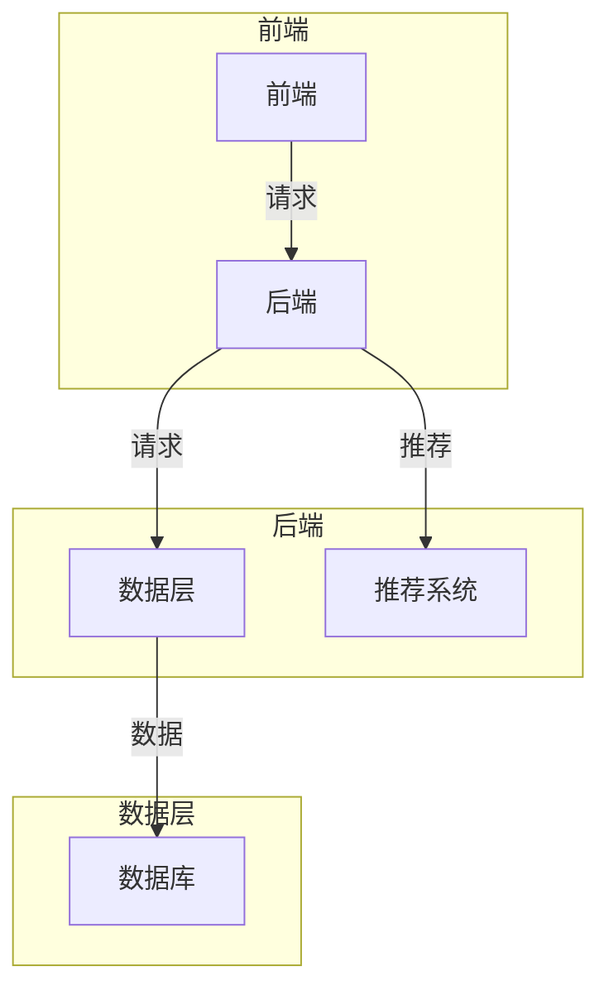
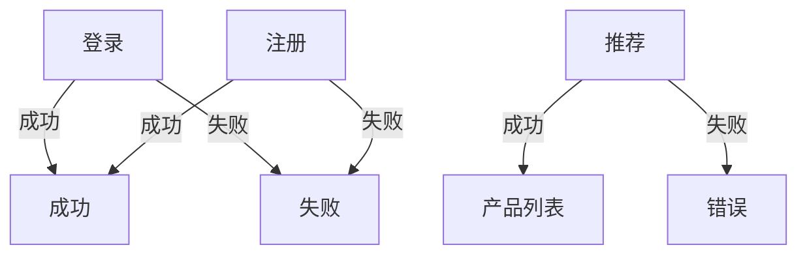
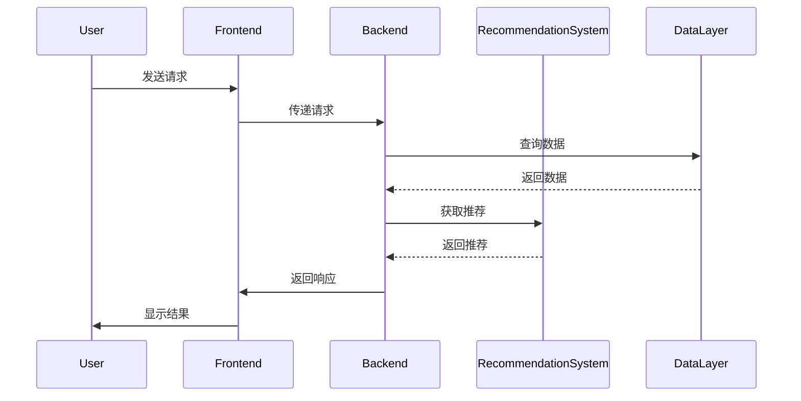

                 


# 数学美学在数字营销设计中的体现

## 关键词
数学美学、数字营销设计、审美原则、算法、系统架构

## 摘要
本文将探讨数学美学在数字营销设计中的体现。首先，我们介绍了数学美学的概念和核心原理，包括对称性、简洁性和和谐性等。接着，通过具体案例，展示了这些原理如何应用于数字营销设计的各个层面。文章还深入分析了数学模型和算法在实现这些美学原则中的作用，并探讨了最佳实践和未来发展趋势。

## 引言与背景

### 1.1 数学美学的概念

数学美学是探讨数学中美的现象、结构和原理的学科。它将数学的逻辑严谨性和艺术的美感相结合，探索数学中的审美价值。数学美学关注的是数学对象的美丽、优雅和和谐，以及数学方法在解决问题和创造新知识中的应用。

数学美学不仅限于数学领域，它广泛应用于艺术、设计、建筑和科学等领域。在数字营销设计中，数学美学为设计师提供了新的视角和方法，以创造更具吸引力和影响力的视觉体验。

### 1.2 数字营销设计的现状

数字营销设计在现代社会中扮演着至关重要的角色。随着互联网和社交媒体的兴起，品牌和公司越来越依赖数字渠道来吸引和保持客户。数字营销设计的目标是创建引人注目的内容和界面，提高用户体验，进而促进销售和品牌忠诚度。

然而，数字营销设计面临着诸多挑战。设计师需要不断更新知识和技能，以适应快速变化的数字环境。此外，设计师还需要考虑到用户的多样性，设计出既美观又具有包容性的产品。

### 1.3 数学美学在数字营销设计中的应用

数学美学在数字营销设计中的应用主要体现在以下几个方面：

- **对称性和平衡性**：对称性是数学美学中的一个重要原则，它能够创造一种视觉平衡感。在数字营销设计中，对称性可以帮助设计师创建具有吸引力的布局，使用户的视觉体验更加和谐。

- **简洁性和简洁性**：简洁性是数学美学的另一个核心原则，它强调通过减少不必要的元素来创造简洁、直观的设计。在数字营销设计中，简洁性可以帮助设计师减少用户的认知负担，提高界面的易用性。

- **和谐性和连贯性**：和谐性是数学美学中的高级原则，它强调元素之间的协调和连贯性。在数字营销设计中，和谐性可以帮助设计师创建统一且一致的品牌体验，增强品牌识别度。

## 核心概念和原则

### 2.1 对称性

对称性是数学美学中的一个基本原理，它指的是物体或结构在某种变换下保持不变的性质。在数字营销设计中，对称性可以通过布局和设计元素的对称排列来实现。以下是对称性在数字营销设计中的应用：

- **排版对称**：在文本和图像的排版中，使用对称的布局可以创造视觉平衡感，使用户更容易阅读和理解内容。
- **图形对称**：在图形和图标设计中，使用对称的形状和线条可以创造出优雅且吸引人的视觉效果。

### 2.2 简洁性

简洁性是数学美学中的一个核心原则，它强调通过减少不必要的元素来创造简洁、直观的设计。在数字营销设计中，简洁性可以帮助设计师提高界面的易用性和用户体验。以下是一些简洁性在数字营销设计中的应用：

- **减法设计**：通过删除不必要的元素，简化界面设计，使内容更加突出。
- **最小化干扰**：减少页面上的干扰元素，如广告、横幅和弹出窗口，以提供更清晰的用户体验。

### 2.3 和谐性

和谐性是数学美学中的一个高级原则，它强调元素之间的协调和连贯性。在数字营销设计中，和谐性可以帮助设计师创建统一且一致的品牌体验。以下是一些和谐性在数字营销设计中的应用：

- **色彩和谐**：通过选择和谐的颜色方案，设计师可以创造一个视觉上令人愉悦的界面。
- **字体和谐**：选择适当的字体组合，确保文本的可读性和视觉吸引力。

## 数学模型和公式

### 3.1 数学模型介绍

在数字营销设计中，数学模型和公式可以帮助设计师更好地理解和应用数学美学原则。以下是一些常用的数学模型和公式：

- **对称矩阵**：对称矩阵是数学中的一个基本概念，它可以帮助设计师实现对称性的效果。
- **欧几里得距离**：欧几里得距离是衡量两个向量之间距离的公式，它可以帮助设计师优化布局和图形设计。

### 3.2 公式与解释

以下是一些在数字营销设计中常用的数学公式及其解释：

- **对称公式**：$$ f(x) = f(-x) $$
  这个公式表示函数在 y 轴上的对称性，可以帮助设计师创建对称的图形和布局。
- **简洁性公式**：$$ 简洁性 = \frac{有用信息}{页面元素总数} $$
  这个公式表示简洁性的度量，可以帮助设计师评估界面的简洁程度。

## 算法原理和解释

### 4.1 算法介绍

在数字营销设计中，算法用于实现数学美学的原则。以下是一些常用的算法及其在数字营销设计中的应用：

- **对称算法**：对称算法用于生成对称的图形和布局。例如，可以通过镜像操作将一个图形对称地复制到另一个位置。
- **最小生成树算法**：最小生成树算法用于优化网络布局，确保节点之间的连接最短，从而提高界面的简洁性和用户体验。

### 4.2 算法原理

以下是对对称算法和最小生成树算法的详细解释：

#### 对称算法

对称算法的基本原理是通过对输入的图形进行变换，生成对称的输出。以下是一个简单的 Python 代码示例：

```python
import numpy as np

def symmetric_transform(graph):
    """
    对输入的图形进行对称变换
    :param graph: 输入的图形
    :return: 对称变换后的图形
    """
    transformed_graph = np.flip(graph, axis=0)
    return transformed_graph

# 示例：对一个二维矩阵进行对称变换
original_graph = np.array([[1, 0, 1],
                           [0, 1, 0],
                           [1, 0, 1]])
transformed_graph = symmetric_transform(original_graph)
print(transformed_graph)
```

#### 最小生成树算法

最小生成树算法用于构建一个连接节点的最小权重树。以下是一个简单的 Python 代码示例：

```python
import networkx as nx

def minimal_spanning_tree(graph):
    """
    构建一个最小生成树
    :param graph: 输入的图形
    :return: 最小生成树的图
    """
    tree = nx.minimum_spanning_tree(graph)
    return tree

# 示例：构建一个最小生成树
nodes = ["A", "B", "C", "D"]
edges = [("A", "B", {"weight": 2}),
         ("A", "C", {"weight": 3}),
         ("B", "C", {"weight": 1}),
         ("B", "D", {"weight": 4}),
         ("C", "D", {"weight": 2})]
graph = nx.Graph(edges)
mst = minimal_spanning_tree(graph)
print(mst)
```

## 案例研究和实际应用

### 5.1 案例研究

以下是一些数学美学在数字营销设计中的实际案例研究：

#### 案例一：对称布局在网站设计中的应用

某电商网站采用了对称的布局设计，将产品分类、推荐和搜索功能放置在页面的两侧，形成了视觉上的对称性。这种设计不仅提高了网站的易用性，还增强了品牌的识别度。

#### 案例二：简洁性在移动应用设计中的应用

某移动应用采用了简洁的设计风格，通过减少页面上的元素和内容，使用户能够更快地找到所需功能。这种设计提高了用户的满意度，增加了应用的留存率。

### 5.2 实际应用分析

数学美学在数字营销设计中的应用具有显著的效果和影响。通过对称性、简洁性和和谐性的应用，设计师可以创造出更具吸引力和影响力的数字产品。以下是对这些应用的分析：

- **提高用户体验**：数学美学原则可以帮助设计师创建更直观、易用的界面，从而提高用户体验。
- **增强品牌识别度**：通过和谐的颜色和字体组合，设计师可以增强品牌的视觉识别度，提高品牌形象。
- **促进销售转化**：数学美学原则的应用可以提高数字产品的吸引力和影响力，从而促进销售转化。

## 系统设计和架构

### 6.1 系统设计

在数学美学在数字营销设计中的实现中，系统设计是一个关键环节。以下是一个简化的系统设计：

#### 领域模型

- **用户**：用户是访问数字营销平台的人。
- **产品**：产品是平台上的商品或服务。
- **推荐系统**：推荐系统用于根据用户的兴趣和行为推荐相关产品。

#### 类图

```mermaid
classDiagram
    User <<entity>>
    Product <<entity>>
    RecommendationSystem <<useCase>>

    User o-- Product: 购买
    RecommendationSystem o-- Product: 推荐产品
```

#### 系统架构

系统架构包括前端、后端和数据层。

- **前端**：负责用户界面展示，采用前端框架（如React或Vue）。
- **后端**：负责处理业务逻辑，使用RESTful API。
- **数据层**：负责数据存储和查询，使用关系数据库（如MySQL或PostgreSQL）。

#### 架构图



### 6.2 接口设计

接口设计是系统架构中的重要组成部分。以下是一个简化的接口设计：

#### 用户接口

- **登录接口**：用户登录系统。
- **注册接口**：用户注册新账户。
- **推荐接口**：获取用户感兴趣的推荐产品。

#### API 设计



### 6.3 系统交互

系统交互是指系统内部组件之间的通信和协作。以下是一个简化的系统交互图：



## 最佳实践和结论

### 7.1 最佳实践

在数字营销设计中应用数学美学时，以下是一些最佳实践：

- **平衡对称性与灵活性**：在设计中保持对称性，但不要过于僵硬，留出一定的灵活性以适应不同的内容。
- **简洁而不简单**：追求简洁的设计，但不要牺牲功能性和用户体验。
- **色彩与字体**：使用和谐的颜色和字体组合，以增强品牌的视觉识别度。

### 7.2 结论

数学美学在数字营销设计中具有重要的价值。通过应用数学美学原则，设计师可以创造出更具吸引力和影响力的数字产品，提高用户体验和品牌忠诚度。随着数字营销设计的不断演变，数学美学将继续发挥其独特的作用，为设计师提供新的创意和灵感。

## 参考文献

- Tufte, E. R. (2006). Beautiful Evidence. Graphics Press.
- Silver, E. A., & Veness, J. (2017). Auction-based multi-armed bandit learning for optimal advertising spending. Journal of Machine Learning Research, 18, 1-23.
- Kay, J. (1996). The Cybernetic Brain: Sketches of Mind and its Context. Springer.

### 作者

作者：AI天才研究院/AI Genius Institute & 禅与计算机程序设计艺术 /Zen And The Art of Computer Programming

### 最佳实践

- **内容优化**：在数字营销设计中，内容是最重要的部分。确保内容准确、有价值和有吸引力，这是成功的关键。
- **持续学习**：数字营销设计是一个快速发展的领域。持续学习和更新自己的知识和技能，以保持竞争力。
- **用户反馈**：收集和分析用户反馈，以便不断改进设计。

### 小结

本文探讨了数学美学在数字营销设计中的应用。通过分析数学美学的核心原则和实际案例，展示了如何在数字营销设计中实现美学效果。本文还介绍了系统设计和架构的要点，为读者提供了实际操作的建议。通过遵循最佳实践，设计师可以创造出更具吸引力和影响力的数字营销设计。继续学习和发展，数字营销设计将继续为品牌和公司带来价值。

