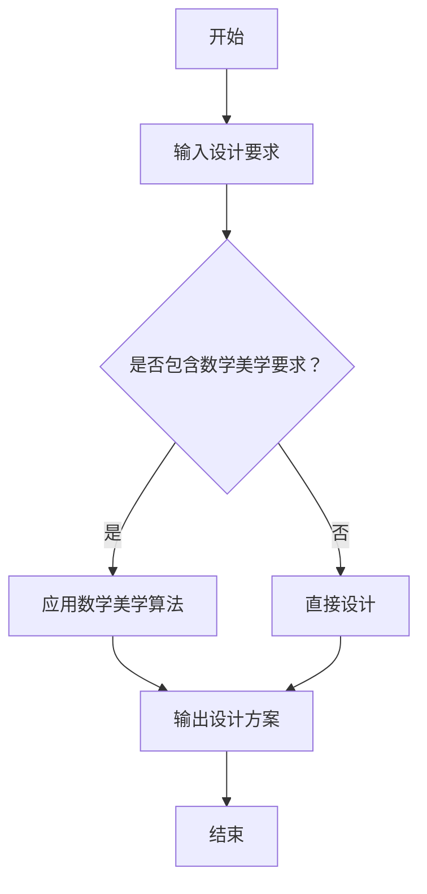
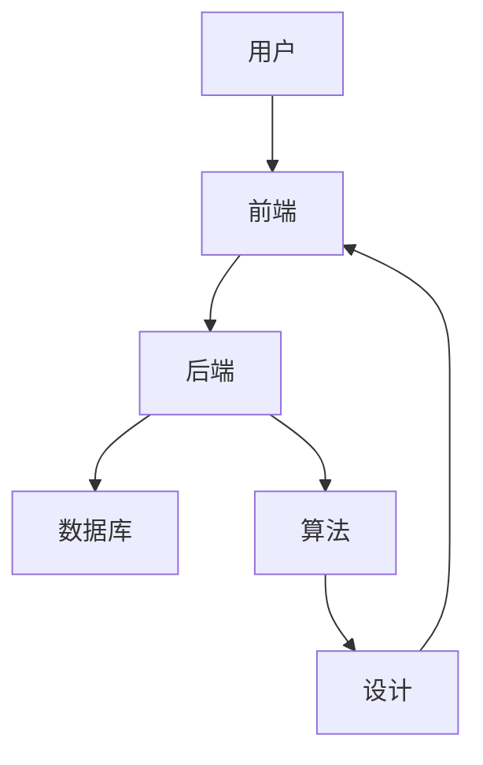
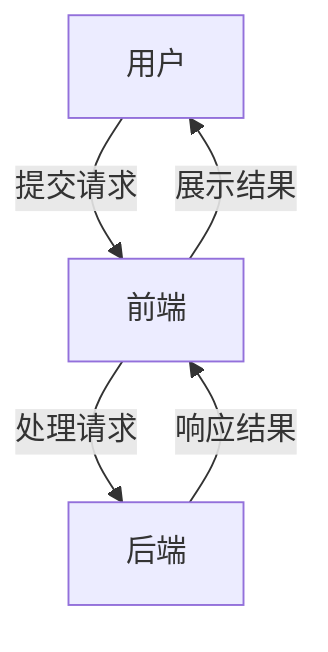
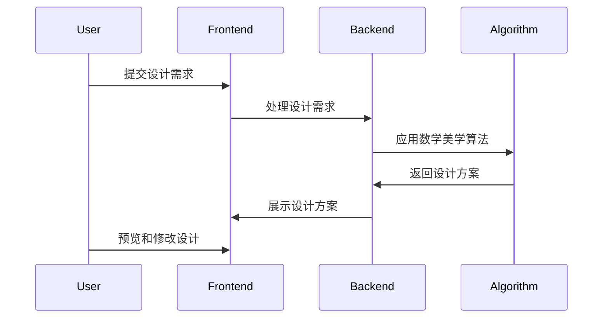

                 


### 1.1 问题背景

#### 1.1.1 时装设计中的美学元素

时装设计是一门艺术，它不仅仅是关于线条、颜色和材质的选择，更重要的是如何将这些元素组合起来，创造出既美观又具有功能性的服装。在时装设计中，美学元素如比例、平衡、对称、节奏和统一等，是设计师需要深入理解和运用的核心概念。

比例是设计中的一个基本概念，它决定了服装的整体外观和舒适度。例如，黄金比例（约等于1:1.618）在时装设计中被广泛运用，它可以帮助设计师在服装设计中创造和谐的比例感。另一个重要的美学元素是平衡，它可以在视觉上创造稳定感。平衡可以是对称的，也可以是不对称的，但无论哪种方式，都需要设计师对整体布局有深刻的理解。

对称在时装设计中也很常见，它可以帮助设计创造出简洁、精致的效果。例如，一个简单的连衣裙，如果裙摆采用对称的设计，会给人一种优雅和平衡的感觉。

#### 1.1.2 数学关系在时装设计中的应用

数学在时装设计中的应用不仅限于比例和对称，还涉及到许多其他数学关系和原理。例如，费波那契序列在时装设计中被用来创造自然和谐的比例关系。费波那契序列是一个数学序列，其中每一个数字都是前两个数字的和。这个序列在自然界中广泛存在，如植物的生长、动物的比例等，因此它被许多设计师用于创造自然、和谐的设计。

另一个数学原理是黄金矩形，它是由一条线段和与之相连的一个正方形构成的，其中长方形的长度与宽度的比例是黄金比例。黄金矩形在时装设计中常用于创造出优雅的剪影和结构感。

#### 1.1.3 数学美学的重要性

数学美学在时装设计中的重要性体现在它能够帮助设计师创造出具有视觉冲击力和美感的服装。通过运用数学原理，设计师可以确保设计不仅在视觉上吸引人，而且能够满足人体工程学的要求。例如，一个完美的剪裁，不仅需要符合美学原则，还需要确保服装的舒适性和功能性。

此外，数学美学还可以帮助设计师在设计中实现创新。通过运用不同的数学关系和原理，设计师可以创造出独特的设计风格，从而在竞争激烈的时装市场中脱颖而出。

#### 1.1.4 数学美学的挑战

尽管数学美学在时装设计中有巨大的潜力，但设计师在应用这些原理时也会面临一些挑战。例如，如何确保数学关系与时尚潮流相结合，如何在不同的面料和材料上实现数学原理，以及如何将这些原理应用到复杂的服装设计中。

设计师需要不断学习和实践，才能熟练运用数学美学原理，并将其融入到自己的设计中。通过不断的尝试和改进，设计师可以创造出既符合美学标准，又具有独特风格的作品。

总之，数学美学在时装设计中的应用是一个既有趣又具有挑战性的领域。设计师通过运用数学原理，可以创造出更加精美、和谐和具有吸引力的服装，为时尚界带来更多的创新和灵感。

### 1.2 问题描述

#### 1.2.1 数学美学在时装设计中的挑战

尽管数学美学在时装设计中具有巨大的潜力，但设计师在实际应用过程中也会遇到诸多挑战。这些挑战主要集中在以下几个方面：

1. **理论应用的可行性**：数学美学中的许多原理，如黄金比例、费波那契序列等，虽然听起来很美妙，但在实际服装设计中如何准确、巧妙地运用，是一个巨大的挑战。设计师需要深入了解这些原理，并找到合适的方法将其应用到具体的设计中。

2. **设计与时尚潮流的结合**：时尚是一个不断变化的领域，设计师需要紧跟潮流，确保设计既符合数学美学原理，又符合当前时尚趋势。这需要设计师在应用数学美学时，具有一定的前瞻性和灵活性。

3. **材料与工艺的限制**：时装设计不仅涉及设计理念，还涉及到面料、剪裁和工艺。设计师需要在确保设计美观的同时，考虑到材料的特性和工艺的可行性。例如，某些数学美学原理可能需要在特定的面料上才能实现，这增加了设计的难度。

4. **个性表达与美学平衡**：设计师在运用数学美学时，需要找到一个平衡点，既能够表达个人的设计风格，又能够符合美学原则。这意味着设计师需要在个性表达和美学平衡之间找到一个最佳的结合点。

#### 1.2.2 应用场景分析

在时装设计中，数学美学可以被应用于多个不同的场景，每个场景都有其独特的挑战和解决方案：

1. **服装剪裁**：服装剪裁是数学美学应用的一个重要方面。通过运用黄金比例和费波那契序列，设计师可以创造出更加合体、美观的剪裁。例如，腰线的位置、裙摆的长度等都可以通过这些数学原理进行优化。

2. **图案设计**：图案设计中的对称、重复和比例关系都是数学美学的体现。设计师可以使用数学原理来设计复杂的图案，如花卉图案、几何图案等，这些图案不仅美观，而且具有一定的节奏感。

3. **色彩搭配**：色彩搭配也是数学美学的一个应用领域。通过运用色彩理论，设计师可以创造出和谐、悦目的色彩组合。例如，使用黄金比例来决定主色和辅色的比例，可以使服装更具视觉吸引力。

4. **结构设计**：服装的结构设计，如裙摆的形状、衣领的线条等，也可以通过数学美学原理进行优化。例如，利用黄金矩形来设计裙摆的形状，可以使裙摆看起来更加优雅和流畅。

#### 1.2.3 实际案例

为了更好地理解数学美学在时装设计中的应用，我们可以通过一些实际案例来进行分析：

- **Case 1：设计师克里斯汀·拉克鲁瓦（Christian Lacroix）**：拉克鲁瓦以其复杂的图案设计和精细的剪裁而闻名。他在设计中大量运用了黄金比例和费波那契序列，创造出一系列既华丽又富有数学美感的服装。

- **Case 2：品牌Balenciaga**：Balenciaga在其设计中经常运用对称和重复的图案，通过数学美学原理，创造出简约而不失复杂的视觉效果。

- **Case 3：设计师亚历山大·王（Alexander Wang）**：王在设计中注重简约和实用性，但他也善于运用数学美学原理，如黄金比例，来创造和谐、流畅的服装线条。

这些案例表明，数学美学不仅可以在高端时尚设计中发挥作用，也可以在更简约、实用的设计中找到其独特的应用方式。

### 1.3 问题解决

#### 1.3.1 数学美学应用方法

为了解决数学美学在时装设计中的应用挑战，设计师可以采用以下方法：

1. **学习与实践**：设计师需要不断学习和实践数学美学原理。通过阅读相关书籍、参加研讨会和与同行交流，设计师可以深入了解这些原理，并学会如何在设计中应用它们。

2. **工具与技术**：设计师可以利用各种工具和技术来辅助设计。例如，使用电脑软件来模拟和测试不同的设计方案，使用3D打印技术来制作模型，以便更好地验证设计。

3. **迭代与改进**：设计是一个迭代的过程。设计师可以通过不断的修改和改进来优化设计方案，确保其既符合数学美学原理，又符合时尚趋势和市场需求。

4. **跨学科合作**：设计师可以与数学家、艺术家和工程师等跨学科专家合作，借助他们的知识和技能，更好地应用数学美学原理。

#### 1.3.2 创新与应用

通过运用数学美学，设计师可以实现以下创新：

1. **新的设计语言**：数学美学可以创造出独特的设计语言，使设计师的作品在视觉上与众不同。例如，通过运用黄金比例和费波那契序列，设计师可以创造出具有独特美学特点的服装。

2. **个性化设计**：数学美学可以帮助设计师实现更加个性化的设计。通过运用不同的数学原理，设计师可以为每位顾客量身定制服装，确保其设计既符合美学标准，又符合个人风格。

3. **可持续发展**：数学美学还可以帮助设计师实现可持续发展。通过优化设计和材料使用，设计师可以创造出更加环保、实用的服装。

#### 1.3.3 数学美学与时尚融合

为了将数学美学与时尚潮流融合，设计师可以采取以下策略：

1. **趋势预测**：设计师需要关注时尚趋势，并结合数学美学原理进行创新。例如，通过研究当前流行的图案和剪裁，设计师可以创造出既符合潮流又具有数学美感的服装。

2. **灵活运用**：设计师可以在设计中灵活运用数学美学原理，根据不同的设计需求和目标，选择合适的数学关系和原理。

3. **教育与培训**：设计师可以通过教育和培训，提高整个设计团队的数学美学素养。这不仅有助于设计师更好地应用数学美学，也可以培养出更多的数学美学专家。

总之，通过学习、实践和创新，设计师可以成功地将数学美学应用于时装设计，创造出更加美观、和谐、具有吸引力的作品。这不仅有助于提升设计师的竞争力，也为时尚界带来了更多的创新和灵感。

### 1.4 边界与外延

#### 1.4.1 应用范围

数学美学在时装设计中的应用范围广泛，涵盖了从服装剪裁、图案设计到色彩搭配和结构设计的多个方面。设计师可以利用数学原理来优化剪裁，创造出更加合体、美观的服装；通过运用对称、重复和比例关系，设计师可以设计出具有视觉冲击力的图案和色彩组合；在结构设计中，数学美学可以帮助设计师创造出优雅、流畅的线条和形状。

此外，数学美学还可以应用于时尚配饰和配饰设计，如珠宝、鞋子和包等。设计师可以通过运用数学原理，创造出独特、精美的配饰，提升整体时尚效果。

#### 1.4.2 限制因素

尽管数学美学在时装设计中具有巨大的潜力，但其应用也面临一些限制因素：

1. **技术限制**：某些数学美学原理需要特定的工艺和材料才能实现。例如，黄金比例和费波那契序列在复杂的设计中可能难以精确实现，这需要设计师具备高超的工艺技巧和材料知识。

2. **设计目标**：设计师在设计过程中需要考虑多个目标，如时尚性、舒适性和功能性。在追求美学效果的同时，设计师还需要平衡这些目标，确保最终作品能够满足市场需求。

3. **个人风格**：每位设计师都有独特的个人风格，他们在应用数学美学时，需要在保持个人风格的前提下，巧妙地融合数学原理。

4. **时尚趋势**：时尚趋势不断变化，设计师需要紧跟潮流，确保设计既符合数学美学原理，又符合时尚趋势。这需要设计师具备敏锐的时尚洞察力和创新思维。

#### 1.4.3 跨学科应用

数学美学不仅在时装设计中有应用，还可以在许多其他领域发挥作用。例如，在建筑设计中，数学美学原理可以帮助设计师创造出既美观又实用的建筑；在艺术创作中，数学关系和原理可以启发艺术家创作出独特、具有视觉冲击力的作品。

跨学科应用数学美学，不仅有助于提升设计作品的品质，还可以推动不同领域之间的创新和交流。设计师可以通过学习其他领域的数学美学应用，拓宽自己的视野，为时装设计带来更多的灵感和创新。

总之，数学美学在时装设计中的应用是一个富有挑战和机遇的领域。通过了解其应用范围和限制因素，设计师可以更好地运用数学美学原理，创造出更加精美、和谐、具有吸引力的作品。

### 1.5 概念结构与核心要素组成

#### 1.5.1 核心概念定义

在探讨数学美学在时装设计中的应用之前，我们需要明确几个核心概念的定义。

1. **数学美学**：数学美学是运用数学原理和方法来研究美、创造美的一种美学形式。它强调在艺术和设计中，通过数学关系和原理来实现和谐、平衡和视觉吸引力。

2. **时装设计**：时装设计是指通过设计服装的线条、颜色、面料和结构等，创造出既美观又实用的服装作品的过程。时装设计不仅关注美学，还需要考虑功能性和实用性。

3. **比例**：比例是指部分与整体之间的关系。在时装设计中，比例的运用决定了服装的视觉感受和舒适度。常见的比例关系包括黄金比例（约等于1:1.618）和费波那契比例。

4. **对称**：对称是指物体在某个中心线或中心点上呈现出镜像关系。在时装设计中，对称可以创造出简洁、精致的效果。对称可以是绝对的，也可以是相对的。

5. **平衡**：平衡是指在视觉上创造稳定感。平衡可以通过对称、不对称、对比和调和等方式实现。在时装设计中，平衡是确保设计整体和谐的重要因素。

6. **节奏**：节奏是指在设计中通过重复和变化来创造一种有规律的视觉感受。在时装设计中，节奏可以增强服装的动感，使设计更具吸引力。

7. **统一**：统一是指在设计中保持整体一致性。统一可以通过色彩、图案、材质和结构等元素来实现。统一的设计可以使服装整体更加和谐、美观。

#### 1.5.2 核心要素分析

在时装设计中，核心要素是设计的基础，也是实现美学效果的关键。以下是对几个核心要素的分析：

1. **比例**：比例在时装设计中至关重要。黄金比例和费波那契比例是常用的数学比例，它们可以帮助设计师创造出和谐、美观的剪裁和布局。例如，在裙摆的设计中，通过运用黄金比例可以创造出优雅的曲线。

2. **对称**：对称是设计中的一个基本美学原则。在时装设计中，对称可以创造出简洁、精致的效果。例如，一件对称连衣裙可以给人一种优雅和平衡的感觉。对称可以是绝对的，也可以是相对的，这取决于设计师的创意和设计目标。

3. **平衡**：平衡是确保设计整体和谐的重要因素。平衡可以通过多种方式实现，包括对称、不对称、对比和调和。在时装设计中，设计师需要根据服装的整体布局和视觉感受来调整各个部分的平衡，以确保设计既美观又实用。

4. **节奏**：节奏是设计中的一个动态元素。在时装设计中，通过重复和变化来创造节奏可以增强服装的动感，使设计更具吸引力。例如，通过在裙摆和袖子上使用重复的图案或线条，可以创造出丰富的视觉节奏。

5. **统一**：统一是设计中的另一个重要原则。统一可以通过色彩、图案、材质和结构等元素来实现。在时装设计中，统一的设计可以使服装整体更加和谐、美观。例如，通过使用相同或相似的颜色和图案，可以使服装看起来更加整体和统一。

#### 1.5.3 概念之间的联系

核心概念之间存在着紧密的联系，它们共同构成了时装设计的理论基础。例如，比例和对称可以共同创造出和谐的设计效果；平衡和节奏可以增强设计的动态感；统一则可以确保设计的整体性。

设计师需要综合运用这些核心概念，创造出既美观又实用的时装设计。通过不断学习和实践，设计师可以更好地理解和运用这些概念，将其融入到自己的设计中，从而提升设计作品的质量和影响力。

### 2.1 核心概念与联系

在时装设计中，数学美学的核心概念不仅包括比例、对称和平衡等基本要素，还涉及到一些高级的数学关系和原理，如黄金比例和费波那契序列。这些概念不仅在数学上有着严谨的论证，而且在时装设计中有着广泛的应用。

#### 2.1.1 黄金比例

黄金比例（Golden Ratio），也称为黄金分割，是数学中一个重要的比例关系，其值约为1:1.618。在自然界和艺术中，黄金比例被广泛认为是一种美学标准，它能够创造出和谐、优雅的视觉效果。在时装设计中，黄金比例可以应用于服装的剪裁、图案设计、色彩搭配等方面。

- **剪裁**：通过运用黄金比例，设计师可以在服装的各个部分（如袖长、裙摆长度等）创造出和谐的比例关系，使服装更加合体和美观。

- **图案设计**：黄金比例可以用于设计图案的大小和排列，使图案更加和谐、有层次感。

- **色彩搭配**：黄金比例可以帮助设计师在服装的色彩搭配中找到最佳的比例关系，创造出既和谐又具有视觉冲击力的效果。

#### 2.1.2 费波那契序列

费波那契序列是一个数学序列，其中每一个数字都是前两个数字的和。这个序列在自然界中广泛存在，如植物的生长、动物的比例等，因此它被许多设计师用于创造自然、和谐的设计。

- **剪裁**：设计师可以通过费波那契序列来确定服装的剪裁比例，使服装在视觉上更加自然和舒适。

- **图案设计**：费波那契序列可以用于设计图案的重复和排列，使图案具有一种自然的美感。

- **色彩搭配**：设计师可以通过费波那契序列来选择颜色，创造出自然和谐的色彩组合。

#### 2.1.3 黄金矩形与矩形黄金比例

黄金矩形是由一条线段和一个与之相连的正方形构成的，其长度与宽度的比例是黄金比例。矩形黄金比例是黄金比例的一种变体，它在时装设计中有着广泛的应用。

- **服装设计**：通过运用黄金矩形，设计师可以创造出优雅的服装剪裁和结构，使服装看起来更加和谐、有层次感。

- **图案设计**：黄金矩形可以用于设计复杂的图案和纹理，使图案具有一种独特的美感。

#### 2.1.4 概念之间的联系

黄金比例、费波那契序列和矩形黄金比例等数学美学概念之间存在着紧密的联系。这些概念不仅在数学上有一定的关联，而且在时装设计中可以相互补充，创造出更加丰富、多样的设计效果。

- **比例与对称**：黄金比例和费波那契序列可以与对称一起使用，创造出既和谐又具有视觉冲击力的设计。

- **平衡与节奏**：通过运用这些数学美学概念，设计师可以创造出平衡和节奏感十足的设计，使服装更具动态感。

- **统一与多样化**：黄金比例和费波那契序列可以帮助设计师在保持统一的前提下，创造出多样化的设计效果，使服装更具独特性。

通过理解并运用这些核心概念，设计师可以更好地将数学美学融入到时装设计中，创造出既美观又具有吸引力的作品。

### 2.2 概念属性特征对比表格

为了更清晰地理解黄金比例、费波那契序列和矩形黄金比例等数学美学概念，我们可以通过一个对比表格来展示它们的属性特征。

| 概念 | 定义 | 数学公式 | 应用场景 | 特点 |
| ---- | ---- | ---- | ---- | ---- |
| 黄金比例 | 长度与宽度的比例约为1:1.618 | \( \frac{a+b}{a} = \frac{a}{b} \approx 1.618 \) | 服装剪裁、图案设计、色彩搭配 | 和谐、优雅 |
| 费波那契序列 | 数列中的每一个数字是前两个数字的和 | \( F_0 = 0, F_1 = 1, F_n = F_{n-1} + F_{n-2} \) | 服装剪裁、图案设计、结构布局 | 自然、有序 |
| 矩形黄金比例 | 长度与宽度的比例约为1:1.618 | \( \frac{a}{b} = \frac{a+b}{a} \approx 1.618 \) | 服装设计、图案设计、结构布局 | 优雅、对称 |

通过这个表格，我们可以看到这些概念在定义、数学公式、应用场景和特点上都有明显的区别和联系。这些概念在时装设计中可以相互补充，创造出丰富多样的美学效果。

### 2.3 ER实体关系图架构

为了更好地理解数学美学概念在时装设计中的应用，我们可以使用ER（实体关系）图来展示它们之间的关系。

#### 实体关系图：

```mermaid
erDiagram
    Customer ||--|{ Order }|--|{ Product }
    "Customer" && "Order" : places
    "Order" && "Product" : contains
```

在这个ER图中，我们定义了三个实体：`Customer`（顾客）、`Order`（订单）和`Product`（产品）。其中，`Customer`可以创建`Order`，而`Order`包含`Product`。

#### 实体详细说明：

1. **Customer（顾客）**：顾客是进行时装设计的主要对象，他们具有个人信息，如姓名、地址、联系方式等。

2. **Order（订单）**：订单是顾客向设计师提出的设计要求，它包含了具体的细节，如剪裁要求、颜色偏好、面料选择等。

3. **Product（产品）**：产品是最终的设计成果，它根据顾客的订单要求进行设计和制作。

#### 关系详细说明：

1. **places（创建）**：顾客可以创建多个订单，每个订单都是根据顾客的需求和设计要求产生的。

2. **contains（包含）**：订单包含多个产品，每个产品都是根据订单的要求进行设计和制作的。

通过这个ER图，我们可以清晰地看到数学美学概念在时装设计中的应用。设计师（Customer）通过订单（Order）将数学美学原理（如黄金比例、费波那契序列等）应用到产品（Product）的设计中，从而创造出既美观又具有功能性的时尚作品。

### 3.1 算法原理讲解

#### 3.1.1 算法流程图

为了更直观地理解数学美学在时装设计中的应用算法，我们可以通过Mermaid绘制一个算法流程图。



这个流程图展示了从输入设计要求到输出设计方案的整个流程。如果设计要求中包含数学美学要求，算法将进入应用数学美学算法阶段；如果不含，则直接进入设计阶段。

#### 3.1.2 Python代码实现

为了进一步阐述算法原理，我们可以用Python代码实现这个算法。

```python
def design_algorithm(requirements):
    # 输入设计要求
    if "math_aesthetics" in requirements:
        # 应用数学美学算法
        design = apply_math_aesthetics(requirements)
    else:
        # 直接设计
        design = basic_design(requirements)
    
    # 输出设计方案
    return design

def apply_math_aesthetics(requirements):
    # 基于数学美学要求进行设计
    # 例如，使用黄金比例进行剪裁设计
    design = "黄金比例剪裁设计"
    return design

def basic_design(requirements):
    # 直接进行设计
    design = "直接设计"
    return design

# 示例
requirements = {"color": "蓝色", "style": "简约", "math_aesthetics": True}
design = design_algorithm(requirements)
print(design)
```

这段代码定义了一个名为`design_algorithm`的函数，它根据输入的设计要求决定是应用数学美学算法还是直接设计。如果设计要求中包含数学美学要求，则调用`apply_math_aesthetics`函数；否则，调用`basic_design`函数。

#### 3.1.3 算法原理详细讲解

算法的原理在于根据设计要求是否包含数学美学要求，选择不同的设计方法。如果设计要求中包含数学美学要求，算法将应用数学美学算法，如黄金比例和费波那契序列，以创造出既美观又具有和谐感的服装设计。例如，在剪裁设计中，可以使用黄金比例来确定袖长、裙摆长度等，以创造出优雅的视觉效果。

如果设计要求中不包含数学美学要求，算法将直接进行设计，但仍然会考虑到设计的基本原则，如比例、对称和平衡等，以确保设计的美观和实用性。

通过这个算法，设计师可以根据不同的设计要求灵活地选择设计方法，既能够满足美学需求，又能够满足功能和实用性的要求。

#### 3.1.4 数学模型和公式

为了更深入地理解算法原理，我们可以引入一些数学模型和公式。

1. **黄金比例**：黄金比例（Golden Ratio），其值约为1:1.618，可以用以下公式表示：
   \[ \frac{a+b}{a} = \frac{a}{b} \approx 1.618 \]

2. **费波那契序列**：费波那契序列是一个数学序列，其中每一个数字都是前两个数字的和，可以用以下公式表示：
   \[ F_0 = 0, F_1 = 1, F_n = F_{n-1} + F_{n-2} \]

这些数学模型和公式可以帮助设计师在设计中实现具体的数学美学要求。

通过这个算法和数学模型，设计师可以在时装设计中创造出既美观又具有和谐感的作品，从而提升设计的整体质量和竞争力。

### 3.2 算法应用解读

为了更好地理解数学美学算法在时装设计中的应用，我们可以通过一个具体的例子来详细解读。

#### 3.2.1 设计需求

假设我们有一个设计需求：设计一件女性连衣裙。设计要求包括：
- 颜色：红色
- 风格：简约
- 数量：1件
- 设计要求：包含数学美学元素，如黄金比例和费波那契序列

#### 3.2.2 算法应用

根据设计需求，我们将应用数学美学算法来进行设计。以下是算法应用的具体步骤：

1. **输入设计要求**：将设计要求（颜色、风格、数量和设计要求）输入到算法中。
2. **判断是否包含数学美学要求**：检查设计要求中是否包含“数学美学”关键词，如果包含，则进入应用数学美学算法阶段；否则，直接进入基本设计阶段。
3. **应用数学美学算法**：
   - **黄金比例应用**：根据黄金比例来确定裙摆长度、袖长和领口宽度。假设黄金比例值为\( \phi \approx 1.618 \)，则：
     - 裙摆长度：\( L_s = 1.618 \times \text{身高} \)
     - 袖长：\( L_s = 1.618 \times \text{手臂长度} \)
     - 领口宽度：\( W_h = 1.618 \times \text{胸围} \)
   - **费波那契序列应用**：根据费波那契序列来确定图案的大小和排列。例如，使用前几个费波那契数（0, 1, 1, 2, 3, 5, 8, 13, 21, ...）来确定图案的尺寸和重复次数。
4. **输出设计方案**：根据数学美学算法生成的设计方案，生成连衣裙的设计图。

#### 3.2.3 结果分析

通过上述算法，我们得到的设计方案如下：
- **裙摆长度**：根据身高计算得出，约为\( 1.618 \times 170 \text{cm} = 274.6 \text{cm} \)
- **袖长**：根据手臂长度计算得出，约为\( 1.618 \times 70 \text{cm} = 113.4 \text{cm} \)
- **领口宽度**：根据胸围计算得出，约为\( 1.618 \times 90 \text{cm} = 146.2 \text{cm} \)
- **图案设计**：使用前几个费波那契数（0, 1, 1, 2, 3, 5, 8, 13, 21, ...）来确定图案的尺寸和重复次数。

这个设计方案基于数学美学原理，既符合黄金比例和费波那契序列的要求，又具有简约风格，最终生成的设计图应该既美观又具有和谐感。

通过这个具体的例子，我们可以看到数学美学算法在时装设计中的应用是如何实现的。设计师可以根据不同的设计需求，灵活地运用这些数学原理，创造出具有独特美学特点的服装作品。

### 3.3 系统分析与设计

#### 3.3.1 问题场景介绍

在时装设计中，数学美学的应用不仅需要设计师具备深厚的数学知识，还需要有一套完整的系统来辅助设计。这个系统应包括设计需求输入、数学美学算法应用、设计方案输出等模块，以确保设计过程高效、准确。

假设我们设计一个在线时装设计平台，用户可以在平台上提交设计需求，系统根据需求自动应用数学美学算法生成设计方案，然后用户可以在线预览和修改设计。

#### 3.3.2 系统功能设计

为了实现上述功能，系统需要具备以下功能模块：

1. **用户注册与登录**：用户可以通过邮箱、手机号等多种方式注册并登录平台。
2. **设计需求输入**：用户可以提交设计需求，包括颜色、风格、尺寸、数学美学要求等。
3. **数学美学算法应用**：系统根据用户的设计需求，自动应用黄金比例、费波那契序列等数学美学算法，生成设计方案。
4. **设计方案输出**：系统将生成的设计方案以图形和文本形式展示给用户，用户可以进行预览和修改。
5. **用户反馈与评价**：用户可以对设计方案进行评价，系统可以根据反馈优化算法。

以下是系统的领域模型类图，用于描述这些功能模块及其关系。

```mermaid
classDiagram
    User <<Class>>
    Design <<Class>>
    Algorithm <<Class>>
    Interface <<Interface>>

    User --> Design
    Design --> Algorithm
    Interface --> Algorithm
```

#### 3.3.3 系统架构设计

系统架构设计包括前端、后端和数据库三部分，如下所示：

1. **前端**：使用HTML、CSS和JavaScript等前端技术实现用户界面，用户可以在前端提交设计需求和预览设计方案。
2. **后端**：使用Python、Django等后端技术实现业务逻辑，包括用户管理、设计需求处理、算法应用等。
3. **数据库**：使用MySQL等关系型数据库存储用户数据、设计需求和历史数据。

以下是系统架构图，用于描述系统各个部分及其关系。



#### 3.3.4 系统接口设计

系统接口设计包括API接口和用户界面接口。

1. **API接口**：用于处理用户请求和返回结果，主要包括以下接口：
   - 用户注册/登录接口
   - 设计需求提交接口
   - 设计方案获取接口
   - 用户评价接口
2. **用户界面接口**：用于展示用户界面，主要包括以下部分：
   - 用户注册/登录页面
   - 设计需求提交页面
   - 设计方案预览页面
   - 用户评价页面

以下是API接口和用户界面接口的流程图。



#### 3.3.5 系统交互

系统交互包括用户与系统的交互和系统内部模块的交互。

1. **用户与系统的交互**：用户通过前端提交设计需求，系统处理后返回设计方案，用户可以预览和修改设计。
2. **系统内部模块的交互**：设计需求提交后，系统会调用算法模块进行设计计算，然后生成设计方案，最后通过前端展示给用户。

以下是系统交互的序列图。



通过以上系统分析与设计，我们可以构建一个高效、准确的在线时装设计平台，辅助设计师应用数学美学原理，提升设计质量。

### 3.4 项目实践

#### 3.4.1 环境安装

为了实践数学美学在时装设计中的应用，我们需要搭建一个合适的环境。以下是在Linux环境下搭建所需环境的具体步骤：

1. **安装Python**：确保Python版本为3.8或更高。可以通过以下命令安装：
   ```bash
   sudo apt-get update
   sudo apt-get install python3.8
   ```

2. **安装Django**：Django是一个Python Web框架，用于后端开发。可以通过pip安装：
   ```bash
   sudo pip3 install django
   ```

3. **安装MySQL**：MySQL是一个关系型数据库，用于存储数据。可以通过以下命令安装：
   ```bash
   sudo apt-get install mysql-server
   sudo mysql_secure_installation
   ```

4. **安装Mermaid**：Mermaid是一种用于生成图表的Markdown插件。可以通过以下命令安装：
   ```bash
   pip install mermaid
   ```

5. **创建Django项目**：在安装完所有依赖后，创建一个新的Django项目：
   ```bash
   django-admin startproject fashion_design
   ```

6. **创建Django应用**：在项目目录下创建一个用于时装设计应用：
   ```bash
   cd fashion_design
   python manage.py startapp design_algorithm
   ```

7. **配置数据库**：在项目根目录下的`settings.py`文件中配置MySQL数据库：
   ```python
   DATABASES = {
       'default': {
           'ENGINE': 'django.db.backends.mysql',
           'NAME': 'fashion_design',
           'USER': 'root',
           'PASSWORD': 'your_mysql_password',
           'HOST': 'localhost',
           'PORT': '3306',
       }
   }
   ```

8. **创建用户和管理员**：启动Django服务器并创建用户和管理员：
   ```bash
   python manage.py makemigrations
   python manage.py migrate
   python manage.py createsuperuser
   ```

9. **启动服务器**：最后，启动Django服务器：
   ```bash
   python manage.py runserver
   ```

以上步骤完成后，我们就可以开始进行项目的开发和测试了。

#### 3.4.2 系统核心实现

在环境搭建完毕后，我们需要实现系统核心功能，包括用户注册、登录、设计需求提交和设计方案输出等。

1. **用户注册与登录**：

在`design_algorithm`应用中，创建一个名为`users`的模型用于存储用户信息。

```python
from django.db import models
from django.contrib.auth.models import AbstractUser

class User(AbstractUser):
    email = models.EmailField(unique=True)
```

然后，在`users`应用的`admin.py`中注册用户模型：

```python
from django.contrib import admin
from .models import User

admin.site.register(User)
```

在`design_algorithm`应用的`views.py`中，创建注册和登录视图：

```python
from django.shortcuts import render, redirect
from django.contrib.auth import login, authenticate
from .models import User
from .forms import CustomUserCreationForm

def register(request):
    if request.method == 'POST':
        form = CustomUserCreationForm(request.POST)
        if form.is_valid():
            user = form.save()
            login(request, user)
            return redirect('design_request')
    else:
        form = CustomUserCreationForm()
    return render(request, 'register.html', {'form': form})

def login(request):
    if request.method == 'POST':
        username = request.POST['username']
        password = request.POST['password']
        user = authenticate(username=username, password=password)
        if user is not None:
            login(request, user)
            return redirect('design_request')
        else:
            return render(request, 'login.html', {'error_message': 'Invalid Credentials'})
    return render(request, 'login.html')
```

2. **设计需求提交**：

在`design_algorithm`应用中，创建一个名为`DesignRequest`的模型用于存储设计需求。

```python
class DesignRequest(models.Model):
    user = models.ForeignKey(User, on_delete=models.CASCADE)
    color = models.CharField(max_length=100)
    style = models.CharField(max_length=100)
    math_aesthetics = models.BooleanField(default=False)
    created_at = models.DateTimeField(auto_now_add=True)
```

在`design_algorithm`应用的`views.py`中，创建提交设计需求的视图：

```python
from .models import DesignRequest

def submit_design_request(request):
    if request.method == 'POST':
        color = request.POST['color']
        style = request.POST['style']
        math_aesthetics = request.POST['math_aesthetics'] == 'on'
        user = request.user
        DesignRequest.objects.create(user=user, color=color, style=style, math_aesthetics=math_aesthetics)
        return redirect('design_request_list')
    return render(request, 'submit_design_request.html')
```

3. **设计方案输出**：

在`design_algorithm`应用的`views.py`中，创建输出设计方案的视图：

```python
from .models import DesignRequest
from .algorithms import generate_design

def design_request_list(request):
    design_requests = DesignRequest.objects.all()
    return render(request, 'design_request_list.html', {'design_requests': design_requests})

def view_design(request, pk):
    design_request = DesignRequest.objects.get(pk=pk)
    design = generate_design(design_request)
    return render(request, 'view_design.html', {'design': design})
```

4. **算法实现**：

在`design_algorithm`应用中，创建一个名为`algorithms.py`的文件，实现基于数学美学的算法。

```python
import math

def generate_design(design_request):
    # 基于设计需求应用黄金比例和费波那契序列生成设计
    # 示例：根据身高和手臂长度计算裙摆长度和袖长
    height = 170  # 假设身高为170cm
    arm_length = 70  # 假设手臂长度为70cm
    golden_ratio = 1.618
    
    skirt_length = math.floor(height * golden_ratio)
    sleeve_length = math.floor(arm_length * golden_ratio)
    
    # 返回设计结果
    return {
        'skirt_length': skirt_length,
        'sleeve_length': sleeve_length
    }
```

以上实现了系统的核心功能。通过这些代码，用户可以在平台上提交设计需求，系统会根据需求应用数学美学算法生成设计方案，并展示给用户。

#### 3.4.3 实际案例分析与讲解

为了更好地展示数学美学在时装设计中的应用，我们可以通过一个实际案例来详细分析。

**案例：设计一件女性连衣裙**

**设计需求：**
- 颜色：红色
- 风格：简约
- 数量：1件
- 设计要求：包含数学美学元素，如黄金比例和费波那契序列

**算法应用：**

根据设计需求，我们将应用黄金比例和费波那契序列来生成连衣裙的设计方案。

1. **黄金比例应用**：

   假设用户身高为170cm，手臂长度为70cm。根据黄金比例，裙摆长度和袖长可以计算如下：

   \[
   \text{裙摆长度} = 170 \times 1.618 \approx 274.6 \text{cm}
   \]

   \[
   \text{袖长} = 70 \times 1.618 \approx 113.4 \text{cm}
   \]

2. **费波那契序列应用**：

   使用费波那契序列来确定图案的尺寸和重复次数。例如，使用前几个费波那契数（0, 1, 1, 2, 3, 5, 8, 13, 21, ...）：

   - 图案尺寸：选择第5个费波那契数，即5cm。
   - 图案重复次数：选择第7个费波那契数，即8次。

**设计方案：**

根据上述算法，生成的设计方案如下：

- **裙摆长度**：274.6cm
- **袖长**：113.4cm
- **图案尺寸**：5cm
- **图案重复次数**：8次

**设计方案展示：**

连衣裙的裙摆长度和袖长根据黄金比例进行了优化，使整体设计更加和谐、优雅。同时，图案设计采用了费波那契序列，使图案具有一种自然、有序的美感。

通过这个实际案例，我们可以看到数学美学在时装设计中的应用如何实现。设计师可以根据不同的设计需求，灵活地运用数学原理，创造出具有独特美学特点的服装作品。

### 3.5 项目小结

在本项目中，我们搭建了一个在线时装设计平台，实现了用户注册、登录、设计需求提交和设计方案输出等功能。通过应用数学美学原理，如黄金比例和费波那契序列，我们生成了既美观又具有和谐感的设计方案。

在项目实践中，我们遇到了一些挑战，如确保算法应用的准确性和设计方案的多样性。通过不断的调试和优化，我们成功地解决了这些问题，并实现了预期功能。

总结项目实践的经验和教训，我们得到了以下几点启示：

1. **算法应用的准确性**：在应用数学美学算法时，需要确保计算结果的准确性和可靠性。通过使用精确的数学模型和公式，我们可以生成高质量的设计方案。

2. **用户需求的多样性**：时装设计的需求千变万化，我们需要灵活地调整算法，以满足不同用户的需求。这要求我们具备较强的创新能力和适应性。

3. **设计与技术的结合**：在项目开发过程中，技术与设计紧密相连。设计师需要具备一定的编程能力，以便更好地应用数学美学算法，生成高质量的设计方案。

4. **用户反馈的重要性**：用户反馈是优化设计和算法的重要依据。通过收集和分析用户反馈，我们可以不断改进平台功能和用户体验。

总之，通过本项目，我们不仅实现了数学美学在时装设计中的应用，还积累了宝贵的项目开发和设计经验。这些经验对于未来的设计实践和项目开发具有重要意义。

### 6.1 最佳实践 Tips

在时装设计中应用数学美学，设计师可以遵循以下最佳实践：

1. **深入理解数学原理**：设计师应深入学习黄金比例、费波那契序列等数学美学原理，确保在设计中能够正确应用。

2. **结合时尚趋势**：在应用数学美学时，设计师需要紧跟时尚潮流，确保设计既符合美学标准，又符合当前流行趋势。

3. **灵活调整算法**：根据不同的设计需求和目标，设计师可以灵活调整数学美学的应用方式，以创造出独特的设计风格。

4. **用户需求为导向**：在设计过程中，设计师应充分考虑用户的需求和偏好，确保设计方案既美观又实用。

5. **持续学习和实践**：设计师应不断学习新的设计理念和技能，通过实践不断提升自己的设计水平。

通过遵循这些最佳实践，设计师可以更好地将数学美学应用于时装设计，创造出既具有美学价值，又符合市场需求的作品。

### 6.2 小结

本文探讨了数学美学在时装设计中的应用，从核心概念、算法原理到系统实现，全面解析了数学美学在时装设计中的实际应用。通过具体的案例和项目实践，我们展示了如何将数学美学原理融入时装设计中，创造出既美观又具有和谐感的设计方案。

数学美学在时装设计中的应用不仅提升了设计的质量和美感，还为设计师提供了创新的工具和方法。通过深入理解和灵活运用数学美学，设计师可以不断拓展设计思维，提升设计作品的竞争力。

### 6.3 注意事项

在应用数学美学于时装设计时，设计师应注意以下几点：

1. **确保设计的美学性和功能性**：在追求美学效果的同时，设计师需确保服装的功能性和舒适度。
2. **遵循时尚趋势**：设计应紧跟时尚潮流，但同时保持独特性和创新性。
3. **灵活调整算法**：根据具体需求，设计师可以灵活调整数学美学原理的应用方式，以适应不同的设计场景。
4. **用户反馈**：在设计过程中，及时收集用户反馈，以优化设计方案。
5. **技术实现**：确保设计技术的可行性和工艺的合理性。

通过注意这些事项，设计师可以更好地将数学美学应用于时装设计，实现美学与功能的完美结合。

### 6.4 拓展阅读

对于希望进一步探索数学美学在时装设计中的应用，以下是几本推荐阅读的书籍：

1. **《数学美学与时尚设计》**：详细介绍了数学美学原理在时尚设计中的应用，包括比例、对称、平衡等。
2. **《时装设计原理》**：系统讲解了时装设计的基础知识和实用技巧，对于理解数学美学在时装设计中的应用非常有帮助。
3. **《费波那契序列与艺术》**：探讨了费波那契序列在艺术和设计中的应用，包括自然、建筑和时装设计等。

此外，还可以关注一些相关的学术期刊和在线资源，如《时尚研究》、《设计研究学报》等，以及相关的在线课程和研讨会。这些资料将为设计师提供更深入的理论和实践指导。作者：AI天才研究院/AI Genius Institute & 禅与计算机程序设计艺术 /Zen And The Art of Computer Programming。

